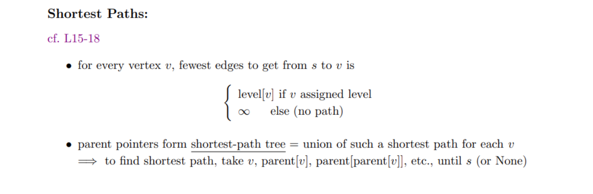
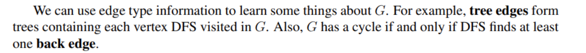
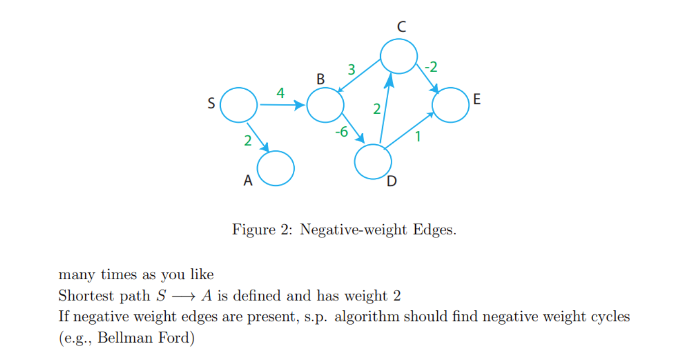
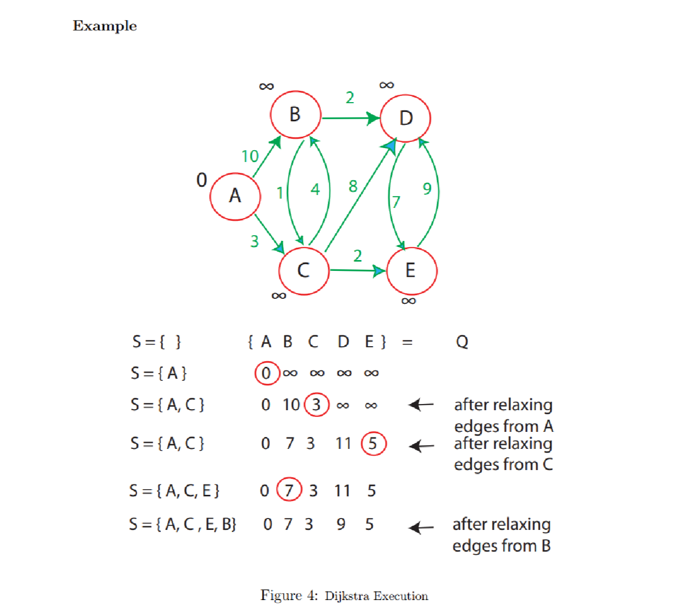
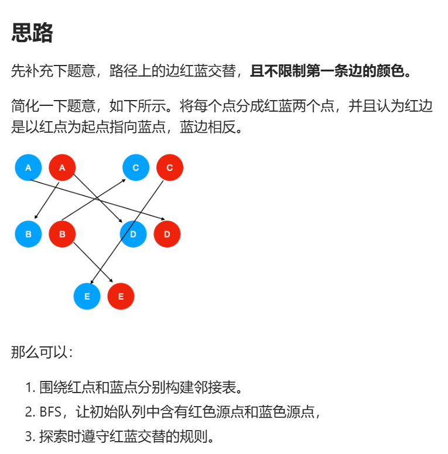

# Graph Representation
## Theory
> [!important]
> 
> This representation is bad for finding successor for current state, so we typically use adjacency list to represent graph:
> 
> 


## Code Implementations
> [!code]
```python
# First, Vertex and Graph classes for directed graphs

class CS161Vertex:
    def __init__(self, v):
        self.inNeighbors = []
        self.outNeighbors = []
        self.value = v
        # useful for DFS
        self.inTime = None
        self.outTime = None
        self.status = "unvisited"
        
    def hasOutNeighbor(self,v):
        if v in self.outNeighbors:
            return True
        return False
        
    def hasInNeighbor(self,v):
        if v in self.inNeighbors:
            return True
        return False
    
    def hasNeighbor(self,v):
        if v in self.inNeighbors or v in self.outNeighbors:
            return True
        return False
    
    def getOutNeighbors(self):
        return self.outNeighbors
    
    def getInNeighbors(self):
        return self.inNeighbors
        
    def addOutNeighbor(self,v):
        self.outNeighbors.append(v)
    
    def addInNeighbor(self,v):
        self.inNeighbors.append(v)
    
    def __str__(self):
        return str(self.value) 
        
# This is a directed graph class for use in CS161.
# It can also be used as an undirected graph by adding edges in both directions.
class CS161Graph:
    def __init__(self):
        self.vertices = []

    def addVertex(self,n):
        self.vertices.append(n)
        
    # add a directed edge from CS161Node u to CS161Node v
    def addDiEdge(self,u,v):
        u.addOutNeighbor(v)
        v.addInNeighbor(u)
        
    # add edges in both directions between u and v
    def addBiEdge(self,u,v):
        self.addDiEdge(u,v)
        self.addDiEdge(v,u)
        
    # get a list of all the directed edges
    # directed edges are a list of two vertices
    def getDirEdges(self):
        ret = []
        for v in self.vertices:
            ret += [ [v, u] for u in v.outNeighbors ]
        return ret
    
    def __str__(self):
        ret = "CS161Graph with:\n"
        ret += "\t Vertices:\n\t"
        for v in self.vertices:
            ret += str(v) + ","
        ret += "\n"
        ret += "\t Edges:\n\t"
        for a,b in self.getDirEdges():
            ret += "(" + str(a) + "," + str(b) + ") "
        ret += "\n"
        return ret
```


# Breadth First Search
## Algorithm
> [!algo]
> 

## Runtime Analysis
> [!important]
> 


## Code Implementations
> [!code]
```python
def BFS(w, G):
    for v in G.vertices:
        v.status = "unvisited"
    n = len(G.vertices)
    Ls = [ [] for i in range(n) ]
    Ls[0] = [w]
    w.status = "visited"
    for i in range(n):
        for u in Ls[i]:
            for v in u.getOutNeighbors():
                if v.status == "unvisited":
                    v.status = "visited"
                    Ls[i+1].append(v)
    return Ls

# This is the graph that was on the slides in class (vertex 1 was Kevin Bacon)
G = CS161Graph()
for i in range(7):
    G.addVertex( CS161Vertex( i ) ) 
V = G.vertices
for pairs in [ (0,2), (0,4), (0, 6), (1, 3), (1, 4), (2, 3), (2, 6), (4, 5), (5,6) ]:
    G.addBiEdge( V[pairs[0]], V[pairs[1]] )
print(G)

levels = BFS(G.vertices[1], G)
for i in range(len(levels)):
    print("Level", i, ":")
    for j in levels[i]:
        print("\t", j)
    
# now what's the distance from node 1 to node 6?
for i in range(len(levels)):
    if G.vertices[6] in levels[i]:
        print("distance from 1 to 6 is", i)
        break
```


## Applications
### Shortest Path - Unweighted
> [!example]
> 


# Depth First Search
## Algorithm
> [!algo]
> 
> Note that for runtime analysis, we have:
> 1. **DFS(...)** visit each vertex once, $O(|V|)$(Outer loop execute V times)
> 2. **DFSVisit(...)** called once per vertex, for each call to the vertex $v\in V$, the runtime is $O(|Adj(v)|)$, so for all the vertices we have $O(\sum\limits_{v\in V}|Adj(v)|)=O(|E|)$ due to handshaking lemma for directed graph.(Sum of the degree is double the cardinality of edges for undirected graph and equal the cardinality fro directed graph).
> 3. In total, we have runtime $O(|V|+|E|)$ and actually $\Theta(|V|+|E|)$

## Edge Classification
> [!important]
> 
> After executing DFS on graph G, every edge in G can be classified as one of these four edge types. 
> 
> To do this, we need to keep track of when a vertex is first being disocvered (visited) in the search (recorded in start time[v]), and when it is finished (recorded in finish time[v]), that is, when its adjacency list has been examined completely. These timestamps are integers between 1 and 2|V |, since there is one discovery event and one finishing event for each of the |V | vertices.
> 
> **Remarks:**
> 1. **Tree Edges:** Also called parent pointer, if we backtrack the path created by DFS, we can constructed a tree, since each node first visited during DFS has only one parent. 
> 2. **Forward Edges:** An edge pointing from a node to its descent.(Grandchildren). **Detailedly, an edge (u, v) is a forward edge, if v is finished and start time[u] < start time[v].** 
> 3. **Backward Edges:** An edge from a node to its ancestor. (Grandparent)
> 4. **Cross Edges:** An edge pointing from one subtree to another subtree. No hierarchical relationship between. **An edge (u, v) is a cross edge, if v is finished and start time[u] > start time[v]**
> 5. **For undirected graph**, we will never have forward edges, all forward edges will be classified as a backward edges or tree edges, since we can just change the direction and make the starting node being visited by its descent.
> 6. **For undirected graph**, we will never have cross edge, it will be classified as a tree edge or a backward edge.


## DFS Runtime Analysis
> [!important]
> 


## Algorithm Implementation
> [!code] 
> 
```python
def DFS_helper( w, currentTime, verbose ):
    if verbose:
        print("Time", currentTime, ":\t entering", w)
    w.inTime = currentTime
    currentTime += 1
    w.status = "inprogress"
    for v in w.getOutNeighbors():
        if v.status == "unvisited":
            currentTime = DFS_helper(v, currentTime, verbose)
            currentTime += 1
    w.outTime = currentTime
    w.status = "done"
    if verbose:
        print("Time", currentTime, ":\t leaving", w)
    return currentTime
        
def DFS( w, G, verbose=False ):
    for v in G.vertices:
        v.status = "unvisited"
        v.inTime = None
        v.outTime = None
    return DFS_helper( w, 0, verbose )
```


## Applications
> It turns out that we can use the edge type information to perform lots of interesting tasks.
### Cycle Detection
> [!concept]
> 
> The question is: Even is there is a cycle in our directed graph, how do we make sure that the DFS will go through that cycle so that the directed edge $v_k\to v_0$ will be visited?
> 
> The answer is that during DFS, we look for all the neighbors of any particular vertices, so if we start at $v_0$, we will definitely visit $v_1$ during the for loop and so on, so we will definitely visit $v_k$ some time and loop back to $v_0$.
> 
> The key logic is that we can return from the higher level of recursion before we return from the lower level of the recursion. So $v_k$ will visit $v_0$ before $v_0$ finish visiting and $v_0$ won't finish visiting before $v_k$ finish visiting.
> 
> Thus, when we first visit $v_k$, $v_0$ is still on the recursion stack(since it is not finishing visiting), thus $v_0$ is the ancestor of $v_k$ and thus $v_k\to v_0$ is a back edge, which finishes the proof.


### Job Scheduling
> [!concept]
> 


### Topological Sort
> [!algo]
> 
> It means, for any node $v$, I will put this node in `order` after I have expanded all its children and descents. In this way, the node that has the most prerequisites will be added first to the order and the starting node will be added last. Then we just reverse the `order` and get the topological sort result.

> [!proof] Correctness
> 
> What this tells us is that the nodes that have more edge dependencies will be added to `order` first, so that later on when we do reversion operation, we get the correct topological sort result.

> [!code] Method 1: DFS - Reverse Method
> 
```python
def topologicalSortDFS(graph):
    visited = {}
    recStack = {}
    topoList = []

    for node in graph:
        visited[node] = False
        recStack[node] = False

    for node in graph:
        if not visited[node]:
            if dfsHelper(graph, visited, recStack, topoList, node):
                raise LookupError("Cycle Detected")

    return list(reversed(topoList))


def dfsHelper(graph, visited, recStack, topoList, currNode):
    visited[currNode] = True
    
    # Used for cycle detection
    recStack[currNode] = True

    for successor in graph[currNode]:
        if not visited[successor]:
            if dfsHelper(graph, visited, recStack, topoList, successor):
                return True
        elif recStack[successor]:
            return True

    recStack[currNode] = False
    topoList.append(currNode)
```

> [!code] Method 2: Kahn's Algorithm
```python
def topologicalSortQueue(graph):
    q = queue.Queue()
    topoList = []

    # 1. Find all the nodes that have no incoming edges(source nodes)
    nodeDegreeMap = findDegrees(graph)

    sourceNodes = list(map(lambda elem: elem[0], filter(lambda elem: elem[1]["in"] == 0,nodeDegreeMap.items() )))


    # 2. Put all the souce nodes into the queue
    for node in sourceNodes:
        q.put(node)


    # 3. While the queue is not empty
    while not q.empty():
        # 3.1 Pop the node from the front of the queue
        currNode = q.get()

        # 3.2 Append that source node to the topo ordering list
        topoList.append(currNode)

        # 3.3 For each neighbor of the current node
        for neighbor in graph[currNode]:
            # 3.3.1 Decrease the in degree of this neighbor by one(deleting the incoming edges)
            nodeDegreeMap[neighbor]["in"] -= 1

            # 3.3.2 If the neighbor becomes a source due to 0 in-degree, append it to the queue
            if nodeDegreeMap[neighbor]["in"] == 0:
                q.put(neighbor)


    # 4. Finally, If the length of the topo ordering list is less than the number of nodes,
    # then there is a cycle in the graph and no topological ordering is possible
    # Since if there is a cycle, then the in-degree of the nodes in the cycle will always be
    # bigger than or equal to 1 and there will be no source nodes added to the queue and the
    # while loop is terminated prematurely.
    if len(topoList) < len(graph):
        raise LookupError("Cycle Detected!")

    return topoList


def findDegrees(graph) -> Dict:
    nodeDegreeMap = {}

    for node in graph:
        nodeDegreeMap[node] = {"in": 0, "out": 0}

    for node in graph:
        for neighbor in graph[node]:
            nodeDegreeMap[node]["out"] += 1
            nodeDegreeMap[neighbor]["in"] += 1

    return nodeDegreeMap


if __name__ == "__main__":  
    testGraphMulti = {"A": ["B","C"],  
                  "B": ["C","D","E"],  
                  "C": ["F"],  
                  "D": [],  
                  "E": ["F"],  
                  "F": []}  
  
    testGraphEmpty = {  
  
    }  
  
    testGraphCycle = {  
        "A": ["B", "C"],  
        "B": ["C", "D", "E"],  
        "C": ["D"],  
        "D": [],  
        "E": ["A"]  
    }
```


# Shortest Path Problem(SSSP)
## Problem Definition
> [!def]
> 


## Time Complexity
> [!important]
> 


## Weighted Shortest Path - BFS
> [!important]
> 


# SCC Problems
## Basic Idea
> [!important]
> 
> The two algorithms we are going to introduce are Kosaraju's Algorithm and Tarjan's Algorithm, which utilize DFS to find the SCC of a directed graph.


## Kosaraju's Algorithm
### Algorithm Ideas
> [!algo]
> 

> [!warning] Alternative
> 


### Algorithm Example
> [!example]
> 


### Proof of Correctness
> [!proof]
> 


### Code Implementations
> [!code]
```python
def DFS_helper( w, currentTime, ordering, verbose ):
    if verbose:
        print("Time", currentTime, ":\t entering", w)
    w.inTime = currentTime
    currentTime += 1
    w.status = "inprogress"
    for v in w.getOutNeighbors():
        if v.status == "unvisited":
            currentTime = DFS_helper(v, currentTime, ordering, verbose)
            currentTime += 1
    w.outTime = currentTime
    w.status = "done"
    ordering.insert(0, w)
    if verbose:
        print("Time", currentTime, ":\t leaving", w)
    return currentTime
       
# This is a version of DFS which outputs vertices in the order that DFS leaves them.
# We used it for topological sorting in Lecture 9
def SCC( G, verbose=False ):
    ordering = []
    for v in G.vertices:
        v.status = "unvisited"
        v.inTime = None
        v.outTime = None
    currentTime = 0
    for w in G.vertices:
        if w.status == "unvisited":
            currentTime = DFS_helper( w, currentTime, ordering, verbose )
        currentTime += 1
    # now reverse all the edges
    E = G.getDirEdges()
    for x,y in E:
        G.reverseEdge(x,y)
   
    # and do it again, but this time in the order "ordering"
    SCCs = []
    for v in ordering:
        v.status = "unvisited"
        v.inTime = None
        v.outTime = None
    currentTime = 0 
    for w in ordering:
        visited = [] 
        if w.status == "unvisited":
            currentTime = DFS_helper( w, currentTime, visited, verbose )
            SCCs.append(visited[:])
        currentTime += 1
    return SCCs


SCCs = SCC(G, False)
for X in SCCs:
    print ([str(x) for x in X])
```


## Tarjan's Algorithm
### Low-Link Values/Disc
> [!def]
> 
> **Disc**(Discovering Time): This is the time when a node is visited 1st time whiel DFS traversal. In the above graph, the node index(value in the node) is the disc value for each node.

> [!warning]
> Low-link value are highly dependent on the order of DFS traversal.
> 


### Algorithmic Example
> [!example]
> 
> The result is obtained from starting DFS from node A.


### Algorithmic Idea
> [!algo]
> - Pick any node to start DFS
> - For any unvisited node `u`, set its `Disc` and `Low` to the timestamp when it is first visited along the way.
> 	- `dics[u] = Time`
> 	- `low[u] = Time`
> - After we have visited `u`, we will visit its neighbors and update the `low[u]` as follows, for each of its neighbor `v`:
> 	- Tree Edge: If `v` has not been visited, then after `v` finishes its DFS, update `low[u] = min(low[u], low[v])`
> 	- Back Edge: If `v` has been visited and is also on the dfs stack(ancestor nodes), then update `low[u] = min(low[u], disc[v])`.
> - After all of `u`'s neighbors have finished their DFS, if `low[u]` is updated to the point such that `low[u] = disc[u]`, then we know that `u` is the head of an SCC and we will start to pop nodes from the stack:
> 	- Pop element from the stack until the element is equal to node `u`。
> 
> 


### Code Implementations
> [!code]
> https://www.geeksforgeeks.org/tarjan-algorithm-find-strongly-connected-components/
```python
    def tarJanAlgo(self, graph):

        def dfsHelper(u, disc, low, ast, rst):

            nonlocal time
            nonlocal SCCs
            # 1. Once the node u is first visited, set the disc[u] and low[u] to 1st visited time
            disc[u] = time
            low[u] = time
            time += 1
            ast[u] = True
            rst.append(u)

            # 2. Start visit its neighbors
            for v in graph[u]:
                # Tree edge case: update low[u] = min(low[u], low[v]) after v has finished its DFS
                if disc[v] == -1:
                    dfsHelper(v, disc, low, ast, rst)
                    low[u] = min(low[u], low[v])
                elif ast[v]:
                    # Back edge case(visited and ancestor node): update low[u] = min(low[u], disc[v])
                    low[u] = min(low[u], disc[v])

            # 3. u has done visited, and we need to see if this node is the start of an SCC
            if disc[u] == low[u]:
                temp = []
                # 3.1 We have to pop the node from the same group
                w = -1
                while w != u:
                    w = rst.pop()
                    temp.append(w)
                    ast[w] = False  # backtrack
                SCCs.append(temp)

        def SCCPrinter(SCCList):
            for group in SCCList:
                print(group)

        numNode = len(graph)
        time = 0  # discover time ticker
        SCCs = []

        # 1. Initialize
        # 1.1 Discover time and low-link values
        disc = [-1 for _ in range(numNode)]
        low = [-1 for _ in range(numNode)]

        # 1.2 Stack to keep track of the visiting stage, for fast access
        auxStack = [False for _ in range(numNode)]

        # 1.3 Real stack data structure
        readStack = []

        # 2. Start the DFS process
        for i in range(numNode):
            if disc[i] == -1:
                dfsHelper(i, disc, low, auxStack, readStack)

        return SCCs
```


## Other Problems with Tarjan's Algorithms
### Find Cut Vertices
> [!task]
> The cut vertices/articulation points represent vulnerabilities in a connected network - single points whose failure spolit the network into 2 or more components.
> 
> A very naive implementation would be to remove node from the graph one by one, see if any one of the node would disconnect the graph. 
> - Time Complexity: $O(V(V+E))$
> - Auxiliary Space: $O(V+E)$
> 
> But we could still use tarjan's algorithm to find such nodes, the idea is as follows: In the DFS tree, a vertex $u$ is an articulation point if:
> - $u$ is the root of a DFS subtree and has at least two children.
> - $u$ is not the root of a DFS tree and it has a child $v$ such that no vertex in the subtree rooted at $v$ has a back edge to one of the ancestors in the DFS tree rooted at $u$.
> - Time Complexity: $O(V+E)$
> - Auxiliary Space: $O(V+E)$

> [!example]
> 

> [!code]
> 
```python
def dfsCut(u, parent, disc, low):
	nonlocal time
	nonlocal cuts
	disc[u] = time
	low[u] = time
	time += 1
	children = 0

	for v in graph[u]:
		if disc[v] == -1:
			# The DFS tree should not contain the node that has been visited before
			children += 1
			dfsCut(v, u, disc, low)
			low[u] = min(low[u], low[v])

			# Check if the child(doesn't have a parent) has the property 2:
			# The back edge cannot reach any of the ancestors of u, then u is the cut vertice
			if low[v] >= disc[u] and parent != -1:
				cuts.append(u)
		elif v != parent:
			low[u] = min(low[u], disc[v])

	# Check if the current node is a root node and has at least two children
	if parent == -1 and children > 1:
		cuts.append(u)
```


### Bi-connected Graph
> [!def]
> 

> [!example]
> 

> [!code]
```python


```


# Useful Lemmas in SSSP
## Subpaths of Shortest Paths 
> [!property]
> 


## Relaxation Operation is Safe
> [!concept]
> 
> The term "safe" in "relaxation is safe" means that performing relaxation operations will not lead to an overestimation or underestimation of the true shortest path distances. 
> 
> It ensures that the algorithm (such as Dijkstra's or Bellman-Ford algorithm) will correctly find the shortest paths, assuming the algorithm's other conditions (such as no negative-weight cycles in the case of Dijkstra's algorithm) are met. 
> 
> This is a fundamental concept ensuring the algorithms' correctness and efficiency in solving shortest path problems.


## Simple Shortest Paths
> [!important]
> 


## Negative Edges Detection
> [!important]
> 


## Negative Cycle Detection
> [!important]
> In graphs where edges can have negative weights, if there is a cycle whose total weight is negative, it's theoretically possible to reduce the path length indefinitely by going around the cycle multiple times. In such a case, the shortest path is undefined because you can always have a shorter path by traversing the negative cycle more times.
> 


# SSSP on DAGs
## DAG Relaxation
> [!def]
> 


## Algorithm
> [!concept] Shortest Path on DAGs can be solved with TS
> 


## Time Complexity
> [!important]
> 


# Dijkstra's Algorithm
## Algorithm&Example
> [!algo]
> 


## Dijkstra Complexity
> [!important]
> 


## Proof of Correctness
> [!proof]
> 


## Code Implementations
> [!code]
```python
# make a random graph
# This is G(n,p), where we have n vertices and each (directed) edge is present with probability p.
# if you pass in a set of weights, then the weights are chosen uniformly from that set.
# otherwise all weights are 1
def randomGraph(n,p,wts=[1]):
    G = CS161Graph()
    V = [ CS161Vertex(x) for x in range(n) ]
    for v in V:
        G.addVertex(v)
    for v in V:
        for w in V:
            if v != w:
                if random() < p:
                    G.addDiEdge(v,w,wt=choice(wts))
    return G


# first let's implement this with an array, not a priprity queue
def dijkstraDumb(w,G):
    for v in G.vertices:
        v.estD = math.inf
    w.estD = 0
    unsureVertices = G.vertices[:]
    while len(unsureVertices) > 0:
        # find the u with the minimum estD in the dumbest way possible
        u = None
        minD = math.inf
        for x in unsureVertices:
            if x.estD < minD:
                minD = x.estD
                u = x
        if u == None:
            # then there is nothing more that I can reach
            return
        # update u's neighbors
        for v,wt in u.getOutNeighborsWithWeights():
            if u.estD + wt < v.estD:
                v.estD = u.estD + wt
                v.parent = u
        unsureVertices.remove(u)
    # that's it!  Now each vertex holds estD which is its distance from w

def dijkstraDumb_shortestPaths(w,G):
    dijkstraDumb(w,G)
    # okay, now what are all the shortest paths?
    for v in G.vertices:
        if v.estD == math.inf:
            print("Cannot reach " + str(v))
            continue
        path = []
        current = v
        while current != w:
            path.append(current)
            current = current.parent
        path.append(current)
        path.reverse()
        print([ str(x) for x in path ])


# test on a random graph
G = randomGraph(5,.2)
print(G)
dijkstraDumb_shortestPaths(G.vertices[0], G)


# now let's try this with a heap
def dijkstra(w,G):
    for v in G.vertices:
        v.estD = math.inf
    w.estD = 0
    unsureVertices = heapdict.heapdict()
    for v in G.vertices:
        unsureVertices[v] = v.estD
    while len(unsureVertices) > 0:
        # find the u with the minimum estD, using the heap
        u, dist = unsureVertices.popitem() 
        if u.estD == math.inf:
            # then there is nothing more that I can reach
            return
        # update u's neighbors
        for v,wt in u.getOutNeighborsWithWeights():
            if u.estD + wt < v.estD:
                v.estD = u.estD + wt
                unsureVertices[v] = u.estD + wt #update the key in the heapdict
                v.parent = u
    # that's it!  Now each vertex holds estD which is its distance from w


def dijkstra_shortestPaths(w,G):
    dijkstra(w,G)
    # okay, now what are all the shortest paths?
    for v in G.vertices:
        if v.estD == math.inf:
            print("Cannot reach " + str(v))
            continue
        path = []
        current = v
        while current != w:
            path.append(current)
            current = current.parent
        path.append(current)
        path.reverse()
        print([ str(x) for x in path ])

# test on a random graph
G = randomGraph(5,.4,[1,2,3,4,5])
print(G)
dijkstra_shortestPaths(G.vertices[0], G)
```


# Bellman Ford
> [!algo]
> When there is negative weights edge in the graph, Dijkstra's algorithm won't work. We opt for Bellman Ford if there is no negative cycles.
> 
> Runtime is $\Theta(VE)$.
> 
> Note that if the graph is a DAG, then there is no negative cycles.

> [!thm]
> 

> [!corollary] 
> 

> [!bug] Important
> If there is negative cycles, finding shortest path is NP hard.


# LeetCode Problems
## DFS
### No 547 Number of Provinces
> [!def] 
> 

> [!code]
> 由于本题是无向图，于是思路比较简单，就是利用[Depth First Search](Graph_Algorithms.md#Depth%20First%20Search)。每进行一次`DFS`, 看一下是否还有剩余节点， 如果有则说明当前的`DFS`没有覆盖到所有的城市，当前`DFS`的结果记为一个省份， 然后从下一个没有覆盖到的城市开始进行下一次`DFS`。
```java
class Solution {
    public int findCircleNum(int[][] isConnected) {

        int num_cities = isConnected.length;


        int num_province = 0;

        Map<Integer, Boolean> visited = new HashMap<>();

        
        for (int i = 0; i < num_cities; i++) {
            visited.put(i, false);
        }

        for (int i = 0; i < num_cities; i++) {
            if (visited.get(i) == false) {
                num_province++;
                dfs(visited, i, isConnected);
            }
        }
        return num_province;
    }

    public void dfs(Map<Integer, Boolean> visited, int starting_node, int[][] adj_matrix) {
        
        visited.put(starting_node, true);
        List<Integer> successors = findSuccessors(starting_node, adj_matrix, visited);
        if (successors.size() == 0) {
            return;
        }

        for (Integer node: successors) {
            dfs(visited, node, adj_matrix);
        }
    }


    public List<Integer> findSuccessors(int curr_node, int[][] adj_matrix, Map<Integer, Boolean> visited) {

        List<Integer> adj_list = new ArrayList<>();
        for (int i = 0; i < adj_matrix[curr_node].length; i++) {
            if (adj_matrix[curr_node][i] == 1 && visited.get(i) == false) {
                adj_list.add(i);
            }
        }
        return adj_list;
    }

}
```


### No 841 Keys and Rooms
> [!def]
> 

> [!code]
> 本题使用拓扑排序比较复杂，用`DFS`即可，只要判断最终`visited`中为`True`的节点数量是否等于房间数即可。
```java
class Solution {

    public boolean canVisitAllRooms(List<List<Integer>> rooms) {
List<Integer> res = new ArrayList<>();

        Map<Integer, Boolean> visited = new HashMap<>();
        Map<Integer, Boolean> recStack = new HashMap<>();

        for (int i = 0; i < rooms.size(); i++) {
            visited.put(i, false);
            recStack.put(i, false);
        }

        dfs(0, rooms, visited, recStack);

        return visited.entrySet()
                    .stream()
                    .filter(elem -> elem.getValue())
                    .map(elem -> elem.getKey())
                    .collect(Collectors.toList())
                    .size()
         == rooms.size();
    }

    public boolean dfs(Integer node
                        , List<List<Integer>> rooms
                        , Map<Integer, Boolean> visited
                        , Map<Integer, Boolean> recStack) {
        visited.put(node, true);

        if (recStack.get(node)) {
            return true;
        }
        recStack.put(node, true);

        List<Integer> neighbors = rooms.get(node);
        for (Integer neighbor: neighbors) {
            if (!visited.get(neighbor)) {
                if (dfs(neighbor, rooms, visited, recStack)) {
                    return true;
                }
            }
            
        }
    
        recStack.put(node, false);
        return false;
    }

}
```


### No 1376 通知所有员工所需的时间
> [!task]
> 
```java
class Solution {
	// DFS Solution
    public int numOfMinutes(int n, int headID, int[] manager, int[] informTime) {
        // 使用 HashMap 来构建图
        Map<Integer, List<Integer>> g = new HashMap<Integer, List<Integer>>();
        for (int i = 0; i < n; i++) {
            g.putIfAbsent(manager[i], new ArrayList<Integer>());
            g.get(manager[i]).add(i);
        }
        // 从根节点开始进行 DFS 并返回总时间
        return dfs(headID, informTime, g);
    }

    public int dfs(int cur, int[] informTime, Map<Integer, List<Integer>> g) {
        int res = 0;
        // 遍历当前节点的邻居节点
        for (int neighbor : g.getOrDefault(cur, new ArrayList<Integer>())) {
            res = Math.max(res, dfs(neighbor, informTime, g));
        }
        // 返回当前节点被通知需要的时间以及所有邻居节点被通知所需的最大时间
        return informTime[cur] + res;
    }
}
```

### No 797 所有可能的路径
> [!task]
> 
```java
class Solution {
    public List<List<Integer>> allPathsSourceTarget(int[][] graph) {


        List<List<Integer>> res = new ArrayList<>();
        ArrayList<Integer> path = new ArrayList<>();
        path.add(0);
        dfs(res, 0, graph.length - 1, path, graph);
        return res;
    }

    public void dfs(List<List<Integer>> res, int currNode, int targetNode, ArrayList<Integer> path,  int[][] adjs) {
        
        if (currNode == targetNode) {
            res.add((ArrayList)path.clone());
        }

        for (int neighbor: adjs[currNode]) {
            path.add(neighbor);
            dfs(res, neighbor, targetNode, path, adjs);
            path.remove(path.size() - 1);
        }
    }
} 
```

### No 1466 重新规划路线
> [!task]
> 
```java
class Solution {
    public int minReorder(int n, int[][] connections) {

        // 构建adj list
        List<int[]>[] adjs = new List[n];

        for (int i = 0; i < n; i++) {
            adjs[i] = new ArrayList<>();
        }

        for (int[] edge: connections) {
            // 正向边
            adjs[edge[0]].add(new int[] {edge[1], 1});
            // 反向边
            adjs[edge[1]].add(new int[] {edge[0], 0});
        }

        return dfsHelper(adjs, 0, -1);


    }

    public int dfsHelper(List<int[]>[] adjs, int currNode, int parentNode) {

        int res = 0;
        for (int[] n: adjs[currNode]) {
            // 终止条件
            int neighbor = n[0], direction = n[1];
            if (neighbor == parentNode) {
                continue;
            }
           
            res += (dfsHelper(adjs, neighbor, currNode) + direction);
        }

        return res;
    }
}
```
> [!proof] Explanations
> 


## Topological Sort
### No 802 Find Eventual Safe States
> [!def] 
> 

> [!code]
> 本题的难点在于对于题目的理解，所有的安全节点实际上就是不在环内的节点。因为所有环内的节点的`out degree`总是大于等于`1`。于是在反向图中，所有在环内的节点的`in degree`总是大于等于`1`，于是这些节点在我们的BFS拓扑排序时不会被加入到队列中。
> 
> 思路比较简单，就是现在反向图上做一个[Topological Sort](Graph_Algorithms.md#Topological%20Sort), 然后将得到的拓扑排序进行一个排序即可
```java
class Solution {
    public List<Integer> eventualSafeNodes(int[][] graph) { 

        List<Integer> res = new ArrayList<>();
        Queue<Integer> q = new ArrayDeque<>();


        // 1. Flip the graph
        Map<Integer, List<Integer>> flippedGraph = flipGraph(graph);

		// 2. Calculate the degree info on the flipped graph
        Map<Integer, Map<String, Integer>> degreeInfo = findAllDegrees(flippedGraph);

		// 3. Find all the source nodes
        List<Integer> soucres = degreeInfo.entrySet()
                                        .stream()
                                        .filter(elem -> elem.getValue().get("in") == 0)
                                        .map(elem -> elem.getKey())
                                        .collect(Collectors.toList());

		// 4. Add all the source nodes to the queue
        for (Integer source: soucres) {
            q.add(source);
        }


		// 5. Start the BFS Topological Sorting
        while (!q.isEmpty()) {
            Integer node = q.poll();
            res.add(node);
            for (Integer neighbor: flippedGraph.get(node)) {
                degreeInfo.get(neighbor).put("in", degreeInfo.get(neighbor).get("in") - 1);
                if (degreeInfo.get(neighbor).get("in") == 0) {
                    q.add(neighbor);
                }
            }
        }

		// 6. Collect the results, only those nodes that aren't in the cycle will be defined as safe nodes.
        Collections.sort(res);

        return res;

    }

	/** 
		Functions that flip the graph, from (node, neighbor) to (neighbor, node)
	*/
    public Map<Integer, List<Integer>> flipGraph(int[][] graph) {
        int numNodes = graph.length;
        Map<Integer, List<Integer>> res = new HashMap<>();

        for (int i = 0; i < numNodes; i++) {
            res.put(i, new ArrayList<>());
        }

        for (int i = 0; i < numNodes; i++) {
            for (int neighbor: graph[i]) {
                res.get(neighbor).add(i);
            }
        }

        return res;
    }

	
    public Map<Integer, Map<String, Integer>> findAllDegrees(Map<Integer, List<Integer>> graph) {


        Map<Integer, Map<String, Integer>> nodeDegreeMapping = new HashMap<>();

        // Initialize
        for (Integer i: graph.keySet()) {
            Map<String, Integer> hashMap = new HashMap<>();
            hashMap.put("in", 0);
            hashMap.put("out", 0);
            nodeDegreeMapping.put(i, hashMap);
        }

        // Populate
        for (Integer i: graph.keySet()) {
            for (Integer neighbor: graph.get(i)) {
                 nodeDegreeMapping.get(i).put("out",nodeDegreeMapping.get(i).get("out") + 1 );
                 nodeDegreeMapping.get(neighbor).put("in", nodeDegreeMapping.get(neighbor).get("in") + 1);
            }
        }


        return nodeDegreeMapping;
    }

}
```
 

## BFS 
### No 1129 Shortest Path with Alternating Colors
> [!code]
> 
```java
class Solution {

    public static final int RED = 0;
    public static final int BLUE = 1;

    // Since the weight of the edge is all one, so dijkstra algorithm is equivalent to a simple BFS
    public int[] shortestAlternatingPaths(int n, int[][] redEdges, int[][] blueEdges) {


        // 1. Initialize neighbors, red neighbor and blue neighbors, used for finding successors
        List<Integer>[][] neighbors = new ArrayList[2][n];
        for (int i =  0; i < n; i++) {
            neighbors[RED][i] = new ArrayList<>();
            neighbors[BLUE][i] = new ArrayList<>();
        }
        
        for (int[] edges: redEdges) {
            neighbors[RED][edges[0]].add(edges[1]);
        }

        for (int[] edges: blueEdges) {
            neighbors[BLUE][edges[0]].add(edges[1]);
        }


        // 2. Initialize dists
        int[][] dists = new int[2][n];
        Arrays.fill(dists[RED], Integer.MAX_VALUE);
        Arrays.fill(dists[BLUE], Integer.MAX_VALUE);
        dists[RED][0] = 0;
        dists[BLUE][0] = 0;

        // 3. Initialize queue
        Queue<int[]> q = new ArrayDeque<>();
        q.offer(new int[] {RED, 0});  // If i choose red edge at node 0 first
        q.offer(new int[] {BLUE, 0});  // If i choose blue edge at node 0 first


        // 4. Start BFS process
        while (!q.isEmpty()) {
            // 4.1 Visit the current node
            int[] current = q.poll();
            int currColor = current[0], currNode = current[1];
            int nextColor = currColor ^ 1;  // RED -> BLUE, BLUE -> RED

            // 4.2 Find alternating color successor
            for (int nextNode: neighbors[nextColor][currNode]) {
                if (dists[nextColor][nextNode] != Integer.MAX_VALUE) {
                    // The node has been visited, since the edge weight are all 1, no edge relaxation operation needed
                    continue;
                }
                dists[nextColor][nextNode] = dists[currColor][currNode] + 1;
                q.offer(new int[] {nextColor, nextNode});
            }
        }

        // 5. Collect the result
        int[] res = new int[n];
        for (int i = 0; i < n;  i++) {
            int minValue = Math.min(dists[RED][i], dists[BLUE][i]);
            if (minValue == Integer.MAX_VALUE) {
                res[i] = -1;
            } else {
                res[i] = minValue;
            }
        }
        return res;
    }
}
```


### No 1926 迷宫中里入口最近的出口
> [!task]
> 
```java
public int nearestExit(char[][] maze, int[] entrance) {

        Queue<int[]> q = new ArrayDeque<>();

        int height = maze.length;
        int width = maze[0].length;

        boolean[][] visited = new boolean[height][width];
        boolean[][] isGoal = new boolean[height][width];
        


        for (int i = 0; i < height; i++) {
            for (int j = 0; j < width; j++) {
                if ((i == 0 || j == 0 || i == height - 1 || j == width - 1) && maze[i][j] == '.' 
                    && (i != entrance[0] 
                    || j != entrance[1])) {
                        isGoal[i][j] = true;
                }
            }
        }
       

        int res = 0;
        // 如果我们不想显式地记录下出发点到当前位置的距离，则以只维护一个变量step, 等队列中所有level-1的节点全部清空以后再更新step++
        q.offer(new int[] {entrance[0], entrance[1], 0});
        visited[entrance[0]][entrance[1]] = true;
        int[] dy = new int[] {1, 0, -1, 0};
        int[] dx = new int[] {0, 1, 0, -1}; 


        while (!q.isEmpty()) {
            int[] n = q.poll();
            int currY = n[0];
            int currX = n[1];
            int distance = n[2];
            
            for(int i = 0; i < 4; i++) {
                int newY = currY + dy[i];
                int newX = currX + dx[i];
                if ((newY >= height || newX >= width || 
            newY < 0 || newX < 0) || maze[newY][newX] == '+') {
                    continue;
                }
                if (!visited[newY][newX]) {
                    if (isGoal[newY][newX]) {
                        return distance + 1;
                    }
                    q.offer(new int[] {newY, newX, distance + 1});
                    visited[currY][currX] = true;
                }
            }
        }

        return -1;

    }
```


### No 934 最短的桥
> [!task]
> 
> **思路:**
> - 首先遍历所有的节点, 遍历每个节点的时候运行一次`DFS`以得到任意一座岛屿的全部节点，然后使用多源BFS从这个岛屿中的任意一个节点出发(穷举)，如果在探索的过程中遇到了某个节点他的东南西北方向中的任意一个节点为第二座岛屿，那么我们就找到了最短的路径大小，结束循环。
```java
public int shortestBridge(int[][] grid) {
        int n = grid.length;
        int[][] dirs = {{-1, 0}, {1, 0}, {0, 1}, {0, -1}};

        for (int i = 0; i < n; i++) {
            for (int j = 0; j < n; j++) {
                // 任意一个岛屿中的一片陆地
                if (grid[i][j] == 1) {
	                // 从任意一个岛屿的任意一个陆地开始探索，只需要一个队列
                    Queue<int[]> queue = new ArrayDeque<int[]>();
                    // 找到当前岛屿的所有陆地坐标，标记为-1
                    dfs(i, j, grid, queue);

					// 开始BFS搜索最短路径
                    int step = 0;
                    while (!queue.isEmpty()) {
                        int sz = queue.size();
                        // 先将当前level/step的所有节点探索完，再探索下一个level/step的节点
                        for (int k = 0; k < sz; k++) {
                            int[] cell = queue.poll();
                            int x = cell[0], y = cell[1];
                            for (int d = 0; d < 4; d++) {
                                int nx = x + dirs[d][0];
                                int ny = y + dirs[d][1];
                                if (nx >= 0 && ny >= 0 && nx < n && ny < n) {
	                                // Expand
                                    if (grid[nx][ny] == 0) {
                                        queue.offer(new int[]{nx, ny});
                                        grid[nx][ny] = -1;
                                    } else if (grid[nx][ny] == 1) {
                                        return step;
                                    }
                                }
                            }
                        }
                        step++;
                    }
                }
            }
        }
        return 0;
    }

    public void dfs(int x, int y, int[][] grid, Queue<int[]> queue) {
        if (x < 0 || y < 0 || x >= grid.length || y >= grid[0].length || grid[x][y] != 1) {
            return;
        }
        queue.offer(new int[]{x, y});
        grid[x][y] = -1;
        dfs(x - 1, y, grid, queue);
        dfs(x + 1, y, grid, queue);
        dfs(x, y - 1, grid, queue);
        dfs(x, y + 1, grid, queue);
    }
```


### No 433 最小基因变化
> [!task]
> 
```java
public int minMutation(String startGene, String endGene, String[] bank) {
        Queue<String> q = new ArrayDeque<>();
        q.offer(startGene);

        boolean[] visited = new boolean[bank.length];
        Map<String, Integer> mapping = new HashMap<>();
        // 添加映射方便查询
        for (int i = 0; i < bank.length; i++) {
            mapping.put(bank[i], i);
        }

        int step = 0;


        while (!q.isEmpty()) {
            int qsize = q.size();
            step++;
            for (int k = 0; k < qsize; k++) {
                String currGene = q.poll();
                // 防止空指针异常
                if (mapping.containsKey(currGene)) {
                    visited[mapping.get(currGene)] = true;
                }

				// 寻找下一个访问对象，必须是没有访问过的，且和当前对象只有一个字符不同
                for (String potential: bank) {
                    if (diffDistance(currGene, potential) == 1 &&
                        visited[mapping.get(potential)] == false
                    ) {
                         if (potential.equals(endGene)) {
                            return step;
                        }
                        q.offer(potential);
                    } 
                }
            }
        }

        return -1;
    }

    public int diffDistance(String src, String dest) {
        if (src.length() != dest.length()) {
            return -1;
        }

        int diff = 0;
        for (int i = 0; i < src.length(); i++) {
            if (src.charAt(i) != dest.charAt(i)) {
                diff++;
            }
        }

        return diff;
    }
```


## Connectivity
### Bridges
> [!task]
> 
> 
> https://www.thealgorists.com/Algo/GraphTheory/Tarjan/Bridges
```java
class Solution {

    public static int time = 0;
    public List<List<Integer>> criticalConnections(int n, List<List<Integer>> connections) {
        

        List<List<Integer>> res = new ArrayList<>();

        Map<Integer, List<Integer>> adjs = new HashMap<>();

        for (List<Integer> connect: connections) {
            adjs.putIfAbsent(connect.get(0), new ArrayList<>());
            adjs.putIfAbsent(connect.get(1), new ArrayList<>());
            adjs.get(connect.get(0)).add(connect.get(1));
            adjs.get(connect.get(1)).add(connect.get(0));
        }

        int[] disc = new int[n];
        int[] low = new int[n];

        for (int i = 0 ; i < n; i++) {
            disc[i] = -1;
            low[i] = -1;
        }

        for (int i = 0; i < n; i++) {
            if (disc[i] == -1){
                dfsHelper(i, -1, disc, low, adjs, res);
            }
            
        }


        return res;

    }


    public void dfsHelper(int u, int parent, int[] disc, int[] low, Map<Integer, List<Integer>> adjs, List<List<Integer>> res) {
        disc[u] = time;
        low[u] = time;
        time++;

        List<Integer> neighbors = adjs.get(u);
        for (Integer v: neighbors) {
            if (disc[v] == -1) {
		        // Tarjan Step
                dfsHelper(v, u, disc, low, adjs, res);
                low[u] = Math.min(low[u], low[v]);


				// Key step here
                if (low[v] > disc[u]) {
                    res.add(Arrays.asList(u, v));
                }
            } else if(v == parent) {
	            // Cannot miss this step
                continue;
            } else {
	            // Tarjan Step(modified)
                low[u] = Math.min(low[u], disc[v]);
            }
        }
    }
}
```


