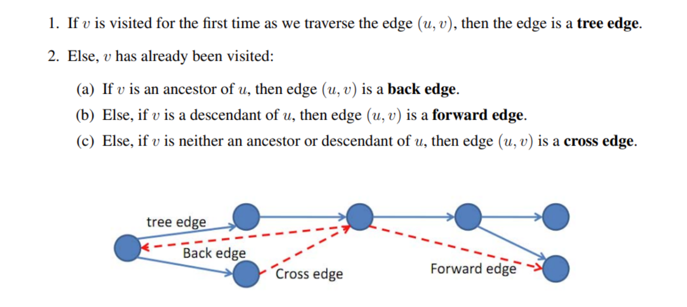
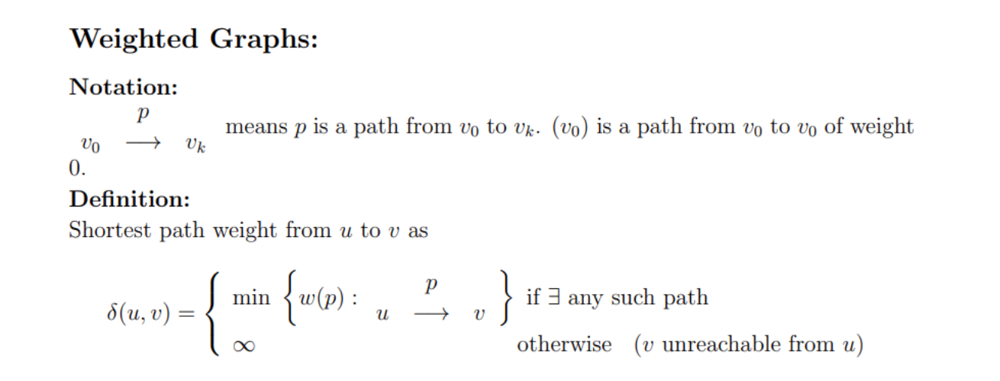
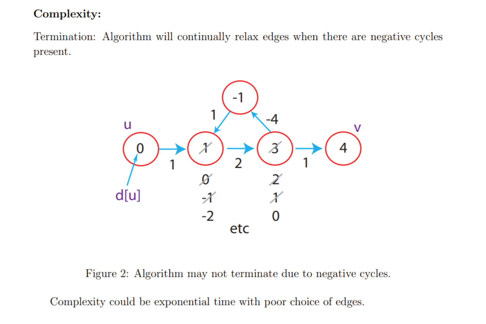
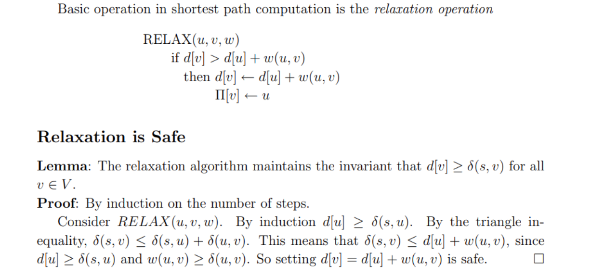
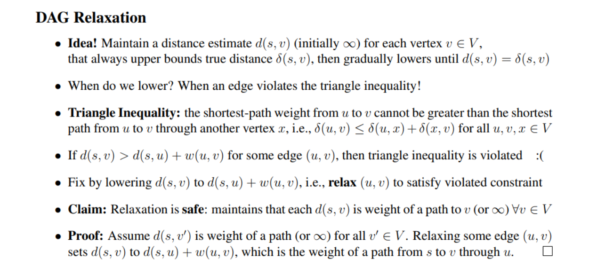
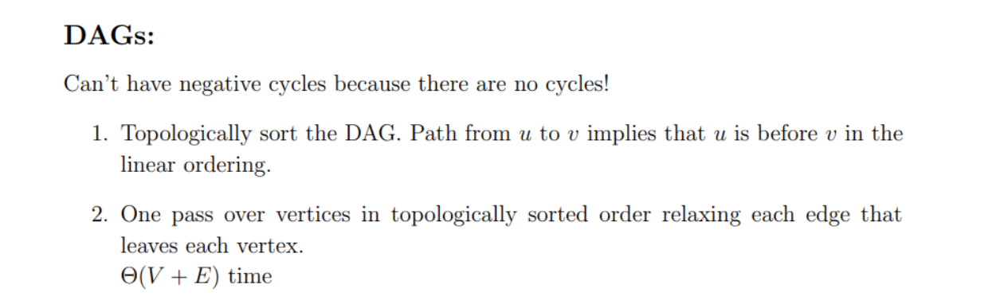
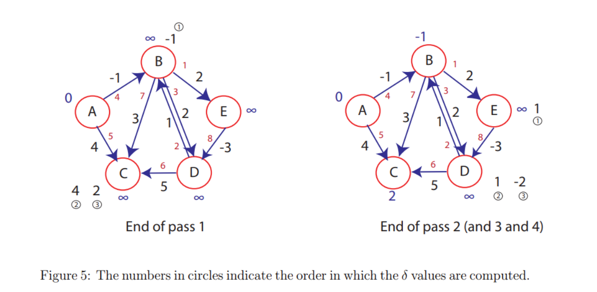

# Graph Representation
## Theory
> [!important]
> 
> This representation is bad for finding successor for current state, so we typically use adjacency list to represent graph:
> 
> 


## Code Implementations
> [!code]
```python
# First, Vertex and Graph classes for directed graphs

class CS161Vertex:
    def __init__(self, v):
        self.inNeighbors = []
        self.outNeighbors = []
        self.value = v
        # useful for DFS
        self.inTime = None
        self.outTime = None
        self.status = "unvisited"
        
    def hasOutNeighbor(self,v):
        if v in self.outNeighbors:
            return True
        return False
        
    def hasInNeighbor(self,v):
        if v in self.inNeighbors:
            return True
        return False
    
    def hasNeighbor(self,v):
        if v in self.inNeighbors or v in self.outNeighbors:
            return True
        return False
    
    def getOutNeighbors(self):
        return self.outNeighbors
    
    def getInNeighbors(self):
        return self.inNeighbors
        
    def addOutNeighbor(self,v):
        self.outNeighbors.append(v)
    
    def addInNeighbor(self,v):
        self.inNeighbors.append(v)
    
    def __str__(self):
        return str(self.value) 
        
# This is a directed graph class for use in CS161.
# It can also be used as an undirected graph by adding edges in both directions.
class CS161Graph:
    def __init__(self):
        self.vertices = []

    def addVertex(self,n):
        self.vertices.append(n)
        
    # add a directed edge from CS161Node u to CS161Node v
    def addDiEdge(self,u,v):
        u.addOutNeighbor(v)
        v.addInNeighbor(u)
        
    # add edges in both directions between u and v
    def addBiEdge(self,u,v):
        self.addDiEdge(u,v)
        self.addDiEdge(v,u)
        
    # get a list of all the directed edges
    # directed edges are a list of two vertices
    def getDirEdges(self):
        ret = []
        for v in self.vertices:
            ret += [ [v, u] for u in v.outNeighbors ]
        return ret
    
    def __str__(self):
        ret = "CS161Graph with:\n"
        ret += "\t Vertices:\n\t"
        for v in self.vertices:
            ret += str(v) + ","
        ret += "\n"
        ret += "\t Edges:\n\t"
        for a,b in self.getDirEdges():
            ret += "(" + str(a) + "," + str(b) + ") "
        ret += "\n"
        return ret
```


# Breadth First Search
## Algorithm
> [!algo]
> 

## Runtime Analysis
> [!important]
> 


## Code Implementations
> [!code]
```python
def BFS(w, G):
    for v in G.vertices:
        v.status = "unvisited"
    n = len(G.vertices)
    Ls = [ [] for i in range(n) ]
    Ls[0] = [w]
    w.status = "visited"
    for i in range(n):
        for u in Ls[i]:
            for v in u.getOutNeighbors():
                if v.status == "unvisited":
                    v.status = "visited"
                    Ls[i+1].append(v)
    return Ls

# This is the graph that was on the slides in class (vertex 1 was Kevin Bacon)
G = CS161Graph()
for i in range(7):
    G.addVertex( CS161Vertex( i ) ) 
V = G.vertices
for pairs in [ (0,2), (0,4), (0, 6), (1, 3), (1, 4), (2, 3), (2, 6), (4, 5), (5,6) ]:
    G.addBiEdge( V[pairs[0]], V[pairs[1]] )
print(G)

levels = BFS(G.vertices[1], G)
for i in range(len(levels)):
    print("Level", i, ":")
    for j in levels[i]:
        print("\t", j)
    
# now what's the distance from node 1 to node 6?
for i in range(len(levels)):
    if G.vertices[6] in levels[i]:
        print("distance from 1 to 6 is", i)
        break
```


## Applications
### Shortest Path - Unweighted
> [!example]
> 


# Depth First Search
## Algorithm
> [!algo]
> 
> Note that for runtime analysis, we have:
> 1. **DFS(...)** visit each vertex once, $O(|V|)$(Outer loop execute V times)
> 2. **DFSVisit(...)** called once per vertex, for each call to the vertex $v\in V$, the runtime is $O(|Adj(v)|)$, so for all the vertices we have $O(\sum\limits_{v\in V}|Adj(v)|)=O(|E|)$ due to handshaking lemma for directed graph.(Sum of the degree is double the cardinality of edges for undirected graph and equal the cardinality fro directed graph).
> 3. In total, we have runtime $O(|V|+|E|)$ and actually $\Theta(|V|+|E|)$

## Edge Classification
> [!important]
> 
> After executing DFS on graph G, every edge in G can be classified as one of these four edge types. 
> 
> To do this, we need to keep track of when a vertex is first being disocvered (visited) in the search (recorded in start time[v]), and when it is finished (recorded in finish time[v]), that is, when its adjacency list has been examined completely. These timestamps are integers between 1 and 2|V |, since there is one discovery event and one finishing event for each of the |V | vertices.
> 
> **Remarks:**
> 1. **Tree Edges:** Also called parent pointer, if we backtrack the path created by DFS, we can constructed a tree, since each node first visited during DFS has only one parent. 
> 2. **Forward Edges:** An edge pointing from a node to its descent.(Grandchildren). **Detailedly, an edge (u, v) is a forward edge, if v is finished and start time[u] < start time[v].** 
> 3. **Backward Edges:** An edge from a node to its ancestor. (Grandparent)
> 4. **Cross Edges:** An edge pointing from one subtree to another subtree. No hierarchical relationship between. **An edge (u, v) is a cross edge, if v is finished and start time[u] > start time[v]**
> 5. **For undirected graph**, we will never have forward edges, all forward edges will be classified as a backward edges or tree edges, since we can just change the direction and make the starting node being visited by its descent.
> 6. **For undirected graph**, we will never have cross edge, it will be classified as a tree edge or a backward edge.


## DFS Runtime Analysis
> [!important]
> 


## Algorithm Implementation
> [!code] 
> 
```python
def DFS_helper( w, currentTime, verbose ):
    if verbose:
        print("Time", currentTime, ":\t entering", w)
    w.inTime = currentTime
    currentTime += 1
    w.status = "inprogress"
    for v in w.getOutNeighbors():
        if v.status == "unvisited":
            currentTime = DFS_helper(v, currentTime, verbose)
            currentTime += 1
    w.outTime = currentTime
    w.status = "done"
    if verbose:
        print("Time", currentTime, ":\t leaving", w)
    return currentTime
        
def DFS( w, G, verbose=False ):
    for v in G.vertices:
        v.status = "unvisited"
        v.inTime = None
        v.outTime = None
    return DFS_helper( w, 0, verbose )
```


## Applications
> It turns out that we can use the edge type information to perform lots of interesting tasks.
### Cycle Detection
> [!concept]
> 
> The question is: Even is there is a cycle in our directed graph, how do we make sure that the DFS will go through that cycle so that the directed edge $v_k\to v_0$ will be visited?
> 
> The answer is that during DFS, we look for all the neighbors of any particular vertices, so if we start at $v_0$, we will definitely visit $v_1$ during the for loop and so on, so we will definitely visit $v_k$ some time and loop back to $v_0$.
> 
> The key logic is that we can return from the higher level of recursion before we return from the lower level of the recursion. So $v_k$ will visit $v_0$ before $v_0$ finish visiting and $v_0$ won't finish visiting before $v_k$ finish visiting.
> 
> Thus, when we first visit $v_k$, $v_0$ is still on the recursion stack(since it is not finishing visiting), thus $v_0$ is the ancestor of $v_k$ and thus $v_k\to v_0$ is a back edge, which finishes the proof.


### Job Scheduling
> [!concept]
> 


### Topological Sort
> [!algo]
> 
> It means, for any node $v$, I will put this node in `order` after I have expanded all its children and descents. In this way, the node that has the most prerequisites will be added first to the order and the starting node will be added last. Then we just reverse the `order` and get the topological sort result.

> [!proof] Correctness
> 
> What this tells us is that the nodes that have more edge dependencies will be added to `order` first, so that later on when we do reversion operation, we get the correct topological sort result.

> [!code]
> 
```python
# This method is not complete!
# It will only topologically sort the vertices reachable from the first node that it picks.
# How would you modify it to be complete?


def topoSort_helper( w, currentTime, ordering, verbose ):
    if verbose:
        print("Time", currentTime, ":\t entering", w)
    w.inTime = currentTime
    currentTime += 1
    w.status = "inprogress"
    for v in w.getOutNeighbors():
        if v.status == "unvisited":
            currentTime = topoSort_helper(v, currentTime, ordering, verbose)
            currentTime += 1
    w.outTime = currentTime
    w.status = "done"
    ordering.insert(0, w)
    if verbose:
        print("Time", currentTime, ":\t leaving", w)
    return currentTime
        
def topoSort( G, verbose=False ):
    w = G.vertices[0]
    ordering = []
    for v in G.vertices:
        v.status = "unvisited"
        v.inTime = None
        v.outTime = None
    topoSort_helper( w, 0, ordering, verbose )
    return ordering

G = CS161Graph()
dpkg = CS161Vertex( "dkpg" )
coreutils = CS161Vertex( "coreutils" )
multiarch_support = CS161Vertex( "multiarch_support" )
libselinux1 = CS161Vertex("libselinux1")
libbz2 = CS161Vertex( "libbz2" )
tar = CS161Vertex("tar")
for N in [ dpkg, coreutils, multiarch_support, libselinux1, libbz2, tar ]:
    G.addVertex( N )
	G.addDiEdge( dpkg, multiarch_support )
	G.addDiEdge( dpkg, coreutils )
	G.addDiEdge( dpkg, tar )
	G.addDiEdge( dpkg, libbz2 )
	G.addDiEdge( coreutils, libbz2 )
	G.addDiEdge( coreutils, libselinux1 )
	G.addDiEdge( libbz2, libselinux1 )
	G.addDiEdge( libselinux1, multiarch_support )
        


V = topoSort(G)
for v in V:
    print(v)
```


# Shortest Path Problem(SSSP)
## Problem Definition
> [!def]
> 


## Time Complexity
> [!important]
> 


## Weighted Shortest Path - BFS
> [!important]
> 


# SCC Problems
## Basic Idea
> [!important]
> 


## Algorithm
> [!algo]
> 


## Example
> [!example]
> 


## Proof of Correctness
> [!proof]
> 


## Code Implementations
> [!code]
```python
def DFS_helper( w, currentTime, ordering, verbose ):
    if verbose:
        print("Time", currentTime, ":\t entering", w)
    w.inTime = currentTime
    currentTime += 1
    w.status = "inprogress"
    for v in w.getOutNeighbors():
        if v.status == "unvisited":
            currentTime = DFS_helper(v, currentTime, ordering, verbose)
            currentTime += 1
    w.outTime = currentTime
    w.status = "done"
    ordering.insert(0, w)
    if verbose:
        print("Time", currentTime, ":\t leaving", w)
    return currentTime
       
# This is a version of DFS which outputs vertices in the order that DFS leaves them.
# We used it for topological sorting in Lecture 9
def SCC( G, verbose=False ):
    ordering = []
    for v in G.vertices:
        v.status = "unvisited"
        v.inTime = None
        v.outTime = None
    currentTime = 0
    for w in G.vertices:
        if w.status == "unvisited":
            currentTime = DFS_helper( w, currentTime, ordering, verbose )
        currentTime += 1
    # now reverse all the edges
    E = G.getDirEdges()
    for x,y in E:
        G.reverseEdge(x,y)
   
    # and do it again, but this time in the order "ordering"
    SCCs = []
    for v in ordering:
        v.status = "unvisited"
        v.inTime = None
        v.outTime = None
    currentTime = 0 
    for w in ordering:
        visited = [] 
        if w.status == "unvisited":
            currentTime = DFS_helper( w, currentTime, visited, verbose )
            SCCs.append(visited[:])
        currentTime += 1
    return SCCs


SCCs = SCC(G, False)
for X in SCCs:
    print ([str(x) for x in X])
```


# Useful Lemmas in SSSP
## Subpaths of Shortest Paths 
> [!property]
> 


## Relaxation Operation is Safe
> [!concept]
> 
> The term "safe" in "relaxation is safe" means that performing relaxation operations will not lead to an overestimation or underestimation of the true shortest path distances. 
> 
> It ensures that the algorithm (such as Dijkstra's or Bellman-Ford algorithm) will correctly find the shortest paths, assuming the algorithm's other conditions (such as no negative-weight cycles in the case of Dijkstra's algorithm) are met. 
> 
> This is a fundamental concept ensuring the algorithms' correctness and efficiency in solving shortest path problems.


## Simple Shortest Paths
> [!important]
> 


## Negative Edges Detection
> [!important]
> 


## Negative Cycle Detection
> [!important]
> In graphs where edges can have negative weights, if there is a cycle whose total weight is negative, it's theoretically possible to reduce the path length indefinitely by going around the cycle multiple times. In such a case, the shortest path is undefined because you can always have a shorter path by traversing the negative cycle more times.
> 


# SSSP on DAGs
## DAG Relaxation
> [!def]
> 


## Algorithm
> [!concept] Shortest Path on DAGs can be solved with TS
> 


## Time Complexity
> [!important]
> 


# Dijkstra's Algorithm
## Algorithm&Example
> [!algo]
> 


## Dijkstra Complexity
> [!important]
> 


## Proof of Correctness
> [!proof]
> 


## Code Implementations
> [!code]
```python
# make a random graph
# This is G(n,p), where we have n vertices and each (directed) edge is present with probability p.
# if you pass in a set of weights, then the weights are chosen uniformly from that set.
# otherwise all weights are 1
def randomGraph(n,p,wts=[1]):
    G = CS161Graph()
    V = [ CS161Vertex(x) for x in range(n) ]
    for v in V:
        G.addVertex(v)
    for v in V:
        for w in V:
            if v != w:
                if random() < p:
                    G.addDiEdge(v,w,wt=choice(wts))
    return G


# first let's implement this with an array, not a priprity queue
def dijkstraDumb(w,G):
    for v in G.vertices:
        v.estD = math.inf
    w.estD = 0
    unsureVertices = G.vertices[:]
    while len(unsureVertices) > 0:
        # find the u with the minimum estD in the dumbest way possible
        u = None
        minD = math.inf
        for x in unsureVertices:
            if x.estD < minD:
                minD = x.estD
                u = x
        if u == None:
            # then there is nothing more that I can reach
            return
        # update u's neighbors
        for v,wt in u.getOutNeighborsWithWeights():
            if u.estD + wt < v.estD:
                v.estD = u.estD + wt
                v.parent = u
        unsureVertices.remove(u)
    # that's it!  Now each vertex holds estD which is its distance from w

def dijkstraDumb_shortestPaths(w,G):
    dijkstraDumb(w,G)
    # okay, now what are all the shortest paths?
    for v in G.vertices:
        if v.estD == math.inf:
            print("Cannot reach " + str(v))
            continue
        path = []
        current = v
        while current != w:
            path.append(current)
            current = current.parent
        path.append(current)
        path.reverse()
        print([ str(x) for x in path ])


# test on a random graph
G = randomGraph(5,.2)
print(G)
dijkstraDumb_shortestPaths(G.vertices[0], G)


# now let's try this with a heap
def dijkstra(w,G):
    for v in G.vertices:
        v.estD = math.inf
    w.estD = 0
    unsureVertices = heapdict.heapdict()
    for v in G.vertices:
        unsureVertices[v] = v.estD
    while len(unsureVertices) > 0:
        # find the u with the minimum estD, using the heap
        u, dist = unsureVertices.popitem() 
        if u.estD == math.inf:
            # then there is nothing more that I can reach
            return
        # update u's neighbors
        for v,wt in u.getOutNeighborsWithWeights():
            if u.estD + wt < v.estD:
                v.estD = u.estD + wt
                unsureVertices[v] = u.estD + wt #update the key in the heapdict
                v.parent = u
    # that's it!  Now each vertex holds estD which is its distance from w


def dijkstra_shortestPaths(w,G):
    dijkstra(w,G)
    # okay, now what are all the shortest paths?
    for v in G.vertices:
        if v.estD == math.inf:
            print("Cannot reach " + str(v))
            continue
        path = []
        current = v
        while current != w:
            path.append(current)
            current = current.parent
        path.append(current)
        path.reverse()
        print([ str(x) for x in path ])

# test on a random graph
G = randomGraph(5,.4,[1,2,3,4,5])
print(G)
dijkstra_shortestPaths(G.vertices[0], G)
```


# Bellman Ford
> [!algo]
> When there is negative weights edge in the graph, Dijkstra's algorithm won't work. We opt for Bellman Ford if there is no negative cycles.
> 
> Runtime is $\Theta(VE)$.
> 
> Note that if the graph is a DAG, then there is no negative cycles.

> [!thm]
> 

> [!corollary] 
> 

> [!bug] Important
> If there is negative cycles, finding shortest path is NP hard.


