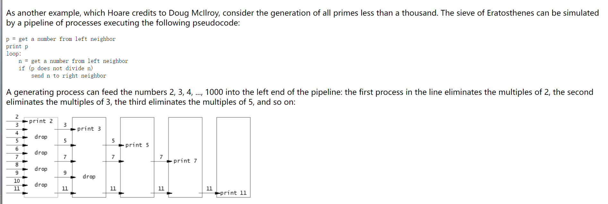

# Find Primes In Range
> https://oi-wiki.org/math/number-theory/sieve/
## Eratosthenes Sieve(O(nlognlogn))
> [!algo]
> 
```java
/** 
 * Compute the primes within range [1, n]
 * - O(nlognlogn) with no optimization
 * - O(nlnsqrt{n} + n) with space/time optimization
 * @param n Range indicator  
 * @return A set containing all the primes in [1, n]  
 */
public List<Integer> sieve(int n) {
        List<Integer> res = new ArrayList<>();
        // Space Optimize: Use bitset instead of boolean[] (位级压缩)
        BitSet isPrime = new BitSet(n + 1);
        isPrime.set(0, false);
        isPrime.set(1, false);
        for (int i = 2; i < n + 1; i++) {
            isPrime.set(i);
        }
        // Time Optimize 1: Replace i < n + 1 by i * i < n + 1, 要找到直到 n 为止的所有素数，仅对不超过sqrt{n}的素数进行筛选就足够了。
        for (int i = 2; i * i < n + 1; i++) {
	        // Time optimize 2: 所有除了2以外的偶数都不用考虑，直接砍掉一半的时间
	        if (i % 2 == 0 && i > 2) {  
			    continue;  
			}
            if (isPrime.get(i)) {
                if (i * i > n) {
                    continue;
                }
                for (int j = i * i; j < n + 1; j += i) {
                    isPrime.set(j, false);
                }
            }

        }

        for (int i = 2; i <= n; i++) {
            if (isPrime.get(i)) res.add(i);
        }

        return res;
    }

```


## Euler Sieve(O(n))
> [!algo]
> 
```java
/**
     * Linear sieve, O(n)
     * @param n
     * @return
     */
    @Override
    public List<Integer> sieve(int n) {
        List<Integer> primes = new ArrayList<>();
        BitSet isNotPrime = new BitSet(n + 1);
        for (int i = 2; i < n + 1; i++) {
            if (!isNotPrime.get(i)) {
                primes.add(i);
            }
            for (Integer prime: primes) {
                if (i * prime > n) {
                    break;
                }
                isNotPrime.set(i * prime, true);
                if (i % prime == 0) {
                """ i % pri_j == 0 换言之，i 之前被 pri_j 筛过了 由于 pri 里面质数是从小到大的，所以 i 乘上其他的质数的结果一定会被 pri_j 的倍数筛掉，就不需要在这里先筛一次，所以这里直接 break 掉就好了 """
                    break;
                }
            }
        }
        return primes;
    }
```


