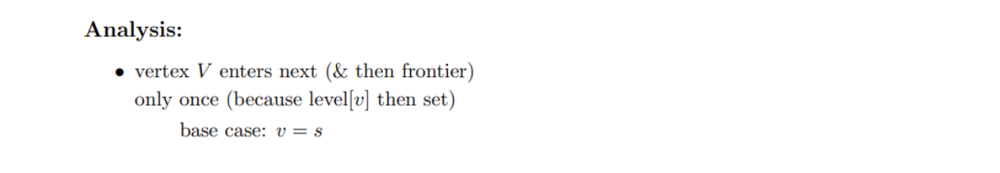
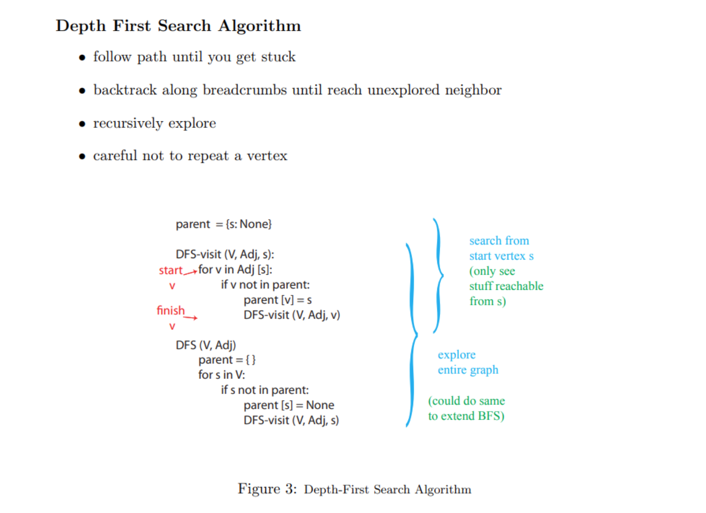
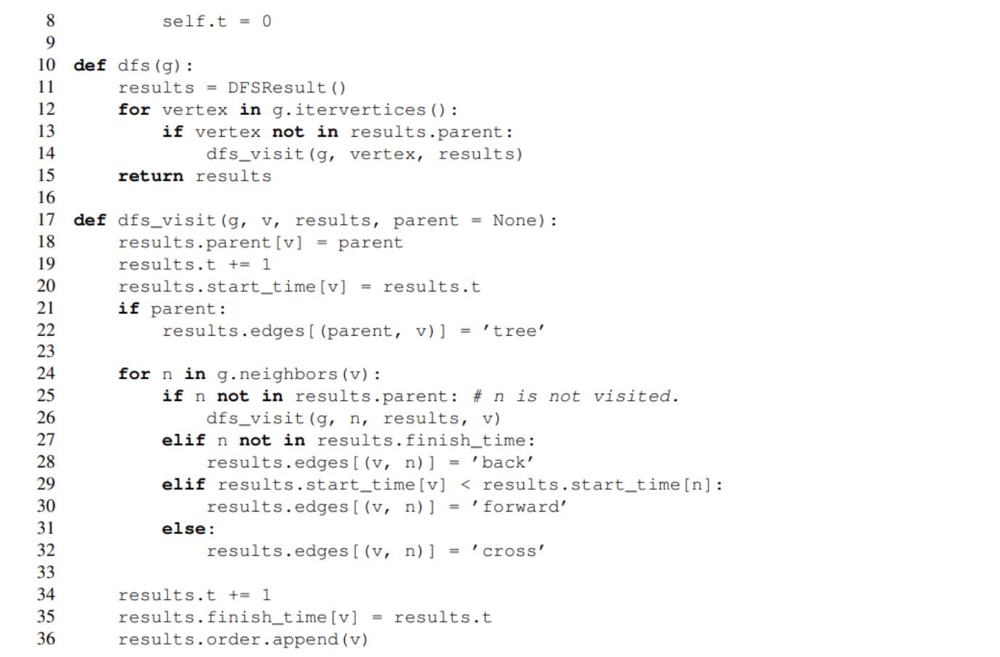
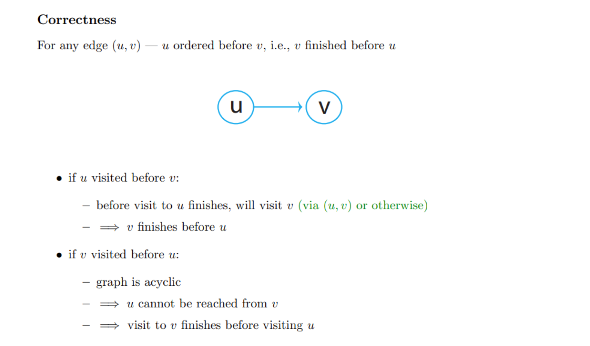
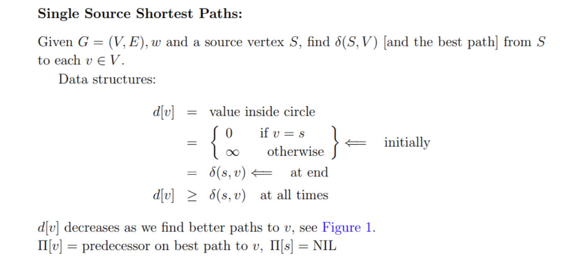
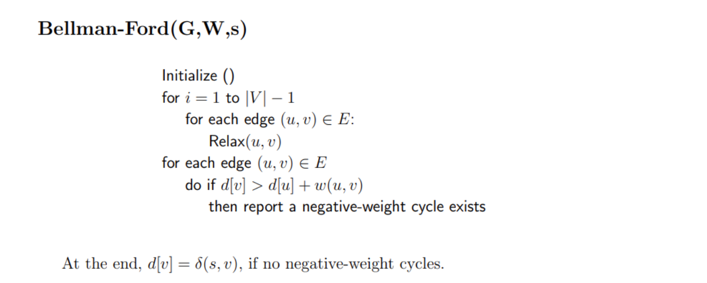

# Graph Representation
> [!important]
> 
> This representation is bad for finding successor for current state, so we typically use adjacency list to represent graph:
> 
> 

# Breadth First Search
## Algorithm
> [!algo]
> 

## Runtime Analysis
> [!important]
> 

## Applications
### Shortest Path - Unweighted
> [!example]
> 

# Depth First Search
## Algorithm
> [!algo]
> 
> Note that for runtime analysis, we have:
> 1. **DFS(...)** visit each vertex once, $O(|V|)$(Outer loop execute V times)
> 2. **DFSVisit(...)** called once per vertex, for each call to the vertex $v\in V$, the runtime is $O(|Adj(v)|)$, so for all the vertices we have $O(\sum\limits_{v\in V}|Adj(v)|)=O(|E|)$ due to handshaking lemma for directed graph.(Sum of the degree is double the cardinality of edges for undirected graph and equal the cardinality fro directed graph).
> 3. In total, we have runtime $O(|V|+|E|)$ and actually $\Theta(|V|+|E|)$

## Edge Classification
> [!important]
> 
> After executing DFS on graph G, every edge in G can be classified as one of these four edge types. 
> 
> To do this, we need to keep track of when a vertex is first being disocvered (visited) in the search (recorded in start time[v]), and when it is finished (recorded in finish time[v]), that is, when its adjacency list has been examined completely. These timestamps are integers between 1 and 2|V |, since there is one discovery event and one finishing event for each of the |V | vertices.
> 
> **Remarks:**
> 1. **Tree Edges:** Also called parent pointer, if we backtrack the path created by DFS, we can constructed a tree, since each node first visited during DFS has only one parent. 
> 2. **Forward Edges:** An edge pointing from a node to its descent.(Grandchildren). **Detailedly, an edge (u, v) is a forward edge, if v is finished and start time[u] < start time[v].** 
> 3. **Backward Edges:** An edge from a node to its ancestor. (Grandparent)
> 4. **Cross Edges:** An edge pointing from one subtree to another subtree. No hierarchical relationship between. **An edge (u, v) is a cross edge, if v is finished and start time[u] > start time[v]**
> 5. **For undirected graph**, we will never have forward edges, all forward edges will be classified as a backward edges or tree edges, since we can just change the direction and make the starting node being visited by its descent.
> 6. **For undirected graph**, we will never have cross edge, it will be classified as a tree edge or a backward edge.

## DFS Runtime Analysis
> [!important]
> 

## Algorithm Implementation
> [!code]
> 

## Applications
> It turns out that we can use the edge type information to perform lots of interesting tasks.
### Cycle Detection
> [!concept]
> 
> The question is: Even is there is a cycle in our directed graph, how do we make sure that the DFS will go through that cycle so that the directed edge $v_k\to v_0$ will be visited?
> 
> The answer is that during DFS, we look for all the neighbors of any particular vertices, so if we start at $v_0$, we will definitely visit $v_1$ during the for loop and so on, so we will definitely visit $v_k$ some time and loop back to $v_0$.
> 
> The key logic is that we can return from the higher level of recursion before we return from the lower level of the recursion. So $v_k$ will visit $v_0$ before $v_0$ finish visiting and $v_0$ won't finish visiting before $v_k$ finish visiting.
> 
> Thus, when we first visit $v_k$, $v_0$ is still on the recursion stack(since it is not finishing visiting), thus $v_0$ is the ancestor of $v_k$ and thus $v_k\to v_0$ is a back edge, which finishes the proof.

### Job Scheduling
> [!concept]
> 

### Topological Sort
> [!algo]
> 
> It means, for any node $v$, I will put this node in `order` after I have expanded all its children and descents. In this way, the node that has the most prerequisites will be added first to the order and the starting node will be added last. Then we just reverse the `order` and get the topological sort result.

> [!proof] Correctness
> 
> What this tells us is that the nodes that have more edge dependencies will be added to `order` first, so that later on when we do reversion operation, we get the correct topological sort result.

# Shortest Path Problem(SSSP)
## Problem Definition
> [!def]
> 

## Time Complexity
> [!important]
> 

## Weighted Shortest Path - BFS
> [!important]
> 

# Useful Lemmas in SSSP
## Subpaths of Shortest Paths 
> [!property]
> 

## Relaxation Operation is Safe
> [!concept]
> 

## Simple Shortest Paths
> [!important]
> 

## Negative Edges Detection
> [!important]
> 

## Negative Cycle Detection
> [!important]
> In graphs where edges can have negative weights, if there is a cycle whose total weight is negative, it's theoretically possible to reduce the path length indefinitely by going around the cycle multiple times. In such a case, the shortest path is undefined because you can always have a shorter path by traversing the negative cycle more times.
> 

# SSSP on DAGs
## DAG Relaxation
> [!def]
> 

## Algorithm
> [!concept] Shortest Path on DAGs can be solved with TS
> 

## Time Complexity
> [!important]
> 

# Dijkstra's Algorithm
## Algorithm&Example
> [!algo]
> 

## Dijkstra Complexity
> [!important]
> 

## Proof of Correctness
> [!proof]
> 

# Bellman Ford
> [!algo]
> When there is negative weights edge in the graph, Dijkstra's algorithm won't work. We opt for Bellman Ford if there is no negative cycles.
> 
> Runtime is $\Theta(VE)$.

> [!thm]
> 

> [!corollary] 
> 

> [!bug] Important
> If there is negative cycles, finding shortest path is NP hard.

