# Insertion Sort


# Selection Sort


# Merge Sort


# Heap Sort
## Max Heapify
> [!algo]
> 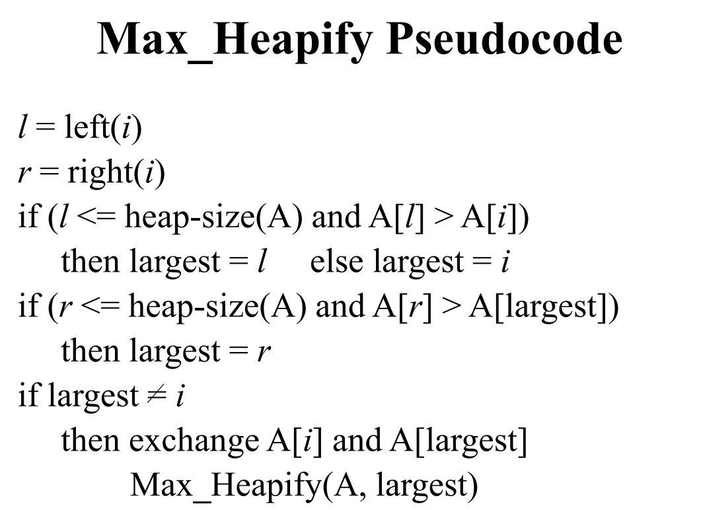


## Build Max Heap
> [!algo]
> 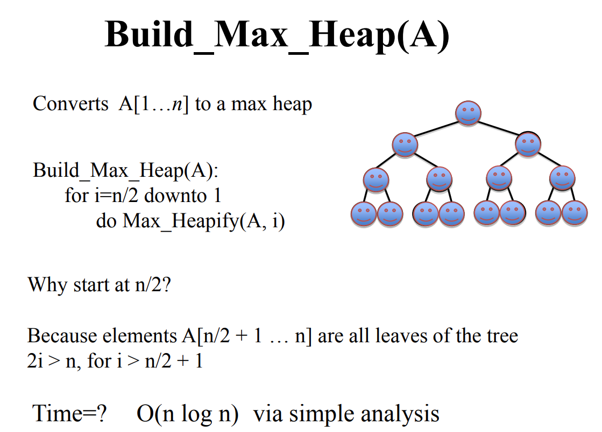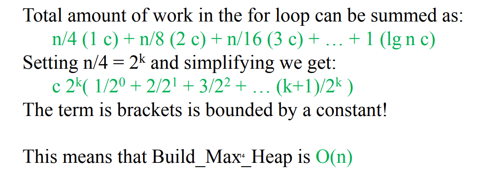

## Main Algorithm
> [!algo]
> 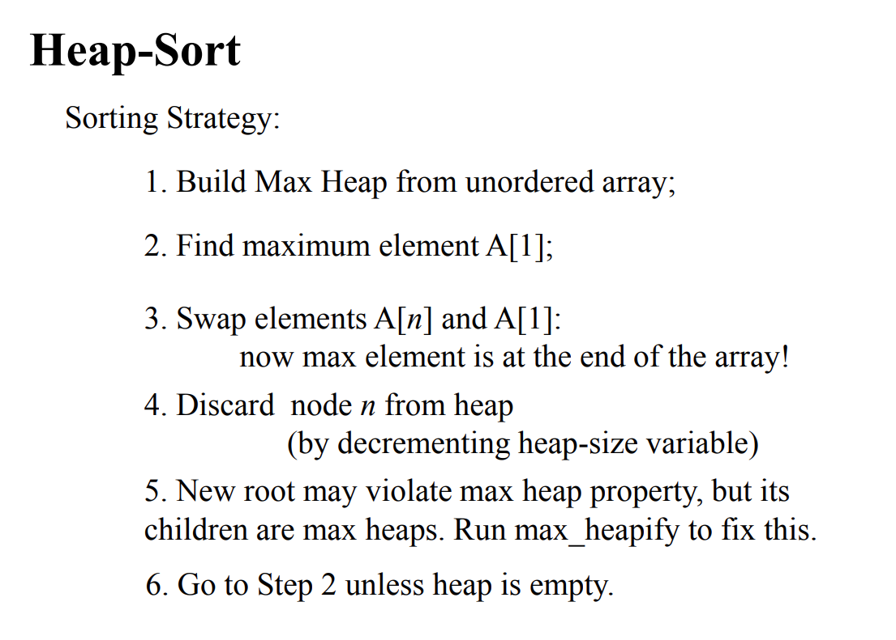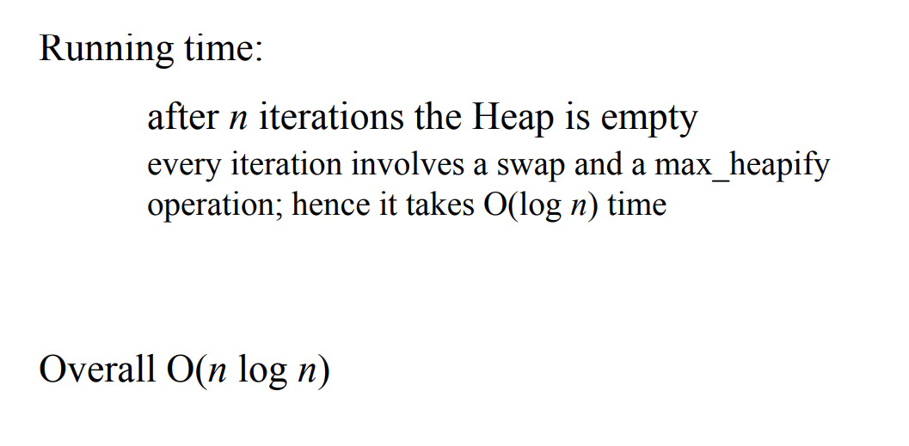


# BST Sort
## Augmented BST - Rank
> [!task]
> 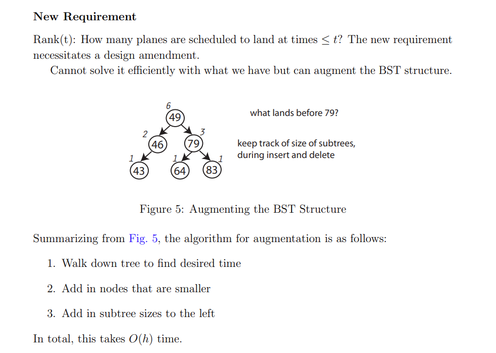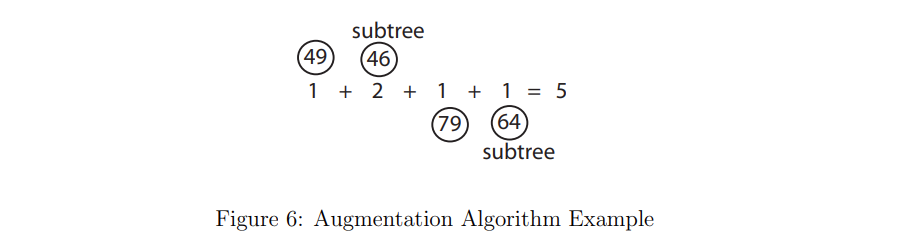
> But note that if the tree is spindly, the runtime would be $O(n)$ where n is the total number of tree nodes, which is sadly not efficient.

## Augmented BST - findMin/findMax
> [!task]
> 


# AVL Sort
## Balanced Search Tree
> [!concept]
> For a binary tree with n nodes, we call:
> 1.  It is balanced tree if its height $h$ is $O(lgn)$
> 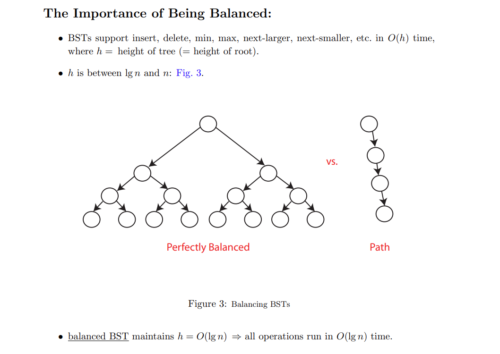
> 3. The height of a node = length (# edges) of longest downward path to a leaf. Can be computed by $max(h(leftchild),h(rightChild))+1$
> 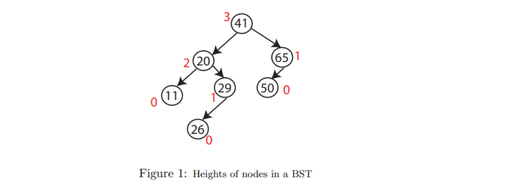
> 
> 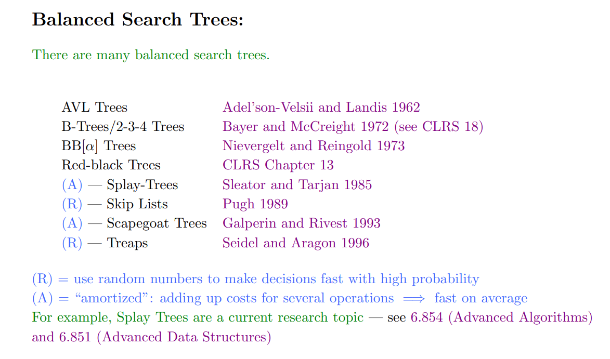


## AVL Tree Property
### Height Definition
> [!concept]
> **Balanced:** Require ==heights== of left and right children of ==every node== to differ by at most $\pm 1$。Due to the parity of the total number of nodes in the tree, it may be impossible to reach perfect balanace where the heights of left and right children perfectly match. But differing by 1 is totally possible.
> 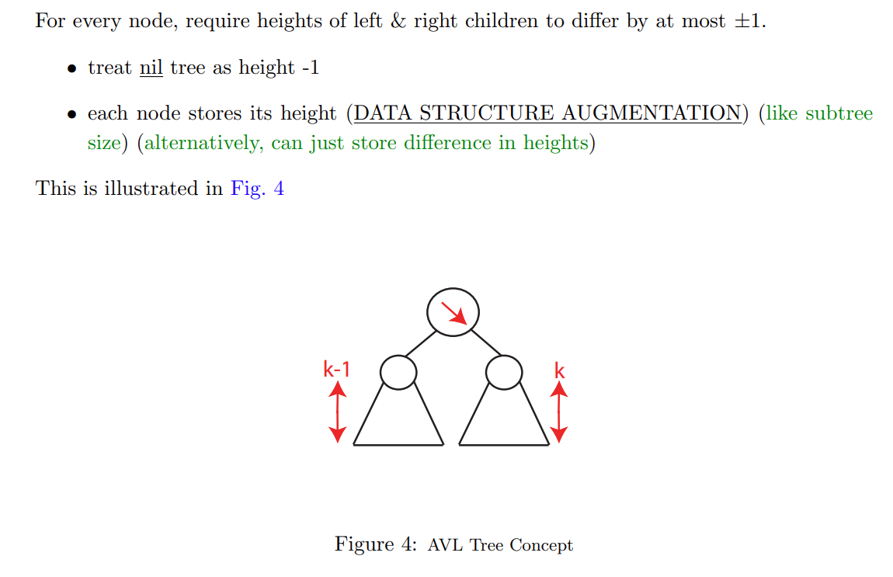


### Boundary on the Height
> [!proof] Proof: Think reversely
> 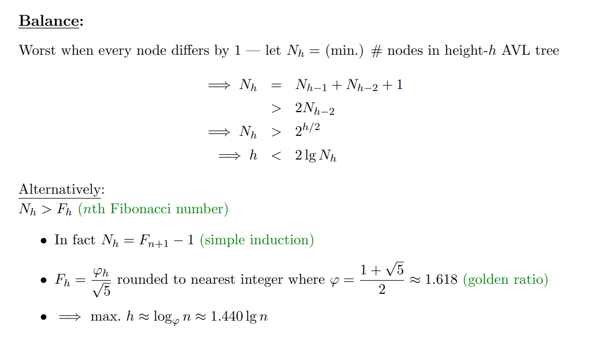
> Here there are three relations that we need to verify:
> 1. $N_h>F_h$, since for fibonacci sequence we have $F_h=F_{h-1}+F_{h-2}$, thus $H_h>F_h$ by 1 at each step. 
> 2. $F_h\approx\frac{\phi^h}{\sqrt{5}}$, which can be deduced by solving the inhomogenous linear recurrence. So to approxmate $N_h$, we could actually write $N_{h}\approx\phi^{h}$
> 3. $h\approx log_{\phi}n$, since $2^{\frac{h}{2}}<N_h$, we have $h<2lgN_h\approx 1.440lgn$ 


### Code Implementation
> [!code]
> 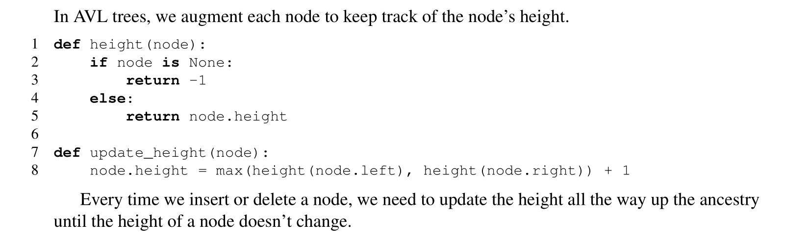


## AVL Rotation
> [!code]
> AVL Rotation is the core operation that underlies AVL Rebalance and thus AVL insertion/deletion.
```python
def left_rotate(self, x):  
    y = x.right  
    y.parent = x.parent  
    if y.parent is None:  
        self.root = y  
    else:  
        if y.parent.left is x:  
            y.parent.left = y  
        elif y.parent.right is x:  
            y.parent.right = y  
    x.right = y.left  
    if x.right is not None:  
        x.right.parent = x  
    y.left = x  
    x.parent = y  
    update_height(x)  
    update_height(y)
```

> [!example]
> 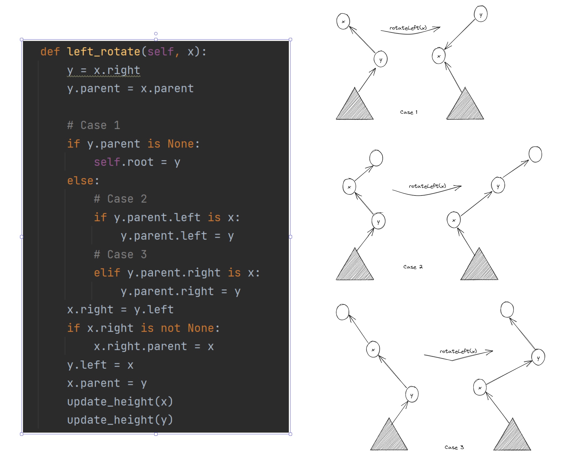


## AVL Rebalance
> [!code]
> After doing the insertion/deletion in the AVL tree, we will have to rebalance the AVL tree as the following step:
> 1. First the node to be balanced must have two children whose height differs by at least 2, we will break up into cases.
> 2. If the current node is left heavy
> 	1. If the current node's left child is left heavy, rotate the current node to the right  
> 	2. If the current node's left child is right heavy, then rotate the left child to the left, and rotate the current node to the right.
> 3. If the node is right heavy 
> 	1. If the node's right child is right heavy
> 	2.  If the node's right child is left heavy, then rotate the right child to the right      and rotate the node to the left 
```python
def rebalance(self, node):  
    while node is not None:  
        update_height(node)  
        # If the node is left heavy  
        if height(node.left) >= 2 + height(node.right):  
            # If the node's left child is left heavy, rotate the current node to the right  
            if height(node.left.left) >= height(node.left.right):  
                self.right_rotate(node)  
            # If the node's left child is right heavy, then  
            # First, rotate the left child to the left            # Then, rotate the node to the right            else:  
                self.left_rotate(node.left)  
                self.right_rotate(node)  
        # If the node is right heavy  
        elif height(node.right) >= 2 + height(node.left):  
            # If the node's right child is right heavy  
            if height(node.right.right) >= height(node.right.left):  
                self.left_rotate(node)  
            # If the node's right child is left heavy, then  
            # First, rotate the right child to the right            # Then, rotate the node to the left            else:  
                self.right_rotate(node.right)  
                self.left_rotate(node)
	    # Look up above until we see un unbalanced node  
        node = node.parent
```


## AVL Insertion
> [!algo] Insertion Process
> 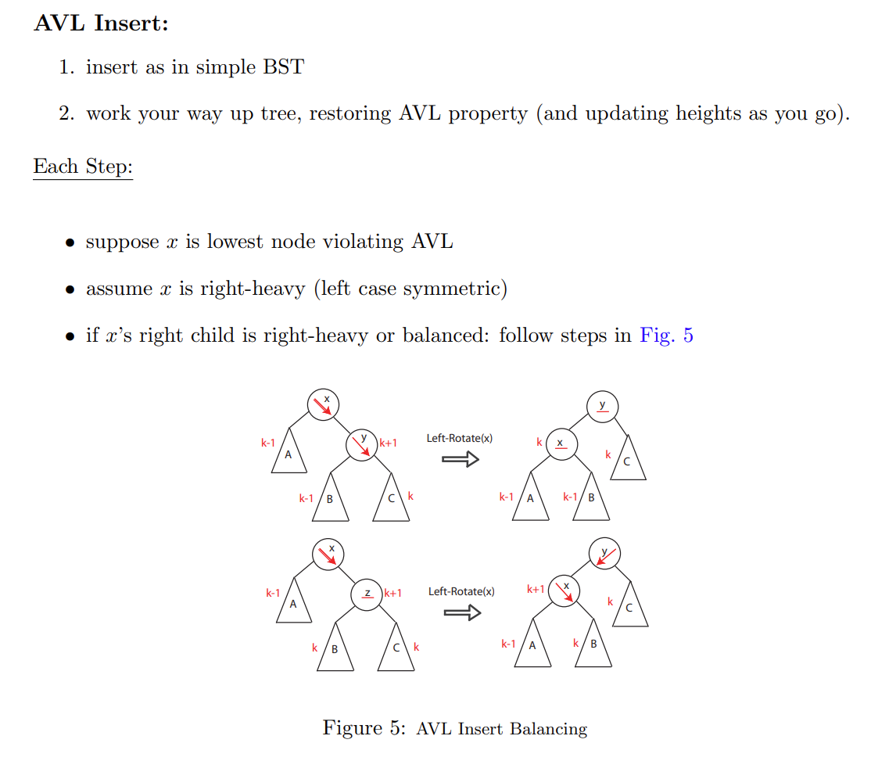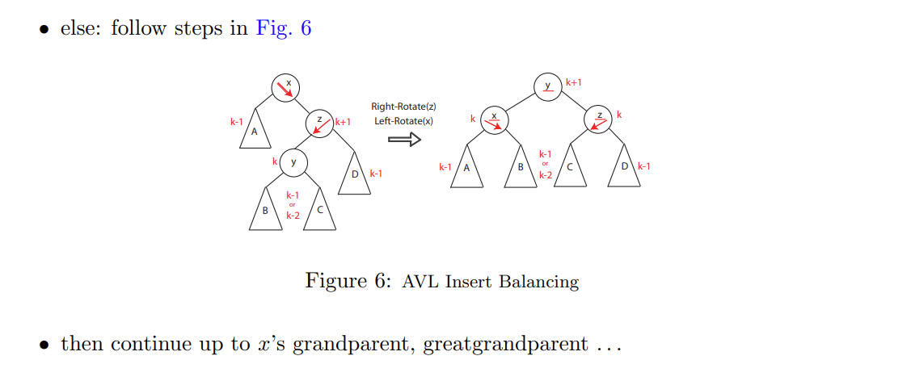
> **Notes:**
> 1. The rotation process is constant time, since we only need to change the parent pointer in the data structure.
> 2. The in-order traversal is the same before and after the rotation.

> [!example]
> 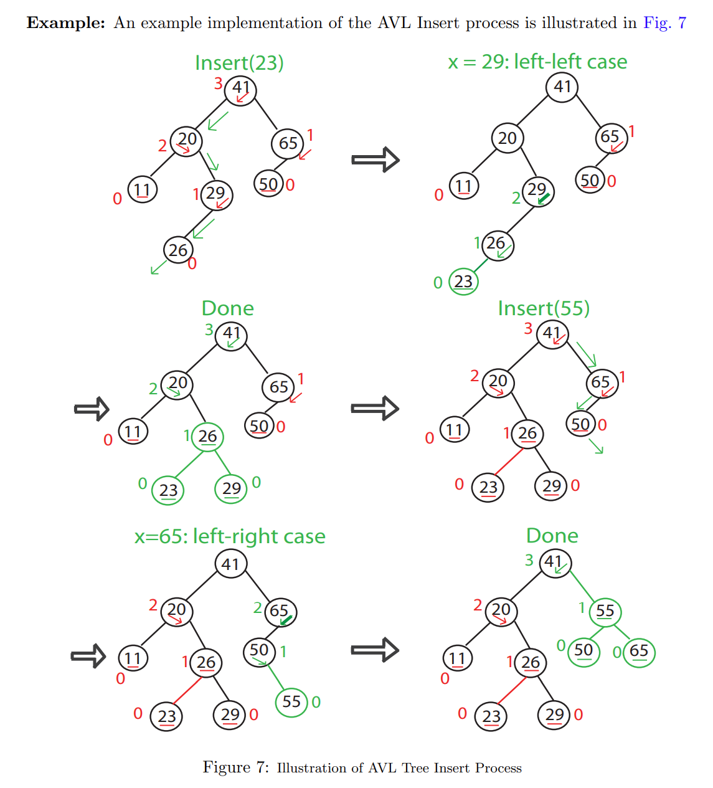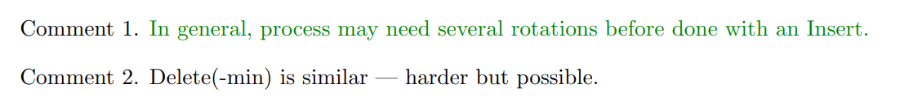


## AVL Sort Explained
> [!important]
> 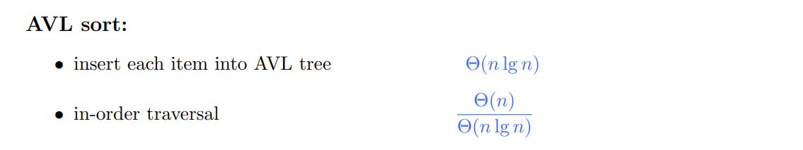


## ADTs
> [!important]
> 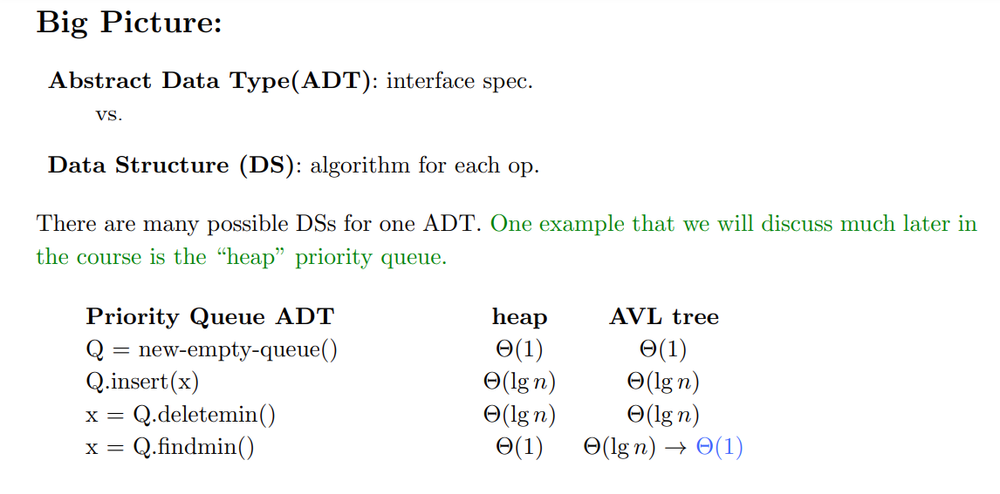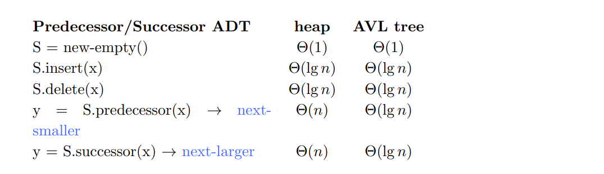


# Counting Sort


# Radix Sort