[lecture3_initandref_s23.pdf](https://www.yuque.com/attachments/yuque/0/2023/pdf/12393765/1692352652642-ca29af93-884e-4b32-8b6b-97cfd65fd82f.pdf)
# Initialization
## Uniform Initialization
> 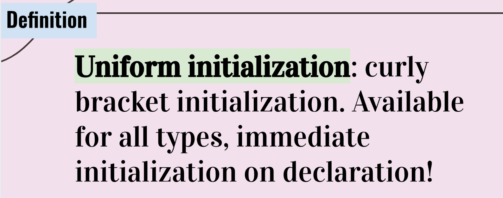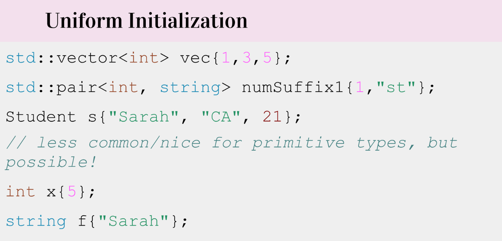

## Vector Uniform Intialization
> 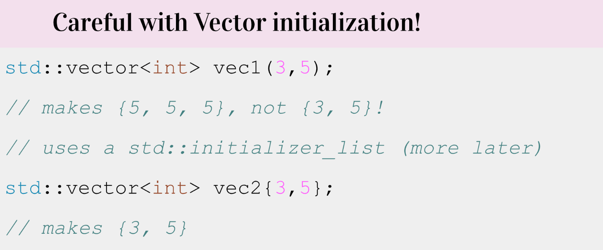

# Reference
## Definition
> 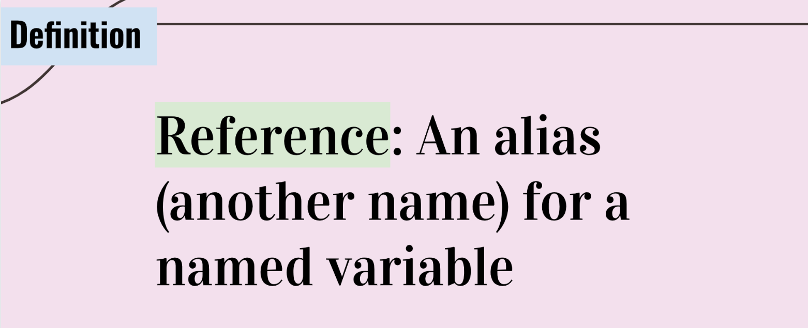

## Reference or Copy
> 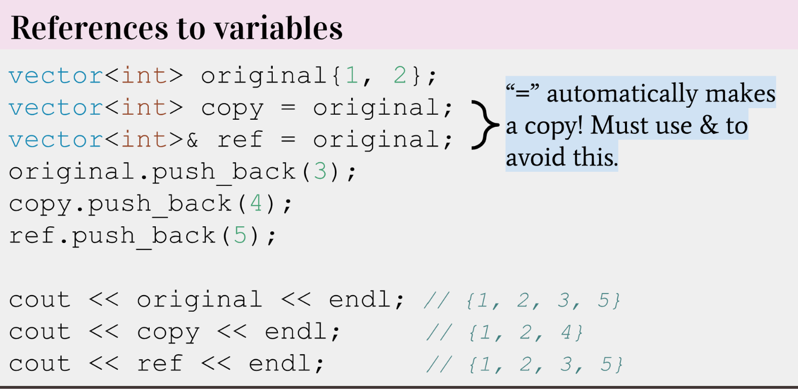

**Example 1**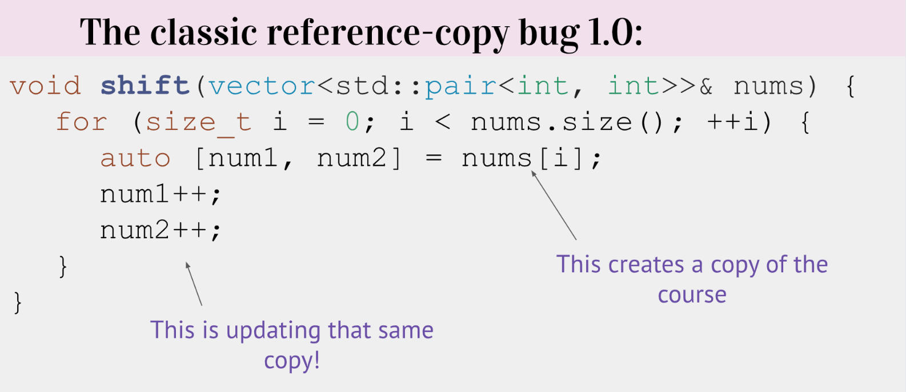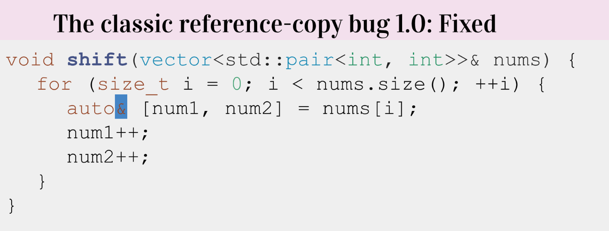
**Example 2**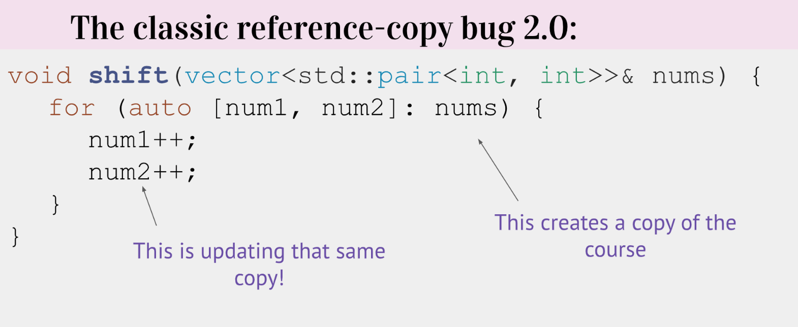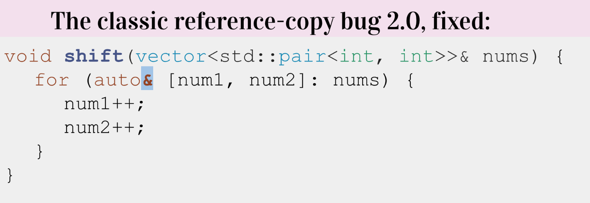

## L-values&R-values
> 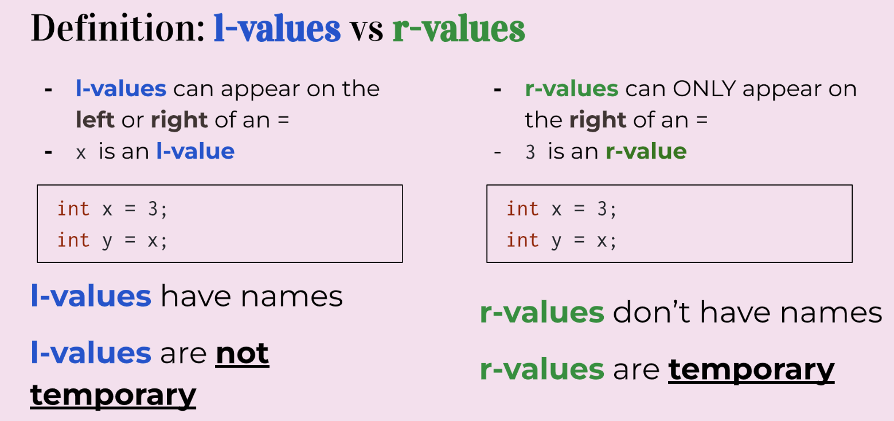

## R-value cannot be reference
> 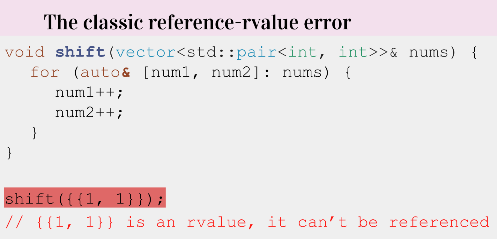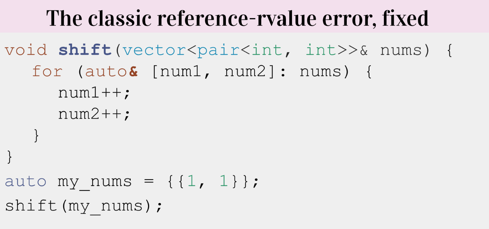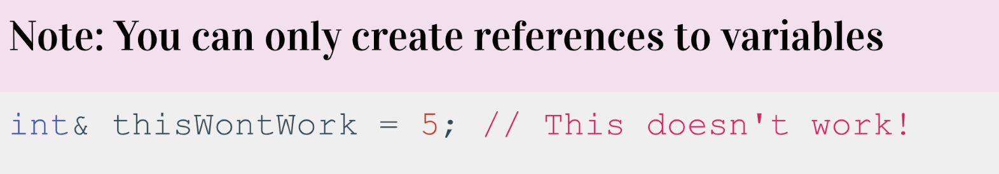

## Return Reference
> 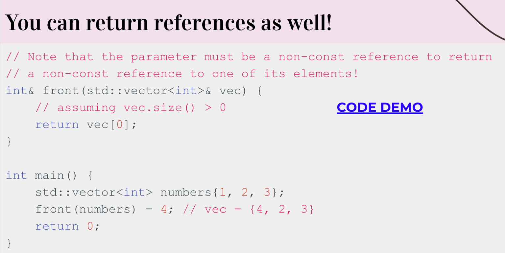

# Const and Const Reference
## Const Keyword
> 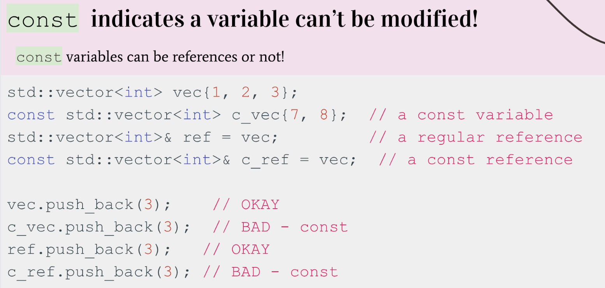

## Const Reference Caveats
> 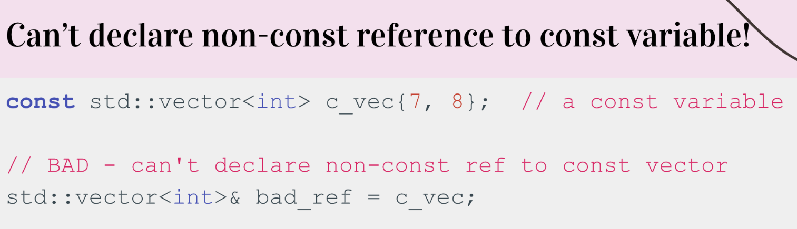

## Const Subtitles
> 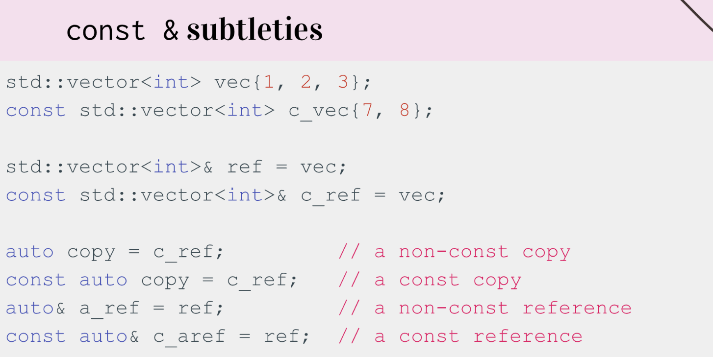

# When to use?
> 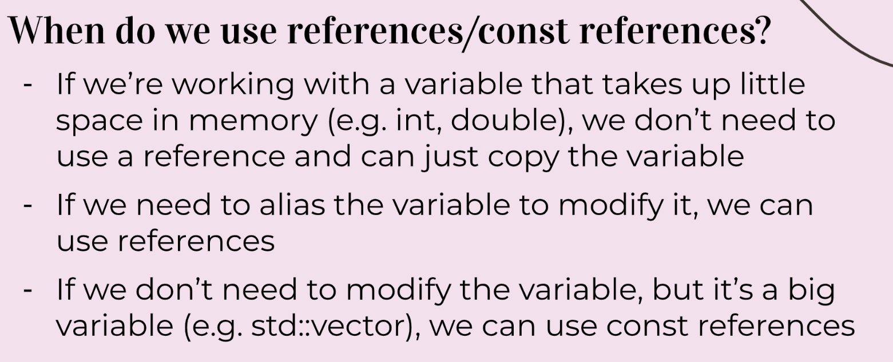

# Reference Guideline
> 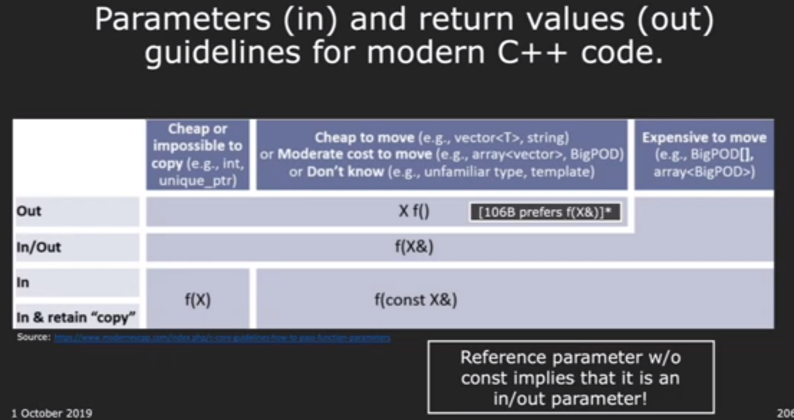

