# Lecture 1: Introduction
> Lecture Video: [https://www.bilibili.com/video/BV1Hr4y137Do/?spm_id_from=333.337.search-card.all.click&vd_source=66aa12d38833505f6c2216f089511404](https://www.bilibili.com/video/BV1Hr4y137Do/?spm_id_from=333.337.search-card.all.click&vd_source=66aa12d38833505f6c2216f089511404)

[lecture1_slides.pdf](https://www.yuque.com/attachments/yuque/0/2022/pdf/12393765/1672221646804-f654c34e-ee56-4713-8aae-52b8959439fb.pdf)
```cpp
#include <iostream>
#include "console.h"
using namespace std;

// The C++ compiler will look for a function
// called "main"
int main() {
   cout << "Hello, world!" << endl;
   return 0;  // must return an int to indicate
              // successful program completion
}

```

# Lecture 2 C++ Fundamentals
> **Lecture Video:** [https://www.bilibili.com/video/BV1Hr4y137Do?p=2&vd_source=66aa12d38833505f6c2216f089511404](https://www.bilibili.com/video/BV1Hr4y137Do?p=2&vd_source=66aa12d38833505f6c2216f089511404)

[Lecture_2_Programming_Fundamentals_in_C++.pdf](https://www.yuque.com/attachments/yuque/0/2022/pdf/12393765/1672221667308-b9b34247-ddd4-4398-a23b-80b88e81da7f.pdf)

## Default - Pass By Value
> 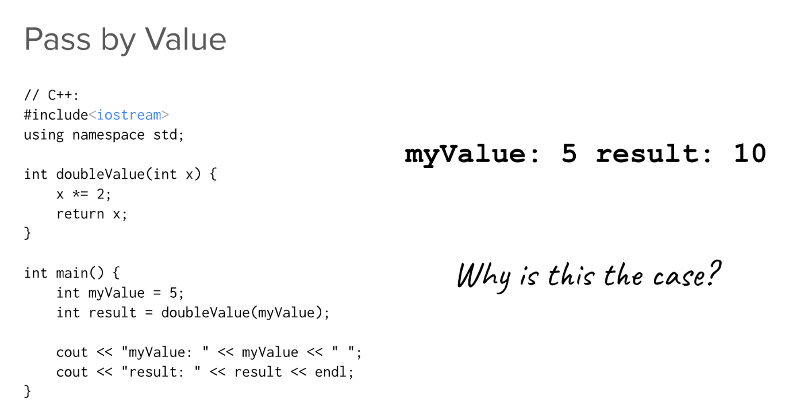
> 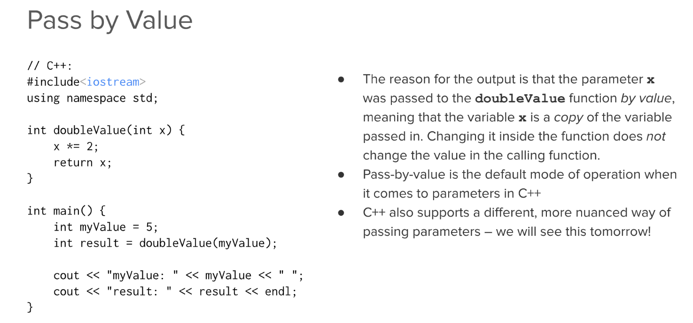


# Lecture 3: String and Testing
[Lecture3_Slides.pdf](https://www.yuque.com/attachments/yuque/0/2022/pdf/12393765/1672154095697-b1902ede-fe8d-4e37-a352-d1afc3d1f868.pdf)
[04-C++-Strings.pdf](https://www.yuque.com/attachments/yuque/0/2022/pdf/12393765/1672384276393-ca586e44-48b0-4014-befe-c74f5d95a12e.pdf)
## For Loop in C++
> 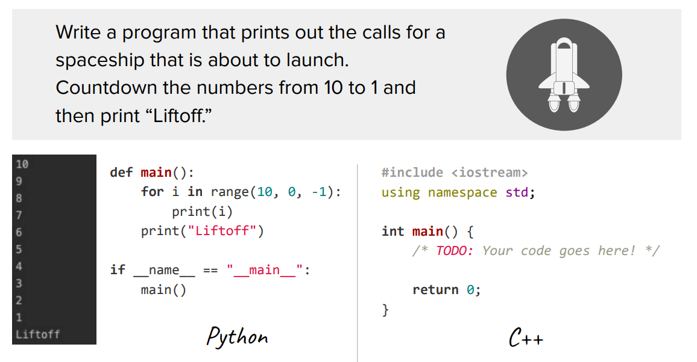

```cpp
#include <iostream>  /* Remember to include this */
using namespace std;  /* Save lots of time when writing codes */

int main(){
    for(int i=10;i>0;i--){
        cout << i << endl;
    }
    cout << "Liftoff" << endl;
    return 0;
}
```
**Qt Output**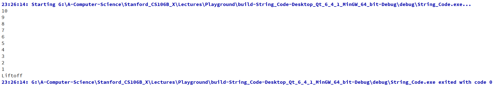


## String
### C++ String
> 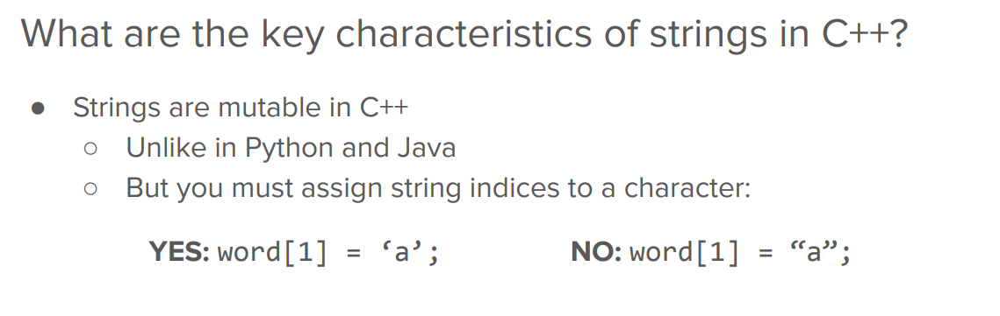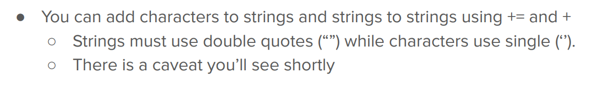
> `string s="ss"`是`C++ String`
> `"sssss"`是`C String`

```cpp
#include "console.h"
#include <string>
#include "strlib.h"
#include "testing-examples.h"
#include "testing/SimpleTest.h"

using namespace std;

// What happens to `word`?
void pollOne() {
    string word = "hello";
    word[1] = 'a';
    cout << word << endl; // hallo, string is mutable in C++
}

// Which of A, B, and/or C is valid?
void pollTwo() {
    char letter = '!';
    string word = "hi";
    string letterStr = "!";

    // A
    word += letter;
    // B
    word = word + letter;
    // C
    word = word + letterStr;

    cout << word << endl; 
    // All of the above are valid. 
    // string+char, string+string, string+=char, string+=string are all valid.
}

// Will abc < bc, abc > bc, or C++ won't be able to evaluate the
// expression? Compare char by char using ascii code.
void pollThree() {
    string abc = "abc";
    string bc = "ab";
    if (abc < bc) {
        cout << "abc < bc" << endl;
    } else if (abc > bc) {
        cout << "abc > bc" << endl; // This line will be executed.
    }
}

// Which statement will be true for the C++ strings `Abc` and `abc`?
void pollFour() {
    string abcUpper = "Abc";
    string abcLower = "abc";
    if (abcUpper < abcLower) {
        cout << "Abc < abc" << endl;
    } else if (abcUpper > abcLower) {
        cout << "Abc > abc" << endl;
    } else {
        cout << "Abc == abc" << endl;
    }
}

// What happens to hiThere?
void pollFive() {
    string hiThere = "hi" + "there";
    cout << hiThere << endl;
}

// What happens to hiThere?
void pollSix() {
    string hiThere = "hi" + '?';
    cout << hiThere << endl;
}

void loopingOverStrFor(string word) {
    /* TODO: FILL IN */
    for (int letterIndex = 0; letterIndex < word.length(); letterIndex++) {
        cout << word[letterIndex] << endl;
    }
}

void loopingOverStrForEach(string word) {
    /* TODO: FILL IN */
    for (char letter : word) {
        cout << letter << endl;
    }
}

void alphabetLoop() {
    for (char letter = 'a'; letter <= 'z'; letter++) {
        cout << letter << endl;
    }
}

void weirdCstringExamples() {
    string hi42 = "hi" + 42;          // C-string + int
    cout << hi42 << endl;             // garbage

//    int castN = (int)"42";            // Qt error; attempts to cast memory address of C-string
    int n = stringToInteger("42");    // Works with Stanford string library function!
    cout << n << endl;


    string okayHiQuestion = "" + string("hi") + '?'; // Auto-converts due to empty C++ string!
    cout << okayHiQuestion << endl;
}

int main() {


    if (runSimpleTests(NO_TESTS)) {
        return 0;
    }

//    pollOne();
//    pollTwo();
//    pollThree();
//    pollFour();
//    pollFive();
//    pollSix();

    loopingOverStrFor("Kylie Jue");
    cout << endl;
    loopingOverStrForEach("Nick Bowman");
    cout << endl;

    alphabetLoop();
    cout << endl;

    weirdCstringExamples();
    return 0;
}
```


### C++ String Concat
> **以下四种均可:**
> - newstrVariable = stringAlias+stringAlias
> - newstrVariable = stringAlis+charAlias
> - stringVariable+=charAlias
> - stringVariable+=stringAlias
> 
**注意不能:**
> newStrVariable = "ss"+"ss"
> 总的来说，必须有一个`string`变量储存才能直接加's'或者"ss".

```cpp
void stringConcat(){
    string str1 = "haha";
    string str2 = "xixi";
    char ch1 = '!';
    char ch2 = '?';
    string str1_str2 = str1 + str2;
    string str1_ch1 = str1 + ch1;

    cout << str1_str2 << endl;
    cout << str1_ch1 << endl;

    str1_str2 += ch2;
    cout<<str1_str2 <<endl;

    return ;
}
```
**Qt Output**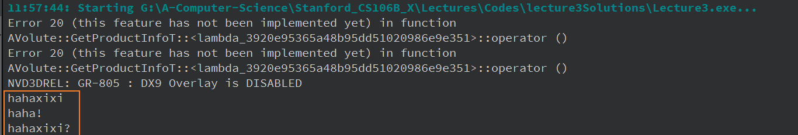
```cpp
string weirdString = str1+'s';
string weirdString = str1+"ss";

```
```cpp
string weirdString = 's'+'s'; // 报错
string weirdString = "ss"+'s'; // 合法但是Warning
string weirdString = "ss"+"ss"; // 报错
```
```cpp

void weirdCstringExamples() {

    string hi42 = "hi" + 's';         // Qt Warnings: Adding 'char' to s string doesn't append to the string
    cout << hi42 << endl;             // garbage

    
    string hi42 = "hi" + 42;          // Qt Warnings: C-string + int
    cout << hi42 << endl;             // garbage

//    int castN = (int)"42";          // Qt Error; attempts to cast memory address of C-string
    int n = stringToInteger("42");    // Works with Stanford string library function!
    cout << n << endl;


    string okayHiQuestion = "" + string("hi") + '?'; // Auto-converts due to empty C++ string!
    cout << okayHiQuestion << endl;
}
```

### String Looping
```cpp
// 1. Using Index(Can munipulate the index)
void stringLooping(string words){
    for(int letterIndex = 0; letterIndex < words.length();letterIndex++){
        cout << words[letterIndex] << endl;
    }
}


// 2. Using ch(Just work with the character)
void stringLooping(string words){
    for(char ch: words){
        cout << ch << endl;
    }
}
```


### String Utility Functions
> 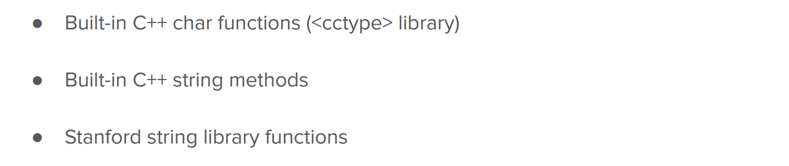


#### cctype library(built-in)
> 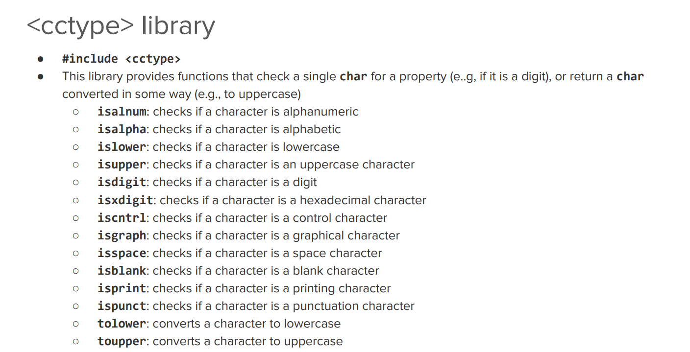


#### string methods
> 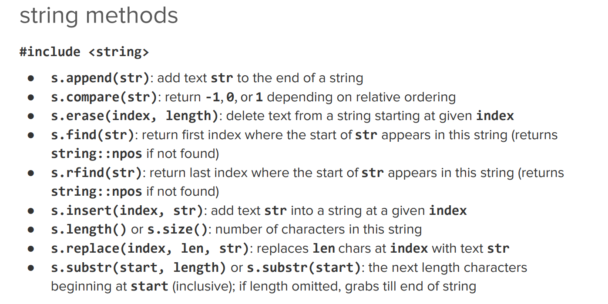


#### stanford string library 
> 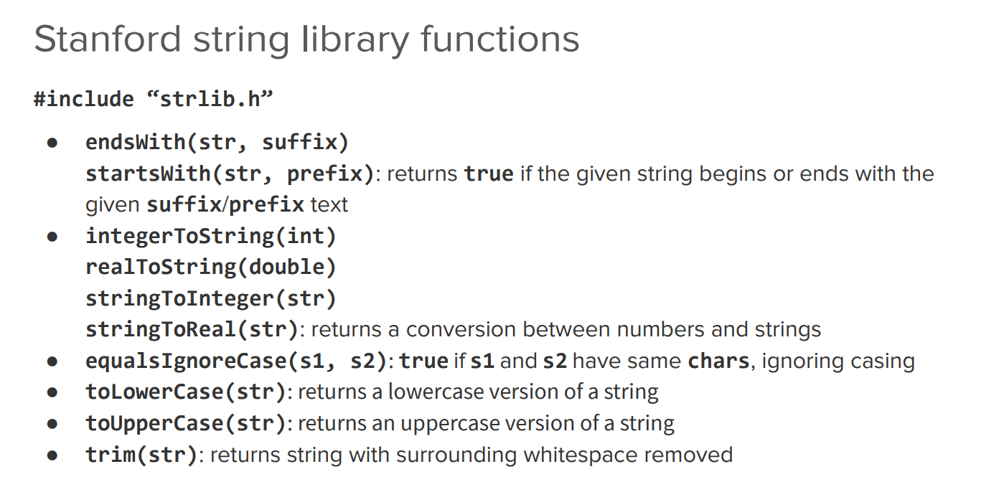


### C strings vs. C++ strings Summary
> 


## Testing
> **Testing Guide:** [https://web.stanford.edu/class/cs106b/resources/testing_guide.html](https://web.stanford.edu/class/cs106b/resources/testing_guide.html)

### Definition
> 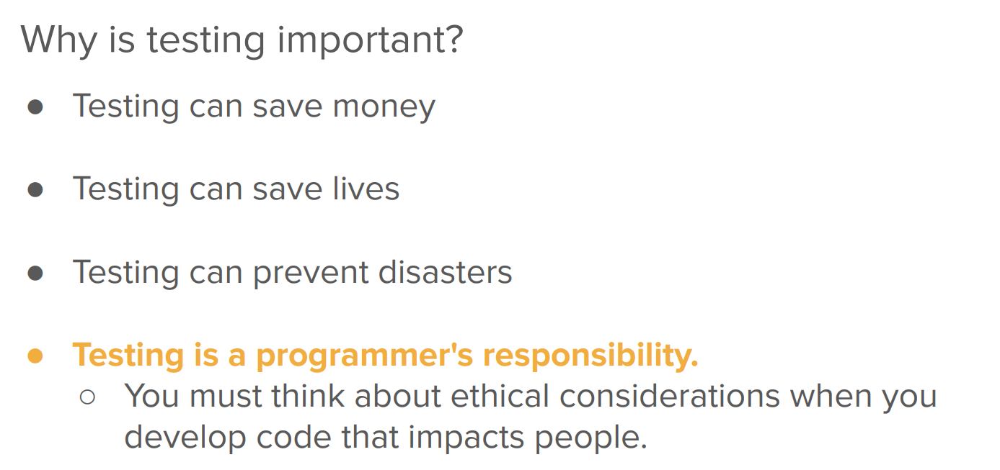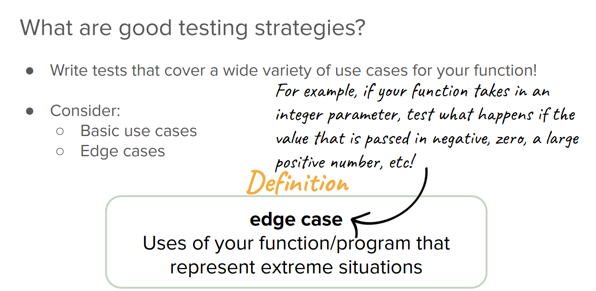


### SimpleTest
> 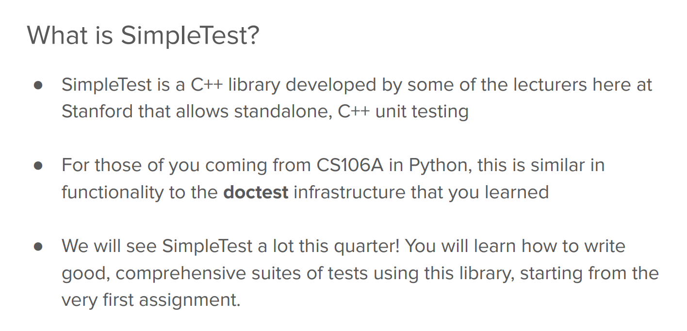

```cpp
#include "console.h"
#include <string>
#include "strlib.h"
#include "testing-examples.h"
#include "testing/SimpleTest.h"

using namespace std;

int main() {

    // Could change from 'NO_TESTS' to 'ALL_TESTS' or 'SELECTED_TESTS'
    if (runSimpleTests(NO_TESTS)) {
        return 0;
    }

```
```cpp
/* All Examples from Introduction to C++ Lecture
 * Note: this project will compile with warnings about
 * unused variables.
 */

#include <iostream>
#include <cmath>
#include "console.h"
#include "testing-examples.h"
#include "testing/SimpleTest.h"

using namespace std;

// functions that main uses:

int factorial(int number) {
    int result = 1;
    for (int n = number; n > 1; n--) {
        result *= n;
    }
    return result;
}

PROVIDED_TEST("Some provided tests."){
    EXPECT_EQUAL(factorial(1), 1);
    EXPECT_EQUAL(factorial(2), 2);
    EXPECT_EQUAL(factorial(3), 6);
    EXPECT_EQUAL(factorial(4), 24);
}
```
**Qt Output****ALL_TESTS:**
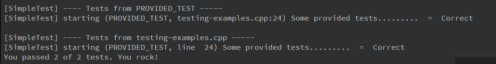
**SELECTED_TESTS:**
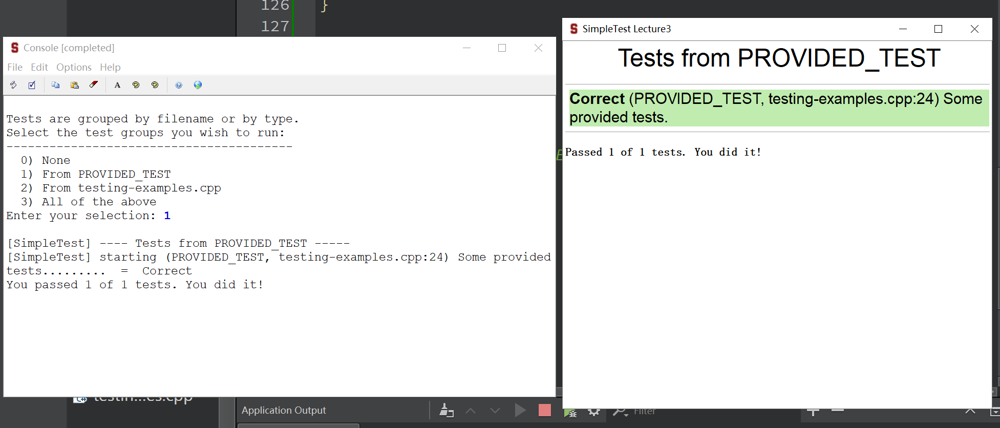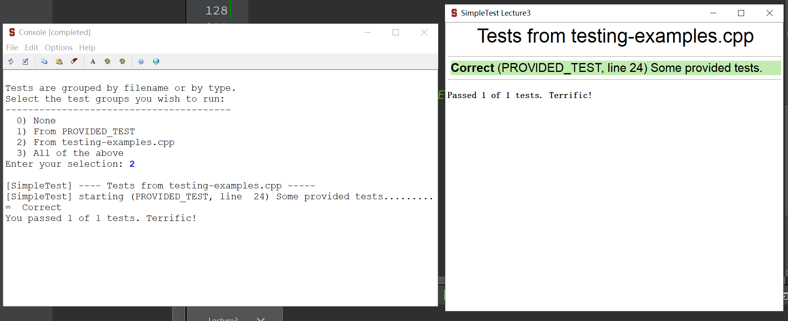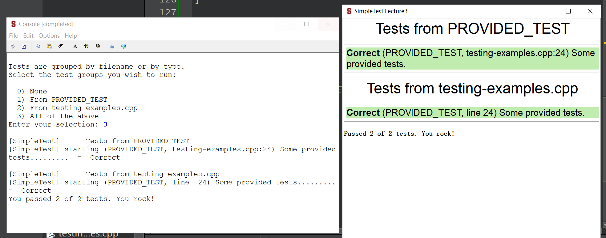

# Testing and the SimpleTest Framework
:::info
[https://web.stanford.edu/class/cs106b/resources/testing_guide.html](https://web.stanford.edu/class/cs106b/resources/testing_guide.html)
:::
[CS106B Testing and the SimpleTest framework.pdf](https://www.yuque.com/attachments/yuque/0/2022/pdf/12393765/1672222236319-3a017d56-8fde-43ad-ab1e-967f84477423.pdf)
