> **Lecture Video:** [https://www.youtube.com/watch?v=tbjwPeEl2jA&list=PLCgD3ws8aVdolCexlz8f3U-RROA0s5jWA&index=5](https://www.youtube.com/watch?v=tbjwPeEl2jA&list=PLCgD3ws8aVdolCexlz8f3U-RROA0s5jWA&index=5)

[lecture3_streams_f22.pdf](https://www.yuque.com/attachments/yuque/0/2022/pdf/12393765/1672379267361-82612565-9877-41d7-b483-f693ce4093c1.pdf)
[lecture4_streams_s23.pdf](https://www.yuque.com/attachments/yuque/0/2023/pdf/12393765/1692350256324-bfa7095a-3fb5-40ef-ac66-7ccda6bd20f4.pdf)

# Overview
## Definition of Streams
> 


## Classification of Streams
> 


## Four Bits for Streams
> 


### fail state
> 1. 无法转换的数据类型
> 
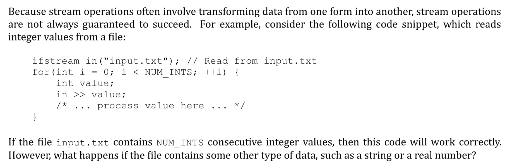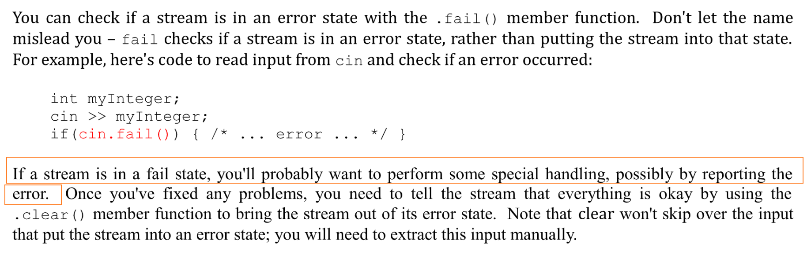
> 2. 数据源不存在，比如文件不存在:
> 
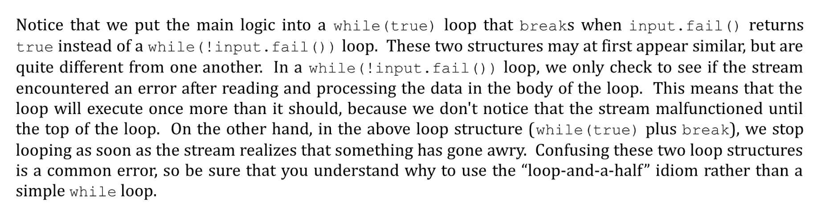


### Codes
> 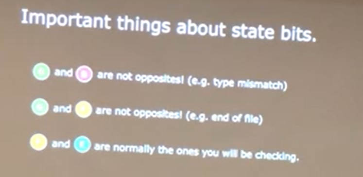

```cpp
#include <sstream>
#include <iostream>
using namespace std;

void printStateBits(istream& s){
    cout << "State Bits: ";
    cout << (s.good() ? "G":"*");
    cout << (s.fail() ? "F":"*");
    cout << (s.eof() ? "E":"*");
    cout << (s.bad() ? "B":"*") << endl;
}


int stringToInteger(const string& str){
    // Error checking before read
    istringstream iss(str);
    cout << "Before read: ";
    printStateBits(iss);

    int value;
    iss >> value;

    // Error checking after read
    cout << "After read: ";
    printStateBits(iss);
    return value;
}

int main()
{

    ostringstream oss("Ito En Green Tea", ostringstream::ate);
    istringstream iss("Ito En Green Tea");


    // Print the statebits
    cout << stringToInteger("\n") << endl;
    cout << stringToInteger("lol4.6") << endl;
    cout << stringToInteger("lol4") << endl;
    cout << stringToInteger("4w") << endl;
    cout << stringToInteger("ww") << endl;

    return 0;
}

```
**Output**

## Loop-and-a-half idiom
> 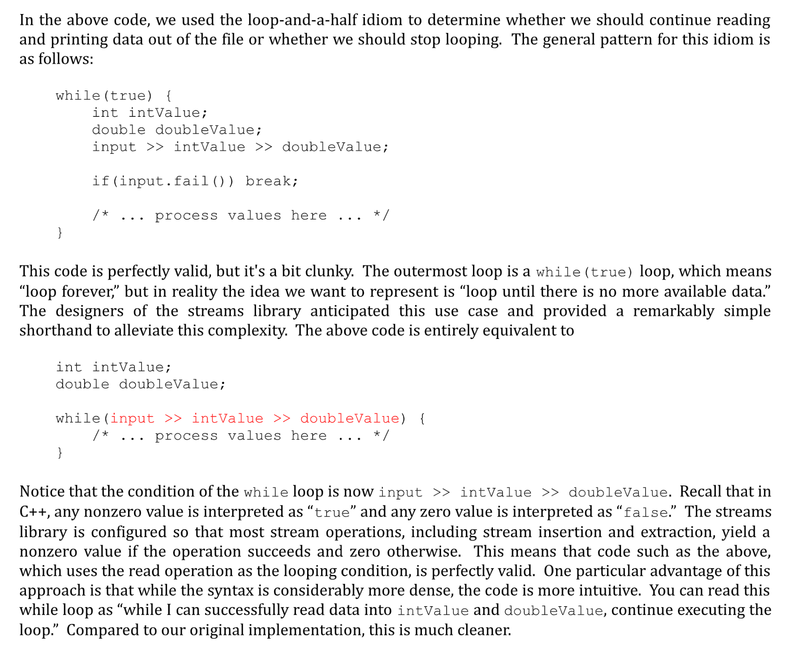


# 1 stringStream
## Definition
> 


## ostringStream
> Stands for `outputstringStream`
> `ostringstream oss("Ito En Green Tea")`: Create a buffer array that holds all the characters and set the pointer to before the first character. There is a limit to the size of the oss, but finitely many spaces.
> 
> `oss.str()` : Convert the buffer array to string, ready for `cout`.
> `oss << 16.9 << " Ounce "`: Write the chars to the buffer from where the cursor is initially located and **move the cursor**. May override the buffer array. 注意`16.9`是`double`类型，`ostringstream`会将其自动转换成`string`类型。
> 
> `ostringstream oss("Ito En Green Tea", ostringstream::ate)`: Initialize the string and set the pointer to the end of the buffer array. (注意是在`\n`之后的一位。)
> 
> 注意: `cout << oss <<endl`会报错，`oss`是一个对象，我们需要深入理解`C++`的`Class`来了解`C++`会如何处理对象的打印。
> `oss.seekp(0)`: Sets the position where the next character is to be inserted into the output stream. Set the cursor to index 0


## Key Methods
> 


## StringToInteger
```cpp

int stringToInteger(const string& str){
    // No Error Checking
    istringstream iss(str);
    int value;
    iss >> value;
    return value;
}
```
**Output**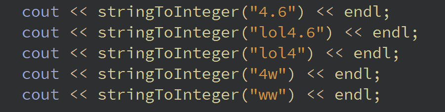
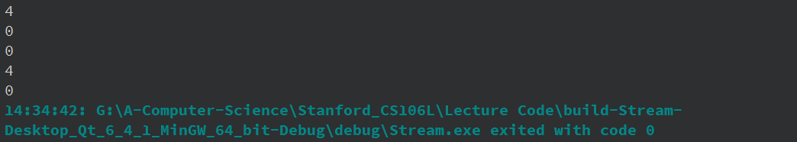
> 我们必须保证在我们读完`inputstream`之后`stream`的`state`必须是`**E*`

```cpp
#include <sstream>
#include <iostream>
using namespace std;

void printStateBits(istream& s){
    cout << "State Bits: ";
    cout << (s.good() ? "G":"*");
    cout << (s.fail() ? "F":"*");
    cout << (s.eof() ? "E":"*");
    cout << (s.bad() ? "B":"*") << endl;

}


int stringToInteger(const string& str){
    // Error checking before read
    istringstream iss(str);
    cout << "Before read: ";
    printStateBits(iss);

    int value;
    iss >> value;

    // If the value isn't the int or the value is int but still have more to read, then fail
    if(iss.fail() || !iss.eof()){
        throw domain_error("stringToInteger...");
    }

    // Error checking after read
    cout << "After read: ";
    printStateBits(iss);
    return value;
}

int main()
{

    ostringstream oss("Ito En Green Tea", ostringstream::ate);
    istringstream iss("Ito En Green Tea");

    cout << stringToInteger("\n") << endl;
    cout << stringToInteger("lol4.6") << endl;
    cout << stringToInteger("lol4") << endl;
    cout << stringToInteger("4w") << endl;
    cout << stringToInteger("ww") << endl;
    return 0;
}


```
> 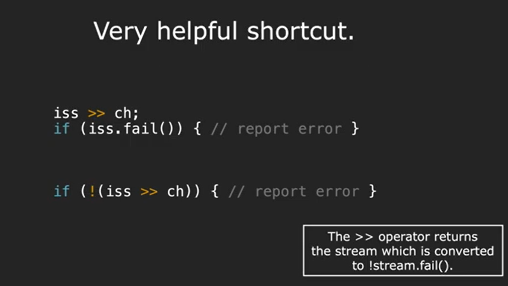


## When to Use?
> 


# 2 iostream
> 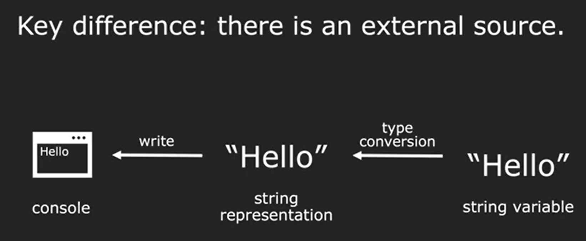


## Four iostreams
> 


## Stream Extraction/Insertion
> 


## cin - 标准输入流
### Definition
> 


### cin Details
> 
> **当下一行**`**cin**`**执行时，**`**cin**`**会先跳过任何的**`**whitespace**`**(包括**`**tab, space, newliner**`**)。然后如果**`**buffer**`**中没有**`**Trash**`**的话, 就会再**`**prompt user input**`**。**
> 

```cpp
#include <sstream>
#include <iostream>
using namespace std;


int getInteger(const string& prompt="Enter an integer: ",
               const string& reprompt = "Illegal numeric format. Try again. \n");


int main(){
    cout << "What is your name?";
    string name;
    getline(cin, name);

    int age = getInteger("What is your age? ");

    cout << "Where are you from? ";
    string home;
    getline(cin,home);

    cout << "Hello " << name << "(age " << age << " from " << home << ")" << endl;
    return 0;
}

int getInteger(const string& prompt,
               const string& reprompt){
    return 0;
}

```
```cpp
#include <sstream>
#include <iostream>
using namespace std;


int getInteger(const string& prompt="Enter an integer: ",
               const string& reprompt = "Illegal numeric format. Try again. \n");


int main(){
    cout << "What is your name?";
    string name;
    cin >> name;

    cout << "What is your age?";
    int age;
    cin >> age;

    cout << "Where are you from? ";
    string home;
    cin >> home;

    cout << "Hello " << name << "(age " << age << " from " << home << ")" << endl;
    return 0;
}

int getInteger(const string& prompt,
               const string& reprompt){
    return 0;
}

```


### cin 的自动截断
> 下面的例子说明了，有时候`Stream`的默认行为会给我们的编码过程造成不小的麻烦:
> 
> **其中:**
> `cin >> age`代码行，如果用户输入了一个`double`类型的`2.71828`, 那么`age`会被赋值为`2`(**并不会报错**), 且`hourlyWage`会被赋值为`0.71828`(且并不会`Prompt Users`)。所以，结果就是，我们的`age`变量被`malformed`了， 但是整个代码执行过程中至少报错。
> **下面是另一个例子:**
> 
> 但是，有些情况下，默认行为就会变得非常糟糕, 这种自动截断输入的特性会造成一些系统安全性问题:
> 


### Reading Steams and Ints
**Procedure, 所有单词用\n分割**用户输入前，`cin`代表的`istream`的状态是`E`, 表示`buffer`中没有`char`了，等待用户输入，`cursor`在`index 0`之前。

1. `cin`在我们输入的时候`buffer`就一直会变化，当用户按下`Enter`时，`cin`中`append`了`\n`, 随后`cin >>`将`buffer`中的`**\n**`**或者**`**whitespace**`之前的内容读入变量`name`中，`cursor`停在`\n`或者`whitespace`之前的一位。
2. `cin >> age`，执行第二行，首先跳过`\n`和`whitespace`，然后将`buffer`状态置为`E`, 等待用户输入。


**Procedure, 单词中有空格**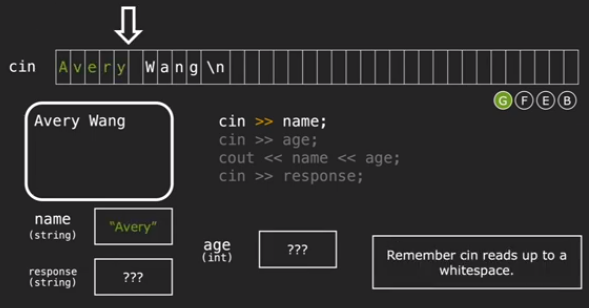
Now the buffer is not empty, we don't prompt the user for input, so we read the buffer and try to `cin >> age`, but the `Wang`is not an `int`, so it fails. All future operations don't work.

> 


## cout - 标准输出流
> 


## getline
### What it does?
> 


### How to use?
> 


### getline pitfalls
> 
> `getline`会`skip the delimiter`说的是读取到的字符串中不会包含`\n`
> `getline(cin,variable, option)`: option参数可以更改`stopping delimiter`
> 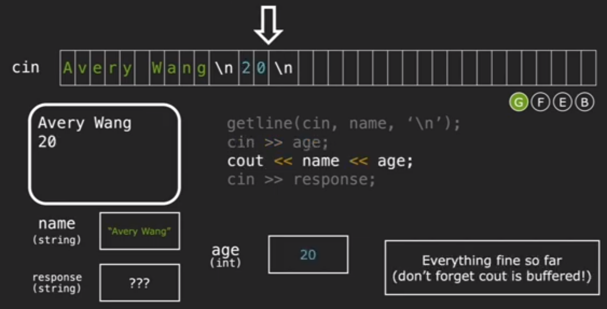


### getline with cin.ignore
> 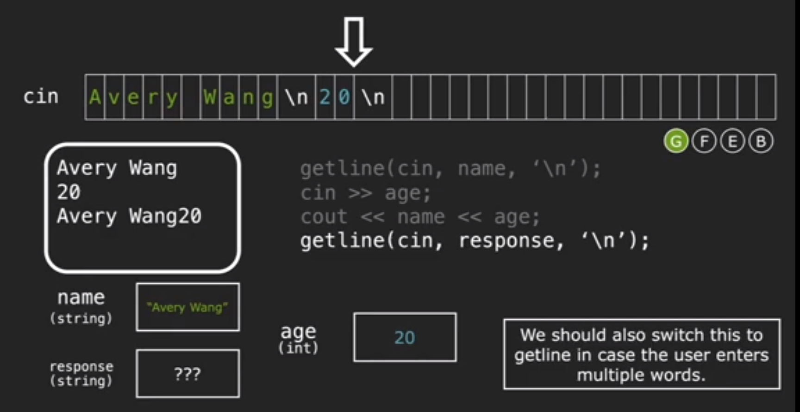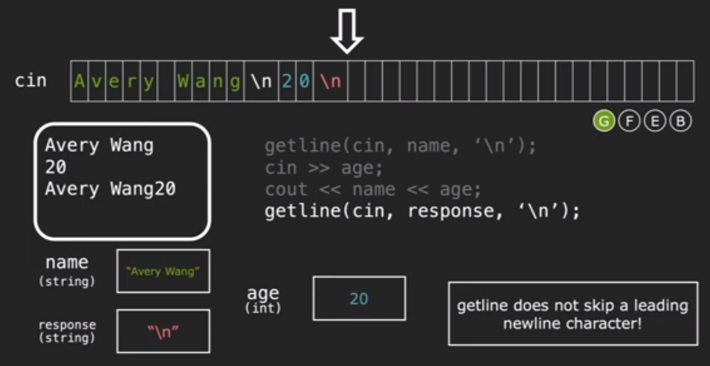
> `cin.ignore`就是将`cursor`往后移动一位。
> 


### Read files with getline
> 
> 为了按行读取文件，我们可以使用`String Extraction Operator``>>`, 也可以使用`getline(cin, variable, delimiter)`。
> 

```cpp
int readFileAndPrint(string filename){
    /* Open the file */
    ifstream capitals("world-capitals.txt");
    if(!capitals.is_open()){
        cerr << "Cannot find the file world-capitals.txt" << endl;
        return -1;
    }
    /*  Process the file */
    while(true){
        string capital, country;
        getline(capitals, capital);
        getline(capitals, country);

        if (capitals.fail()) break;

        cout << capital << " is the capital of " << country << endl;
    }
    return 0;
}
```
```cpp
int readFileAndPrint(){
    /* Open the file */
    ifstream capitals("world-capitals.txt");
    if(!capitals.is_open()){
        cerr << "Cannot find the file world-capitals.txt" << endl;
        return -1;
    }
    /*  Process the file */
    string capital, country;
    while(getline(capitals, capital) && getline(capitals, country)){
        cout << capital << " is the capital of " << country << endl;
    }
    return 0;
}
```
```cpp
# include <string>
# include <iostream>
# include <fstream>
using namespace std;

int readFileAndPrint();

int main(int argc, char *argv[])
{
    readFileAndPrint();
    return 0;
}


int readFileAndPrint(){
    /* Open the file */
    ifstream capitals("world-capitals.txt");
    if(!capitals.is_open()){
        cerr << "Cannot find the file world-capitals.txt" << endl;
        return -1;
    }
    /*  Process the file */
    string capital, country;
    while(getline(capitals, capital) && getline(capitals, country)){
        cout << capital << " is the capital of " << country << endl;
    }
    return 0;
}
```

### Summary
> - `cin`会在`whitespace`之前停下
> - `getline(cin, variable, delimiter)`会在指定的`delimiter`之后停下，但是读取到的信息中不包括`delimiter`。
> - `cin`和`getline`在`buffer`为空时都会`prompt user`
> - 在执行下一个`cin`时候，`cin`会跳过上一次`cin`遗留下的`whitespace`或者，并`prompt user`。
> - `cin.ignore()`用于将`buffer`的指针向后移动一位，通常为了解决`buffer`中有`\n`导致的`getline`无法正确`prompt user`的问题。


## getInteger
> 
> Fix: Stanford getInteger
> 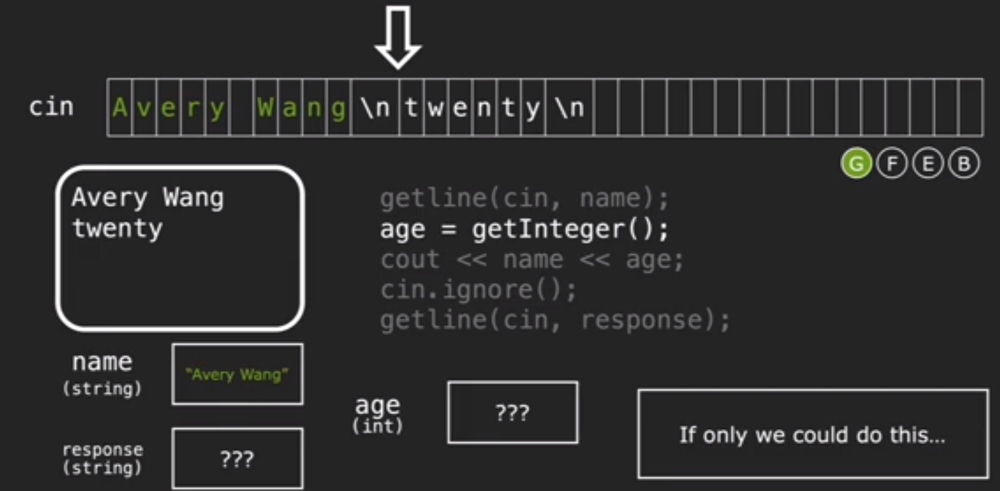
> **Google Recommended Fix(Ugly):**
> 
> 
> 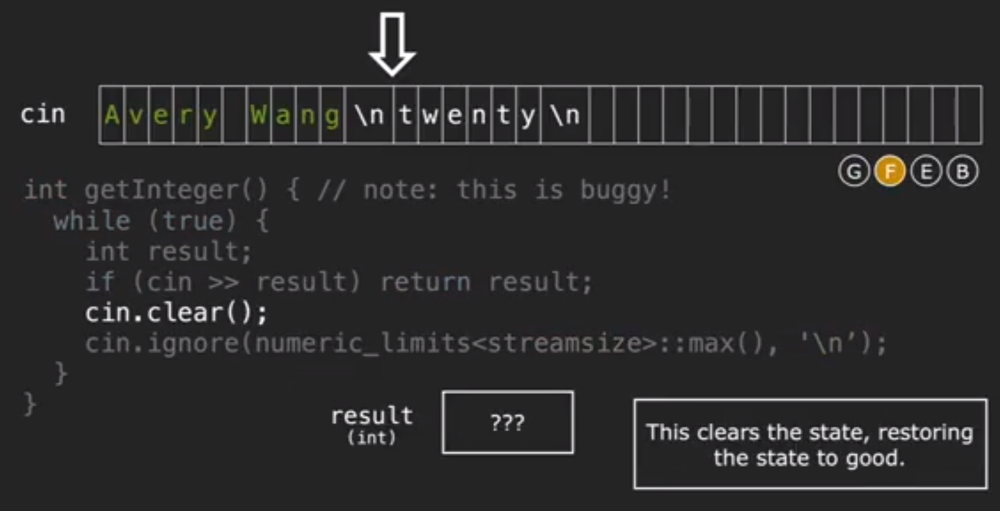
> 
> `cin.clear()`: `Reset the state and restore the state to good`.

```cpp
int getInteger(const string& prompt,
               const string& reprompt){
    /* If users type in integer, good, return.
     * If not, reprompt until valid input*/

    while(true){
        cout << prompt;
        string line;
        if(!getline(cin, line)) throw domain_error("...");

        istringstream iss(line);
        int val; char remain;

        // If the value is int and that no more to read, succeed
        if(iss >> val && !(iss >> remain)){
            return val;
        }

        // Instead of throwing errors, we reprompt
        cout << reprompt << endl;
    }

    return 0;
}
```

## Summary
**Summary**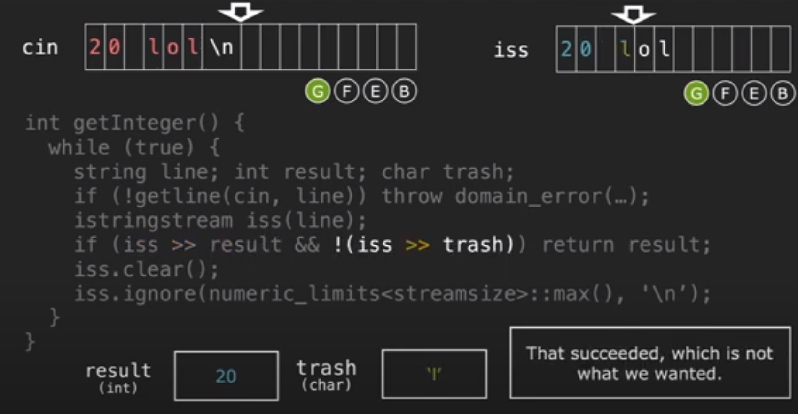


# 3 filestream
> `#include <fstream>`:
> - `ifstream`stands for input file stream (not “something that might be a stream”)
> - `ofstream`stands for output file stream  


## ifstream - 文件输入流
### 创建文件输入流
> `ifstream(inputFileStream)`是`Class Type`而不是我们能够直接使用的`object`, 所以我们需要先实例化这个`Class`, 实例化之后就可以和`cin`的用法基本一致了:
> - `ifstream myStream("myFile.txt")`  表示我要从`myFile.txt`文件中读取内容
> - `int myInteger;`
> - `myStream >> myInteger;` 
> 
注意我们不能直接`ifstream >> myInteger`, 这将导致`Compilation`不通过。另外我们也可以使用`ifstream`对象中的`open`方法创建一个文件输入流。
> `ifstream myStream;`
> `myStream.open("myFile.txt")`


### 判断文件是否存在
> 判断文件是否存在我们可以使用`.is_open()`方法。
> `istream input("myfile.txt")`
> `if(! input.is_open()){ cerr<<...<<endl;}`


## ofstream - 文件输出流
### 创建文件输出流
> `ofstream myStream("myFile.txt")`, 表示我要往`myfile.txt`中写内容
> 


## 注意事项
### 初始化
> 注意到我们在创建文件输入/输出流的时候，传入的文件名是`"myFile.txt"`, 这是一个`C String`而不是`C++ String`, 这是因为`ifstream`和`ofstream`接口是先于`string`类型出现的，所以我们如果手头一个`string`类型的文件名，需要先通过`filenameInString.to_str()`转换成`C`风格的字符串才能传入`open(...)`或者`ifstream myStream(...)`中。
> 


### 关闭文件流
> 


# 4 Stream Manipulators
## Table Formatter
> It's an example of a stream manipulator, an object that can be inserted into a stream to **change some sort of stream property. **`endl`和`setw/left/right/setfill`是其中的几个，我们也可以使用这几个`Manipulators`完成下面的文件读取任务。
> **假设现在我们有一个文件**`**table-data.txt**`**, 我们想要对其进行格式化输出:**
> 


## setw
> 在`<iomanip>`中定义, 通过`#include <iomanip>`引入头文件:
> 


## Code Implementation
### PrintTableBody
> 

```cpp
void PrintTableBody(){
    // Read from the file through ifstream, absolute path needed
    ifstream input("table-data.txt");
    if (!input.is_open()){
        cerr << "No such file exists!" << endl;
    }

    // Loop over the lines in the file reading data.
    for(int k = 0; k < NUM_LINES; k++){
        /* Process data */
        int intValue;
        double doubleValue;
        // Read two values, one is int, another is double
        input >> intValue >> doubleValue;
        cout << setw(COLUMN_WIDTH) << (k + 1) << " | ";
        cout << setw(COLUMN_WIDTH) << intValue << " | ";
        cout << setw(COLUMN_WIDTH) << doubleValue << endl;
    }
}
```


### PrintTableHeader
> 
> 我们可以使用`setfill(...)`(永久设置`setw(int)`用`...`来填补`whitespace`)来简化我们的代码书写, **一般和**`**setw**`**一起使用**:
> 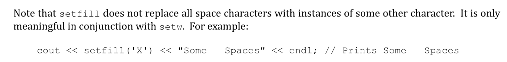
> 使用`setw`的技巧，我们可以简化`PrintTableHeader`的代码。

```cpp
void PrintTableHeader(){
    /* Print the first two header segment */
    for(int column = 0; column < NUM_COLUMNS; column++){
        for(int k = 0; k < COLUMN_WIDTH; k++){
            cout << '-';
        }
        cout << "-+-";
    }

    /* Print the last header segment */
    for(int k = 0; k < COLUMN_WIDTH; k++){
        cout << '-';
    }
    cout << endl;
}

```
```cpp
void PrintTableHeader() {
     /* Print the ---...---+- pattern for all but the last column. */
     for(int column = 0; column < NUM_COLUMNS - 1; column++){
        cout << setfill('-') << setw(COLUMN_WIDTH) << "" << "-+-";
     }
     /* Now print the ---...--- pattern for the last column and a newline. */
     cout << setw(COLUMN_WIDTH) << "" << setfill(' ') << endl;
}
```

### Complete Codes
```cpp
# include <string>
# include <iostream>
# include <fstream>
# include <iomanip>
using namespace std;

const int NUM_LINES = 4;
const int NUM_COLUMNS = 3;
const int COLUMN_WIDTH = 20;


void PrintTableHeader();
void PrintTableBody();

int main(int argc, char *argv[])
{
    PrintTableHeader();
    PrintTableBody();
    return 0;
}


void PrintTableBody(){
    // Read from the file through ifstream, absolute path needed
    ifstream input("table-data.txt");
    if (!input.is_open()){
        cerr << "No such file exists!" << endl;
    }

    // Loop over the lines in the file reading data.
    for(int k = 0; k < NUM_LINES; k++){
        /* Process data */
        int intValue;
        double doubleValue;
        // Read two values, one is int, another is double
        input >> intValue >> doubleValue;
        cout << setw(COLUMN_WIDTH) << (k + 1) << " | ";
        cout << setw(COLUMN_WIDTH) << intValue << " | ";
        cout << setw(COLUMN_WIDTH) << doubleValue << endl;
    }
}

//void PrintTableHeader(){
//    /* Print the first two header segment */
//    for(int column = 0; column < NUM_COLUMNS; column++){
//        for(int k = 0; k < COLUMN_WIDTH; k++){
//            cout << '-';
//        }
//        cout << "-+-";
//    }

//    /* Print the last header segment */
//    for(int k = 0; k < COLUMN_WIDTH; k++){
//        cout << '-';
//    }
//    cout << endl;
//}


void PrintTableHeader() {
    /* Print the ---...---+- pattern for all but the last column. */
    for(int column = 0; column < NUM_COLUMNS - 1; column++){
        cout << setfill('-') << setw(COLUMN_WIDTH) << "" << "-+-";
    }
    /* Now print the ---...--- pattern for the last column and a newline. */
    cout << setw(COLUMN_WIDTH) << "" << setfill(' ') << endl;
}

```

### Commonly used stream manipulators
> 


## 

### getline()
> It reads characters from a stream until a newline character is encountered, then stores the read characters (minus the newline) in a string . getline accepts two parameters, a stream to read from and a string to write to. For example, to read a line of text from the console, you could use this code:
> 
> **Loop-and-a-half&its simplification:**
> 


# 
