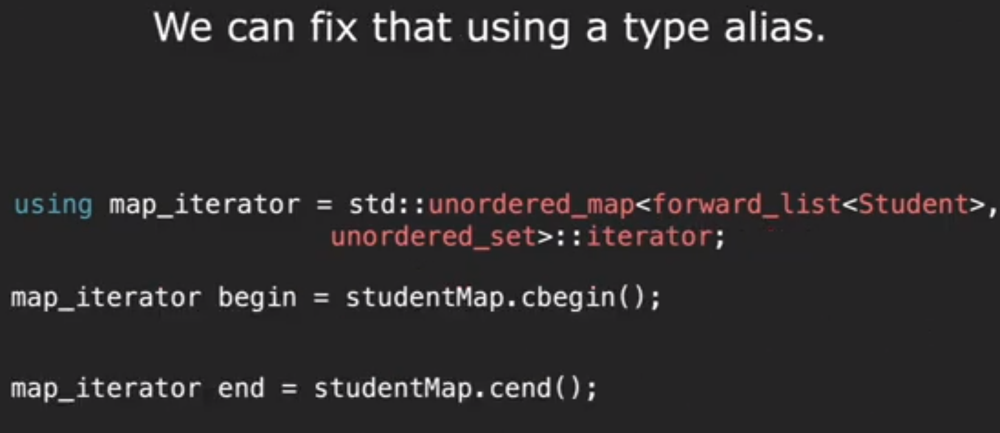
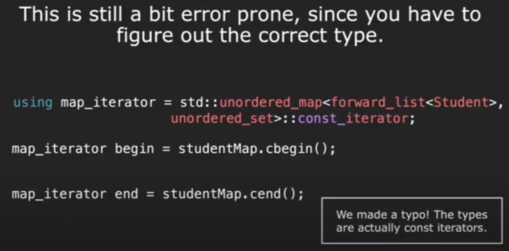

[lecture2_typesandstructs_f22.pdf](https://www.yuque.com/attachments/yuque/0/2022/pdf/12393765/1672379120745-de9bfcb3-9f1e-4d1f-a277-e1a792ba0e5a.pdf)
[lecture2_typesandstructs_s23.pdf](https://www.yuque.com/attachments/yuque/0/2023/pdf/12393765/1692351376239-10530862-36a4-4f29-b29a-c908bf191887.pdf)

# *Type
> 

# Overloading
## Example 1
> 

## Example 2
> 

# Struct
## When to Use?
> 

## How to Use
> 

# Built-in Struct
## std::pair
> 

## Initialize the pair
> 

# Auto
[lecture3_initandref_s23.pdf](https://www.yuque.com/attachments/yuque/0/2023/pdf/12393765/1692413364277-ee8936f1-8506-451d-8c60-95a80da9e772.pdf)
## Definition
> 

## Type Deduction
> 
> 
> Auto is a Compile Time thing.
> 
> - `auto`gets rid of all the reference
> - auto copy => vector<string>
> - auto multiplier => double
> - auto name => C string
> - auto betterName => C++ string
> - auto& refMult => double&
> - auto func => lambda function
> 

> can be used as return value type
> 

## Structured Binding
> 

## Auto Caveats
> 

## Why Auto？
> 

# Type Aliasing
> 

