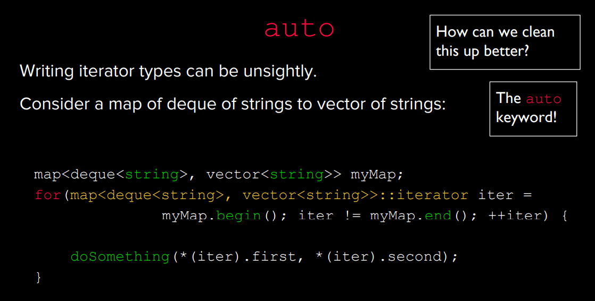
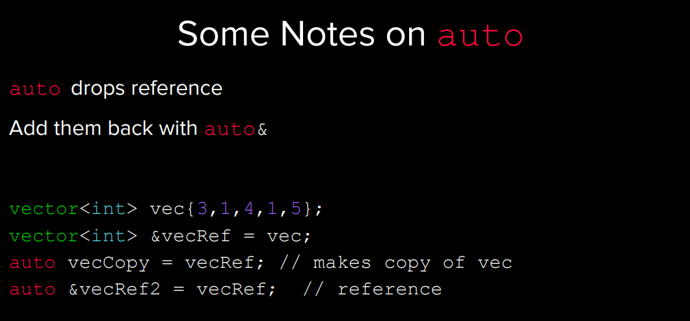
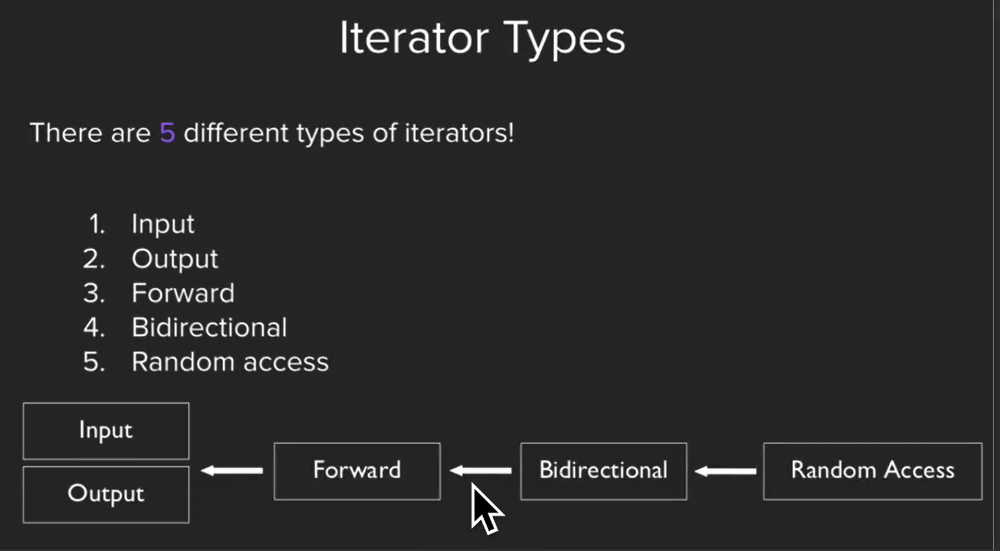
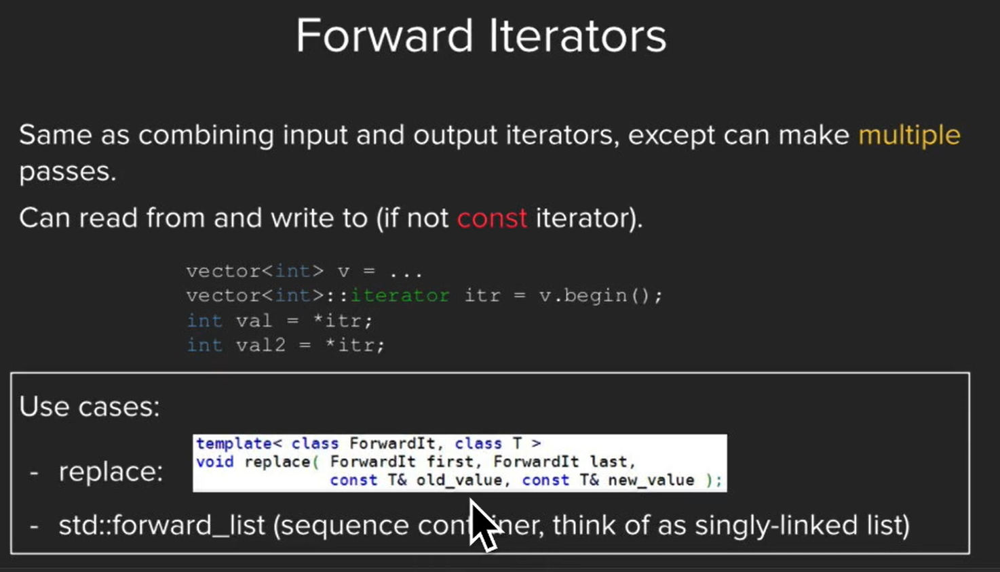
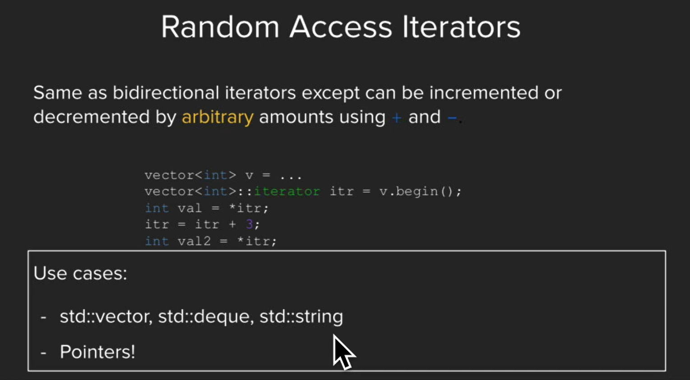
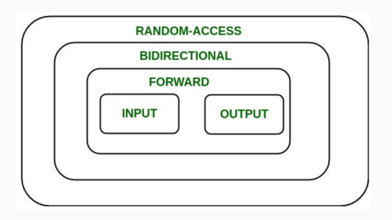
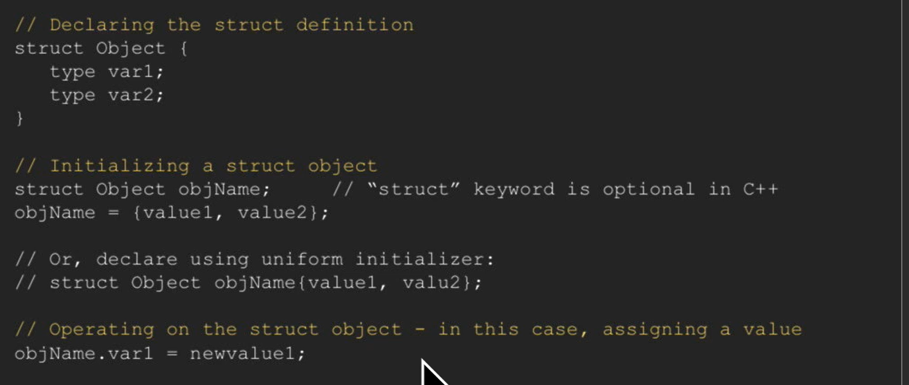
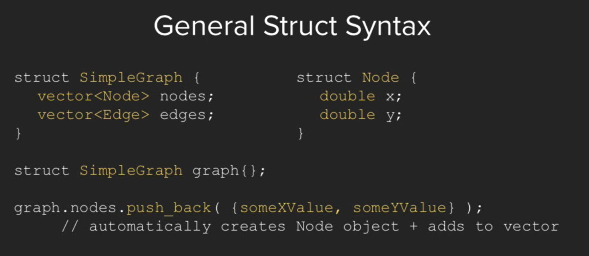

# 2 Iterators
## Definition
> [!def]
> 


## Basic Usage&Example
> [!important]
> 

```cpp
// ========================================================================

#include <iostream>
#include <set>

using std::cout;    using std::endl;
using std::set;

int main() {
    // We first populate this set of integers with the numbers from 0 to 9,
    // inclusive.
    set<int> container;
    for (int i = 0; i < 10; ++i)
        container.insert(i);

    // Now, we iterate through the container and print each element one at a time.
    // We do this using an iterator object which starts at the container's
    // beginning. We keep looping as long as we haven't hit the end of the
    // container yet. Inside the loop, we ask for the current value (*itr), and
    // then instruct the iterator to move to the next location (++itr).
    set<int>::iterator itr = container.begin();
    while (itr != container.end()) {
        cout << *itr << ' ';
        ++itr;
    }
    cout << endl;

    // alternatively:
    set<int>::iterator itr2;
    for(itr2 = container.begin(); itr2 != container.end(); ++itr2) {
        cout << *itr2 << ' ';
    }

    cout << endl;

    return 0;
}
```

## Advantage of Iterator
> 


## More Example
> 


## Further Iterator Usages⭐⭐⭐⭐⭐
```cpp
#include <iostream>
#include <string>
#include <sstream>
#include <vector>
#include <set>
#include <algorithm>

using std::string;  using std::cin;
using std::cout;    using std::endl;
using std::vector;     using std::stringstream;
using std::set;


int main() {
    vector<int> vec{3,1,4,1,5,9,2,6,5,3};

    // 1. we can use iterators in algorithms like sort to sort a vecotr
    std::sort(vec.begin(), vec.end());


    // 2. we can also use the find algorithm to look for an element
    // in a collection and return an iterator to it
    // find() is faster than calling .count() to find an element in a collection since
    // count() is implemented using find().
    vector<int>::iterator it = std::find(vec.begin(), vec.end(), 5);
    if(it != vec.end()) {
       cout << "Found elem " << *it << endl;
    } else {
       cout << "Element not found " << endl;
    }
    // *Important: the vec.end() points to the index right after the last element 
    // of the container.


    set<int> mySet{4,1,3,5,55,5, 9, 22, 19, 28};

    // 3. we can iterate through a range of elements in a sorted collection
    // lower_bound: returns an iterator to the first element not less than the given key
	// upper_bound: returns an iterator to the first element not greater than the given key
    set<int>::iterator iter = mySet.lower_bound(7);
    set<int>::iterator end = mySet.upper_bound(28);

    while(iter != end) {
        cout << *iter << endl; // 9 19 22 28
        ++iter;
    }

    return 0;
}

```

### find&range
> **Important Notes:**
> 1. The `???.end()` points to the index right after the last element of the container.
> 2. We use `find(???.begin(), ???.end())`more often to find an element in an arbitrary container and perfer not to use `count(elem)`since `find()`is faster than `count()`and `count()`is implemented upon `find()`
> 

> 3. **We can iterate through a range of elements in a sorted collection:**
> 


### range for loop
> 


## Notes on auto
> 


## Notes on ++iter
> 


# 3 Iterator Types⭐⭐⭐⭐⭐
## Overview
> 
> 上面的链条可以理解为继承链，表明链条右侧的`Iterator`比左侧的功能更强大。
> 

**Example**


## Input Iterators
> 
> 只能一次移动一个`index`, `can only increment by one`


## Output Iterators
> 


## Forward Iterators
> 


## Bidrectional Iterators
> 


## Random Access Iterators
> 


## Summary
> 


# 4 Pointers
[lecture6_iterators_and_pointers_w23.pdf](https://www.yuque.com/attachments/yuque/0/2023/pdf/12393765/1693582435938-f8920744-26ae-4d52-b94f-0cdc990a063b.pdf)

## Memory
> 


## Dereferencing
> 


## Object Instance
> 


## Summary
> 


# 5 Structs Recap
## Initialization of Structs
> 
> 可以省略`struct keyword`


## General Struct Syntax
> 

