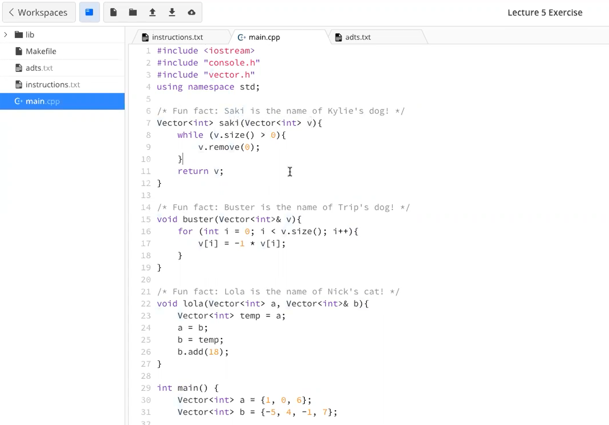

:::info
Reading 2.5~2.9, 4, 5.1
:::
[Lecture4_Slides.pdf](https://www.yuque.com/attachments/yuque/0/2022/pdf/12393765/1672285363666-5e7ad11b-03d3-43b5-a352-c1cc0a4a7da5.pdf)
[Lecture5_Slides.pdf](https://www.yuque.com/attachments/yuque/0/2022/pdf/12393765/1672285920303-7b266ce0-ac66-4e0e-a170-201b0bbc5c7b.pdf)
[Lecture6_Slides.pdf](https://www.yuque.com/attachments/yuque/0/2022/pdf/12393765/1672369971554-500af6d9-c255-4805-934b-ecb9df144122.pdf)
[Lecture6Final.zip](https://www.yuque.com/attachments/yuque/0/2022/zip/12393765/1672370052359-ca815735-2923-490d-8ce5-8f4ad9271f2f.zip)
[Lecture6Starter.zip](https://www.yuque.com/attachments/yuque/0/2022/zip/12393765/1672370052338-4d0639a5-d831-4dae-93b9-acfd7fbdab0b.zip)

# 1 Interfaces and Implementations
## Definition
:::info
**Interface File: **`.h`文件, 也称`header file`头文件。
**Implementation File: **`.cpp`文件, 实现头文件里的接口。
:::
```cpp
// Make sure the compiler doesn't compile the same interface twice.
#ifndef ERROR_H
#define ERROR_H

// Have to import string
#include <string>
// header files are read before "using namespace std"
// So we have to add std:: before string
void error(std::string msg);

#endif // ERROR_H

```
```cpp
#include <iostream>
#include <cstdlib>
#include <string>
#include "error.h"
using namespace std;


void error(string msg){
    cerr << msg << endl;
    exit(EXIT_FAILURE);
}

```

## Export Enum Types
:::info
很多interfaces不光能够export上文中定义的函数，还可以export一些数据类型。比如下面的`enum`类型。


:::
**direction.h**
**direction.cpp**

## Export Constant
**gmath.h**
**gmath.cpp**

# 2 Design rand interface
## Problems
:::info

:::


## static local variable
:::info

:::


# 3 Vectors and Grids
:::info
**Standford Library:**

- **Vector:** [https://web.stanford.edu/dept/cs_edu/resources/cslib_docs/Vector.html](https://web.stanford.edu/dept/cs_edu/resources/cslib_docs/Vector.html)
- **Grid: **[https://web.stanford.edu/dept/cs_edu/resources/cslib_docs/Vector.html](https://web.stanford.edu/dept/cs_edu/resources/cslib_docs/Vector.html)
- **Chapter 5.1**
:::


## ADT - Abstract Data Type
:::info

:::


## Vectors
### Definition
:::info

:::


### Initialization
:::info

:::


### Adding Elements
:::info

:::

### Accessing Elements
:::info

:::


### Removing Elements
:::info

:::


### Size of Vector
:::info

:::


### Traversing Vector
:::info

:::


### Performance
> 


### Summary
:::info


:::


## Grid
### Definition
:::info

:::

### Traverse
:::info

:::


### Common Pitfall
:::info

:::


### Struct& GridLocation
:::info

:::


### Summary
:::info
简化了二维`Vector`的初始化操作


:::
**Exercise**

## DNA Sequence Exercise
:::info

:::
**Code**
**Solution**

## 
# 4 Console Program
:::info

:::


# 5 C++ Reference
## Call by reference
:::info
**Call by reference(引用传递):** 是一种`Parameter Passing`的方式，在`C++`中，引用传递常常在一个函数需要传递多个返回值的时候使用。 在`C++`中，我们通过`return`关键字只能传递出一个参数。如果我们需要传递多个返回值，就可以考虑使用引用传递的方式，通过修改参数列表来实现。
:::
```cpp
#include <iostream>

using namespace std;


void setToZero1(int var){
    var=0;
    return;
}


void setToZero2(int& var){
    var =0;
    return;
}


int main(int argc, char *argv[])
{
    int t = 2;
    setToZero1(t); 
    cout << t <<endl;   // 2, 没改变

    setToZero2(t);
    cout << t << endl;  // 0, 改变了

    return 0;
}
```


## Pass By Reference
:::info

:::


## When (not) to use
:::info

:::


## Eliminate Negativity Example
:::info

我们可以将`Vector<int> v`改为`Vector<int>& v`实现通过函数修改`Vector`的目的。
:::

## Quadratic Equation Example
:::info

:::
```cpp
#include <iostream>
#include <cmath>
using namespace std;


void getCoefficients(double& a, double&b, double& c);
void solveQuadratic(double a, double b, double c, double& x1, double & x2);
void printRoots(double x1, double x2);
void error(string msg);


int main()
{
    double a,b,c,r1,r2;
    getCoefficients(a,b,c);
    solveQuadratic(a,b,c,r1,r2);
    printRoots(r1,r2);
    return 0;
}


void getCoefficients(double & a, double & b, double & c){
    cout << "Enter coefficients for the quadratic equation:"<< endl;
    cout << "a: ";
    cin >> a;
    cout << "b: ";
    cin >> b;
    cout << "c: ";
    cin >> c;
}

void solveQuadratic(double a, double b, double c,
                    double & x1, double & x2){
    if(a==0) error("The coefficient a must be nonzero");
    double disc = b*b - 4*a*c;
    if(disc<0) error("This equation has no real roots");
    double sqrtDisc = sqrt(disc);
    x1 = (-b + sqrtDisc) / (2*a);
    x2 = (-b - sqrtDisc) / (2*a);
}

void printRoots(double x1, double x2){
    if(x1==x2){
        cout << "There is a double root at " << x1 << endl;
    } else{
        cout << "The roots are " << x1 << " and " << x2 << endl;
    }
}

void error(string msg){
    cerr << msg << endl;
    exit(EXIT_FAILURE);
}
```
**Output**


## Trace Problem
:::info


- `saki`: `a,b` 均没有变化
- `buster`: `b` 所有元素变成正数
- `lola`: `a` 没有变化，b加了一个18(`b`持有对`temp`的引用)
:::


# 6 Ordered ADT-Stacks and Queues
> **Stanford Library:**
> - `#include "stack.h"`: [https://web.stanford.edu/dept/cs_edu/resources/cslib_docs/Stack.html](https://web.stanford.edu/dept/cs_edu/resources/cslib_docs/Stack.html)
> - `#include "queue.h"`: [https://web.stanford.edu/dept/cs_edu/resources/cslib_docs/Queue.html](https://web.stanford.edu/dept/cs_edu/resources/cslib_docs/Queue.html)
> - Reading 5.1~5.3


## Stack
### Definition
> 

**Example**


### Stack Calculator
> 

**Stack Calculator**
**Output**


## Queues
### Definition
> 

**Example**
**Exercise**

### Waiting-Line Model
> 

**Code Implementation**
**Output**


## Common Pitfalls
### Empty the stacks&queues
> 


### Iterate Through
> 
> 


## Tradeoff between Queue&Stack
> 


## What ADT to use?
> 


## Summary
> 


## Exercise
> 


# 7 Unordered ADT-Sets and Maps
> **Stanford Library:**
> - `#include "set.h"`: [https://web.stanford.edu/dept/cs_edu/resources/cslib_docs/Set.html](https://web.stanford.edu/dept/cs_edu/resources/cslib_docs/Set.html)
> - `#include "map.h"`: [https://web.stanford.edu/dept/cs_edu/resources/cslib_docs/Map.html](https://web.stanford.edu/dept/cs_edu/resources/cslib_docs/Map.html)
> - Reading 5.4 ~ 5.5


## Hanoi Problem
> 

**Pesudocode**
```cpp
#include "console.h"
#include "stack.h"

using namespace std;

void towersOfHanoiThreeDisks(Stack<int>& destination){
    Stack<int> source = {3,2,1}; // defines a stack with 1 on top, 2 in the middle, 3 on the bottom
    Stack<int> auxiliary;

    /* TODO */
    destination.push(source.pop());
    auxiliary.push(source.pop());
    auxiliary.push(destination.pop());
    destination.push(source.pop());
    source.push(auxiliary.pop());
    destination.push(auxiliary.pop());
    destination.push(source.pop());
    ;}


int main(){
    Stack<int> result;

    towersOfHanoiThreeDisks(result);

    cout << result << endl;

    return 0;
}

```


## Sets
### Definition
> 

**Example**

### Set Operations
> 


### Common Pitfalls
> 

### 


## Maps
### Definition
> 

**Example**


### Common Pitfalls - Auto Insert
> 


### Summary
> 


## Exercise
> 
> Map会自动按照key排序


## Word Frequency Program
> 其中`ExtractWords`的写法非常值得参考。

**Code Implementation**
**Output**


## Unique Word Program
> Using `stringSplit()`from `strlib.h`
> 注意，我们利用了`C++`的`Auto-Insert`特性。

```cpp
#include <iostream>
#include "console.h"
#include "strlib.h"
#include "filelib.h"
#include "simpio.h"
#include <fstream>
#include "map.h"
#include "set.h"
using namespace std;

void uniqueWordProgram();
void generateUniqueWords(Set<string>& uniqueWords, const Vector<string>& lines);
void generateWordCounts(Map<string, int>& wordCounts, const Vector<string>& lines);


int main() {
    uniqueWordProgram();
    cout << "All done!" << endl;
    return 0;
}

void uniqueWordProgram() {
    cout << "Welcome to the world's most unique program! (Ha – get it?)" << endl;
    cout << "This program leverages the power of ADTs to find the number of \n"
            "unique words contained within a file!" << endl;
    cout << "Sit back and watch the power of ADTs at work!" << endl;

    cout << endl;
    while (true) {
        string filename = getLine("Please enter the filename you would like to process: ");
        if (filename == "") {
            break;
        }

        // Read file's lines into a vector
        ifstream in;
        Vector<string> fileLines;
        if (openFile(in, filename)) {
            readEntireFile(in, fileLines);
        } else {
            cout << "Could not open file, please enter another filename." << endl;
            continue; // Exits this iteration of the while loop to reprompt the user
        }

        Set<string> uniqueWords;
        generateUniqueWords(uniqueWords, fileLines);
        cout << "That file contained " << uniqueWords.size() << " unique words. Wow!" << endl << endl;

//        Map<string, int> wordCounts;
//        generateWordCounts(wordCounts, fileLines);
//        cout << "Here are the word counts for the first 10 words (alphabetically) in the file: " << endl;
//        for (string word: wordCounts.keys().subList(0, 10)) {
//            cout << word << ": " << wordCounts[word] << endl << endl;
//        }
    }
}

void generateUniqueWords(Set<string>& uniqueWords, const Vector<string>& lines) {
    /*
     * TODO: Write code that processes the text of the file stored in
     * lines and produces a set containing all the unique words in the
     * file!
     */
}

void generateWordCounts(Map<string, int>& wordCounts, const Vector<string>& lines) {
    /*
     * TODO: Write code that processes the text of the file stored in
     * lines and produces a map containing the counts of all the unique words
     * in the file!
     */
}


```
```cpp

void generateUniqueWords(Set<string>& uniqueWords, const Vector<string>& lines) {
    /*
     * TODO: Write code that processes the text of the file stored in
     * lines and produces a set containing all the unique words in the
     * file!
     */
    for (string line : lines) {
        Vector<string> words = stringSplit(line, " ");
        for (string word: words) {
            uniqueWords.add(word);
        }
    }
}

void generateWordCounts(Map<string, int>& wordCounts, const Vector<string>& lines) {
    /*
     * TODO: Write code that processes the text of the file stored in
     * lines and produces a map containing the counts of all the unique words
     * in the file!
     */
    for (string line : lines) {
        Vector<string> words = stringSplit(line, " ");
        for (string word: words) {
            if (word != "") {
                // Take advantage of auto-insert
                wordCounts[word] += 1; // Same as: wordCounts[word] = wordCounts[word] + 1;
            }
        }
    }
}
```


# 8 ADTs: Implementing Some Algorithms
[Lecture7_Slides.pdf](https://www.yuque.com/attachments/yuque/0/2023/pdf/12393765/1675474743630-ef740a0a-78a8-4bad-8d92-036036d3bbb6.pdf)
> Reading: 5.6


## Counting Sort - Map ADT
> 

**Counting Sort Example - Map Implementation**
**PesudoCode**
**Starter Code**
```cpp
string countingSort(string s) {
    Map<char, int> freqMap;
    for (char ch: s) {
        freqMap[ch] = freqMap[ch] + 1;
    }

    string sortedString;
    for (char ch ='a'; ch <= 'z'; ch++) {
        /* TODO: Generate pseudocode to complete the algorithm! */
        if (freqMap.containsKey(ch)) {
            int times = freqMap.get(ch);
            for (int i = 0; i < times; i++) {
                sortedString.append(charToString(ch));
            }
        }
    }
    return sortedString;
}
```
**Program Output**


## WorldLadder Puzzle - BFS
### Introduction
> 

**First Attempt**
**BFS Attempt**
**BFS Graphical Explanations**


### Formalizing BFS - Data Structures
> 

**Solution**


### Algorithm Implementations
> 

```cpp
#include <iostream>
#include "console.h"
#include "strlib.h"
#include "filelib.h"
#include "simpio.h"
#include <fstream>
#include "stack.h"
#include "queue.h"
#include "set.h"

using namespace std;

void populateDictionary(Set<string>& dictionary, string filename);
void wordLadderProgram();
Stack<string> findWordLadder(string startingWord, string destinationWord, Set<string>& dictionary);
Set<string> generateNeighboringWords(string currentWord, Set<string>& dictionary);
string countingSort(string s);


int main() 
{
    wordLadderProgram();

    string s = "banana";/*
    cout << countingSort(s) << endl;*/

    cout << "All done!" << endl;
    return 0;
}


string countingSort(string s) {
    Map<char, int> freqMap;
    for (char ch: s) {
        freqMap[ch] = freqMap[ch] + 1;
    }

    string sortedString;
    for (char ch ='a'; ch <= 'z'; ch++) {
        /* TODO: Generate pseudocode to complete the algorithm! */
        if (freqMap.containsKey(ch)) {
            int times = freqMap.get(ch);
            for (int i = 0; i < times; i++) {
                sortedString.append(charToString(ch));
            }
        }
    }
    return sortedString;
}


void wordLadderProgram(){
    cout << "Welcome to the Word Ladder Finder!" << endl;
    cout << "A powerful computer program that leverages many different" << endl;
    cout << "ADTs to solve a fun children's puzzle." << endl;
    cout << "Up, up, and away!" << endl << endl;

    Set<string> dictionary;
    populateDictionary(dictionary, "res/EnglishWords.txt");

    while (true) {
        string userInput = getLine("Please enter two words that you want to find "
                                   "a word ladder between, separated by a space: ");
        if (userInput == "") break;

        Vector<string> words = stringSplit(userInput, " ");
        Stack<string> wordLadder = findWordLadder(words[0], words[1], dictionary);

        if (wordLadder.isEmpty()){
            cout << "Coudn't find a word ladder between those two words!" << endl;
            continue;
        }

        cout << "Here is the word ladder from " << words[1] << " to " << words[0] << endl;
        while(!wordLadder.isEmpty()){
            cout << wordLadder.pop() << endl;
        }
        cout << endl;

    }

}

void populateDictionary(Set<string>& dictionary, string filename){
    ifstream in;
    openFile(in, filename);
    Vector<string> lines;
    readEntireFile(in, lines);
    for (string word: lines){
        dictionary.add(word);
    }
    cout << "Found " << dictionary.size() << " words in the dictionary file." << endl << endl;
}

Set<string> generateNeighboringWords(string currentWord, Set<string>& dictionary){
    Set<string> neighboringWords;
    for (int i = 0; i < currentWord.length(); i++){
        for (char ch = 'a'; ch <= 'z'; ch++){
            string newWord = currentWord;
            newWord[i] = ch;
            if (dictionary.contains(newWord)){
                neighboringWords.add(newWord);
            }
        }
    }
    return neighboringWords;
}

Stack<string> findWordLadder(string startingWord, string destinationWord, Set<string>& dictionary){
    /* TODO: Implement breadth-first search to find a word ladder. */
    // Create an empty queue and an empty set of visited locations
    Queue<Stack<string>> qs; // 在栈内存中创建对象
    Set<string> visited;  

    /*
     * Create an initial word ladder containing the starting word and add it to the
     * queue
     */
    visited.add(startingWord);
    Stack<string> initialLadder;
    initialLadder.push(startingWord);
    qs.enqueue(initialLadder);

    // While the queue is not empty
    while (!qs.isEmpty()) {
        // Remove the next partial ladder from the queue
        Stack<string> partialLadder = qs.dequeue();
        // Set the current search word to be the word at the top of the ladder
        string currentWord = partialLadder.peek();
        // If the current word is the destination, then return the current ladder
        if (currentWord == destinationWord) {
            return partialLadder;
        }
        /*
         * Generate all "neighboring" words that are valid English words and one
         * letter away from the current word
         */
        Set<string> generatedNWords = generateNeighboringWords(currentWord, dictionary);
        // Loop over all neighbor words
        for (string s: generatedNWords) {
            // If the neighbor hasn't yet been visited
            if (!visited.contains(s)) {
                // Create a copy of the current ladder
                // 注意: 这样创建copy只在C++中可行，在java中的话currentLadder和partialLadder
                // 实际上就是同一个引用。
                // C++ 中, 在栈内存中创建对象(没有new), 返回的是数据结构本身, 此时=默认是拷贝的作用
                // 在堆内存中创建对象(使用new), 返回的是地址, 此时=的行为和java一样, 因为
                // Java的对象都在堆内存。
                Stack<string> currentLadder = partialLadder;
                // Add the neighbor to the top of the new ladder and mark it visited
                currentLadder.push(s);
                visited.add(s);
                // Add the new ladder to the back of the queue of partial ladders
                qs.enqueue(currentLadder);
            }
        }
    }
    return {};
}
```


## Nested Data Structure
> 

**Example**


## Operator Nuances⭐⭐⭐⭐⭐
> 


## Summary
> 

