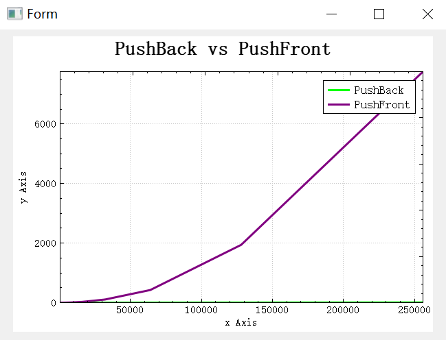
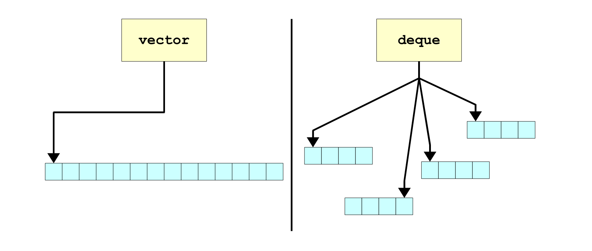

[03_Sequence_Containers.zip](https://www.yuque.com/attachments/yuque/0/2023/zip/12393765/1675431969441-5bf9d841-99ec-4987-94a1-4aa74baa7581.zip)
> 


# 1 Overview of STL
> 


# 2 Sequence Containers
> 


## std::vector
> 
> `add()/push_back()`和`get(i)/at(i)`方法是`Stanford Library`和`STL`的不同之处。
> 


### Bound Check
> 


### Insertion Speed
> 


## std::deque
> 

**std::vector vs std::deque**


### Insertion Speed
> 


## Random access
> 


[04_Associative_Containers.zip](https://www.yuque.com/attachments/yuque/0/2023/zip/12393765/1693582518384-98a364d1-d32b-44f0-a66e-e1ad9e7dadfe.zip)
# 3 Associative Containers
## Definition
> 


## When to Use Each?
> 


## std::map
> Need to include `#include <map>`
> 

```cpp
#include <iostream>
#include <string>
#include <map>
#include <sstream>


using std::string;  using std::cin;
using std::cout;    using std::endl;

// GetLine asks the user to type in a response at the command line. It returns
// the user input as a string.
string GetLine() {
    string response;
    std::getline(cin, response);
    return response;
}

int main() {
    // We will use a map to count the appearances of words, as well as how many
    // times we encounter them.
    std::map<string, int> frequencyMap;

    cout << "Enter words." << endl;
    while (true) {
        cout << "> ";
        string response = GetLine();
        if (response.empty()) break;
        std::istringstream stream(response);
        string word;
        while(stream >> word) {
            // This single line is doing a ton of work. The square bracket notation for
            // accessing values in maps will return a reference to the value associated
            // with the specified key. We can then modify it with ++ directly.
            //
            // However, if response is not already a key in the map, the square brackets
            // do a bit of extra work first. They automatically insert a new key-value
            // pair into the map, where the key is response and the value is a
            // reasonable default value -- in the case of integers, 0.
            ++frequencyMap[word];
        }
    }

    cout << "Enter words to look up." << endl;
    while (true) {
        cout << "> ";
        string response = GetLine();
        if (response.empty()) break;

        // Returns the number of keys equal to response.
        // In anything but a multimap/multiset, this is
        // either going to be 1 or 0.
        if (frequencyMap.count(response)) {
            cout << frequencyMap[response] << " entries found." << endl;
        } else {
            cout << "None." << endl;
        }
    }
    return 0;
}
```
> `map.get(key)`会在`map`中查找是否有`key`的存在，如果没有就会报错
> `map[key]`会在`map`中查找是否有`key`的存在，如果没有就会自动插入`Autoinsert`
> `map.count(key)`, 计算`map`中的`key`出现了几次，对于`single map`中，只会返回`0 or 1`, 但是在`multi-map`或者`milti-set`中可能会返回多次。


## std::set
> 


## std::pair
> 


## std::multimap
> 
> 没有`[]/get(key)`是因为一个`key`可以对应多个`value`，所以返回值不唯一，这在`C++`中不能实现，`python`中因为函数的返回值可以有多个，所以似乎可以实现。


# 4 Container Adaptors
## Why Stack and Queue are adaptors?
> 


## Why not just use a vector/deque?
> 


