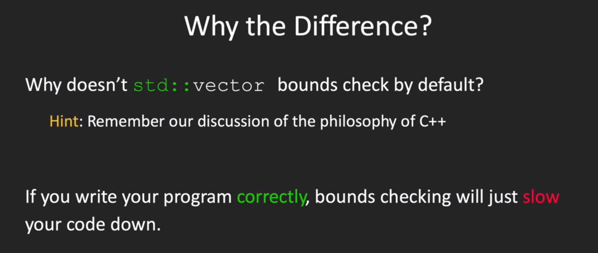
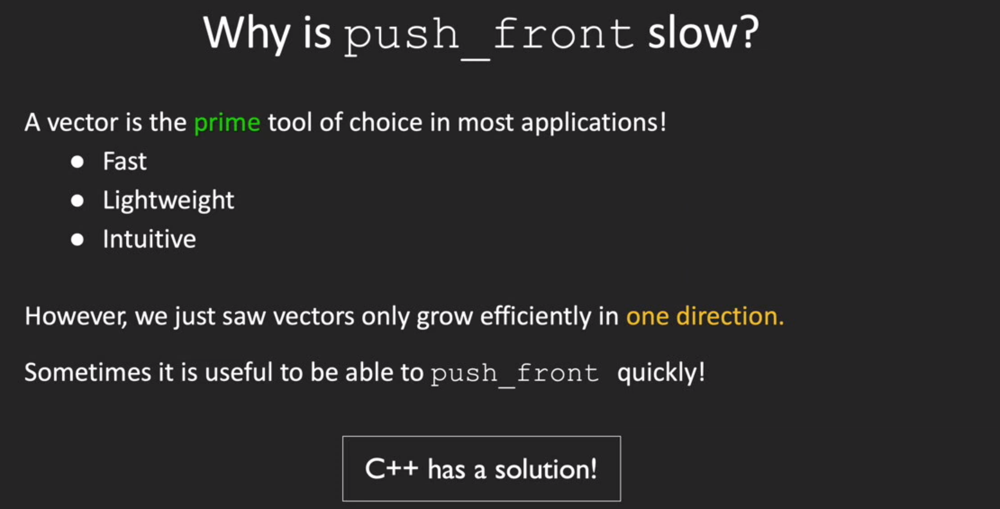
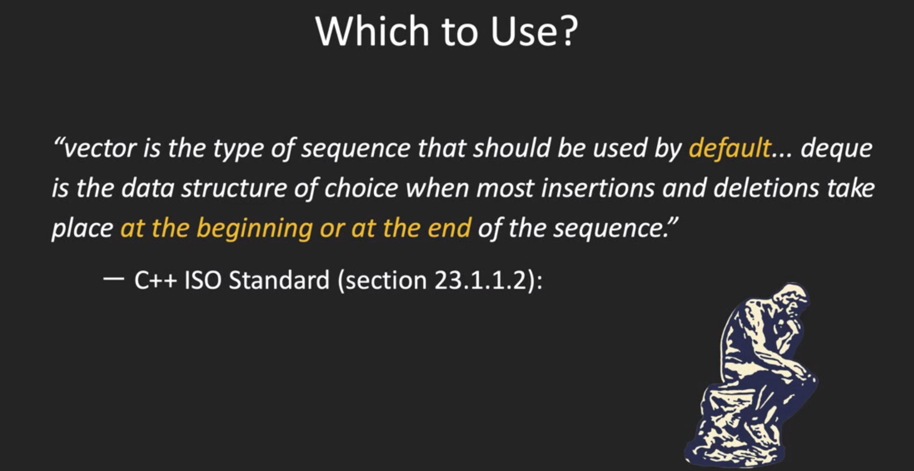
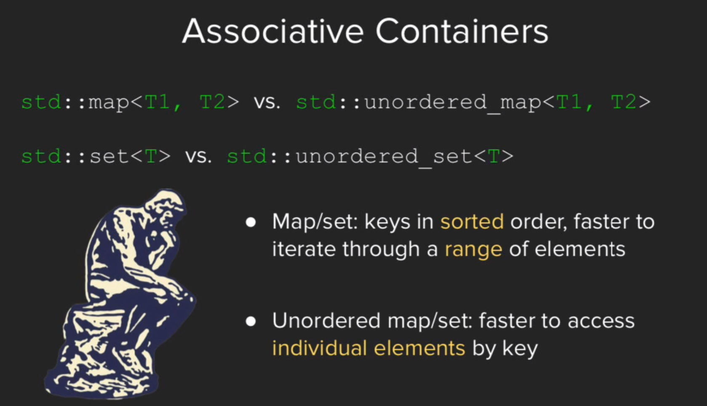
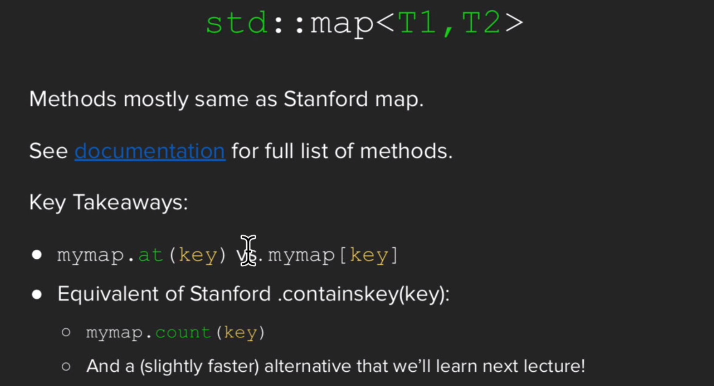
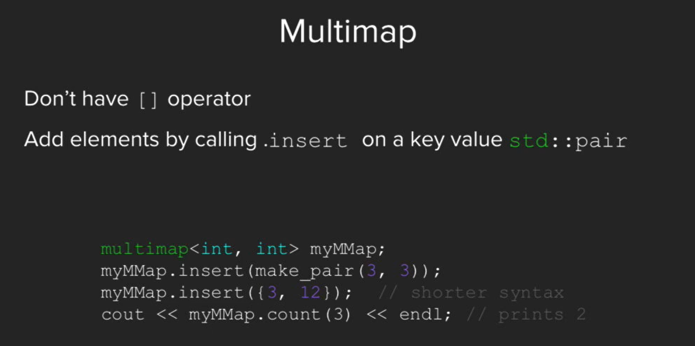
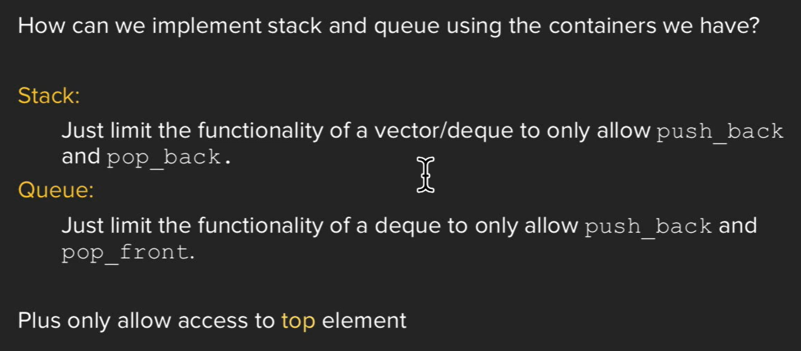
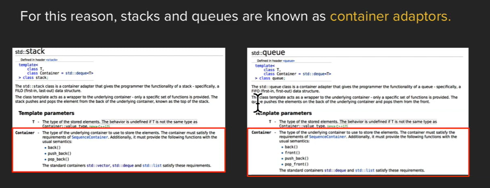

[03_Sequence_Containers.zip](https://www.yuque.com/attachments/yuque/0/2023/zip/12393765/1675431969441-5bf9d841-99ec-4987-94a1-4aa74baa7581.zip)
> 


# 1 Overview of STL
> 


# 2 Sequence Containers
> [!concept]
> 


## std::vector
> [!important]
> We can think of `std::vector` as an array in Java, which offers instant random access.
> 
> `add()/push_back()`和`get(i)/at(i)`方法是`Stanford Library`和`STL`的不同之处。
> 


### Bound Check
> 


### Insertion Speed
> 


## std::deque
> [!concept]
> `std::deque` offers random access, but in a much slower manner than `std::vector` or `std::array`.
> 


### Paged Implementation
> [!concept]
> Typically, a vector stores its elements in contiguous memory addresses. 
> 
> Deque, on the other hand, maintain a list of different “pages” that store information.
> 


### How it works
#### push front - fast
> [!important]
> 

#### push back - slow
> [!important]
> 


### Pros and Cons - Which to use
> [!important]
> The different implementations impact the efficiency of the vector and deque operations. In a vector, because all elements are stored in consecutive locations, it is possible to locate elements through simple arithmetic: to look up the nth element of a vector , find the address of the first element in the vector , then jump forward n positions. 
> 
> In a deque this lookup is more complex: the deque has to
> 1. Figure out which page the element will be stored in
> 2. Search that page for the proper item. 
> 
> However, inserting elements at the front of a vector requires the vector to shuffle all existing elements down to make room for the new element (slow), while doing the same in the deque only requires the deque to rearrange elements in a single page (fast).
> 


#### Insertion Speed
> 


#### Random access
> 


## std::list
> [!concept]
> **All the data in a vector is contiguous where the std::list allocates separately memory for each element**.
> We can think of `std::list` as linked-list in Java, which doesn't offer random access, which means you cannot indexing into a `std::list` by calling `std::list[index]`. Instead, we can only use iterators to traverse over all the elements.


# 3 Associative Containers
## Definition
> 


## When to Use Each?
> 


## std::map
> [!concept]
> Need to include `#include <map>`
> 

```cpp
#include <iostream>
#include <string>
#include <map>
#include <sstream>


using std::string;  using std::cin;
using std::cout;    using std::endl;

// GetLine asks the user to type in a response at the command line. It returns
// the user input as a string.
string GetLine() {
    string response;
    std::getline(cin, response);
    return response;
}

int main() {
    // We will use a map to count the appearances of words, as well as how many
    // times we encounter them.
    std::map<string, int> frequencyMap;

    cout << "Enter words." << endl;
    while (true) {
        cout << "> ";
        string response = GetLine();
        if (response.empty()) break;
        std::istringstream stream(response);
        string word;
        while(stream >> word) {
            // This single line is doing a ton of work. The square bracket notation for
            // accessing values in maps will return a reference to the value associated
            // with the specified key. We can then modify it with ++ directly.
            //
            // However, if response is not already a key in the map, the square brackets
            // do a bit of extra work first. They automatically insert a new key-value
            // pair into the map, where the key is response and the value is a
            // reasonable default value -- in the case of integers, 0.
            ++frequencyMap[word];
        }
    }

    cout << "Enter words to look up." << endl;
    while (true) {
        cout << "> ";
        string response = GetLine();
        if (response.empty()) break;

        // Returns the number of keys equal to response.
        // In anything but a multimap/multiset, this is
        // either going to be 1 or 0.
        if (frequencyMap.count(response)) {
            cout << frequencyMap[response] << " entries found." << endl;
        } else {
            cout << "None." << endl;
        }
    }
    return 0;
}
```
> [!example] More usages
> - `map.at(key)`会在`map`中查找是否有`key`的存在，如果没有就会报错
> - `map[key]`会在`map`中查找是否有`key`的存在，如果没有就会自动插入`Autoinsert`
> - `map.count(key)`, 计算`map`中的`key`出现了几次，对于`single map`中，只会返回`0 or 1`, 但是在`multi-map`或者`milti-set`中可能会返回多次。
> - `map.find(key)` 查看某个`key`是否存在，如果存在返回指向这个`key`的`iterator`, 如果不存在返回`map.end()`。
> 
> 


## std::set
> [!concept]
> 


## std::pair
> 


## std::multimap
> 
> 没有`[]/get(key)`是因为一个`key`可以对应多个`value`，所以返回值不唯一，这在`C++`中不能实现，`python`中因为函数的返回值可以有多个，所以似乎可以实现。


## Summary
> [!summary]
> 


# 4 Container Adaptors
## Why Stack and Queue are adaptors?
> 


## Why not just use a vector/deque?
> 


# 5 Erasing in STL Containers
## Invalidated Iterators
> [!summary]
> 


## Advance&Erase
### std::vector
> [!example]
> 
```C++
vector<int> v{3,1,4,1,5,2,6};
printVector(v);                    // 3141526
auto iter = v.begin();
auto iterEnd = v.end() - 1;
auto iterLastButTwo = v.end() - 2;
auto iterLastButThree = v.end() - 3;
std::advance(iter, 4);
v.erase(iter);
printVector(v);                    // 314126
cout << *iterEnd << endl;          // 6, this is the last index
cout << *iterLastButTwo << endl;   // 6, this is copied from the left index during shifting
cout << *iterLastButThree << endl; // 2
```
> [!test] Analysis
> As we see, all the iterators after the erased index is invalidated. The reason is that `std::vector` must be implemented with elements stored contiguously.


### std::deque
> [!example]
> 
```C++
deque<int> v{3,1,4,1,5,2,6};
printVector(v);
auto iter = v.begin();
std::advance(iter, 4);
v.erase(iter);
printVector(v);

```

## Erasion for Sequential Container
> [!bug] Buggy Erasion
> 

> [!success] Good Erasion
> 


## Erasion for Associative Container
> [!bug] Buggy Erasion
> 

> [!success] Good Erasion
> 


