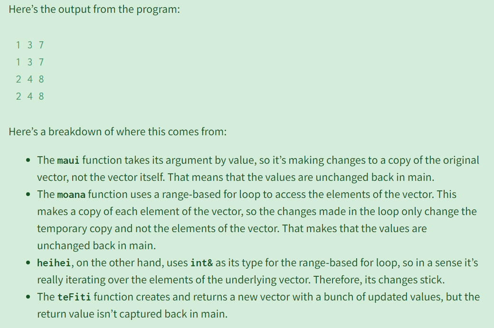

# Fall 2022
[section2-starter.zip](https://www.yuque.com/attachments/yuque/0/2023/zip/12393765/1675656178138-2c955d79-2f59-4697-90e0-ebfaa59b9d37.zip)
[CS106B ADTs, Big-O, and Intro to Recursion.pdf](https://www.yuque.com/attachments/yuque/0/2023/pdf/12393765/1675490181541-acb6595d-18f0-4b2f-ab93-b24aa4851077.pdf)

## Q1 Maps(Skipped)
> 
> Repeated Problem in Section 1

**Solution**


## Q2 Sets(Skipped)
> 
> Same as in Section 1

**Solution**

## Q3 Reversing a Map
> 
> 使用`for loop`即可。

**Solution**
```cpp
Map<int, Set<string>> reverseMap(Map<string, int>& map) {
    Map<int, Set<string>> result;
    /* TODO: Your code goes here! */
    for (string k: map.keys()) {
        result[map.get(k)].add(k);
    }

    return result;
}
```


## Q4 Big-O
> 
> 注意最后一个是$100000$常数，而不是$N$(变量)。

**Solution**


## Q5 More Big-O
> 
> `vector.subList(0,i)`花费`O(i)`时间，因为要遍历所有的元素。

**Solution**


## Q6 Recursion Mystery I - Remainder
> 
> 这个递归程序计算的是$x~~mod~~y$。

**Solution**


## Q7 Recursion Mystery II - Cascading
> 

**Solution**


## Q8 Recursion Tracing
> 

**Solution**


## Q9 Sums of Square
> 

**Solution**


# Winter 2022
[section2_starter_22.zip](https://www.yuque.com/attachments/yuque/0/2023/zip/12393765/1675492530716-02488ecc-cc0d-43d6-9597-79ce9389d579.zip)
[CS106B_W22 Containers.pdf](https://www.yuque.com/attachments/yuque/0/2023/pdf/12393765/1675492486846-8f3ad25f-8376-4cbd-9b0b-519305d1724a.pdf)


## Q3 Reference in C++
> 

**Solution**


## Q4 Maximum in Vectors - Recursion
> 
> **这里有三种方法寻找一个列表中的最大值:**
> 1. 使用迭代，比较简单。
> 2. 使用递归，`max(array[i], max(array[i+1:]))`
> 3. 使用二分递归，也就是本方法:
>    1. 将`[1,2,3,4,5]`看成是`[1,2],[3,4],[5]`三组，每组求出最大值, 合并成一个列表
>    2. 得到`[2,4,5]`, 然后对`[2,4,5]`再进行求解。
>    3. 知道列表中只剩一个元素为止。
> 


**Solution**


## Q5 Disjoint Set - Map Implementation
> 
> 这里的思想和`Disjoint Set`很像。本质上用于解决两个节点是否相连的问题。
> `find(p1)==find(p2)`即表明两个`node`是否相连。

**Solution**


## Q6 Words with Longest Number of Subwords
> 

**Solution**


## Q7 Jaccard Similarity
### Similarity Definition
> 本题介绍一种文档相似度比较的方法，对于两篇文档$D_S$和$D_T$来说，我们首先将其`Tokenized`，$S$表示文档$D_S$中的所有单词(去重之后)组成的集合，$T$表示$D_T$中的所有单词(去重之后)组成的集合。
> 两篇文档的`Jaccard Similarity`被定义为$J(S,T)=\frac{|S\cap T|}{|S\cup T|}$:
> 1. 如果$D_S$和$D_T$完全相同，则$S=T$, 此时$S\cap T=S\cup T$, 于是$J(S,T)=1$。
> 2. 如果$D_S$和$D_T$完全不同，则$S\cap T=\{0\}$, $|S\cap T|=0$, $J(S,T)=0$。
> 


### Complete Program
> **How to read data from files:**
> [https://web.stanford.edu/dept/cs_edu/resources/cslib_docs/filelib.html#Function:promptUserForFile](https://web.stanford.edu/dept/cs_edu/resources/cslib_docs/filelib.html#Function:promptUserForFile)

```cpp
#ifndef JACCARD_H
#define JACCARD_H

#endif // JACCARD_H


#include "testing/SimpleTest.h"
#include "set.h"
#include "queue.h"

#include "filelib.h"
using namespace std;


Set<string> wordsIn(istream& input);

void promptUserForTwoFiles();

Set<string> kGramsIn(istream& input);


string queueToString(Queue<string> queue);

double jaccardSimilarity(int k);

```
```cpp
/*
 * CS106B Section Handout Test Harness: Section 2
 * ----------------------------------------------
 * These problems have been galvanized from years of
 * section handouts that have been worked on by numerous
 * instructors and TA's. Codified for Qt and Ed by Neel
 * Kishnani for Winter 2022.
 *
 * A huge thank you to Keith Schwarz and Julie Zelenski
 * for creating an amazing testing harness!
 */

#include "testing/SimpleTest.h"
#include "set.h"
#include "queue.h"
#include "vector.h"

#include "filelib.h"
using namespace std;

/*
 * See Stanford library's promptUserForFile function to get
 * a file into a stream format:
 * https://web.stanford.edu/dept/cs_edu/resources/cslib_docs/filelib.html#Function:promptUserForFile
 */
Set<string> wordsIn(istream& input) {
    Set<string> res;
    string token;
    while (input >> token) {
        res.add(token);
    }
    return res;
}


/*
 * Convert a queue to its string representation, preserving the order that the strings are added in.
 */
string queueToString(Queue<string> queue) {
    string res;
    res += queue.dequeue();
    while (!queue.isEmpty()) {
        res += (" " + queue.dequeue());
    }
    return res;
}

/*
 * Given an input stream, output the kGram set of it.
 */
Set<string> kGramsIn(istream& input, int k) {
    Queue<string> kGrams;
    Set<string> res;
    string buffer;
    while (input >> buffer) {
        kGrams.enqueue(buffer);
        if (kGrams.size() == k) {
            res.add(queueToString(kGrams));
            kGrams.dequeue();
        }
    }
    if (!kGrams.isEmpty()) {
        res.add(queueToString(kGrams));
    }
    return res;
}

/*
 * Compute the jaccardSimilarity(k-gram version)
 */
double jaccardSimilarity(int k) {
    ifstream stream1;
    ifstream stream2;
    string filename1 = promptUserForFile(stream1, "Type the filename for the first file.");
    string filename2 = promptUserForFile(stream2, "Type the filename for the second file.");
    Set<string> kGrams1;
    Set<string> kGrams2;
    if (k == 0) {
        kGrams1 = wordsIn(stream1);
        kGrams2 = wordsIn(stream2);
    } else {
        kGrams1 = kGramsIn(stream1, k);
        kGrams2 = kGramsIn(stream2, k);
    }
    double intersectionSize = (kGrams1 * kGrams2).size();
    double unionSize = (kGrams1 + kGrams2).size();
    return intersectionSize / unionSize;
}


```
```cpp
#include <iostream>
#include "console.h"
#include "testing/SimpleTest.h"
#include "testing/Jaccard.h"

using namespace std;


int main() 
{
//    if (runSimpleTests(SELECTED_TESTS)) {
//        return 0;
//    }

    cout << jaccardSimilarity(2);
    return 0;
}

```


