# Part 1: Debugging Practice


# Part 2: MatchMaker
## Background One: Perfect Matching
> [!motiv] Introduction
> 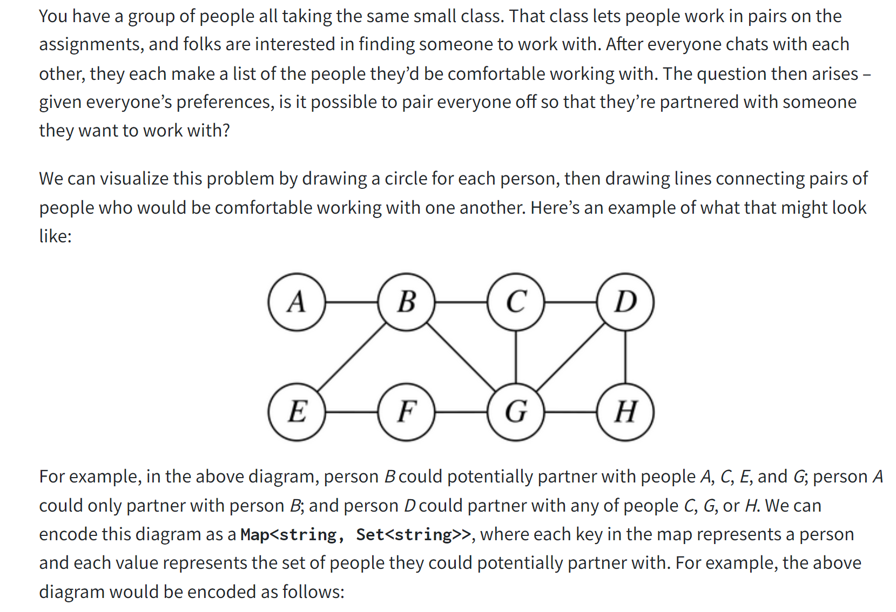

> [!concept] Perfect Matching
> 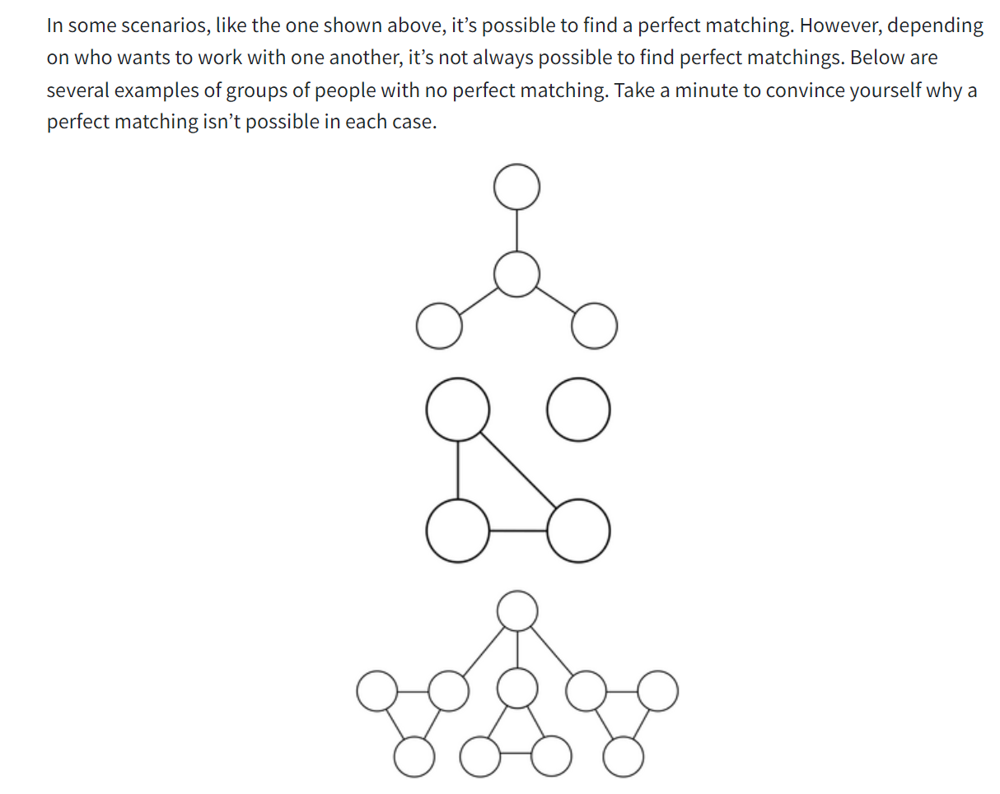


## Milestone One: Find Perfect Matchings
### Task Description
> [!task]
> 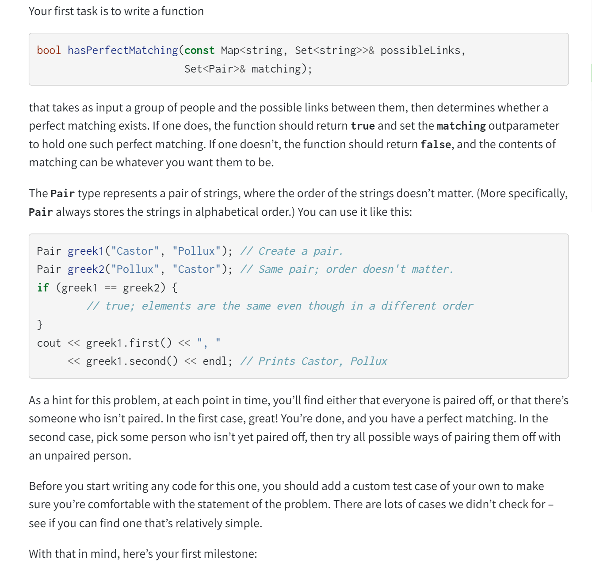
> **Some Remarks:**
> - **Adjacency Matrix:** The links in `possibleLinks` are symmetric: if person _A_ is a possible match for person _B_, then person _B_ is also a possible match for person _A_. You can assume we’ll never call this function on an input where that isn’t the case.
> - **No Self-Loop**: No person will ever have a possible link to themselves. Each link really does represent a pair of people.
> - **Isolated Vertex is Possible:** It’s possible that there’s a person in `possibleLinks` who isn’t linked to anyone, meaning that they aren’t comfortable working with anyone. In that case, there’s no perfect matching.
> - You may find it easier to solve this problem first by simply getting the return value right, completely ignoring the `matching` outparameter. Once you’re sure that your code is always producing the right answer, update it so that you actually fill in `matching`. Doing so shouldn’t require too much code, and it’s way easier to add this in at the end than it is to debug the whole thing all at once.
> - You can assume that `matching` is empty when the function is called.
> - If your function returns `false`, the final contents of `matching` don’t matter, though we suspect your code will probably leave it blank.
> - If you need to grab a key out of a `Map` and don’t care which key you get, use the function `map.firstKey()`. To grab a key out of a `Set`, use `set.first()`. (Which of these functions, if any, you use in this function are up to you.)
> - Although the parameters to this function are passed by `const` reference, you’re free to make extra copies of the arguments or to set up whatever auxiliary data structures you’d like. If you find you’re “fighting” your code – an operation that seems simple is taking a lot of lines – it might mean that you need to change your data structures.
> - You might be tempted to solve this problem by repeatedly taking a person with the most possible partners and then assigning them a partner, or taking the person with the fewest possible partners and picking a partner for them, or something like this. Solutions like these are called **_greedy algorithms_**, and while greedy algorithms do work well for some problems, this problem is not one of them. **To the best of our knowledge, there is no known greedy algorithm for this problem.**
> - The very last of the provided tests is a **“stress test”** designed to check that your algorithmic strategy avoids unnecessary work. Specifically, this test is designed to check whether your code repeatedly generates the same matchings multiple times, or spends time exploring matchings that couldn’t possibly work (say, matchings where a person was intentionally never assigned a partner). **If this test never finishes running, or it finishes running only after a very long time, it may mean that the strategy you’ve picked for this problem is intrinsically inefficient.** If you run into this, take a look over your code. Make sure each matching you generate is generated exactly once and that you don’t, say, try assigning the same pair of people to each other multiple times.


### CS106B Implementations
> [!code]
> **Hint:**
> We could still formulate this problem as a permutation problem where we must pair up all the persons in the graph.
> 
> We could start from arbitrary node in the graph, and connect him with an arbitrary node. Then these two nodes are paired up. After that, we could find an arbitrary node that is not yet paired up, where we could have two scenarios:
> 
> - If we couldn't find such node, then we say that we have found a perfect matching.
> - Otherwise, we continue the process above until there are no more unpaired nodes.
> 
> The code implementations are as follows:
> 
```C++
#include "Matchmaker.h"
using namespace std;


/**
 * @brief hasIsolatedNode
 * @param possibleLinks, all the edges in the graph, represented in vertex-list form
 * "A": {"B", "C"} means A <--> B and A <--> C
 * @return Whether there is vertices that has zero degree based on possibleLinks
 */
bool hasIsolatedNode(const Map<string, Set<string>>& possibleLinks) {
    for (string node: possibleLinks) {
        if (possibleLinks.get(node).isEmpty()) {
            return true;
        }
    }
    return false;
}

/**
 * @brief isPairedUp
 * @param node, the node of interest
 * @param matching, data structure that stores the current path of selected pairs
 * @return Whether the node has already been paired up based on matching
 */
bool isPairedUp(const string& node, const Set<Pair>& matching) {
    for (Pair pair: matching) {
        if (node == pair.first() || node == pair.second()) {
            return true;
        }
    }
    return false;
}


/**
 * @brief hasUnPairedNodes
 * @param possibleLinks
 * @param matching
 * @return Whether there are unpaired nodes left in the graph
 */
bool hasUnPairedNodes(const Map<string, Set<string>>& possibleLinks, const Set<Pair>& matching) {
    for (string node: possibleLinks) {
        if (!isPairedUp(node, matching)) {
            return true;
        }
    }
    return false;
}

/**
 * @brief findUnPairedNodes
 * @param possibleLinks
 * @param matching
 * @return The string representation of the unpaired node for indexing
 */
string findUnPairedNodes(const Map<string, Set<string>>& possibleLinks, const Set<Pair>& matching) {
    for (string node: possibleLinks) {
        if (!isPairedUp(node, matching)) {
            return node;
        }
    }
    return NULL;
}

/**
 * @brief isMatchingValid
 * @param node1, the first node in the pair
 * @param node2, the second node in the pair
 * Assume the edge between node1 and node2 exists.
 * @param matching
 * @return Whether this pair is valid. By saying valid we mean that the newly added edge between node1 and node2
 * won't share the same endpoints with existing edges in the matching.
 */
bool isMatchingValid(const string& node1, const string& node2, const Set<Pair>& matching) {
    for (Pair pair: matching) {
        if (pair.first() == node1 ||
            pair.second() == node1 ||
            pair.first() == node2 ||
            pair.second() == node2) {
            return false;
        }
    }
    return true;
}

/**
 * @brief hasPerfectMatchingRec, helper function
 * @param possibleLinks
 * @param matching
 * @return Whether the graph (V,E) has a perfect matching
 */
bool hasPerfectMatchingRec(const Map<string, Set<string>>& possibleLinks, Set<Pair>& matching) {


    // 1. Base Case: There are no unpaired nodes, indicating that we have a perfect matching
    if (!hasUnPairedNodes(possibleLinks, matching)) {
        return true;
    }

    // 2. There are no isolated nodes, starting searching from arbitrary nodes
    // 2.1 Get the next unpaired node
    string nextUnpairedNode = findUnPairedNodes(possibleLinks, matching);

    // 2.2 Get all the nodes that are directly connected to this node
    Set<string> potentialPairs = possibleLinks.get(nextUnpairedNode);

    // 3. Backtracking Algorithm
    // 3.1 Iterate through all the potential edges incident to this node
    for (string potentialPair: potentialPairs) {
        // 3.2 If the edge is ok to add, then add it
        if (isMatchingValid(nextUnpairedNode, potentialPair, matching)) {
            matching.add(Pair(nextUnpairedNode, potentialPair));
            // 3.3 If adding this edge results in a perfect matching, return true
            if (hasPerfectMatchingRec(possibleLinks, matching)) {
                return true;
            }
            // 3.4 If adding this edge results in no perfect matching, backtracking
            //, and prepare for the next iteration
            matching.remove(Pair(nextUnpairedNode, potentialPair));
        }
    }

    // 3.5 If no addition of edges result in perfect matching, simply return false
    // , indicating that this searching path doesn't work.
    return false;
}

/**
 * @brief hasPerfectMatching
 * @param possibleLinks
 * @param matching
 * @return Whether the graph (V,E) has a perfect matching
 */
bool hasPerfectMatching(const Map<string, Set<string>>& possibleLinks, Set<Pair>& matching) {

    // Base case: there are isolated nodes, always return false
    if (hasIsolatedNode(possibleLinks)) {
        return false;
    }

    return hasPerfectMatchingRec(possibleLinks, matching);
}
```


## Background Two: Maximum-Weight Matching
> [!concept]
> 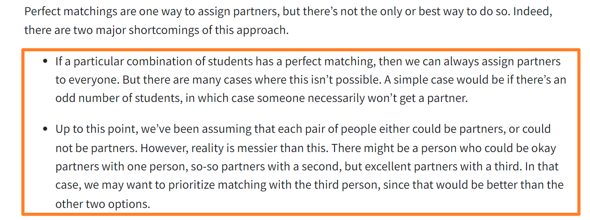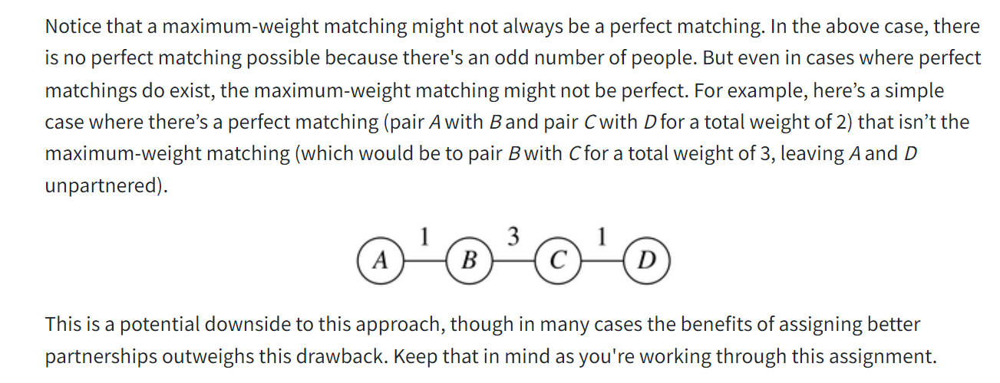


## Milestone Two: Find Maximum-Weight Matchings
### Task Descriptions
> [!task]
> 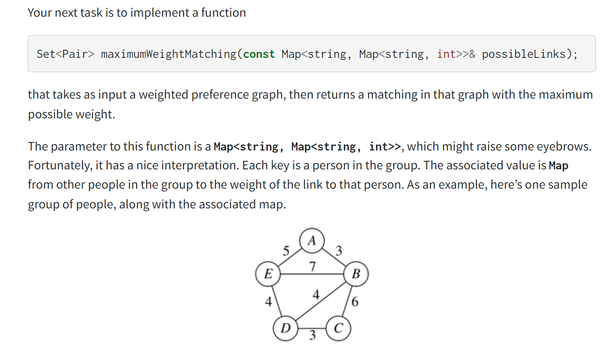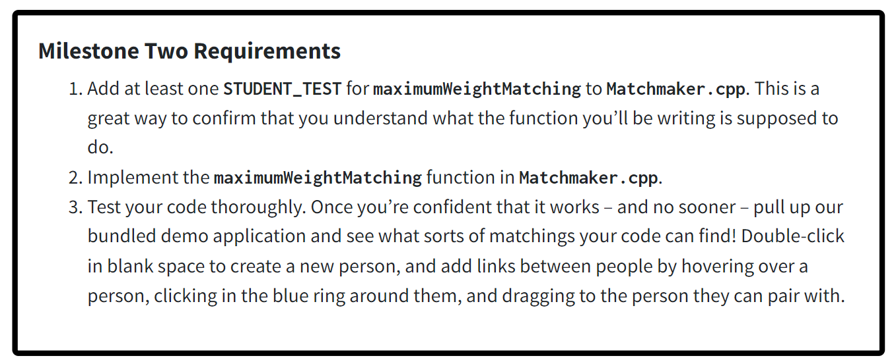


### CS106B Implementation
> [!code]
> - To repeat an important point from above – a maximum weighted matching might not necessarily be a perfect matching. This means that your code must allow for the case where a particular person is not matched with anyone else.
> - This problem has some similarities to determining whether a perfect matching exists. **However, in many ways, it's quite a different problem**. Previously, you just needed to see whether there was any way to pair everyone off. Now, you need to look across all possible ways of pairing people off and figure out which is the best. Previously, everyone necessarily had to be paired off. Now, the best solution might leave people unpaired. As a result, **_we do not recommend copying your code for finding perfect matchings and making edits to it_**. This problem is sufficiently different that we advise rewriting the code from scratch.

### Implementation 1: Permutation
> [!code]
> This method is an extension of the algorithm implemented for milestone 1 where we search nodes over nodes. This algorithm treats the problem as a permutation problem. Since permutation will repeatedly generate the same matching multiple times(i.e. {(A, B), (C,D)}, {(C,D), (A,B)}), we cannot pass the stress test. 
> 
```C++
/**
 * @brief getPossibleLinks
 * @param possibleLinks
 * @return The possible links, without weights
 */
Map<string, Set<string>> getPossibleLinks(const Map<string, Map<string, int>>& possibleLinks) {
    Map<string, Set<string>> res = {};

    for (string key: possibleLinks) {
        Map<string, int> value = possibleLinks.get(key);
        Set<string> tmp = {};
        for (string key: value) {
            tmp.add(key);
        }
        res.put(key, tmp);
    }

    return res;
}

/**
 * @brief computeMatchingWeight
 * @param possibleLinks
 * @param matching
 * @return Compute the total weights of current matching path
 */
int computeMatchingWeight(const Map<string, Map<string, int>>& possibleLinks, const Set<Pair>& matching) {

    int totalWeight = 0;
    for (Pair pair: matching) {
        int weight = possibleLinks.get(pair.first()).get(pair.second());
        totalWeight += weight;
    }

    return totalWeight;
}


/**
 * @brief maximumWeightMatchingRec
 * @param possibleLinks
 * @param possibleLinksUnWeighted
 * @param maximum, maximum weight seen so far
 * @param matchingPath
 * @param matchingRes
 */
void maximumWeightMatchingRec(const Map<string, Map<string, int>>& possibleLinks, Map<string, Set<string>>& possibleLinksUnWeighted, Vector<int>& maximum, const Set<Pair>& matchingPath, Vector<Set<Pair>>& matchingRes) {


    if (!hasUnPairedNodes(possibleLinksUnWeighted, matchingPath)) {
        int totalWeight = computeMatchingWeight(possibleLinks, matchingPath);
        if (totalWeight > maximum.get(0)) {
            maximum.set(0, totalWeight);
            matchingRes.set(0, matchingPath);
        }
        return;
    }

    Set<string> nextUnpairedNode = findAllUnpairedNodes(possibleLinksUnWeighted, matchingPath);

    for (string node: nextUnpairedNode) {
        // 2.2 Get all the nodes that are directly connected to this node
        Set<string> potentialPairs = possibleLinksUnWeighted.get(node);

        // 3. Backtracking Algorithm
        // 3.1 Iterate through all the potential edges incident to this node
        for (string potentialPair: potentialPairs) {
            // 3.2 If the edge is ok to add, then add it
            if (isMatchingValid(node, potentialPair, matchingPath)) {
                // 3.3 Try this edge
                maximumWeightMatchingRec(possibleLinks, possibleLinksUnWeighted, maximum, matchingPath + Pair(node, potentialPair), matchingRes);
            }
        }
        int totalWeight = computeMatchingWeight(possibleLinks, matchingPath);
        if (totalWeight > maximum.get(0)) {
            maximum.set(0, totalWeight);
            matchingRes.set(0, matchingPath);
        }
    }
}


/**
 * @brief maximumWeightMatching
 * @param possibleLinks
 * @return The maximum weight matching
 */
Set<Pair> maximumWeightMatching(const Map<string, Map<string, int>>& possibleLinks) {
    /* TODO: Delete this comment and these remaining lines, then implement this function. */
    Set<Pair> matchingPath = {};
    Vector<Set<Pair>> matchingRes = {matchingPath};
    Vector<int> maximum = {};
    Map<string, Set<string>> possibleLinksUnWeighted = getPossibleLinks(possibleLinks);

    maximum.add(0);
    maximumWeightMatchingRec(possibleLinks, possibleLinksUnWeighted, maximum, matchingPath, matchingRes);
    return matchingRes.get(0);
}


```


### Implementation 2: Combination
> [!code]
> This algorithm treat the construction of matching as a combination problem(`choose or not choose problem`) where we pick a subset of edges with the maximum weight. And this fits with our backtracking paradigm.
> 
> This algorithm originates from the large stress test where it tests whether the program is repeatedly generating the same matchings. So treating this problem as permutation will not pass the stress test. Thus we opt for combination problem solving paradigm.
```C++
/**
 * @brief computeMatchingWeight
 * @param possibleLinks
 * @param matching
 * @return Compute the total weights of current matching path
 */
int computeMatchingWeight(const Map<string, Map<string, int>>& possibleLinks, const Set<Pair>& matching) {

    int totalWeight = 0;
    for (Pair pair: matching) {
        int weight = possibleLinks.get(pair.first()).get(pair.second());
        totalWeight += weight;
    }

    return totalWeight;
}


/**
 * @brief isEdgeValid
 * @param edge
 * @param matching
 * @return Whether the edge can be added without violating the definition of matching
 */
bool isEdgeValid(const Pair& edge, const Set<Pair>& matching) {
    string node1 = edge.first();
    string node2 = edge.second();

    for (Pair pair: matching) {
        if (pair.first() == node1 ||
            pair.second() == node1 ||
            pair.first() == node2 ||
            pair.second() == node2) {
            return false;
        }
    }
    return true;
}

/**
 * @brief getAllEdgesWithoutWeights
 * @param possibleLinks
 * @return All edges in Pair
 */
Set<Pair> getAllEdgesWithoutWeights(const Map<string, Map<string, int>>& possibleLinks) {
    Set<Pair> res = {};
    for (string node1: possibleLinks) {
        Map<string, int> tmp = possibleLinks.get(node1);
        for (string node2: tmp) {
            res.add(Pair(node1, node2));
        }
    }
    return res;
}


/**
 * @brief maximumWeightMatchingRec
 * @param possibleLinks
 * @param possibleLinksUnWeighted
 * @param maximum, maximum weight seen so far
 * @param matchingPath
 * @param matchingRes
 */
void maximumWeightMatchingRec(const Map<string, Map<string, int>>& possibleLinks, const Set<Pair> edges, Vector<int>& maximum, const Set<Pair>& matchingPath, Vector<Set<Pair>>& matchingRes) {

    if (edges.isEmpty()) {
        int totalWeight = computeMatchingWeight(possibleLinks, matchingPath);
        if (totalWeight > maximum.get(0)) {
            maximum.set(0, totalWeight);
            matchingRes.set(0, matchingPath);
        }
        return;
    }


    Pair edge = edges.first();
    if (isEdgeValid(edge, matchingPath)) {
        maximumWeightMatchingRec(possibleLinks, edges - edge, maximum, matchingPath + edge, matchingRes);
    }
    maximumWeightMatchingRec(possibleLinks, edges - edge, maximum, matchingPath, matchingRes);
}


/**
 * @brief maximumWeightMatching
 * @param possibleLinks
 * @return The maximum weight matching
 */
Set<Pair> maximumWeightMatching(const Map<string, Map<string, int>>& possibleLinks) {
    Set<Pair> edges = getAllEdgesWithoutWeights(possibleLinks);
    Set<Pair> matchingPath = {};
    Vector<Set<Pair>> matchingRes = {matchingPath};
    Vector<int> maximum = {};
    maximum.add(0);

    maximumWeightMatchingRec(possibleLinks, edges, maximum, matchingPath, matchingRes);
    return matchingRes.get(0);
}

```


## Testing Results
> [!test]
> 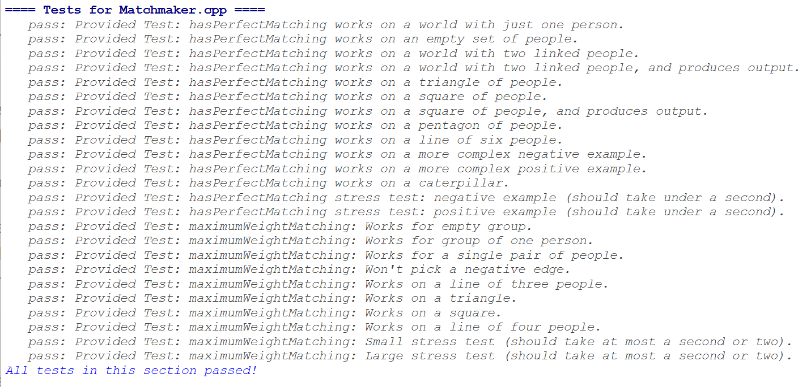


## Applications 
> [!example]
> **Example of Finding Perfect Matching:**
> 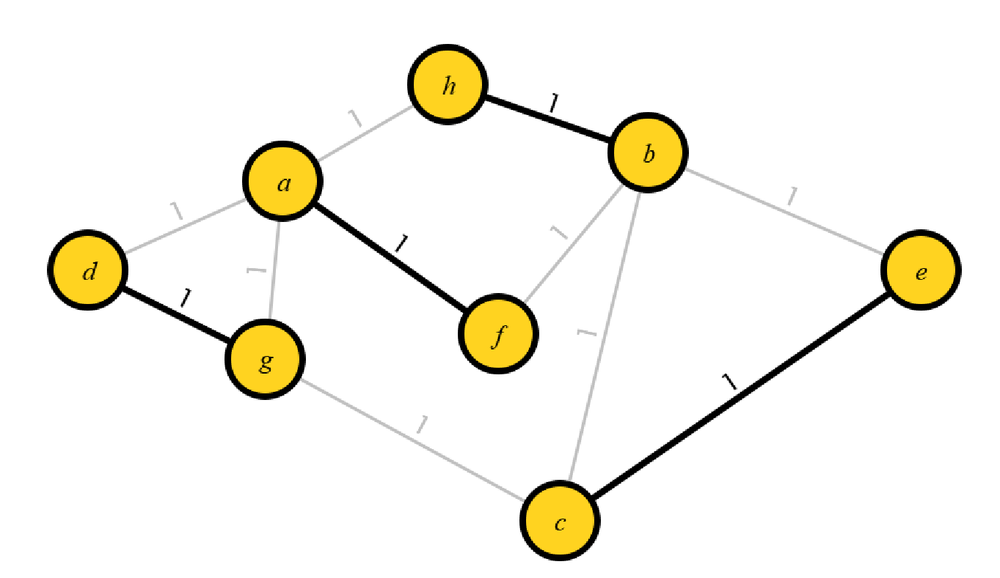
> **Example of Maximum Weight Matching:**
> 
> 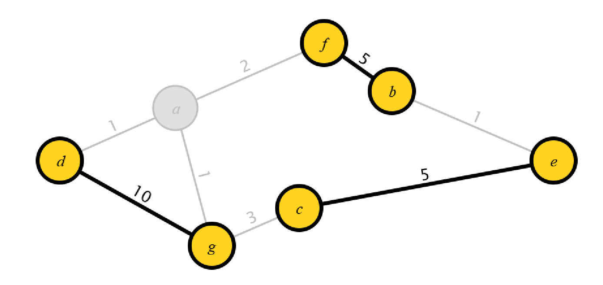


# Part 3: Disaster Planning
## Task Description
> [!task]
> **Background:**
> 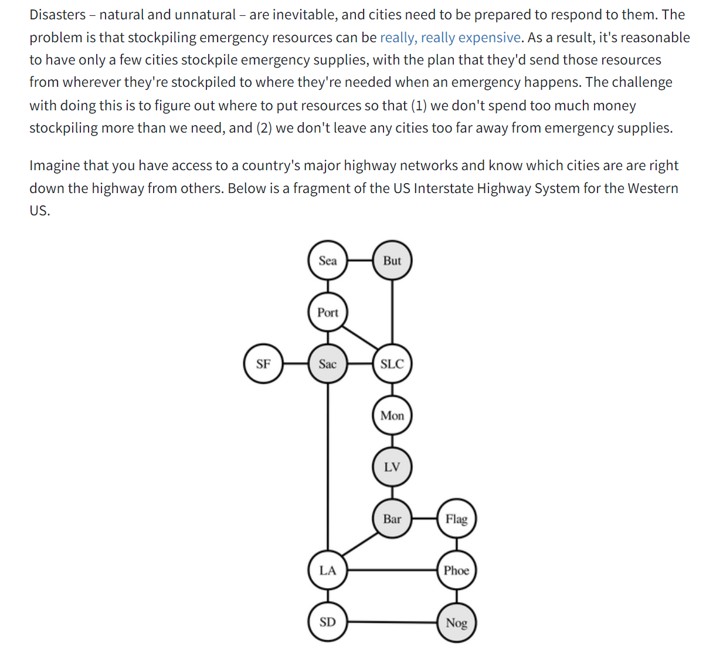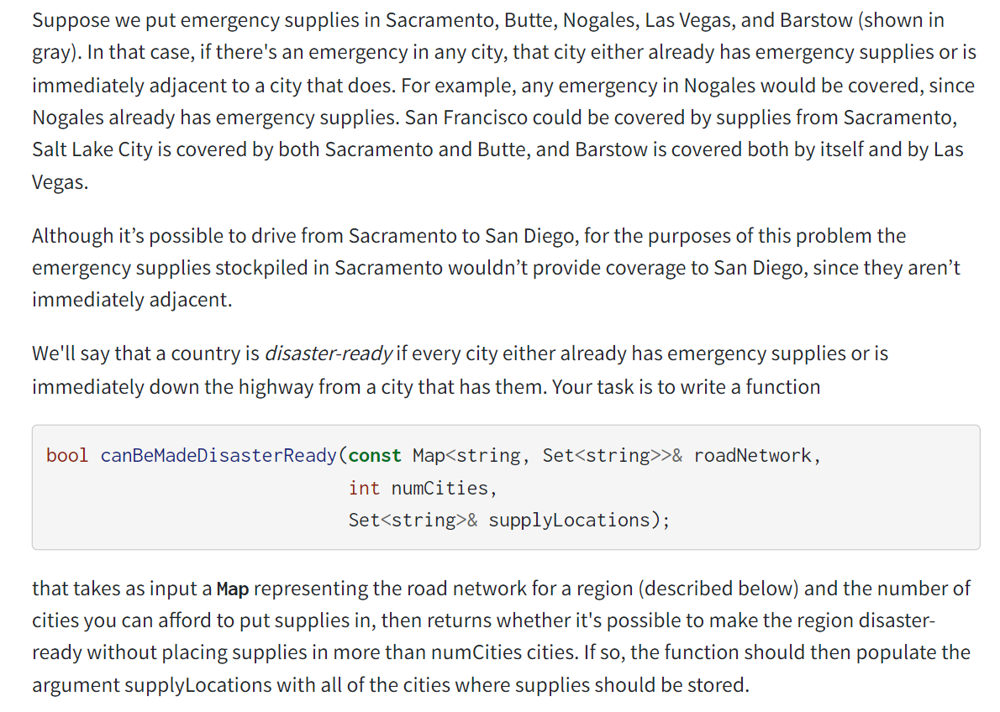
> **Data Structures:**
> 
> 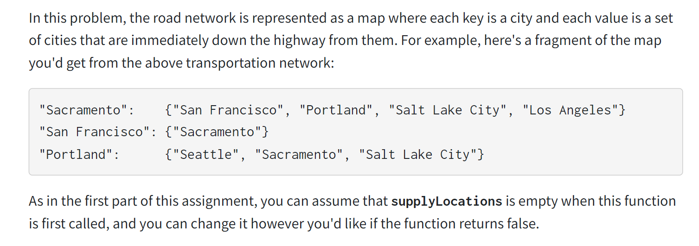


## Hints&Algorithm
> [!hint]
> **Attempt 1: Combination Problem**
> 
> You might be tempted to solve this problem by approaching it as a combinations problem. We need to choose some group of cities, and there’s a limit to how many we can pick, so we could just list all combinations of `numCities` cities and see if any of them provide coverage to the entire network. The problem with this approach is that as the number of cities rises, the number of possible combinations can get way out of hand. For example, in a network with 35 cities, there are 3,247,943,160 possible combinations of 15 cities to choose from. Searching over all of those options can take a very, very long time, and if you were to approach this problem this way, you’d likely find your program grinding to a crawl on many transportation grids.
> 
> **Attempt 2: Searching Problem**
> 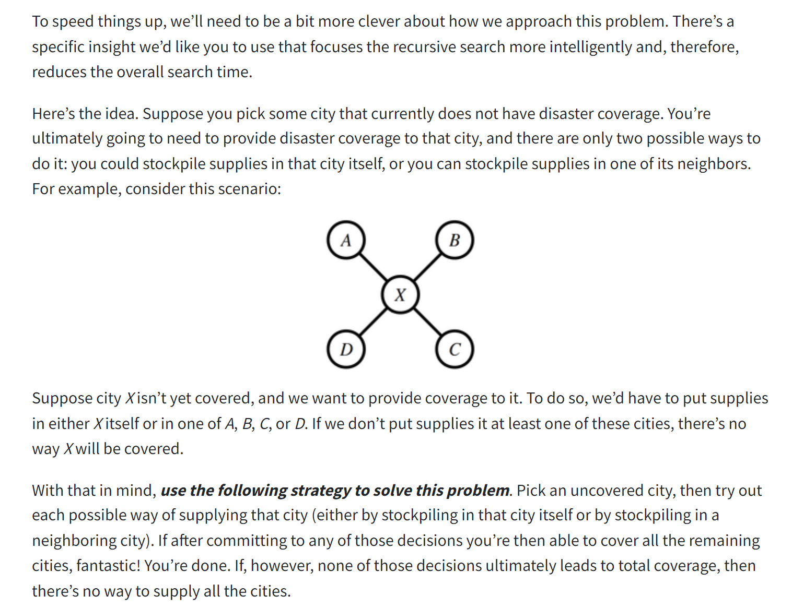


## Task Requirement
> [!task] Task Requirement
> 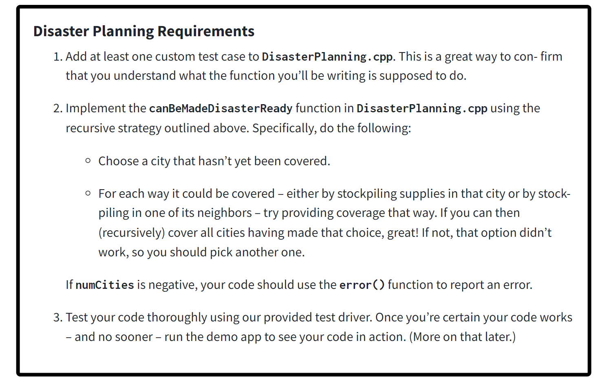
> Some notes on this problem:
> - We recommend proceeding in two steps. First, just focus on getting the return value right – that is, write a function that answers the question “is it possible to cover everything with only this many cities having supplies?” and which ignores the outparameter. Once that’s working – and no sooner – edit the code to then fill in the outparameter with which cities should be chosen.
> - You may be tempted to make changes to the road network when solving this problem, since, after all, it’s common in a recursive function to reduce the size of the input. For this problem in particular, though, we do not recommend doing that. Keep the road network constant, and see if there’s something else whose size you can reduce from call to call.
> - The road network is bidirectional. If there’s a road from city A to city B, then there will always be a road back from city B to city A. Both roads will be present in the parameter roadNetwork. You can rely on this.
> - A common bug to watch out for: when working with sets, the operation `set1 -= set2` and `set1 += set2` are _not_ opposites of one another. For example, suppose `set1 = {1, 2, 3}` and `set2 = {2, 3, 4}`. After writing `set1 -= set2`, you'll have `set1 = {1}`. If you then write `set1 += set2`, you'll have `set1 = {1, 2, 3, 4}`, which isn't what you began with.
> - Every city appears as a key in the map. Cities can exist that aren’t adjacent to any other cities in the transportation network. If that happens, the city will be represented by a key in the map associated with an empty set of adjacent cities.
> - Feel free to use _set_.`first()` or _map_.`firstKey()` to get a single element or key from a `Set` or `Map`, respectively.
> - The numCities parameter denotes the maximum number of cities you’re allowed to stockpile in. It’s okay if you use fewer than numCities cities to cover everything, but you can’t use more.
> - The `numCities` parameter may be zero, but should not be negative. If it is negative, call `error()`
> - _Make sure you’re correctly able to tell which cities are and are not covered at each point._ One of the most common mistakes we’ve seen people make in solving this problem is to accidentally mark a city as uncovered that actually is covered, usually when backtracking. Use the debugger to inspect which cities are and are not covered at each point in time.
> - There are cases where the best way to cover an uncovered city is to stockpile in a city that’s already covered. In the example shown below, which is modeled after the molecular structure of ethane, the best way to provide coverage to all cities is to pick the two central cities C1 and C2, even though after choosing C1 you’ll find that C2 is already covered by C1.
> 
> - **Don't be greedy:** You might be tempted to solve this problem by repeatedly taking the city adjacent to the greatest number of uncovered cities and then stock- piling there, repeating until all cities are covered. Surprisingly, this approach will not always work. In the example shown to below here, which we’ve entitled “Don’t be Greedy,” the optimal solution is to stockpile in cities B and F. If, on the other hand, you begin by grabbing city D, which would provide coverage to five of the seven cities, you will need to stockpile in at least two more cities (one of A and B, and one of E and F) to provide coverage to everyone. If you follow the recursive strategy outlined above, you won’t need to worry about this, since that solution won’t always grab the city with the greatest number of neighbors first.
> 


## CS106B Implementation
> [!code] 
```C++

/**
 * @brief isCityCovered
 * @param city
 * @param roadNetwork
 * @param supplyLocations
 * @return Whether the city is covered
 */
bool isCityCovered(string city, const Map<string, Set<string>>& roadNetwork, const Set<string>& supplyLocations) {

    bool res = supplyLocations.contains(city);

    for (string neighbor: roadNetwork.get(city)) {
        res = res || supplyLocations.contains(neighbor);
    }

    return res;
}

/**
 * @brief findUncoveredCities
 * @param roadNetwork
 * @param supplyLocations
 * @return All the cities that are not covered by supplylocations yet
 */
Set<string> findUncoveredCities(const Map<string, Set<string>>& roadNetwork, const Set<string>& supplyLocations) {
    Set<string> unCoveredCities = {};
    for (string city: roadNetwork) {
        if (!isCityCovered(city, roadNetwork, supplyLocations)) {
            unCoveredCities.add(city);
        }
    }
    return unCoveredCities;
}


/**
 * @brief canBeMadeDisasterReadyRec, helper funtion
 * @param roadNetwork
 * @param numCities
 * @param supplyLocationsPath
 * @param supplyLocations
 * @return Whether we can make every city disaster ready within numCities.
 */
bool canBeMadeDisasterReadyRec(const Map<string, Set<string>>& roadNetwork,
                          int numCities,
                          const Set<string>& supplyLocationsPath,
                               Set<string>& supplyLocations) {

    Set<string> unCoveredCities = findUncoveredCities(roadNetwork, supplyLocationsPath);

    if (unCoveredCities.isEmpty()) {
        supplyLocations = supplyLocationsPath;
        return true;
    }

    if (supplyLocationsPath.size() == numCities) {
        return false;
    }


    bool flag = false;
    string unCoveredCity = unCoveredCities.first();
    // 1. Make the current city as supplyLocation
    flag = flag || canBeMadeDisasterReadyRec(roadNetwork, numCities, supplyLocationsPath + unCoveredCity, supplyLocations);

    // 2. Make the neighbors of the current city as supplyLocation
    for (string neighbor: roadNetwork.get(unCoveredCity)) {
        flag = flag || canBeMadeDisasterReadyRec(roadNetwork, numCities, supplyLocationsPath + neighbor, supplyLocations);
    }

    return flag;
}

/**
 * @brief canBeMadeDisasterReady, main function
 * @param roadNetwork
 * @param numCities
 * @param supplyLocations
 * @return Whether we can make every city disaster ready within numCities.
 */
bool canBeMadeDisasterReady(const Map<string, Set<string>>& roadNetwork,
                            int numCities,
                            Set<string>& supplyLocations) {
    Set<string> supplyLocationsPath = {};

    if (numCities < 0) {
        error("Invalid Input, numCities cannot be negative");
    }

    return canBeMadeDisasterReadyRec(roadNetwork, numCities, supplyLocationsPath, supplyLocations);
}

```


## Testing Results
> [!test]
> 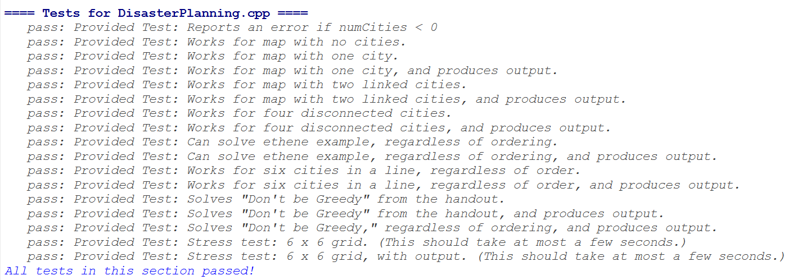


## Applications
> [!example]
> 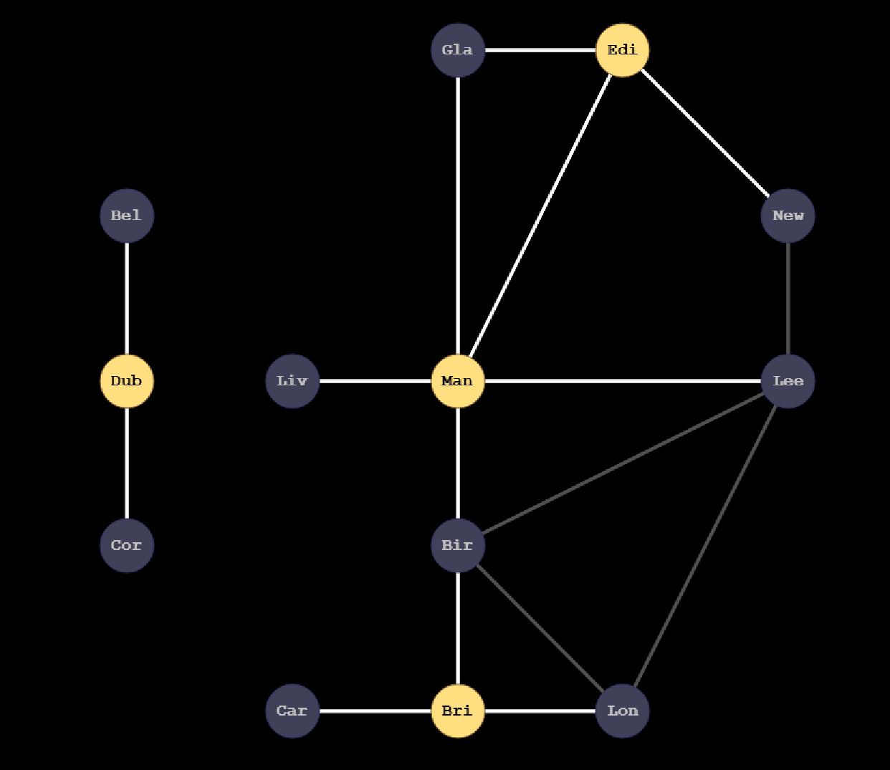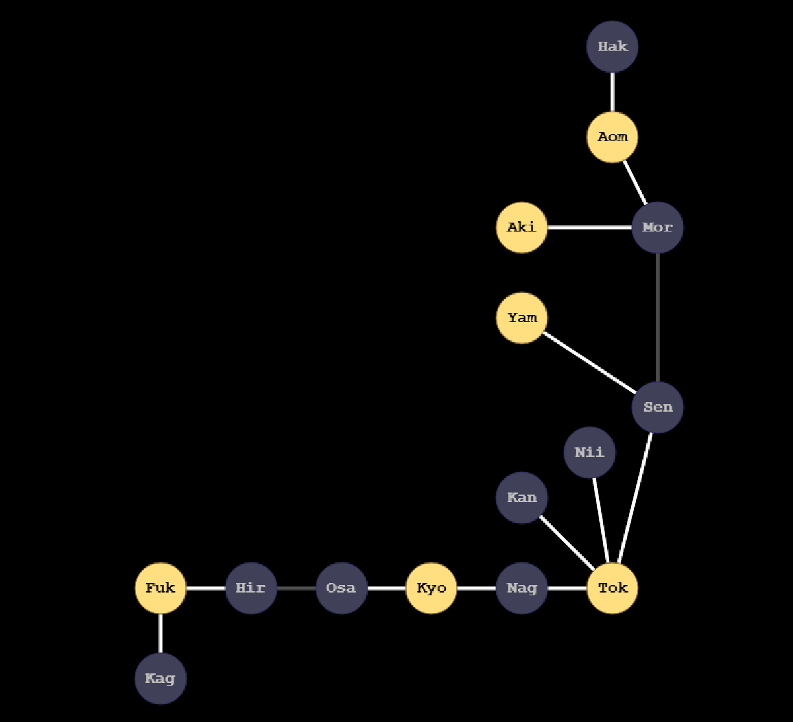


