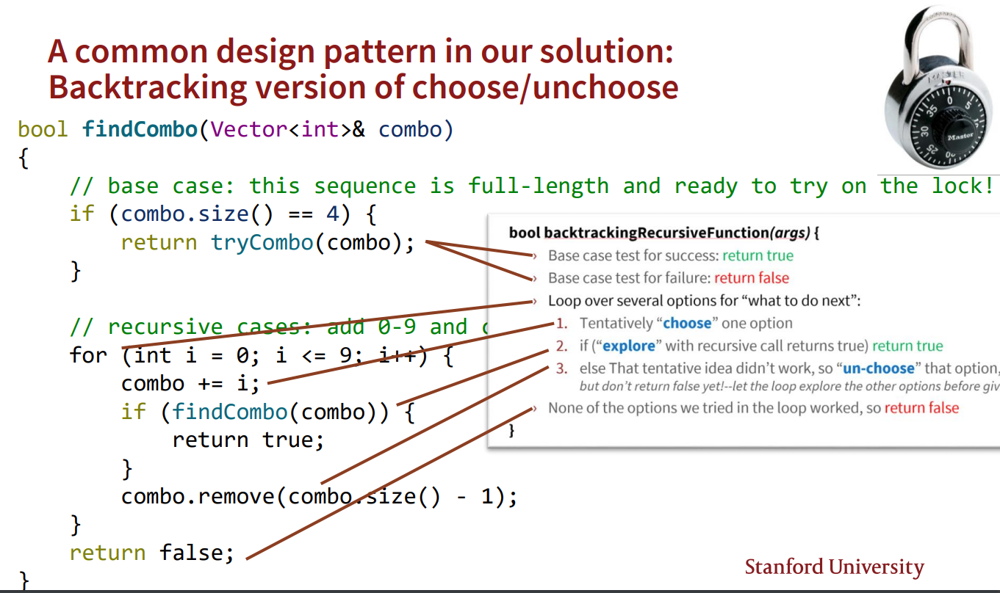

> Readings: Ch8.1~8.3, Ch 9.1~9.3

[Lecture11_Slides.pdf](https://www.yuque.com/attachments/yuque/0/2023/pdf/12393765/1692538871499-ad984b9f-d311-4efc-82b3-8c7e04334835.pdf)
[Lecture12_Slides.pdf](https://www.yuque.com/attachments/yuque/0/2023/pdf/12393765/1692538301707-58e198e1-3f99-47d0-a87c-3ce2122314a4.pdf)
# Tower of Hanoi
> `Recursion`比`Iteration`更简洁。

## Three Pegs
> 


## Four Pegs
### Problem Settings
> 


### Pseudocode
> 1. Move three-pegs from source to auxiliary
> 

> 2. Move Largest-pegs from source to destination
> 

> 3. Move three-pegs from auxiliary to destination
> 


### Code Implementation
> `findSolution(int n, char source, char dest, char aux)`, 表示将$n$个`Hanoi pegs`从`source`移动到`dest`, 利用`aux`。

```cpp
/* Recursive algorithm:
 *  - Base case: Move single disk to destination
 *  - Recursive case: The goal is to move the largest disk to the
 *                    destination post. To do this, first transfer all
 *                    disks above the largest to the auxiliary post.
 *                    Once those are out of the way, move the largest
 *                    disk to destination post. Repeat this process for
 *                    the next largest disk, swapping aux and src since
 *                    the remaining disks are now stacked on the auxiliary
 *                    post.
 *
 */
void findSolution(int n, char source, char dest, char aux) {
    /* TODO: Implement the recursive solution to the Towers of Hanoi! */
    if (n == 1) {   // base case
        moveSingleDisk(source, dest);
    } else {        // recursive case
        findSolution(n - 1, source, aux, dest); // move top n -1 disks
                                                // out of the way

        moveSingleDisk(source, dest);           // move largest disk to dest

        findSolution(n - 1, aux, dest, source); // move the same n-1 disks
                                                // to the destination now
    }
}
```
```cpp
/* Iterative algorithm:
 *  1. Calculate the total number of moves required for n disks.
    2. If n is even, swap destination and auxiliary poles.
    3. for i = 1 to total number of moves:
        if i % 3 == 1:
            perform legal movement between source and destination
        if i % 3 == 2:
            perform legal movement between source and auxiliary
         if i % 3 == 0:
            perform legal movement between auxilliary and destination

   (NOTE: Don't worry if this code doesn't make sense! The main takeaway
    is that the recursive solution is much more elegant + intuitive!)
 */
void findSolutionIterative(int n, char source, char dest, char aux) {
    int numMoves = pow(2, n) - 1; // total number of moves necessary

    // if number of disks is even, swap dest and aux posts
    if (n % 2 == 0) {
        char temp = dest;
        dest = aux;
        aux = temp;
    }

    Stack<int> srcStack;
    for (int i = n; i > 0; i--) {
        srcStack.push(i);
    }
    cout << srcStack << endl;
    Stack<int> destStack;
    Stack<int> auxStack;

    // Determine next move based on how many moves have been made so far
    for (int i = 1; i <= numMoves; i++) {
        switch (i % 3) {
            case 1:
                if (srcStack.isEmpty() ||
                        (!destStack.isEmpty() && srcStack.peek() > destStack.peek())) {
                    srcStack.push(destStack.pop());
                    moveSingleDisk(dest, source);
                } else {
                    destStack.push(srcStack.pop());
                    moveSingleDisk(source, dest);
                }
                break;
            case 2:
                if (srcStack.isEmpty() ||
                        (!auxStack.isEmpty() && srcStack.peek() > auxStack.peek())) {
                    srcStack.push(auxStack.pop());
                    moveSingleDisk(aux, source);
                } else {
                    auxStack.push(srcStack.pop());
                    moveSingleDisk(source, aux);
                }
                break;
            case 0:
                if (destStack.isEmpty() ||
                        (!auxStack.isEmpty() && destStack.peek() > auxStack.peek())) {
                    destStack.push(auxStack.pop());
                    moveSingleDisk(aux, dest);
                } else {
                    auxStack.push(destStack.pop());
                    moveSingleDisk(dest, aux);
                }
                break;
        }
    }
}
```

# Enumeration
## Generating Coin Sequence
> 

```cpp
#include <iostream>
#include "console.h"
using namespace std;

void generateSequences(int length);
void generateSequencesHelper(int flipsLeft, string sofar);

void runSequencesDemo() {
    generateSequences(4);
}

void generateSequences(int length) {
    generateSequencesHelper(length, "");
}

void generateSequencesHelper(int flipsLeft, string sofar) {
    // Base case: no more flips left
    if (flipsLeft == 0) {
        cout << sofar << endl;
    } else {    // Recursive case: either add a "H" or "T"
        generateSequencesHelper(flipsLeft - 1, sofar + "H");
        generateSequencesHelper(flipsLeft - 1, sofar + "T");
    }
}
```


## Enumerate Subsets
### Problem Setting
> 


### Top Down Approach
> **自顶向下方法的思路是:**
> 

```cpp
#include <iostream>
#include <string>
#include "set.h"
#include "console.h"
using namespace std;

void printSubsetsOfRec(const Set<int>& elems, const Set<int>& soFar)
{
    if (elems.isEmpty()) {
        cout << soFar << endl;
        return;
    }

    int elem = elems.first();
    Set<int> remaining = elems - elem;

    // We choose the element
    printSubsetsOfRec(remaining, soFar + elem);

    // We don't choose the element
    printSubsetsOfRec(remaining, soFar);
}

// Wrapper Function
void printSubsetsOf(const Set<int>& elems) {
    Set<int> soFar;
    printSubsetsOfRec(elems, soFar);
}
```
```cpp
// Top down approach
Set<Set<int>> collectSubsetsOfRec(const Set<int>& elems, const Set<int>& soFar)
{
    if (elems.isEmpty()) {
        return { soFar };
    }

    int elem = elems.first();
    Set<int> remaining = elems - elem;

    Set<Set<int>> res;


    // Collecting Results
    // We choose the element
    res += collectSubsetsOfRec(remaining, soFar + elem);

    // We don't choose the element
    res += collectSubsetsOfRec(remaining, soFar);

    return res;
}

Set<Set<int>> collectSubsetsOf(const Set<int>& elems) {
    Set<int> soFar;
    return collectSubsetsOfRec(elems, soFar);
}
```


### Bottom Up Approach
> **自底向上的方法思路是:**
> 假设我们的数组是$\{1,2,3,4,5,6\}$, 则:
> 如果我们已经得到了所有$\{2,3,4,5,6\}$的`Subset`, 则要知道$\{1,2,3,4,5,6\}$的所有`Subset`, 我们只需要在原有的每个`Subset`上都加上$1$即可。
> **于是递归的思路也就出现了:**
> 1. 先拿到所有`Size-n-1 array`的`Subset`
> 2. 然后对所有`Size n-1 array`的`Subset`进行`append array[0]`的操作。

```cpp
#include <iostream>
#include <string>
#include "set.h"
#include "console.h"
using namespace std;


Set<Set<int>> collectSubsetsOf(Set<int>& elems) {
    if (elems.isEmpty()) {
        return {{}};
    }

    int elem = elems.first();
    Set<int> remaining = elems - elem;

    // Building Up the Results
    Set<Set<int>> subsets = collectSubsetsOf(remaining);

    Set<Set<int>> res = subsets;
    for (Set<int> subset: subsets) {
        subset.add(elem);
        res.add(subset);
    }

    return res;
}
```


## Enumerate Permutations
### Problem Setting
> 


### Top Down Implementation
> 

```cpp
/* File: Permutations.cpp
 *
 * Functions to list off all permutations of a collection of elements.
 */
#include <iostream>
#include <string>
#include "set.h"
#include "console.h"
using namespace std;

Set<string> permutationsRec(const string& remaining,
                            const string& soFar) {
    /* Base Case: If we have no more decisions left,
     * we're left with what we committed to.
     */
    if (remaining == "") {
        return { soFar };
    }
    /* Recursive Case: You still decisions left.
     * Something comes next in the ordering. Try
     * all possibilities for what it could be.
     */
    else {
        Set<string> result;
        for (int i = 0; i < remaining.length(); i++) {
            string next = remaining.substr(0, i) +
                          remaining.substr(i + 1);

            result += permutationsRec(next,
                                      soFar + remaining[i]);
        }
        return result;
    }
}

/* Wrapper function:
 *
 * 1. Client (person calling permutations) wants to
 *    say "list permutations of this specific string."
 * 2. Implementation (the code for permutations) needs two
 *    parameters.
 *
 * So: we take in one parameter so the client is happy, and
 * we pass in two parameters so the implementation is happy.
 */
Set<string> permutationsOf(const string& str) {
    return permutationsRec(str, "");
}

int main() {
    Set<string> options = permutationsOf("CS106B");
    cout << "There are " << options.size()
         << " permutations." << endl;
    cout << options << endl;
    return 0;
}

```


## Enumerating Combinations
> `Combination`**其实就是**`Subset`**问题的一个变种，区别在于**`Combination`**限制了**`Subset`**的长度。所以本质上**`Combination`**还是在问两个问题: 
> 1. `Do I pick this element or not?`
> 2. `Can I pick more element? `


### Naive Approach
> 
> 但是如果我们不知道组合的规模，这个方法的复杂度就无从而知了，可能会非常大。


### Top Down Approach
> 

```cpp
#include <iostream>
#include "set.h"
#include "console.h"
using namespace std;

/* Given a set of strings and a number of elements to choose,
 * returns all ways to pick that many more elements subject
 * to the constrain that we've already chosen the elements in
 * soFar.
 * elems 表示带选择的元素
 * numRemaining 表示还需要选择多少元素就可以封装结果返回出去
 * soFar 表示目前做出的所有选择
 */
Set<Set<string>>
   combinationsRec(const Set<string>& elems,
                   int numRemaining,
                   const Set<string>& soFar) {
    /* Base Case: If we don't need to pick any more
     * people, then we're done!
     */
    if (numRemaining == 0) {
        return { soFar };
    }
    /* Base Case: If we're asked to pick more people
     * than remain, then we can't find any solutions.
     */
    else if (numRemaining > elems.size()) {
        return { };
    }
    /* Recursive Case: Pick a person and decide what to
     * do with them.
     */
    else {
        string elem = elems.first();
        Set<string> remaining = elems - elem;

        /* Option 1: Exclude this person. */
        auto without = combinationsRec(remaining,
                                       numRemaining,
                                       soFar);

        /* Option 2: Include this person. */
        auto with = combinationsRec(remaining,
                                    numRemaining - 1,
                                    soFar + elem);

        return with + without;
    }
}

/* Given a set of strings and a number of elements, returns all ways to
 * pick exactly that many elements from the set.
 */
Set<Set<string>> combinationsOf(const Set<string>& elems,
                                int numToPick) {
    /* Check validity. */
    if (numToPick < 0) {
        error("You shouldn't ask for a negative number of people.");
    }

    return combinationsRec(elems, numToPick, {});
}

/* Current members of the US Supreme Court, ordered
 * by seniority.
 */
const Set<string> usSupremeCourt = {
    "Roberts",
    "Thomas",
    "Breyer",
    "Alito",
    "Sotomayor",
    "Kagan",
    "Gorsuch",
    "Kavanaugh",
    "Barrett"
};

int main() {
    auto combinations = combinationsOf(usSupremeCourt, 5);

    cout << "There are " << combinations.size()
         << " combinations. They are: " << endl;

    for (auto combination: combinations) {
        cout << combination << endl;
    }
    return 0;
}
```


# BackTracking
## BackTracking Template
> [!summary]
> 


## Cracking a Combo Lock
> [!example]
> We will rewrite the generateAllSequeneces() function to adapt to this particular task. 
> 
> Basically we want the function to return immediately if we have found a working combo(4-digit solution). So we have to modify the function above as required as follows:
> 1. Function should return whether we can crack the lock, so return type should be bool. 
> 2. The length of the lock password is always 4, so no need for the first argument length.
> 3. Since we are not collecting all the combos(which might work or might not), so we don't need the second argument.
> 4. The last argument should be changed to be the digits that we have tried soFar.
>
> 

> [!important] Recursive Intuition
> 


# Shrinkable Words - Permutations⭐⭐⭐⭐⭐
## Definition
> 

**Example**
**Counter Example**


## Lexicon Class - Stanford Library
> 


## How to Determine Shrinkability
> 

```cpp
bool isShrinkable(Lexicon& lex, string word) {
    /* Base Case 1: Things must be words to be shrinkable words. */
    if (!lex.contains(word)) {
        return false;
    }
    /* Base Case 2: If you're a single letter, then yes, you're shrinkable. */
    if (word.length() == 1) {
        return true;
    }

    /* Recursive Case: Try removing each letter. */
    for (int i = 0; i < word.length(); i++) {
        string shrunken = word.substr(0, i) + word.substr(i + 1);
        if (isShrinkable(lex, shrunken)) {
            return true;
        }
    }

    /* Oh fiddlesticks. */
    return false;
}
```

## Generating the Results
> 

```cpp
#include <iostream>
#include <string>
#include "vector.h"
#include "lexicon.h"
#include "console.h"
#include "simpio.h"
using namespace std;

bool isShrinkable(const string& word,
                  const Lexicon& english,
                  Vector<string>& shrinkingSequence) {
    /* Base Case: Non-words aren't shrinkable words. */
    if (!english.contains(word)) {
        return false;
    }

    /* Base Case: Any word of length 1 is shrinkable. */
    if (word.length() == 1) {
        shrinkingSequence = { word };
        return true;
    }

    /* Recursive step: look at all words you can
     * form by removing a single letter. If any of
     * them are shrinkable, the whole word is
     * shrinkable!
     */
    for (int i = 0; i < word.length(); i++) {
        string shrunken = word.substr(0, i) +
                          word.substr(i+1);
        if (isShrinkable(shrunken, english,
                         shrinkingSequence)) {
            shrinkingSequence += word;
            return true;
        }
    }

    /* If none of those options worked, this string
     * cannot be shrunk.
     */
    return false;
}

int main() {
    Lexicon english("EnglishWords.txt");
    while (true) {
        string word = getLine("Enter a word: ");

        Vector<string> sequence;
        if (isShrinkable(word, english, sequence)) {
            cout << "It's shrinkable!" << endl;
            for (string step: sequence) {
                cout << step << endl;
            }
        } else {
            cout << "Nothing to see here, folks; move along." << endl;
        }
    }
}
```


## Importance of Output Parameters
> 


## Summary
> 


# Dense Crossword - Permutations
> 
> **我们的最终目的是: **
> 要填满这个`Crossword Puzzles`, 保证`Crossword Board`的每一行，每一列的单词都是合法的，即`Lexicon.contains(word) for word in rows and columns`。

**算法思路**
总的来说，我们可以采用和`Shrinkable Word`中一样的方法，尝试所有的`word`。
```cpp
/* File: Crosswords.cpp
 *
 * A program to generate dense crosswords.
 */
#include <iostream>
#include <string>
#include "lexicon.h"
#include "grid.h"
#include "console.h"
using namespace std;

/**
 * Given a grid and a column, extracts the word at that column up to a certain
 * number of characters.
 *
 * @param grid The grid in question.
 * @param col Which column to extract
 * @param numRows How many rows to read
 * @return The contents of that column.
 */
string contentsOfColumn(const Grid<char>& grid, int col, int numRows) {
    string result;
    for (int row = 0; row < numRows; row++) {
        result += grid[row][col];
    }
    return result;
}

/**
 * Prints a crossword to the console.
 *
 * @param crossword The crossword in question.
 */
void printCrossword(const Grid<char>& crossword) {
    for (int row = 0; row < crossword.numRows(); row++) {
        for (int col = 0; col < crossword.numCols(); col++) {
            cout << crossword[row][col];
        }
        cout << endl;
    }
}

/**
 * Given a partially-filled crossword, check whether the columns
 * all start with strings that could, in principle, each be
 * extended into a full word.
 *
 * @param crossword The partial crossword.
 * @param nextRow   How many rows have been filled in.
 * @param colWords  Words that could appear in the columns.
 * @return Whether the columns could be extended to words.
 */
bool areColumnsFeasible(const Grid<char>& crossword,
                        int nextRow,
                        const Lexicon& colWords) {
    /* Check each column. */
    for (int col = 0; col < crossword.numCols(); col++) {
        /* Get its contents. */
        string column = contentsOfColumn(crossword, col, nextRow);
        if (!colWords.containsPrefix(column)) {
            return false;
        }
    }
    return true;
}


/* Can we fill in this partial crossword, starting at row nextRow? If so,
 * the function updates crossword with one possible solution.
 */
bool canMakeCrosswordRec(Grid<char>& crossword,
                         int nextRow,
                         const Lexicon& rowWords,
                         const Lexicon& colWords) {
    /* Base Case: Columns don't make sense. */
    if (!areColumnsFeasible(crossword,
                            nextRow,
                            colWords)) {
        return false;
    }

    /* Base Case: Everything filled! */
    if (nextRow == crossword.numRows()) {
        return true;
    }

    for (string word: rowWords) {
        /* Copy the word in. */
        for (int col = 0; col < crossword.numCols(); col++) {
            crossword[nextRow][col] = word[col];
        }

        /* See if that works. */
        if (canMakeCrosswordRec(crossword,
                                nextRow + 1,
                                rowWords, colWords)) {
            return true;
        }
    }

    /* Aw shucks. */
    return false;
}

/* Given a blank crossword, can it be filled in using English
 * words so that every square is filled?
 */
bool canMakeCrossword(Grid<char>& crossword,
                      const Lexicon& english) {
    Lexicon rowWords, colWords;
    for (string word: english) {
        if (word.length() == crossword.numCols()) {
            rowWords += word;
        }
        if (word.length() == crossword.numRows()) {
            colWords += word;
        }
    }
    return canMakeCrosswordRec(crossword, 0,
                               rowWords, colWords);

}

int main() {
    Lexicon english("EnglishWords.txt");

    /* The dimensions here are arbitrary but give rise to some pretty cool words! */
    Grid<char> crossword(4, 7);

    cout << "Starting..." << endl << endl;

    if (canMakeCrossword(crossword, english)) {
        printCrossword(crossword);
    } else {
        cout << "No solution found." << endl;
    }
    return 0;
}
```


