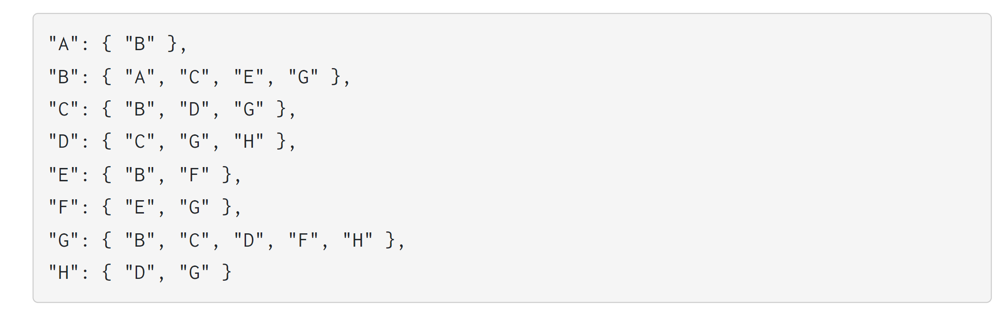
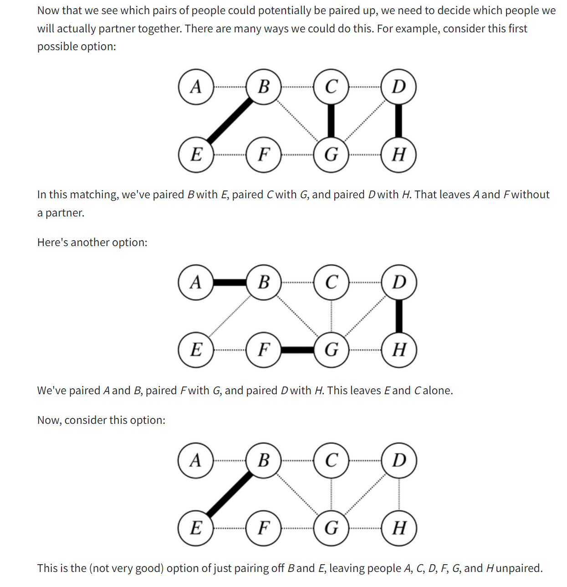
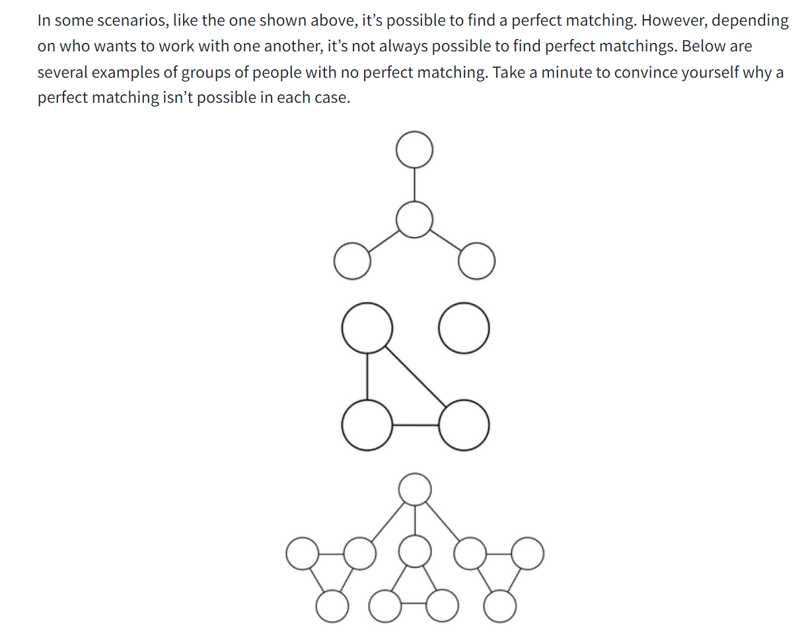
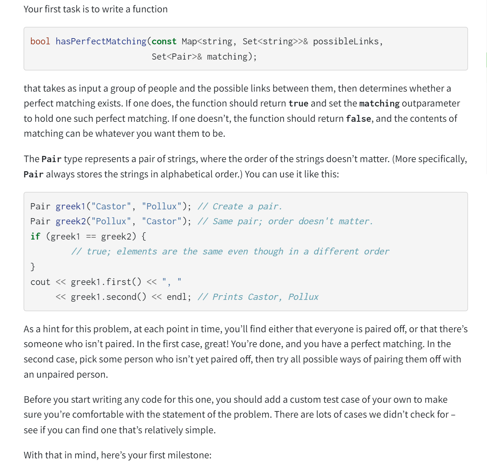
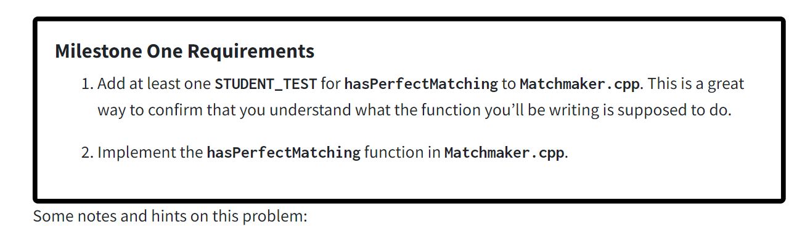
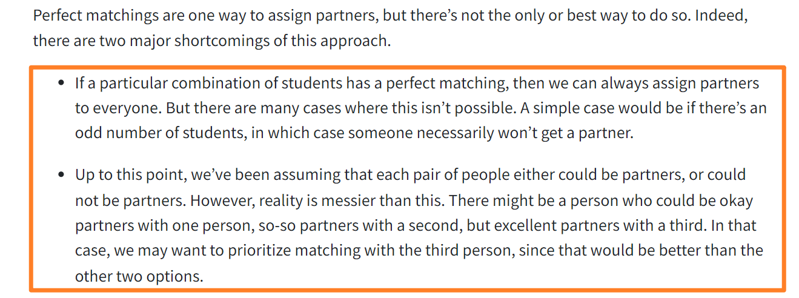
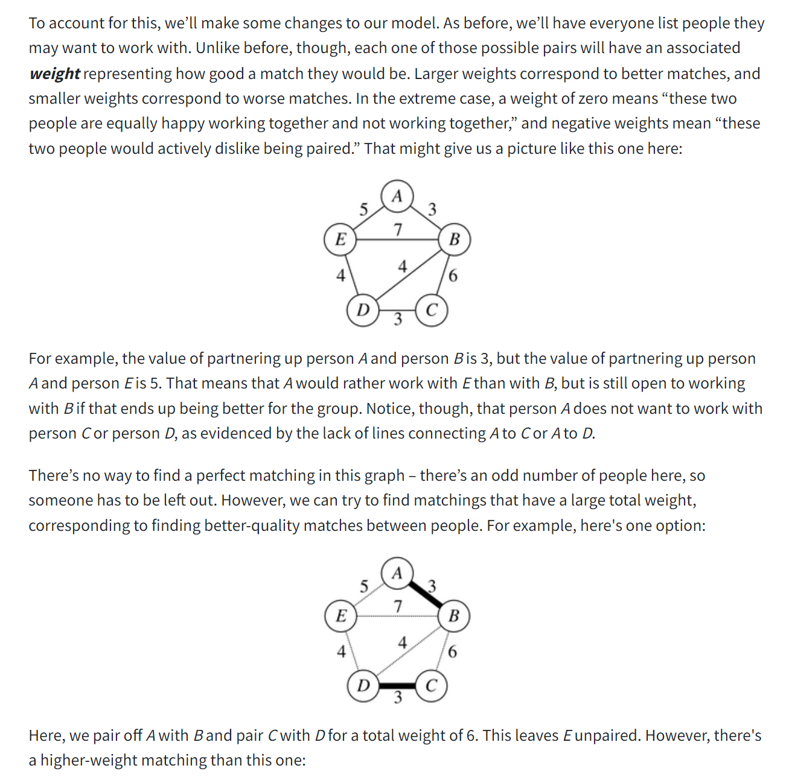
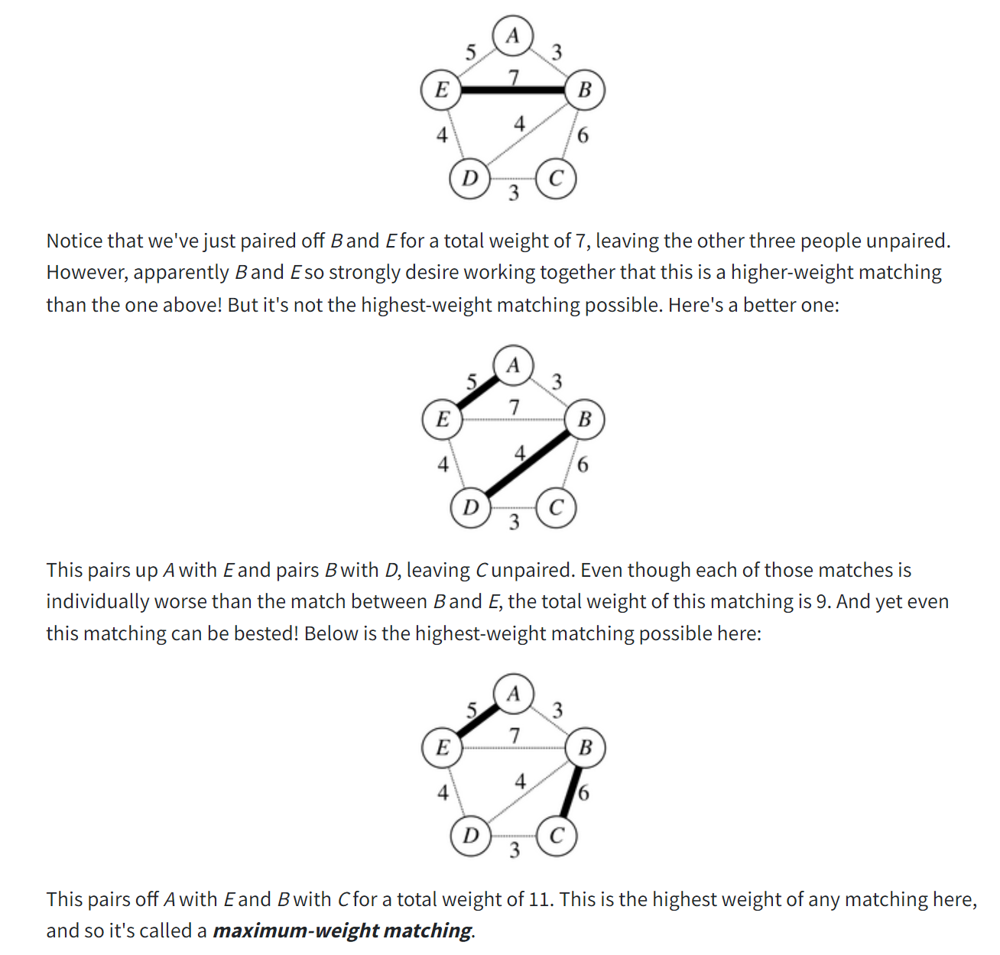
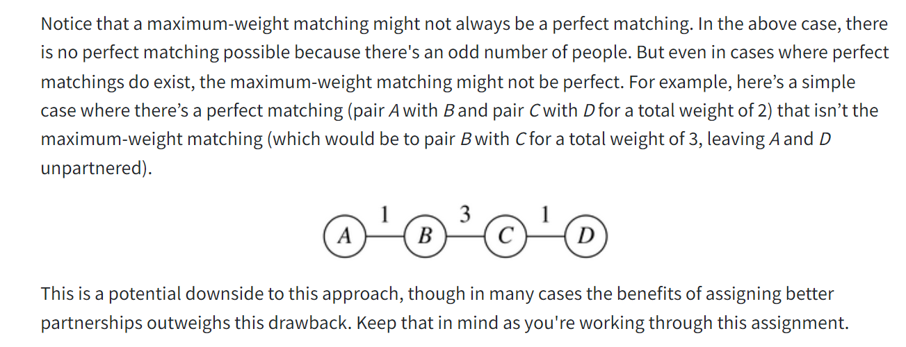

# Part 1: Debugging Practice

# Part 2: MatchMaker
## Background One: Perfect Matching
> [!motiv] Introduction
> 

> [!concept] Perfect Matching
> 

## Milestone One: Find Perfect Matchings
### Task Description
> [!task]
> 
> **Some Remarks:**
> - **Adjacency Matrix:** The links in `possibleLinks` are symmetric: if person _A_ is a possible match for person _B_, then person _B_ is also a possible match for person _A_. You can assume we’ll never call this function on an input where that isn’t the case.
> - **No Self-Loop**: No person will ever have a possible link to themselves. Each link really does represent a pair of people.
> - **Isolated Vertex is Possible:** It’s possible that there’s a person in `possibleLinks` who isn’t linked to anyone, meaning that they aren’t comfortable working with anyone. In that case, there’s no perfect matching.
> - You may find it easier to solve this problem first by simply getting the return value right, completely ignoring the `matching` outparameter. Once you’re sure that your code is always producing the right answer, update it so that you actually fill in `matching`. Doing so shouldn’t require too much code, and it’s way easier to add this in at the end than it is to debug the whole thing all at once.
> - You can assume that `matching` is empty when the function is called.
> - If your function returns `false`, the final contents of `matching` don’t matter, though we suspect your code will probably leave it blank.
> - If you need to grab a key out of a `Map` and don’t care which key you get, use the function `map.firstKey()`. To grab a key out of a `Set`, use `set.first()`. (Which of these functions, if any, you use in this function are up to you.)
> - Although the parameters to this function are passed by `const` reference, you’re free to make extra copies of the arguments or to set up whatever auxiliary data structures you’d like. If you find you’re “fighting” your code – an operation that seems simple is taking a lot of lines – it might mean that you need to change your data structures.
> - You might be tempted to solve this problem by repeatedly taking a person with the most possible partners and then assigning them a partner, or taking the person with the fewest possible partners and picking a partner for them, or something like this. Solutions like these are called **_greedy algorithms_**, and while greedy algorithms do work well for some problems, this problem is not one of them. **To the best of our knowledge, there is no known greedy algorithm for this problem.**
> - The very last of the provided tests is a **“stress test”** designed to check that your algorithmic strategy avoids unnecessary work. Specifically, this test is designed to check whether your code repeatedly generates the same matchings multiple times, or spends time exploring matchings that couldn’t possibly work (say, matchings where a person was intentionally never assigned a partner). **If this test never finishes running, or it finishes running only after a very long time, it may mean that the strategy you’ve picked for this problem is intrinsically inefficient.** If you run into this, take a look over your code. Make sure each matching you generate is generated exactly once and that you don’t, say, try assigning the same pair of people to each other multiple times.

### CS106B Implementations
> [!code]
> 

## Background Two: Maximum-Weight Matching
> [!concept]
> 

## Milestone Two: Find Maximum-Weight Matchings
> [!task]
> 

# Part 3: Disaster Planning

