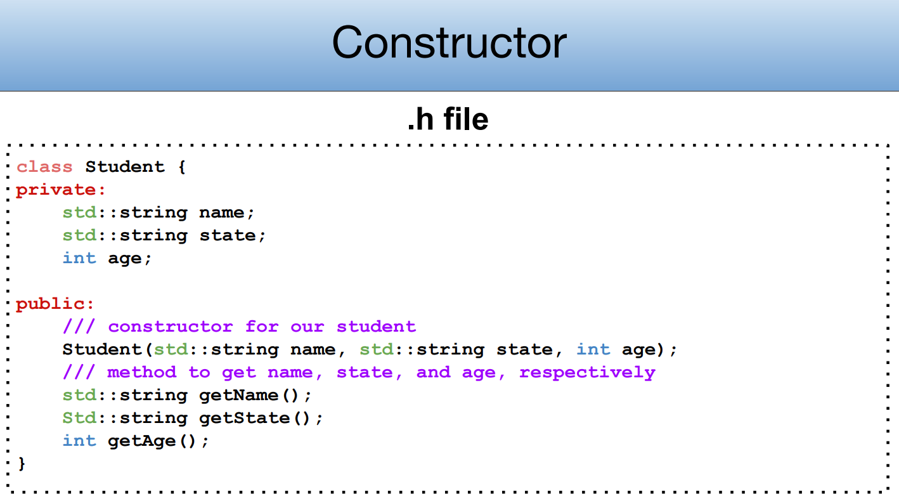
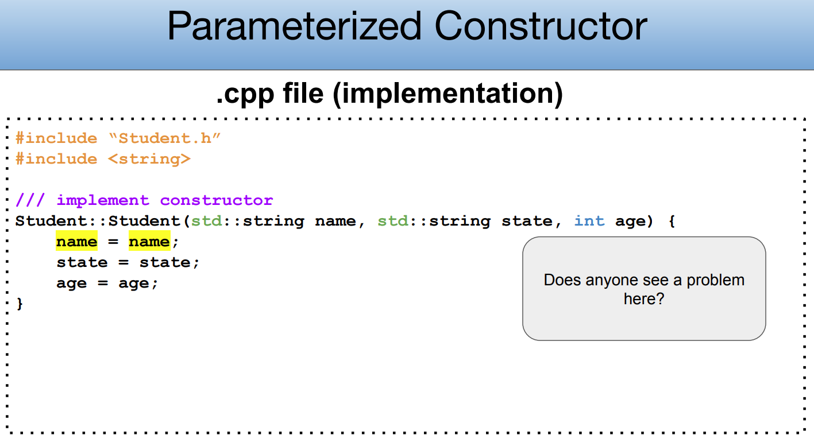
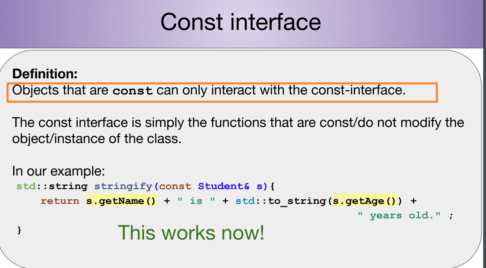

# Header and Source File
> [!concept]
> 


# Class Design
> [!concept]
> 


## Constructor
### How to Define
> [!important]
> 


### Constructor Overload
> [!concept]
> 


### Implement Member Functions
> [!concept]
> 


## Operator Overloading
> [!important]
> 


## Destructor
> [!concept]
> 


## this keyword - name conflict
> [!concept]
> 
> **Remarks:**
> 1. Getter functions don't have naming conflict with the parameter since typically they don't have input parameters.
> 2. Setter functions can have naming conflicts so we need to use `this` to fully specify.
> 3. Alternative way to avoid name conflict is to add a subscript before the member variables.


## Type Casting
> 


## Class Design Examples
### Car Class
> [!task]
> 

```c++ car.h
#include <string>

class Car {
public:
    // Constructor
    Car(std::string make, std::string model, int year, int mileage);
    
    // Getters
    std::string GetMake();
    std::string GetModel();
    int GetYear();
    int GetMileage();
    
    // Other methods
    void Drive(int distance);

    void DisplayInfo();

private:
    std::string _make;
    std::string _model;
    int _year;
    int _mileage;
};

```


```c++ cpp file
// Gotta include the .h file!!
#include "car.h"

// Best practice to include header files that are only needed for implementation 
// in the .cpp file 
#include <iostream>

Car::Car (std::string make, std::string model, int year, int mileage) {
	// To avoid name conflict
  _make = make;
  _model = model;
  _year = year;
  _mileage = mileage;
}

std::string Car::GetMake () {
  return _make;
}

std::string Car::GetModel () {
  return _model;
}

int Car::GetYear () {
  return _year;
}

int Car::GetMileage () {
  return _mileage;
}

void Car::Drive (int distance) {
  _mileage += distance;
}

void Car::DisplayInfo () {
  std::cout << "Make: " << _make << std::endl;
  std::cout << "Model: " << _model << std::endl;
  std::cout << "Year: " << _year << std::endl;
  std::cout << "Mileage: " << _mileage << std::endl;
}

```

### Dynamic Array Example
> [!task]
> 


# Class Hierarchy
## Inheritance
> [!concept]
> 


# Template Classes and Const Correctness
## Template Classes
### Header File Definition
> [!concept]
> 


## CPP File Implementation
> [!concept]
> 


> [!bug]
> 


## Const Correctness
> [!concept]
> 


## Const Interface
> [!important]
> 


# Static in C++


# CONST in C++


