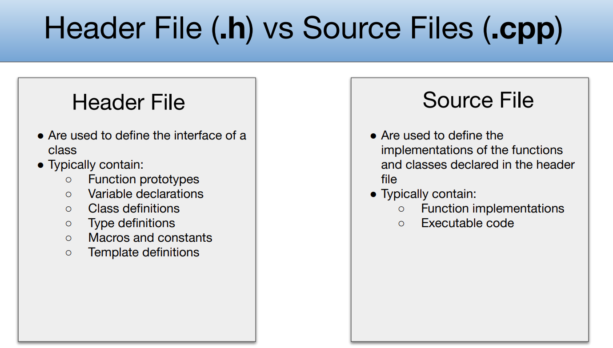
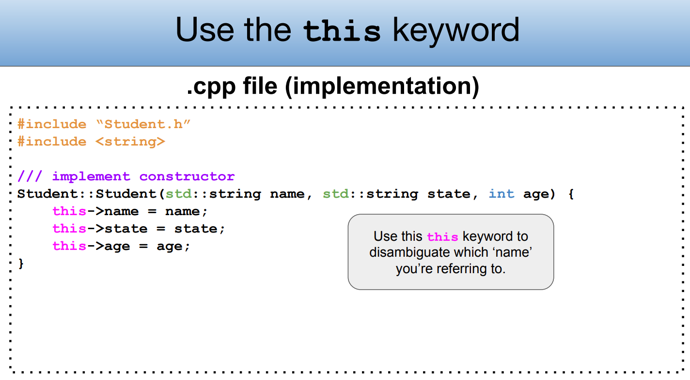
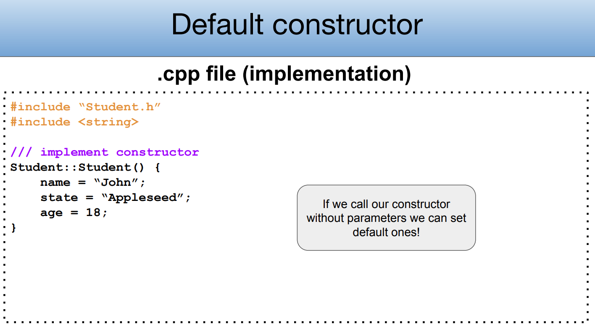
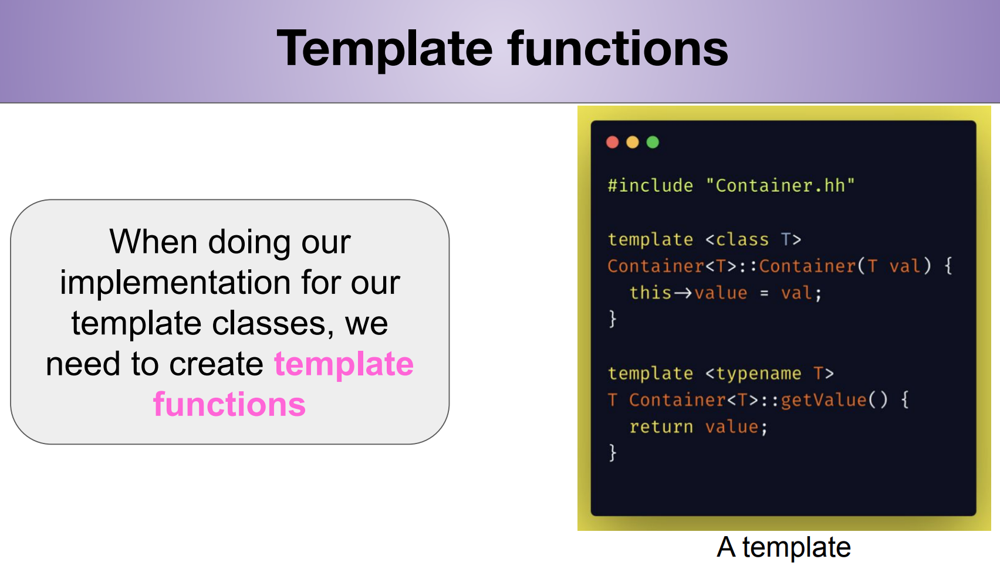
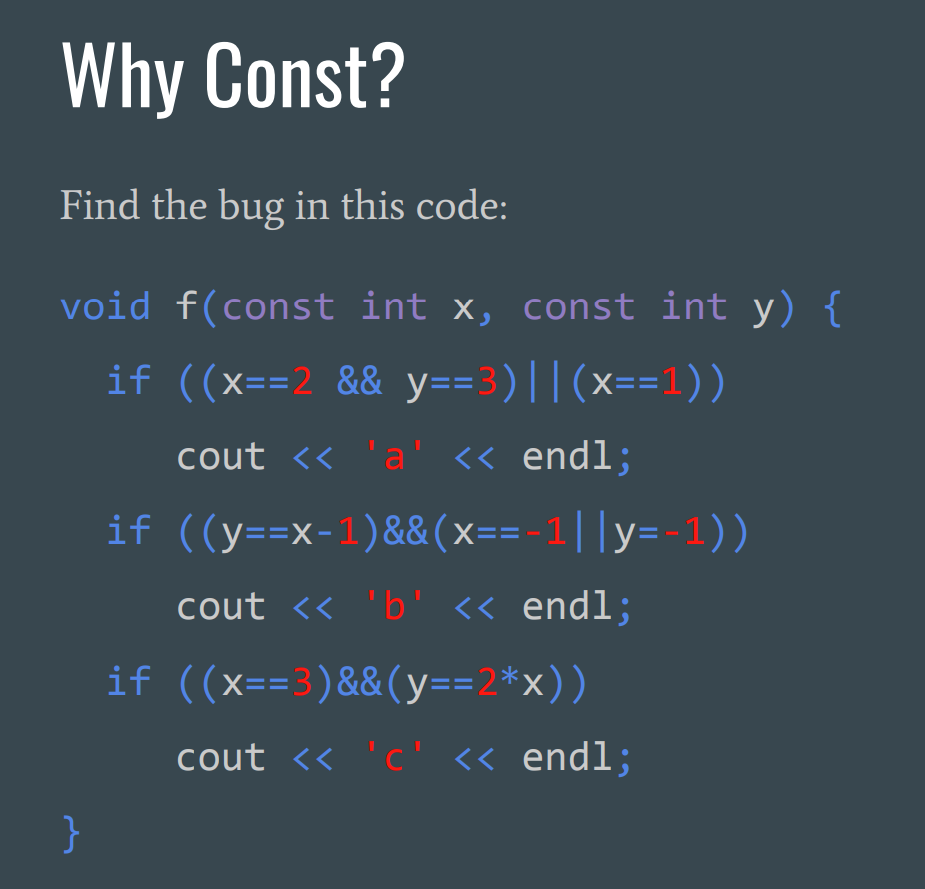
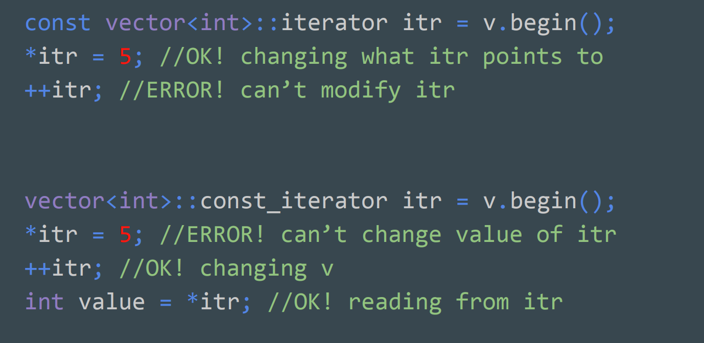
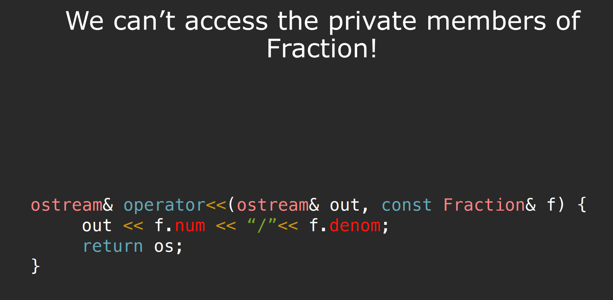
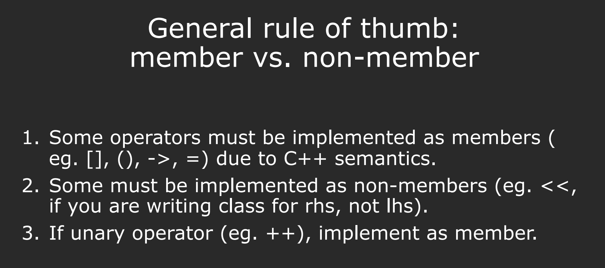
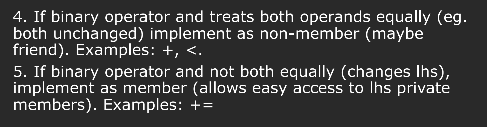

# Header and Source File
> [!concept]
> 


# Class Design
> [!concept]
> 


## Constructor
### How to Define
> [!important]
> 


### Constructor Overload
> [!concept]
> 


### Implement Member Functions
> [!concept]
> 


## Destructor
> [!concept]
> 


## this keyword - name conflict
> [!concept]
> 
> **Remarks:**
> 1. Getter functions don't have naming conflict with the parameter since typically they don't have input parameters.
> 2. Setter functions can have naming conflicts so we need to use `this` to fully specify.
> 3. Alternative way to avoid name conflict is to add a subscript before the member variables.


## Type Casting
> 


## Class Design Examples
### Car Class
> [!task]
> 

```c++ car.h
#include <string>

class Car {
public:
    // Constructor
    Car(std::string make, std::string model, int year, int mileage);
    
    // Getters
    std::string GetMake();
    std::string GetModel();
    int GetYear();
    int GetMileage();
    
    // Other methods
    void Drive(int distance);

    void DisplayInfo();

private:
    std::string _make;
    std::string _model;
    int _year;
    int _mileage;
};

```


```c++ cpp file
// Gotta include the .h file!!
#include "car.h"

// Best practice to include header files that are only needed for implementation 
// in the .cpp file 
#include <iostream>

Car::Car (std::string make, std::string model, int year, int mileage) {
	// To avoid name conflict
  _make = make;
  _model = model;
  _year = year;
  _mileage = mileage;
}

std::string Car::GetMake () {
  return _make;
}

std::string Car::GetModel () {
  return _model;
}

int Car::GetYear () {
  return _year;
}

int Car::GetMileage () {
  return _mileage;
}

void Car::Drive (int distance) {
  _mileage += distance;
}

void Car::DisplayInfo () {
  std::cout << "Make: " << _make << std::endl;
  std::cout << "Model: " << _model << std::endl;
  std::cout << "Year: " << _year << std::endl;
  std::cout << "Mileage: " << _mileage << std::endl;
}

```

### Dynamic Array Example
> [!task]
> 


# Class Hierarchy
## Inheritance
> [!concept]
> 


# Template Classes
## Template Classes
### Header File Definition
> [!concept]
> 


## CPP File Implementation
> [!concept]
> 


> [!bug]
> 


# Const Keyword
## Why Const?
### Detecting Malicious Assginment
> [!important]
> 
> Due to the const keyword, any attempts to modify the content of const variable will trigger **compiler errors**.


### Reasoning about function's behavior
> [!important]
> 
> **Notes:**
> 
> Here, all three functions will change the state of the planet object, which cannot be reasoned without the help of const keyword.


## Const in Class
> [!example]
> 
> So const object can only call const member functions. Any call to non-const member function will trigger **compilation error**.


## Const Correctness
> [!concept]
> The const correctness means that if we promise not to modify some object `s` by putting const keywords before tehe variable decalration, then we should make sure that any calls to the member function of `s` should also be const functions.
> 


## Const Interface
> [!important]
> 


## Const Pointer
> [!concept]
> 


## Const Iterator
> [!concept]
> We can think of constant iterator just as constant pointer, where incrementing is not allowed but modifying the data it points to is legal. 
> 


## Summary
> [!summary]
> 


# Iterator Class


# Operators
> [!overview]
> 


## Operator Overloading
> [!concept]
> 


## Unary Operators
> [!example] vector class +=
> 
> **Notes:**
> 
> It is super important to return a reference type at the operator function. Since if we don't do it, we are returning a brand new object. Then if we call `("s" += "a") += "b"` and print `"s"`we will get `"sa"` instead of `"sab"`.

> [!example] vector class []
> 


## Binary Operators
> [!example] vector class +
> 
> 1. **Why are we returning by value instead?** 
>    We don't want to support chain calling.
> 2. **Why are both parameters const?** 
>    The arithmetic operators return copies but doesn’t change the objects themselves.
> 3. **Why did we declare these as non-member functions?**
>    We are not changing the objects of lhs.

> [!example] fraction struct <<
> 
> 1. **Why is the ostream parameter passed by non-const reference, and the Fraction struct passed by const reference?** 
>    Always think about const-ness of parameters. Here, we are modifying the stream, not the Fraction struct.
> 2. **Why are we returning a reference?** 
>    Return reference to support chaining << calls
> 3. **Why are we implementing this as a non-member function?**
>    Here we are overloading << so our class works as the rhs…but we can’t change the class of lhs (stream library).

> [!example] fraction class << friend keyword
> 


## Member vs Non-Member
> [!important]
> 
> 6. If binary operator wants to change the lhs but the lhs is a STL library function, then implement as non-member.
> 7. If a non-member operator wants to access the rhs's private variable, use friend keyword before the non-member operator in the rhs's class.


## Conversion Operators
> [!important]
> 


# Principle of Least Astonishment(POLA)
## C 160 Mimic Conventional Usage
> [!concept]
> 


## C.161 Non-member for symmetric operators
> [!concept]
> 


