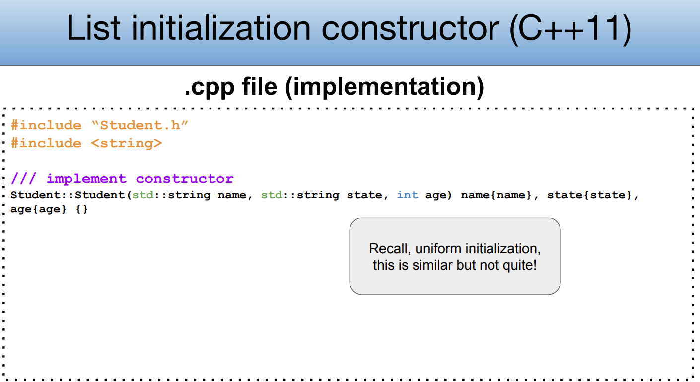
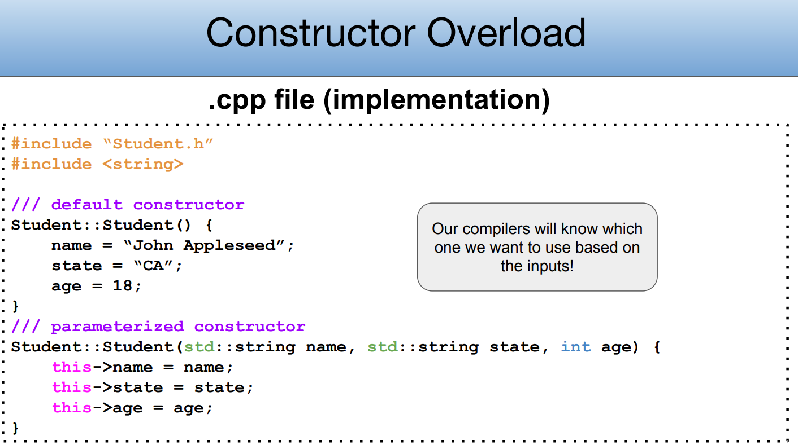
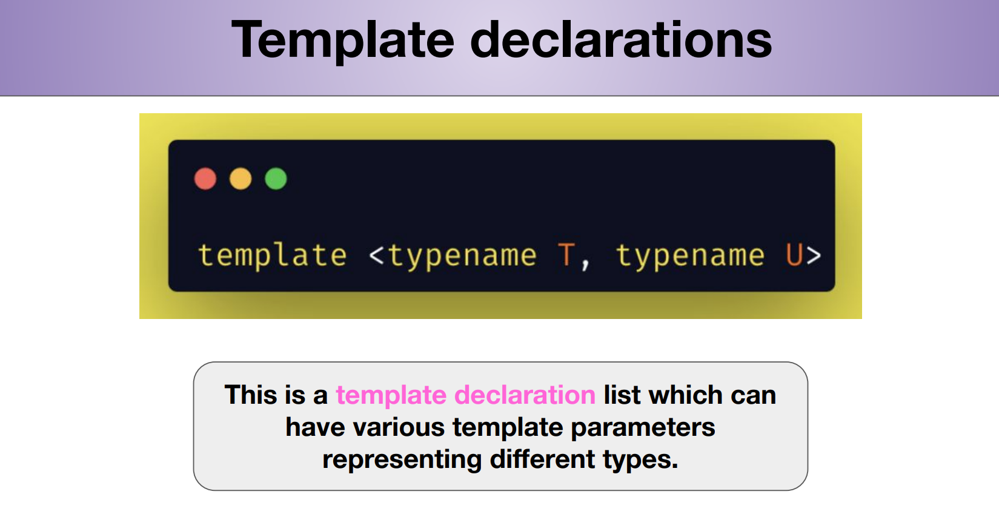
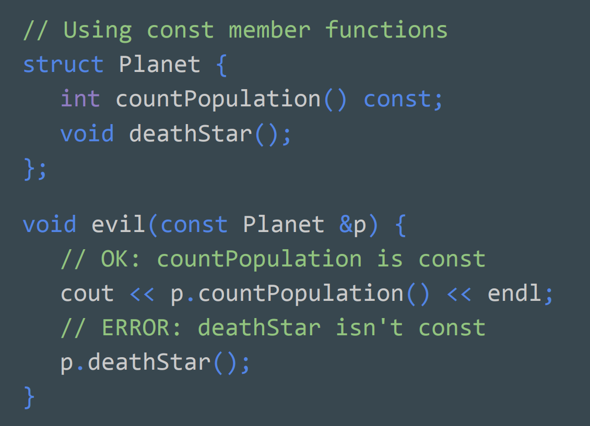
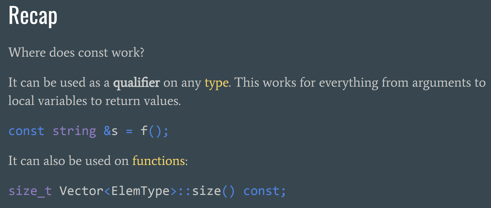
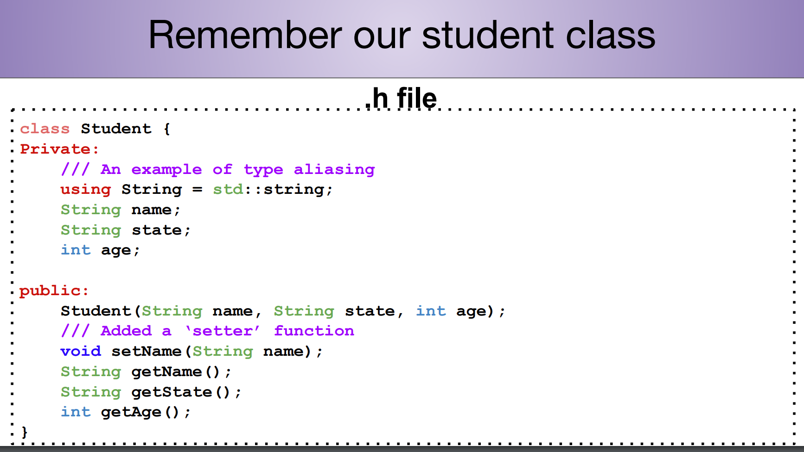
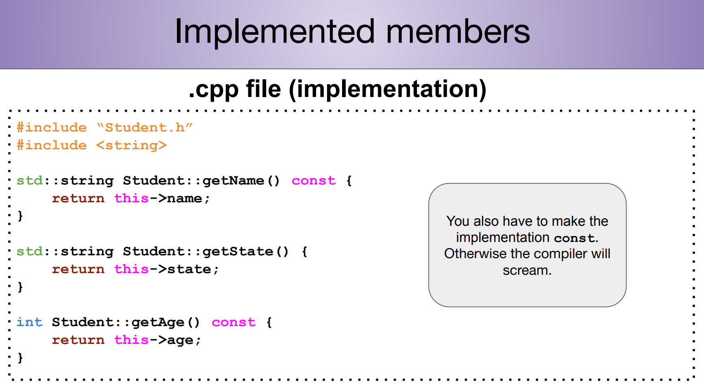
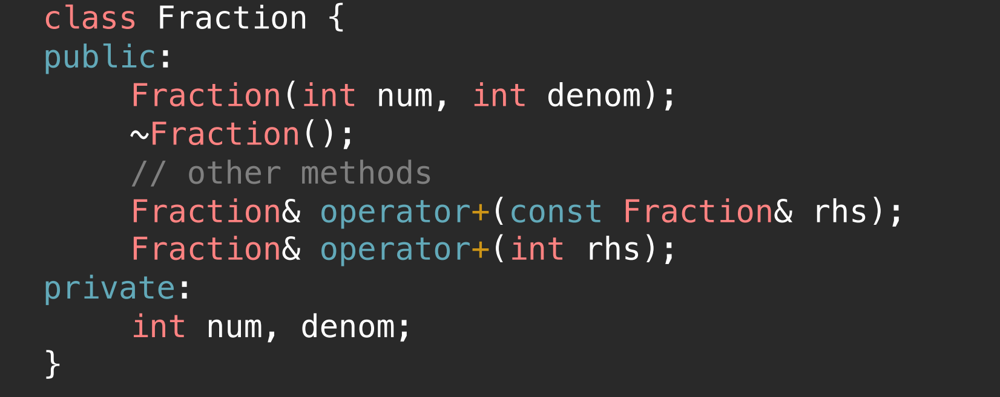

# Header and Source File
> [!concept]
> 


# Class Design
> [!concept]
> 


## Constructor
### How to Define
> [!important]
> 


### Constructor Overload
> [!concept]
> 


### Implement Member Functions
> [!concept]
> 


## Destructor
> [!concept]
> 


## this keyword - name conflict
> [!concept]
> 
> **Remarks:**
> 1. Getter functions don't have naming conflict with the parameter since typically they don't have input parameters.
> 2. Setter functions can have naming conflicts so we need to use `this` to fully specify.
> 3. Alternative way to avoid name conflict is to add a subscript before the member variables.


## Type Casting
> 


## Class Design Examples
### Car Class
> [!task]
> 

```c++ car.h
#include <string>

class Car {
public:
    // Constructor
    Car(std::string make, std::string model, int year, int mileage);
    
    // Getters
    std::string GetMake();
    std::string GetModel();
    int GetYear();
    int GetMileage();
    
    // Other methods
    void Drive(int distance);

    void DisplayInfo();

private:
    std::string _make;
    std::string _model;
    int _year;
    int _mileage;
};

```


```c++ cpp file
// Gotta include the .h file!!
#include "car.h"

// Best practice to include header files that are only needed for implementation 
// in the .cpp file 
#include <iostream>

Car::Car (std::string make, std::string model, int year, int mileage) {
	// To avoid name conflict
  _make = make;
  _model = model;
  _year = year;
  _mileage = mileage;
}

std::string Car::GetMake () {
  return _make;
}

std::string Car::GetModel () {
  return _model;
}

int Car::GetYear () {
  return _year;
}

int Car::GetMileage () {
  return _mileage;
}

void Car::Drive (int distance) {
  _mileage += distance;
}

void Car::DisplayInfo () {
  std::cout << "Make: " << _make << std::endl;
  std::cout << "Model: " << _model << std::endl;
  std::cout << "Year: " << _year << std::endl;
  std::cout << "Mileage: " << _mileage << std::endl;
}

```

### Dynamic Array Example
> [!task]
> 


# Template Classes
## Template Classes
### Header File Definition
> [!concept]
> 


### CPP File Implementation
> [!concept]
> 
> **Remarks:**
> Even if we prefer separation model of `.hh` and `.cpp`, for template class this is not the case and will cause linking issues.
> So if we want to define template class and compile multiple cpp files we would better implement the member function in the header file of template class instead of in the cpp file.


> [!bug]
> 


## Linking Error - pp237~240
> [!important]
> 


## Stack Example
> [!code] OurStack.hh
> Note that once we use template class definition, we should keep all the implementations of the member functions inside the header file, instead of doing it separately in cpp file, which is different from non-template class definition. 
> 
> Thus, the implementation goes as follows:
```C++
#include <algorithm>

#include <iostream>

using namespace std;

template <typename T>

class OurStack {

    public:

        OurStack() {

            elems = new int[INITIAL_SIZE];

            logicalSize = 0;

            allocatedSize = INITIAL_SIZE;

        }

  

        /*

            Q: What is the ~OurStack() function? Why is each line in that function necessary? Why isn’t there any code in there involving the logicalSize or allocatedSize data members?

            A: This is the destructor. Its job is to deallocate any extra memory or resources that were allocated by the OurStack class and not otherwise automatically reclaimed. Here, we deallocate the memory we allocated earlier by using delete[]. We don’t need to do anything to logicalSize or allocatedSize because there were no dynamic allocations performed to get space for them. Generally speaking, you only need to explicitly clean up resources that you explicitly allocated.

        */

        ~OurStack() {

            delete[] elems;

            elems = nullptr;

        }

        void push(T elem) {

            if (isFull()) {

                grow();

            }

  

            elems[logicalSize] = elem;

            logicalSize++;

        }

        int pop() {

            if (isEmpty()) {

                cerr << "The stack is empty, cannot perform pop operation" << endl;

            }

  

            int res = elems[logicalSize];

            // elems[logicalSize] = nullptr;

            logicalSize;

            if (logicalSize < allocatedSize / 4) {

                setCapacity(allocatedSize / 2);

            }

            return res;

        }

        int peek() const {

            if (isEmpty()) {

                cerr << "The stack is empty, cannot perform peek operation" << endl;

            }

  

            return elems[logicalSize - 1];

        }

  

        int size() const {

            return logicalSize;

        }

  

        bool isEmpty() const {

            if (logicalSize == 0) {

                return true;

            }

  

            return false;

        }

  

        friend std::ostream& operator<<(std::ostream& out, const OurStack<T>& stack) {

            out << "From bottom to Top ";

            for (int i = 0; i < stack.logicalSize; i++) {

                out << stack.elems[i] << " ";

            }

            out << endl;

  

            return out;

        }

  

    private:

        T* elems;

        int logicalSize;

        int allocatedSize;

  

        static int const INITIAL_SIZE = 10;

  

        /* Q: In the OurStack::grow() function, one of the lines is delete[] elems,

              and in the next line we immediately write elems = newArr;.

              Why is it safe to do this? Doesn’t deleting elems make it unusable?

           A: The statement delete[] elems; means “destroy the memory pointed at by elems”

              rather than “destroy the elems variable.” As a result, after the first line executes

              , elems is still a perfectly safe variable to reassign.

        */

        void grow() {

            int* newElems = new int[allocatedSize * 2];

            for (int i = 0; i < logicalSize; i++)  {

                newElems[i] = elems[i];

            }

  

            delete[] elems;

            elems = newElems;

            allocatedSize *= 2;

        }

  
  

        /*

            Q: Explain why it would not be a good idea to cut the array size in half whenever fewer than half the elements are in use.

            A: Imagine we have a stack with logical size n – 1 and allocated size n.

               If we perform two pushes, we’ll double our stack’s allocated size to 2 n, which takes time O(n), and increase the logical size to n+1.

               If we now do two pops, we’ll drop the logical size down to n-1, which is less than half the allocated size.

               If we now shrink the allocated size by half down to n, we’ll have to do O(n) work transferring elements over, ending with a stack with logical size n – 1 and allocated size n.

               Overall, we’ve done two pushes and two pops, we’re right back where we’ve started, and we’ve done O(n) work. That’s a lot of work for very little payoff!

        */

        void setCapacity(int newSize) {

            int* newElems = new int[newSize];

            for (int i = 0; i < logicalSize; i++)  {

                newElems[i] = elems[i];

            }

  

            delete[] elems;

            elems = newElems;

            allocatedSize = newSize;

        }

  

        bool isFull() const {

            if (logicalSize == allocatedSize) {

                return true;

            }

  

            return false;

        }

}
```


# Const Keyword - pp242 ~ 259
## Why Const?
### Detecting Malicious Assginment
> [!important]
> 
> Due to the const keyword, any attempts to modify the content of const variable will trigger **compiler errors**.


### Reasoning about function's behavior
> [!important]
> 
> **Notes:**
> 
> Here, all three functions will change the state of the planet object, which cannot be reasoned without the help of const keyword.


## Const Variables
> [!important]
> One thing to remember is that the const variable should be initialized simultaneously when you declare it.
> 
> Once initialized, the value of the const variable cannot be further changed, otherwise the compiler would flag as an error.
> 
> There are two kinds of const variables, depending on where they are declared.
> 1. Declared as a global variable
> 2. Declared as a local variable
> 
> Only differences are the scope.


## Const Member Functions in Class
> [!example]
> 
> So **const object can only call const member functions**. Any call to non-const member function will trigger **compilation error** since const object are not expected to undergo state change. 
> 
> Calling non-const member function doesn't guarantee stablility of the const object.
> 
> **We cannot call non-const member function inside a const member function.**


## Const References
> [!important]
> A const reference is, in many ways, like a normal reference. const references refer to objects and variables declared elsewhere in the program, and any operations performed on the reference are instead performed on the object being referred to. 
> 
> However, unlike regular references, const references treat the object they alias as though it were const . **In other words, const references capture the notion of looking at an object without being able to modify it.**


## Const Interfaces
> [!important]
> 


## Const Pointer - pp251
> [!concept]
> 


## Const Iterators
> [!concept]
> We can think of constant iterator just as constant pointer, where incrementing is not allowed but modifying the data it points to is legal. 
> 
> Use case: When you want to traverse a read-only data structure with iterator, you'd better use its corresponding `const_iterator` instead of `iterator`。


## Limitations of Const
> [!concept]
> 


### Bitwise&Semantic Constness
### Concepts
> [!def]
> 1. **Bitwise Constness (Physical Constness)**: This is the strictest form of constness. It implies that an object's memory content should not change after it is declared as const. In other words, the actual bits in memory representing the object's data should not be altered. This is the type of constness enforced by the C++ compiler.
> 2. **Semantic Constness (Logical Constness)**: This refers to the constness of an object in terms of its observable state or behavior. An object is semantically constant if its publicly observable state does not appear to change, even though its internal state (bits in memory) might change. This concept allows for the modification of some internal members of an object (marked as `mutable`) as long as these changes don’t affect the object's externally observable behavior or state.
> 3. **In practice, semantic constness is a more flexible approach**, often used in situations where an object needs to cache data, perform lazy computation, or maintain some form of internal state that does not affect its external behavior. However, the C++ compiler enforces bitwise constness, and it's up to the programmer to adhere to the principle of semantic constness where appropriate.


### Bitwise but not semantic const - const
> [!important]
> 
> **Notes:** Don't return non-const pointer/references from a function marked const.


### Semantic but not bitwise const - mutable
> [!important]
> 
> How to solve? Use `mutable` keyword
> 
> 
> Basically what `mutable` is saying is that we want to make some exceptions in the const member function to allow certain fields to be modifiable.


## Summary
> [!summary]
> 


# Const Correctness - pp259 ~ 269
## Concepts
> [!concept]
> 
> The const correctness means that if we promise not to modify some object `s` by putting const keywords before tehe variable decalration, then we should make sure that any calls to the member function of `s` should also be const functions.
> 
> 


## Const Function
> [!concept]
> 


## Cosnt Instance
> [!concept]
> 


# Operator Overloading
> [!overview]
> 


## Operator Overloading
> [!concept]
> 


## Unary Operators
### +=
> [!example] vector class +=
> 
> **Notes:**
> 
> It is super important to return a reference type at the operator function. Since if we don't do it, we are returning a brand new object. Then if we call `("s" += "a") += "b"` and print `"s"`we will get `"sa"` instead of `"sab"`.


### []
> [!example] vector class []
> 


## Binary Operators
> [!example] vector class +
> 
> 1. **Why are we returning by value instead?** 
>    We don't want to support chain calling.
> 2. **Why are both parameters const?** 
>    The arithmetic operators return copies but doesn’t change the objects themselves.
> 3. **Why did we declare these as non-member functions?**
>    We are not changing the objects of lhs.

> [!example] fraction struct <<
> 
> 1. **Why is the ostream parameter passed by non-const reference, and the Fraction struct passed by const reference?** 
>    Always think about const-ness of parameters. Here, we are modifying the stream, not the Fraction struct.
> 2. **Why are we returning a reference?** 
>    Return reference to support chaining << calls
> 3. **Why are we implementing this as a non-member function?**
>    Here we are overloading << so our class works as the rhs…but we can’t change the class of lhs (stream library).

> [!example] fraction class << friend keyword
> 
> **Important:** `friend` keyword cannot be used with member-function.


## Member vs Non-Member
> [!important]
> 
> 6. If binary operator wants to change the lhs but the lhs is a STL library function, then implement as non-member.
> 7. If a non-member operator wants to access the rhs's private variable, use friend keyword before the non-member operator in the rhs's class.


## Overloading * and ->
> [!concept] Overloading *
> 

> [!concept] Overloading ->
> 


## Relational Operators - pp329 ~ 330
> [!concept]
> 
> Although there are six relational operators to overload, we actually only need to implement one of them and then use it as a wrapper call when we implement the rest, as shown in the grid example below:
> 
> 
> Then, with `operator <` being overloaded, the rest relational operators are easy to overload:
> 
> 


## Fraction Example


# Principle of Least Astonishment(POLA)
## C 160 Mimic Conventional Usage
> [!concept]
> 


## C.161 Non-member for symmetric operators
> [!concept]
> 


# Iterators
## Why we need iterators?
> [!motiv] Motivation
> 
> The most important application of iterators would be to support enhanced for loop.


## Iterator Must Support
> [!important]
> 


## How to define? - friend keyword
> [!important]
> 
> The use of `friend` keyword is essential here. Since in C++, iterator class is an outsider class w.r.t the class we want to make support iteration. In other words, if we want to make `MyClass` support enhanced for loop, we will have to declare a new class `MyClassIterator` and then make `MyClassIterator` a friend of `MyClass`, then the iterator class could freely access the private member fields of `MyClass`.
> 
> 
> **Important Note 1: We should not abuse `friend`**
> 
> 
> **Important Note 2: `friend` and template class**
> 
> 

> [!summary] Summary of Steps
> 


## Prefix and Postfix
> [!important]
> 


## Grid Example
### Nested Iterators
> [!example]
> 
> Very important tiny little detail here, when we want to access a class constant, one way of doing this is through `ClassName<template>::constant_field_name`. 
> 
> In the above example, if we omit the `typename` keyword, the compiler won't know whether `vector<ElemType>::iterator` is a constant variable of the class(which will cause syntax/compile error) or it is a type. So we have to make it explicit by using `typename` to tell the compiler that `vector<ElemType>::iterator` is a type.
> 
> Then we have to support the API of iterator
> 


