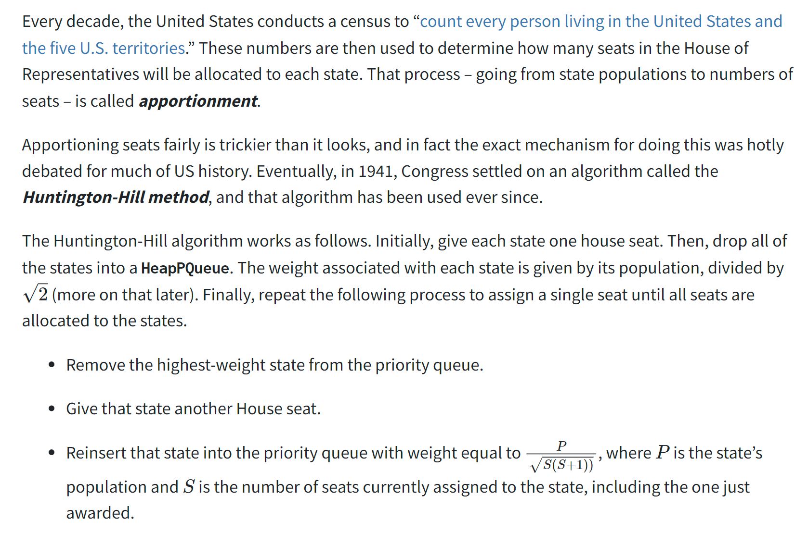
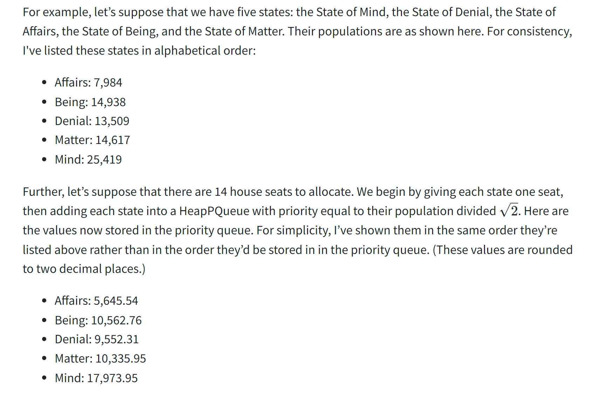
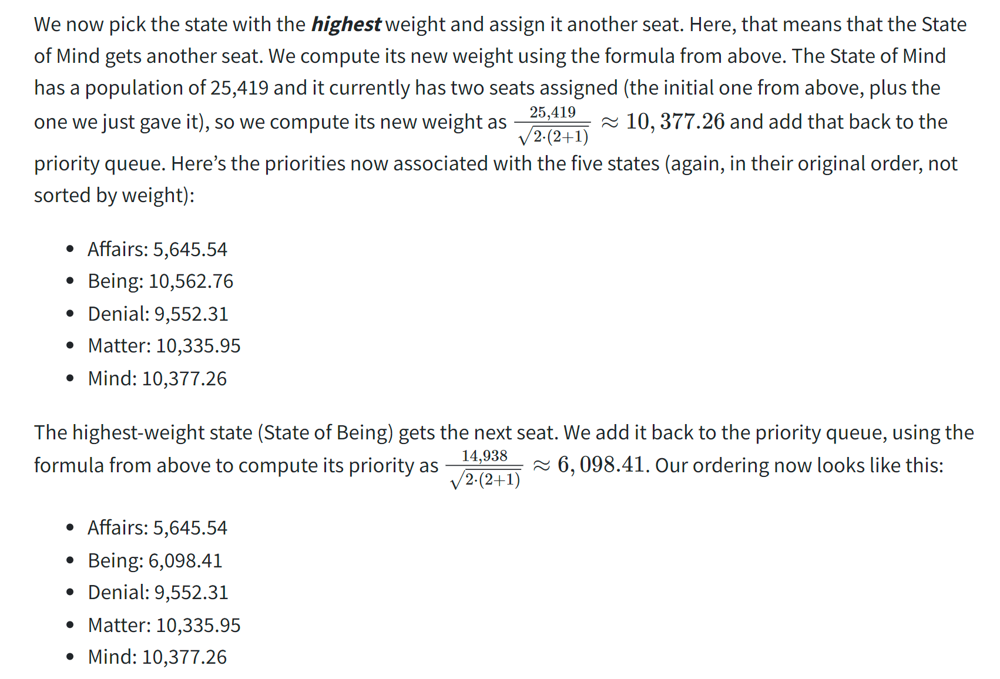
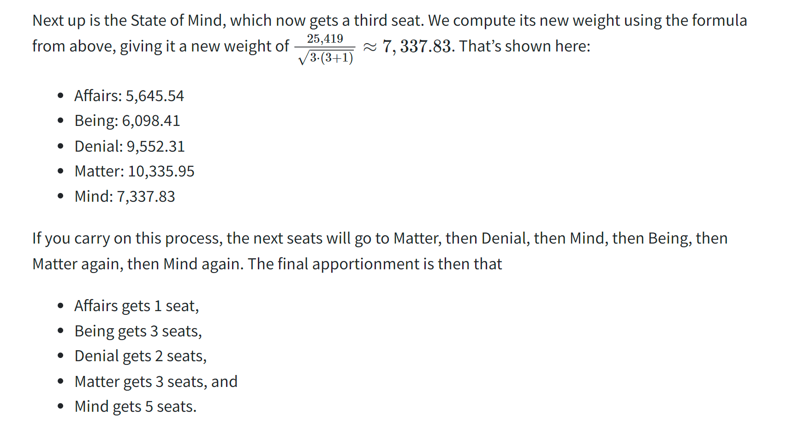

# PQ Full Implementations
## header file
> [!code]
> 
```c++
#pragma once

#include "Demos/DataPoint.h"
#include "Demos/Utility.h"
#include "GUI/SimpleTest.h"
#include <algorithm>

/**
 * Priority queue type implemented using a binary heap. Refer back to the assignment handout
 * for details about how binary heaps work.
 *
 * As a reminder, you are required to do all your own memory management using new[] and
 * delete[].
 */
class HeapPQueue {
public:
    /**
     * Creates a new, empty priority queue.
     */
    HeapPQueue();

    /**
     * Cleans up all memory allocated by this priorty queue. Remember, you're responsible
     * for managing your own memory!
     */
    ~HeapPQueue();

    /**
     * Adds a new data point into the queue. This operation runs in time O(log n),
     * where n is the number of elements in the queue.
     *
     * @param data The data point to add.
     */
    void enqueue(const DataPoint& data);

    /**
     * Removes and returns the lowest-weight data point in the priority queue. If multiple
     * elements are tied for having the loweset weight, any one of them may be returned.
     *
     * If the priority queue is empty, this function calls error() to report an error.
     *
     * This operation must run in time O(log n), where n is the number of elements in the
     * queue.
     *
     * @return The lowest-weight data point in the queue.
     */
    DataPoint dequeue();

    /**
     * Returns, but does not remove, the element that would next be removed via a call to
     * dequeue.
     *
     * If the priority queue is empty, this function calls error() to report an error.
     *
     * This operation must run in time O(1).
     *
     * @return
     */
    DataPoint peek() const;

    /**
     * Returns whether the priority queue is empty.
     *
     * This operation must run in time O(1).
     *
     * @return Whether the priority queue is empty.
     */
    bool isEmpty() const;

    /**
     * Returns the number of data points in this priority queue.
     *
     * This operation must run in time O(1).
     *
     * @return The number of elements in the priority queue.
     */
    int  size() const;

    /* This function exists purely for testing purposes. You can have it do whatever you'd
     * like and we won't be invoking it when grading. In the past, students have had this
     * function print out the array representing the heap, or information about how much
     * space is allocated, etc. Feel free to use it as you see fit!
     */
    void printDebugInfo();

private:
    /* Pointer to the array of elements. Our tests expect your implementation to use the
     * name 'elems' for the pointer to the array of elements, so please do not rename this
     * variable.
     */
    DataPoint* elems = nullptr;

    /* Logical size of the priority queue (the number of elements stored in the heap).
     * Our tests expect that this variable exists, so please do not rename this variable.
     */
    int logicalSize = 0;

    /* Allocated size of the priority queue (the number of slots used in the heap).
     * Our tests expect that this variable exists, so please do not rename this variable.
     */
    int allocatedSize = 0;

    /* Constant controlling how big the original array should be.
     *
     * We've picked this value because it's large enough to hold
     * a small number of elements for when you're just getting
     * started, but small enough that it's easy to test resizing
     * behavior. You shouldn't edit this value.
     */
    static const int INITIAL_SIZE = 6;

    void resize(int newSize);

    void swim(int currentIndex);
    void sink(int currentIndex);


    bool isFull() const;

    int getParentIndex(int currentIndex) const;
    int getRightChildIndex(int currentIndex) const;
    int getLeftChildIndex(int currentIndex) const;


    /* By default, C++ will let you copy objects. The problem is that the default copy
     * just does an element-by-element copy, which with pointers will give invalid results.
     * This macro disables copying of this type. For more details about how this works, and
     * for more information about how to override the default behavior, take CS106L!
     */
    DISALLOW_COPYING_OF(HeapPQueue);

    /* Grants STUDENT_TEST and PROVIDED_TEST access to the private section of this class.
     * This allows tests to check private fields to make sure they have the right values
     * and to test specific helper functions.
     */
    ALLOW_TEST_ACCESS();
};
```


## src file
> [!code]
```c++
#include "HeapPQueue.h"
using namespace std;

HeapPQueue::HeapPQueue() {
    elems = new DataPoint[INITIAL_SIZE];
    allocatedSize = INITIAL_SIZE;
    logicalSize = 0;
}

HeapPQueue::~HeapPQueue() {
    delete[] elems;
    allocatedSize = logicalSize = 0;
}

int HeapPQueue::size() const {
    return logicalSize;
}

void HeapPQueue::resize(int newSize) {
    DataPoint* newElems = new DataPoint[newSize];
    for (int i = 0; i < logicalSize; i++) {
        newElems[i + 1] = elems[i + 1];
    }
    delete[] elems;
    elems = newElems;
    allocatedSize = newSize;
}

bool HeapPQueue::isEmpty() const {
    return logicalSize == 0;
}

bool HeapPQueue::isFull() const {
    return logicalSize == allocatedSize - 1;
}

int HeapPQueue::getLeftChildIndex(int currentIndex) const {
    if (currentIndex * 2 > logicalSize) {
        return -1;
    }
    return currentIndex * 2;
}

int HeapPQueue::getRightChildIndex(int currentIndex) const {
    if (currentIndex * 2 + 1 > logicalSize) {
        return -1;
    }
    return currentIndex * 2 + 1;
}

int HeapPQueue::getParentIndex(int currentIndex) const {
    return currentIndex / 2;
}


void HeapPQueue::swim(int currentIndex) {
    int parentIndex = getParentIndex(currentIndex);

    if (parentIndex == 0 || elems[parentIndex].weight <= elems[currentIndex].weight) {
        return;
    }

    swap(elems[currentIndex], elems[parentIndex]);

    swim(parentIndex);

}

void HeapPQueue::sink(int currentIndex) {
    int leftChildIndex = getLeftChildIndex(currentIndex);
    int rightChildIndex = getRightChildIndex(currentIndex);

    if (leftChildIndex == -1) {
        return;
    }

    if (rightChildIndex == -1) {
        // Only left child
        if (elems[leftChildIndex].weight < elems[currentIndex].weight) {
            swap(elems[leftChildIndex], elems[currentIndex]);
            sink(leftChildIndex);
        } else {
            return;
        }
    } else {
        // Has two children
        // 1. If there is at least one child that is smaller than its parent
        // swap with the smaller one
        if (elems[leftChildIndex].weight < elems[currentIndex].weight ||
            elems[rightChildIndex].weight < elems[currentIndex].weight) {
            if (elems[leftChildIndex].weight < elems[rightChildIndex].weight) {
                swap(elems[leftChildIndex], elems[currentIndex]);
                sink(leftChildIndex);
            } else {
                swap(elems[rightChildIndex], elems[currentIndex]);
                sink(rightChildIndex);
            }
        } else {
            // 2. If there is no valid swap operations available.
            return;
        }
    }
}

void HeapPQueue::enqueue(const DataPoint& data) {
    if (isFull()) {
        resize(allocatedSize * 2);
    }

    logicalSize += 1;
    elems[logicalSize] = data;
    swim(logicalSize);

}

DataPoint HeapPQueue::peek() const {
    if (!isEmpty()) {
        return elems[1];
    }

    error("The MinHeap is empty!");
}

DataPoint HeapPQueue::dequeue() {
    if (isEmpty()) {
        error("The MinHeap is empty!");
    }
    DataPoint res = elems[1];
    swap(elems[1], elems[logicalSize]);
    logicalSize -= 1;
    sink(1);
    return res;
}
```


# Application: Apportionment
## Huntington-Hill Method
> [!algo]
> 


> [!example]
> 


## Full Implementations
### header file
> [!code]
> 
```c++
#pragma once

#include "map.h"
#include <string>

/* Apportions numSeats House seats to the given collection of states using the
 * Huntington-Hill method. It's assumed that there are at least enough seats
 * for each of the states to get one seat; if that isn't the case, this function
 * reports an error(). The function then returns a Map whose keys are the states
 * and whose values are the number of seats allocated to that state.
 */
Map<std::string, int> apportion(const Map<std::string, int>& populations, int numSeats);

```


## src file
> [!code]
```c++
#include "Apportionment.h"
#include "HeapPQueue.h"
#include "math.h"
using namespace std;

Map<string, int> apportion(const Map<string, int>& populations, int numSeats) {
    if (populations.size() > numSeats) {
        error("Invalid Input, more states than total number of seats.");
    }

    Map<string, int> numSeatsMapping;
    int seatsRemaining = numSeats;
    // 1. Assign 1 seat to each state initially
    for (string state: populations) {
        numSeatsMapping[state] = 1;
        seatsRemaining --;
    }

    // 2. Add population / sqrt{2} into a priority queue
    HeapPQueue pq;
    for (string city: populations) {
        pq.enqueue({city, - populations[city] / sqrt(2)});
    }

    // 3. Repeatedly allocating seats to states
    while (seatsRemaining > 0) {
        DataPoint popped = pq.dequeue();
        string city = popped.name;
        numSeatsMapping[city]++;
        seatsRemaining--;
        int numSeatsCity = numSeatsMapping[city];
        popped.weight = - populations[city] / sqrt(numSeatsCity * (numSeatsCity + 1));
        pq.enqueue(popped);
    }

    return numSeatsMapping;
}

```


