# RAII
## Principles
> [!concept]
> 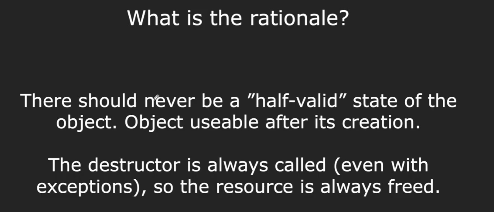

## RAII Compliant
> [!example] Stream
> 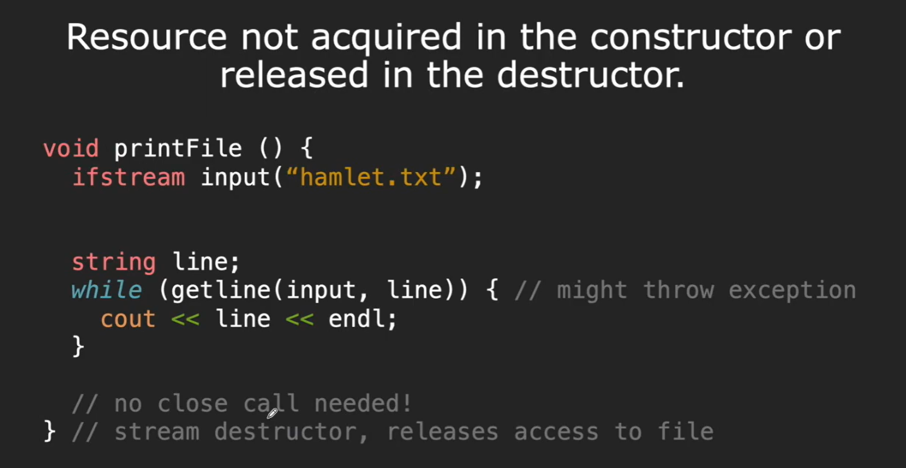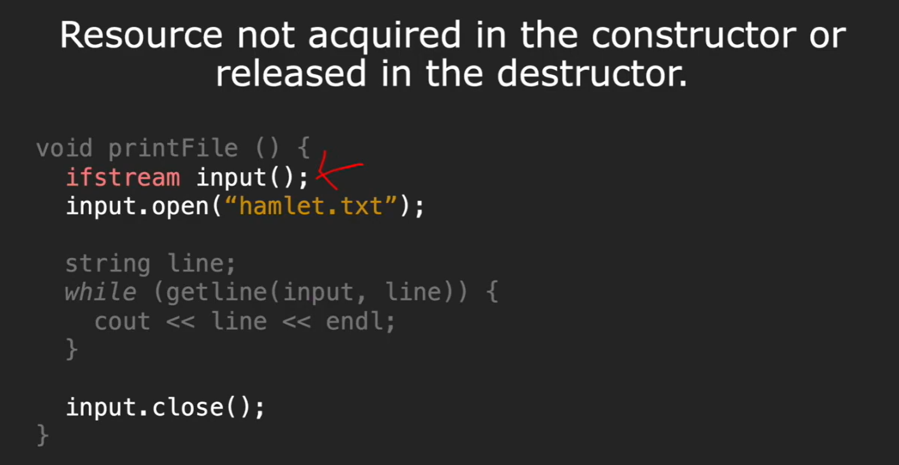
> The fact that stream is RAII compliant make sure once the stream is opened, even if the program throws exceptions in the middle, the stream will finally be closed. So from the user's perspective, we don't actually have to explicitly call `close()`.

# Smart Pointers
> [!overview]
> 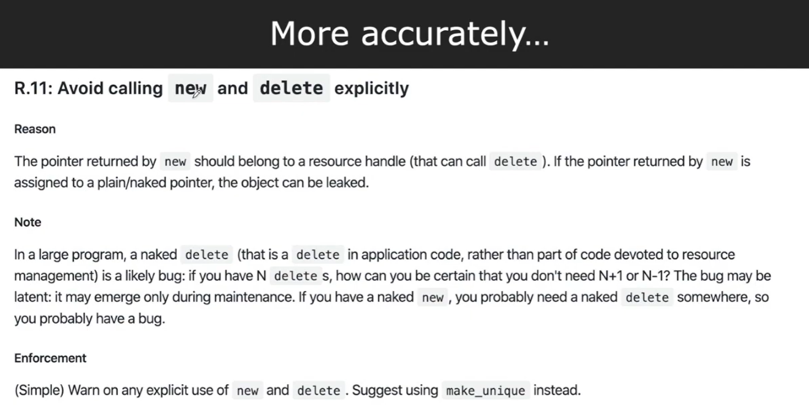
> Smart pointers are all RAII-compliant.

## std::unique_ptr
> [!concept]
> 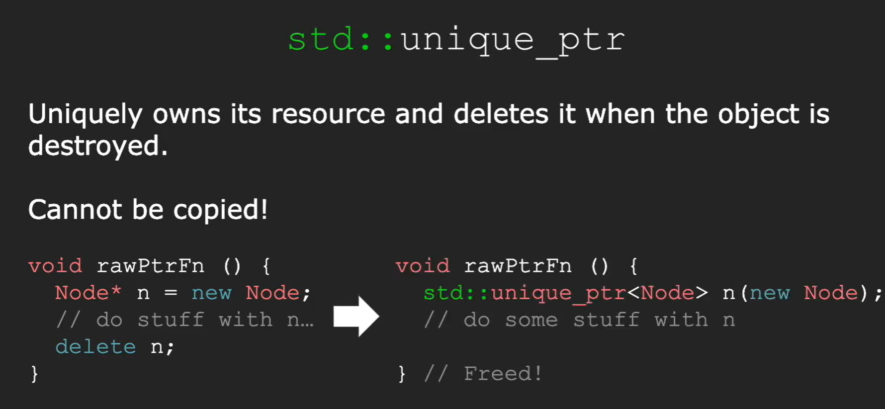
> If we are able to copy, it will cause double free problem:
> 
> 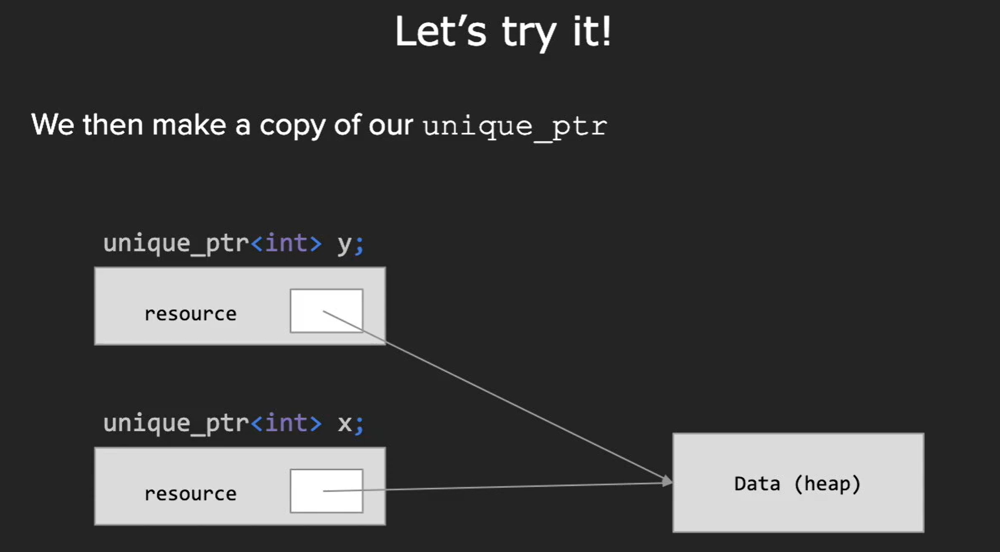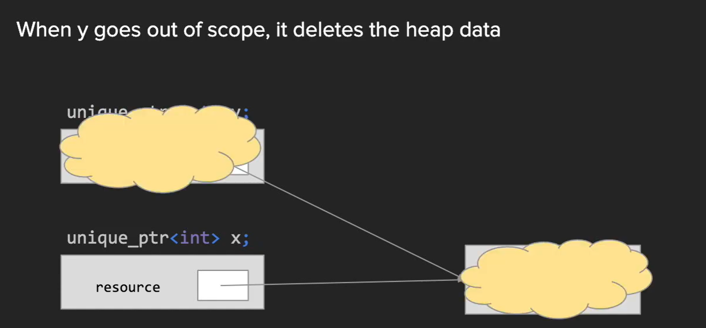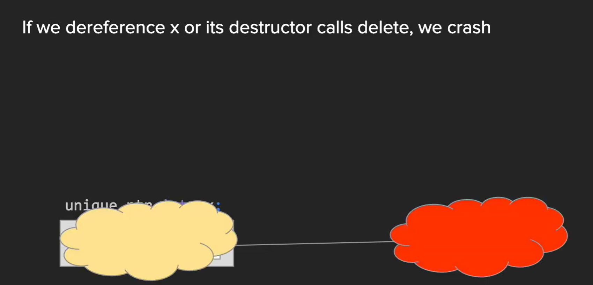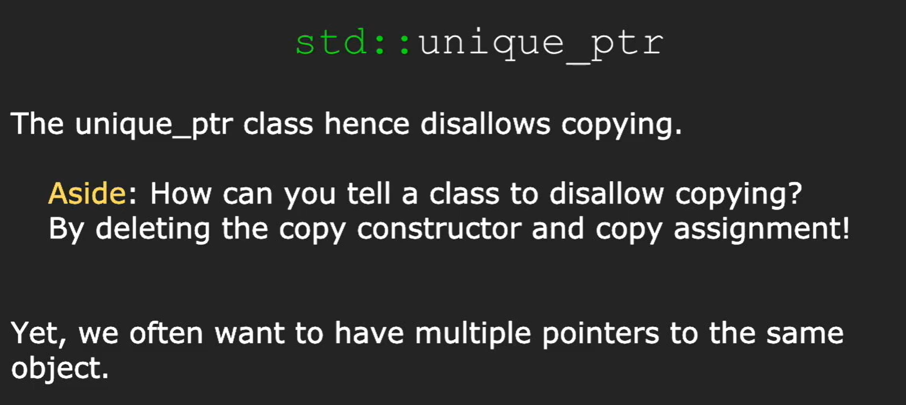

## std::shared_ptr
> [!concept]
> 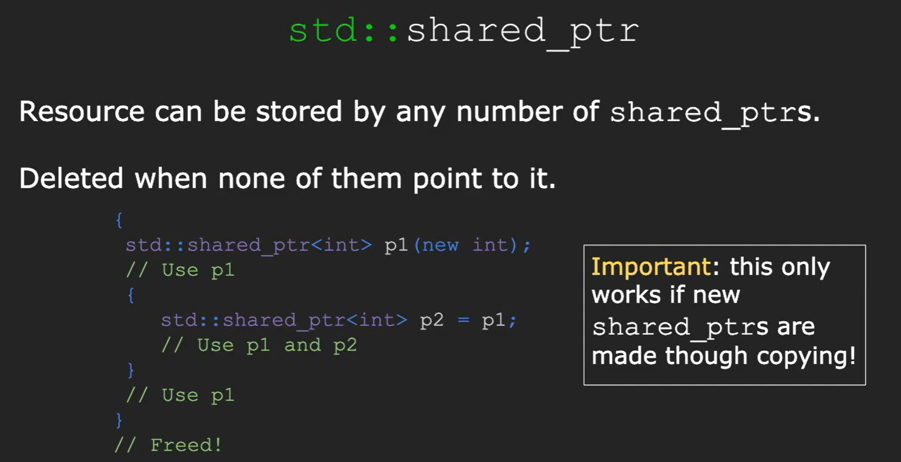
> When we do `p2 = p1`, we call copy constructor of `std::shared_ptr<int>`.
> 
> The implementation details revolves around `reference counting`:
> 
> 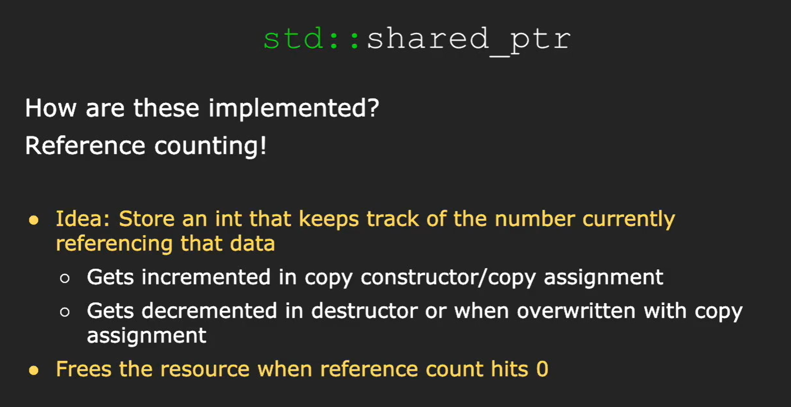

## std::weak_ptr
> [!concept]
> 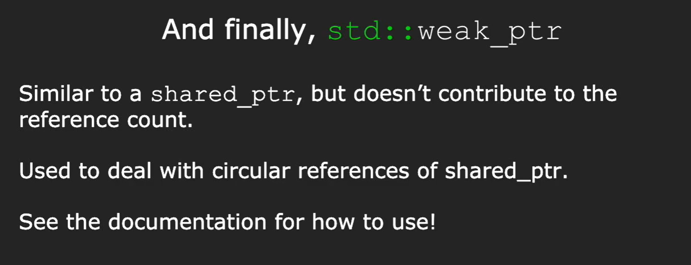

