# Number Multiplications
## Cost Model
> 1. **Unit Model: **每一步基本运算作为一步，比如两个数的加减乘除模运算等。
> 2. **Bit Model: **每一位的加减运算作为一步。

## Multiplication Numbers
> 假设我们现在有两个数$x,y$, 现在我们需要计算$x\cdot y$的值。
> 不妨令$x=13=(1101)_2$, $y=11=(1011)_{2}$。

### Algorithm 1: Shifting Bits
> 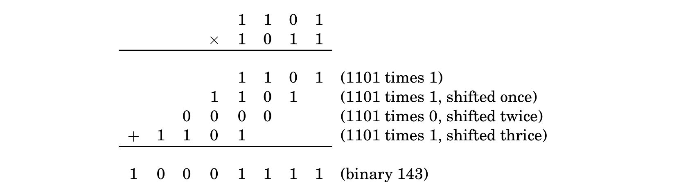
> `Correctness`: 假设我们要相乘的两个数为$x,y$, 我们在$y$上进行分析。
> 1.  Base Case: $y$是`One-bit Number`。如果$y=0$, 则$x\cdot y=0$, 如果$y=1$, 则$x\cdot 1=x$正确。
> 2. Inductive Case: 假设$y$是一个`K-bit Number`, 并假设$y=(b_kb_{k-1,\cdots}b_0)_{2}$, 此时$y=b_0+2b_1+\cdots 2^kb_k$。
> 
此时$x\cdot y=x(b_0+2b_1+\cdots 2^kb_k)=x\cdot b_0 +2x\cdot b_1+\cdots 2^kx\cdot b_k$。这正是图中描述的过程，$2^kx$表示将$x$向左`Shift k bits`（右边填充零）。
> `Efficiency`: 如果$x$和$y$都是`n-bit number`，那说明上图中总共会有$n$行。每两行之间相加所需要花费的时间是$O(n)$(如果每个`bit`相加作为`Unit Cost`的话)，而我们总共有$n$行，于是花费的总时间是:
> 
> 也就是$O(n^2)$(Quadratic in the size of the inputs)。

### Algorithm 2: Successive Division
> 
> 整个过程实际上和`Algorithm 1`中的逻辑是一致的，设想一下，$11$在下面，$13$在上面。每次$11/2$的目的都是为了`Extract the right-most bit`, 那么当$11/2^2=2$的时候，因为偶数的`Right-most bit`是$0$, 所以参考`Algorithm 1`中的第三行，我们是不需要进行任何`Bitwise Addition`计算的，所以需要`Strike Out`不予考虑。
> 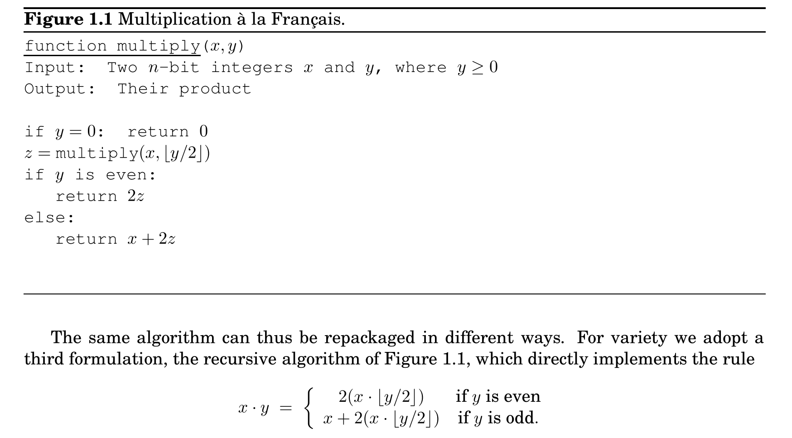
> `Correctness`: 这个`Recurrence`过程本来就是正确的，我们只需要检查$y=0$时(Base Case)是否正确即可，答案很显然是正确的。
> `Efficiency`: 
> 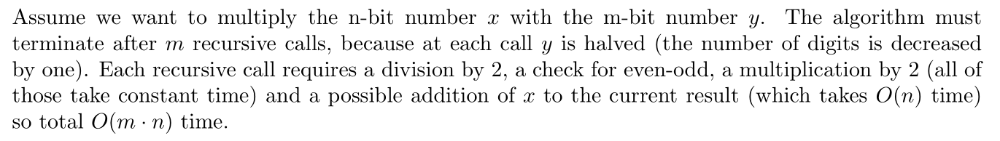
> 写成`Recurrence Relation`就是$T(m)=T(m-1)+O(n)$, 即$T(m)=O(m\cdot n)$
> 注意到这个算法当中: $x\cdot 25=x\cdot16+x\cdot 8+x\cdot 1  =x\cdot 2^4+x\cdot x^3+x\cdot 2^0$, 而$25=(11001)_2$
> 具体过程就是:
> $\begin{aligned}x\cdot 25&=x+2(x\cdot12)\\&=x+2(2(x\cdot 6))\\&=x+2(2(2(x\cdot 3)))\\&=x+2(2(2(x+2(x\cdot 1))))\\&=x\cdot 16+x\cdot 8+x\cdot 1\end{aligned}$

## Multiplication Properties
> **假设我们有两个数字，分别为**`**m-bit**`**和**`**n-bit**`**，则:**
> 1. 两个数字相乘之后得到的数字最多是$m+n$`bits`。
> 
这个结论根据`Algorithm 1`其实很显然，如果有`Carrying Bits`, 则总共有$m+n$`bits`。如果没有`Carrying Bits`, 则不足`m+n bits`。
> 2. 假设`Bitwise Multiplication`花费单位时间，则两个数字相乘之后所需要花费的时间是$O(m\times n)$

## Computing Factorials
### Number of Bits
> 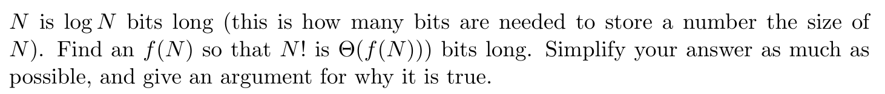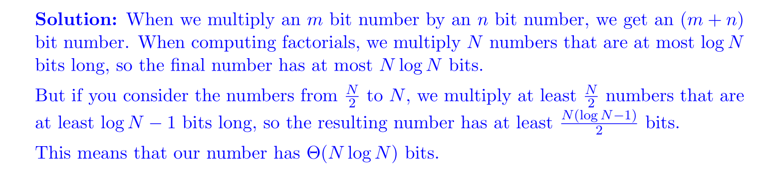
> 所以$1\times 2\times \cdots\times N$的结果是$\Theta(NlogN)$bits long.

### Naive Algorithm
> 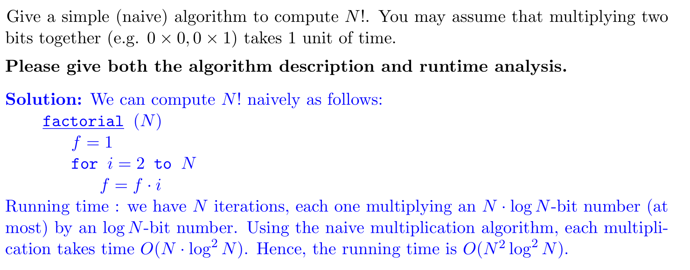

## Exponentiating Numbers
### Repeated Squaring for Numbers
> 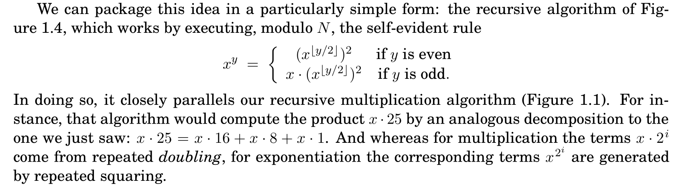
> 注意到这个算法当中: $x\cdot 25=x^{16}\cdot x^8\cdot x^1  =x^{2^4}\cdot x^{2^3}\cdot x^{2^0}$, 而$25=(11001)_2$
> 具体过程就是:
> $\begin{aligned}x\cdot 25&=x\cdot (x^{12})^2\\&=x\cdot((x^6)^2)^2\\&=x\cdot (((x^3)^2)^2)^2\\&=x\cdot (((x\cdot x^2)^2)^2)^2\\&=x^0\cdot x^{16}\cdot x^8\\&=x^{16}\cdot x^8\cdot x^1\end{aligned}$
> `Efficiency`: 
> 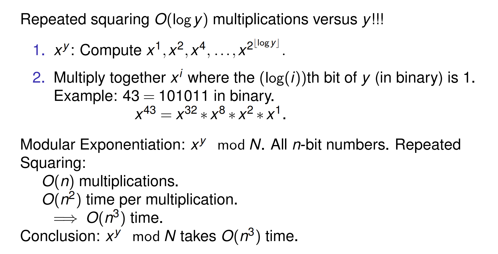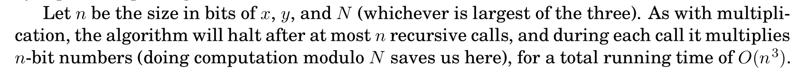

### Repeated Squaring for Matrices
> 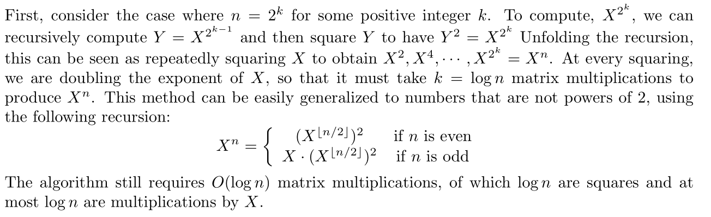

# Fibonacci Sequences
## Fibonacci Numbers' Properties
### Intuitive Analysis
> 我们定义`Fibonacci Number Sequence`为$F_0=0, F_1=1, F_n=F_{n-1}+F_{n-2}, n\geq 2$。
> 对于$F_n=F_{n-1}+F_{n-2}$来说，我们有下列不等关系成立:
> $F_n$is non-decreasing(strictly increasing)。也就是严格单调递增的。
> **下界:**
> $F_{n}=F_{n-1}+F_{n-2}\geq F_{n-2}+ F_{n-2}=2\cdot F_{n-2}\geq 4F_{n-4}\geq \cdots\geq 2^{\frac{n}{2}}F_1=2^{\frac{n}{2}}$
> **上界:**
>  $\begin{aligned}F_n=F_{n-1}+F_{n-2}&\leq F_{n-1}+F_{n-1}\\&=2\cdot F_{n-1}\leq 2\cdot (F_{n-2}+F_{n-3})\\&\leq 2\cdot 2\cdot F_{n-2}=4\cdot F_{n-2}\\&\leq 2^nF_1=2^n\end{aligned}$
> 于是$2^{\frac{n}{2}}\leq F_n\leq 2^{n}$。
> 这表明`Fibonacci Number`$F_n$随着$n$呈指数增长模式。同时表明$F_n$is linear in n bits, 也就是说$F_n$是`n-bit long`。
> 下面我们研究如何计算$F_n$，选取`Unit Model`(Floating Point Operations, 简称**Flops**)。

### Careful Analysis
> 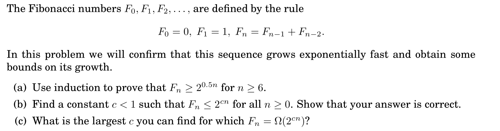

**Solution - Strong Induction****(a) 问较为简单，使用**`**Strong Induction**`**即可:**

1. ** Base Step: **$F_6\geq 2^3=8$成立。
2. **Inductive Step: 假设**$n\geq 6$**, **$F_n\geq 2^{0.5n}$**均成立 **$F_{n+1}=F_n+F_{n-1}\geq 2^{0.5n}+2^ {0.5(n-1)}=2^{0.5(n+1)}$**, 成立。**

**(b)-(c) 问:**
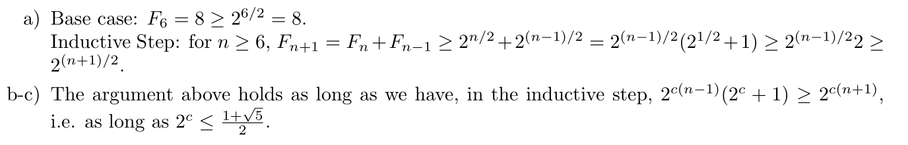

## Fibonacci Algorithms
### Algorithm 1: Recursive
> 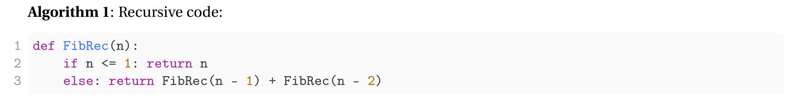
> 我们有下列的`Recurrence Relations`, $T(n)$表示计算$F_n$所需的**浮点运算数量**:
> $T(n)= \begin{cases}0 & n \leq 1 \\ T(n-1)+T(n-2)+1 & n>1\end{cases}$
> 根据`Fibonacci Number`的基本性质我们知道$2^{\frac{n}{2}}\leq T(n)\leq 2^{n}$。

### Algorithm 2: Iteration 
> 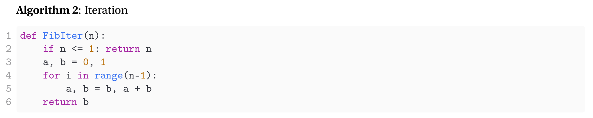
> `Flops Model`: 这里我们进行了$n-1$次循环，每次循环进行常数次浮点运算，所以总共需要$c\cdot (n-1)=\Theta(n)$浮点运算。
> `Bit Model/Runtime`: 每次循环我们进行两次`n-bit Addition`, 所以$O(2\times (n-1)\times n)=O(n^2)$

### Algorithm 3: Matrix Exponentials  
> 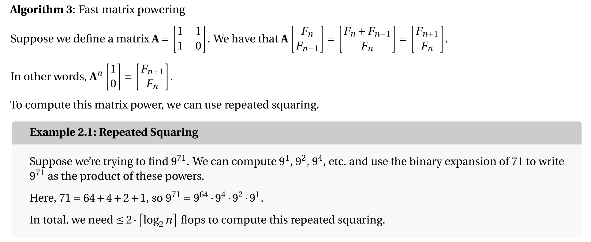

### Algorithm 4: Closed Form Solution
> 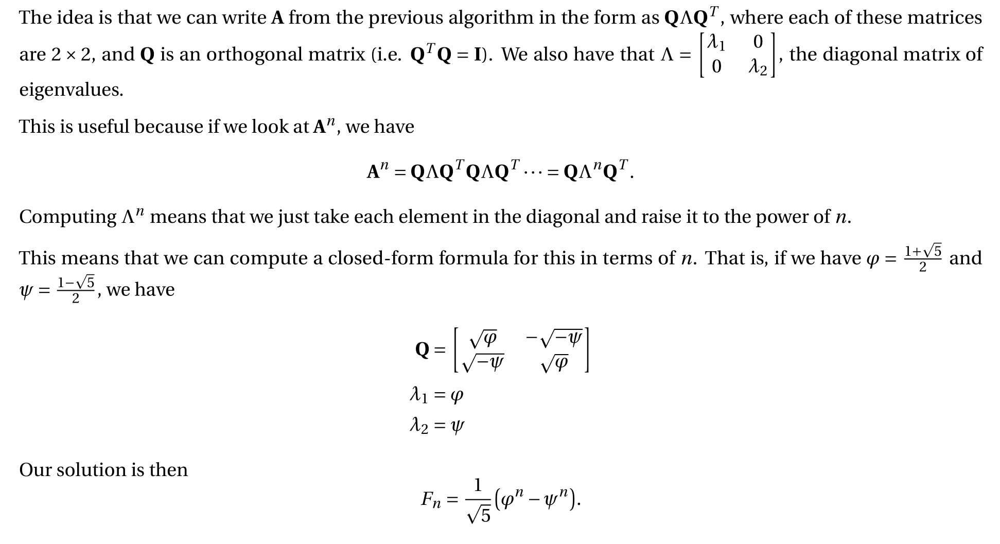

### Summary
> 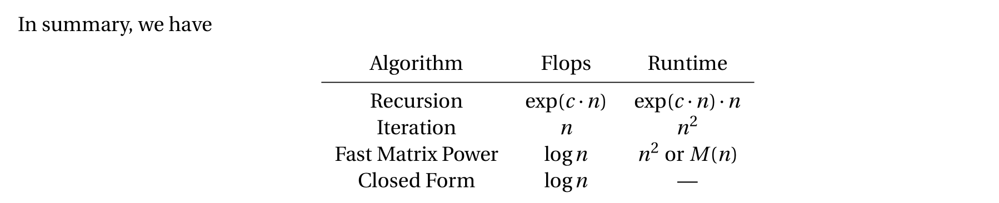

# Asymptotic Notations
## Basic Notations
> 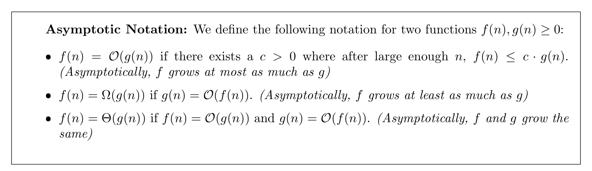
> **我们以**$O$**为例, 令**$f(n)=O(g(n))$**:**
> 1. `Quantifier Notations`: $\exists c,d>0, ~s.t.~~f(n)\leq c\cdot g(n)+d,\forall n\in \mathbb{N}$
> 2. `Inequality Notations`:$\exists c>0, ~s.t.~~\frac{f(n)}{g(n)}\leq c$
> 3. `Limit Notations`: $\lim_{n\to \infty}\frac{f(n)}{g(n)}=0$, 可以用来判断$O$关系是否成立。

## Common Properties
> 1. $\forall b\geq a,n^a=O(n^b)$, 因为$\lim_{n\to \infty}\frac{n^a}{n^b}=\lim_{n\to \infty}n^{a-b}=\lim_{n\to \infty}\frac{1}{n^{b-a}}=0$
> 
比如$f(n)=n^2-2n+3$, 此时$f(n)=\Theta(n^2)$
> 2. $\forall b<c$, $b^n = O(c^n)$, 因为$\lim_{n\to \infty}\frac{b^n}{c^n}=\lim_{n\to \infty}(\frac{b}{c})^n=0$
> 3. **Exponential Dominates Polynomials:**$\forall a>0,b>1,n^a=O(b^n)$, 因为$\lim_{n\to \infty}\frac{n^a}{b^n}=0$, 注意$b>1$, 否则$b^n\to 0$。
> 
比如$f(n)=n^{100}+1.01^n$, 此时$f(n)=\Theta(1.01^n)$。
> 比如$f(n)=n^{100}+0.99^n$, 此时$f(n)=\Theta(n^{100})$。
> 4. **Polynomials Dominates Logarithms: **$\forall a>0, b>0,log^b{n}=O(n^a)$, 因为$\lim_{n\to \infty}\frac{log^b{n}}{n^a}=\lim_{n\to \infty}\frac{(\frac{1}{n})^b}{an^{a-1}}=0$
> 
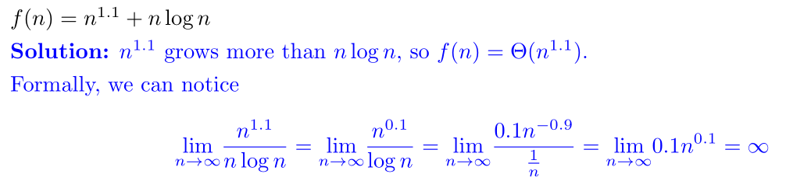
> 5. 对于$\lim_{n\to \infty}\frac{f(n)}{g(n)}$，如果$\lim_{n\to \infty}f(n)=\infty$, $\lim_{n\to \infty}g(n)=\infty$, 则我们可以使用洛必达法则，即$\lim_{n\to\infty} \frac{f(n)}{g(n)}=\lim_{n\to \infty}\frac{f'(n)}{g'(n)}$
> 
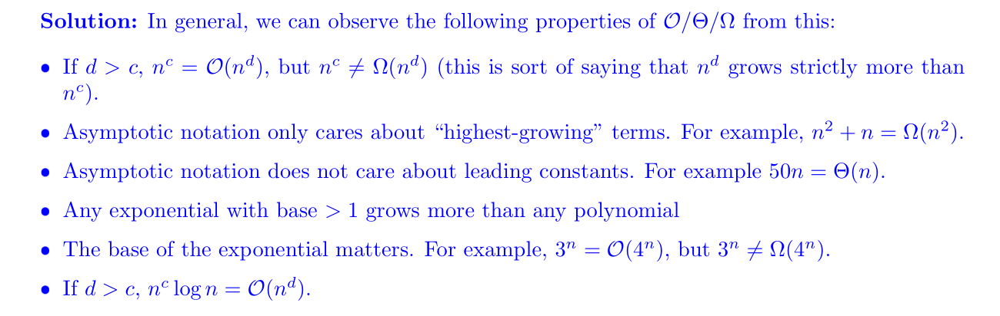

## Limit Rules
> 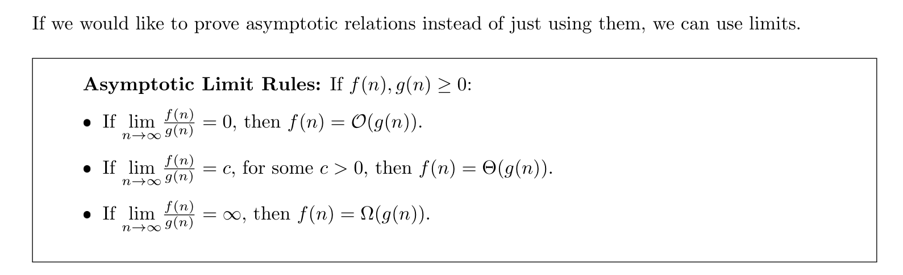
> **下面是几个例子:**
> 1. 证明$n^3=O(n^4)$
> 
我们只需证明$\lim_{n\to \infty}\frac{n^3}{n^4}=0$, 因为$\lim_{n\to \infty}\frac{1}{n}=0$, 所以上述极限存在且成立，证毕。
> 2. 寻找$f(n),g(n)\geq 0$使得$f(n)=O(g(n))$且$\lim_{n\to \infty}\frac{f(n)}{g(n)}\neq 0$
> 
令$f(n)=2n,g(n)=3n$, 此时因为$\exists c_1=\frac{1}{3}>0,c_2=1>0, s.t.$			$\frac{1}{3}\cdot g(n)\leq f(n)\leq 1\cdot g(n)$, 所以$f(n)=O(g(n))$, 但是$\lim_{n\to \infty}\frac{2n}{3n}=\frac{2}{3}\neq 0$
> 3. 证明对于任意$c>0$, 我们有$logn=O(n^c)$
> 
因为$\lim_{n\to \infty}\frac{logn}{n^c}=\lim_{n\to \infty}\frac{\frac{1}{n}}{cn^{c-1}}=\lim_{n\to \infty}\frac{1}{c}\cdot n^{-c}=0$，证毕。
> 4. 寻找$f(n),g(n)\geq 0$使得$f(n)=O(g(n))$且$\lim_{n\to \infty}\frac{f(n)}{g(n)}$不存在。
> 
极限在$n\to \infty$时不存在，我们可以联想到震荡的函数，也就是正弦函数,，为了保证$f(n)\geq 0$所以我们令$f(n)=n(sin(n)+1)$, $g(n)=n$, 此时$\exists c=2,~~s.t.~~f(n)\leq 2\cdot g(n)$, 所以$f(n)=O(g(n))$。而此时$\lim_{n\to \infty}\frac{f(n)}{g(n)}=\lim_{n\to \infty}\frac{n(sin(n)+1)}{n}=\lim_{n\to \infty}sin(n)+1$不存在。

## Complexity Comparison
> 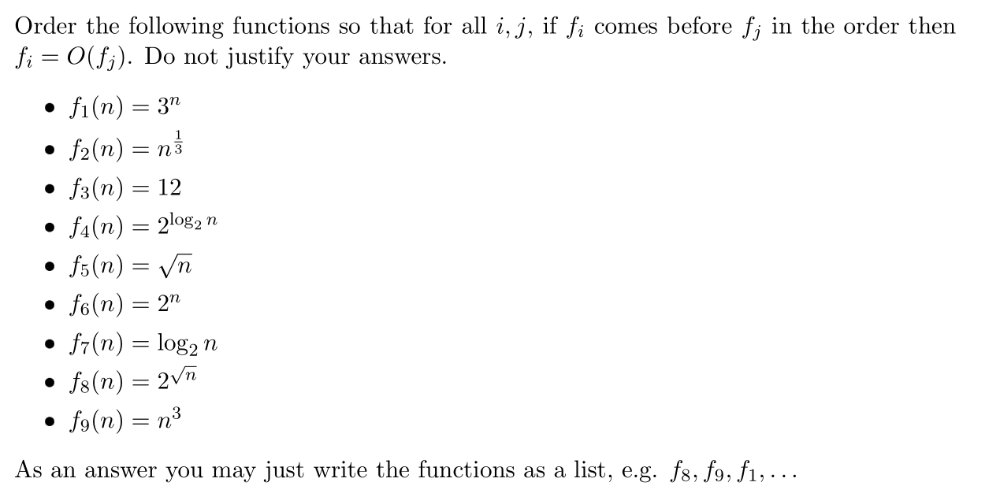
> $f_3<f_{7}<f_2<f_5<f_4<f_9<f_8<f_6<f_1$
> **总之记住，**`**Constant<Logarithmic<Polynomial<Exponential**`**:**
> - $f_3$是`Constant`
> - $f_7$是`Log`
> - $f_2,f_5,f_4,f_9$是`Polynomial`
> - $f_8,f_6,f_1$是`Exponential`
> 
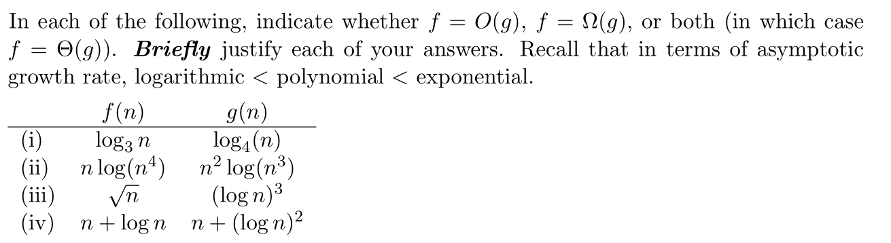
> $(i)$: 我们可以使用`Limit Rules`来判断。因为$log_3n=\frac{logn}{log3}$, $log_4n=\frac{logn}{log4}$, 所以$\lim_{n\to \infty}\frac{log_3n}{log_4n}=\lim_{n\to \infty}\frac{log4}{log3}=c$, 于是$f(n)=\Theta(g(n))$。
> $(ii)$: $\lim_{n\to \infty}\frac{nlog(n^4)}{n^2log(n^3)}=\lim_{n\to \infty}\frac{4logn}{3nlogn}=\lim_{n\to \infty}\frac{4}{3n}=0$, 于是$f(n)=O(g(n))$。
> 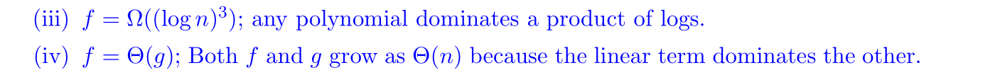

