# Number Multiplication
## Computing Complex Numbers
> 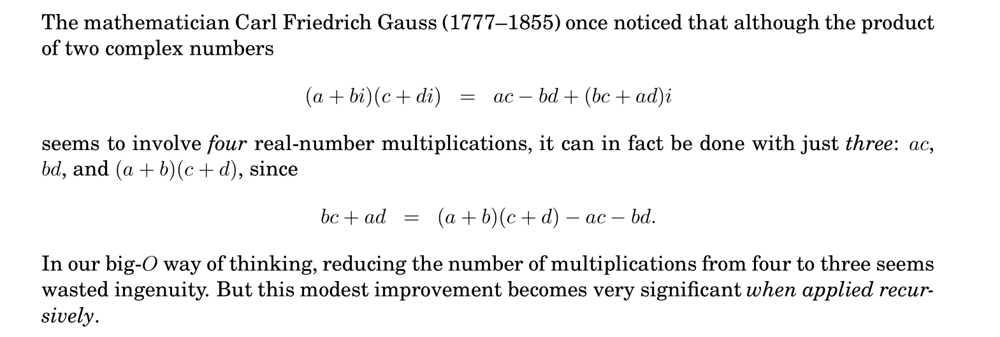


## Algorithm 1: Naive
### Algorithm
> 
> 直观的写法是: 
> $x y=\left(2^{n / 2} x_L+x_R\right)\left(2^{n / 2} y_L+y_R\right)=2^n x_L y_L+2^{n / 2}\left(x_L y_R+x_R y_L\right)+x_R y_R$


### Recurrence Relation
> 上述算法的递归关系满足:$T(n)=4 T(n / 2)+O(n)$, $O(n)$是每一次递归调用时对`n-bit numbers`的相加操作所花的时间 + 我们`Shift`$x_L$的时间，加起来是$O(n)$。
> **Solving Recurrence Relation:**
> 我们知道递归树的深度为$log_2n$, 每一层的节点数量为$4^{k}$($k=0,1,\cdots, log_2n$), 而每一个节点的
> 算法复杂度是$O(\frac{n}{2^k})$(长度为$\frac{n}{2^k}$bits的数字相加所需时间), 于是每一层的算法复杂度是$4^k\cdot O(\frac{n}{2^k})=2^k\cdot O(n)$。
> 而我们知道对于一个`Geometric Series`: $S=1+c+\cdots +c^n$来说，如果$c>1$(对应这里的$\frac{3}{2}$)，我们有$S\approx c^n$也就是相当于最后一项。
> 那么这里我们的算法复杂度就是$O(n)\cdot(1+2+\cdots +2^{log_2n})\approx2^{log_2n}\cdot O(n)=O(n^2)$


## Algorithm 2: Gauss Compact
### Algorithm
> $x y=\left(2^{n / 2} x_L+x_R\right)\left(2^{n / 2} y_L+y_R\right)=2^n x_L y_L+2^{n / 2}\left(x_L y_R+x_R y_L\right)+x_R y_R$
> 我们可以重组一下第二项$x_L y_R+x_R y_L=\left(x_L+x_R\right)\left(y_L+y_R\right)-x_L y_L-x_R y_R$
> 则我们可以令$P_1=x_Ly_L, P_2=x_Ry_R, P_3=(x_L+x_R)(y_L+y_R)$, 于是:
> $xy=2^n\times P_1+2^{\frac{n}{2}}\times (P_3-P_1-P_2)+P_2$
> 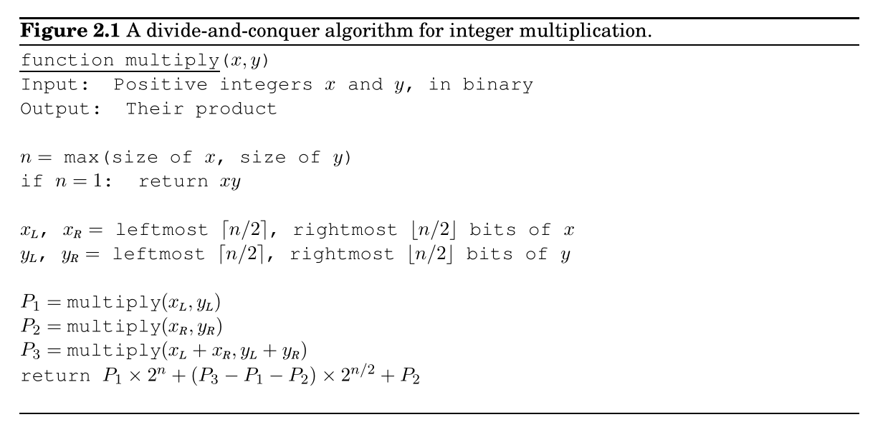


### Recurrence Relation
> 上述算法的递归关系满足:$T(n)=3 T(n / 2)+O(n)$
> 实际上`Recurrence Relation`满足:$T(n)\leq 3 T(n / 2+1)+O(n)$
> 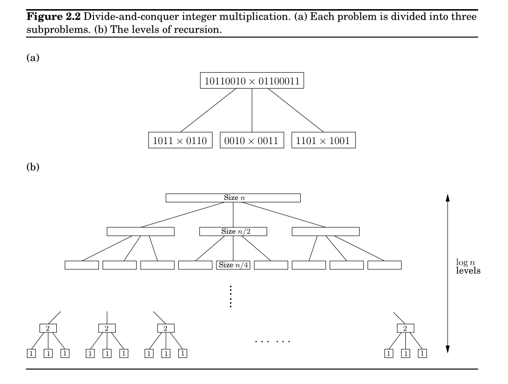
> 图中我们知道递归树的深度为$log_2n$, 每一层的节点数量为$3^{k}$($k=0,1,\cdots, log_2n$), 而每一个节点的
> 算法复杂度是$O(\frac{n}{2^k})$(长度为$\frac{n}{2^k}$bits的数字相加所需时间), 于是每一层的算法复杂度是$3^k\cdot O(\frac{n}{2^k})=(\frac{3}{2})^kO(n)$
> - 当$k=0$时，也就是根节点所在层，算法复杂度为$(\frac{3}{2})^0\cdot O(n)=O(n)$。
> - 当$k=log_2n$时，也就是叶子节点所在层，算法复杂度为$\begin{aligned}(\frac{3}{2})^{log_2n}\cdot O(n)&=\frac{3^{log_2n}}{2^{log_2n}}\cdot O(n)=\frac{3^{log_2n}}{n}\cdot O(n)\\&=O(3^{log_2n})=O(3^{\frac{log_3n}{log_32}})=O(3^{log_3n\times log_23})\\&=O((3^{log_3n})^{log_23})=O(n^{log_23})\\&\approx O(n^{1.59})\end{aligned}$
> - 上面用到两个关于$log$的重要性质: $log_ab=\frac{log_cb}{log_ca}$, $a^{bc}=(a^b)^c$。
> 
而我们知道对于一个`Geometric Series`: $S=1+c+\cdots +c^n$来说，如果$c>1$(对应这里的$\frac{3}{2}$)，我们有$S\approx c^n$也就是相当于最后一项。
> 那么这里我们的算法复杂度就是$O(n)\cdot(1+\frac{3}{2}+\cdots +(\frac{3}{2})^{log_2n})\approx (\frac{3}{2})^{log_2n}\cdot O(n)\approx O(n^{1.59})$


# Master's Theorem
## Helpful Lemmas
### Geometric Series - 0.2
> 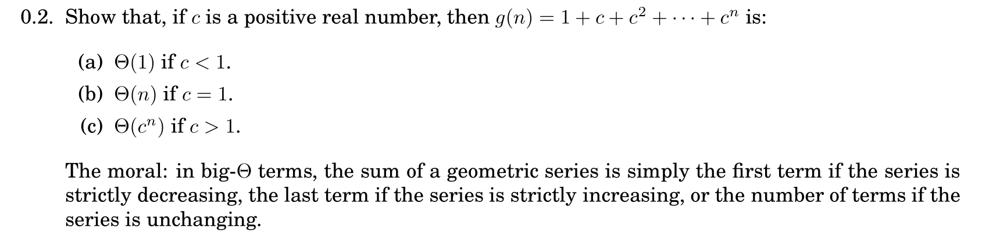

**Solution**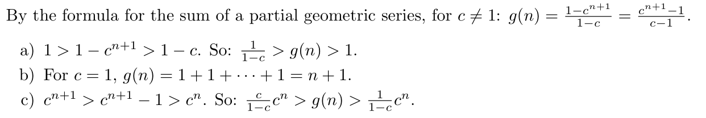


### Rounding Power - 2.2
> 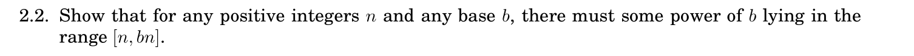

**Solution**我们要证明的是$\exists k\in \mathbb{R}$使得$b^k\in [n,bn]$, 可以取$k\in [log_bn, log_b(bn)]=[log_bn,log_bn+1]$


## Theorems
> 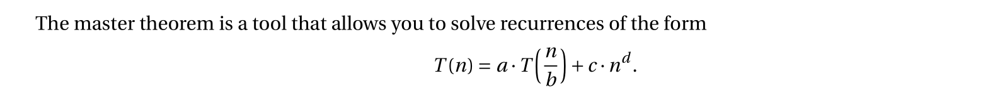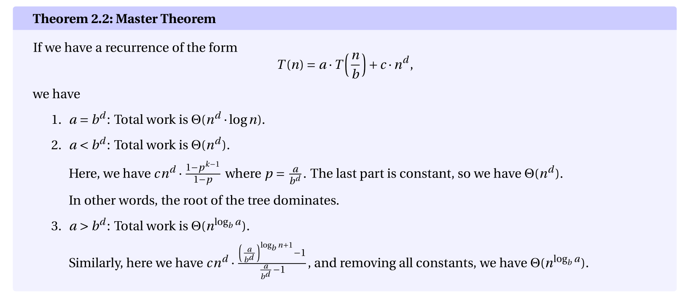
> **书上的定理:**
> 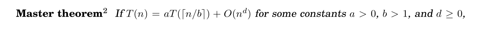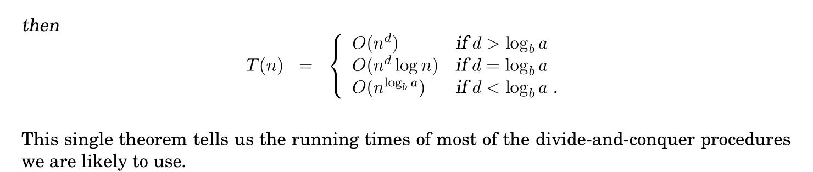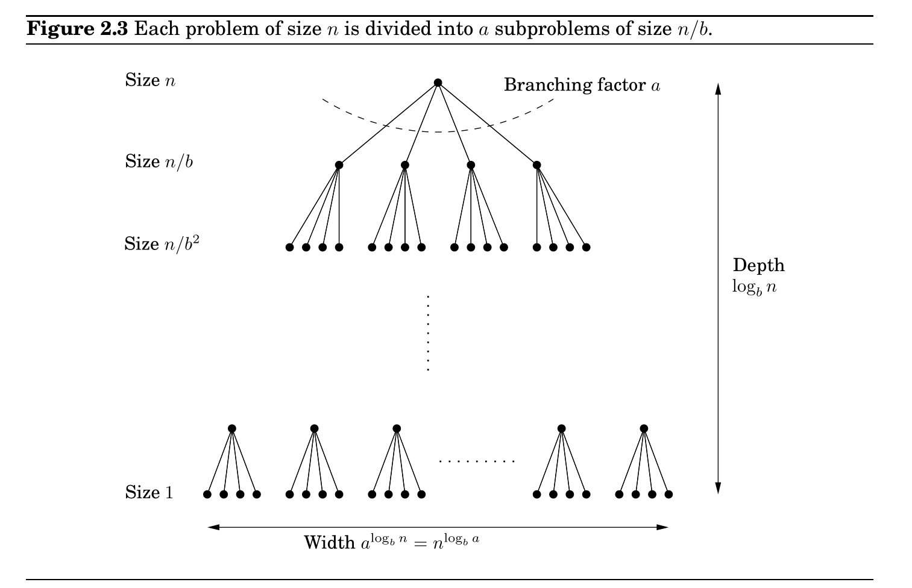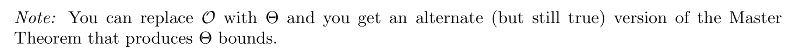

**Proof of the Theorem**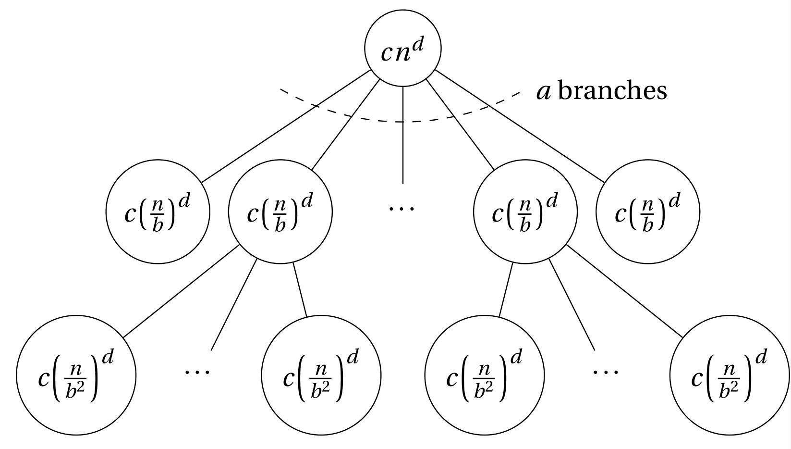
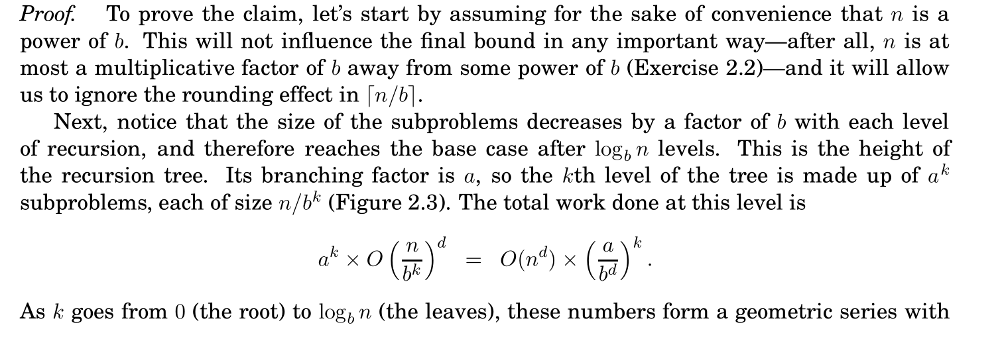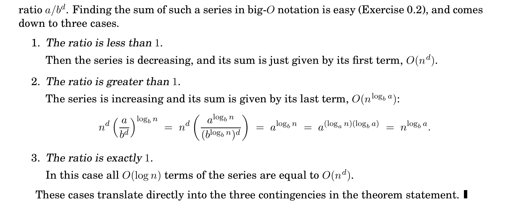
> 一个直观的解释:
> 1. $b$控制的是`Divide`的粒度，$b$越大`Subproblem`的规模越小，算法复杂度就越小。
> 2. $a$控制的是`Subproblems`的数量，$a$越大`Subproblems`的个数越大。
> 3. $log_ba<d$可以理解为$b$很大, $a$很小的情况，此时我们只需要考虑第一层的算法复杂度即可。$log_ba>d$可以理解为$b$很小, $a$很大的情况，此时`Subproblems`的复杂度更高，我们只需要考虑最后一层的算法复杂度即可。


## Solving Recurrence Relations
### Using Master's Theorem
> **下面我们对于三种情况分别举例:**
> 1. 对于$T(n)= T(\frac{n}{2})+O(n)$来说，我们使用主定理，此时$a=1,b=2,d=1$。因为$log_ba<d$, 所以$T(n)=O(n^1)=O(n)$。
> 2. 对于$T(n)=2\cdot T(\frac{n}{2})+O(n)$来说，我们使用主定理，此时$a=2,b=2,d=1$。因为$log_ba=d$, 所以$T(n)=O(n^1logn)=O(nlogn)$。
> 3. 对于$T(n)=3\cdot T(\frac{n}{2})+O(n)$来说，我们使用主定理，此时$a=3,b=2,d=1$。因为$log_ba>d$, 所以$T(n)=O(n^{log_ba})=O(n^{log_23})\approx O(n^{1.59})$。


### Using Expression Expansion
> 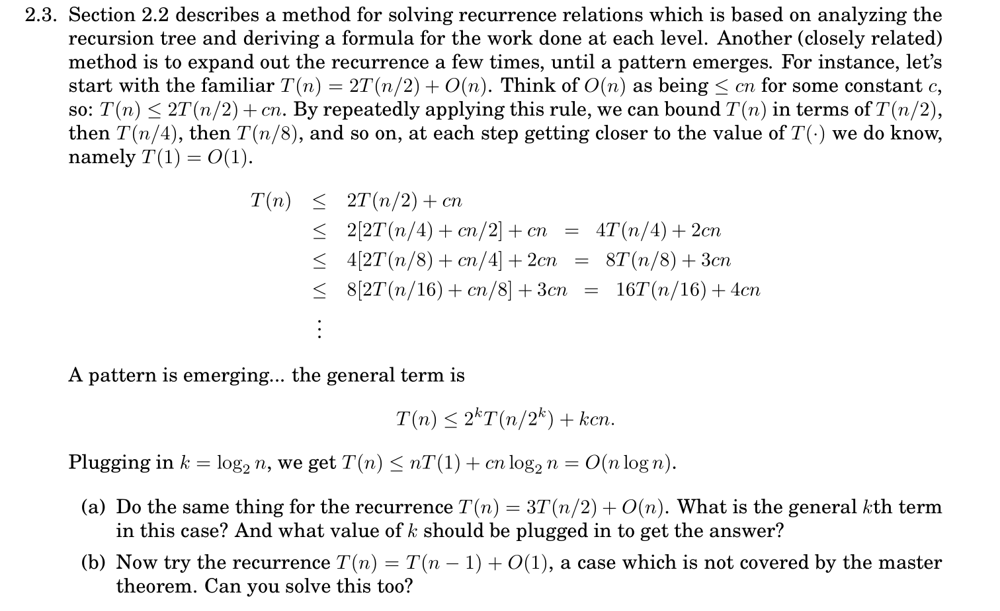
> 对于$(a)$问来说，我们仿照上面的步骤:
> $\begin{aligned} T(n)&\leq 3T(\frac{n}{2})+cn\\&\leq 3(3T(\frac{n}{4})+\frac{}{}c\frac{n}{2})+cn=9T(\frac{n}{4})+\frac{3}{2}cn+cn\\&\leq 9(3T(\frac{n}{8})+c\frac{n}{4})+\frac{3}{2}cn+cn =27\cdot T(\frac{n}{8})+\frac{9}{4}cn+\frac{3}{2}cn+cn\end{aligned}$
> 所以可以发现:
> $\begin{aligned}T(n)&\leq 3^kT(\frac{n}{2^k})+\sum_{i=0}^{k-1}(\frac{3}{2})^{i}\cdot cn\\&=3^{log_2n}T(1)+cn\cdot \frac{1-(\frac{3}{2})^k}{1-\frac{3}{2}}\\&=3^{log_2n}T(1)+2cn\cdot ((\frac{3}{2})^k-1) \end{aligned}$
> 当$k=log_2n$, $T(1)=d$，我们有:
> $\begin{aligned}T(n)&\leq d\cdot 3^{log_2n}+2cn\cdot(\frac{3^{log_2n}}{2^{log_2n}}-1)\\&=d\cdot n^{log_23}+2cn\cdot (\frac{n^{log_23}}{n}-1)\\&=(d+2c)\cdot n^{log_23}-2cn\\&=\Theta(n^{log_23})\end{aligned}$
> 因为$T(n)\leq (d+2c)\cdot n^{log_23}-2cn\leq (d+2c)\cdot n^{log_23}$, 于是$T(n)=O(n^{log_23})$.
> 对于$(b)$问来说, 我们无法使用主定理，但是我们仍然可以使用上述方法进行求解:
> $T(n)=T(n-1)+O(1)\leq T(n-1)+c\cdot 1\leq nc$, 于是$T(n)=O(n)$。


### Repeated Expansion
> 有些`Recurrence Relation`中我们无法使用主定理，需要使用`Repeated Expansion`的方法。
> 1. $T(n)=2T(\sqrt{n})+3$**且**`**Base case**`**的**$T(2)=3$**, 我们不能直接使用主定理，于是需要**`**Repeated Expansion**`**:**
> 
$\begin{aligned}T(n)&=2T(n^{\frac{1}{2}})+3\\&=2(2T(n^{\frac{1}{4}})+3)+3=4T(n^{\frac{1}{4}})+2\times 3+3\\&=4(2T(n^{\frac{1}{8}})+3)+2\times 3+3=2^3T(n^{\frac{1}{2^3}})+(2^2+2+1)\times 3\end{aligned}$
> 于是我们发现$T(n)=2^kT(n^{\frac{1}{2^k}})+\sum_{i=0}^{k-1}2^{i}\times 3$
> 因为`Base Case`是$T(2)=3$, 我们要求$\frac{1}{2^k}=3$, 于是$2^k=log_2n$即$k=log_2(log_2n)$, 所以
> $T(n)=\sum_{i=0}^{log_2(log_2n)}2^i\times 3=3\times O(2^{log_2(log_2n)})=O(log_2n)$(使用`Helpful Lemma`中的几何级数的性质，即对于$g(c)=1+c+c^2+\cdots+c^n$来说，如果$c>1$, 则$g(c)=\Theta(c^n)=O(c^n)$)。
> 2. $T(n)=2T(\frac{n}{2})+nlogn$**，我们同样不能直接使用主定理，我们仍然使用**`**Repeated Expansion**`**:**
> 
$\begin{aligned}T(n)&=2(2T(\frac{n}{4})+\frac{n}{2}log\frac{n}c{2})+nlogn\\&=2^2T(\frac{n}{4})+2\times \frac{n}{2}log\frac{n}{2}+nlogn\\&=\cdots\\&=2^kT(\frac{n}{2^k})+\sum_{i=0}^{k-1}2^i\times(\frac{n}{2^i}log\frac{n}{2^i})\\&=\sum_{i=0}^{k}2^i\times(\frac{n}{2^i}log\frac{n}{2^i})\end{aligned}$
> 我们要令$2^k=n$, 即$k=log_2n$, 所以$T(n)=\sum_{i=0}^{log_2n}2^i\times(\frac{n}{2^i}log\frac{n}{2^i})$
> $\begin{aligned} T(n)&=\sum_{i=0}^{log_2n}2^i\times(\frac{n}{2^i}log\frac{n}{2^i})\\&=\sum_{i=0}^{log_2n}n(log_2n-log_22^i)\\&=\sum_{i=0}^{log_2n}nlog_2n-ni\\&=n\sum_{i=0}^{log_2n}log_2n-i\\&=nlog_2^2n-n\sum_{i=1}^{log_2n}i\\&=nlog_2^2n-n\times \frac{(1+log_2n)log_2n}{2}\\&=\Theta(nlog_2^2n)\end{aligned}$


# Merge Sort
## Number of Inversions
> 对于一个列表$a$, 其中的元素是$a_1,a_2,\cdots, a_n$来说，`**Inversion**`**被定义为**: $i<j, a[i]>a[j]$。
> 对于$[5,1,3,2,4]$这个列表来说，我们的`Inversion`有$5-1,5-3,5-2,5-4,3-2$这五个。


## Sorting Algorithm
### Recursive Implementation
> 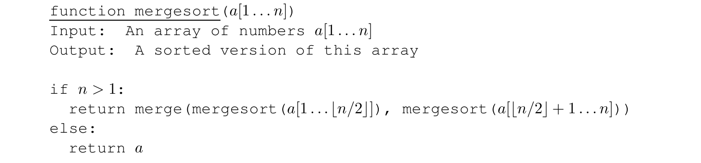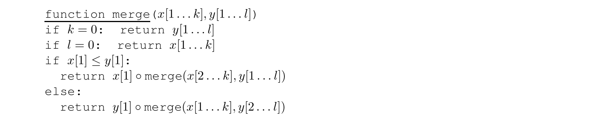

```java
public List<Comparable> mergeSortRecursive(List<Comparable> array) {
    if (array.size() == 1) {
        return array;
    }
    List<Comparable> LL = new ArrayList<>();
    List<Comparable> RL = new ArrayList<>();

    for (int i = 0; i < array.size() / 2; i++) {
        LL.add(array.get(i));
    }

    for (int i = array.size() / 2; i < array.size(); i++) {
        RL.add(array.get(i));
    }

    return merge(mergeSortRecursive(LL), mergeSortRecursive(RL));
}
```
```java
/**
 * Helper function for recursive merging
 * @return
 */
public List<Comparable> merge(List<Comparable> LL, List<Comparable> RL) {
    List<Comparable> returnList = new ArrayList<>();
    while (LL.size() > 0 && RL.size() > 0) {
        if (LL.get(0).compareTo(RL.get(0)) < 0) {
            returnList.add(LL.remove(0));
        } else {
            returnList.add(RL.remove(0));
        }
    }
    returnList.addAll(LL);
    returnList.addAll(RL);
    return returnList;
}
```
> 递归实现的归并排序算法复杂度满足$T(n)=2T(\frac{n}{2})+O(n)$, 使用主定理可得$T(n)=O(nlogn)$


### Iterative Implementation
> 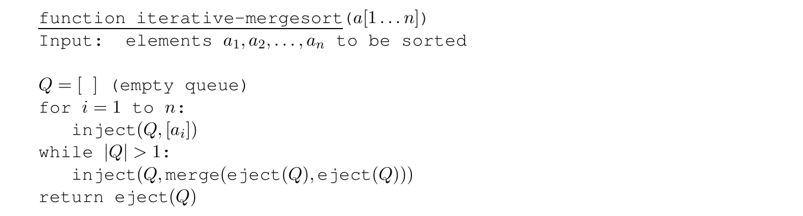

```java
public List<Comparable> mergeSortIterative(List<Comparable> array) {
    Deque<Deque<Comparable>> sorted = new ArrayDeque<>();

    for (int i = 0; i < array.size(); i++) {
        Deque<Comparable> temp = new ArrayDeque<>();
        temp.addLast(array.get(i));
        sorted.addLast(temp);
    }

    while (sorted.size() > 1) {
        Deque<Comparable> L1 = sorted.pollFirst();
        Deque<Comparable> L2 = sorted.pollLast();
        sorted.addLast(merge(L1, L2));
    }

    List<Comparable> result = new ArrayList<>();
    result.addAll(sorted.pollFirst());
    return result;
}
```
> **迭代实现的归并排序算法复杂度我们可以进行如下分析:**
> - 首先我们两两合并大小为一的数组，需要进行$\frac{n}{2}$次合并(先从队列中弹出两个元素，合并之后附加到队尾)， 每次合并的算法时间复杂度是$O(1+1)=O(2)$, 总共$O(\frac{n}{2}\cdot 2)=O(n)$。
> - 然后两两合并大小为二的数组，需要进行$\frac{n}{4}$次合并，算法时间复杂度是$O(\frac{n}{4}\cdot (2+2))=O(n)$。
> - 直到两两合并大小为$\frac{n}{2}$的数组，需要进行$1$次合并，算法时间复杂度为$O(n)$。
> 
待合并的数组大小从$1,2,4\cdots \frac{n}{2}$总共$log_2n$次，所以总的算法复杂度是$O(nlogn)$。
> 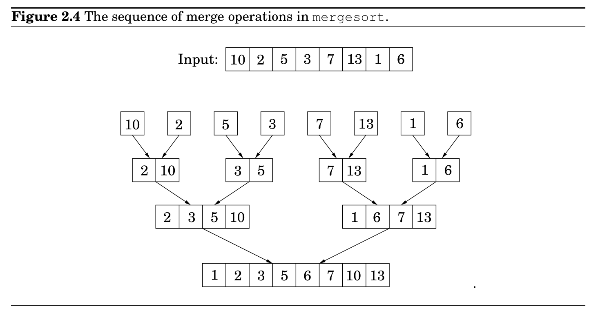
> 从上述过程可以看出，`Merge Sort`的过程也是消除`Number of Inversions`的过程。


### Main Codes
```java
 public static void main(String[] args) {
    MergeSort ms = new MergeSort();
    List<Comparable> ll = new ArrayList<>();
    int[] temp = new int[] {4,3,2,5,6,7,8,8,9,1,10};
    for (int i: temp) {
        ll.add(i);
    }
    List<Comparable> res = ms.mergeSortRecursive(ll);
    System.out.println(res);
}
```


## Analysis of MergeSort
> 下面是`MergeSort`的一种实现方式:
> 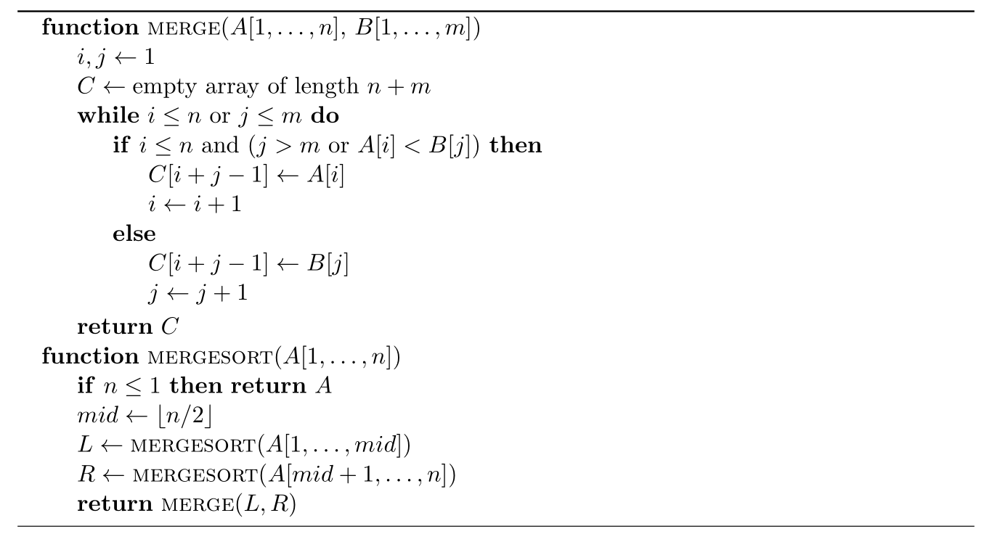


### Correctness of Merge
> `Merge`函数的接受两个排过序的子数组$A$和$B$(长度分别为$n$和$m$), 返回一个同样排过序的数组$C$。
> 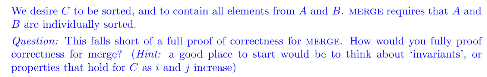
> **详细的证明:**
> **首先对于**`**Merge**`**函数来说, 存在**`**Loop Invariants**`**:**
> 1. $C[0:i+j-1]$是`Sorted`的
> 2. $C[0:i+j-1]$包含了$A[0:i]$和$B[0:j]$中的所有元素
> 
**那么当我们对**$C[i+j-1]$**赋值的时候:**
> 1. 如果$i\leq n$and $j>m$则说明$C[0:i+j-1]$已经包含了$B$中的所有元素，此时$C[i+j-1]=A[i]$。因为$A[i]\geq A[k],\forall k<i$, 且$C[0:i+j-1]$包含了所有$A[0:i]$中的元素，所以在我们令$C[i+j-1]=A[i]$的时候$C[0:i+j]$仍然是`Sorted`的。
> 2. 如果$i\leq n$and $A[i]<B[j]$, 此时$C[i+j-1]=A[i]$。因为$A[i]\geq A[k],\forall k<i$, 且$C[0:i+j-1]$包含了所有$A[0:i]$中的元素，所以在我们令$C[i+j-1]=A[i]$的时候$C[0:i+j]$仍然是`Sorted`的。
> 3. 如果$i>n$或者($j<m$和$A[i]\geq B[j]$)，则$C[i+j-1]=B[j]$。因为$B[i]\geq B[k],\forall k<i$, 且$C[0:i+j-1]$包含了所有$B[0:j]$中的元素，所以在我们令$C[i+j-1]=B[i]$的时候$C[0:i+j]$仍然是`Sorted`的。
> 
总之，`Merge`函数的`Loop Invariant`总是成立。


### Correctness of Mergesort
> 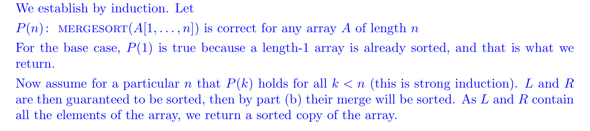


### Runtime Analysis
> 我们知道`Recurrence Relation`是$T(n)=2T(\frac{n}{2})+O(n)$, 根据主定理，$log_22=1$, 于是$T(n)=O(n^1logn)=O(nlogn)$


## Lower Bound for Comparison Sort
> 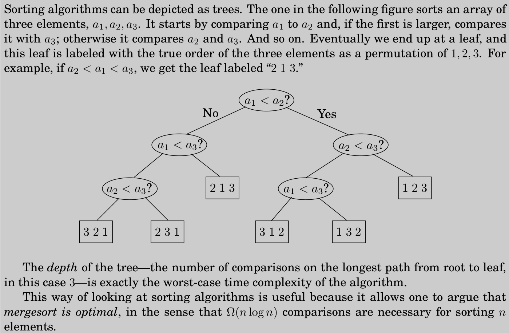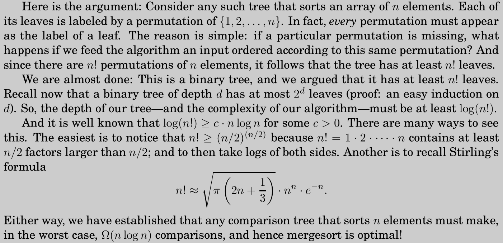


## Computing Number of Inversions
> 如果我们的算法不仅仅要求我们能够对一个列表进行排序，还要求其在排序的过程中能够计算出原列表的`Inversion`的总数，则我们可以考虑下列算法（算法由`Merge Sort`改编而来，本质是一致的）:
> 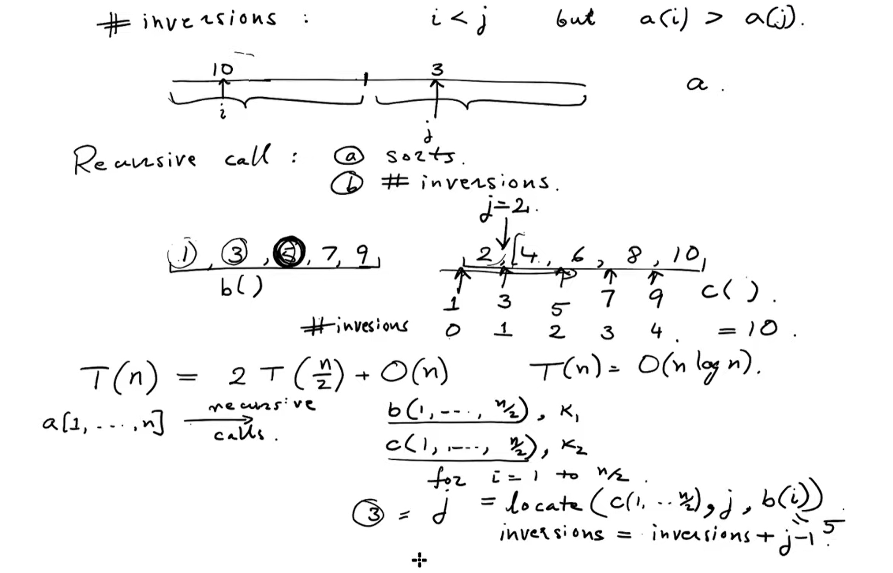
> 其中$locate(c(1,\cdots, \frac{n}{2}),j,b(i))$的含义是将$b$数组的$i$号索引插入到$c$数组的$j$索引位置中。
> 因为选择插入位置的过程其实就是一个消除`Inversions`的过程，所以如果$b(i)$被插入到了$c(1,\cdots, \frac{n}{2})$的第$j$号索引当中，这说明原本$b(i)$比$c$中的$j-1$个元素都要大，也就是有$j$个`Inversion`。


# Median Finding
## General Algorithm
> 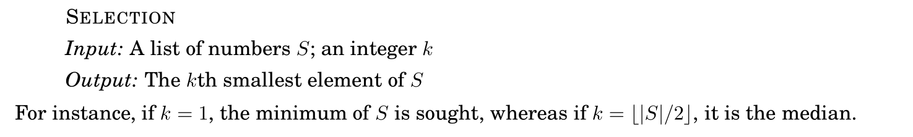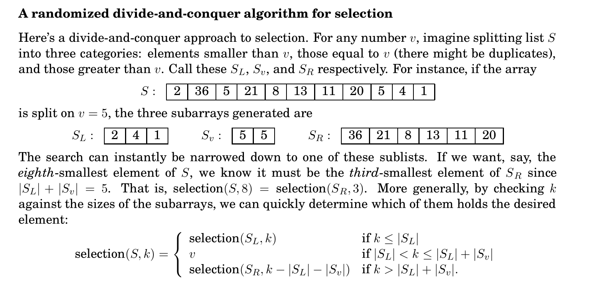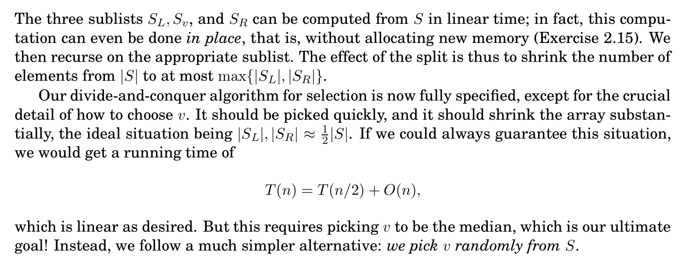
> 算法复杂度根据`Master's Theorem`可得: $T(n)=O(n^1)=O(n)$。


## Efficiency Analysis
> **上述算法中我们看到，我们的**`Pivot Element`**(也就是**$v$**)的选取会影响我们的**`Recurrence Equation`**: 
> 1. 如果我们的$v$将原来的大小为$n$的数组分割为$\frac{n}{4}$和$\frac{3n}{4}$的两个子数组的话，则我们的`Recurrence Relation`是: $T(n)\leq T(\frac{n}{\frac{4}{3}})+O(n)$, 我们通过主定理可得$T(n)=O(n)$。
> 2. 如果我们的$v$将原来的大小为$n$的数组分割为$\frac{n}{8}$和$\frac{7n}{8}$的两个子数组的话，则我们的`Recurrence Relation`是: $T(n)\leq T(\frac{n}{\frac{8}{7}})+O(n)$, 我们通过主定理可得$T(n)=O(n)$。
> 3. 如果我们的$v$将原来的大小为$n$的数组分割为两个大小为$\frac{n}{2}$的子数组的话，则我们的`Recurrence Relation`是: $T(n)\leq T(\frac{n}{2})+O(n)$, 我们通过主定理可得$T(n)=O(n)$。
> 4. 但是如果我们的$v$是每个数组中最大的元素，则`Recurrence Relation`变成$T(n)\leq T(n-1)+O(n)$, 此时我们有$T(n)\leq 1+2+\cdots+n=\Theta(n^2)$, 所以$T(n)=O(n^2)$。这是`Worst-Case Runtime`。
> 
所以我们可以看到，这个算法复杂度永远是$O(n)$，那么我们是否可以随机选取$v$呢? 反正算法复杂度基本都是$O(n)$。答案是肯定的。
> **现在假设**$T(n)$**是**`**Expected Time to find k-th smallest in n-elem array**`**, 此时我们可以这样思考: **
> 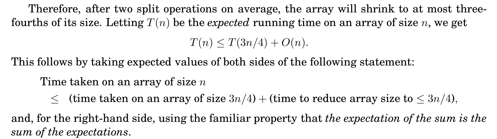
> 对于`Time to reduce array size to`$\frac{3n}{4}$**:
> 1. 我们假设其为事件$A$：我们选取的元素$v$将原来的大小为$n$的数组分割为$\frac{n}{4}$和$\frac{3n}{4}$的两个子数组。在概率的视角下我们假设$P(A)=p$。
> 2. 我们假设一个随机变量$X$表示选取到元素$v$(这个元素将大小为$n$的数组分割为长度为$\frac{n}{4}$和$\frac{3n}{4}$的两个子数组)所需要的时间，则$X$服从几何分布$Geo(p)$。我们知道$E[X]=\frac{1}{p}$, 于是$T(n) \leq T(\frac{3n}{4})+O(n)\cdot \frac{1}{p}$。
> 3. 如果我们称那些位于`25-percentile`和`75-percentile`之间的$v$是好的$v$，则我们知道事件$A$为: `Time to reduce array size to between`$\frac{1}{4}n$`and`$\frac{3}{4}n$，且$P(A)=\frac{1}{2}$, 此时:$T(n)\leq T(\frac{n}{2})+O(n)\cdot \frac{1}{\frac{1}{2}}=T(\frac{n}{2})+2\cdot O(n)$, 此时$T(n)=O(n)$仍然成立。
> 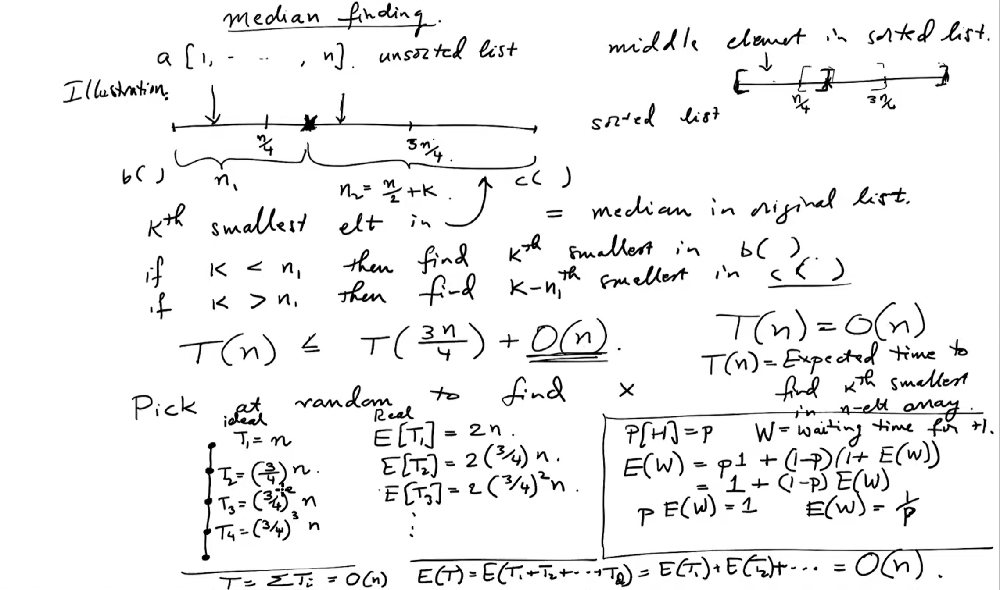


## Extra Memory Implementation
> **需要额外的**`**Memory Space**`**，算法逻辑如下: **

```java
public List<List<Integer>> selection(List<Integer> LL, int v) {
    List<Integer> smaller = new ArrayList<>();
    List<Integer> equal = new ArrayList<>();
    List<Integer> larger = new ArrayList<>();
    for (Integer i: LL) {
        if (i < v) {
            smaller.add(i);
        } else if (i == v) {
            equal.add(i);
        } else {
            larger.add(i);
        }
    }
    List<List<Integer>> result = new ArrayList<>();
    result.add(smaller);
    result.add(equal);
    result.add(larger);
    return result;
}
```

## Hoare Implementation
> 不需要额外的`Memeory Space`:
> 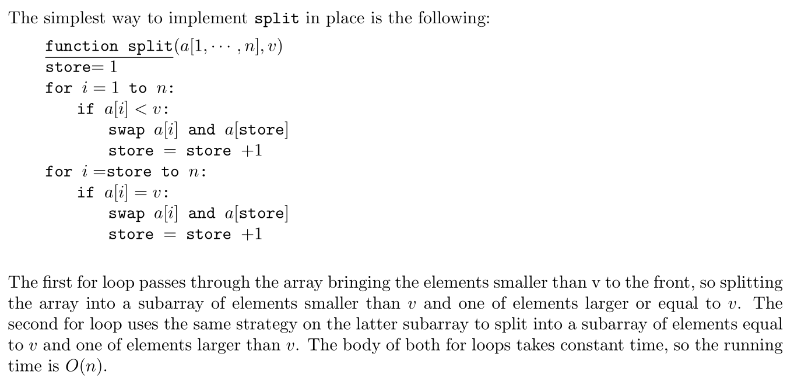

```java
public int[] selectionInPlace(int[] LL, int v) {
    int store = 0;

    // Rearrange the list to be elements that are smaller than v and larger than v
    for (int i = 0; i < LL.length; i++) {
        if (LL[i] < v) {
            LL[i] = LL[store];
            store++;
        }
    }

    // Rearrange the list to be elements that are equal to v and larger than v
    for (int i = store; i < LL.length; i++) {
        if (LL[i] == v) {
            LL[i] = LL[store];
            store++;
        }
    }
    return LL;
}
```


# Peak Finding
## 1D Peak Finding
> 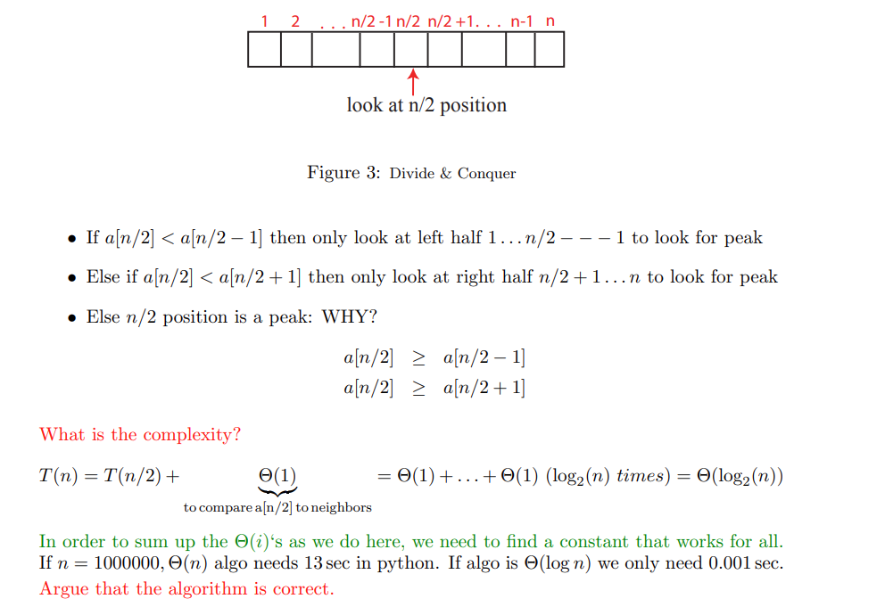
> [Auxiliary Videos](https://www.youtube.com/watch?v=cl2G0QpuO5g)
> **Lemma: There always exists a maximum element in our array and subarrays.**
> **Proof of Correctness: **
> - At every recursive step, we choose to move in the direction of a larger value.
> - We guarantee that the new array that we run our algorithm on has a peak.


## *2D Peak Finding
> 


# Matrix Multiplication
## Naive Implementation
> 假设我们有两个矩阵$X=\begin{bmatrix} A&B\\C&D\end{bmatrix}$, $Y=\begin{bmatrix} E&F\\G&H\end{bmatrix}$，则他们的乘积是:
> $XY=\begin{bmatrix} A&B\\C&D\end{bmatrix}\begin{bmatrix} E&F\\G&H\end{bmatrix}=\begin{bmatrix} AE+BG&AF+BH\\CE+DG&CF+DH\end{bmatrix}$
> 规定`Cost Model`是四则运算，则`Recurrence Relation`是: $T(n)=8T(n/2)+O(n^2)$, 使用主定理得到$T(n)=O(n^{log_28})=O(n^3)$, 算法复杂度很高。


## Strassen Implementation
> $X Y=\left[\begin{array}{cc}P_5+P_4-P_2+P_6 & P_1+P_2 \\P_3+P_4 & P_1+P_5-P_3-P_7\end{array}\right]$
> **其中我们有:**
> 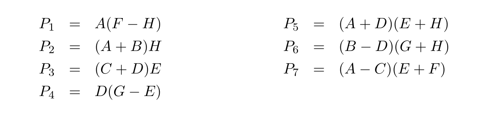
> 规定`Cost Model`是四则运算, 此时`Recurrence Relation`, 则$T(n)=7 T(n / 2)+O\left(n^2\right)$，使用主定理得到$O(n^{log_27})\approx O(n^{2.81})$，相比上面的实现方式来说算法复杂度较低。


# Polynomial Multiplication
## Definition of Polynomials
> 假设我们有$d+1$个不同的点$(x_0,y_0),(x_1,y_1),\cdots, (x_{d},y_{d})$, 则过这$d+1$个点可以唯一确定一个`Degree-d`的多项式，记为$A(x)=a_{d}x^d+a_{d-1}x^{d-1}+\cdots+a_1x+a_0$。
> **我们定义:**
> 1. $a_0,a_1,\cdots, a_{d}$为多项式$A(x)$的系数
> 2. $A(x_0),A(x_1),\cdots, A(x_d)$为多项式$A(x)$在$x_0,x_1,\cdots, x_d$这些点上`Evaluated`的值。


## Polynomials and Signals
> 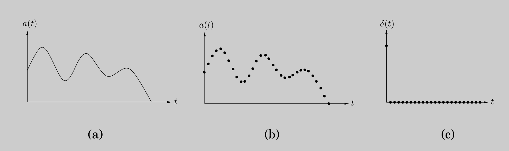
> 对于图$(a)$中的连续信号$a_c(t)$来说，我们将其离散化得到图$(b)$用$a[i]$表示，然后我们可以将$a_c(t)$表示为$a_c(t)=\sum_{i=0}^{T-1}a[t]\delta(t-i)$, 其中$T$表示的是我们总共划分了多少`Intervals`, **这对任意的连续信号都成立。**
> **举几个例子:**
> $a(1)=\sum_{i=0}^{T-1}a(i)\delta(1-i)$，$a(2)=\sum_{i=0}^{T-1}a(i)\delta(2-i)$，其中$\delta(t-i)$就是图$(c)$中的`Impulse Input`在`Shift i time steps`之后的图像，我们有$\delta(t-i)=\begin{cases}1&i=t\\0&otherwise \end{cases}$, 这表明$\sum_{i=0}^{T-1}a[t]\delta(t-i)$只会将$a[i]$中的第$t$个$a[t]$分段筛选出来，说明这是成立的。
> **有了上面的铺垫，我们可以换一种角度思考**`**Signal**`**:  **
> **因为**$a_c(t)=\sum_{i=0}^{n-1}a[t]\delta(t-i)$**, 我们令**$a[0]=a_0, a[1]=a_1,\cdots, a[n-1]=a_{n-1}$**, 此时我们有**$a_c(t)=a_0\delta(t)+a_1\delta(t-1)+\cdots+a_{n-1}\delta(t-n+1)$**, 令**$\delta(t-i)=t^i$**(表示**`**Delayed by i steps**`**，也可以表示**`**One Time Unit**`**), 则:**
> $a_c(t)=a_0+a_1t+a_2xt^2+\cdots+a_{n-1}t^{n-1}$
> **下面我们从**`**System**`**的视角来解释**`**Polynomial Multiplication**`**的意义, **假设系统的输入是$a$, 输出是$b$, 如下图所示:
> 
> **则输入**$a$**相当于在**$t=0$**处输入**$a_0$**, **$t=1$**处输入**$a_1$**, **$t=2$**处输入**$a_2$**, 依次类推。换句话说，输入信号**$a$**相当于是在不同时间步的一系列的**`**Impulses**`**:**
> 1. 在$t=0$处输入$1$, 则输出为$b_0+b_1x+\cdots+b_{n-1}x^{n-1}$(By Definition of Impulse Response)
> 2. 在$t=0$处输入$a_0$, 则输出为$a_0(b_0+b_1x+\cdots+b_{n-1}x^{n-1})$(By Linearity)
> 3. 在$t=1$处输入$a_1$, 这可以看成是`Shift the input by 1 time step`，所以输出也需要`Shift by 1 time step`, 也就是乘上一个$x$, 所以输出是 $a_1x(b_0+b_1x+\cdots+b_{n-1}x^{n-1})$(By Linearity and Time Invariance)
> 4. 依此类推, 我们得到完整的输出是$(a_0+a_1x+\cdots+a_{n-1}x^{n-1})(b_0+b_1x+\cdots+b_{n-1}x^{n-1})=a(x)b(x)$。
> 
**我们举个例子:**
> - 假设在$t=0$时输入为$1$, 且输出为$3+5x+2x^2$, 则我们可以将其表示为信号，即$a_0=3, a_1=5, a_2=2$。
> - 再假设在$t=1$时输入为$2$, 则输出为$2x(3+5x+2x^2)=6x+10x^2+4x^4$, 这说明$a_0=6, a_1=0,a_3=10,a_4=0,a_5=4$。
> 
**总结一下：**
> 假设我们知道了一个系统的`Impulse Response`$b(x)$, 则如果此时系统的`Input`是$a(x)$, 则系统的`Output`为$a(x)b(x)$。


## Representations of Polynomials
> 1. `**Coefficient Representations**`**: **我们可以将多项式$A(x)=a_0+a_1x+\cdots+a_{n-1}x^{n-1}$写成一个向量$\begin{bmatrix} a_0\\a_1\\\vdots\\a_{n-1}\end{bmatrix}$。
> 2. `**Value Representation**`: 我们可以将多项式$A(x)=a_0+a_1x+\cdots+a_{n-1}x^{n-1}$写成若干个`Evaluation`的结果。对于$n-1$degree的多项式来说，我们可以用$A(x_0),\cdots, A(x_{n-1})$来表示这个多项式，写成向量就是$\begin{bmatrix} A(x_0)\\A(x_1)\\\vdots\\A(x_{n-1})\end{bmatrix}$。
> 3. **两种表示方式的转换**: $\begin{bmatrix} 1&x_0&x_0^2&\cdots&x_0^{n-1}\\ 1&x_1&x_1^2&\cdots&x_1^{n-1}\\\vdots\\ 1&x_{n-1}&x_{n-1}^2&\cdots&x_{n-1}^{n-1}\end{bmatrix}\begin{bmatrix} a_0\\a_1\\\vdots\\a_{n-1}\end{bmatrix}=\begin{bmatrix} A(x_0)\\A(x_1)\\\vdots\\A(x_{n-1})\end{bmatrix}$, 表示从`Coefficient Representation`到`Value Representation`的转换。这也就是`FFT`的基本逻辑。

### 

## Product of Polynomials
> **我们使用上述两种多项式的定义来表示多项式的乘积, 假设我们有**$A(x)$**和**$B(x)$**两个多项式，且其乘积为**$C(x)$**, 则:**
> 1. **如果我们使用**`**Coefficient Representation**`**来表示多项式**$C(x)$**: 则:**
> 
$\begin{aligned}C(x)&=(a_dx^d+a_{d-1}x^{d-1}+\cdots+a_1x+a_0)(b_dx^d+b_{d-1}x^{d-1}+\cdots+b_1x+b_0)\\&=c_d\sum_{i=0}^da_ib_{d-i}+c_{d-1}\sum_{i=0}^{d-1}a_ib_{d-1-i}+\cdots+c_1\sum_{i=0}^{1}a_ib_{1-i}+c_0\end{aligned}$ 
> 其中$c_k=\sum_{i=0}^ka_ib_{k-i}$
> 2. **我们使用**`**Value Representation**`**来表示多项式**$C(x)$**, 则: **
> 
计算$C(x_k)=A(x_k)B(x_k)$$\forall k=0,1,2,\cdots, 2d$
> 然后根据$(x_0,C(x_0)),(x_1,C(x_1)),(x_2,C(x_2))\cdots, (x_{2d},C(x_{2d}))$找回
> $C(x)$的系数$c_0,c_1,\cdots, c_{2d}$。
> 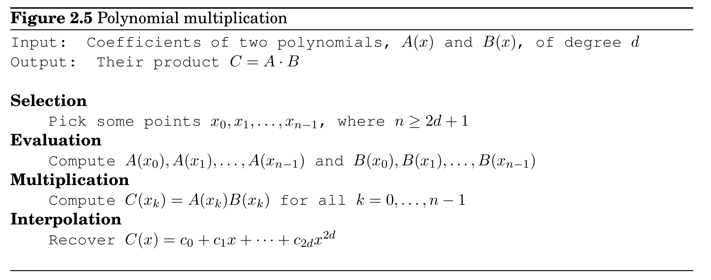


# Complex Roots
## How to Compute
> **对于**$z^n=1$**这个方程来说，我们有两种求解技巧:**
> 1. **代数法**: 令$z=re^{i\theta}$, $1=e^{2k\pi i}$, 则$z^n=1$可以化为$r^ne^{in\theta}=1\cdot e^{2k\pi i}$, 则 $r=1$, $\theta=\frac{2k\pi}{n}, k=0,1,\cdots, n-1$。于是$z=e^{i\frac{2k\pi}{n}}$。
> 2. **二叉树法**，对于这棵二叉树来说：
>    1. `Level-0`处为$1$,  即`1-th root of unity`。
>    2. `Level-1`处为$1$的平方根$\pm\sqrt{1}=\pm 1$, 即`2-th root of unity`, 即$z^2=1$。
>    3. `Level-2`处为$\pm1$的平方根$\pm\sqrt{1}=\pm 1$和$\pm \sqrt{-1}=\pm i$, 即`4-th root of unity`, 即$z^4=1$。
>    4. `Level-k`处为`2^k-th root of unity`, 即满足。


## Important Properties
> 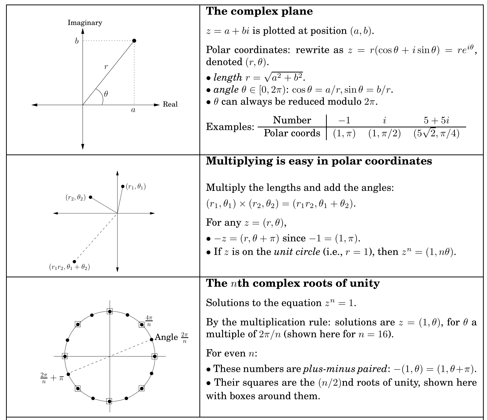
> **假设我们的**`**n-th root of unity**`**是**$1,w,w^2,\cdots, w^{n-1}$**, 其中**$w=e^{\frac{2\pi i}{n}}$**, 如果**$n$**是偶数: **
> 1. `n-th root of unity`是`Plus-minus Paired`。因为我们可以利用二叉树法，`n-th root of unity`相当于二叉树的`Level-log_2n`层，而`Level-`$log_2n$层就相当于$log_2(n-1)$层分叉后得到的结果，一定是`plus-minus paired`出现的。
> 
对于任意两个`Complex Number`$z_1=e^{i\theta_1},z_2=e^{i\theta_2}$来说，如果$z_1+z_2=0$则虚部为零，$sin(\theta_1)+sin(\theta_2)=0$, 即$sin(\theta_1)=-sin(\theta_2)=sin(-\theta_2)$(且$0\leq \theta_1,\theta_2\leq 2\pi$), 所以$\theta_1+(-\theta_2)=\pi$, 于是$\theta_1=\theta_2+\pi$。所以对于$w^j$来说，$w^{\frac{n}{2}+j}=-w^j$。
> 
> 2. `Squaring them produces the (n/2)nd roots of unity`, 这个很显然。
> 
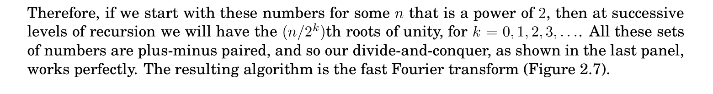
> **对于任意**$n$**, 我们有: **
> 1. 如果$1,w,\cdots, w^{n-1}$是$z^n=1$的根(`n-th root of unity`), 则$w^{-1}$也是`n-th root of unity`。原因是: $w^n=1$, 所以$\frac{1}{w^n}=1=(\frac{1}{w})^n=(w^{-1})^n$。
> 2. 对于$w^j$来说，其`Complex Conjugate`是$w^{-j}$。原因是: $w^j=e^{\frac{2j\pi}{n}i}$, 则$\overline{w^{j}}=\overline{e^{\frac{2j\pi}{n}i}}=e^{-\frac{2j\pi}{n}i}=w^{-j}$。
> 3. 对于任意`n-th root of unity`$w$, 我们有$\sum_{k=0}^{n-1}w^k=0$
> 
**证明: **$\sum_{k=0}^{n-1}w^k=\frac{1-w^n}{1-w}=\frac{0}{1-w}=0$**(因为**$w^n=1$**)**


## Exercises
> 1. **Find all **$w$**such that **$w^2=-1$**:**
> 
令$w=re^{i\theta}$, 令$-1=e^{(\pi+2k\pi) i}$, 所以$r^2e^{2i\theta}=e^{(2k+1)\pi i}$, 于是$r=1$, $\theta=(k+\frac{1}{2})\pi,k\in \mathbb{Z}$
> 2. **Find all **$w$**such that **$w^4=-1$**:**
> 
令$w=re^{i\theta}$, 令$-1=e^{(\pi+2k\pi) i}$, 所以$r^2e^{4i\theta}=e^{(2k+1)\pi i}$, 于是$r=1$, $\theta=(\frac{k}{2}+\frac{1}{4})\pi,k\in \mathbb{Z}$


# Evaluation of Polynomial
> 已知多项式$A(x)=c_dx^d+c_{d-1}x^{d-1}+\cdots+c_{1}x+c_0$和$x_0,x_1,\cdots, x_d$个点，则我们可以将点$x_i$带入多项式$A(x)$中，此时$A(x_0)$表示在$x_0$处多项式的值。
> 同时`Evaluation of Polynomial`的过程也和进制间的转换过程如出一辙，假设我们有一个数字在`Base b`下的表示为$(a_{n}a_{n-1}a_{n-2}\cdots a_0)_b$, 那么如果我们要转换为$10$进制的话就需要计算$a_0+a_1\times b+\cdots+a_{n-1}b^{n-1}+a_{n}\times b^n$, 相当于计算$A(b)$。


## Intuitive Evaluation
> 下面我们介绍两种常见的`Evaluation Method`:
> 1. 第一种是从`Least-Significant Bit`开始`Evaluate`
> 2. 第二种是从`Most-Significant Bit`开始`Evalaute`

### Algorithm I - From LSB
> 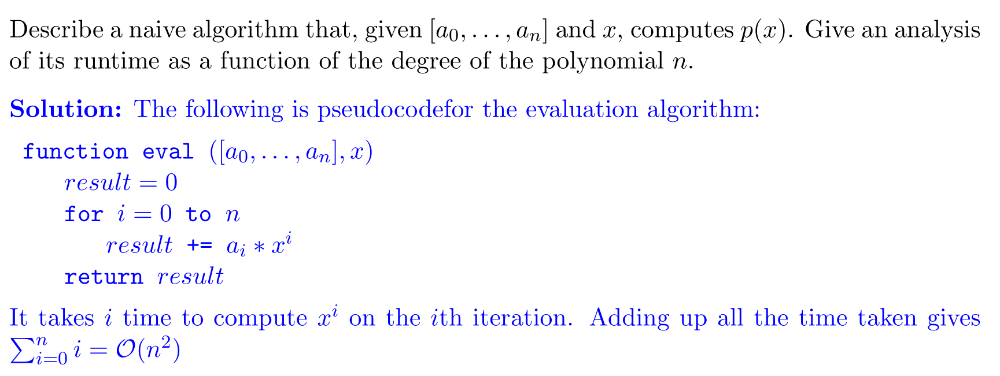

```java
/**
 * Evaluate the polynomial at w
 * @param w point
 * @param coeffs [a_0, a_1, ..., a_n]
 * @return
 */
public static int naiveEval(int w, int... coeffs) {
    int res = 0;
    for (int i = 0; i < coeffs.length; i++) {
        res += coeffs[i] * Math.pow(w, i);
    }
    return res;
}
```
```java
@staticmethod
def naiveEval(w, coeffs):
    res = 0
    for index, _ in enumerate(coeffs):
        res += coeffs[index] * (w ** index)
    return res
```

### Algorithm II - From MSB
#### Iterative Implementation - Loop Invariant
> 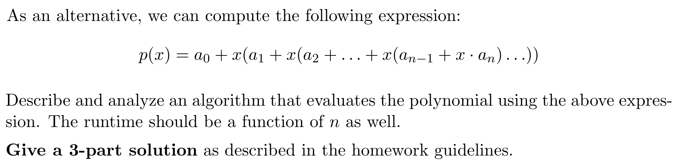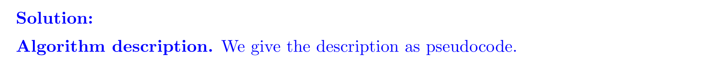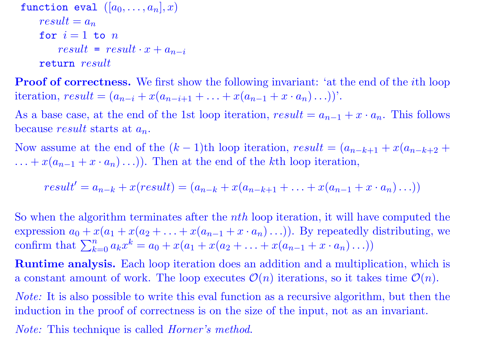

```java
/**
 * Evaluate the polynomial at w
 * @param w point
 * @param coeffs [a_n, a_{n-1}, ..., a_0]
 * @return
 */
public static int iterativeEval(int w, int... coeffs) {
    int res = 0;
    for (int i: coeffs) {
        res = res * w + i;
    }
    return res;
}
```
```java
@staticmethod
def iterativeEval(w, coeffs):
    res = 0
    for c in coeffs:
        res = res * w + c

    return res
```

#### Recursive Implementations
> **Algorithm Description: We give the following pseudocode.**
> function eval($[a_0, \cdots, a_n],x$):
> if n == 0:
> return $a_0$
> return $a_0$+ $x\times$eval($[a_1,\cdots, a_n],x$)
> **Proof of Correctness:**
> 1. **Base Case:** $len([a_0,\cdots, a_{n}])=1$时，结果就是$a_0$, 正确
> 2. **Inductive Step: **
> 
假设$len([a_0,\cdots, a_{n}])=k$时，eval($[a_{n-k+1},\cdots, a_n],x$)=$a_{n-k+1}+a_{n-k+2}x+\cdots+a_nx^n$成立。
>  则当$len([a_0,\cdots, a_{n}])=k+1$时:$\begin{aligned} eval([a_{n-k},\cdots, a_{n}],x)&=a_{n-k}+eval([a_{n-k+1},\cdots, a_n],x)\\&=a_{n-k}+x(a_{n-k+1}+a_{n-k+2}x+\cdots a_{n}x^n)\\&=a_{n-k}+a_{n-k+1}x+a_{n-k+2}x^2+\cdots+a_nx^n\end{aligned}$正确。
> **Runtime Analysis:**
> `Cost Model`: 假设`Number Multiplication`和`Number Addition`都是$O(1)$的，则我们有`Recurrence Relation`$T(n)=T(n-1)+O(1)$, 所以$T(n)=O(n)$。

```java
/**
 * Evaluate the polynomial at w
 * @param w point
 * @param coeffs [a_0, a_1, ..., a_n]
 * @return
 */
public static int recursiveEval(int w, int... coeffs) {
    if (coeffs.length == 1) {
        return coeffs[0];
    }

    return coeffs[0] + w * recursiveEval(w, Arrays.copyOfRange(coeffs, 1, coeffs.length ));
}
```
```java
@staticmethod
def recursiveEval(w, coeffs):
    if len(coeffs) == 1:
        return coeffs[0]

    return coeffs[0] + w * Polynomial.recursiveEval(w, coeffs[1:])
```


## Evaluation by Divide and Conquer
### Algorithm
> 对于一个多项式$A(x)$来说，如果我们想要计算其在某个$x_i$处的值的话，我们可以直接带入多项式的表达式，也可以使用分治的方式来求值。但是使用分治的前提是，我们的$x_i$必须是以**正负对**的形式出现的。也就是说$\pm x_0, \pm x_1,\cdots, \pm x_n$的形式，方法如下:
> 我们将其按照`degree`分成两组，一组是`odd-degree`, 一组是`even-degree`, 比如$A(x)=3+x+x^2+x^3$我们将其分成：
> 1. `Even Degree`: $3+x^2$
> 2. `Odd Degree`: $x+x^3$
> 
则我们可以将$A(x)$写成$A(x)=A_e(x^2)+xA_o(x^2)$, 其中$A_e(x^2)=3+x^2$, $A_o(x^2)=1+x^2$, 目的是为了使得我们在计算$A(x_i)$和$A(-x_i)$的时候可以回收利用一些分治的结果。因为根据定义:
> $\begin{cases}A(x_i)&=A_e(x_i^2)+x_iA_o(x_i^2)\\A(-x_i)&=A_e(x_i^2)-x_iA_o(x_i^2)\end{cases}$
> 所以我们在计算$A(x_i)$和$A(-x_i)$的时候是可以利用$A_e(x_i^2)$和$A_o(x_i^2)$的分治结果的。原来$A(x_i)$的`Evaluating`过程是需要计算`degree d`的多项式的，而现在`Evaluating`过程只需要计算两个`degree d/2`的多项式。完整过程如下图所示:
> 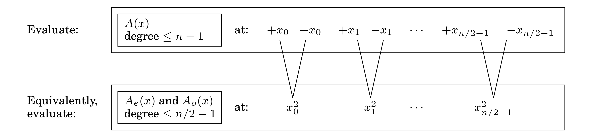
> 但是这样带来了一个问题，我们在计算$A(\pm x_i)$的时候是可以利用$A_e$和$A_o$进行分治，但是我们继续递归就会发现$A_e(x)$的计算依赖于$x_0^2, x_1^2,\cdots, x_{\frac{n}{2}-1}^2$这$\frac{n}{2}$个点，如果我们想要使用分治算法，则这$\frac{n}{2}$个点必须是`Positive-Negative Pairs`，怎么达到这个目的呢? 我们需要借用以下约束:
> 1. 我们在使用$x_0,x_1,\cdots, x_{n-1}$对$A(x)$进行`Evalaute`的时候, 要确保它们是`Positive-Negative Pairs`，因为这样才能使用分治算法。
> 2. 我们在`Evaluate`$A_e(x)$和$A_o(x)$的时候，使用的是$x_0^2, x_1^2,\cdots, x_{\frac{n}{2}-1}^2$, 为了确保我们在计算$A(x_i^2)$的时候仍然能够使用分治算法，我们需要保证$x_0^2,x_1^2,\cdots, x_{\frac{n}{2}-1}^2$也是`Positive-Negative Pairs`。
> 
所以本质上我们需要$x_0,x_1,\cdots, x_{n-1}$是`Positive-Negative Pairs`, 且$x_0^2,x_1^2,\cdots, x_{\frac{n}{2}-1}^2$也是`Positive-Negative Pairs`。而`Complex Root`就满足这个要求，令$n$为偶数:
> 1. 我们令$x_0,x_1,\cdots, x_{n-1}$为$z^n=1$的根，即`n-th root of unity`。
> 2. 我们令$x_0^2,x_1^2,\cdots, x_{\frac{n}{2}-1}^2$为$z^{\frac{n}{2}}=1$的根，即`n/2-th root of unity`。
> 3. 依此类推, $x_0^n$为$z=1$的根，即`1-th root of unity`。
> 
**参考上文我们有如下算法: **
> 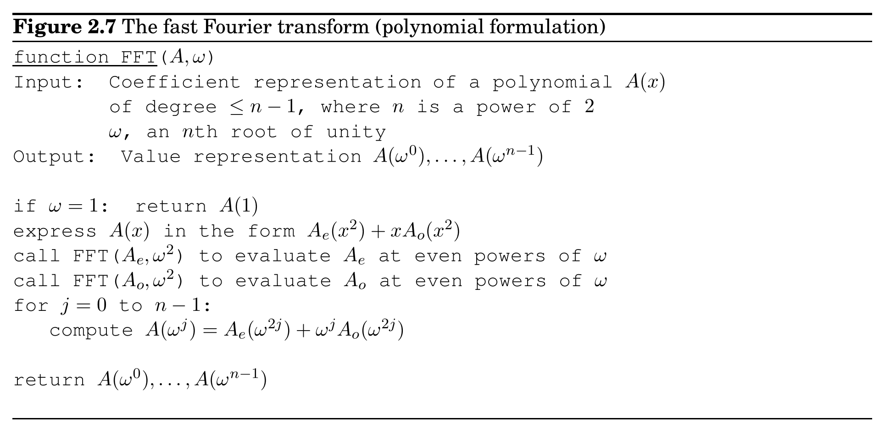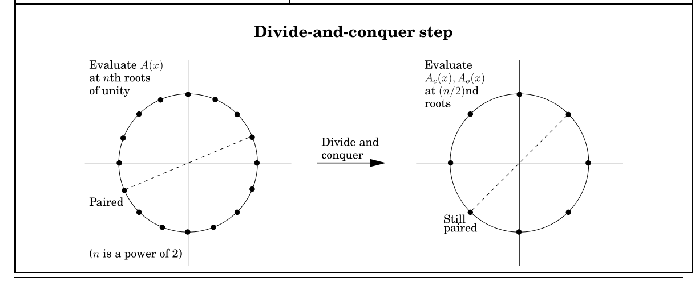


### Time Complexity
> 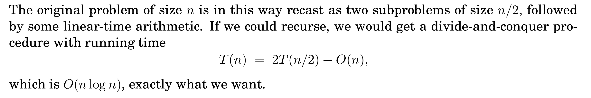


# Fast Fourier Transformation
## Interpolation&Evaluation
> 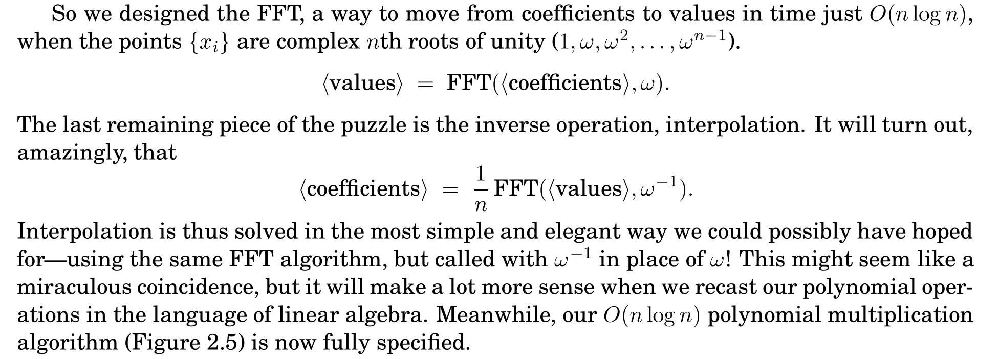


## Vandermonde Matrix
> 1. `**Vandermonde Matrix**`**:**
> 
我们知道一个多项式从`Polynomial Representation`到`Value Representation`可以通过以下矩阵变换实现:
> $\left[\begin{array}{c}A\left(x_0\right) \\A\left(x_1\right) \\\vdots \\A\left(x_{n-1}\right)\end{array}\right]=\left[\begin{array}{ccccc}1 & x_0 & x_0^2 & \cdots & x_0^{n-1} \\1 & x_1 & x_1^2 & \cdots & x_1^{n-1} \\& & \vdots & & \\1 & x_{n-1} & x_{n-1}^2 & \cdots & x_{n-1}^{n-1}\end{array}\right]\left[\begin{array}{c}a_0 \\a_1 \\\vdots \\a_{n-1}\end{array}\right]$
> 其中$\left[\begin{array}{ccccc}1 & x_0 & x_0^2 & \cdots & x_0^{n-1} \\1 & x_1 & x_1^2 & \cdots & x_1^{n-1} \\& & \vdots & & \\1 & x_{n-1} & x_{n-1}^2 & \cdots & x_{n-1}^{n-1}\end{array}\right]$是傅里叶变换矩阵，也被称为`Vandermonde matrix`。
> 2. $M$**的可逆性?**
> 
我们记$M=\begin{bmatrix}1 & x_0 & x_0^2 & \cdots & x_0^{n-1} \\1 & x_1 & x_1^2 & \cdots & x_1^{n-1} \\& & \vdots & & \\1 & x_{n-1} & x_{n-1}^2 & \cdots & x_{n-1}^{n-1}\end{bmatrix}$，如果这个矩阵可逆，则`Polynomial Representation`到`Value Representation`的过程就也是可逆的。事实上，当$x_0,x_1,\cdots, x_{n-1}$不全相同的时候，$M^{-1}$存在且唯一。 原因很简单，全相同时，$Rank(M)=1$, 不全相同时，$M$靠后的列无法表示为$M$靠前的列的线性组合。
> 3. **那么如何保证**$x_0,x_1,\cdots, x_{n-1}$**不全相同呢?**
> 
还记得我们在使用`Divide and Conquer`来`Evaluate Polynomial`的时候**选取**$x_0,x_1,\cdots, x_{n-1}$**为**`**n-th root of unity**`, 也就是$w^0,w^1,\cdots,w^{n-1}$, 肯定不全相同。而且`n-th root of unity`还有一些非常好的性质，于是我们可以令:
> 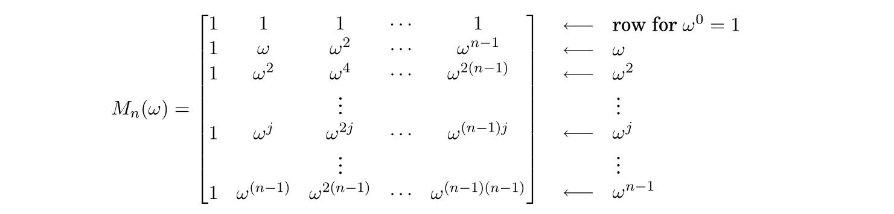
> $M_n(w)$这个记号中，$n$代表的是矩阵的`Size`，$w$代表的是矩阵$M$的第二行第二列的元素变量。
> 行方向为$1,w,w^2,\cdots, w^{n-1}$, 也就是`n-th root of unity`
> 列方向为`Polynomial Degree`增加的方向。
> 4. $M_n(w)$**的列互相正交且列的长度为**$\sqrt{n}$
> 
注意这里的`Inner Product`是`Complex Inner Product`
> 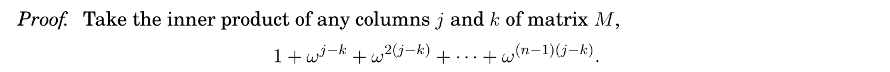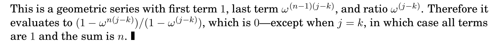
> 5. **Inverse Formula I: **$MM^*=nI$**，其中**$M^*$**为**$M$**的共轭转置**
> 
我们令$M=\begin{bmatrix} \vec{m}_1\\\vec{m}_2\\\vdots\\\vec{m}_n\end{bmatrix}$,$M^*=\begin{bmatrix} \vec{m}_1^*&\vec{m}_2^*&\cdots&\vec{m}_n^*\end{bmatrix}$, 因为$\vec{m}_i\vec{m}_j^*=\begin{cases}n&i=j\\0&i\neq j \end{cases}$, 所以$MM^*=nI$。
> 6. **Inverse Formula II: **$M^{-1}=\frac{1}{n}M^*$**, **$M_n(w)^{-1}=\frac{1}{n}M_n(w^{-1})$
> 
有了上面的结论我们知道, $MM^*=nI$, 即$M(\frac{1}{n}M^*)=I$, 于是$M^{-1}=\frac{1}{n}M^*$。
> 因为$M_n(w)=\left[\begin{array}{ccccc}
1 & 1 & 1 & \cdots & 1 \\
1 & \omega & \omega^2 & \cdots & \omega^{n-1} \\
1 & \omega^2 & \omega^4 & \cdots & \omega^{2(n-1)} \\
& & \vdots & & \\
1 & \omega^j & \omega^{2 j} & \cdots & \omega^{(n-1) j} \\
& & \vdots & & \\
1 & \omega^{(n-1)} & \omega^{2(n-1)} & \cdots & \omega^{(n-1)(n-1)}
\end{array}\right]$, 于是$M_n(w)^{-1}=\frac{1}{n}M^*_n(w)$
> 因为$M_n^*(w)=\left[\begin{array}{ccccc}1 & 1 & 1 & \cdots & 1 \\1 & w^{-1} & \omega^{-2} & \cdots & \omega^{-(n-1)} \\1 & \omega^{-2} & \omega^{-4} & \cdots & \omega^{-2(n-1)} \\& & \vdots & & \\1 & \omega^{-j} & \omega^{-2 j} & \cdots & \omega^{-(n-1) j} \\& & \vdots & & \\1 & \omega^{-(n-1)} & \omega^{-2(n-1)} & \cdots & \omega^{-(n-1)(n-1)}\end{array}\right]=M_n(w^{-1})$, 于是我们有$M_n(w)^{-1}=\frac{1}{n}M_n(w^{-1})$。


## Definitive FFT Algorithm
> 总结一下，$FFT$算法接收一个向量$\vec{a}=\begin{bmatrix}a_0\\a_1\\\vdots\\a_{n-1} \end{bmatrix}$和一个复数$w$(`n-th root of unity`)作为输入。
> 整个转换的过程为$M_n(w)\vec{a}$(`Matrix-Vector Multiplication`), 其中$M_n(w)\in\mathbb{R}^{n\times n}$(傅里叶转换矩阵)。
> 为了方便起见，我们假设$n=2^k$, 则:
> 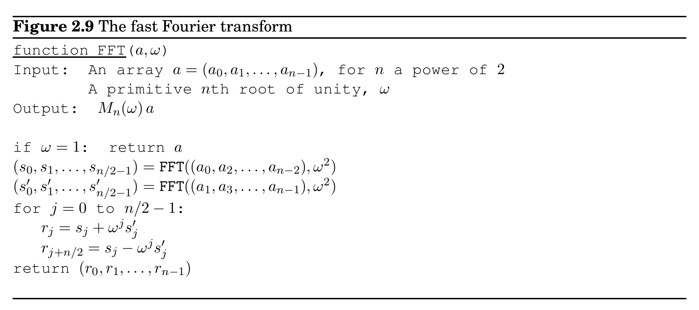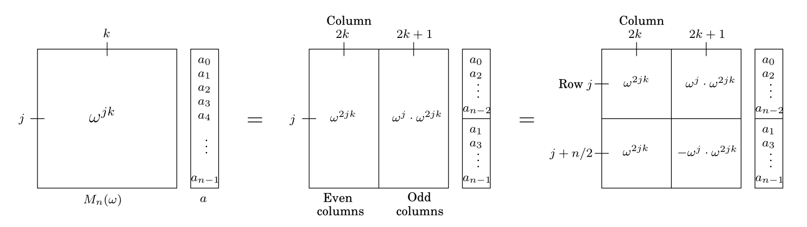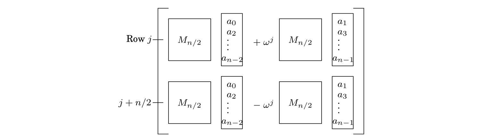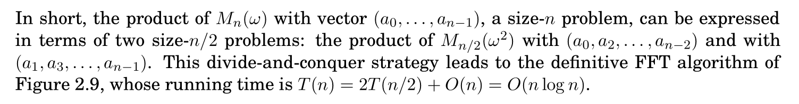


