:::info
Ch 1.3~1.5
:::
[released_assets_slides_03-Control_full.pdf](https://www.yuque.com/attachments/yuque/0/2022/pdf/12393765/1672287760420-f027fbfe-1bd0-43d5-b190-fba6f792d877.pdf)
[released_assets_slides_04-Higher-Order_Functions_full.pdf](https://www.yuque.com/attachments/yuque/0/2022/pdf/12393765/1672287761240-9bd88965-3d34-419f-9984-815add493256.pdf)
[released_assets_slides_05-Environments_full.pdf](https://www.yuque.com/attachments/yuque/0/2022/pdf/12393765/1672287760050-24e5c54f-323f-4c79-871a-56d25a339aed.pdf)

# 1 Multiple Environments
## Life-Cycle of Use-defined Function
:::info
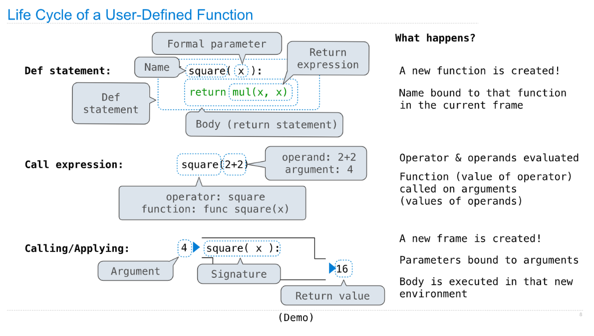
:::

## Multiple Environments
:::info
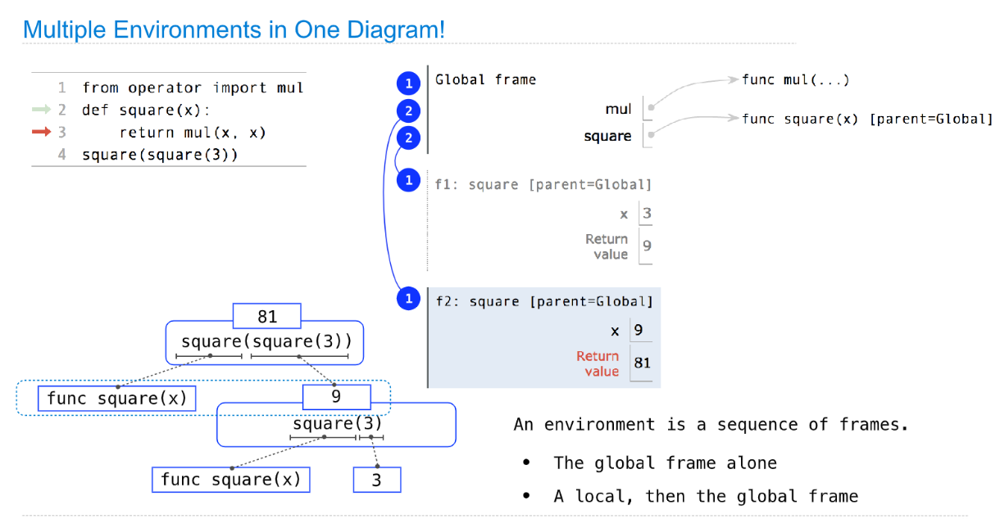
:::

## Name has no meaning w.o. environment
:::info
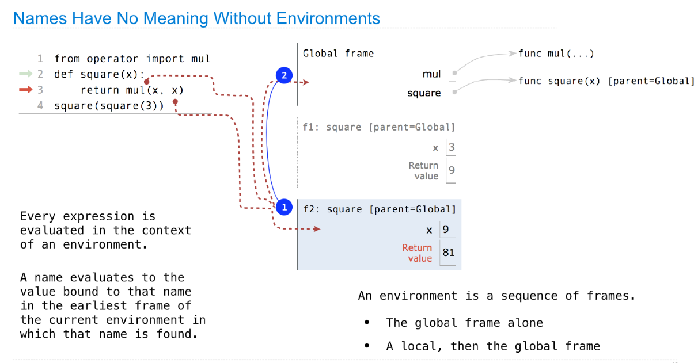
:::

## Different meanings in different environment
:::info
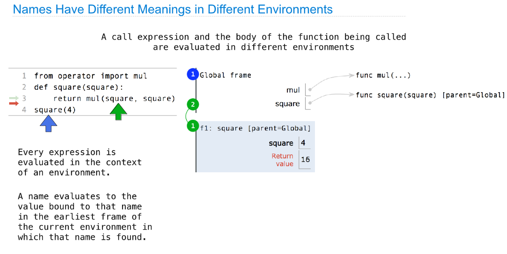
:::

# 2 Miscellaneous Python Features
## Statements
:::info
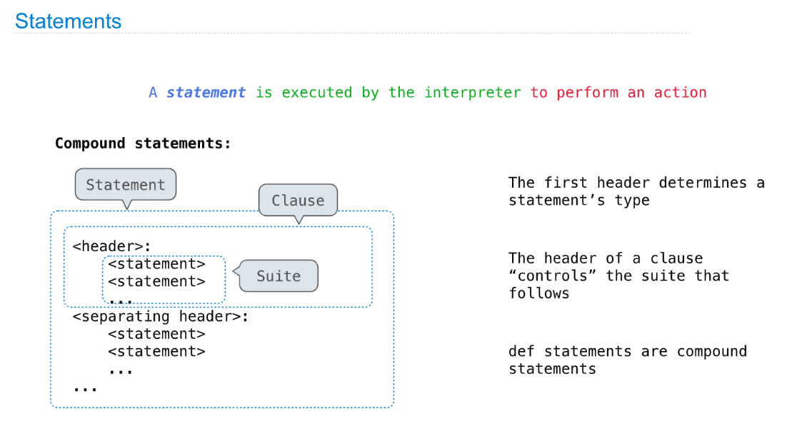
:::

## Compound Statements
:::info
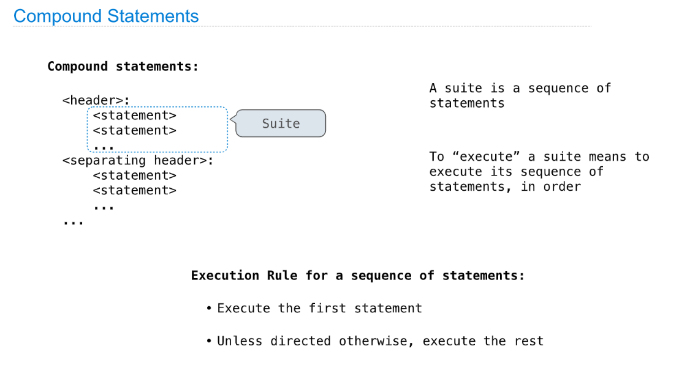
:::


## Conditional Statements
:::info
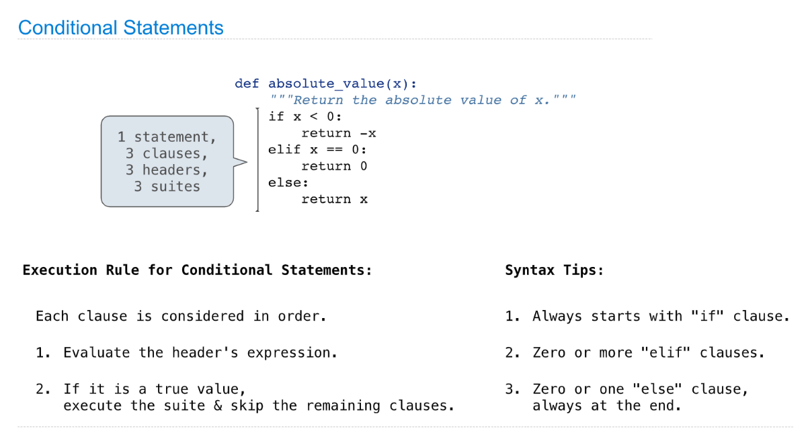
:::


## Boolean Conditions
:::info
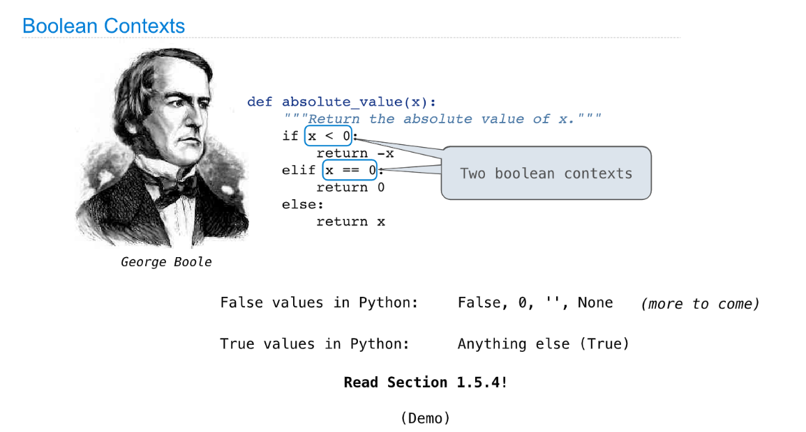
:::


## Iteration
:::info
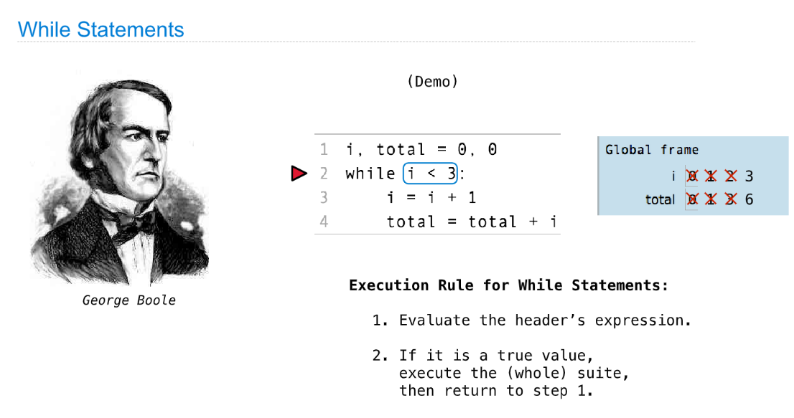
:::


### Prime Factorization
:::info
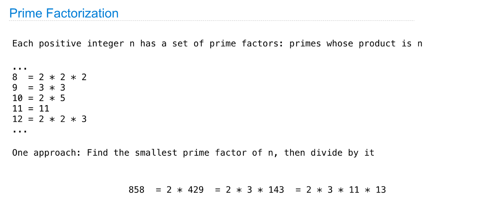
:::
```python
def prime_factors(n):
    """Print the prime factors of n in non-decreasing order

        >>> prime_factors(8)
        2
        2
        2
        >>> prime_factors(9)
        3
        3
        >>> prime_factors(11)
        11
        >>> prime_factors(12)
        2
        2
        3
        >>> prime_factors(858)
        2
        3
        11
        13
        """

    while n>1:
        smallest_prime = 2
        while n % smallest_prime != 0:
            smallest_prime = smallest_prime + 1
        n = n//smallest_prime
        print(smallest_prime)
```
**doctest**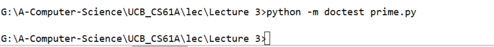

### Fibonacci Sequences
:::info
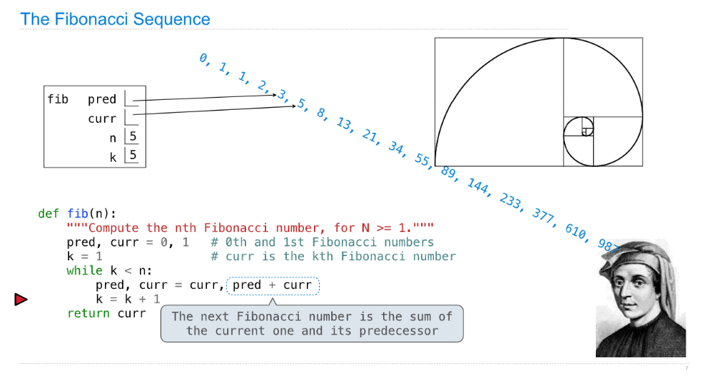
:::

# 3 Higher-Order Functions - HOF
:::info
[http://composingprograms.com/pages/16-higher-order-functions.html](http://composingprograms.com/pages/16-higher-order-functions.html)
In mathematics and computer science, a **higher-order function** (HOF) is a function that does **at least one of the following**:

- **takes one or more functions as arguments** (i.e. a procedural parameter, which is a parameter of a procedure that is itself a procedure),
- **returns a function as its result.**
:::

## Design Techniques
### Functions as Arguments
```python
def summation(n, term):
    total, k = 0, 1
    while k <= n:
        total, k = total + term(k), k + 1
    return total

def cube(x):
    return x*x*x

def sum_cubes(n):
    return summation(n, cube)

result = sum_cubes(3)
```
**Visualization**[https://pythontutor.com/cp/composingprograms.html#mode=display](https://pythontutor.com/cp/composingprograms.html#mode=display)
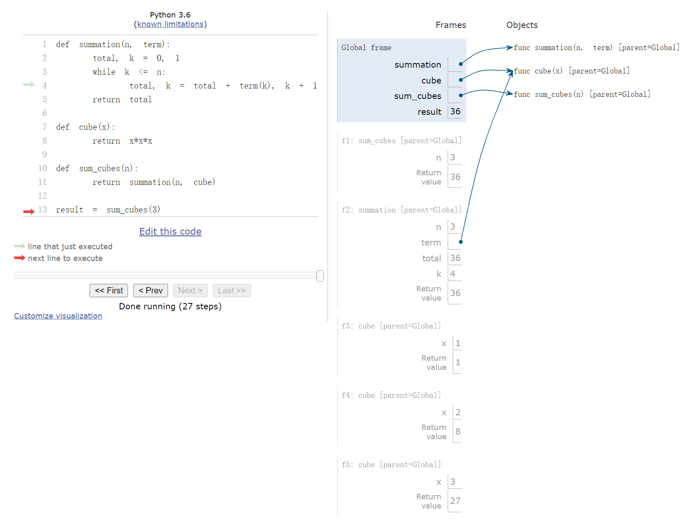

### Function as General Methods
:::info
**Compute Gloden Ratio:** [http://www.geom.uiuc.edu/~demo5337/s97b/art.htm](http://www.geom.uiuc.edu/~demo5337/s97b/art.htm)
**Gloden Ratio**: 1.61803398874989484820
This example illustrates two related big ideas in computer science. 

- Naming and functions allow us to abstract away a vast amount of complexity. While each function definition has been trivial, the computational process set in motion by our evaluation procedure is quite intricate. 
- It is only by virtue of the fact that we have an extremely general evaluation procedure for the Python language that small components can be composed into complex processes. Understanding the procedure of interpreting programs allows us to validate and inspect the process we have created.
:::
```python
def improve(update, close, guess=1):
    while not close(guess):
        guess = update(guess)
    return guess

def golden_update(guess):
    return 1/guess + 1

def square_close_to_successor(guess):
    return approx_eq(guess * guess,
                     guess + 1)

def approx_eq(x, y, tolerance=1e-3):
    return abs(x - y) < tolerance

phi = improve(golden_update,
              square_close_to_successor)
```
```python
>>> from math import sqrt
>>> phi = 1/2 + sqrt(5)/2
>>> def improve_test():
        approx_phi = improve(golden_update, square_close_to_successor)
        assert approx_eq(phi, approx_phi), 'phi differs from its approximation'
>>> improve_test()
```


### Locally Defined Functions
:::info
`Passing functions as arguments` significantly enhances the expressive power of our programming language. Each general concept or equation maps onto its own short function. 

- One negative consequence of this approach is that `the global frame becomes cluttered with names of small functions, which must all be unique`. 
- Another problem is that we are constrained by particular function signatures: Some functions must take exactly one argument. Nested function definitions address both of these problems, but require us to enrich our environment model.
:::
#### Definition
> 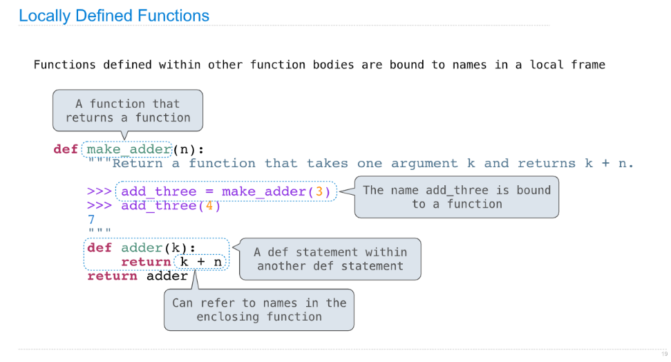

**Explanations**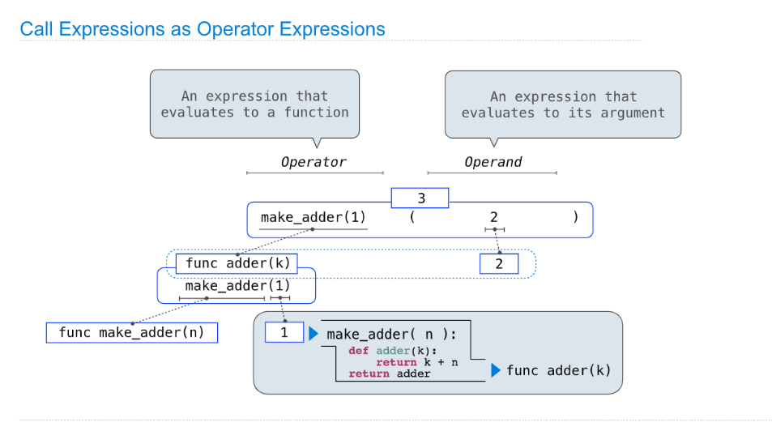


#### Lexical Scope
> **Lexical scope.** Locally defined functions also have access to the name bindings in the scope in which they are defined. This discipline of sharing names among nested definitions is called _lexical scoping_. Critically, the inner functions have access to the names in the environment where they are defined (not where they are called).
> 词法作用域（Lexical Scope） 是定义表达式并能被访问的区间。 换言之，一个声明（定义变量、函数等）的词法作用域就是它被定义时所在的作用域。 注意： 词法作用域又叫静态作用域。
> 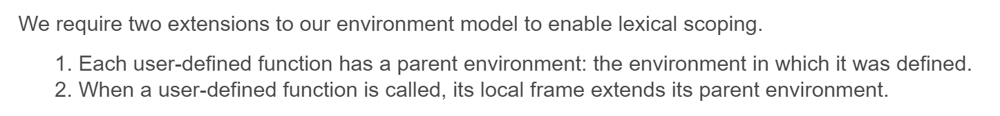


#### Extended Environment
> 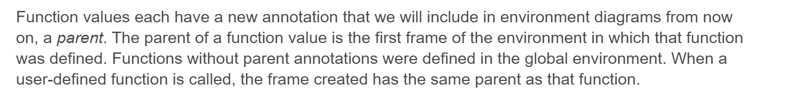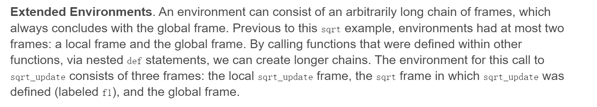


### Functions as return values
```python
def square(x):
    return x * x

def successor(x):
    return x + 1

def compose1(f, g):
    def h(x):
        return f(g(x))
    return h

def f(x):
    """Never called."""
    return -x

square_successor = compose1(square, successor)
result = square_successor(12)
```


### Lambda Function(匿名函数)
> 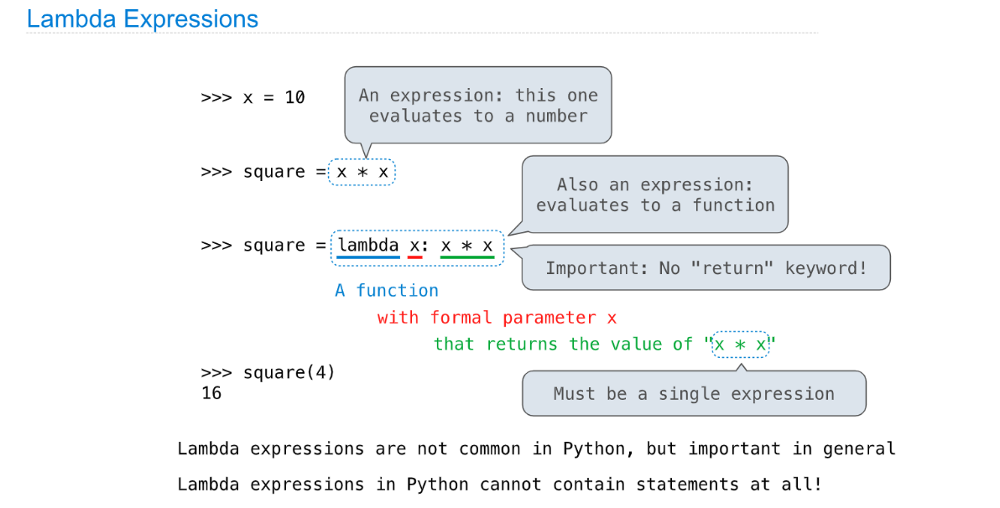
> 注意: 尽管`lambda function`不能有除了`return`之外的其他`statements`, 我们可以在其`return statement`中添加外部的函数调用。比如`lambda x: func(x)`, 这在之后的`labs`中会用到。
> 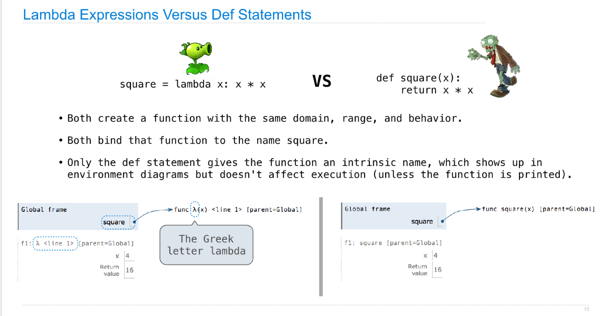

```python
x = 10
square = x * x
square = lambda x: x * x
square(4)

def compose1(f, g):
    return lambda x: f(g(x))

f = compose1(lambda x: x * x,
             lambda y: y + 1)
result = f(12)
```


### Function Abstractions & Naming
> 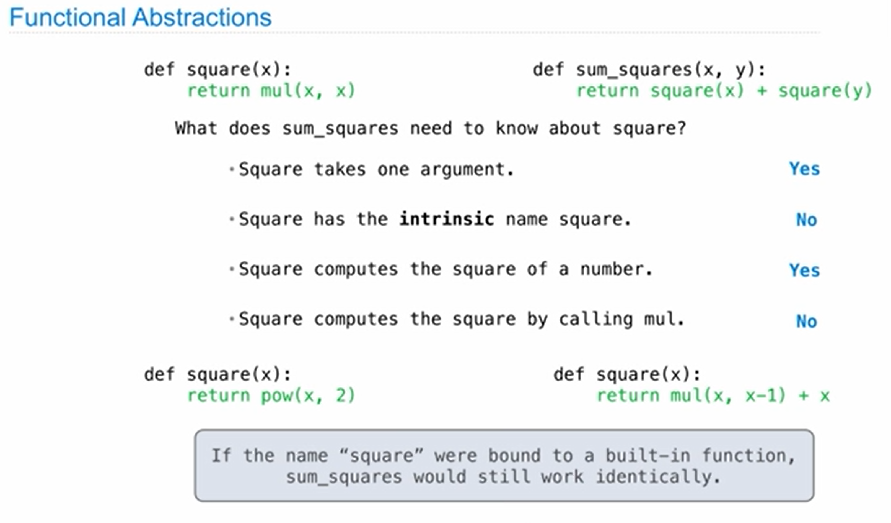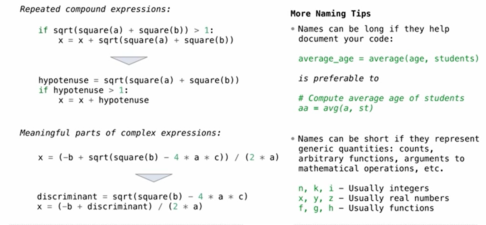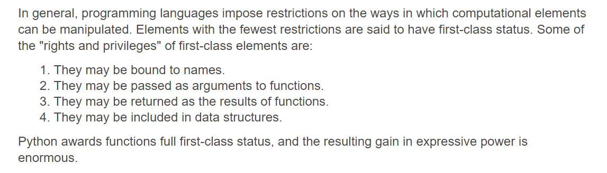


### Function Decorator⭐⭐⭐⭐⭐
#### Basics⭐⭐⭐
> 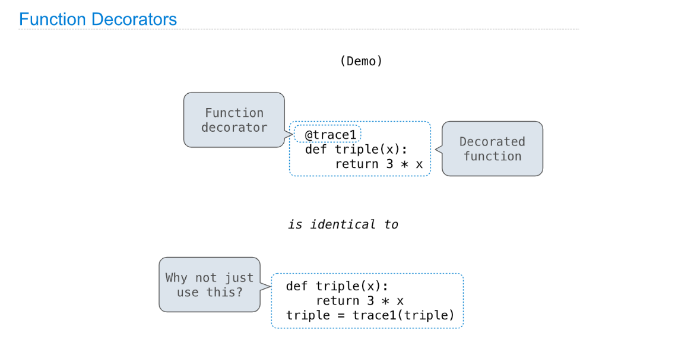所以我们可以简单理解为`@trace`就等同于调用了`triple = trace(triple)`。
> **注意**`**triple**`**的函数引用实际上是变成了**`**trace(triple)**`**返回的那个函数的函数引用，所以函数的行为才发生了实质性的变化。**

```python
def trace(fn):
    def wrapped(x):
        print('-> ', fn, '(', x, ')')  # New functionality
        return fn(x)                   # Original functionality
    return wrapped


# 表示给triple这个函数加一个print的功能，定义在上面
@trace
def triple(x):
    return 3 * x
```


#### Multi-level Decorator⭐⭐⭐
> 我们也可以让装饰器函数`@`带有参数，具体看下面的例子:

```python
def builtin(name):
    def add(py_func):
        print("haha",name)
        return py_func
    return add


@builtin("look up")
def randomFunc(x,y):
    print("xixi")
    return x, y


if __name__ == "__main__":
    print(randomFunc("a","b"))
```
**Program Output**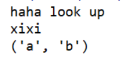
**Explanations**⭐⭐⭐⭐⭐首先`builtin("look up")`执行`builtin`函数，返回`add`函数引用。
然后`@builtin("look up")`实际上等同于`@add`, 而`@add`实际上等同于执行了一句`randomFunc = add(randomFunc)`。
所以我们看到函数`add` 函数最先被调用，打印`haha look up`，然后经过装饰的函数`randomFunc`被调用，打印`xixi`，返回`x,y`
所以当`python interpreter`从上至下执行到`@builtin("look up")`的时候就会执行`add`函数进行一些预处理操作，在`Project 4`中我们会看到这种用法。
> 我们可以将装饰器的写法进行规范化，我们规定:
> 1. 装饰器函数名为`wrapper`, 只能接受一个参数`func`，`func`是被装饰函数
> 2. 在装饰器函数外再包裹一层函数，称为`outer(...)`可以任意设置参数，返回`wrapper`
> 
示例代码如下:

```python
from functools import wraps
import logging

def logged(level, name=None, message=None):
    """
    Add logging to a function. level is the logging
    level, name is the logger name, and message is the
    log message. If name and message aren't specified,
    they default to the function's module and name.
    """
    def decorate(func):
        logname = name if name else func.__module__
        log = logging.getLogger(logname)
        logmsg = message if message else func.__name__

        @wraps(func)
        def wrapper(*args, **kwargs):
            log.log(level, logmsg)
            return func(*args, **kwargs)
        return wrapper
    return decorate

# Example use
@logged(logging.DEBUG)
def add(x, y):
    return x + y

@logged(logging.CRITICAL, 'example')
def spam():
    print('Spam!')
```


### Function Currying(柯里化)
> 利用了函数作用域链的性质
> 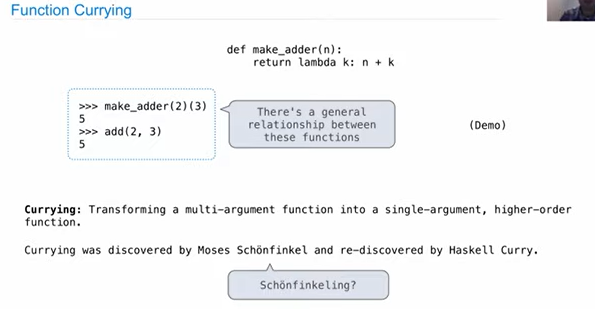

```python
def curry2(f):
    def g(x):
        def h(y):
            return f(x,y)
        return h
    return g

# 调用
from operator import add
m = curry2(add)  # return the g
add_three = m(3) # return the h
add_three(2010)  # call h(2010)
```


### Summary
> 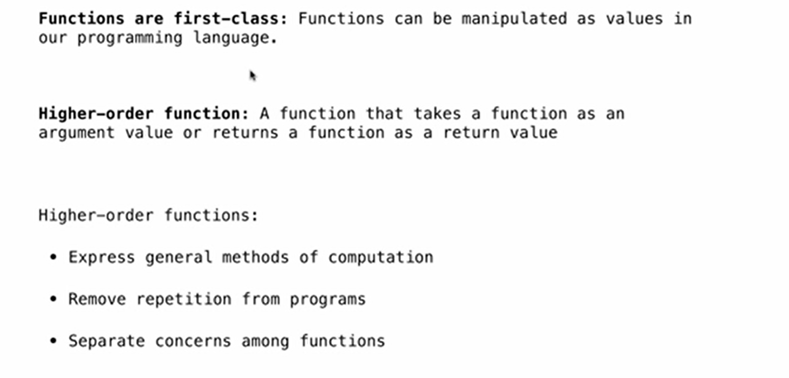


## Environment Diagrams
### For Higher-Order Function
> 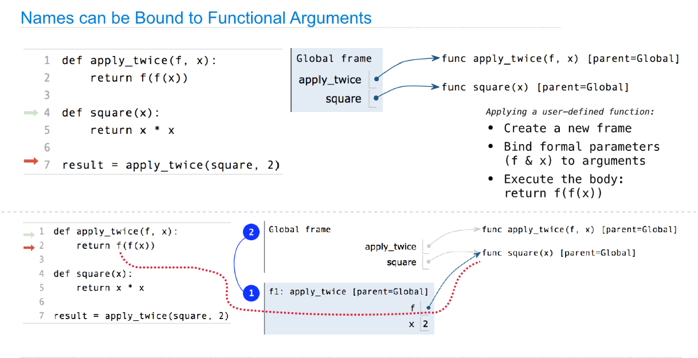

```python
def apply_twice(f, x):
    """Return f(f(x))

    >>> apply_twice(square, 2)
    16
    >>> from math import sqrt
    >>> apply_twice(sqrt, 16)
    2.0
    """
    return f(f(x))

def square(x):
    return x * x

result = apply_twice(square, 2)
```


### For Nested Functions
> 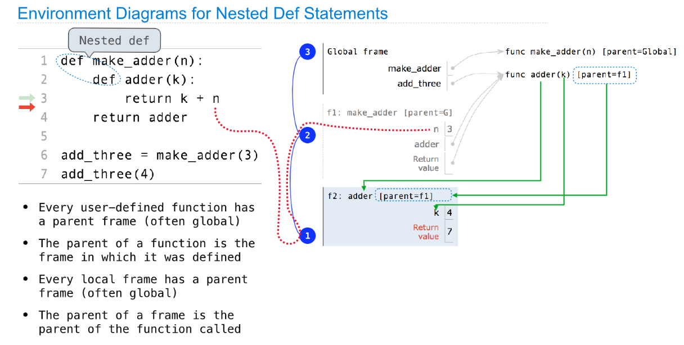
> 所以`Nested Function`在寻找变量的时候会现在自己的`active scope`中寻找，然后向上到自己的祖先`frame`里面寻找，就像上图中的沿着`1->2->3 frame`的顺序进行逐级查找，和`javascript`一样。

```python
def make_adder(n):
    """Return a function that takes one argument k and returns k + n.

    >>> add_three = make_adder(3)
    >>> add_three(4)
    7
    """
    def adder(k):
        return k + n
    return adder
```

### How to draw diagram
> 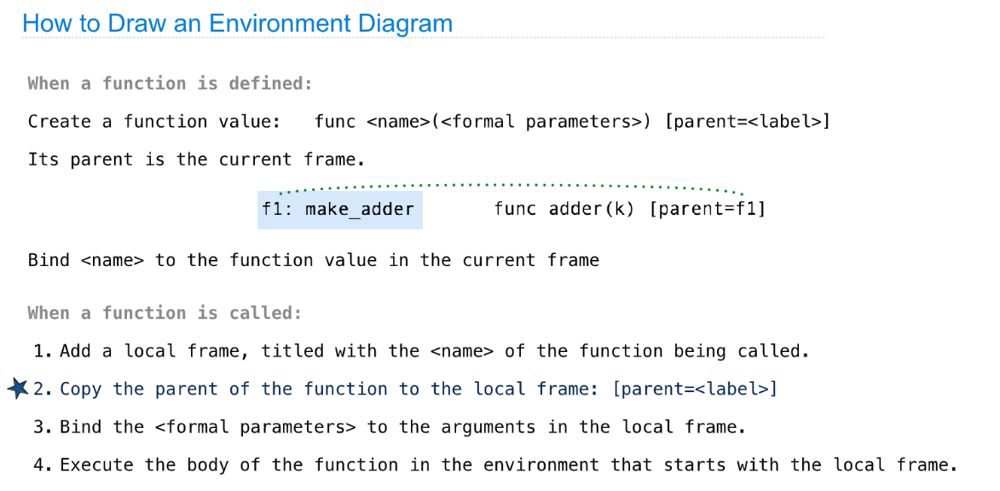


### Local Names
> 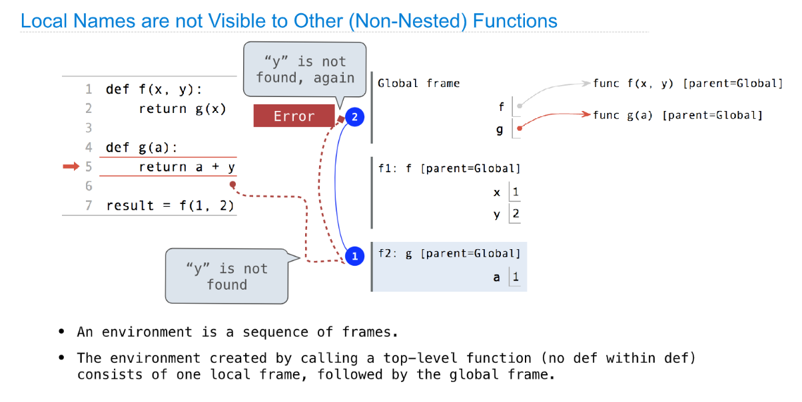

```python
def f(x, y):
    return g(x)

def g(a):
    return a + y

# This expression causes an error because y is not bound in g.
# f(1, 2)

```


### Function Composing
> 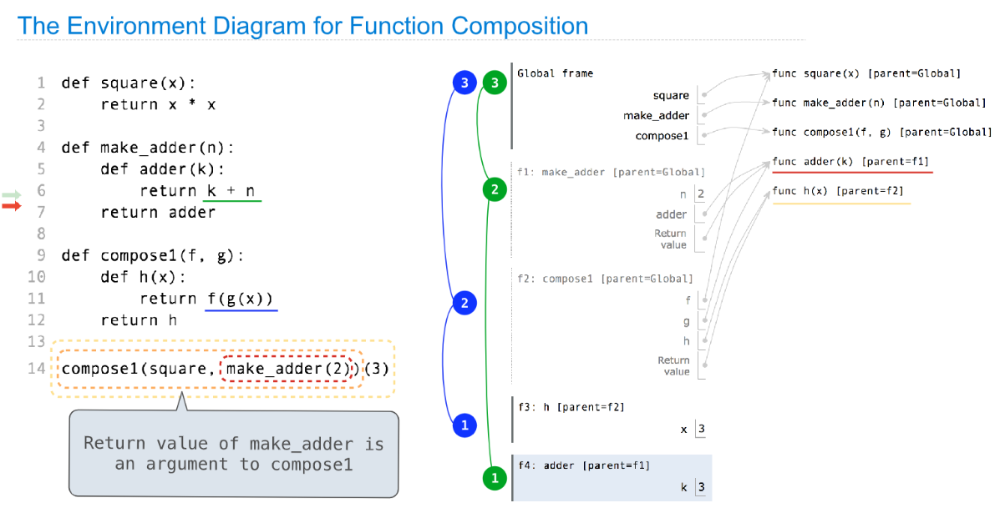
> `Function Composing`的关键在于，其返回的内部函数的行为要和组合之前一致。

```python
def compose1(f, g):
    """Return a function that composes f and g.

    f, g -- functions of a single argument
    """
    def h(x):
        return f(g(x))
    return h

def triple(x):
    return 3 * x

squiple = compose1(square, triple)
tripare = compose1(triple, square)
squadder = compose1(square, make_adder(2))
```


## Design Functions Examples
:::info
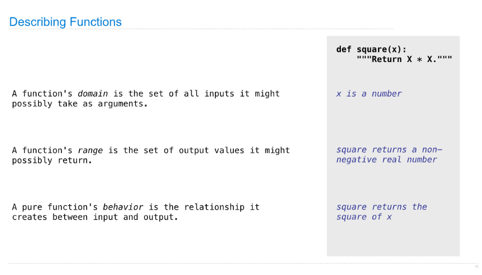
:::


### Generalization Examples
#### Generalize the value
:::info
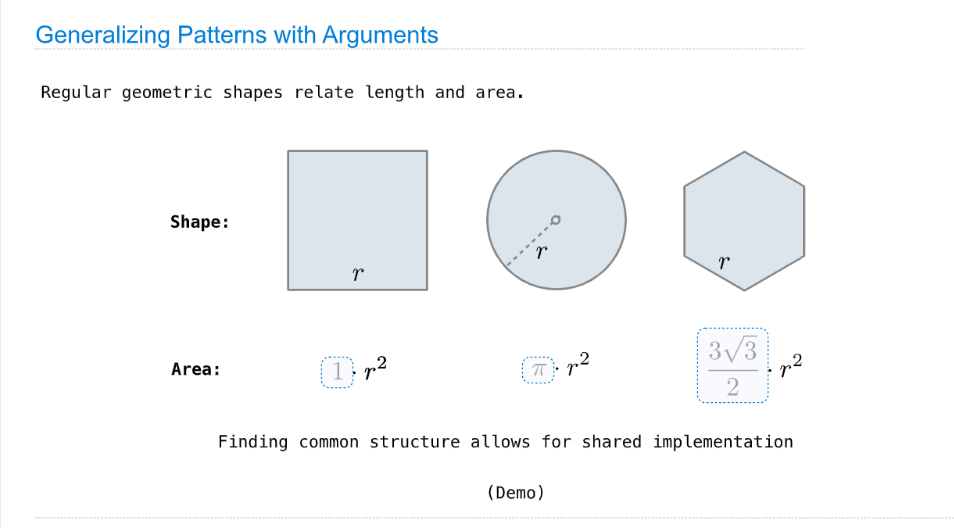
:::
```python
from math import pi, sqrt
def area_square(r):
    return r*r

def area_circle(r):
    return r*r*pi

def area_hexagon(r):
    return r*r*3*sqrt(3) / 2
```
```python
from math import pi, sqrt
# Generalize the value
def area(r,shape_constant):
	assert r>0, 'The length must be positive'
    return r*r*shape_constant
    
def area_square(r):
    return area(r,1)

def area_circle(r):
    return area(r,pi)

def area_hexagon(r):
    return area(r,3*sqrt(3) / 2)
```


#### Generalize the procedure
:::info

:::
```python
def sum_naturals(n):
    """
    Sum the first N natural numbers
    
    >>> sum_naturals(5)
    15
    """
    total,k = 0,1
    while k <= n:
        total, k = total + k,k + 1
    return total

def sum_naturals(n):
    """
    Sum the first N cubes of natural numbers
    
    >>> sum_naturals(5)
    225
    """
    total,k = 0,1
    while k <= n:
        total, k = total + pow(k,3),k + 1
    return total
```
```python
# Generalize
def identity(k):
    return k

def cube(k):
    return pow(k,3)

def summation(n,term):
    """
    Sum the first N terms of a sequence.

    >>>summation(5,cube)
    225

    >>>summation(5,identity)
    15
    """
	total,k = 0,1
    while k <= n:
        total, k = total + term(k),k + 1
    return total
```


### Computing Golden Ratio
```python
def average(x, y):
    return (x + y)/2

def improve(update, close, guess=1):
    while not close(guess):
        guess = update(guess)
    return guess

def approx_eq(x, y, tolerance=1e-3):
    return abs(x - y) < tolerance

def sqrt(a):
    def sqrt_update(x):
        return average(x, a/x)
    def sqrt_close(x):
        return approx_eq(x * x, a)
    return improve(sqrt_update, sqrt_close)

result = sqrt(256)
```
**Visualization**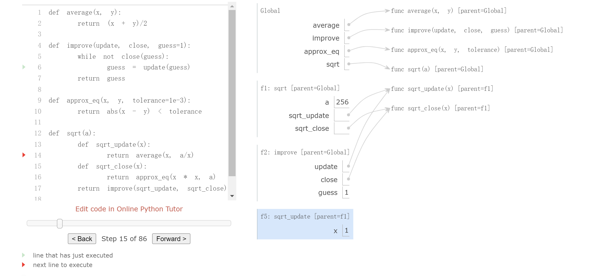
> 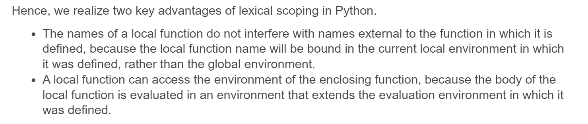


### 巴比伦法 - Computing Sqrt& Cube
:::info
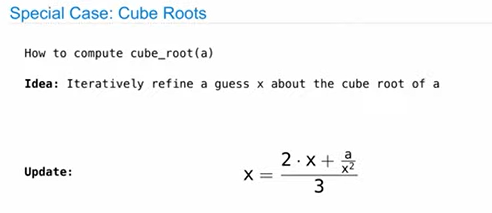
:::
```python
def square_root(a):
    x = 1            # The choice of the initial value could result in infinite loops
    while x*x != a:
        x = square_root_update(x,a)
    return x

def square_root_update(x,a):
    return (x + a / x)/2
```
```python
def cube_root(a):
    x = 1
    while x*x*x != a:
        x = cube_root_update(x,a)
    return x

def cube_root_update(x,a):
    return (2*x +  a/ (x*x)) / 3
```
```python
def square_root_update(x,a):
    return (x + a / x)/2

def cube_root_update(x,a):
    return (2*x +  a/ (x*x)) / 3

def improve(update, close, guess=1):
    while not close(guess):
        guess = update(guess)
    return guess

def approx_eq(x,y, tolerance = 1e-15):
    return abs(x-y) < tolerance  # Boolean

def square_root(a):
    def update(x):
    	return square_root_update(x,a)
    def close(x):
        return approx_eq(x*x, a)
    return improve(update, close)

def cube_root(a):
    return improve(lambda x: cube_root_update(x,a)
                  ,lambda x: approx_eq(x*x*x, a))
```


### Newton Method
> 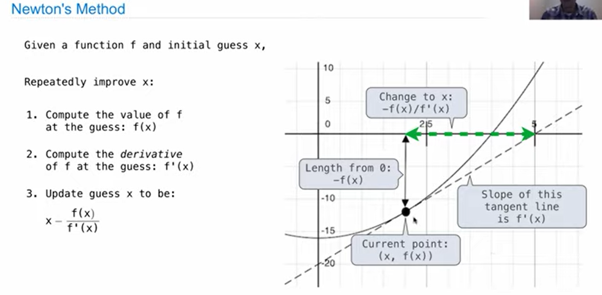

```python
def find_zero(f,df):
    def near_zero(x):
        return approx_eq(f(x),0)
    return improve(newton_update(f,df),near_zero)

def newton_update(f,df):
    def update(x):
        return x-f(x) / df(x)
    return update

#def square_root(a):
#    def f(x):
#        return x*x - a
#    def df(x):
#        return 2*x
#    return find_zero(f,df)

#def cube_root(a):
#    return find_zero(lambda x: x*x - a
#                    ,lambda x: 3*x*x)

def power(x,n):
    product, k =1,0
    while k < n:
        product, k = product * x, k + 1
    return product

def root(n,a):
    def f(x):
        return power(x,n) - a;
    def df(x):
        return n * power(x, n-1)
    return find_zero(f,df)

def improve(update, close, guess=1,max_update=100):
    k = 0
    while not close(guess) and k < max_update:
        guess = update(guess)
    return guess

def approx_eq(x,y, tolerance = 1e-15):
    return abs(x-y) < tolerance  # Boolean
```
### 
