[released_hw_hw03_hw03.zip](https://www.yuque.com/attachments/yuque/0/2023/zip/12393765/1672546110193-51a7254b-33c8-404b-869d-1a82b3540a2a.zip)
[released_hw_sol-hw03_hw03.zip](https://www.yuque.com/attachments/yuque/0/2023/zip/12393765/1672546110213-8e34dc9b-0479-4287-921d-d72c1f7f0c4f.zip)


# Q1 Num eights
> 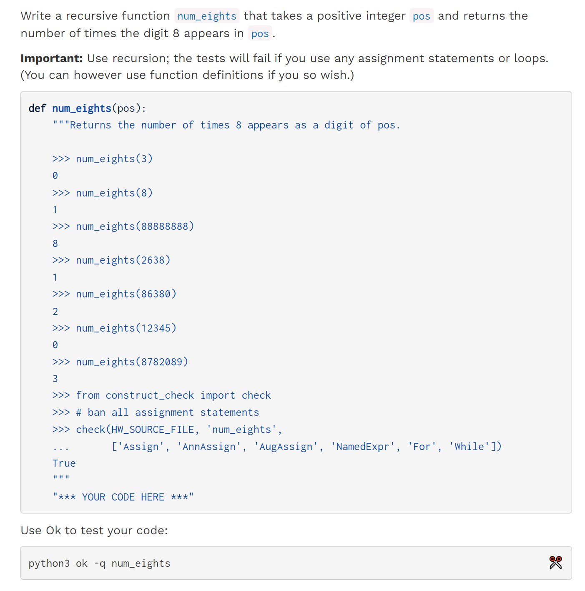
> `No Assignment Statement`就是不能使用`while`循环，因为`while`循环需要在每个`loop`更新状态，而状态的更新需要`assignment statement`, 比如`i = i + 1`。使用`Recursion`可以避免使用`Assignment`操作。

```python
def num_eights(pos):
    if pos < 10:
        return int(pos == 8)

    return num_eights(pos // 10) + int((pos % 10) == 8)
```
```python

def num_eights(pos):
    if pos % 10 == 8:
        return 1 + num_eights(pos // 10)
    elif pos < 10:
        return 0
    else:
        return num_eights(pos // 10)
```

# Q2 Recursion Parameter⭐⭐⭐
> 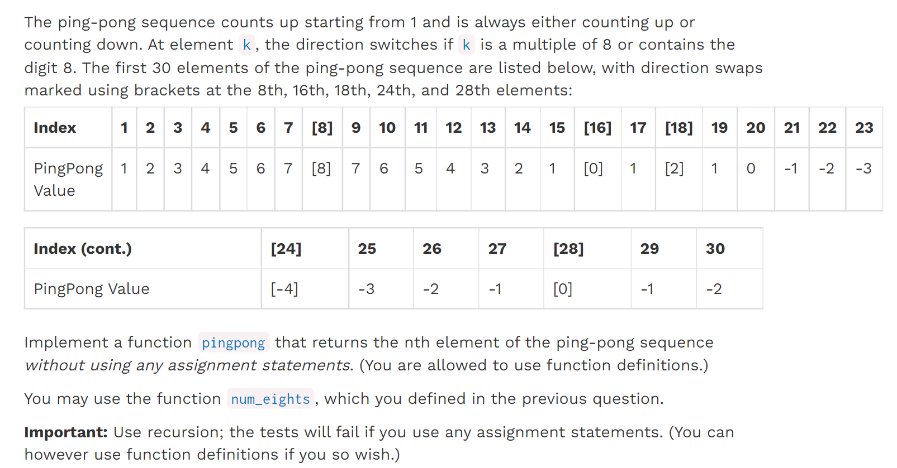
> **本题完美的阐释了**`**Iteration**`**和**`**Recursion**`**之间的相似性:**
> 1. 在`Iteration`中，我们可以使用`curr_number`代表`Ping-pong Sequence`的当前值, `curr_step`代表现在走了几步，用于终止条件。`direction`记录了行走的方向，因为只有两种相反的方向，所以我们可以定义`direction = 1`为正方向，`direction = -1`为反方向，这样定义可以方便我们更新状态，因为我们只要取负号就可以了，即`new_direction = - old_direction`
> 2. 在`Recursion`中，上述变量全部都可以沿用，每进行一个`loop`，相当于一次`function call`。所以可以很快的写出满足条件的题解。

**Hint**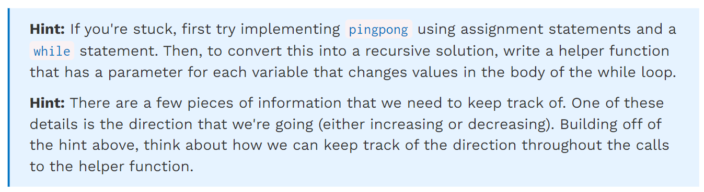
```python
def num_eights(pos):
    if pos < 10:
        return int(pos == 8)
    return num_eights(pos // 10) + int((pos % 10) == 8)


def pingpong(n):
    def helper(curr_number, curr_step, direction):

        if curr_step == n:
            return curr_number

        if curr_step % 8 == 0 or num_eights(curr_step):
            return helper(curr_number + (-direction) , curr_step + 1, -direction)
        else:
            return helper(curr_number + direction, curr_step + 1, direction)


    return helper(1, 1, 1)
```
```python
def num_eights(pos):
    if pos < 10:
        return int(pos == 8)
    return num_eights(pos // 10) + int((pos % 10) == 8)

def pingpong(n):
    curr_number, curr_step, direction = 1, 1, 1
    while curr_step != n:
        if curr_step % 8 == 0 or num_eights(curr_step):
            curr_number, direction = curr_number + (-direction), -direction
        else:
            curr_number, direction =  curr_number + direction, direction
        curr_step += 1
    return curr_number
```
> 下面是官方给出的题解，运用了`Higher-Order Function`和`Function Generalization`的相关知识, 同时将`direction`的更改做了一般化处理(可以处理更多方向)，以便于后续的扩展。
> 我们首先提供`Iteration`版本的题解:
> 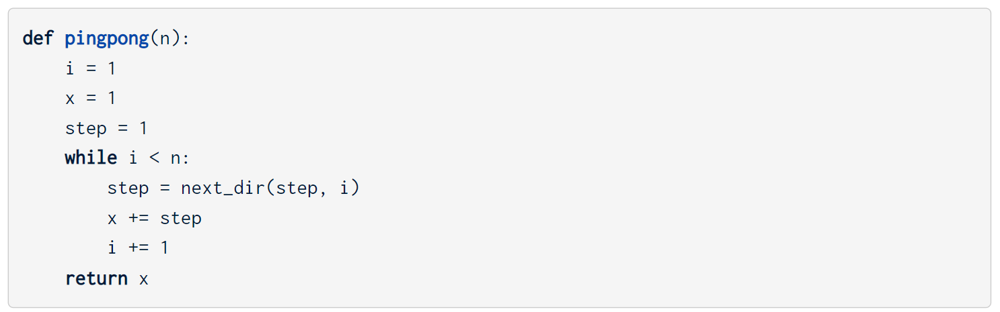
> `next dir`的实现完全交给用户决定，方便扩展。
> 下面是两种`Recursion`的等价实现形式, 也值得参考:

```python
# Alternate solution 1
# 这种实现比较简单
def pingpong_next(x, i, step):
    if i == n:
        return x
    return pingpong_next(x + step, i + 1, next_dir(step, i + 1))


def next_dir(step, i):
    if i % 8 == 0 or num_eights(i) > 0:
        return -step
    return step

    

# Alternate solution 2
# 这种解法完美利用了Recursion的性质，更像是一种induction
# pingpong_alt(n)函数在调用的时候假定pingpong_alt(n-1)已经返回，然后再处理当前step的递归
# 同时，这种解法没有利用参数来保存最终的结果，而是利用return的返回值保存最终的结果，参数列表更简洁
def pingpong_alt(n):
    if n <= 8:
        return n
    return direction(n) + pingpong_alt(n - 1)


def direction(n):
    if n < 8:
        return 1
    if (n - 1) % 8 == 0 or num_eights(n - 1) > 0:
        return -1 * direction(n - 1)
    return direction(n - 1)


```


# Q3 Partitions⭐⭐⭐⭐⭐
> 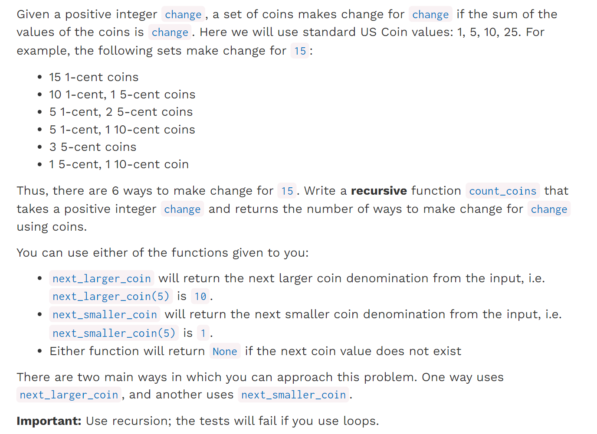
> 注意，本题也是组合问题，问的是能够达成这种求和的钱币组合，所以顺序不同的话只算一种。

**Hint**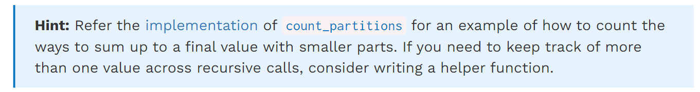
```python
# next_smaller_coin
def count_coins(change):
    def helper(total_change, coin_value):
        if total_change < 0:
            return 0
        elif total_change == 0:
            return 1
        elif coin_value is None:
            return 0

        with_coin = helper(total_change - coin_value, coin_value)
        without_coin = helper(total_change, next_smaller_coin(coin_value))
        return with_coin + without_coin

    return helper(change, 25)

# next_largest_coin
def count_coins(change):
    def helper(total_change, coin_value):
        if total_change < 0:
            return 0
        elif total_change == 0:
            return 1
        elif coin_value is None:
            return 0

        with_coin = helper(total_change - coin_value, coin_value)
        without_coin = helper(total_change, next_larger_coin(coin_value))
        return with_coin + without_coin

    return helper(change, 1)

```


# *Q4 Busy Beaver Contest
## Guidelines
> 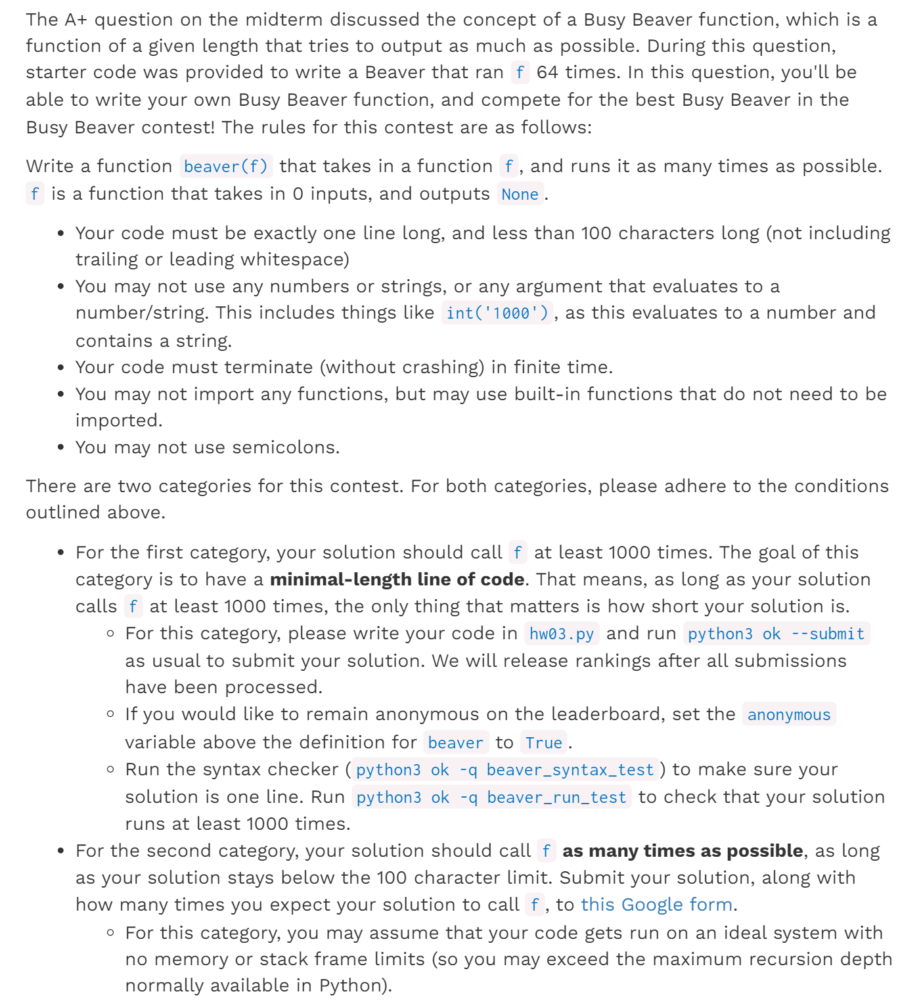


## Problem
> 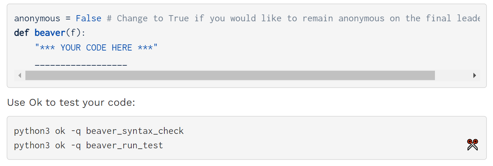


# Exam Practice
## Q1 Digital
> 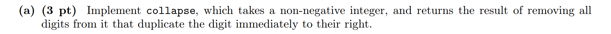

```python
def collapse(n):
    """For non-negative N, the result of removing all digits that are equal
    to the digit on their right, so that no adjacent digits are the same.
    >>> collapse(1234)
    1234
    >>> collapse(12234441)
    12341
    >>> collapse(0)
    0
    >>> collapse(3)
    3
    >>> collapse(11200000013333)
    12013
    """
    left, last = n // 10, n % 10
    if ____________:
        return last
    elif _______________  ==  ________________:
        return collapse(_________________________)
    else:
        return collapse(_________________________) * 10 + _______________
```
```python
def collapse(n):
    """For non-negative N, the result of removing all digits that are equal
    to the digit on their right, so that no adjacent digits are the same.
    >>> collapse(1234)
    1234
    >>> collapse(12234441)
    12341
    >>> collapse(0)
    0
    >>> collapse(3)
    3
    >>> collapse(11200000013333)
    12013
    """
    left, last = n // 10, n % 10
    if last < 10:
        return last
    elif left % 10  ==  last:
        return collapse(left)
    else:
        return collapse(left) * 10 + last
```

## Q2 Won't You Be My Neighbor?
> 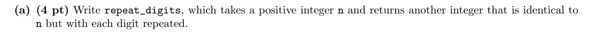

```python
def repeat_digits(n):
    """Given a positive integer N, returns a number with each digit repeated.
    >>> repeat_digits(1234)
    11223344
    """
    last, rest = __________________, ______________________
    if ______________________________________________:
        return ________________________________
    return ___________________(_______________) * ______________ + ______________
```
```python
def repeat_digits(n):
    """Given a positive integer N, returns a number with each digit repeated.
    >>> repeat_digits(1234)
    11223344
    """
    last, rest = n // 10, n % 10
    if last == 0:
        return rest * 10 + rest
    return repeat_digits(last) * 100 + rest*10 + rest
```


## Q3 Palindromes(回文)
> 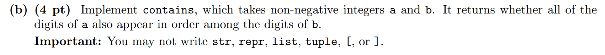

```python
def contains(a, b):
    """Return whether the digits of a are contained in the digits of b.
    >>> contains(357, 12345678)
    True
    >>> contains(753, 12345678)
    False
    >>> contains(357, 37)
    False
    """
    if a == b:
        return True
    if _________________________ > _____________________:
        return False
    if __________________________ == _____________________________:
        return contains( ____________________ , _______________________ )
    else:
        return contains( ____________________ , _______________________)

```
```python

def contains(a, b):
    """Return whether the digits of a are contained in the digits of b.
    >>> contains(357, 12345678)
    True
    >>> contains(753, 12345678)
    False
    >>> contains(357, 37)
    False
    """
    if a == b:
        return True
    if a > b:
        return False
    if a % 10 == b % 10:
        return contains( a // 10 , b // 10 )
    else:
        return contains( a , b // 10 )

```
