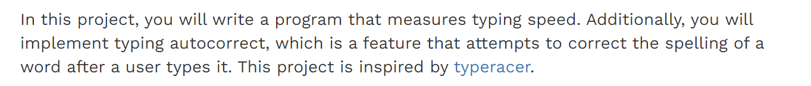
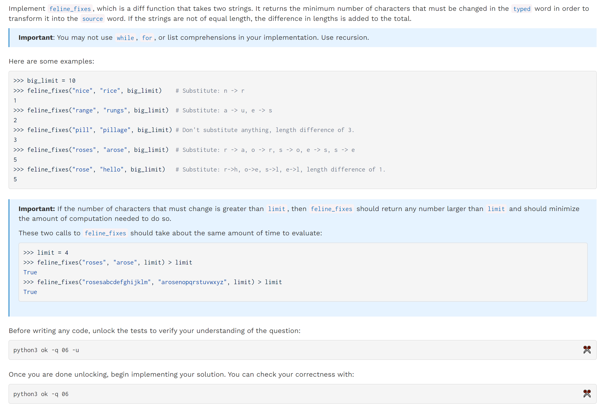
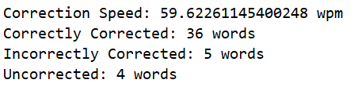
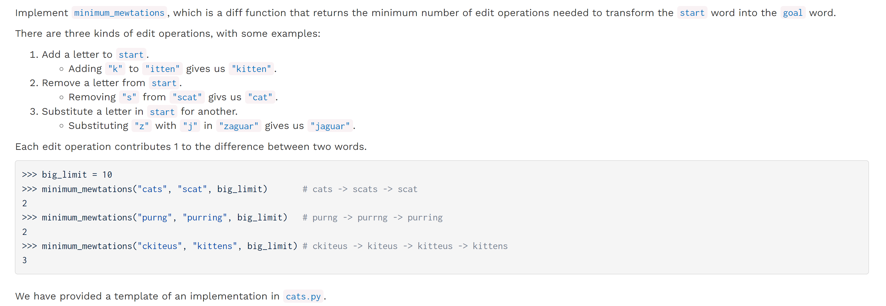
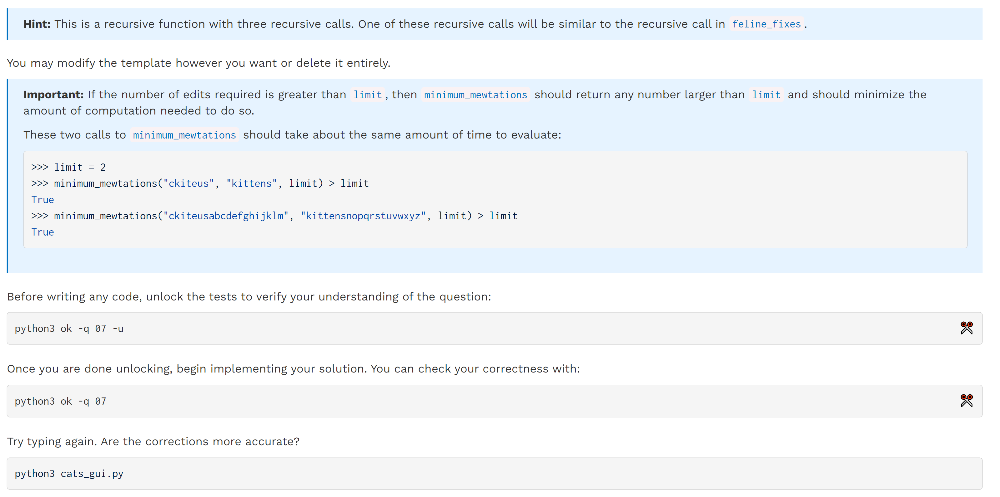
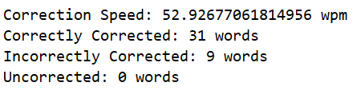
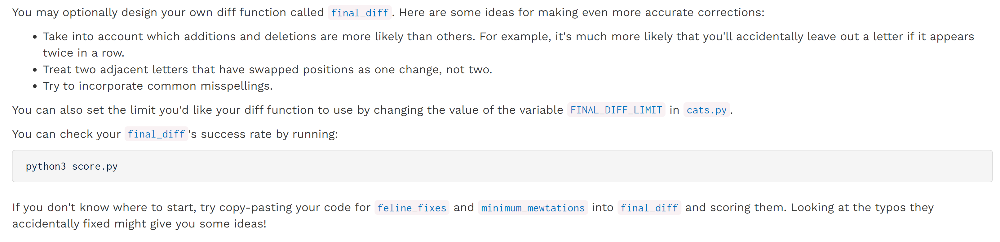

> 
> [typeracer](https://play.typeracer.com/)
> **Topics:**
> 1. Python Lists
> 2. Higher-Order Function
> 
**Run the Autocorret:**
> `python cats_gui.py`

[released_proj_cats_cats.zip](https://www.yuque.com/attachments/yuque/0/2023/zip/12393765/1672563057131-aadf7848-701d-4af2-8f6f-e3106653eccb.zip)
[cats.pdf](https://www.yuque.com/attachments/yuque/0/2023/pdf/12393765/1672563096317-6158a7ad-0fdc-43d9-a96d-83a938425e62.pdf)


# Q6 Edit Number
> 

```python
def feline_fixes(typed, source, limit):
    """A diff function for autocorrect that determines how many letters
    in TYPED need to be substituted to create SOURCE, then adds the difference in
    their lengths and returns the result.

    Arguments:
        typed: a starting word
        source: a string representing a desired goal word
        limit: a number representing an upper bound on the number of chars that must change

    >>> big_limit = 10
    >>> feline_fixes("nice", "rice", big_limit)    # Substitute: n -> r
    1
    >>> feline_fixes("range", "rungs", big_limit)  # Substitute: a -> u, e -> s
    2
    >>> feline_fixes("pill", "pillage", big_limit) # Don't substitute anything, length difference of 3.
    3
    >>> feline_fixes("roses", "arose", big_limit)  # Substitute: r -> a, o -> r, s -> o, e -> s, s -> e
    5
    >>> feline_fixes("rose", "hello", big_limit)   # Substitute: r->h, o->e, s->l, e->l, length difference of 1.
    5
    """
    # BEGIN PROBLEM 6
    # assert False, 'Remove this line'
    def helper(typed, source, curr_edit, limit):
        # Pruning the number of edits, so we need to use curr_edit as the status
        # to record the number of edits along the way.

        # We just need to limit the number of operation, instead of continuing
        # recursive call, we stop recursion and return a constant value so that
        # it takes O(1) time.
        if curr_edit > limit:
            return 1
        if len(typed) == 0 or len(source) == 0:
            return abs(len(typed) - len(source))

        edit_or_not = 1 if typed[0] != source[0] else 0
        res = edit_or_not + helper(typed[1:], source[1:], curr_edit + edit_or_not, limit)
        return res

    return helper(typed, source, 0, limit)
    # END PROBLEM 6

```
> `python score.py`对这个算法的准确率分数是: 
> 


# Q7 Edit Distance
> 

**Hint**
```python
# Edit Distance
def minimum_mewtations(start, goal, limit):
    """A diff function that computes the edit distance from START to GOAL.
    This function takes in a string START, a string GOAL, and a number LIMIT.
    Arguments:
        start: a starting word
        goal: a goal word
        limit: a number representing an upper bound on the number of edits
    >>> big_limit = 10
    >>> minimum_mewtations("cats", "scat", big_limit)       # cats -> scats -> scat
    2
    >>> minimum_mewtations("purng", "purring", big_limit)   # purng -> purrng -> purring
    2
    >>> minimum_mewtations("ckiteus", "kittens", big_limit) # ckiteus -> kiteus -> kitteus -> kittens
    3
    """
    assert False, 'Remove this line'
    if ______________:  # Fill in the condition
        # BEGIN
        "*** YOUR CODE HERE ***"
        # END
    elif ___________:  # Feel free to remove or add additional cases
        # BEGIN
        "*** YOUR CODE HERE ***"
        # END
    else:
        add = ...  # Fill in these lines
        remove = ...
        substitute = ...
        # BEGIN
        "*** YOUR CODE HERE ***"
        # END
```
```python
# Edit Distance
def minimum_mewtations(start, goal, limit):
    """A diff function that computes the edit distance from START to GOAL.
    This function takes in a string START, a string GOAL, and a number LIMIT.
    Arguments:
        start: a starting word
        goal: a goal word
        limit: a number representing an upper bound on the number of edits
    >>> big_limit = 10
    >>> minimum_mewtations("cats", "scat", big_limit)       # cats -> scats -> scat
    2
    >>> minimum_mewtations("purng", "purring", big_limit)   # purng -> purrng -> purring
    2
    >>> minimum_mewtations("ckiteus", "kittens", big_limit) # ckiteus -> kiteus -> kitteus -> kittens
    3
    """
    def helper(start, goal , curr_edit, limit):
        if curr_edit > limit:
            return 1
        if len(start) == 0 or len(goal) == 0:  # Fill in the condition
            # BEGIN
            "*** YOUR CODE HERE ***"
            return abs(len(start) - len(goal))
            # END
        elif start[0] == goal[0]:  # Feel free to remove or add additional cases
            # BEGIN
            "*** YOUR CODE HERE ***"
            return helper(start[1:], goal[1:], curr_edit, limit)
            # END
        else:
            add = helper(start, goal[1:], curr_edit + 1, limit)  # Fill in these lines
            remove = helper(start[1:], goal, curr_edit + 1, limit)
            substitute =  helper(start[1:], goal[1:], curr_edit + 1, limit)
            # BEGIN
            "*** YOUR CODE HERE ***"
            return min(add, remove, substitute) + 1
            # END
    return helper(start,goal,0,limit)
```
> `python score.py`对这个算法的准确率分数是: 
> 


# Extension: Final Diff(Optional)
> 

