[released_proj_scheme_scheme.zip](https://www.yuque.com/attachments/yuque/0/2023/zip/12393765/1673786396445-fdb84947-b8e4-4799-9d10-c9915f9e46d0.zip)
[scheme.pdf](https://www.yuque.com/attachments/yuque/0/2023/pdf/12393765/1673786413561-b1265584-952c-4936-b165-5b7dd38d5881.pdf)


# Scheme Interpreter
## Run the Interpreter in Python
> 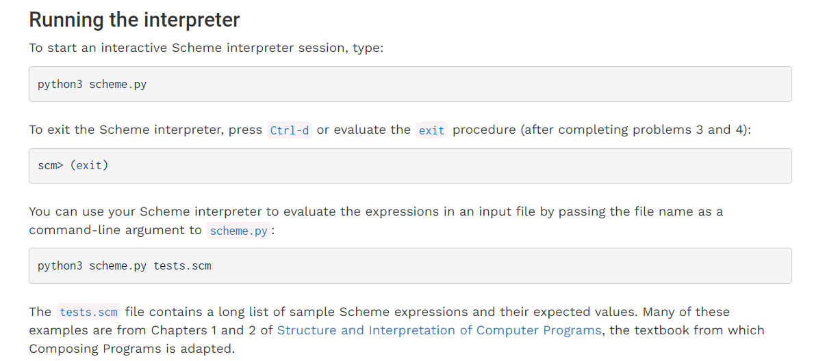

**Program Output**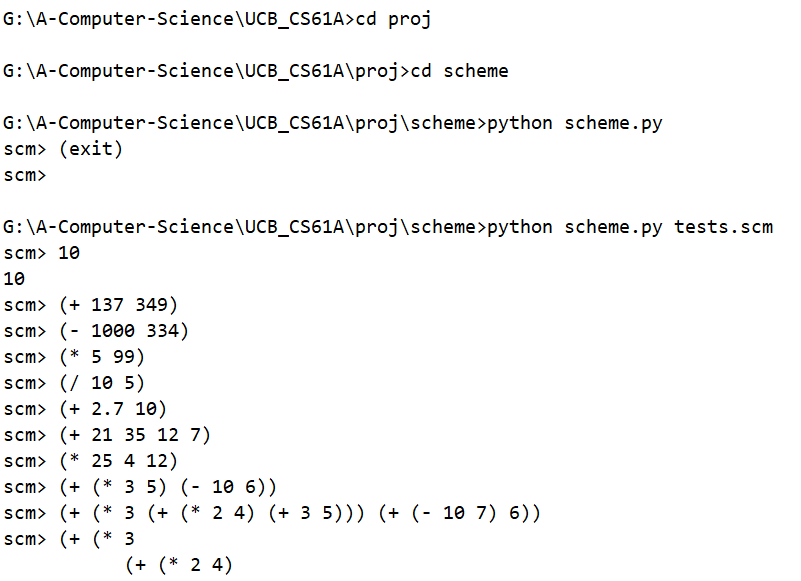


## Scheme Features
> 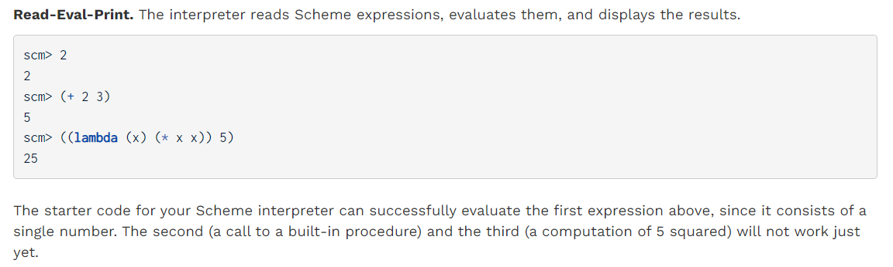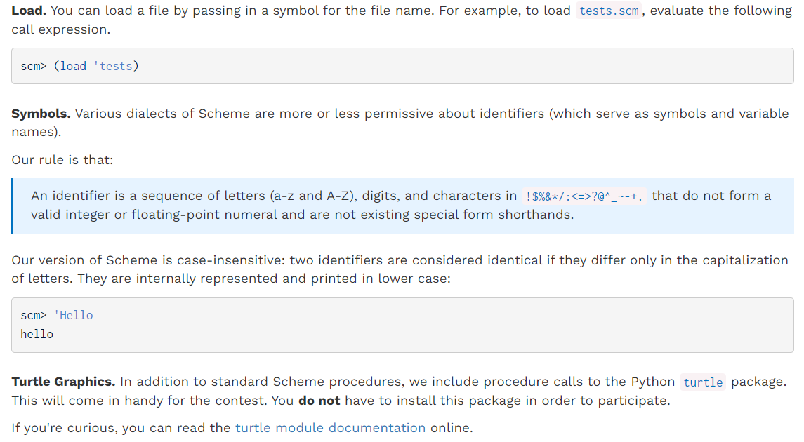


# Part 1: Evaluater
## Concepts
> 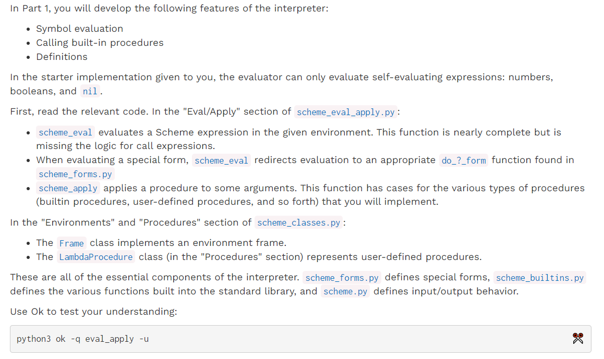

**scheme_eval method**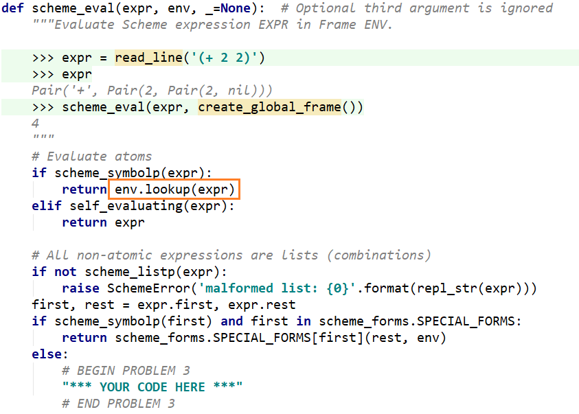
**Questions**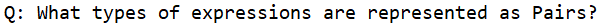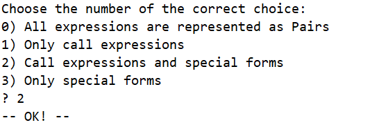
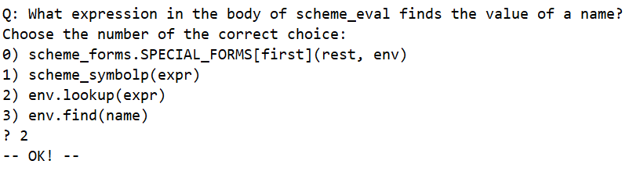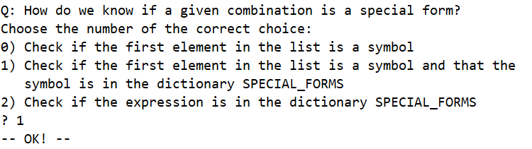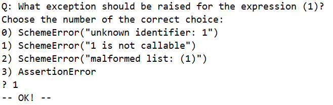
Difference between builtin procedures and user-defined procedures: 1 Builtin procedures won't create a frame when being executed but user-defined ones need. 2 Both builtin and user-defined procedures can have variable length of parameters. 3 User-defined procedures requires additional evaluation process while builtin ones don't have to.


## Problem 1: Frame
> 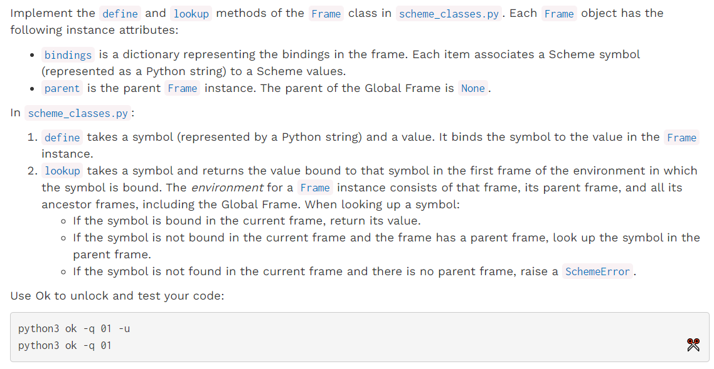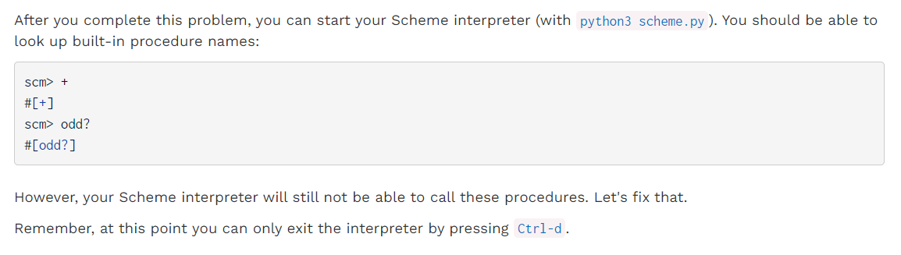

```python
class Frame:
    """An environment frame binds Scheme symbols to Scheme values."""

    def __init__(self, parent):
        """An empty frame with parent frame PARENT (which may be None)."""
        self.bindings = {}
        self.parent = parent

    def __repr__(self):
        if self.parent is None:
            return '<Global Frame>'
        s = sorted(['{0}: {1}'.format(k, v) for k, v in self.bindings.items()])
        return '<{{{0}}} -> {1}>'.format(', '.join(s), repr(self.parent))

    def define(self, symbol, value):
        """Define Scheme SYMBOL to have VALUE."""
        # BEGIN PROBLEM 1
        "*** YOUR CODE HERE ***"
        self.bindings[symbol] = value
        # END PROBLEM 1

    def lookup(self, symbol):
        """Return the value bound to SYMBOL. Errors if SYMBOL is not found."""
        # BEGIN PROBLEM 1
        "*** YOUR CODE HERE ***"
        # Find the symbol first in its own environment, and then in its ancestors'
        if symbol in self.bindings:
            return self.bindings[symbol]
        else:
            try:
                return self.parent.lookup(symbol)
            except:
                raise SchemeError('unknown identifier: {0}'.format(symbol))
                # END PROBLEM 1

    def make_child_frame(self, formals, vals):
        """Return a new local frame whose parent is SELF, in which the symbols
        in a Scheme list of formal parameters FORMALS are bound to the Scheme
        values in the Scheme list VALS. Both FORMALS and VALS are represented
        as Pairs. Raise an error if too many or too few vals are given.

        >>> env = create_global_frame()
        >>> formals, expressions = read_line('(a b c)'), read_line('(1 2 3)')
        >>> env.make_child_frame(formals, expressions)
        <{a: 1, b: 2, c: 3} -> <Global Frame>>
        """
        if len(formals) != len(vals):
            raise SchemeError('Incorrect number of arguments to function call')
            # BEGIN PROBLEM 8
        "*** YOUR CODE HERE ***"
# END PROBLEM 8
```
**Program Output**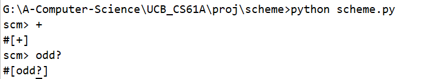


## Problem 2: BuiltinProcedure
> 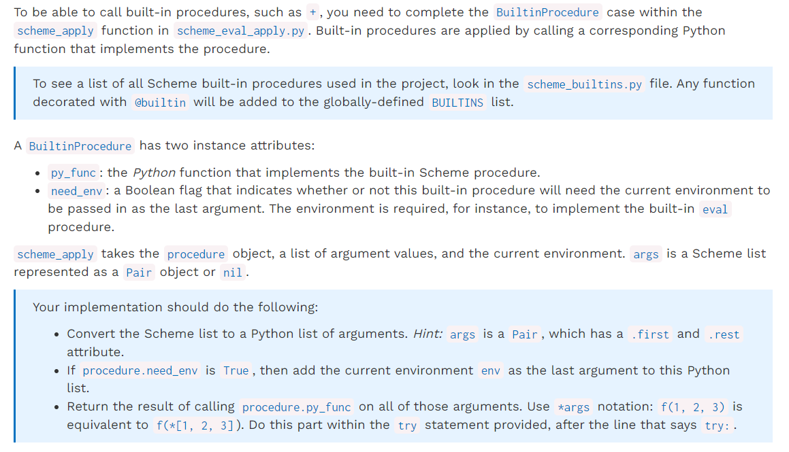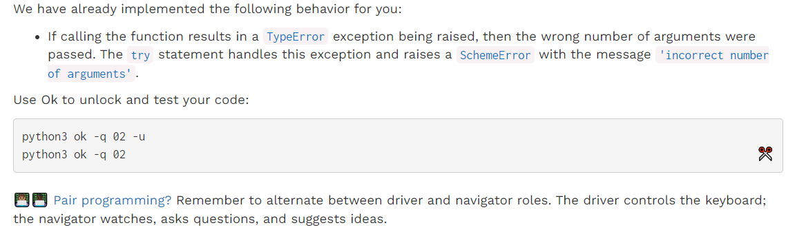

**scheme_eval_apply.py - Starter Codes**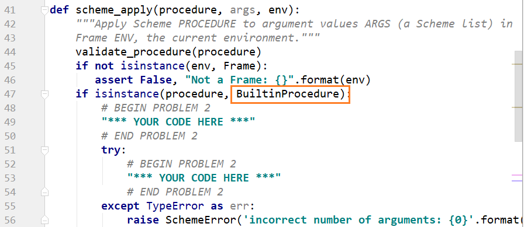
**scheme_classes.py - BuiltinProcedure**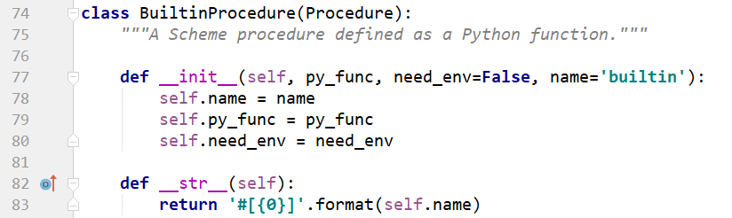
**WWPD Problems**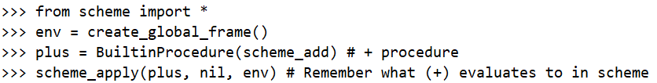
在`Scheme`中, `(+)`(也就是调用`+`这个`procedure`, 结果是$0$)
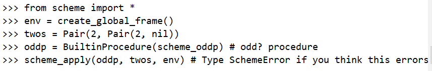
相当于`(odd? 2 2)`, 结果是`SchemeError`
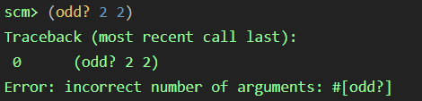
```python
def scheme_apply(procedure, args, env):
    ... 
	if isinstance(procedure, BuiltinProcedure):
        # BEGIN PROBLEM 2
        "*** YOUR CODE HERE ***"
        # 1. Convert the args(Pair), which is a scheme list(recursive linked list)
        # into the python list(flattening process)
        arg_list = []
        p = args
        # Careful here we need nil object to terminate the while loop
        while p != nil:
            arg_list.append(p.first)
            p = p.rest
        # 2. If procedure.need_env is True, then append the env argument to the arg_list
        if procedure.need_env:
            arg_list.append(env)
        # END PROBLEM 2
        try:
            # BEGIN PROBLEM 2
            "*** YOUR CODE HERE ***"
            return procedure.py_func(*arg_list)
            # END PROBLEM 2
        except TypeError as err:
            raise SchemeError('incorrect number of arguments: {0}'.format(procedure))
    ...
```
**scheme_builtins.py**⭐⭐⭐⭐⭐在`scheme_builtins.py`中，我们注意到有很多`@builtin(arguments)`的语句，这在[Function Decorators](https://www.yuque.com/alexman/ac5oth/icbxe7gtlb18qt6k#rYG0o)一节中已经介绍过。


## Problem 3: Evaluate Scheme Expression
> 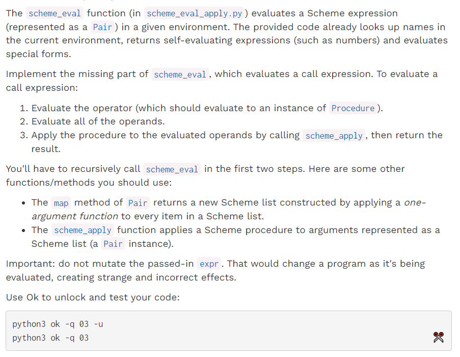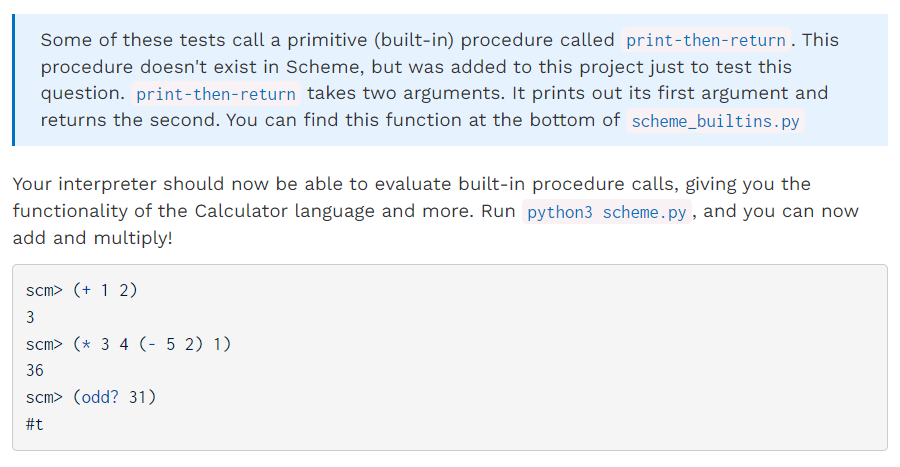

**Call Expression Review**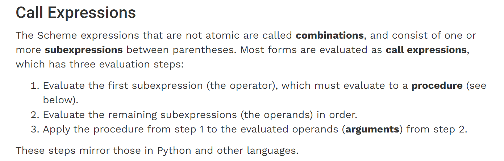
**scheme_eval - skeleton codes**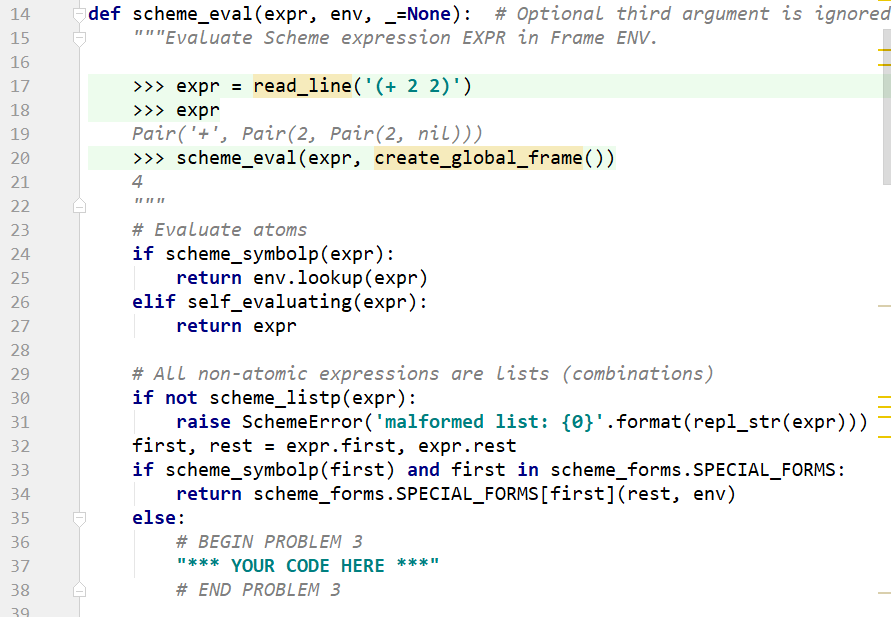
```python
def scheme_eval(expr, env, _=None):  # Optional third argument is ignored
    """Evaluate Scheme expression EXPR in Frame ENV.

    >>> expr = read_line('(+ 2 2)')
    >>> expr
    Pair('+', Pair(2, Pair(2, nil)))
    >>> scheme_eval(expr, create_global_frame())
    4
    """
    # Here we see expr is the result of scheme_read parsing process,
    # which return the data structure (Pair) for the expression to be evaluated.

    # 1. Evaluate atoms，evaluate the operator
    # Look up the name of the variables, it contains the builtin procedures
    if scheme_symbolp(expr):
        return env.lookup(expr) # Look up the procedure in the global frame
    # Evaluate the self-evaluating expression
    elif self_evaluating(expr):
        return expr

    # All non-atomic expressions are lists (combinations)
    if not scheme_listp(expr):
        raise SchemeError('malformed list: {0}'.format(repl_str(expr)))
    first, rest = expr.first, expr.rest
    # 如果expr以 ' (quote)开头，比如 '(1 2 3), 就是一个Pair(1, Pair(2, Pair(3, nil0)))
    # ' 也是special form的一种
    # 如果是special forms
    if scheme_symbolp(first) and first in scheme_forms.SPECIAL_FORMS:
        return scheme_forms.SPECIAL_FORMS[first](rest, env)
    else:
        # BEGIN PROBLEM 3
        "*** YOUR CODE HERE ***"
        # 1. Evaluate/validate the operator -> Procedure instance
        operator = scheme_eval(first, env)
        # validate that the operator is the procedure
        validate_procedure(operator)
        # 2. Evaluate the operands
        # 这里比较讨巧，查看`Pair Class`之后我们发现，Pair.map(fn)方法只能接受一个参数
        # 且调用参数时是fn(self.first), 这表明我们.map之前的变量应该是rest，而不是rest.first
        # 因为.first在Pair.map(fn)中被访问了。
        operands = rest.map(lambda x: scheme_eval(x, env))
        # 3. Apply the procedure by calling scheme_apply
        return scheme_apply(operator, operands, env)
        # END PROBLEM 3
```


## Problem 4: define
> 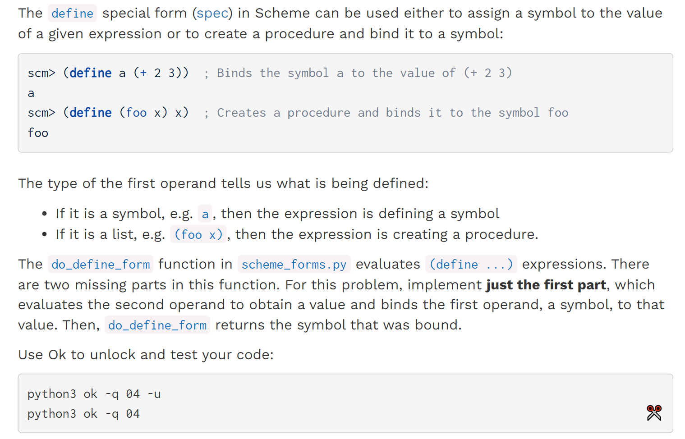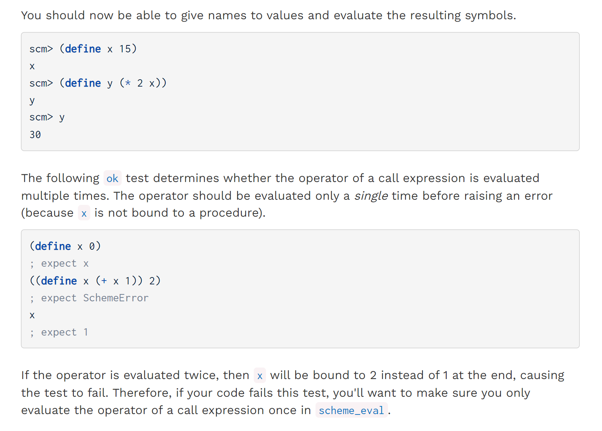

**scheme_forms.py**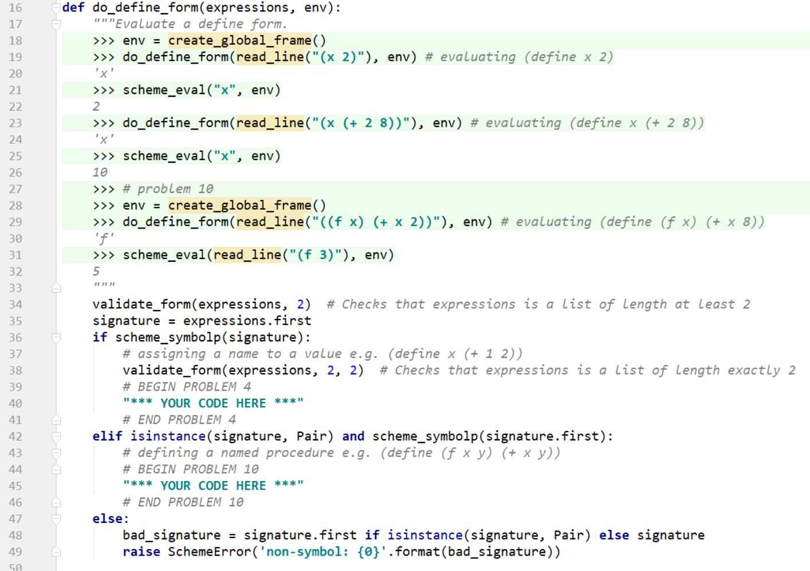
**WWPD Problem**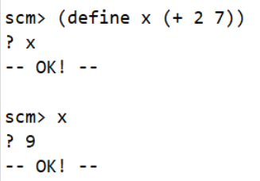
```python
def do_define_form(expressions, env):
    """Evaluate a define form.
    >>> env = create_global_frame()
    >>> do_define_form(read_line("(x 2)"), env) # evaluating (define x 2)
    'x'
    >>> scheme_eval("x", env)
    2
    >>> do_define_form(read_line("(x (+ 2 8))"), env) # evaluating (define x (+ 2 8))
    'x'
    >>> scheme_eval("x", env)
    10
    >>> # problem 10
    >>> env = create_global_frame()
    >>> do_define_form(read_line("((f x) (+ x 2))"), env) # evaluating (define (f x) (+ x 8))
    'f'
    >>> scheme_eval(read_line("(f 3)"), env)
    5
    """
    validate_form(expressions, 2)  # Checks that expressions is a list of length at least 2
    signature = expressions.first
    if scheme_symbolp(signature):
        # assigning a name to a value e.g. (define x (+ 1 2))
        validate_form(expressions, 2, 2)  # Checks that expressions is a list of length exactly 2
        # BEGIN PROBLEM 4
        "*** YOUR CODE HERE ***"
        # 注意这里expressions.rest.first, 而不能写成expressions.rest, 原因是scheme_eval的参数
        # expr必须是Pair(+, Pair(2, Pair(3, nil)))之类的形式，而不能是
        # Pair(Pair(+, Pair(2, Pair(3, nil))), Pair(2, nil)), 所以我们需要使用.first提取出我们
        # 能够通过scheme_eval计算出的sub-expression
        env.define(signature, scheme_eval(expressions.rest.first, env))
        return signature
        # END PROBLEM 4
    elif isinstance(signature, Pair) and scheme_symbolp(signature.first):
        # defining a named procedure e.g. (define (f x y) (+ x y))
        # BEGIN PROBLEM 10
        "*** YOUR CODE HERE ***"
        # END PROBLEM 10
    else:
        bad_signature = signature.first if isinstance(signature, Pair) else signature
        raise SchemeError('non-symbol: {0}'.format(bad_signature))

```


## Problem 5: quote
> 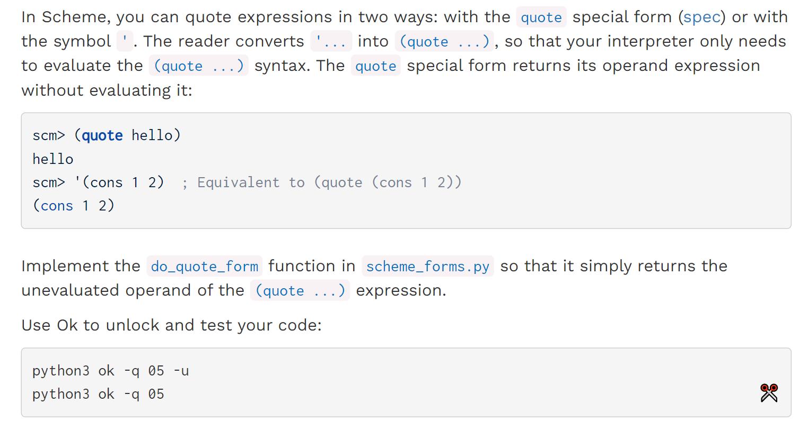

**scheme_forms.py- skeleton**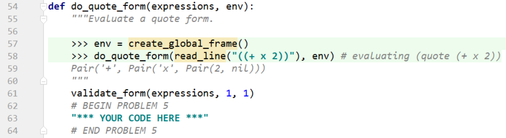
**Try it Out!**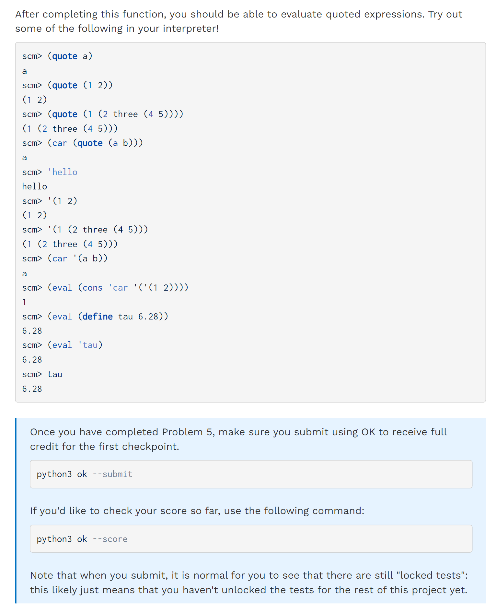
```python
def do_quote_form(expressions, env):
    """Evaluate a quote form.

    >>> env = create_global_frame()
    >>> do_quote_form(read_line("((+ x 2))"), env) # evaluating (quote (+ x 2))
    Pair('+', Pair('x', Pair(2, nil)))
    """
    validate_form(expressions, 1, 1)
    # BEGIN PROBLEM 5
    "*** YOUR CODE HERE ***"
    # 将quote之后的表达式原封不动的返回就行, 对应的就是expressions.first
    return expressions.first
    # END PROBLEM 5
```


# Part 2: Procedures
## Concepts
> 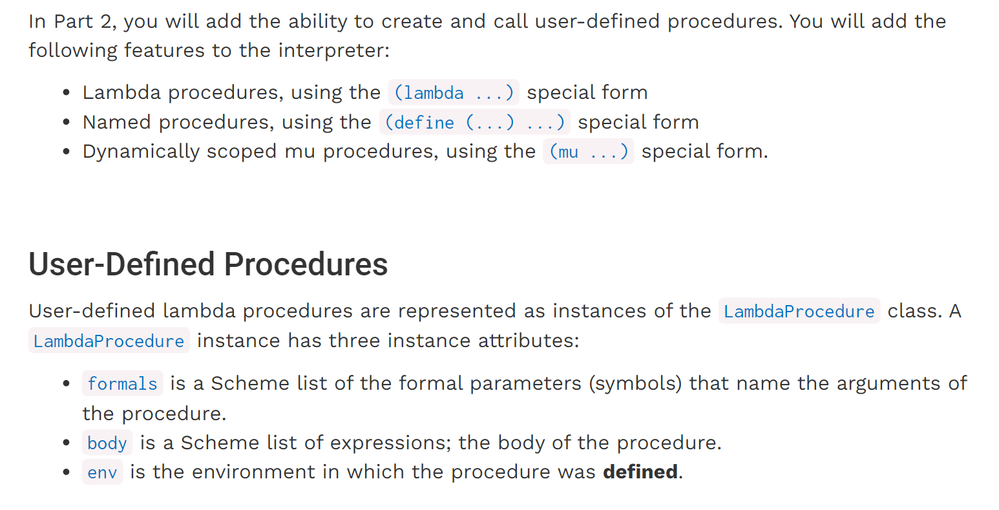


## Problem 6: do_begin_form
> 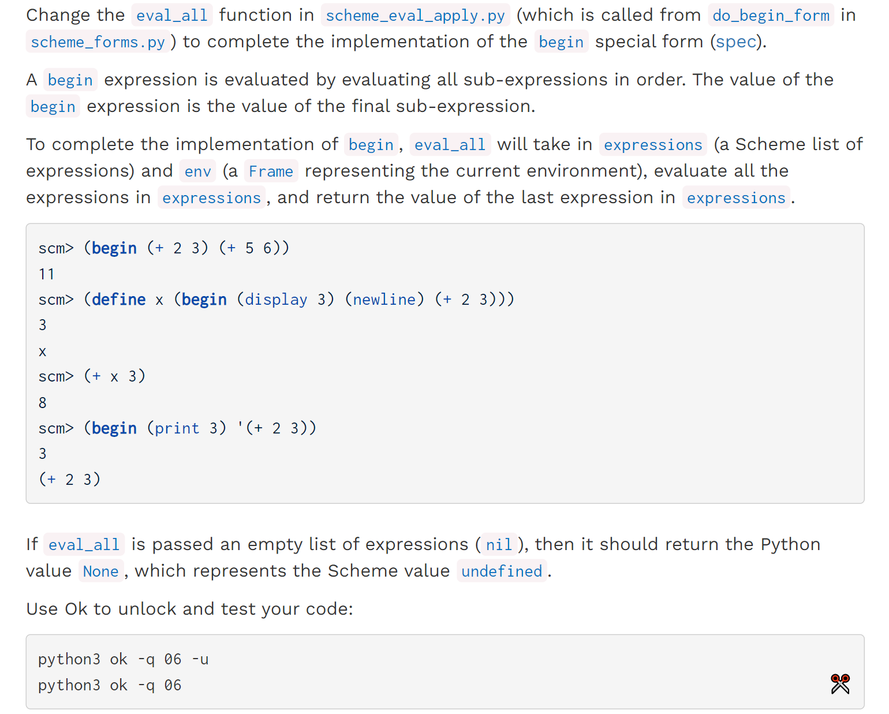

```python
def eval_all(expressions, env):
    """Evaluate each expression in the Scheme list EXPRESSIONS in
    Frame ENV (the current environment) and return the value of the last.

    >>> eval_all(read_line("(1)"), create_global_frame())
    1
    >>> eval_all(read_line("(1 2)"), create_global_frame())
    2
    >>> x = eval_all(read_line("((print 1) 2)"), create_global_frame())
    1
    >>> x
    2
    >>> eval_all(read_line("((define x 2) x)"), create_global_frame())
    2
    """
    # BEGIN PROBLEM 6
    if expressions == nil:
        return None
    p = expressions
    while p.rest != nil:
        scheme_eval(p.first, env)
        p = p.rest
    return scheme_eval(p.first, env)
    # END PROBLEM 6
```


## Problem 7: do_lambda_form
> 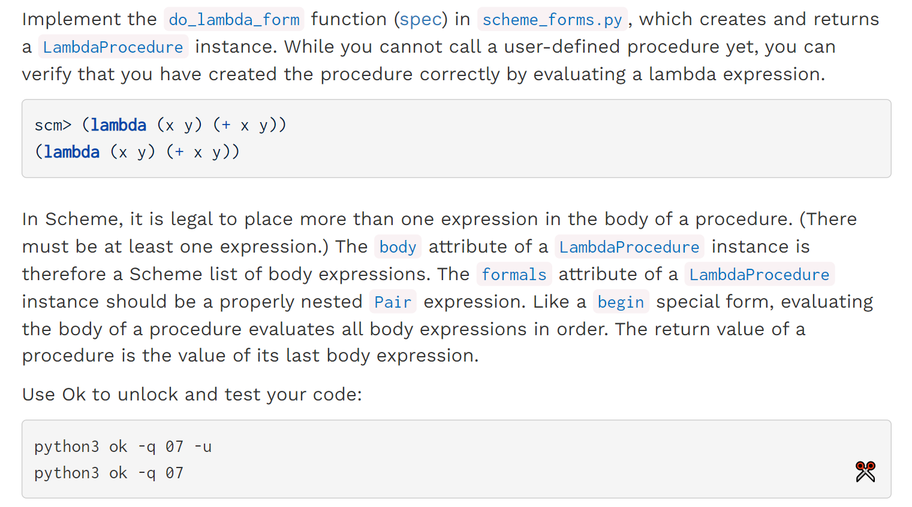

```python
def do_lambda_form(expressions, env):
    """Evaluate a lambda form.

    >>> env = create_global_frame()
    >>> do_lambda_form(read_line("((x) (+ x 2))"), env) # evaluating (lambda (x) (+ x 2))
    LambdaProcedure(Pair('x', nil), Pair(Pair('+', Pair('x', Pair(2, nil))), nil), <Global Frame>)
    """
    validate_form(expressions, 2)
    formals = expressions.first
    validate_formals(formals)
    # BEGIN PROBLEM 7
    "*** YOUR CODE HERE ***"
    return LambdaProcedure(formals, expressions.rest, env)
    # END PROBLEM 7

```


## Problem 8: Child Frame
> 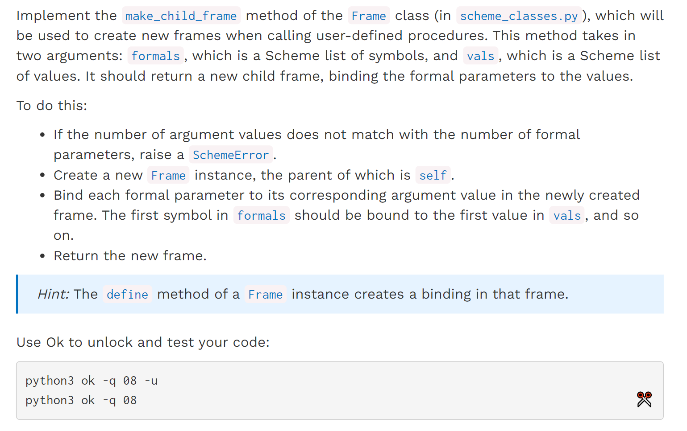

```python
def make_child_frame(self, formals, vals):
    """Return a new local frame whose parent is SELF, in which the symbols
    in a Scheme list of formal parameters FORMALS are bound to the Scheme
    values in the Scheme list VALS. Both FORMALS and VALS are represented
    as Pairs. Raise an error if too many or too few vals are given.

    >>> env = create_global_frame()
    >>> formals, expressions = read_line('(a b c)'), read_line('(1 2 3)')
    >>> env.make_child_frame(formals, expressions)
    <{a: 1, b: 2, c: 3} -> <Global Frame>>
    """
    if len(formals) != len(vals):
        raise SchemeError('Incorrect number of arguments to function call')
    # BEGIN PROBLEM 8
    "*** YOUR CODE HERE ***"
    new_frame = Frame(self)
    k = formals
    v = vals
    while k != nil and v != nil:
        # k.first就是字符串，v.first就是具体的值(vals是经过scheme_eval之后的对象)
        new_frame.define(k.first, v.first)
        k = k.rest
        v = v.rest
    return new_frame
    # END PROBLEM 8
```


## Problem 9: Apply LambdaProcedure
> 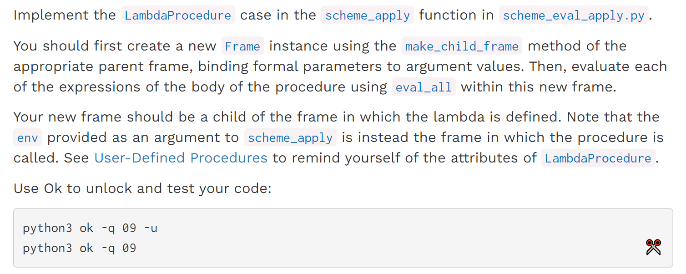


## Problem 10: User-defined Procedure
> 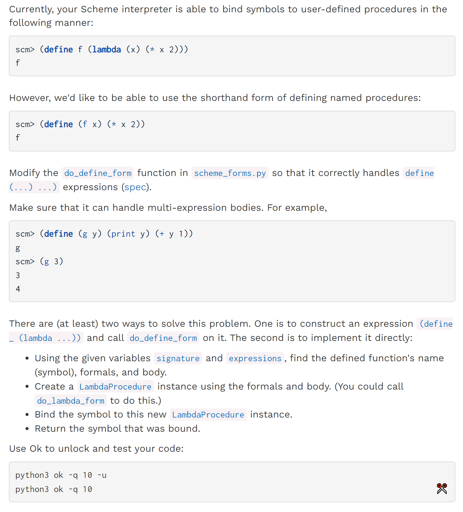


## Problem 11: Lexical/Dynamic Scoping
> 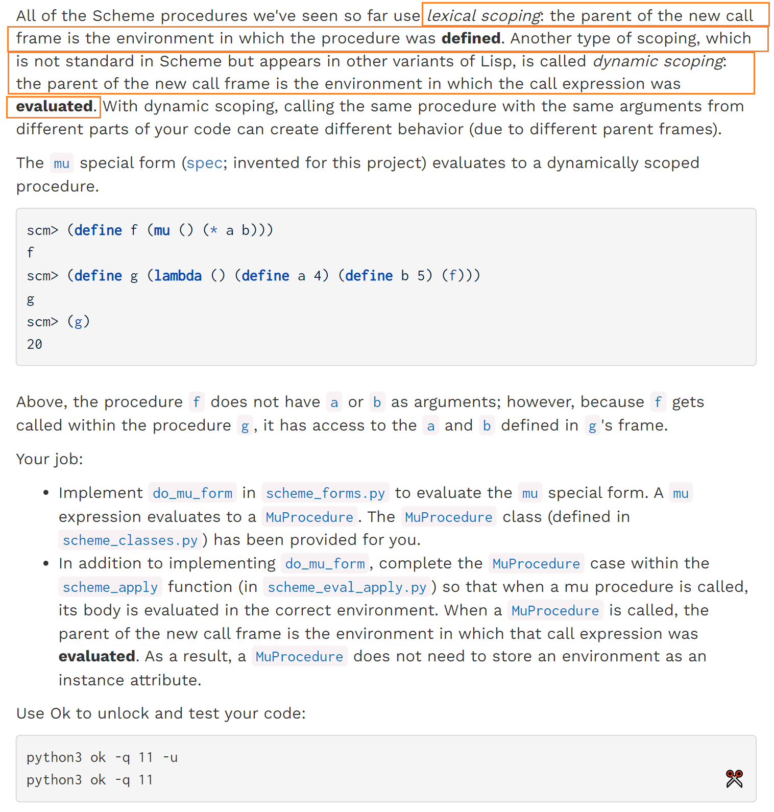


# Part 3: Special Forms
## Concepts
> 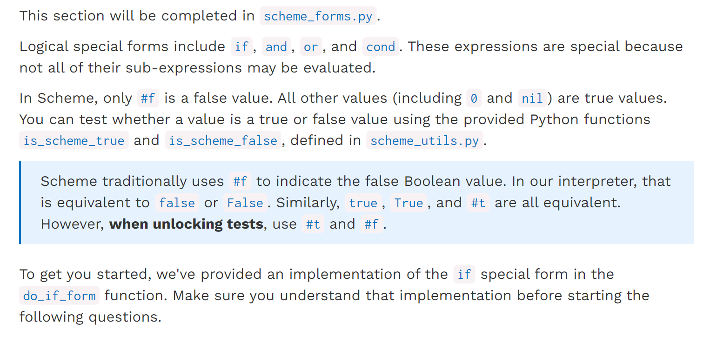


# Part 4: Write Some Scheme
## Scheme Editor
> 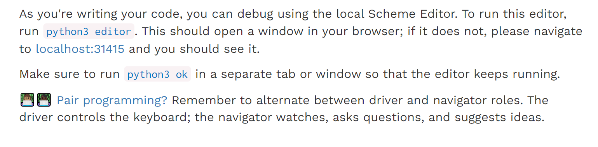


# Extra Credit
> 


# Optional Problems
> 

