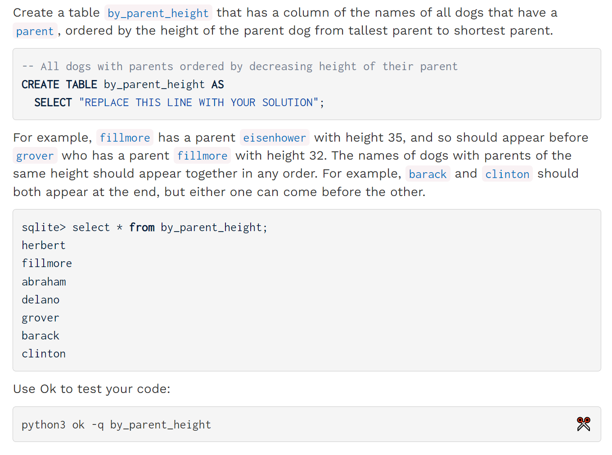
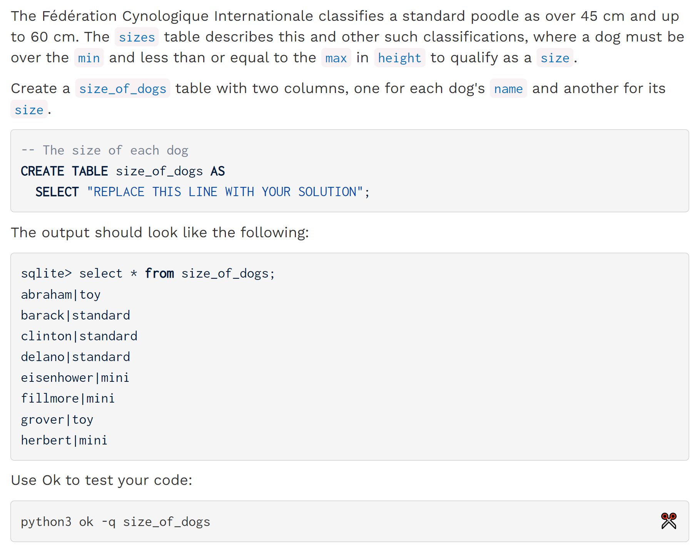
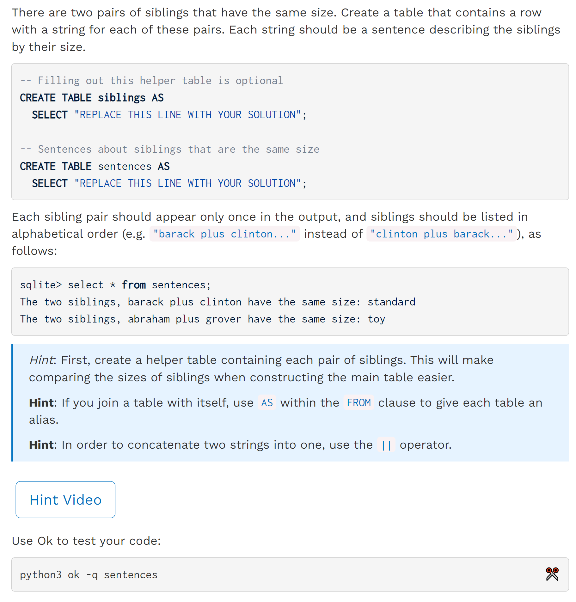

[released_hw_hw10_hw10.zip](https://www.yuque.com/attachments/yuque/0/2023/zip/12393765/1673001202677-530584ad-11e0-4837-ba05-6be7b2c9772b.zip)
[released_hw_sol-hw10_hw10.zip](https://www.yuque.com/attachments/yuque/0/2023/zip/12393765/1673001202683-22d8f792-56bd-49d0-b4c6-8946dd7f2c41.zip)
[Homework 10 _ CS 61A Fall 2022.pdf](https://www.yuque.com/attachments/yuque/0/2023/pdf/12393765/1673001202475-fdb49480-e010-471a-b83c-cc4f448bba71.pdf)


# Dog Data
> 


# Q1 By Parent Height
> 
> 注意每条狗只能有一个`parent`, 这简化了我们的排序，只需要使用`order by`关键字对`parent`的`height`进行排序即可。
> **Hint:** [https://www.youtube.com/watch?v=wRRI2tn4zdo](https://www.youtube.com/watch?v=wRRI2tn4zdo)

```sql
-- All dogs with parents ordered by decreasing height of their parent
CREATE TABLE by_parent_height AS
  SELECT "REPLACE THIS LINE WITH YOUR SOLUTION";
```
```sql
-- All dogs with parents ordered by decreasing height of their parent
CREATE TABLE by_parent_height AS
  SELECT a.child as parent_name_ranking
   from parents as a, dogs as b
   where a.parent = b.name     -- 表明我们需要parent的height信息，所以我们需要剔除a.parent != b.name 的rows
   order by b.height DESC ;
```
```sql
-- All dogs with parents ordered by decreasing height of their parent
CREATE TABLE by_parent_height AS
  SELECT child FROM parents, dogs WHERE name = parent ORDER BY height desc;
```

# Q2 Size of Dogs
> 
> Hint: 

```sql
-- The size of each dog
CREATE TABLE size_of_dogs AS
  SELECT "REPLACE THIS LINE WITH YOUR SOLUTION";
```
```sql
-- The size of each dog
CREATE TABLE size_of_dogs AS
  SELECT name, size from dogs, sizes
    where height <= max and height > min;
```
```sql
-- The size of each dog
CREATE TABLE size_of_dogs AS
  SELECT name, size FROM dogs, sizes
    WHERE height > min AND height <= max;
```

# Q3 Sentences
> **Hint1:** [Choose all pairs of siblings](https://www.yuque.com/alexman/ac5oth/sb0dq224wfwo19ya#b2Kxy)
> Hint2: 

```sql
-- Filling out this helper table is optional
CREATE TABLE siblings AS
  SELECT "REPLACE THIS LINE WITH YOUR SOLUTION";

-- Sentences about siblings that are the same size
CREATE TABLE sentences AS
  SELECT "REPLACE THIS LINE WITH YOUR SOLUTION";
```
```sql
CREATE TABLE parents AS
  SELECT "abraham" AS parent, "barack" AS child UNION
  SELECT "abraham"          , "clinton"         UNION
  SELECT "delano"           , "herbert"         UNION
  SELECT "fillmore"         , "abraham"         UNION
  SELECT "fillmore"         , "delano"          UNION
  SELECT "fillmore"         , "grover"          UNION
  SELECT "eisenhower"       , "fillmore";

CREATE TABLE dogs AS
  SELECT "abraham" AS name, "long" AS fur, 26 AS height UNION
  SELECT "barack"         , "short"      , 52           UNION
  SELECT "clinton"        , "long"       , 47           UNION
  SELECT "delano"         , "long"       , 46           UNION
  SELECT "eisenhower"     , "short"      , 35           UNION
  SELECT "fillmore"       , "curly"      , 32           UNION
  SELECT "grover"         , "short"      , 28           UNION
  SELECT "herbert"        , "curly"      , 31;

CREATE TABLE sizes AS
  SELECT "toy" AS size, 24 AS min, 28 AS max UNION
  SELECT "mini"       , 28       , 35        UNION
  SELECT "medium"     , 35       , 45        UNION
  SELECT "standard"   , 45       , 60;


-- All dogs with parents ordered by decreasing height of their parent
CREATE TABLE by_parent_height AS
  SELECT a.child as parent_name_ranking
   from parents as a, dogs as b
   where a.parent = b.name
   order by b.height DESC ;


-- The size of each dog
CREATE TABLE size_of_dogs AS
  SELECT name, size from dogs, sizes
    where height <= max and height > min;


-- Filling out this helper table is optional
CREATE TABLE siblings AS
  SELECT a.child as first, b.child as second
    from parents as a, parents as b
    where a.parent = b.parent and a.child < b.child;

-- Sentences about siblings that are the same size
CREATE TABLE sentences AS
  SELECT "The two siblings, " || a.name || " plus " || b.name || " have the same size: " || a.size
   from siblings as si, size_of_dogs as a, size_of_dogs as b
   where si.first = a.name
   and si.second = b.name
   and a.size = b.size;
```
```sql
CREATE TABLE parents AS
  SELECT "abraham" AS parent, "barack" AS child UNION
  SELECT "abraham"          , "clinton"         UNION
  SELECT "delano"           , "herbert"         UNION
  SELECT "fillmore"         , "abraham"         UNION
  SELECT "fillmore"         , "delano"          UNION
  SELECT "fillmore"         , "grover"          UNION
  SELECT "eisenhower"       , "fillmore";

CREATE TABLE dogs AS
  SELECT "abraham" AS name, "long" AS fur, 26 AS height UNION
  SELECT "barack"         , "short"      , 52           UNION
  SELECT "clinton"        , "long"       , 47           UNION
  SELECT "delano"         , "long"       , 46           UNION
  SELECT "eisenhower"     , "short"      , 35           UNION
  SELECT "fillmore"       , "curly"      , 32           UNION
  SELECT "grover"         , "short"      , 28           UNION
  SELECT "herbert"        , "curly"      , 31;

CREATE TABLE sizes AS
  SELECT "toy" AS size, 24 AS min, 28 AS max UNION
  SELECT "mini"       , 28       , 35        UNION
  SELECT "medium"     , 35       , 45        UNION
  SELECT "standard"   , 45       , 60;


-- All dogs with parents ordered by decreasing height of their parent
CREATE TABLE by_parent_height AS
  SELECT child FROM parents, dogs WHERE name = parent ORDER BY height desc;


-- The size of each dog
CREATE TABLE size_of_dogs AS
  SELECT name, size FROM dogs, sizes
    WHERE height > min AND height <= max;


-- Filling out this helper table is optional
CREATE TABLE siblings AS
  SELECT a.child AS first, b.child AS second FROM parents AS a, parents AS b
    WHERE a.parent = b.parent AND a.child < b.child;

-- Sentences about siblings that are the same size
CREATE TABLE sentences AS
  SELECT "The two siblings, " || first || " plus " || second || " have the same size: " || a.size
    FROM siblings, size_of_dogs AS a, size_of_dogs AS b
    WHERE a.size = b.size AND a.name = first AND b.name = second;
```
