# 1 Databases
[released_assets_slides_37-Databases_full.pdf](https://www.yuque.com/attachments/yuque/0/2023/pdf/12393765/1673445526491-3204eb4c-8c5d-42ad-a169-41a06f77328b.pdf)

## Create Tables
> 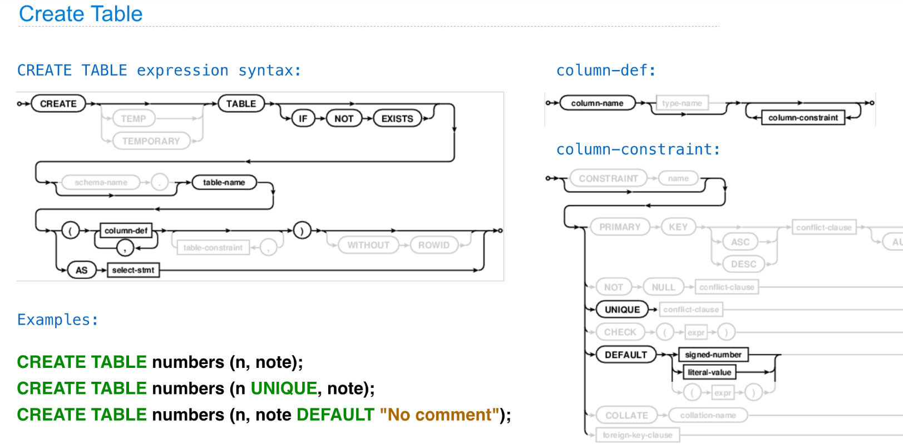

## Drop Tables
> 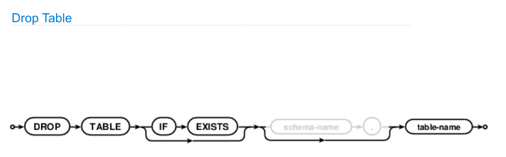

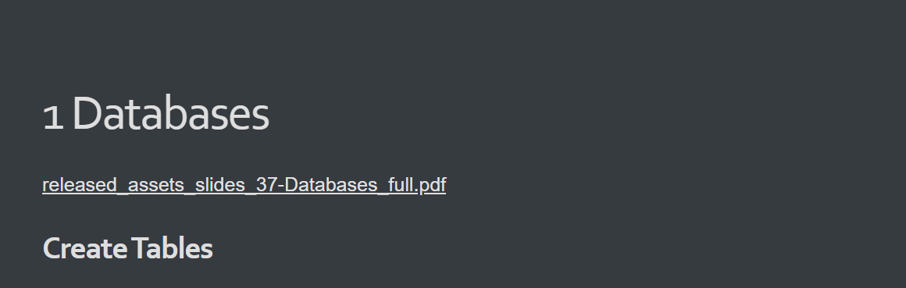

## Insert Tables
> 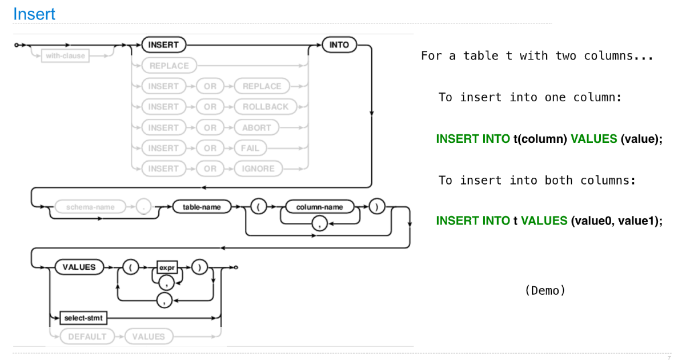

**Demo**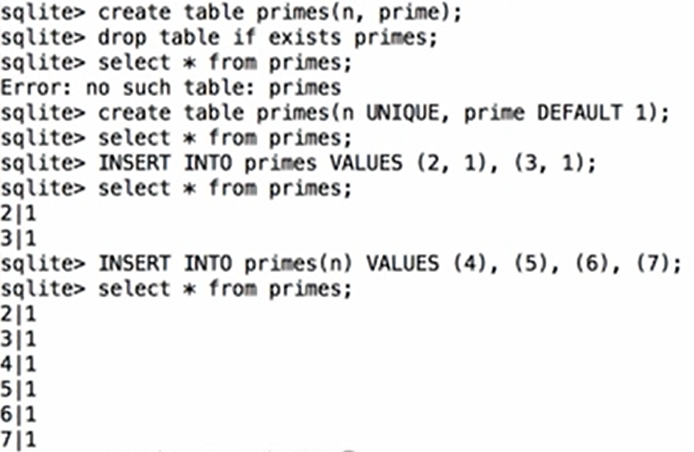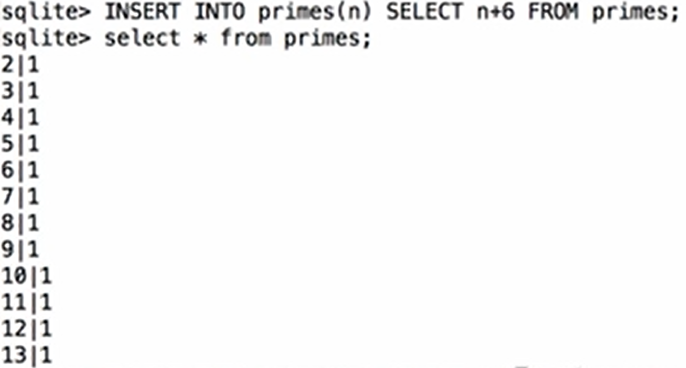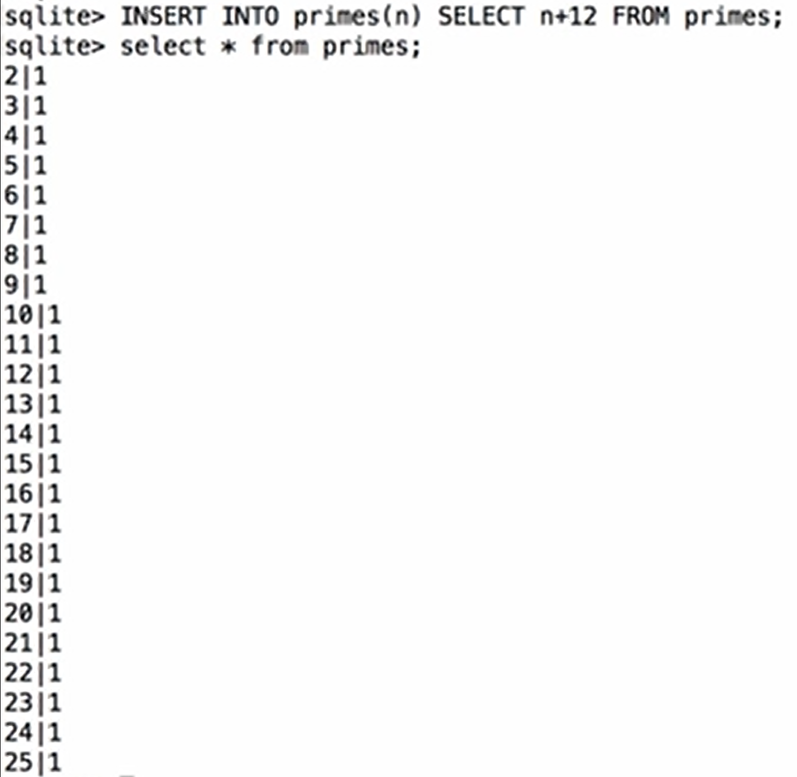

## Update Tables
> 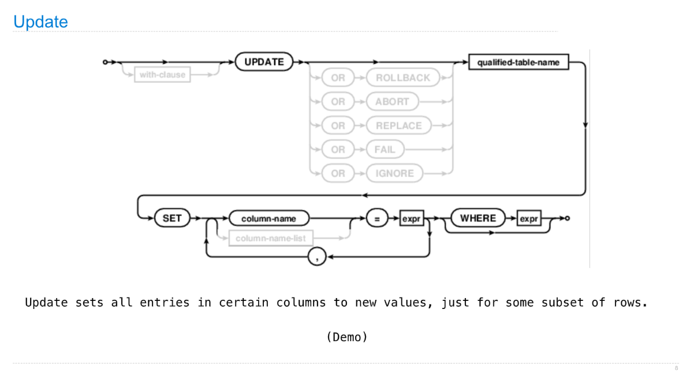

**Demo**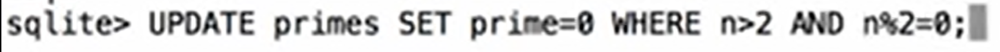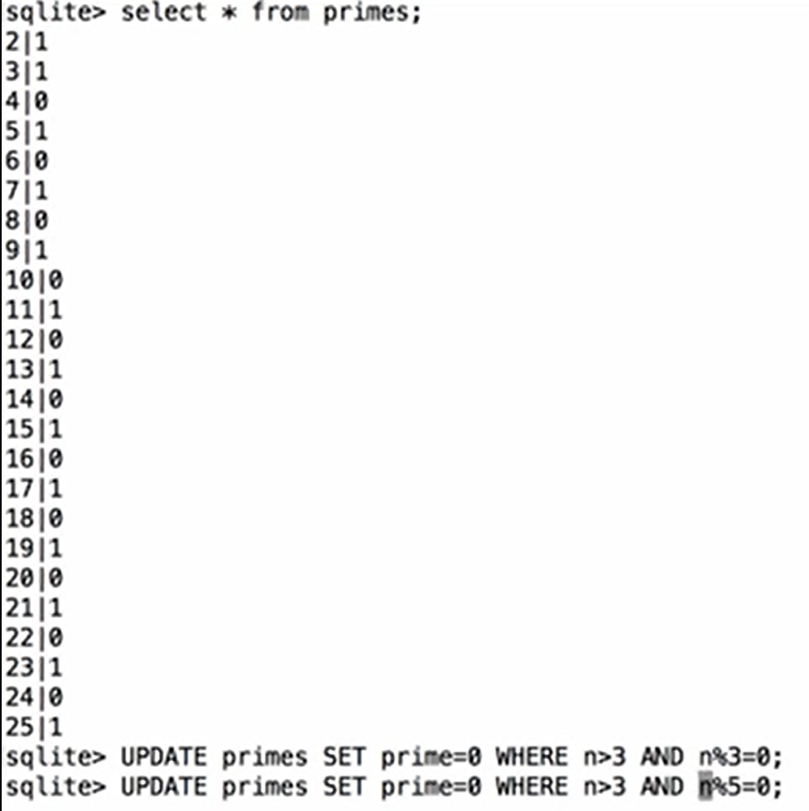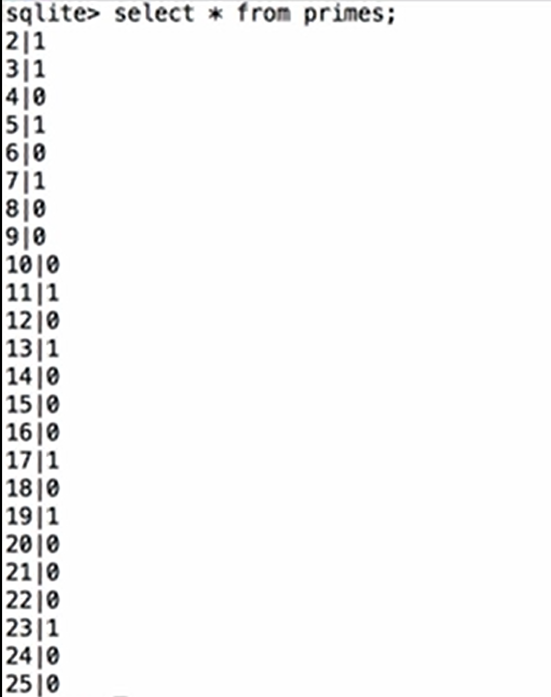

## Delete Tables
> 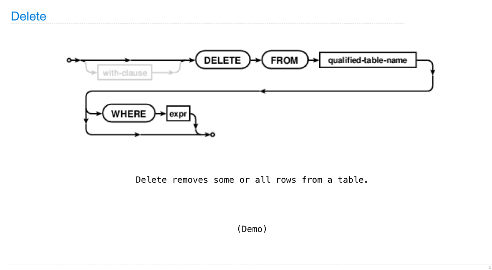

**Demo**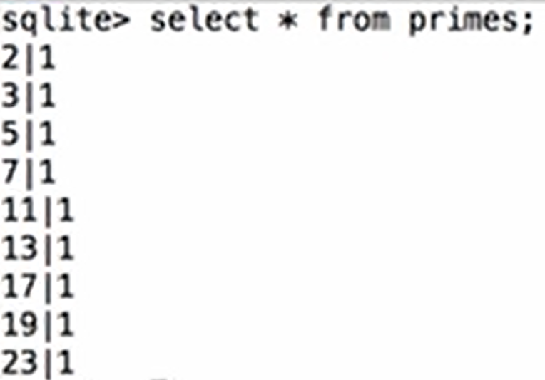

## Python&SQL(Skipped)
> See online documentations about pymysql.

# 2 Final Examples
[released_assets_slides_38-Final_Examples_full.pdf](https://www.yuque.com/attachments/yuque/0/2023/pdf/12393765/1673446225798-e679efdb-fdf9-47a7-9e33-3137f2e57ab0.pdf)

# 3 Conclusion(Skipped)
[released_assets_slides_39-Conclusion_full.pdf](https://www.yuque.com/attachments/yuque/0/2023/pdf/12393765/1673446233426-b740c4c9-36ee-4bfd-87f7-4f2209cf33cb.pdf)

