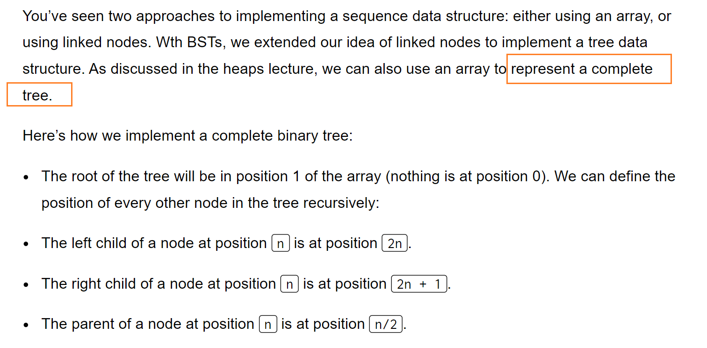
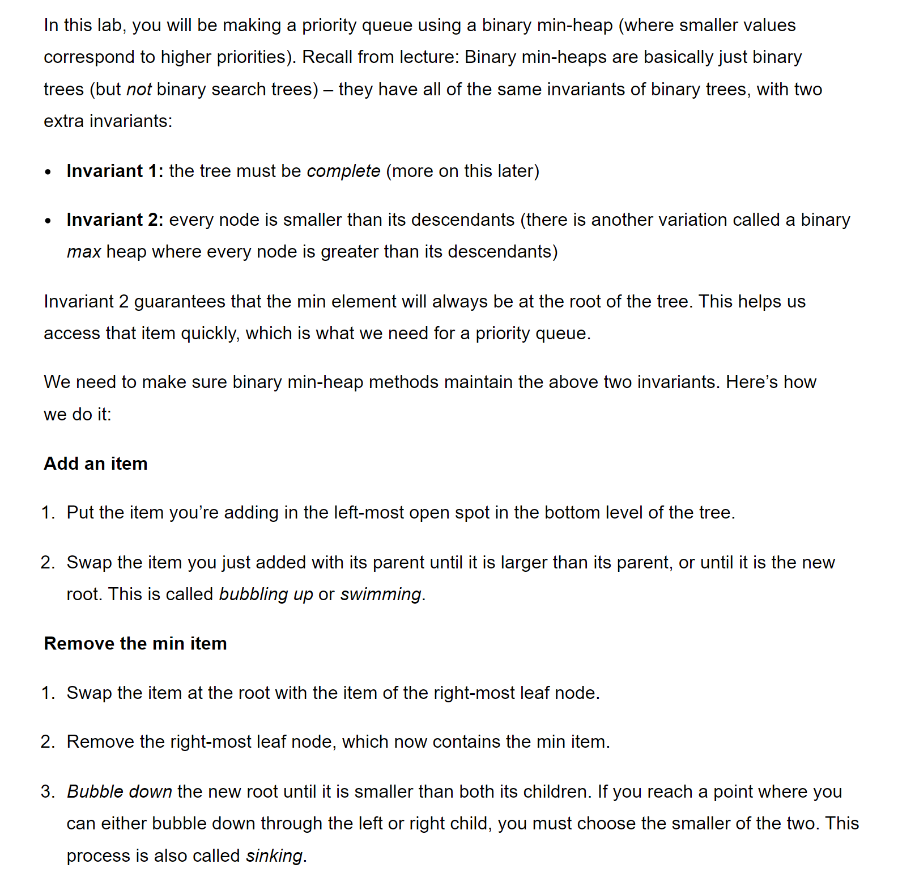
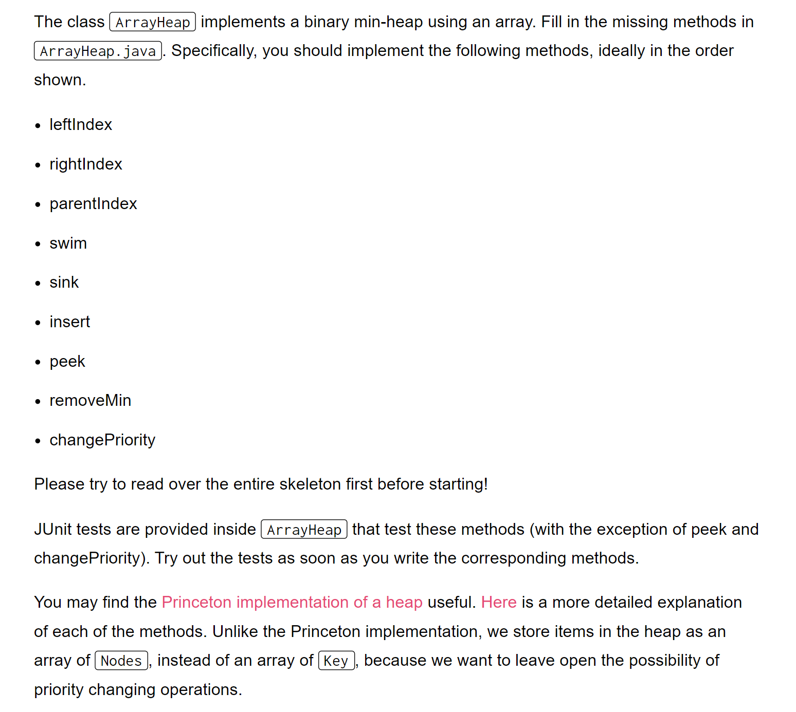
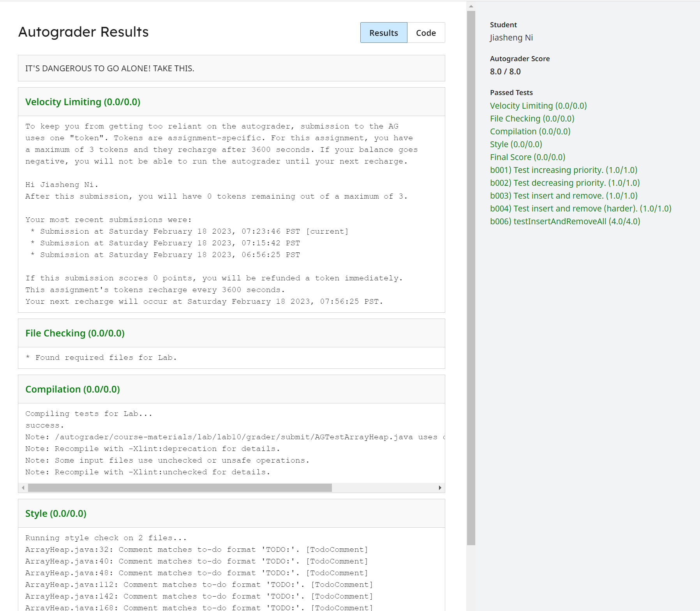

[Lab 10_ Priority Queues _ CS 61B Spring 2018.pdf](https://www.yuque.com/attachments/yuque/0/2023/pdf/12393765/1676300915929-aa088c4e-4ea8-48e2-956a-04024eed5835.pdf)
[lab10.zip](https://www.yuque.com/attachments/yuque/0/2023/zip/12393765/1676645622288-e02af4ae-82a5-4bf3-a20b-73d634c6009a.zip)

# Representing a Tree With an Array
> 
> 注意`ArrayHeap`只能代表`Complete Tree`, 读者可以自行思考为什么。

```java
import org.junit.Test;
import static org.junit.Assert.*;

/**
 * A Generic heap class. Unlike Java's priority queue, this heap doesn't just
 * store Comparable objects. Instead, it can store any type of object
 * (represented by type T), along with a priority value. Why do it this way? It
 * will be useful later on in the class...
 */
public class ArrayHeap<T> implements ExtrinsicPQ<T> {
    private Node[] contents;
    private int size;

    public ArrayHeap() {
        contents = new ArrayHeap.Node[16];

        /* Add a dummy item at the front of the ArrayHeap so that the getLeft,
         * getRight, and parent methods are nicer. */
        contents[0] = null;

        /* Even though there is an empty spot at the front, we still consider
         * the size to be 0 since nothing has been inserted yet. */
        size = 0;
    }

    /**
     * Returns the index of the node to the left of the node at i.
     */
    private static int leftIndex(int i) {
        /* TODO: Your code here! */
        return 0;
    }

    /**
     * Returns the index of the node to the right of the node at i.
     */
    private static int rightIndex(int i) {
        /* TODO: Your code here! */
        return 0;
    }

    /**
     * Returns the index of the node that is the parent of the node at i.
     */
    private static int parentIndex(int i) {
        /* TODO: Your code here! */
        return 0;
    }

    /**
     * Gets the node at the ith index, or returns null if the index is out of
     * bounds.
     */
    private Node getNode(int index) {
        if (!inBounds(index)) {
            return null;
        }
        return contents[index];
    }

    /**
     * Returns true if the index corresponds to a valid item. For example, if
     * we have 5 items, then the valid indices are 1, 2, 3, 4, 5. Index 0 is
     * invalid because we leave the 0th entry blank.
     */
    private boolean inBounds(int index) {
        if ((index > size) || (index < 1)) {
            return false;
        }
        return true;
    }

    /**
     * Swap the nodes at the two indices.
     */
    private void swap(int index1, int index2) {
        Node node1 = getNode(index1);
        Node node2 = getNode(index2);
        contents[index1] = node2;
        contents[index2] = node1;
    }


    /**
     * Returns the index of the node with smaller priority. Precondition: not
     * both nodes are null.
     */
    private int min(int index1, int index2) {
        Node node1 = getNode(index1);
        Node node2 = getNode(index2);
        if (node1 == null) {
            return index2;
        } else if (node2 == null) {
            return index1;
        } else if (node1.myPriority < node2.myPriority) {
            return index1;
        } else {
            return index2;
        }
    }


    /**
     * Bubbles up the node currently at the given index.
     */
    private void swim(int index) {
        // Throws an exception if index is invalid. DON'T CHANGE THIS LINE.
        validateSinkSwimArg(index);

        /** TODO: Your code here. */
        return;
    }

    /**
     * Bubbles down the node currently at the given index.
     */
    private void sink(int index) {
        // Throws an exception if index is invalid. DON'T CHANGE THIS LINE.
        validateSinkSwimArg(index);

        /** TODO: Your code here. */
        return;
    }

    /**
     * Inserts an item with the given priority value. This is enqueue, or offer.
     * To implement this method, add it to the end of the ArrayList, then swim it.
     */
    @Override
    public void insert(T item, double priority) {
        /* If the array is totally full, resize. */
        if (size + 1 == contents.length) {
            resize(contents.length * 2);
        }

        /* TODO: Your code here! */
    }

    /**
     * Returns the Node with the smallest priority value, but does not remove it
     * from the heap. To implement this, return the item in the 1st position of the ArrayList.
     */
    @Override
    public T peek() {
        /* TODO: Your code here! */
        return null;
    }

    /**
     * Returns the Node with the smallest priority value, and removes it from
     * the heap. This is dequeue, or poll. To implement this, swap the last
     * item from the heap into the root position, then sink the root. This is
     * equivalent to firing the president of the company, taking the last
     * person on the list on payroll, making them president, and then demoting
     * them repeatedly. Make sure to avoid loitering by nulling out the dead
     * item.
     */
    @Override
    public T removeMin() {
        /* TODO: Your code here! */
        return null;
    }

    /**
     * Returns the number of items in the PQ. This is one less than the size
     * of the backing ArrayList because we leave the 0th element empty. This
     * method has been implemented for you.
     */
    @Override
    public int size() {
        return size;
    }

    /**
     * Change the node in this heap with the given item to have the given
     * priority. You can assume the heap will not have two nodes with the same
     * item. Check item equality with .equals(), not ==. This is a challenging
     * bonus problem, but shouldn't be too hard if you really understand heaps
     * and think about the algorithm before you start to code.
     */
    @Override
    public void changePriority(T item, double priority) {
        /* TODO: Your code here! */
        return;
    }

    /**
     * Prints out the heap sideways. Provided for you.
     */
    @Override
    public String toString() {
        return toStringHelper(1, "");
    }

    /* Recursive helper method for toString. */
    private String toStringHelper(int index, String soFar) {
        if (getNode(index) == null) {
            return "";
        } else {
            String toReturn = "";
            int rightChild = rightIndex(index);
            toReturn += toStringHelper(rightChild, "        " + soFar);
            if (getNode(rightChild) != null) {
                toReturn += soFar + "    /";
            }
            toReturn += "\n" + soFar + getNode(index) + "\n";
            int leftChild = leftIndex(index);
            if (getNode(leftChild) != null) {
                toReturn += soFar + "    \\";
            }
            toReturn += toStringHelper(leftChild, "        " + soFar);
            return toReturn;
        }
    }


    /**
     * Throws an exception if the index is invalid for sinking or swimming.
     */
    private void validateSinkSwimArg(int index) {
        if (index < 1) {
            throw new IllegalArgumentException("Cannot sink or swim nodes with index 0 or less");
        }
        if (index > size) {
            throw new IllegalArgumentException("Cannot sink or swim nodes with index greater than current size.");
        }
        if (contents[index] == null) {
            throw new IllegalArgumentException("Cannot sink or swim a null node.");
        }
    }

    private class Node {
        private T myItem;
        private double myPriority;

        private Node(T item, double priority) {
            myItem = item;
            myPriority = priority;
        }

        public T item(){
            return myItem;
        }

        public double priority() {
            return myPriority;
        }

        @Override
        public String toString() {
            return myItem.toString() + ", " + myPriority;
        }
    }


    /** Helper function to resize the backing array when necessary. */
    private void resize(int capacity) {
        Node[] temp = new ArrayHeap.Node[capacity];
        for (int i = 1; i < this.contents.length; i++) {
            temp[i] = this.contents[i];
        }
        this.contents = temp;
    }

    @Test
    public void testIndexing() {
        assertEquals(6, leftIndex(3));
        assertEquals(10, leftIndex(5));
        assertEquals(7, rightIndex(3));
        assertEquals(11, rightIndex(5));

        assertEquals(3, parentIndex(6));
        assertEquals(5, parentIndex(10));
        assertEquals(3, parentIndex(7));
        assertEquals(5, parentIndex(11));
    }

    @Test
    public void testSwim() {
        ArrayHeap<String> pq = new ArrayHeap<>();
        pq.size = 7;
        for (int i = 1; i <= 7; i += 1) {
            pq.contents[i] = new ArrayHeap<String>.Node("x" + i, i);
        }
        // Change item x6's priority to a low value.

        pq.contents[6].myPriority = 0;
        System.out.println("PQ before swimming:");
        System.out.println(pq);

        // Swim x6 upwards. It should reach the root.

        pq.swim(6);
        System.out.println("PQ after swimming:");
        System.out.println(pq);
        assertEquals("x6", pq.contents[1].myItem);
        assertEquals("x2", pq.contents[2].myItem);
        assertEquals("x1", pq.contents[3].myItem);
        assertEquals("x4", pq.contents[4].myItem);
        assertEquals("x5", pq.contents[5].myItem);
        assertEquals("x3", pq.contents[6].myItem);
        assertEquals("x7", pq.contents[7].myItem);
    }

    @Test
    public void testSink() {
        ArrayHeap<String> pq = new ArrayHeap<>();
        pq.size = 7;
        for (int i = 1; i <= 7; i += 1) {
            pq.contents[i] = new ArrayHeap<String>.Node("x" + i, i);
        }
        // Change root's priority to a large value.
        pq.contents[1].myPriority = 10;
        System.out.println("PQ before sinking:");
        System.out.println(pq);

        // Sink the root.
        pq.sink(1);
        System.out.println("PQ after sinking:");
        System.out.println(pq);
        assertEquals("x2", pq.contents[1].myItem);
        assertEquals("x4", pq.contents[2].myItem);
        assertEquals("x3", pq.contents[3].myItem);
        assertEquals("x1", pq.contents[4].myItem);
        assertEquals("x5", pq.contents[5].myItem);
        assertEquals("x6", pq.contents[6].myItem);
        assertEquals("x7", pq.contents[7].myItem);
    }


    @Test
    public void testInsert() {
        ArrayHeap<String> pq = new ArrayHeap<>();
        pq.insert("c", 3);
        assertEquals("c", pq.contents[1].myItem);

        pq.insert("i", 9);
        assertEquals("i", pq.contents[2].myItem);

        pq.insert("g", 7);
        pq.insert("d", 4);
        assertEquals("d", pq.contents[2].myItem);

        pq.insert("a", 1);
        assertEquals("a", pq.contents[1].myItem);

        pq.insert("h", 8);
        pq.insert("e", 5);
        pq.insert("b", 2);
        pq.insert("c", 3);
        pq.insert("d", 4);
        System.out.println("pq after inserting 10 items: ");
        System.out.println(pq);
        assertEquals(10, pq.size());
        assertEquals("a", pq.contents[1].myItem);
        assertEquals("b", pq.contents[2].myItem);
        assertEquals("e", pq.contents[3].myItem);
        assertEquals("c", pq.contents[4].myItem);
        assertEquals("d", pq.contents[5].myItem);
        assertEquals("h", pq.contents[6].myItem);
        assertEquals("g", pq.contents[7].myItem);
        assertEquals("i", pq.contents[8].myItem);
        assertEquals("c", pq.contents[9].myItem);
        assertEquals("d", pq.contents[10].myItem);
    }


    @Test
    public void testInsertAndRemoveOnce() {
        ArrayHeap<String> pq = new ArrayHeap<>();
        pq.insert("c", 3);
        pq.insert("i", 9);
        pq.insert("g", 7);
        pq.insert("d", 4);
        pq.insert("a", 1);
        pq.insert("h", 8);
        pq.insert("e", 5);
        pq.insert("b", 2);
        pq.insert("c", 3);
        pq.insert("d", 4);
        String removed = pq.removeMin();
        assertEquals("a", removed);
        assertEquals(9, pq.size());
        assertEquals("b", pq.contents[1].myItem);
        assertEquals("c", pq.contents[2].myItem);
        assertEquals("e", pq.contents[3].myItem);
        assertEquals("c", pq.contents[4].myItem);
        assertEquals("d", pq.contents[5].myItem);
        assertEquals("h", pq.contents[6].myItem);
        assertEquals("g", pq.contents[7].myItem);
        assertEquals("i", pq.contents[8].myItem);
        assertEquals("d", pq.contents[9].myItem);
    }

    @Test
    public void testInsertAndRemoveAllButLast() {
        ExtrinsicPQ<String> pq = new ArrayHeap<>();
        pq.insert("c", 3);
        pq.insert("i", 9);
        pq.insert("g", 7);
        pq.insert("d", 4);
        pq.insert("a", 1);
        pq.insert("h", 8);
        pq.insert("e", 5);
        pq.insert("b", 2);
        pq.insert("c", 3);
        pq.insert("d", 4);

        int i = 0;
        String[] expected = {"a", "b", "c", "c", "d", "d", "e", "g", "h", "i"};
        while (pq.size() > 1) {
            assertEquals(expected[i], pq.removeMin());
            i += 1;
        }
    }

}
```


# Working With Binary Heaps - Min Heap
## Binary Heaps Defined
> 


## Requires Complete Trees⭐⭐⭐⭐⭐
> 


# Writing Heap Methods - Min Heap
> 

**Hint**[https://algs4.cs.princeton.edu/24pq/](https://algs4.cs.princeton.edu/24pq/)
[https://algs4.cs.princeton.edu/24pq/MinPQ.java.html](https://algs4.cs.princeton.edu/24pq/MinPQ.java.html)
> 本质上这个`Lab`要实现一个`Minheap`, 最上面的点对应的`Priority`最小, 越下面的节点对应的`Priority`越大。

## swim()
> 就是将一个节点向上冒泡直到他的`parent`比自身要小。由于每个节点只有一个`parent`, 所以简单的递归调用就可以搞定。

```java
/**
 * Bubbles up the node currently at the given index.
 */
private void swim(int index) {
    // Throws an exception if index is invalid. DON'T CHANGE THIS LINE.
    validateSinkSwimArg(index);

    /** TODO: Your code here. */
    // 已经swim到了heap的顶部，所以不需要再swim了，递归终止
    if (index == 1) {
        return;
    }
    if (min(index, parentIndex(index)) == index) {
        swap(index, parentIndex(index));
        swim(parentIndex(index));
    }
    return;
}
```


## sink()⭐⭐⭐⭐⭐
> 🔔: 注意，对于`Minheap`如果在`sink`的过程中碰到两个`children`的值均比当前节点小的情况，我们会选择更小的那个进行交换。
> 注意`inBounds`一定要放在`validateSinkSwimArg`前面，否则`autograder`会不通过, 即便其他逻辑都是对的。很坑。

```java
/**
 * Bubbles down the node currently at the given index.
 */
private void sink(int index) {
    // 注意inBounds一定要放在validateSinkSwimArg前面，否则autograder会不通过
    if (!inBounds(index)) {
        return;
    }

    // Throws an exception if index is invalid. DON'T CHANGE THIS LINE.
    validateSinkSwimArg(index);
    /** TODO: Your code here. */
    // Since the leftNode and rightNode are both smaller than the current Node
    // So here we always pick the node with smaller priority to swap for autograder test.
    // We choose the children with smaller priority to swap
    // For example, if the current node's priority is 9, the left priority is
    // 4, and the right one is 3, we will choose the right one to swap, so here
    // we compare the priority of leftIndex and rightIndex to find the smaller one.
    int minChild = min(leftIndex(index), rightIndex(index));
    if (min(index, minChild) == minChild) {
        swap(index, minChild);
        sink(minChild);
    }
    return;
}
```


## insert()
> `insert`实现分为两步:
> 1. 首先在`array`的末尾`append`这个元素，`size++`。
> 2. 将这个元素`swim`到指定位置。

```java
/**
 * Inserts an item with the given priority value. This is enqueue, or offer.
 * To implement this method, add it to the end of the ArrayList, then swim it.
 */
@Override
public void insert(T item, double priority) {
    /* If the array is totally full, resize. */
    if (size + 1 == contents.length) {
        resize(contents.length * 2);
    }

    /* TODO: Your code here! */
    // Add the node
    contents[size + 1] = new Node(item, priority);
    // Re-sort the last Node, size + 1 is an invariant pointing to the
    // next node to add(why not size, since we start at index 1!)
    size++;
    swim(size);
}
```


## peek()
> 比较简单，直接返回`array[1]`, 注意`array[0]`是`null`。

```java
/**
 * Returns the Node with the smallest priority value, but does not remove it
 * from the heap. To implement this, return the item in the 1st position of the ArrayList.
 */
@Override
public T peek() {
    /* TODO: Your code here! */
    return getNode(1).item();
}
```


## removeMin()
> **比较简单，分为两步:**
> 1. 将`array[1]`和`array[size]`的值交换。
> 2. 将`array[1]`进行`sink`操作到达指定位置。

```java
/**
 * Returns the Node with the smallest priority value, and removes it from
 * the heap. This is dequeue, or poll. To implement this, swap the last
 * item from the heap into the root position, then sink the root. This is
 * equivalent to firing the president of the company, taking the last
 * person on the list on payroll, making them president, and then demoting
 * them repeatedly. Make sure to avoid loitering by nulling out the dead
 * item.
 */
@Override
public T removeMin() {
    /* TODO: Your code here! */
    Node res = getNode(1); // Careful, the first node's index is 1
    if (res == null) {
        return null;
    }
    T result = res.item();
    swap(1, size);
    contents[size] = null;
    size--;
    sink(1);
    return result;
}
```

## changePriority()⭐⭐
> 首先判断有没有这个节点:
> 1. 如果没有，直接返回
> 2. 如果有，则设置行的优先级
>    1. 如果优先级比原来小，进行`swim`操作。
>    2. 反之，执行`sink`操作。

```java
/**
 * Change the node in this heap with the given item to have the given
 * priority. You can assume the heap will not have two nodes with the same
 * item. Check item equality with .equals(), not ==. This is a challenging
 * bonus problem, but shouldn't be too hard if you really understand heaps
 * and think about the algorithm before you start to code.
 */
@Override
public void changePriority(T item, double priority) {
    /* TODO: Your code here! */
    int index = findNodeIndex(item);
    System.out.println(index);
    if (index == -1) {
        return;
    }
    double oPriority = contents[index].priority();
    contents[index] = new Node(item, priority);
    if (priority > oPriority) {
        sink(index);
    } else if (priority < oPriority) {
        swim(index);
    }
}

private int findNodeIndex(T item) {
    int i = 0;
    for (Node p: contents) {
        if (p != null && p.item().equals(item)) {
            return i;
        }
        i++;
    }
    return -1;
}
```


## size()
```java
/**
 * Returns the number of items in the PQ. This is one less than the size
 * of the backing ArrayList because we leave the 0th element empty. This
 * method has been implemented for you.
 */
@Override
public int size() {
    return size;
}
```

# Submission
> 

