[Lab 11_ Graphs _ CS 61B Spring 2018.pdf](https://www.yuque.com/attachments/yuque/0/2023/pdf/12393765/1676876000332-32b06af2-bdb3-444c-ab9f-d42172accfba.pdf)
[lab11.zip](https://www.yuque.com/attachments/yuque/0/2023/zip/12393765/1681044111267-ca41a7d4-665b-43b1-9fc7-6cfe4931ce21.zip)
> [https://sp18.datastructur.es/materials/lab/lab11/lab11](https://sp18.datastructur.es/materials/lab/lab11/lab11)
> **Coreq/Prereq: HW4**


# Representation of Maze
## Conceptual
> 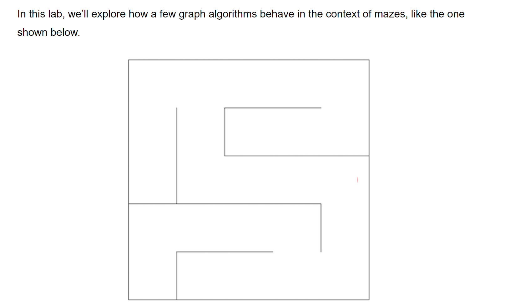
> One way to represent a maze is as an undirected graph. The vertices of such a graph are shown below, with one dimensional (vertex number) coordinates shown on the top version and (X, Y) coordinates on the bottom version. If there is no wall between two adjacent vertices, then the corresponding graph has an undirected edge between the vertices. For example, adj(11) would be an iterable containing the integers $12$ and $16$.

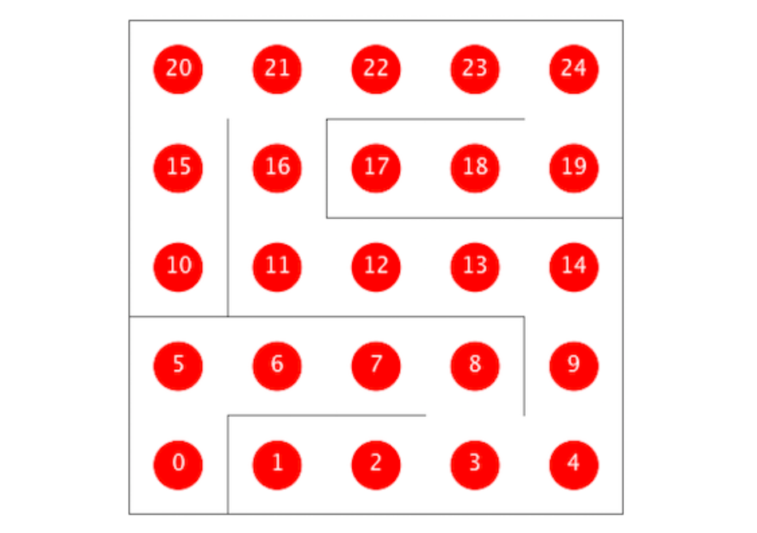
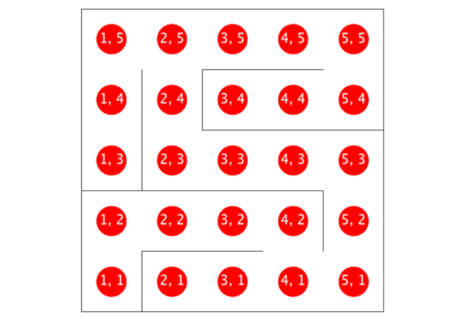

## Code Implementations(Given)
```java
package lab11.graphs;

import edu.princeton.cs.algs4.StdDraw;
import edu.princeton.cs.algs4.In;

import java.util.Random;
import java.awt.Color;

import java.util.Observer;
import java.util.Observable;
import java.util.TreeSet;
import java.util.regex.Matcher;
import java.util.regex.Pattern;

public class Maze implements Observer {

    public enum MazeType {
        SINGLE_GAP, POPEN_SOLVABLE, BLANK
    }

    /**
     * Updates the drawing of the maze.
     */
    public void update(Observable o, Object arg) {
        MazeExplorer me = (MazeExplorer) o;
        StdDraw.clear();
        draw();
        for (int i = 0; i < N * N; i += 1) {
            if (me.marked[i]) {
                drawEdges(i, me);
            }
        }
        for (int i = 0; i < N * N; i += 1) {
            if (me.marked[i]) {
                draw(i, me);
            }
        }

        StdDraw.show(DRAW_DELAY_MS);
    }

    /**
     * Returns neighbor vertices of vertex v.
     */
    public Iterable<Integer> adj(int v) {
        int x = toX(v);
        int y = toY(v);
        TreeSet<Integer> neighbors = new TreeSet<Integer>();
        if (!wallExists(x, y, "North")) {
            neighbors.add(xyTo1D(x, y + 1));
        }

        if (!wallExists(x, y, "East")) {
            neighbors.add(xyTo1D(x + 1, y));
        }

        if (!wallExists(x, y, "South")) {
            neighbors.add(xyTo1D(x, y - 1));
        }

        if (!wallExists(x, y, "West")) {
            neighbors.add(xyTo1D(x - 1, y));
        }

        return neighbors;
    }

    /**
     * Returns x coordinate for given vertex.
     * For example if N = 10, and V = 12, returns 2.
     */
    public int toX(int v) {
        return v % N + 1;
    }

    /**
     * Returns y coordinate for given vertex.
     * For example if N = 10, and V = 12, returns 1.
     */
    public int toY(int v) {
        return v / N + 1;
    }

    /**
     * Returns one dimensional coordinate for vertex in position x, y.
     */
    public int xyTo1D(int x, int y) {
        return (y - 1) * N + (x - 1);
    }


    // returns true if wall exists
    private boolean wallExists(int x, int y, String s) {
        int tx = targetX(x, s);
        int ty = targetY(y, s);
        boolean ooBounds = (tx == 0 || ty == 0 || tx == N + 1 || ty == N + 1);

        if (ooBounds) {
            return true;
        }

        if (s.equals("North")) {
            return north[x][y];
        }

        if (s.equals("East")) {
            return east[x][y];
        }

        if (s.equals("South")) {
            return south[x][y];
        }

        if (s.equals("West")) {
            return west[x][y];
        }

        return true;
    }

    /**
     * Returns number of spaces in the maze.
     */
    public int V() {
        return N * N;
    }

    /**
     * Returns size of the maze.
     */
    public int N() {
        return N;
    }

    /**
     * Creates a Maze from the given config file.
     */
    public Maze(String configFilename) {
        In in = new In(configFilename);
        int rseed = 0;
        N = 10;
        DRAW_DELAY_MS = 50;
        MazeType mt = MazeType.SINGLE_GAP;
        double pOpen = 0.48;
        String configPatternString = "(\\w+)\\s*=\\s*([a-zA-Z0-9_.]+)";
        Pattern configPattern = Pattern.compile(configPatternString);

        while (!in.isEmpty()) {
            String thisLine = in.readLine();
            if (thisLine.length() == 0 || thisLine.charAt(0) == '%') {
                continue;
            }

            Matcher m = configPattern.matcher(thisLine);
            if (m.find()) {
                String variable = m.group(1);
                String value = m.group(2);
                switch (variable) {
                    case "N":
                        N = Integer.parseInt(value);
                        break;
                    case "rseed":
                        rseed = Integer.parseInt(value);
                        break;
                    case "pOpen":
                        pOpen = Double.parseDouble(value);
                        break;
                    case "DRAW_DELAY_MS":
                        DRAW_DELAY_MS = Integer.parseInt(value);
                        break;
                    case "MazeType":
                        if (value.equals("SINGLE_GAP")) {
                            mt = MazeType.SINGLE_GAP;
                        }

                        if (value.equals("POPEN_SOLVABLE")) {
                            mt = MazeType.POPEN_SOLVABLE;
                        }

                        if (value.equals("BLANK")) {
                            mt = MazeType.BLANK;
                        }

                        break;
                    default:
                        break;
                }
            }
        }
        init(rseed, pOpen, mt);
    }

    /**
     * Creates a Maze with given N, random seed, parameter p (not used by
     * all maze types), and a maze type.
     */
    public Maze(int N, int rseed, double pOpen, MazeType mt) {
        this.N = N;
        init(rseed, pOpen, mt);
    }

    /**
     * Initializes maze based on parameters set up by constructors.
     */
    private void init(int rseed, double p, MazeType mt) {
        StdDraw.setXscale(0, N + 2);
        StdDraw.setYscale(0, N + 2);
        rgen = new Random(rseed);
        if (mt == MazeType.SINGLE_GAP) {
            generateSingleGapMaze();
        }
        if (mt == MazeType.POPEN_SOLVABLE) {
            generatePopenSolvableMaze(p);
        }
        if (mt == MazeType.BLANK) {
            generateBlankMaze();
        }
    }

    private void generateBlankMaze() {
        /** Create arrays of all false. */
        north = new boolean[N + 2][N + 2];
        east = new boolean[N + 2][N + 2];
        south = new boolean[N + 2][N + 2];
        west = new boolean[N + 2][N + 2];
    }


    // generate the maze
    private void generateSingleGapMaze(int x, int y, boolean[][] marked) {

        marked[x][y] = true;
        // while there is an unmarked neighbor
        while (!marked[x][y + 1] || !marked[x + 1][y] || !marked[x][y - 1] || !marked[x - 1][y]) {

            // pick random neighbor (could use Knuth's trick instead)
            while (true) {

                double r = rgen.nextDouble();

                if (r < 0.25 && !marked[x][y + 1]) {
                    north[x][y] = south[x][y + 1] = false;
                    generateSingleGapMaze(x, y + 1, marked);
                    break;
                } else if (r >= 0.25 && r < 0.50 && !marked[x + 1][y]) {
                    east[x][y] = west[x + 1][y] = false;
                    generateSingleGapMaze(x + 1, y, marked);
                    break;
                } else if (r >= 0.5 && r < 0.75 && !marked[x][y - 1]) {
                    south[x][y] = north[x][y - 1] = false;
                    generateSingleGapMaze(x, y - 1, marked);
                    break;
                } else if (r >= 0.75 && r < 1.00 && !marked[x - 1][y]) {
                    west[x][y] = east[x - 1][y] = false;
                    generateSingleGapMaze(x - 1, y, marked);
                    break;
                }
            }
        }
    }

    // generate the maze starting from lower left
    private void generateSingleGapMaze() {
        boolean[][] marked = new boolean[N + 2][N + 2];
        for (int x = 0; x < N + 2; x++) {
            marked[x][0] = marked[x][N + 1] = true;
        }
        for (int y = 0; y < N + 2; y++) {
            marked[0][y] = marked[N + 1][y] = true;
        }

        // initialize all walls as present
        north = new boolean[N + 2][N + 2];
        east = new boolean[N + 2][N + 2];
        south = new boolean[N + 2][N + 2];
        west = new boolean[N + 2][N + 2];
        for (int x = 0; x < N + 2; x++) {
            for (int y = 0; y < N + 2; y++) {
                north[x][y] = east[x][y] = south[x][y] = west[x][y] = true;
            }
        }

        generateSingleGapMaze(1, 1, marked);
    }


    private void generatePopenSolvableMaze(double pOpen) {
        // initialize all walls as present
        north = new boolean[N + 2][N + 2];
        east = new boolean[N + 2][N + 2];
        south = new boolean[N + 2][N + 2];
        west = new boolean[N + 2][N + 2];
        for (int x = 0; x < N + 2; x++) {
            for (int y = 0; y < N + 2; y++) {
                north[x][y] = east[x][y] = south[x][y] = west[x][y] = true;
            }
        }


        for (int x = 1; x < N + 1; x += 1) {
            for (int y = 1; y < N + 1; y += 1) {
                double r = rgen.nextDouble();
                if (r < pOpen) {
                    if (inBounds(x, y + 1)) {
                        north[x][y] = south[x][y + 1] = false;
                    }
                }

                r = rgen.nextDouble();
                if (r < pOpen) {
                    if (inBounds(x + 1, y)) {
                        east[x][y] = west[x + 1][y] = false;
                    }
                }

                r = rgen.nextDouble();
                if (r < pOpen) {
                    if (inBounds(x, y - 1)) {
                        south[x][y] = north[x][y - 1] = false;
                    }
                }

                r = rgen.nextDouble();
                if (r < pOpen) {
                    if (inBounds(x - 1, y)) {
                        west[x][y] = east[x - 1][y] = false;
                    }
                }
            }
        }
    }

    /**
     * Returns true if (x, y) is inside the bounds of the maze.
     */
    private boolean inBounds(int x, int y) {
        return (!(x == 0 || x == N + 1 || y == 0 || y == N + 1));
    }

    // Returns x coordinate of target given source location
    // and direction
    private int targetX(int x, String s) {
        if (s.equals("West")) {
            return x - 1;
        }
        if (s.equals("East")) {
            return x + 1;
        }
        return x;
    }

    // Returns y coordinate of target given source location
    // and direction
    private int targetY(int y, String s) {
        if (s.equals("South")) {
            return y - 1;
        }
        if (s.equals("North")) {
            return y + 1;
        }
        return y;
    }

    /**
     * Draws a filled circle of desired color c in cell i.
     */
    private void draw(int i, Color c) {
        StdDraw.setPenColor(c);
        int x = toX(i);
        int y = toY(i);
        StdDraw.filledCircle(x + 0.5, y + 0.5, 0.25);
    }

    /**
     * Draws a filled circle of desired color c in cell i.
     */
    private void draw(int x, int y, Color c) {
        StdDraw.setPenColor(c);
        StdDraw.filledCircle(x + 0.5, y + 0.5, 0.25);
    }

    /* Draws the state of cell i, including any back edges. */
    private void draw(int i, MazeExplorer me) {
        int x = toX(i);
        int y = toY(i);
        if (me.marked[i]) {
            StdDraw.setPenColor(StdDraw.BLUE);
            StdDraw.filledCircle(x + 0.5, y + 0.5, 0.25);
        }
        if (me.distTo[i] < Integer.MAX_VALUE) {
            StdDraw.setPenColor(StdDraw.WHITE);
            StdDraw.text(x + 0.5, y + 0.5, Integer.toString(me.distTo[i]));
        }
    }


    private void drawEdges(int i, MazeExplorer me) {
        int x = toX(i);
        int y = toY(i);
        if (me.edgeTo[i] < Integer.MAX_VALUE) {
            StdDraw.setPenColor(StdDraw.MAGENTA);
            int fromX = toX(me.edgeTo[i]);
            int fromY = toY(me.edgeTo[i]);
            StdDraw.line(fromX + 0.5, fromY + 0.5, x + 0.5, y + 0.5);
        }
    }

    // draw the maze
    private void draw() {
        StdDraw.setPenColor(StdDraw.BLACK);
        for (int x = 1; x <= N; x++) {
            for (int y = 1; y <= N; y++) {
                if (south[x][y]) {
                    StdDraw.line(x, y, x + 1, y);
                }
                if (north[x][y]) {
                    StdDraw.line(x, y + 1, x + 1, y + 1);
                }
                if (west[x][y]) {
                    StdDraw.line(x, y, x, y + 1);
                }
                if (east[x][y]) {
                    StdDraw.line(x + 1, y, x + 1, y + 1);
                }
            }
        }
    }

    /* Draws the maze with all spots numbered by 1D index. */
    private void drawDotsByIndex() {
        for (int i = 0; i < V(); i += 1) {
            int x = toX(i);
            int y = toY(i);
            StdDraw.setPenColor(StdDraw.RED);
            StdDraw.filledCircle(x + 0.5, y + 0.5, 0.25);
            StdDraw.setPenColor(StdDraw.WHITE);
            StdDraw.text(x + 0.5, y + 0.5, Integer.toString(i));
        }
        StdDraw.show();
    }

    /* Draws the maze with all spots numbered by x, y coordinates. */
    private void drawDotsByXY() {
        for (int i = 0; i < V(); i += 1) {
            int x = toX(i);
            int y = toY(i);
            StdDraw.setPenColor(StdDraw.RED);
            StdDraw.filledCircle(x + 0.5, y + 0.5, 0.25);
            StdDraw.setPenColor(StdDraw.WHITE);
            StdDraw.text(x + 0.5, y + 0.5, Integer.toString(x) + ", " + Integer.toString(y));
        }
        StdDraw.show();
    }


    // a test client
   /* public static void main(String[] args) {
        int N = Integer.parseInt(args[0]);
        int rseed = Integer.parseInt(args[1]);

        Maze maze = new Maze(N, rseed, 0.48, MazeType.POPEN_SOLVABLE);
        StdDraw.show(0);
        maze.draw();
//        MazeExplorer mdfp = new MazeAStarPath(maze, 4, 4, N, N);
        MazeExplorer mdfp = new MazeCycles(maze);
        mdfp.solve();
    }*/


    private int N;                 // dimension of maze
    private boolean[][] north;     // is there a wall to north of cell i, j
    private boolean[][] east;
    private boolean[][] south;
    private boolean[][] west;
    private static Random rgen;
    private static int DRAW_DELAY_MS = 50;
}

```

# Maze Traversal
## DFS(Given)
> 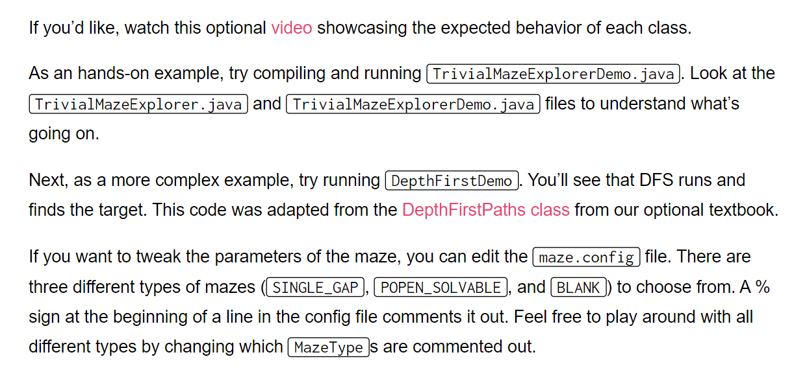

```java
package lab11.graphs;

/**
 *  @author Josh Hug
 */
public class MazeDepthFirstPaths extends MazeExplorer {
    /* Inherits public fields:
    public int[] distTo;
    public int[] edgeTo;
    public boolean[] marked;
    */
    private int s;
    private int t;
    private boolean targetFound = false;
    private Maze maze;


    public MazeDepthFirstPaths(Maze m, int sourceX, int sourceY, int targetX, int targetY) {
        super(m);
        maze = m;
        s = maze.xyTo1D(sourceX, sourceY);
        t = maze.xyTo1D(targetX, targetY);
        distTo[s] = 0;
        edgeTo[s] = s;
    }

    private void dfs(int v) {
        marked[v] = true;
        announce();

        if (v == t) {
            targetFound = true;
        }

        if (targetFound) {
            return;
        }

        for (int w : maze.adj(v)) {
            if (!marked[w]) {
                edgeTo[w] = v;
                announce();
                distTo[w] = distTo[v] + 1;
                dfs(w);
                if (targetFound) {
                    return;
                }
            }
        }
    }

    @Override
    public void solve() {
        dfs(s);
    }
}

```
**Output**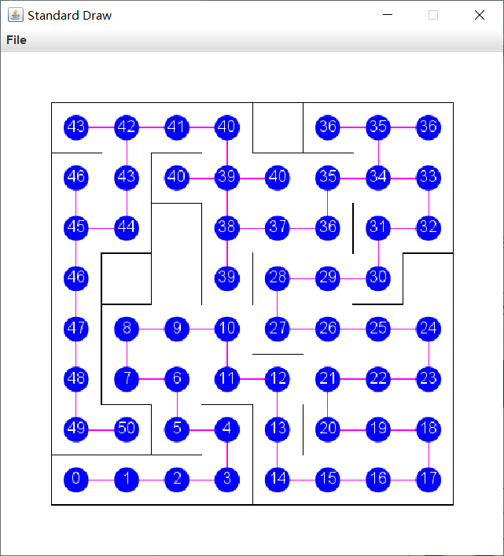

## BFS(Required)
> 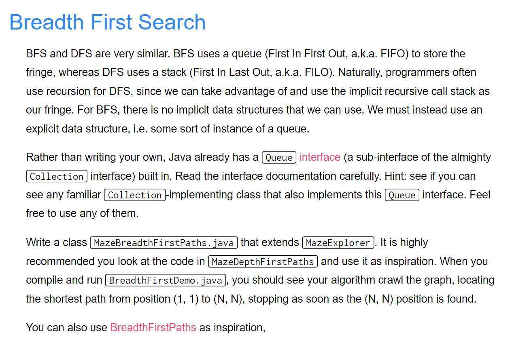

```java
package lab11.graphs;

import edu.princeton.cs.algs4.Queue;

import java.util.ArrayDeque;

/**
 *  @author Josh Hug
 */
public class MazeBreadthFirstPaths extends MazeExplorer {
    /* Inherits public fields:
    public int[] distTo;
    public int[] edgeTo;
    public boolean[] marked;
    */

    private int s; // Source Vertex
    private int t; // Target Vertex
    private boolean targetFound; // Wether we have found the target vertex
    private Maze maze; // The maze object

    public MazeBreadthFirstPaths(Maze m, int sourceX, int sourceY, int targetX, int targetY) {
        super(m);
        // Add more variables here!
        maze = m;
        s = maze.xyTo1D(sourceX, sourceY);
        t = maze.xyTo1D(targetX, targetY);
        distTo[s] = 0;
        edgeTo[s] = s;
    }

    /** Conducts a breadth first search of the maze starting at the source. */
    private void bfs() {
        // TODO: Your code here. Don't forget to update distTo, edgeTo, and marked, as well as call announce()
        Queue<Integer> fringe = new Queue<>();
        fringe.enqueue(s);
        marked[s] = true;
        announce();
        while (!fringe.isEmpty()) {
            int n = fringe.dequeue();
            if (n == t) {
                targetFound = true;
                return;
            }
            for (Integer neighbor: maze.adj(n)) {
                if (!marked[neighbor]) {
                    fringe.enqueue(neighbor);
                    marked[neighbor] = true;
                    edgeTo[neighbor] = n;
                    announce();
                    distTo[neighbor] = distTo[n] + 1;
                }
            }
        }
    }


    @Override
    public void solve() {
         bfs();
    }
}
```
**Output**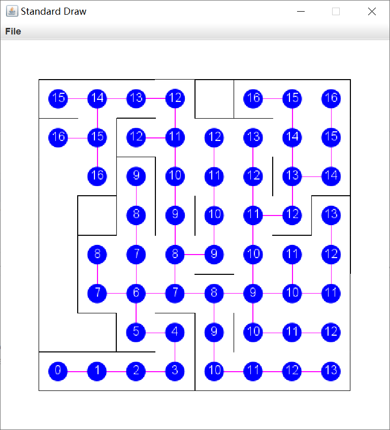


# Cycle Check(Optional)
> 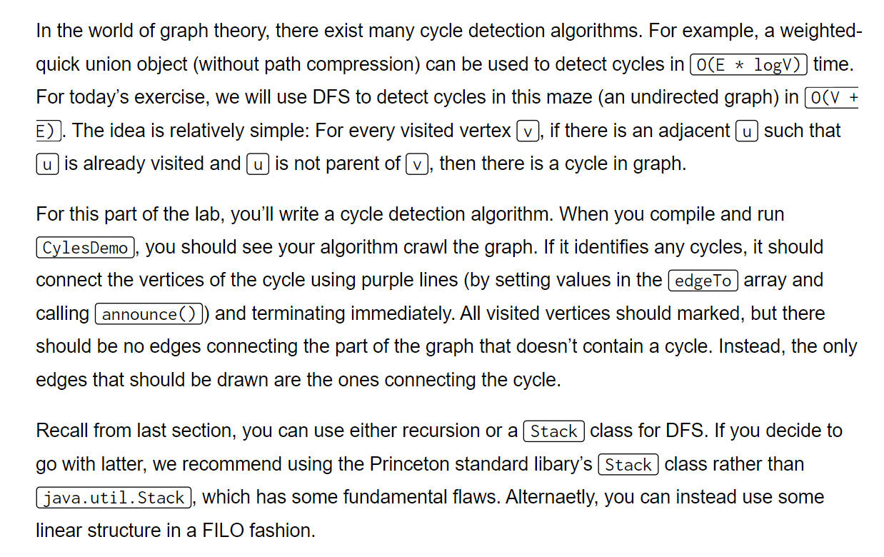
> **本题需要注意一下几点:**
> 1. 所有的`Nodes`都是需要可视化出来的，这个比较简单，只需要在每次`marked[v]`后面调用`announce()`即可。
> 2. 在检测到`Cycle`之后需要立即终止遍历，同时**需要将构成**`**Cycle**`**的**`**edges**`**都标记出来**，这要求我们在更新完`edgeTo`之后调用`announce()`方法保证正常的`Visualization`。但是如果我们从`source node`开始就更新`edgeTo`的话，在最终`announce()`调用后，所有的`path`中的`edge`都会被可视化出来，而我们要求的是除了`Cycle`以外的`Edges`都不能可视化出来, 但是我们又需要一个列表来记录我们遍历的`path`, 所以我们可以创建一个辅助列表`edgeHistory`专门负责记录`path`而不用担心被可视化。换句话说，`edgeTo`只负责`Cycle`中的`edges`的可视化，`edgeHistory`则用于记录`traversal path`。
> 3. 构建`Cycle Edge`的过程依赖于`edgeHistory`, 从尾至头依次连接构建即可。
> 4. 我们需要在检测到第一个`Cycle`之后就马上终止程序，如果没有`Cycle`就继续遍历。所以我们需要一些条件来控制遍历的发生与否。对于递归来说，我们原来是通过`dfs(neighbor)`来继续递归的，现在我们可以为递归函数`dfs(neighbor)`添置一个状态(通过返回值来实现)，如果`return false`说明已经检测到了`cycle`, 无需后续遍历，当前函数直接返回`false`, 相当于在剪枝，于是使用判断条件`if(!dfs(neighbor))`。

```java
package lab11.graphs;

public class MazeCycles extends MazeExplorer {
    /* Inherits public fields:
    public int[] distTo;
    public int[] edgeTo;
    public boolean[] marked;
    */

    private int s;
    private int[] edgeHistory;

    public MazeCycles(Maze m) {
        super(m);
        s = m.xyTo1D(1, 1);
        distTo[s] = 0;
        edgeHistory = new int[m.V()];
        edgeHistory[s] = s;
    }

    @Override
    public void solve() {
        // Your code here!
        dfs(s, s);
    }

    // Helper methods go here
    private boolean dfs(int current, int parent) {
        marked[current] = true;
        announce();
        for (Integer n: maze.adj(current)) {
            if (!marked[n]) {
                edgeHistory[n] = current;
                distTo[n] = distTo[current] + 1;
                // See if there is already any cycles during traversal
                if (!dfs(n, current)) {
                    return false;
                }
            } else {
                // If the already marked node is not its parent
                // This means some other path can reach this node
                // This clearly indicates the cycle
                if (n != parent) {
                    edgeHistory[n] = current;
                    int start = current;
                    int prev;
                    // If there is a cycle, then we can start to construct the 
                    // cycle loop following the edgeHistory
                    while (edgeHistory[start] != current) {
                        prev = start;
                        start = edgeHistory[start];
                        // EdgeTo is used only for cycle edge visualization(update the visualization)
                        edgeTo[start] = prev;
                    }
                    edgeTo[current] = n;
                    announce();
                    // We don't have to recursion anymore, we return
                    return false;
                }
            }
        }
        return true;
    }
}
```
**Output**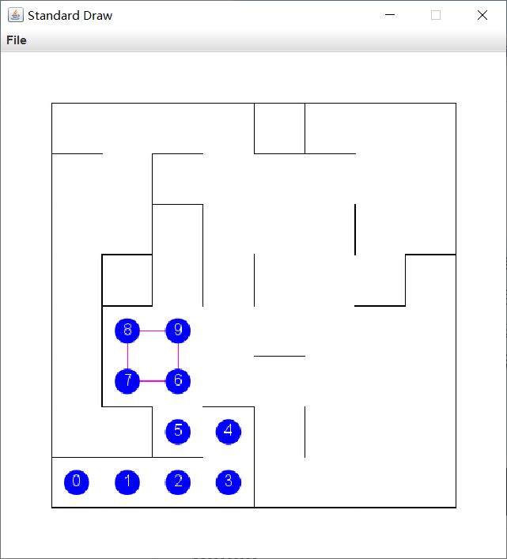


# A* Algorithm(Optional)
> 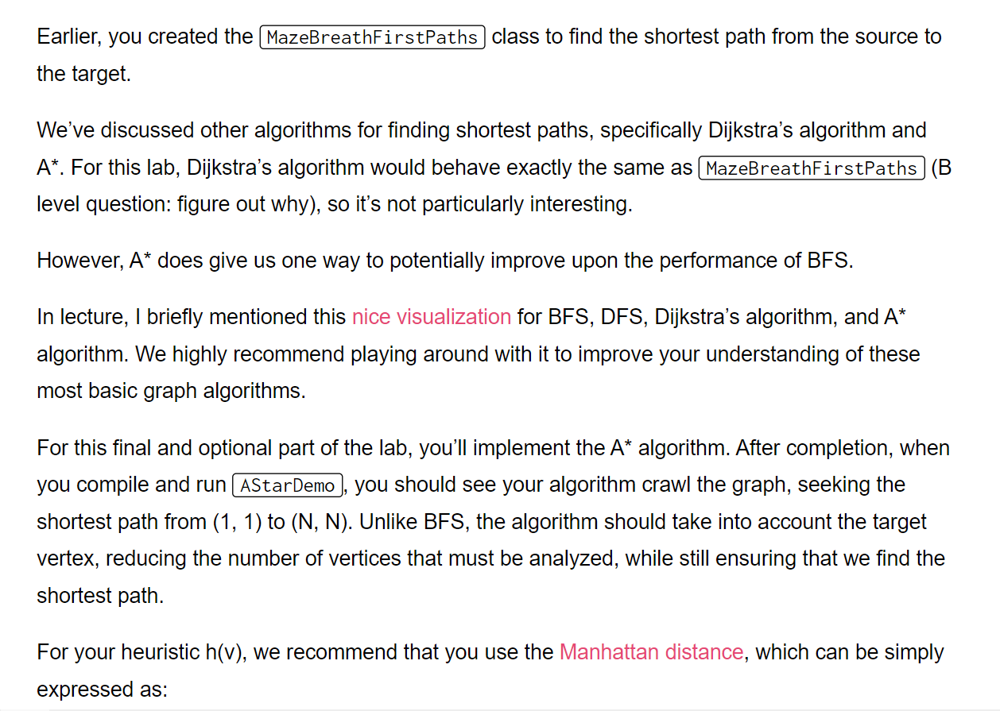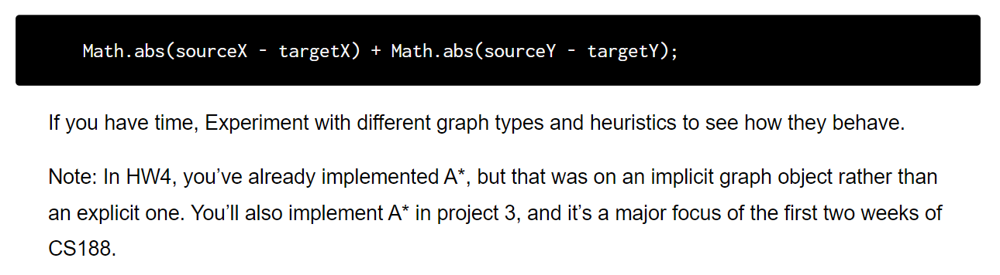
> **Visualization Website:** [https://qiao.github.io/PathFinding.js/visual/](https://qiao.github.io/PathFinding.js/visual/)

```java
package lab11.graphs;

import edu.princeton.cs.algs4.MinPQ;

/**
 *  @author AlexMan
 */
public class MazeAStarPath extends MazeExplorer {
    private int s;
    private int t;
    private boolean targetFound = false;
    private Maze maze;

    // 将每一个节点视为一个Node类, 因为要插入优先队列中，所以需要实现一个Comparable接口
    private class Node implements Comparable {
        int id;
        int priority;

        public Node (int id, int priority) {
            this.id = id;
            this.priority = priority;
        }

        @Override
        public int compareTo(Object o) {
            return this.priority - ((Node) o).priority;
        }

        public int getId() {
            return id;
        }
    }

    public MazeAStarPath(Maze m, int sourceX, int sourceY, int targetX, int targetY) {
        super(m);
        maze = m;
        s = maze.xyTo1D(sourceX, sourceY);
        t = maze.xyTo1D(targetX, targetY);
        distTo[s] = 0;
        edgeTo[s] = s;
    }

    /** Estimate of the distance from v to the target. */
    private int h(int v) {
        int xcorS = maze.toX(v);
        int ycorS = maze.toY(v);
        int xcorT = maze.toX(t);
        int ycorT = maze.toY(t);
        return Math.abs(xcorS - xcorT) + Math.abs(ycorS - ycorT);
    }

    /** Finds vertex estimated to be closest to target. */
    private int findMinimumUnmarked() {
        return -1;
        /* You do not have to use this method. */
    }

    /** Performs an A star search from vertex s. */
    private void astar(int s) {
        // The Code

        MinPQ<Node> fringe = new MinPQ<>();
        fringe.insert(new Node(s, h(s)));

        Node currNode = fringe.delMin();
        Integer currId = currNode.getId();
        marked[s] = true;
        announce();
        // 判断是否已经找到了target
        while (currNode.getId() != t) {
            Iterable<Integer> neighbors = maze.adj(currId);
            for (Integer neighbor: neighbors) {
                if (!marked[neighbor]) {
                    distTo[neighbor] = distTo[currId] + 1; // Relaxation
                    edgeTo[neighbor] = currNode.getId();
                    // Reordering
                    fringe.insert(new Node(neighbor, distTo[neighbor] + h(neighbor)));
                }
            }
            // Prepare for next loop
            currNode = fringe.delMin();
            currId = currNode.getId();
            marked[currNode.getId()] = true;
            announce();
        }
    }

    @Override
    public void solve() {
        astar(s);
    }

}
```
**Output**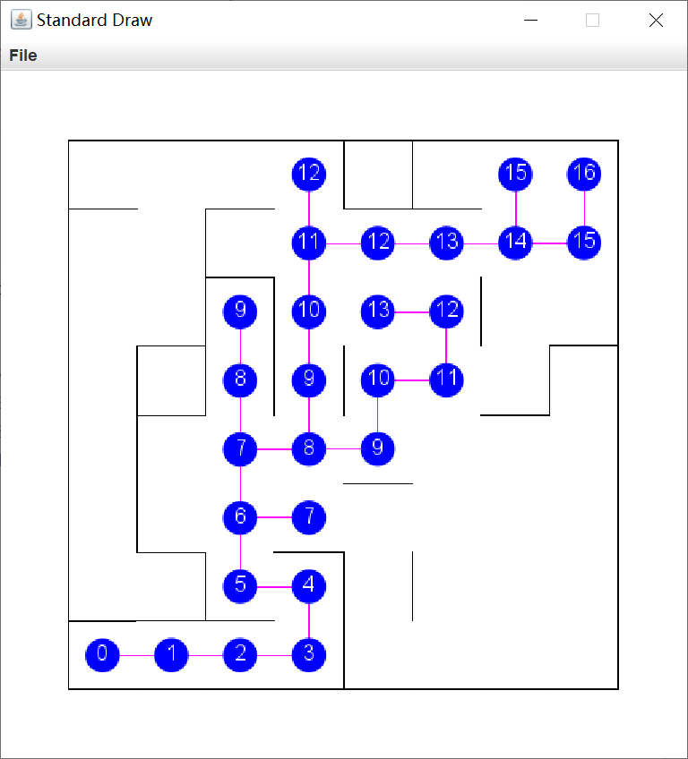

# Submission
> 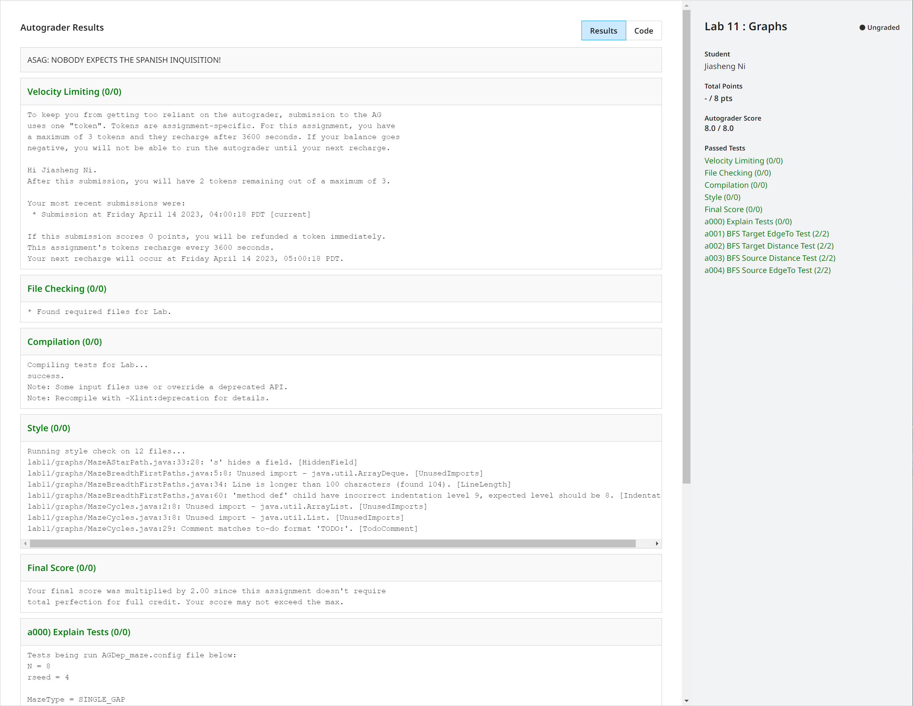

