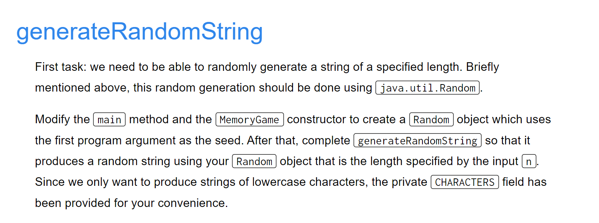
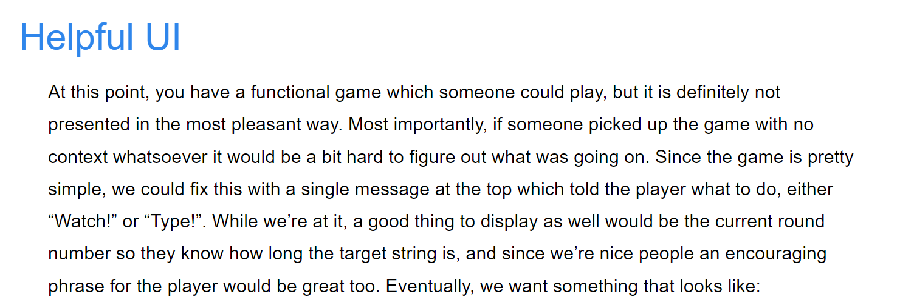

[proj2.zip](https://www.yuque.com/attachments/yuque/0/2023/zip/12393765/1674719987468-f195b76a-b479-4651-8d08-74c4f5b0739c.zip)
> 最好在学完所有数据结构和搜索算法之后再回来做这个项目会有更多灵感。

# 1 Pre-Lab 5: Draw Hexagon
[Lab 5_ Getting Started on Project 2 _ CS 61B Spring 2018.pdf](https://www.yuque.com/attachments/yuque/0/2023/pdf/12393765/1675043988638-60c87f0a-aa7a-4bfe-9985-44b4f70ea81e.pdf)

## Pseudorandomness(PRNG)⭐⭐⭐⭐⭐
> 
> [https://en.wikipedia.org/wiki/Pseudorandom_number_generator](https://en.wikipedia.org/wiki/Pseudorandom_number_generator)

**Details**

## Task 1: Abstraction of drawing hexagons
> 

```java
package byog.lab5;
import org.junit.Test;
import static org.junit.Assert.*;

import byog.TileEngine.TERenderer;
import byog.TileEngine.TETile;
import byog.TileEngine.Tileset;

import java.util.Random;

/**
 * Draws a world consisting of hexagonal regions.
 */
public class HexWorld {

    /**
     * Side length of the hexagon to be drawn
     * @param s
     */
    public void addHexagon(int s) {
        int maxlength = s + (s - 1) * 2;
        drawUpper(s, maxlength);
        drawLower(s, maxlength);
    }

    /**
     * Draw the upper part of the hexagon
     * @param s
     * @param maxLength
     */
    public void drawUpper(int s, int maxLength) {
        // Compute the maximum length of side
        for (int i = 0; i < s; i++){
            int sideNum = s + i * 2;
            int blankNum = maxLength - sideNum;
            drawLine(blankNum, sideNum);
        }
    }

    /**
     * Draw the lower part of the hexagon
     * @param s
     * @param maxLength
     */
    public void drawLower(int s, int maxLength) {
        for (int i = s - 1; i > -1; i--){
            int sideNum = s + i * 2;
            int blankNum = maxLength - sideNum;
            drawLine(blankNum, sideNum);
        }
    }


    /**
     * Draw a single line based on the number
     * of blank tiles and side tiles
     * @param blankNum
     * @param sideLength
     */
    public void drawLine(int blankNum, int sideLength) {
        StringBuilder sb = new StringBuilder();
        for (int i = 0; i < blankNum / 2; i++){
            sb.append(" ");
        }
        for (int i = 0; i < sideLength ; i++){
            sb.append("a");
        }
        for (int i = 0; i < blankNum / 2; i++){
            sb.append(" ");
        }
        System.out.println(sb.toString());
    }

    public static void main(String[] args) {
        HexWorld hw = new HexWorld();
        hw.addHexagon(3);
    }

}

```
**Program Output**
s


## Task 2: Adapt it to the TileRender
> 
> 本题需要注意绘制`Hexagon`的起始坐标，根据`Example Code`可知，是从左下角开始。即，假设我们有`Position(int x, int y)`, 则我们的六边形绘制是从左下角开始的。
> 我们尽量少地改动我们在`Task 1`中已经写好的逻辑，我们只需要在参数中引入一下有关`Position`的约束即可。
> 整体绘画逻辑也比较简单，就是我们通过设置`world[x][y]=tile`, 然后在主函数中调用`renderFrame()`即可。

```java
package byog.lab5;
import org.junit.Test;
import static org.junit.Assert.*;

import byog.TileEngine.TERenderer;
import byog.TileEngine.TETile;
import byog.TileEngine.Tileset;

import java.util.Random;

/**
 * Draws a world consisting of hexagonal regions.
 */
public class HexWorld {

    /**
     * Side length of the hexagon to be drawn
     * Add the hexagon to the TETile[][] world
     * @param world The whole canvas
     * @param p The top-left corner of the hexagon(including the NOTHING Block)
     * @param s Side length
     * @param t The type of the tile to draw
     */
    public void addHexagon(TETile[][] world, Position p, int s, TETile t) {
        int maxlength = s + (s - 1) * 2;
        // Render the tiles for the world
        Position upperPosition = new Position(p.x,p.y);
        Position lowerPosition = new Position(p.x, p.y - s);
        drawUpper(world, upperPosition, s, maxlength, t);
        drawLower(world, lowerPosition, s, maxlength, t);
    }

    /**
     * Draw the upper part of the hexagon
     * @param s
     * @param maxLength
     */
    public void drawUpper(TETile[][] world, Position p, int s, int maxLength, TETile t) {
        int yCor = p.y;
        // Compute the maximum length of side
        for (int i = 0; i < s; i++){
            int sideNum = s + i * 2;
            int blankNum = maxLength - sideNum;
            Position pos = new Position(p.x, yCor);
            yCor--;
            drawLine(world, pos, blankNum, sideNum, t);
        }
    }

    /**
     * Draw the lower part of the hexagon
     * @param s
     * @param maxLength
     */
    public void drawLower(TETile[][] world,Position p, int s, int maxLength, TETile t) {
        int yCor = p.y;
        for (int i = s - 1; i > -1; i--){
            int sideNum = s + i * 2;
            int blankNum = maxLength - sideNum;
            Position pos = new Position(p.x, yCor);
            yCor--;
            drawLine(world, pos, blankNum, sideNum, t);
        }
    }


    /**
     * Draw a single line based on the number
     * of blank tiles and side tiles
     * @param blankNum
     * @param sideLength
     */
    public void drawLine(TETile[][] world, Position p, int blankNum, int sideLength, TETile t) {
        int positionX = p.x;
        int positionY = p.y;
        for (int i = 0; i < blankNum / 2; i++){
            world[positionX][positionY] = Tileset.NOTHING;
            positionX += 1;
        }
        for (int i = 0; i < sideLength ; i++){
            world[positionX][positionY] = t;
            positionX += 1;
        }
        for (int i = 0; i < blankNum / 2; i++){
            world[positionX][positionY] = Tileset.NOTHING;
            positionX += 1;
        }
    }

    public static void main(String[] args) {
        // Create the world, setting up the parameters
        HexWorld hw = new HexWorld();
        Position p = new Position(50,50);
        // Set the size of the canvas
        int width = 100;
        int height = 100;
        int sideLength = 3;
        // initialize the tile rendering engine with a window of size WIDTH x HEIGHT
        TERenderer ter = new TERenderer();
        ter.initialize(width, height);

        // initialize tiles
        TETile[][] world = new TETile[width][height];
        for (int x = 0; x < width; x += 1) {
            for (int y = 0; y < height; y += 1) {
                world[x][y] = Tileset.NOTHING;
            }
        }

        // Start to draw the hexagon
        TETile t = Tileset.SAND;
        hw.addHexagon(world, p,3, t);

        // draws the world to the screen
        ter.renderFrame(world);
    }

}

```
**Program Output**


## Task 3: Draw a tesselation of hexagons
> 
> **注意点:** `world`的坐标默认左下角是$(0,0)$。

```java
package byog.lab5;
import org.junit.Test;
import static org.junit.Assert.*;

import byog.TileEngine.TERenderer;
import byog.TileEngine.TETile;
import byog.TileEngine.Tileset;

import java.util.Random;

/**
 * Draws a world consisting of hexagonal regions.
 */
public class HexWorld {

    /**
     * Side length of the hexagon to be drawn
     * Add the hexagon to the TETile[][] world
     * @param world The whole canvas
     * @param p The top-left corner of the hexagon(including the NOTHING Block)
     * @param s Side length
     * @param tileType The type of the tile to draw
     */
    public void addHexagon(TETile[][] world, Position p, int s, int tileType) {
        int maxlength = s + (s - 1) * 2;
        // Render the tiles for the world
        Position upperPosition = new Position(p.x,p.y);
        Position lowerPosition = new Position(p.x, p.y - s);
        drawLower(world, lowerPosition, s, maxlength, tileType);
        drawUpper(world, upperPosition, s, maxlength, tileType);
    }

    /**
     * Draw the upper part of the hexagon
     * @param s
     * @param maxLength
     */
    public void drawUpper(TETile[][] world, Position p, int s, int maxLength, int tileType) {
        int yCor = p.y;
        // Compute the maximum length of side
        for (int i = 0; i < s; i++){
            int sideNum = s + i * 2;
            int blankNum = maxLength - sideNum;
            Position pos = new Position(p.x, yCor);
            yCor--;
            drawLine(world, pos, blankNum, sideNum, tileType);
        }
    }

    /**
     * Draw the lower part of the hexagon
     * @param s
     * @param maxLength
     */
    public void drawLower(TETile[][] world,Position p, int s, int maxLength, int tileType) {
        int yCor = p.y;
        for (int i = s - 1; i > -1; i--){
            int sideNum = s + i * 2;
            int blankNum = maxLength - sideNum;
            Position pos = new Position(p.x, yCor);
            yCor--;
            drawLine(world, pos, blankNum, sideNum, tileType);
        }
    }


    /**
     * Draw a single line based on the number
     * of blank tiles and side tiles
     * @param blankNum
     * @param sideLength
     */
    public void drawLine(TETile[][] world, Position p, int blankNum, int sideLength, int tileType) {
        TETile t;
        switch (tileType) {
            case 0: t = Tileset.WALL; break;
            case 1: t = Tileset.FLOWER; break;
            case 2: t = Tileset.TREE; break;
            case 3: t = Tileset.MOUNTAIN; break;
            case 4: t = Tileset.SAND; break;
            case 5: t = Tileset.GRASS; break;
            default: t = Tileset.NOTHING; break;
        }
        int positionX = p.x;
        int positionY = p.y;
        for (int i = 0; i < blankNum / 2; i++){
            positionX += 1;
        }
        for (int i = 0; i < sideLength ; i++){
            if (tileType == 3) {
                world[positionX][positionY] = TETile.colorVariant(t, 50,50,50, new Random());
            }else {
                world[positionX][positionY] = t;
            }
            positionX += 1;
        }
    }


    /**
     * We actually want to draw all the hexagons column by column
     * @param world
     * @param hw
     */
    public static void draw19Hexagons(TETile[][] world, HexWorld hw) {
        // Left
        hw.addHexagon(world, new Position(2,11),3,5);
        hw.addHexagon(world, new Position(2,17),3,5);
        hw.addHexagon(world, new Position(2,23),3,3);

        // Left middle
        hw.addHexagon(world, new Position(7,8),3,1);
        hw.addHexagon(world, new Position(7,14),3,3);
        hw.addHexagon(world, new Position(7,20),3,3);
        hw.addHexagon(world, new Position(7,26),3,5);

        // Middle
        hw.addHexagon(world, new Position(12,5),3, 3);
        hw.addHexagon(world, new Position(12,11),3, 3);
        hw.addHexagon(world, new Position(12,17),3, 3);
        hw.addHexagon(world, new Position(12,23),3, 3);
        hw.addHexagon(world, new Position(12,29),3, 4);

        // Right middle
        hw.addHexagon(world, new Position(17,8),3,3);
        hw.addHexagon(world, new Position(17,14),3,2);
        hw.addHexagon(world, new Position(17,20),3,4);
        hw.addHexagon(world, new Position(17,26),3,1);

        // Right
        hw.addHexagon(world, new Position(22,11),3,4);
        hw.addHexagon(world, new Position(22,17),3,2);
        hw.addHexagon(world, new Position(22,23),3,1);
    }


    public static void main(String[] args) {
        // Create the world, setting up the parameters
        HexWorld hw = new HexWorld();
        // Set the size of the canvas
        int width = 30;
        int height = 30;
        int sideLength = 3;
        // initialize the tile rendering engine with a window of size WIDTH x HEIGHT
        TERenderer ter = new TERenderer();
        ter.initialize(width, height);

        // initialize tiles
        TETile[][] world = new TETile[width][height];
        for (int x = 0; x < width; x += 1) {
            for (int y = 0; y < height; y += 1) {
                world[x][y] = Tileset.NOTHING;
            }
        }

        // Start to draw the hexagon
        draw19Hexagons(world, hw);

        // draws the world to the screen
        ter.renderFrame(world);
    }

}

```
**Program Output**


# 2 Pre-Lab 6 Interactivity
[Lab 6_ Getting Started on Project 2, Phase 2 _ CS 61B Spring 2018.pdf](https://www.yuque.com/attachments/yuque/0/2023/pdf/12393765/1675086001065-b6718452-a192-481f-8794-21e64d353773.pdf)

## generateRandomString
> 

```java
public String generateRandomString(int n) {
    // Generate random string of letters of length n
    StringBuilder sb = new StringBuilder();
    for (int i = 0;  i < n ;i++) {
        int randInt = this.rand.nextInt(CHARACTERS.length);
        sb.append(CHARACTERS[randInt]);
    }
    return sb.toString();
}
```

## Draw Frame
> 

```java
public void drawFrame(String s) {
    StdDraw.clear(); // Clear previous info from the screen
    StdDraw.line(0, this.height - 5 , this.width, this.height - 5);
    StdDraw.text(5, this.height - 2.5, "Round: " + round);

    // Depending on "type" or "Watch", display different items
    StdDraw.text(this.width / 2, this.height - 2.5,  playerTurn ? "Type":"Watch!");
    StdDraw.text(this.width / 2, this.height / 2, s);

    //TODO: If game is not over, display relevant game information at the top of the screen
    StdDraw.text(this.width - 7.5, this.height - 2.5, ENCOURAGEMENT[randomIndex]);
    StdDraw.show(); // Flush onto the screen
}
```


## Flash Sequence
> 

```java
public void flashSequence(String letters) {
    StdDraw.pause(500);
    for (int i = 0; i < letters.length(); i++) {
        char l = letters.charAt(i);
        drawFrame(String.valueOf(l));
        StdDraw.pause(500);
        drawFrame("");
        StdDraw.pause(500);
    }
}
```


## Solicit N-Chars Input
> 
> 就是说展示完字符串后让用户输入，并将输出实时展示到屏幕上。

```java
public String solicitNCharsInput(int n) {
    //TODO: Read n letters of player input
    StringBuilder sb = new StringBuilder();
    drawFrame("");
    int counter = n;
    while (true) {
        if (!StdDraw.hasNextKeyTyped()) {
        } else {
            char key = StdDraw.nextKeyTyped();
            sb.append(key);
            drawFrame(sb.toString());
            counter--;
            if (counter == 0) {
                break;
            }
        }
    }
    return sb.toString();
}
```

## Start Game
> 

```java
private void switchPlayer() {
    playerTurn = ! playerTurn;
}

private String watchPhase() {
    randomIndex = this.rand.nextInt(ENCOURAGEMENT.length);
    String randString = generateRandomString(round);
    flashSequence(randString);
    return randString;
}

private void typePhase(String randString) {
    randomIndex = this.rand.nextInt(ENCOURAGEMENT.length);
    drawFrame("");
    String inputString = solicitNCharsInput(randString.length());
    StdDraw.pause(500);
    if (!inputString.equals(randString)) {
        drawFrame("Game Over! You made it to round: " + round);
        gameOver = true;
    } else {
        drawFrame("Correct, well done!");
        StdDraw.pause(1500);
    }
}

public void startGame() {
    round = 1;
    gameOver = false;
    playerTurn = false;
    //TODO: Establish Game loop
    while (!gameOver) {
        // Watch Phase first
        String randString = watchPhase();
        // Switch to player
        switchPlayer();
        // Player type
        typePhase(randString);
        switchPlayer();
        round++;
    }
}
```

## UI-Design
**Helpful UI - DrawFrame**
> **StdDraw API:** [https://introcs.cs.princeton.edu/java/stdlib/javadoc/StdDraw.html](https://introcs.cs.princeton.edu/java/stdlib/javadoc/StdDraw.html)
> 
> 默认设置下，左下角是$(0,0)$, 右上角是$(1,1)$, 我们可以通过`setXScale()`和`setYScale()`来改变画幅的尺寸。
> **设置背景颜色为黑色: **`StdDraw.clear(Color.black)`
> **设置新的字体:** `StdDraw.setFont(new Font(<font_type>, <font_style>, <font_size>))`
> **查看用户当前是否有输入: **`StdDraw.hasNextKeyTyped()`, 返回`boolean`类型数据。
> **获取用户当前输入:**`StdDraw.nextKeyTyped()`, 返回`char`类型数据。
> **渲染方法**`**drawFrame()**`**：**需要在最后一行调用`StdDraw.show()`将`StdDraw`缓存池中的画面渲染到屏幕上去。


## Full Codes
```java
package byog.lab6;

import edu.princeton.cs.introcs.StdDraw;

import java.awt.Color;
import java.awt.Font;
import java.util.Random;

public class MemoryGame {
    private int width;
    private int height;
    private int round;
    private Random rand;
    private boolean gameOver;
    private boolean playerTurn;
    private static final char[] CHARACTERS = "abcdefghijklmnopqrstuvwxyz".toCharArray();
    private static final String[] ENCOURAGEMENT = {"You can do this!", "I believe in you!",
                                                   "You got this!", "You're a star!", "Go Bears!",
                                                   "Too easy for you!", "Wow, so impressive!"};

    public static void main(String[] args) {
        if (args.length < 1) {
            System.out.println("Please enter a seed");
            return;
        }

        int seed = Integer.parseInt(args[0]);
        MemoryGame game = new MemoryGame(40, 40);
        game.startGame();
    }

    public MemoryGame(int width, int height) {
        /* Sets up StdDraw so that it has a width by height grid of 16 by 16 squares as its canvas
         * Also sets up the scale so the top left is (0,0) and the bottom right is (width, height)
         */
        this.width = width;
        this.height = height;
        StdDraw.setCanvasSize(this.width * 16, this.height * 16);
        Font font = new Font("Monaco", Font.BOLD, 30);
        StdDraw.setFont(font);
        StdDraw.setXscale(0, this.width);
        StdDraw.setYscale(0, this.height);
        StdDraw.clear(Color.BLACK);
        StdDraw.enableDoubleBuffering();

        //TODO: Initialize random number generator
    }

    public String generateRandomString(int n) {
        //TODO: Generate random string of letters of length n
        return null;
    }

    public void drawFrame(String s) {
        //TODO: Take the string and display it in the center of the screen
        //TODO: If game is not over, display relevant game information at the top of the screen
    }

    public void flashSequence(String letters) {
        //TODO: Display each character in letters, making sure to blank the screen between letters
    }

    public String solicitNCharsInput(int n) {
        //TODO: Read n letters of player input
        return null;
    }

    public void startGame() {
        //TODO: Set any relevant variables before the game starts

        //TODO: Establish Game loop
    }

}
```
```java
package byog.lab6;

import edu.princeton.cs.introcs.StdDraw;

import java.awt.Color;
import java.awt.Font;
import java.util.Random;

public class MemoryGame {
    private int width;
    private int height;
    private int round;
    private Random rand;
    private boolean gameOver; // Any wrong input could trigger this to be true and terminate the program
    private boolean playerTurn; // See if to print out "Watch!" or "Type!"
    private static final char[] CHARACTERS = "abcdefghijklmnopqrstuvwxyz".toCharArray();
    private static final String[] ENCOURAGEMENT = {"You can do this!", "I believe in you!",
                                                   "You got this!", "You're a star!", "Go Bears!",
                                                   "Too easy for you!", "Wow, so impressive!"};
    private int randomIndex;

    public static void main(String[] args) {
        int seed = 42;
        MemoryGame game = new MemoryGame(40, 40, seed);  // Modify the parameter list
        game.startGame();
    }

    // Modified the parameter list
    public MemoryGame(int width, int height, int seed) {
        /* Sets up StdDraw so that it has a width by height grid of 16 by 16 squares as its canvas
         * Also sets up the scale so the top left is (0,0) and the bottom right is (width, height)
         */
        this.width = width;
        this.height = height;
        StdDraw.setCanvasSize(this.width * 16, this.height * 16);
        Font font = new Font("Monaco", Font.BOLD, 20);
        StdDraw.setFont(font);
        StdDraw.setXscale(0, this.width);
        StdDraw.setYscale(0, this.height);
        StdDraw.clear(Color.BLACK);
        StdDraw.enableDoubleBuffering();

        //TODO: Initialize random number generator
        this.rand = new Random(seed);
    }

    public String generateRandomString(int n) {
        //TODO: Generate random string of letters of length n
        StringBuilder sb = new StringBuilder();
        for (int i = 0;  i < n ;i++) {
            int randInt = this.rand.nextInt(CHARACTERS.length);
            sb.append(CHARACTERS[randInt]);
        }
        return sb.toString();
    }

    public void drawFrame(String s) {
        //TODO: Take the string and display it in the center of the screen
        //        StdDraw.setPenColor(Color.WHITE);
        StdDraw.clear(); // Clear previous info from the screen
        StdDraw.line(0, this.height - 5 , this.width, this.height - 5);
        StdDraw.text(5, this.height - 2.5, "Round: " + round);

        // Depending on "type" or "Watch", display different items
        if (!playerTurn) {
            StdDraw.text(this.width / 2, this.height - 2.5, "Watch!");
            StdDraw.text(this.width / 2, this.height / 2, s);
        } else {
            StdDraw.text(this.width / 2, this.height - 2.5, "Type!");
            StdDraw.text(this.width / 2, this.height / 2, s);
        }
        //TODO: If game is not over, display relevant game information at the top of the screen
        StdDraw.text(this.width - 7.5, this.height - 2.5, ENCOURAGEMENT[randomIndex]);
        StdDraw.show(); // Flush onto the screen
    }

        public void flashSequence(String letters) {
        //TODO: Display each character in letters, making sure to blank the screen between letters
        StdDraw.pause(500);
        for (int i = 0; i < letters.length(); i++) {
        char l = letters.charAt(i);
        drawFrame(String.valueOf(l));
        StdDraw.pause(500);
        drawFrame("");
        StdDraw.pause(500);
    }
    }

        /**
        * Get n characters from keyboard type event
        * @param n
        * @return
        */
        public String solicitNCharsInput(int n) {
        //TODO: Read n letters of player input
        StringBuilder sb = new StringBuilder();
        drawFrame("");
        int counter = n;
        while (true) {
        if (!StdDraw.hasNextKeyTyped()) {
    } else {
        char key = StdDraw.nextKeyTyped();
        sb.append(key);
        drawFrame(sb.toString());
        counter--;
        if (counter == 0) {
        break;
    }
    }
    }
        return sb.toString();
    }

        private void switchPlayer() {
        playerTurn = ! playerTurn;
    }

        private String watchPhase() {
        randomIndex = this.rand.nextInt(ENCOURAGEMENT.length);
        String randString = generateRandomString(round);
        flashSequence(randString);
        return randString;
    }

        private void typePhase(String randString) {
        randomIndex = this.rand.nextInt(ENCOURAGEMENT.length);
        drawFrame("");
        String inputString = solicitNCharsInput(randString.length());
        StdDraw.pause(500);
        if (!inputString.equals(randString)) {
        drawFrame("Game Over! You made it to round: " + round);
        gameOver = true;
    } else {
        drawFrame("Correct, well done!");
        StdDraw.pause(1500);
        round += 1;
    }
    }

        public void startGame() {
        //TODO: Set any relevant variables before the game starts
        round = 1;
        gameOver = false;
        playerTurn = false;
        //TODO: Establish Game loop
        while (!gameOver) {
        // Watch Phase first
        String randString = watchPhase();
        // Switch to player
        switchPlayer();
        // Player type
        typePhase(randString);
        switchPlayer();
        round++;
    }
    }
    }
```
```java
package byog.lab6;

import edu.princeton.cs.introcs.StdDraw;

import java.awt.Color;
import java.awt.Font;
import java.util.Random;

public class MemoryGameSolution {
    private int width;
    private int height;
    private int round;    // 标记当前是第几轮游戏
    private Random rand;
    private boolean gameOver;
    private boolean playerTurn;
    private static final char[] CHARACTERS = "abcdefghijklmnopqrstuvwxyz".toCharArray();
    private static final String[] ENCOURAGEMENT = {"You can do this!", "I believe in you!",
                                                   "You got this!", "You're a star!", "Go Bears!",
                                                   "Too easy for you!", "Wow, so impressive!"};

    public static void main(String[] args) {
        if (args.length < 1) {
            System.out.println("Please enter a seed");
            return;
        }

        long seed = Long.parseLong(args[0]);
        MemoryGameSolution game = new MemoryGameSolution(40, 40, seed);
        game.startGame();
    }

    public MemoryGameSolution(int width, int height, long seed) {
        this.width = width;
        this.height = height;
        StdDraw.setCanvasSize(this.width * 16, this.height * 16);
        Font font = new Font("Monaco", Font.BOLD, 30);
        StdDraw.setFont(font);
        StdDraw.setXscale(0, this.width);
        StdDraw.setYscale(0, this.height);
        StdDraw.clear(Color.BLACK);
        StdDraw.enableDoubleBuffering();

        rand = new Random(seed);
    }

    public void startGame() {
        gameOver = false;
        playerTurn = false;
        round = 1;

        while (!gameOver) {
            playerTurn = false;
            drawFrame("Round " + round + "! Good luck!");
            StdDraw.pause(1500);


            String roundString = generateRandomString(round);
            flashSequence(roundString);

            playerTurn = true;
            String userInput = solicitNCharsInput(round);

            if (!userInput.equals(roundString)) {
                gameOver = true;
                drawFrame("Game Over! Final level: " + round);
            } else {
                drawFrame("Correct, well done!");
                StdDraw.pause(1500);
                round += 1;
            }
        }
    }

    public String generateRandomString(int n) {
        StringBuilder sb = new StringBuilder();

        while (sb.length() < n) {
            sb.append(CHARACTERS[rand.nextInt(CHARACTERS.length)]);
        }

        return sb.toString();
    }

    public void flashSequence(String letters) {
        for (int i = 0; i < letters.length(); i++) {
            drawFrame(letters.substring(i, i + 1));
            StdDraw.pause(750);
            drawFrame(" ");
            StdDraw.pause(750);
        }
    }

    public String solicitNCharsInput(int n) {
        String input = "";
        drawFrame(input);

        // 注意这里不要将hasNextKeyTyped()放在while condition条件判断中
        // 因为很多时候用户是没有输入的，所以需要循环空过
        // 另外我们要等到用户输入的字符串的长度和randomly generated的字符串的长度相同才
        // 停止轮询接收用户输入的参数，所以循环终止条件最好是
        // input.length() < n
        while (input.length() < n) {
            if (!StdDraw.hasNextKeyTyped()) {
                continue;
            }
            char key = StdDraw.nextKeyTyped();
            input += String.valueOf(key);
            drawFrame(input);
        }
        StdDraw.pause(500);
        return input;
    }

    public void drawFrame(String s) {
        int midWidth = width / 2;
        int midHeight = height / 2;

        StdDraw.clear();
        StdDraw.clear(Color.black);  // 设置背景颜色为黑色

        // Draw the GUI
        if (!gameOver) {
            Font smallFont = new Font("Monaco", Font.BOLD, 20);
            StdDraw.setFont(smallFont);
            StdDraw.textLeft(1, height - 1, "Round: " + round);
            StdDraw.text(midWidth, height - 1, playerTurn ? "Type!" : "Watch!");
            StdDraw.textRight(width - 1, height - 1, ENCOURAGEMENT[round % ENCOURAGEMENT.length]);
            StdDraw.line(0, height - 2, width, height - 2);
        }

        // Draw the actual text
        Font bigFont = new Font("Monaco", Font.BOLD, 30);
        StdDraw.setFont(bigFont);
        StdDraw.setPenColor(Color.white);
        StdDraw.text(midWidth, midHeight, s);
        StdDraw.show();
    }
}
```


# 3 Main Project
[Project 2_ CS61BYoG _ CS 61B Spring 2018.pdf](https://www.yuque.com/attachments/yuque/0/2023/pdf/12393765/1674719999003-7a79214c-8b54-4ff9-a5e5-d7dbdb85d0b6.pdf)
> **Video Playlist:** [https://www.youtube.com/playlist?list=PL8FaHk7qbOD6REWjsJd5jz9fpXO5_3ebY](https://www.youtube.com/playlist?list=PL8FaHk7qbOD6REWjsJd5jz9fpXO5_3ebY)

[cs61b sp18 proj2 slides.pdf](https://www.yuque.com/attachments/yuque/0/2023/pdf/12393765/1689741440196-67a7106c-1862-4c8a-a2b7-204777b68c22.pdf)

## Overview
### Clarification
> 


### Game Layout
> 


### Skeleton Code Structure
> 


## Phase 1 World Generation
### Specifications
> **Prereq: Lab5&Graph**
> **Reference: Lab5.RandomWorldDemo.java**
> **思路参考: **
> 1. [**https://www.1point3acres.com/bbs/thread-706718-1-1.html**](https://www.1point3acres.com/bbs/thread-706718-1-1.html)
> 2. [**https://blog.csdn.net/fourier_transformer/article/details/105340529**](https://blog.csdn.net/fourier_transformer/article/details/105340529)
> 
**要求:**
> - The generated world must include rooms and hallways, though it may also include outdoor spaces. There should also be one golden colored wall segment that represents a locked door. All unused spaces are left blank.
> - **At least some rooms should be rectangular**, though **you may support other shapes as well.**
> - Your game must be capable of **generating hallways that include turns** (or equivalently, straight hallways that intersect).
> - The world should contain a** random number of rooms and hallways.**
> - The locations of the rooms and hallways should be random.
> - The width and height of rooms should be random.
> - The length of hallways should be random.
> - **Rooms and hallways must have walls that are visually distinct from floors.** Walls and floors should be visually distinct from unused spaces.
> - Rooms and hallways should be connected, i.e. there should not be gaps in the floor between adjacent rooms or hallways.
> - The world should be substantially different each time, i.e. you should not have the same basic layout with easily predictable features

**Specifications**
**Sample Output**


### 1 Create the canvas
> **Reference: Lab5.RandomWorldDemo.java**
> 
> 首先我们需要大致确定`WIDTH`和`HEIGHT`的大小, 我们大致将其设置为`WIDTH=100, HEIGHT=50`

```java
package byog.Core;

import byog.TileEngine.TERenderer;
import byog.TileEngine.TETile;
import byog.TileEngine.Tileset;

import java.util.Random;

/**
 * Created by AlexMan
 */
public class RandomWorldGenerator {
    private static final int WIDTH = 100;
    private static final int HEIGHT = 50;

    private static final long SEED = 2023;
    private static final Random RANDOM = new Random(SEED);

    /**
     * Fills the given 2D array of tiles with RANDOM tiles.
     * @param tiles
     */
    public static void fillWithRandomTiles(TETile[][] tiles) {
        int height = tiles[0].length;
        int width = tiles.length;
        for (int x = 0; x < width; x += 1) {
            for (int y = 0; y < height; y += 1) {
                tiles[x][y] = randomTile();
            }
        }
    }

    /** Picks a RANDOM tile with a 33% change of being
     *  a wall, 33% chance of being a flower, and 33%
     *  chance of being empty space.
     */
    private static TETile randomTile() {
        int tileNum = RANDOM.nextInt(3);
        switch (tileNum) {
            case 0: return Tileset.WALL;
            case 1: return Tileset.FLOWER;
            case 2: return Tileset.NOTHING;
            default: return Tileset.NOTHING;
        }
    }

    public static void generateWorld() {
        // Initialize the TERender, used to render the drawn tiles onto the screen.
        TERenderer ter = new TERenderer();
        // Initialize the world
        ter.initialize(WIDTH, HEIGHT);

        TETile[][] randomTiles = new TETile[WIDTH][HEIGHT];
        fillWithRandomTiles(randomTiles);

        ter.renderFrame(randomTiles);
    }


    public static void main(String[] args) {
        generateWorld();
    }
}
```
**Output**

### 2 Generate random rooms

### 3 Generate random Hallways


### 4 Place the Player
> 


## Phase 2 Interactivity
> **Prereq: Lab6**


