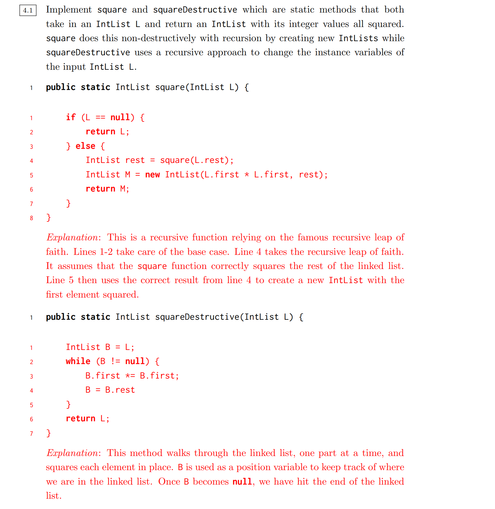

# 1 Discussion 02
:::info
**Video:** [https://www.youtube.com/watch?v=FehYWp8ukdM](https://www.youtube.com/watch?v=FehYWp8ukdM)
:::
[disc02.pdf](https://www.yuque.com/attachments/yuque/0/2023/pdf/12393765/1673617547030-a49dee9c-b112-4c2a-bdbf-a7c74417c216.pdf)
[disc02sol.pdf](https://www.yuque.com/attachments/yuque/0/2023/pdf/12393765/1673703226358-3cb1239b-cef0-4274-8371-8f68e33e4ddf.pdf)
[disc02slides.pdf](https://www.yuque.com/attachments/yuque/0/2023/pdf/12393765/1673617547127-036ab10f-3613-4a95-9223-011db2f9cc44.pdf)

## Review on Static
:::info

:::

## Q1 Scope
:::info

:::
```java
/**
 * Created by AlexMan
 */
public class Pokemon {
    public String name;
    public int level;

    public Pokemon(String name, int level) {

        this.name = name;
        this.level = level;
     }

     public static void main(String[] args) {
         Pokemon p = new Pokemon("Pikachu", 17);
         int level = 100;
         change(p, level);
         System.out.println("Name: " + p.name + ", Level: " + p.level);
     }

     public static void change(Pokemon poke, int level) {
        poke.level = level;
        level = 50;
        poke = new Pokemon("Gengar", 1);
     }
}
```
**Solution**
**Java Visualizer for (b)**


## Q2 Static Methods&Variables⭐⭐⭐⭐⭐ 
:::info

:::
```java
/**
* Created by AlexMan
*/
public class Cat {

    public String name;
    public static String noise;

    public Cat(String name, String noise) {
        this.name = name;
        this.noise = noise;
    }

    public void play() {
        System.out.println(noise + " I'm " + name + " the cat!");
    }

    public static void anger() {
        noise = noise.toUpperCase();
    }

    public static void calm() {
        noise = noise.toLowerCase();
    }

    public static void main(String[] args) {
        Cat a = new Cat("Cream", "Meow!");
        System.out.println(Cat.noise);  // Meow!
        Cat b = new Cat("Tubbs", "Nyan!");
        System.out.println(Cat.noise);  // Nyan!
        a.play(); // Nyan! I'm Cream the cat!
        b.play(); // Nyan! I'm Tubbs the cat!
        Cat.anger();  // Set noise to NYAN!
        System.out.println(Cat.noise); // NYAN!
        a.calm();  // Set noise to nyan!
        System.out.println(Cat.noise); // nyan!
        a.play();  // nyan! I'm Cream the cat!
        b.play();  // nyan! I'm Tubbs the cat!
     }
}

```
**Solutions**⭐⭐⭐**Recap: **[class attributes](https://www.yuque.com/alexman/ac5oth/zq8v53fsmogcbfyv#rZrDR)
本题的关键在于我们是可以通过`this.noise=noise`修改到`class attributes`, 在题干中的第七行代码处发生，这在`python`中是无法实现的，参考CS61A中的[Mint - Class Attributes](https://www.yuque.com/alexman/ac5oth/bmfgkp4p57dhnhg9#LiQyq)的案例。


## Q3 Linked Lists
:::info

:::
```java
public class StringList {
   String head;
   StringList tail;
   public StringList(String head, StringList tail) {
      this.head = head;
      this.tail=tail;
   }
   public static void main(String[] args) {
   StringList L = new StringList("eat", null);
	L = new StringList("shouldn't", L);
	L = new StringList("you", L);
	L = new StringList("sometimes", L);
	StringList M = L.tail;
	StringList R = new StringList("many", null);
	R = new StringList("potatoes", R);
	R.tail.tail = R;
	M.tail.tail.tail = R.tail;
	L.tail.tail = L.tail.tail.tail;
	L = M.tail;
   }
}

```
**Solution**


## Q4 Squaring a List Extra⭐⭐⭐
:::info

:::
```java
/**
 * Created by AlexMan
 */
public class IntListMutation {


    /**
     * Recursive implementation of non-mutative square operation
     * @param L
     * @return
     */
    public static IntList square(IntList L){
        if(L == null){
            return L;
        }else if(L.rest == null){
            return new IntList(L.first * L.first, null);
        }else{
            return new IntList(L.first * L.first,square(L.rest));
        }
    }


    /**
     * Extra: Iterative implementation of non-mutative square operation
     * @param L
     * @return
     */
    public static IntList squareIterative(IntList L){
        if(L == null){
            return L;
        }
        IntList p = L;
        IntList prev = new IntList(-1, null);
        IntList res = prev;
        while(p != null){
            prev.rest = new IntList(p.first * p.first, null);
            prev = prev.rest;
            p = p.rest;
        }
        return res.rest;
    }


    /**
     * Iterative implementation of mutative square operation
     * @param L
     * @return
     */
    public static IntList squareMutative(IntList L){
        IntList p = L;
        while(p != null){
            p.first = p.first * p.first;
            p = p.rest;
        }
        return L;
    }


    /**
     * Extra: Recursive implementation of mutative square operation
     * @param L
     * @return
     */
    public static IntList squareMutativeRecursive(IntList L){
        if(L == null){
            return L;
        }else{
            L.first *= L.first;
            return squareMutativeRecursive(L.rest);
        }
    }


    public static void main(String[] args) {
        IntList L4 = new IntList(20, null);
        IntList L3 = new IntList(15, L4);
        IntList L2 = new IntList(10, L3);
        IntList L1 = new IntList(5, L2);
        System.out.println(L1.strLinkedList());


        // Test the normal ones
        // 1. square
        IntList newL1 = square(L1);
        System.out.println(newL1.strLinkedList());


        // 2. squareMutative
        IntList newMutativeL1 = L1;
        squareMutative(newMutativeL1);
        System.out.println(newMutativeL1.strLinkedList());


        // Test the extra
        IntList LM4 = new IntList(20, null);
        IntList LM3 = new IntList(15, LM4);
        IntList LM2 = new IntList(10, LM3);
        IntList LM1 = new IntList(5, LM2);
        System.out.println(LM1.strLinkedList());
        // 1. squareIterative
        IntList newL2 = squareIterative(LM1);
        System.out.println(newL2.strLinkedList());

        // 2. squareMutativeRecursive
        IntList newMutativeL2 = LM1;
        squareMutativeRecursive(newMutativeL2);
        System.out.println(newMutativeL2.strLinkedList());
    }
}

```
**Solution**


# 2 Exam Prep 02
[examprep02.pdf](https://www.yuque.com/attachments/yuque/0/2023/pdf/12393765/1673742433376-4cb25fdb-922a-47d6-a6ce-7ebb0549567b.pdf)
[examprep02sol.pdf](https://www.yuque.com/attachments/yuque/0/2023/pdf/12393765/1673706250057-0a4a933b-5a5a-4e42-9f36-b0ba1a9cce3f.pdf)

## Q1 Static Shock⭐⭐⭐⭐⭐
:::info

:::
```java
/**
 * Created by AlexMan
 */
public class Shock {
    public static int bang;
    public static Shock baby;
    public Shock() {
        this.bang = 100;
    }
    public Shock (int num) {
        this.bang = num;   // num = 200 , so this.bang(static) now is equal to 200
        baby = starter();  // This line changes the bang from 200 -> 100 for all instances
        this.bang += num;  // num is still 200, but this.bang is 100 now, so this.bang = 100 + 200 = 300
    }
    public static Shock starter() {
        Shock gear = new Shock();
        return gear;
    }
    public static void shrink(Shock statik) {
        statik.bang -= 1;
    }
    public static void main(String[] args) {
        Shock gear = new Shock(200);
        System.out.println(gear.bang); // 300
        shrink(gear);  // This line shrink the bang from 300 to 299
        shrink(starter()); // This line first set the bang to 100, and then shrink it to 99.
        System.out.println(gear.bang); // 99
    }
}
```
**Solution**
:::info
本题对于熟悉`Python`的同学来说会有一些意外，因为在`Python`中我们通过`self.bang`是可以访问到`Class`上的`bang`的，但是`self.bang=100`仅仅只会在当前的`instance`上创建一个独立的`bang`, 不会影响`Class`上的`bang`。而`Shock.bang`可以修改`Class`上的`bang`。
总的来说，`Java`是靠`static`关键字来区分某个变量是`class attribute`还是`instance attribute`的。
:::
```python
class Shock:
    bang = 200

    def __init__(self, bang= 100):
        print(self.bang)  # 200
        Shock.bang = bang # set class attribute to 200
        self.bang = bang  # create an instance variable 200

    def changeBang(self, bang=100):
        self.bang = bang


if __name__ == "__main__":
    t = Shock()
    print(t.bang)
    t.changeBang(400)
    print(Shock.bang)

    m = Shock()
    print(Shock.bang)
```


## Q2 Horse-o-Scope
:::info

:::
```java
/**
 * Created by AlexMan
 */
public class Horse {
    Horse same;
    String jimmy;

    public Horse(String lee) {
        jimmy = lee;
    }

    public Horse same(Horse horse) {
        if (same != null) {
             Horse same = horse;
             same.same = horse;
             same = horse.same;
         }
        return same.same;
    }

    public static void main(String[] args) {
        Horse horse = new Horse("youve been");
        Horse cult = new Horse("horsed");
        cult.same = cult;
        cult = cult.same(horse);
        System.out.println(cult.jimmy);  // "you've been"
        System.out.println(horse.jimmy); // "horsed"
    }
}
```
**Solution**本质上，上述一系列操作都没有直接修改`jimmy`属性。


## Q3 Give em the 'OI Switcheroo⭐⭐⭐
:::info

:::
```java
/**
 * Created by AlexMan
 */
public class Foo {
    public int x, y;

    public Foo (int x, int y) {
        this.x = x;
        this.y = y;
    }

    public static void switcheroo (Foo a, Foo b) {
        /* 仅仅交换local variable持有的reference不会影响外部 */
        Foo temp = a;
        a = b;
        b = temp;
    }

    public static void fliperoo (Foo a, Foo b) {
        /* 标准的交换a,b 的值 */
        Foo temp = new Foo(a.x, a.y);
        a.x = b.x;
        a.y = b.y;
        b.x = temp.x;
        b.y = temp.y;
    }

    public static void swaperoo (Foo a, Foo b) {
        /* 
        * 这里temp和a持有相同的引用，所以b实际上没有被更改，而a被设置成了b的模样
        * */
        Foo temp = a;
        a.x = b.x;
        a.y = b.y;
        b.x = temp.x;
        b.y = temp.y;
    }

    public static void main (String[] args) {
        Foo foobar = new Foo(10, 20);
        Foo baz = new Foo(30, 40);
        switcheroo(foobar, baz); //foobar.x: 10 foobar.y: 20 baz.x: 30 baz.y: 40
        fliperoo(foobar, baz); //foobar.x: 30 foobar.y: 40 baz.x: 10 baz.y: 20
        swaperoo(foobar, baz); //foobar.x: 10 foobar.y: 20 baz.x: 10 baz.y: 20，
        // 注意要在之前的执行结果的基础上操作
    }
}
```
**Solution**


## Q4 Quick Maths
:::info

:::
```java
/**
* Created by AlexMan
*/
public class QuickMaths {
    public static void multiplyBy3(int[] A) {
        for (int x: A) {
        x = x * 3;
        }
    }

    public static void multiplyBy2(int[] A) {
        int[] B = A;
        for (int i = 0; i < B.length; i+= 1) {
            B[i] *= 2;
        }
    }
    public static void swap (int A, int B ) {
        int temp = B;
        B = A;
        A = temp;
    }

    public static void main(String[] args) {
        int[] arr;
        arr = new int[]{2, 3, 3, 4};
        multiplyBy3(arr);

        /* Value of arr: {2,3,3,4} */

        arr = new int[]{2, 3, 3, 4};
        multiplyBy2(arr);

        /* Value of arr: {4,6,6,8} */

        int a = 6;
        int b = 7;
        swap(a, b);

        /* Value of a: 6 Value of b: 7 */
    }
}

```
**Solution**

