[Project 1B_ Applying and Testing Data Structures version 1.0 _ CS 61B Spring 2018.pdf](https://www.yuque.com/attachments/yuque/0/2023/pdf/12393765/1674458877712-a4f02cf1-14b7-4c78-9681-7d6b58ad9e16.pdf)
# Task 1: Deque Interface
:::info
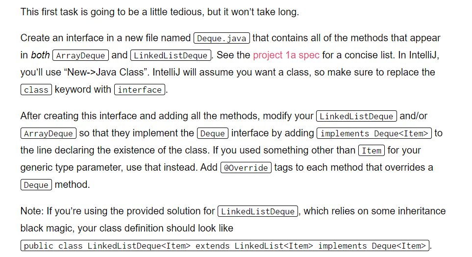
:::
```java
/**
 * Created by AlexMan
 */
public interface Deque<T> {

    // Adds an item of type T to the front of the deque.
    void addFirst(T item);


    // Adds an item of type T to the back of the deque.
    void addLast(T item);


    // Returns true if deque is empty, false otherwise.
    boolean isEmpty();


    // Return the number of items in the deque.
    int size();


    // Prints the items in the deque from first to last, separated by a space.
    void printDeque();


    // Removes and returns the item at the front of the deque. If no such item exists, returns null.
    T removeFirst();


    // Removes and returns the item at the back of the deque. If no such item exists, returns null.
    T removeLast();


    // Gets the item at the given index, where 0 is the front, 1 is the next item, and so forth.
    // If no such item exists, returns null. Must not alter the deque!
    T get(int index);
}
```


# Task 2: WordToDeque
:::info
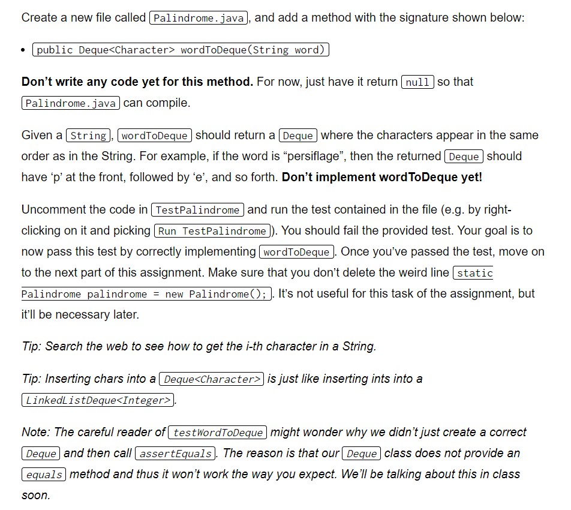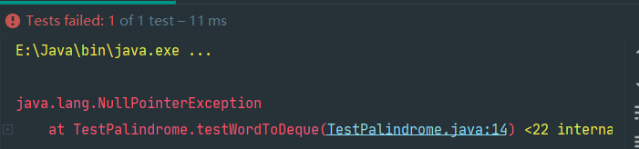
:::
```java
/**
 * Insert the characters in a string in the original
 * order into the deque
 * @param word
 * @return
 */
public Deque<Character> wordToDeque(String word) {
    Deque<Character> wDeque = new LinkedListDeque<>();
    int wordLength = word.length();
    for (int i = 0; i < wordLength; i++) {
        Character c = word.charAt(i);
        wDeque.addLast(c);
    }
    return wDeque;
}
```


# Task 3: Palindrome
## Task 3A: Is Palindrome Testing
:::info
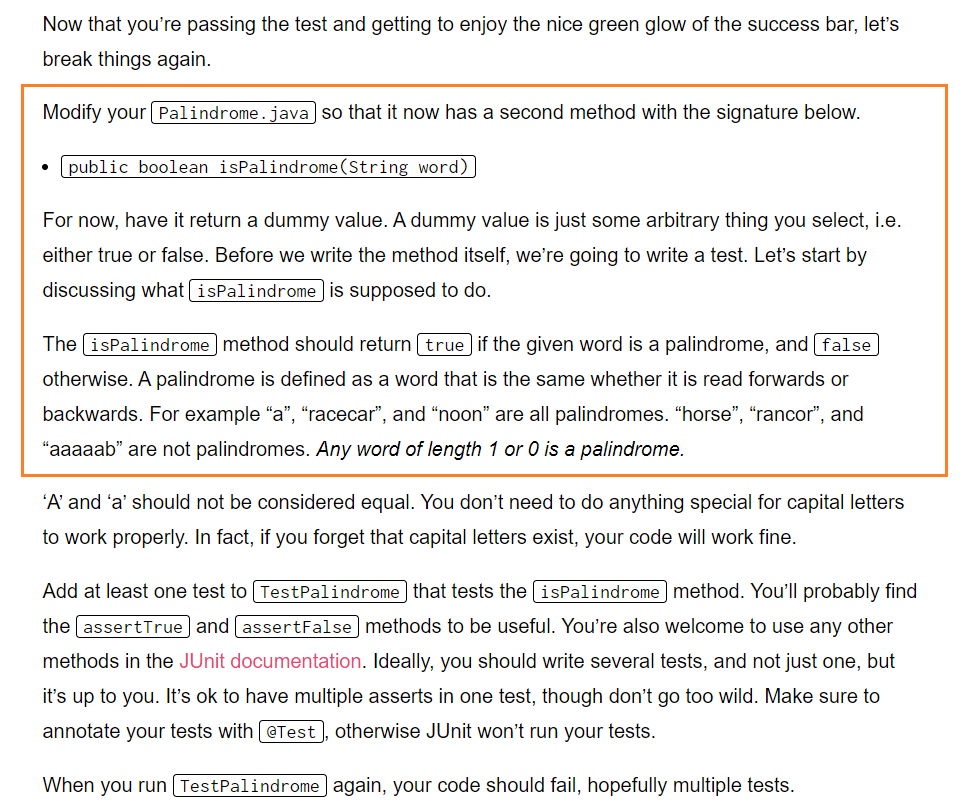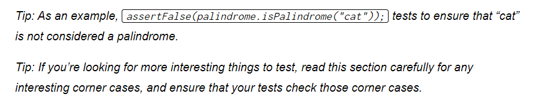
:::


## Task 3B: IsPalindrome
:::info
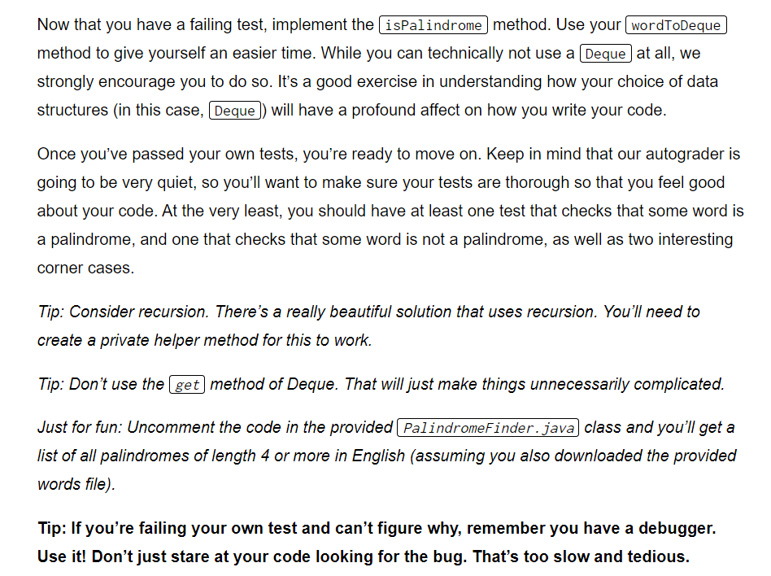
:::
```java
/**
 * Test whether a given word is a palindrome
 * using deque data structure.
 * The method is Case-sensitive
 * @param word
 * @return
 */
public boolean isPalindrome(String word) {
    Deque<Character> wDeque = wordToDeque(word);
    while (wDeque.size() > 1) {
        Character lastWord = wDeque.removeLast();
        Character firstWord = wDeque.removeFirst();
        if (!lastWord.equals(firstWord)) {
            return false;
        }
    }
    return true;
}
```
```java
/**
 * Recursive implementation of isPalindrome
 * without the use of Deque data structure
 * @param word
 * @return
 */
private boolean isPalindromeRecursive(String word) {
    return isPalindromeRecursiveHelper(word, 0, word.length() - 1);
}


/**
 * Helper method for testPalindromeRecursive
 * @param word
 * @param i
 * @param j
 * @return
 */
private boolean isPalindromeRecursiveHelper(String word, int i, int j) {
    if (i >= j) {
        return true;
    }
    char firstWord = word.charAt(i);
    char lastWord = word.charAt(j);
    if (firstWord != lastWord) {
        return false;
    }
    return isPalindromeRecursiveHelper(word, i + 1, j - 1);
}
```
```java
@Test
public void testIsPalindrome() {
    Palindrome p = new Palindrome();
    String palin1 = "abcba";
    String palin2 = "a";
    String palin3 = "Aba";
    String palin4 = "";
    String palin5 = "&s&";
    String palin6 = "$2s2$";
    String palin7 = "1";
    String palin8 = "haha";
    String palin9 = "Asdsa";
    assertTrue(p.isPalindrome(palin1));
    assertTrue(p.isPalindrome(palin2));
    assertFalse(p.isPalindrome(palin3));
    assertTrue(p.isPalindrome(palin4));
    assertTrue(p.isPalindrome(palin5));
    assertTrue(p.isPalindrome(palin6));
    assertTrue(p.isPalindrome(palin7));
    assertFalse(p.isPalindrome(palin8));
    assertFalse(p.isPalindrome(palin9));
    assertFalse(palindrome.isPalindrome("fuckyou"));
    assertFalse(palindrome.isPalindrome("sonofbitch"));
    assertFalse(palindrome.isPalindrome("youfuckingidiot"));
    assertTrue(palindrome.isPalindrome("abcdcba"));
    assertTrue(palindrome.isPalindrome("a"));
    assertFalse(palindrome.isPalindrome("ababssba"));
    assertTrue(palindrome.isPalindrome(""));
}
```

# Task 4: Generalized Palindrome and OffByOne
**Problem Descriptions**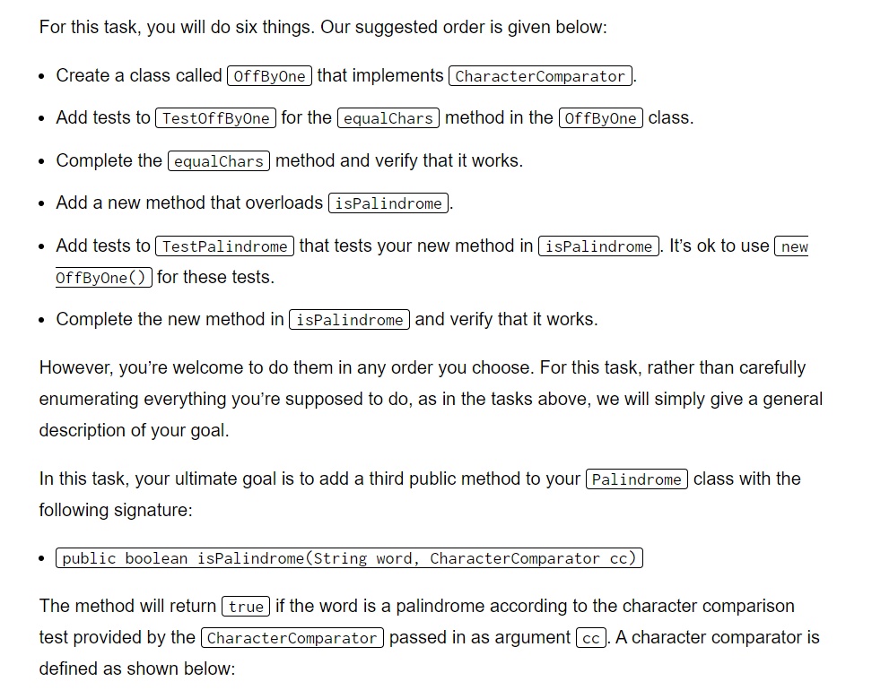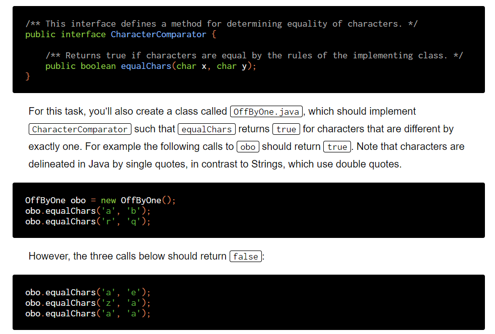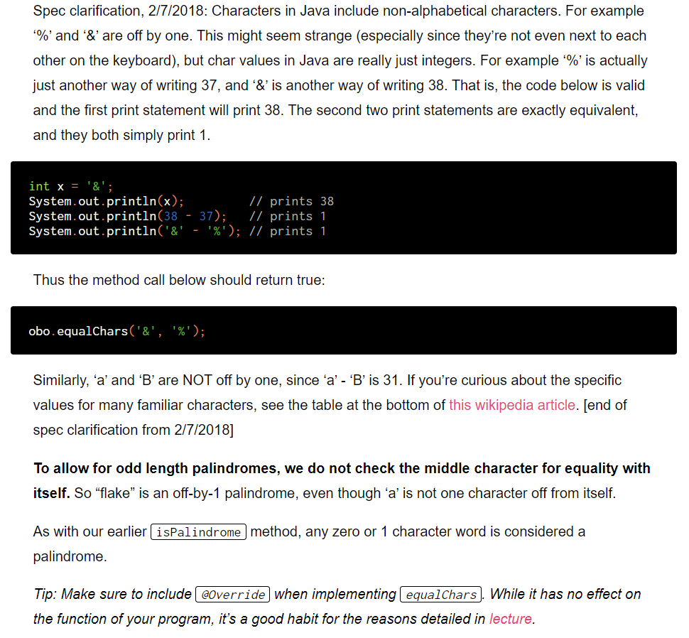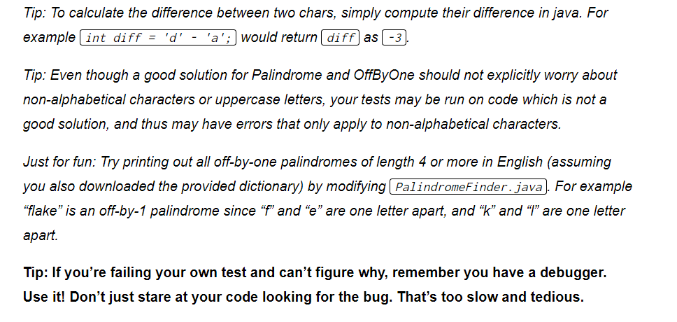
```java
/**
 *
 * @param word
 * @param cc
 * @return
 */
public boolean isPalindrome(String word, CharacterComparator cc) {
    Deque<Character> wDeque = wordToDeque(word);
    while (wDeque.size() > 1) {
        char lastWord = wDeque.removeLast();
        char firstWord = wDeque.removeFirst();
        if (!cc.equalChars(firstWord, lastWord)) {
            return false;
        }
    }
    return true;
}
```
```java
/**
 * Created by AlexMan
 */
public class OffByOne implements CharacterComparator {

    @Override
    public boolean equalChars(char x, char y) {
        return Math.abs(x - y) == 1;
    }
}

```
```java

@Test
public void testPalindromeByOne() {
    Palindrome p = new Palindrome();
    CharacterComparator obo = new OffByOne();
    String palin1 = "unhot";  // true cases
    String palin2 = "stour";
    String palin21 = "rtous"; // Bidirectional
    String palin22 = "Rtous"; // Case sensitive
    String palin3 = "a"; // length 1
    String palin31 = "$";
    String palin32 = "2";
    String palin4 = "";  // length 0
    String palin5 = "abs";  // false
    String palin6 = "&%";
    String palin61 = "20";
    String palin7 = "&s^";
    assertTrue(p.isPalindrome(palin1, obo));
    assertTrue(p.isPalindrome(palin2, obo));
    assertTrue(p.isPalindrome(palin21, obo));
    assertFalse(p.isPalindrome(palin22, obo));
    assertTrue(p.isPalindrome(palin3, obo));
    assertTrue(p.isPalindrome(palin31, obo));
    assertTrue(p.isPalindrome(palin32, obo));
    assertTrue(p.isPalindrome(palin4, obo));
    assertFalse(p.isPalindrome(palin5, obo));
    assertTrue(p.isPalindrome(palin6, obo));
    assertFalse(p.isPalindrome(palin61, obo));
    assertFalse(p.isPalindrome(palin7, obo));
    assertFalse(palindrome.isPalindrome("fuckyou", obo));
    assertFalse(palindrome.isPalindrome("sonofbitch", obo));
    assertFalse(palindrome.isPalindrome("youfuckingidiot", obo));
    assertTrue(palindrome.isPalindrome("flake", obo));
    assertTrue(palindrome.isPalindrome("a", obo));
    assertFalse(palindrome.isPalindrome("ababssba", obo));
    assertTrue(palindrome.isPalindrome("", obo));
}
```


# Task 5: OffByN
:::info
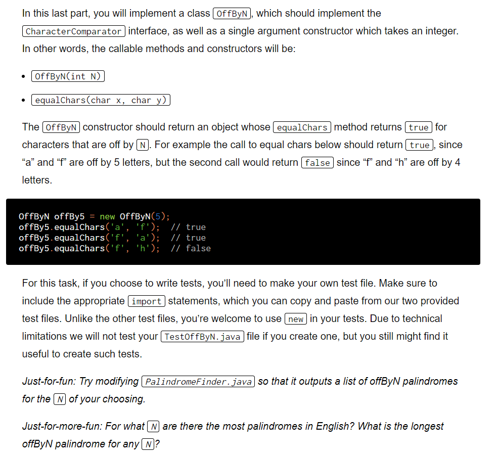
:::
```java
/**
 * Created by AlexMan
 */
public class OffByN implements CharacterComparator {
    private int N;

    public OffByN(int N) {
        this.N = N;
    }

    @Override
    public boolean equalChars(char x, char y) {
        return Math.abs(x - y) == this.N;
    }
}

```


# Submission
:::info

:::


