[Lab 6_ Disjoint Sets _ CS 61B Spring 2019.pdf](https://www.yuque.com/attachments/yuque/0/2023/pdf/12393765/1675947227222-1f1ad6f4-3541-486d-bb6e-f3d32b2d8fc2.pdf)
# Visualizer
> [https://www.cs.usfca.edu/~galles/visualization/DisjointSets.html](https://www.cs.usfca.edu/~galles/visualization/DisjointSets.html)


# Coding Task
> 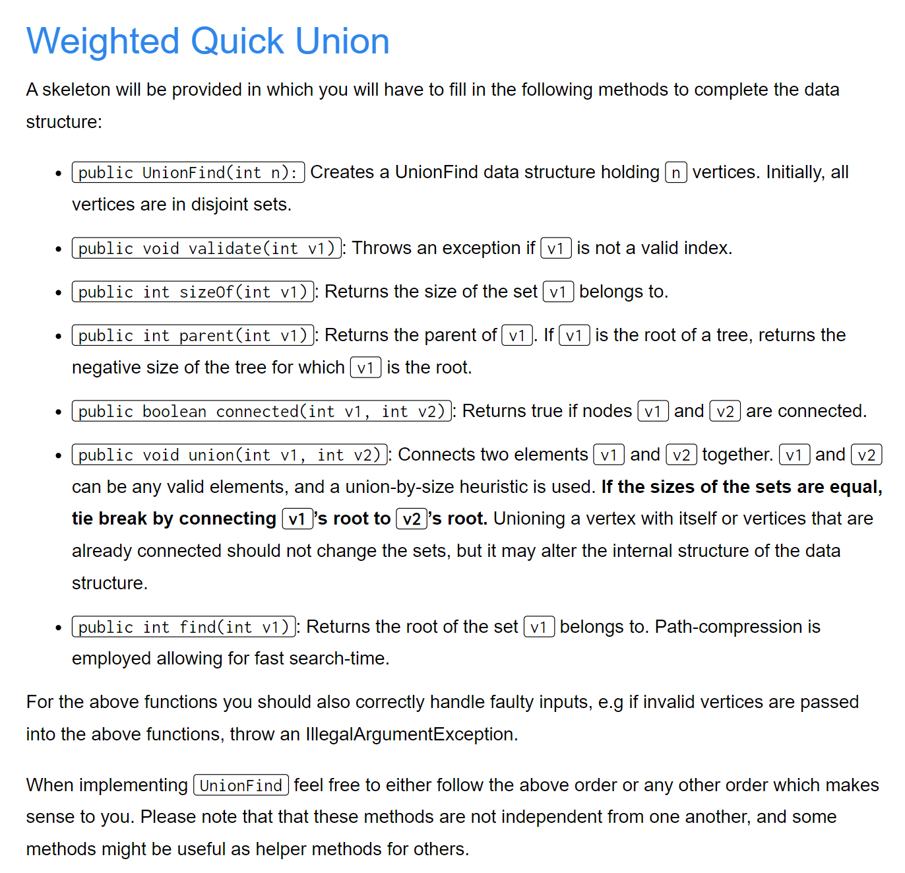
> 本`Lab`要求实现`Weighted Quick Union With Pass Compression`, 下面我们的实现顺序和上面不同，但是是更合理的顺序。

```java
public class UnionFind {

    // TODO - Add instance variables?
    
    /* Creates a UnionFind data structure holding n vertices. Initially, all
       vertices are in disjoint sets. */
    public UnionFind(int n) {
        // TODO
    }

    /* Throws an exception if v1 is not a valid index. */
    private void validate(int vertex) {
        // TODO
    }

    /* Returns the size of the set v1 belongs to. */
    public int sizeOf(int v1) {
        // TODO
        return -1;
    }

    /* Returns the parent of v1. If v1 is the root of a tree, returns the
       negative size of the tree for which v1 is the root. */
    public int parent(int v1) {
        // TODO
        return -1;
    }

    /* Returns true if nodes v1 and v2 are connected. */
    public boolean connected(int v1, int v2) {
        // TODO
        return false;
    }

    /* Connects two elements v1 and v2 together. v1 and v2 can be any valid 
       elements, and a union-by-size heuristic is used. If the sizes of the sets
       are equal, tie break by connecting v1's root to v2's root. Unioning a 
       vertex with itself or vertices that are already connected should not 
       change the sets but may alter the internal structure of the data. */
    public void union(int v1, int v2) {
        // TODO
    }

    /* Returns the root of the set V belongs to. Path-compression is employed
       allowing for fast search-time. */
    public int find(int vertex) {
        // TODO
        return -1;
    }

}
```

## UnionFind
> 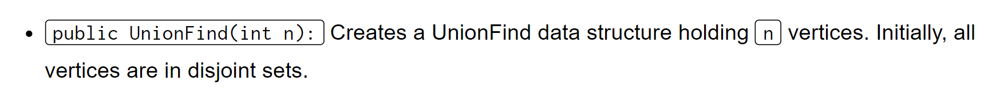
> 首先我们分析底层的数据结构。从`Lecture`中我们知道，我们最好使用`Array`而不是`List<Set<Integer>>`, 同时我们需要表示$n$个顶点，不妨使用`indices`来表示$n$个顶点，由于我们只关心两个顶点是否相连或者要连接两个顶点，所以我们只需要给每一个顶点一个唯一标识就可以，那么`indices`其实就能满足我们的要求，使用`0,1,2,3,...,n-1`来表示`n`个顶点， 所以我们初始化数据结构为:
> `private int[] ds = new int[n];`
> 但是要注意`new int[0]`默认会把所有`int`类型的元素默认初始化为`0`, 所以我们需要手动初始化为`-1`。

```java
public class UnionFind {

    // TODO - Add instance variables?
    private int[] ds;


    /* Creates a UnionFind data structure holding n vertices. Initially, all
       vertices are in disjoint sets. */
    public UnionFind(int n) {
        ds = new int[n];
        // Initialize to -1
        for (int i = 0; i < n; i++) {
            ds[i] = -1;
        }
    }

```
```java
@Test
public void testUnionFind() {
    int[] expected = new int[] {-1,-1,-1,-1,-1,-1,-1,-1,-1,-1,-1,-1,-1,-1,-1};
    UnionFind actual = new UnionFind(15);
    assertArrayEquals(expected, actual.getDS());
}
```

## validate
> 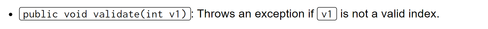
> 检查某个节点是否在`0~n-1`中，比较简单，判断`v1`是否在`0~n-1`中即可。

```java
/* Throws an exception if v1 is not a valid index. */
private void validate(int vertex) {
    // TODO
    if (!(0 <= vertex) || !(vertex < ds.length)) {
        throw new IllegalArgumentException("No such vertex!");
    }
}
```


## parent
> 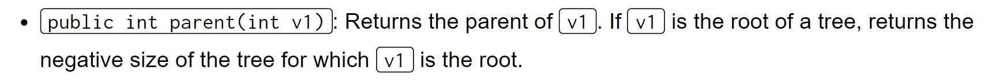
> 注意`root`节点中储存的就是`negative size of the tree`, 所以遇到小于零的值直接返回即可。

```java
/* Returns the parent of v1. If v1 is the root of a tree, returns the
   negative size of the tree for which v1 is the root. */
public int parent(int v1) {
    // TODO
    validate(v1);
    return ds[v1];
}
```
```java
@Test
    public void testParent() {
        UnionFind actual = new UnionFind(3);
        int[] a = actual.getDS();
        a[0] = 2;
        a[1] = 2;
        a[2] = -2;
        assertEquals(2, actual.parent(0));
        assertEquals(2, actual.parent(1));
        assertEquals(-2, actual.parent(2));
    }

```

## find⭐⭐⭐⭐
> 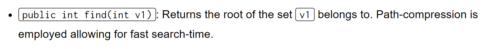
> 我们先考虑没有`path compression`的实现:
> 本质上我们需要返回某个节点`v1`在其集合中的根节点, 那么首先我们肯定要验证这个节点是否合法。然后我们沿着`parent`链条寻找，调用`parent(v1)`直到`parent(v1)<0`表示当前`v1`就是根节点，否则递归调用`find(parent(v1))`。

```java
/* Returns the root of the set V belongs to. Path-compression is employed
   allowing for fast search-time. */
public int find(int vertex) {
    // TODO
    validate(vertex);
    int p = parent(vertex);
    if (p < 0) {
        return vertex;
    } else {
        return find(p);
    }
}
```
> 对于`Path Compression`, 我们看`Lecture`中的描述：
> 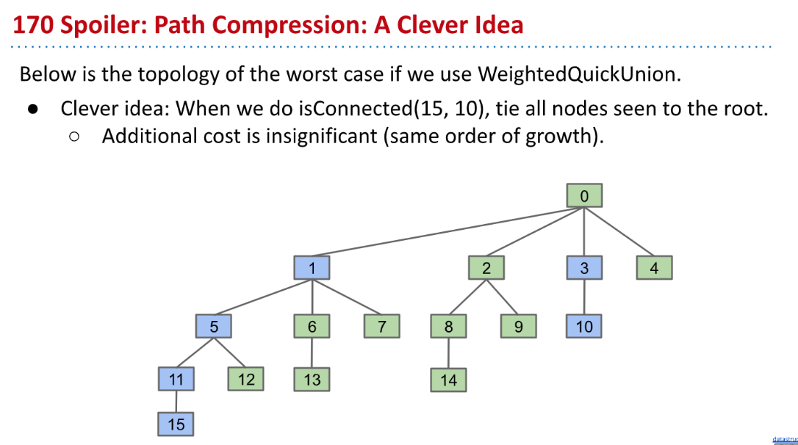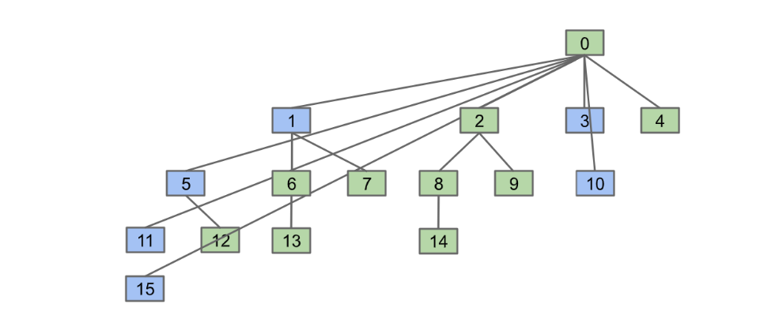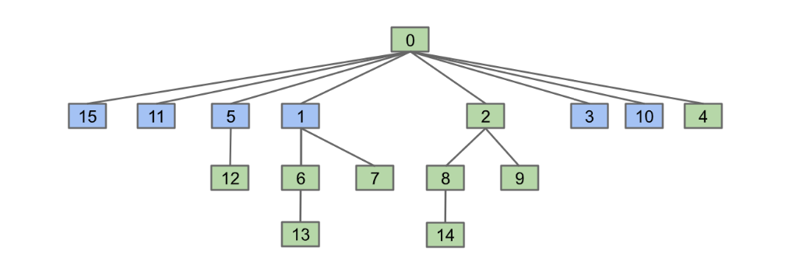
> 本质上就是在`find(v1)`沿着其`parent`链条寻找`root`的过程中, 将沿途所有的节点都和未来要通过`find(v1)`找到的`root`节点做一个关联，也就是将当前的`vertex`对应的`array value at the vertex`设置为`root`, 那么由于`root = find(parent(vertex))`, 所以我们可以令`ds[vertex] = root = find(parent(vertex))`

```java
/* Returns the root of the set V belongs to. Path-compression is employed
   allowing for fast search-time. */
public int find(int vertex) {
    // TODO
    validate(vertex);
    int p = parent(vertex);
    if (p < 0) {
        return vertex;
    } else {
        // Path Compression
        int root = find(p); // Find the root for current vertex
        ds[vertex] = root;  // Set the parent of current vertex to root.
        return root;       
    }
}
```
```java
@Test
public void testFind() {
    int[] array1 = new int[] {1, 2, -2, 4, -1};
    // Test
    UnionFind actual = new UnionFind(array1);
    assertEquals(4, actual.find(3));

    // Test Path Compression, we find 0 which means 0 and 1 are directly connected to the root 2.
    assertEquals(2, actual.find(0));
    assertEquals(2, actual.parent(0));
}
```

## sizeOf
> 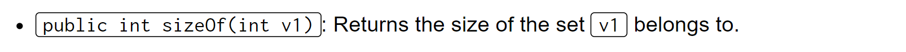
> 一个`set`的`size`我们会记录在根节点的值上，并取负。所以我们需要通过`find(v1)`找到根节点并对其取负。
> 本方法是实现`Weighted Quick Union`的关键，因为要用于判断`disjoint set`的大小来实现子树中的元素个数的平衡。

```java
/* Returns the size of the set v1 belongs to. */
public int sizeOf(int v1) {
    // TODO
    validate(v1);
    return -ds[find(v1)];
}
```
```java
@Test
public void testSizeOf() {
    // The size of 3 should be 2
    UnionFind actual1 = new UnionFind(15);
    actual1.union(2,3);
    assertEquals(2,actual1.sizeOf(3));


    // Should all be 1
    UnionFind actual2 = new UnionFind(15);
    int[] ds = actual2.getDS();
    for (int i = 0; i < ds.length; i++) {
        assertEquals(1, actual2.sizeOf(i));
    }

    UnionFind actual3 = new UnionFind(15);
    actual3.union(2,3);
    assertEquals(2,actual3.sizeOf(2));
    assertEquals(2,actual3.sizeOf(3));
    actual3.union(2,4);
    assertEquals(3,actual3.sizeOf(2));
    assertEquals(3,actual3.sizeOf(3));
    assertEquals(3,actual3.sizeOf(4));
    actual3.union(5,6);
    assertEquals(2,actual3.sizeOf(5));
    assertEquals(2,actual3.sizeOf(6));
    actual3.union(2,5);
    assertEquals(5,actual3.sizeOf(2));
    assertEquals(5,actual3.sizeOf(5));
}
```

## connected
> 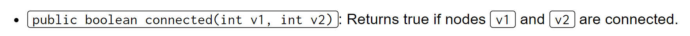

```java
/* Returns true if nodes v1 and v2 are connected. */
public boolean connected(int v1, int v2) {
    // TODO
    validate(v1);
    validate(v2);
    return find(v1) == find(v2);
}
```
```java
@Test
public void testConnected() {
    UnionFind actual3 = new UnionFind(10);
    actual3.union(2,3);
    actual3.union(2,4);
    actual3.union(5,6);
    actual3.union(2,5);
    assertTrue(actual3.connected(2, 3));
    assertTrue(actual3.connected(2, 4));
    assertTrue(actual3.connected(5, 6));
    assertTrue(actual3.connected(2, 5));
    assertTrue(actual3.connected(3, 5));
}
```

## union⭐⭐⭐
> 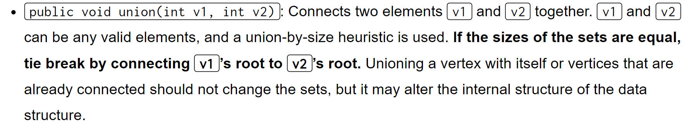

```java
/* Connects two elements v1 and v2 together. v1 and v2 can be any valid 
   elements, and a union-by-size heuristic is used. If the sizes of the sets
   are equal, tie break by connecting v1's root to v2's root. Unioning a 
   vertex with itself or vertices that are already connected should not 
   change the sets but may alter the internal structure of the data. */
public void union(int v1, int v2) {
    // TODO
    validate(v1);
    validate(v2);
    if (v1 == v2) {
        return;
    }
    int root1 = find(v1);
    int root2 = find(v2);
    int treeSize1 = sizeOf(root1);
    int treeSize2 = sizeOf(root2);
    if (treeSize1 <= treeSize2) {
        ds[root1] = root2;
        ds[root2] -= treeSize1;
    } else {
        ds[root2] = root1;
        ds[root1] -= treeSize2;
    }
}
```
```java
@Test
public void testUnion() {
    UnionFind actual3 = new UnionFind(10);
    actual3.union(2,3);
    assertEquals(3,actual3.parent(2));
    actual3.union(2,4);
    assertEquals(3,actual3.parent(2));
    assertEquals(3,actual3.parent(4));
    actual3.union(5,6);
    assertEquals(6,actual3.parent(5));
    actual3.union(2,5);
    assertEquals(3, actual3.parent(2));
    assertEquals(3, actual3.parent(4));
    assertEquals(3, actual3.parent(6));
}
```


# Written Questions
## Quick Find
> 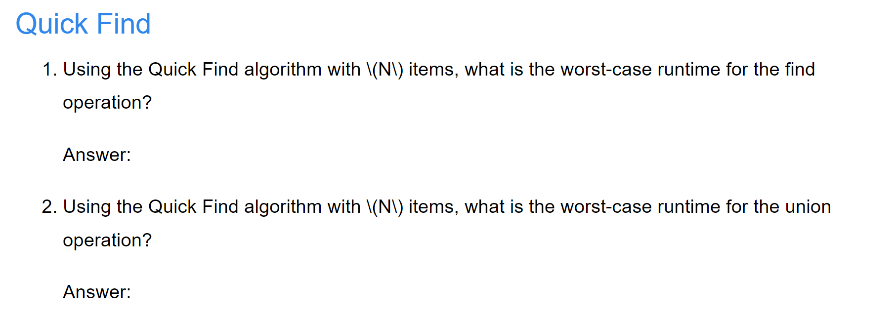

**Solution (1)**$\Theta(1)$, Since we know from lecture that the run time for `isConnected(v1,v2)` is $\Theta(1)$。
**Solution (2)**It is $\Theta(N)$, Since we know from lecture that `connect(v1,v2)` has to iterate through all the elements in the array no matter the input.


## Weighted Quick Union
> 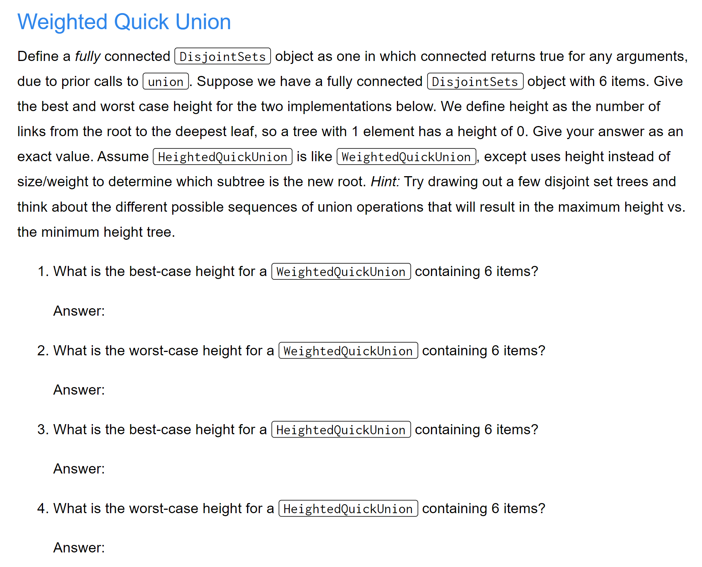

**Solution (1)**Suppose we start at {-1,-1,-1,-1,-1,-1}
union(0,1)
union(2,1)
union(3,1)
union(4,1)
union(5,1)
Best Case Height = 1

**Solution (2)**Suppose we start at {-1,-1,-1,-1,-1,-1}
union(0,1)
union(1,2)
union(3,4)
union(4,5)
union(1,4)
Worst Case height = 2
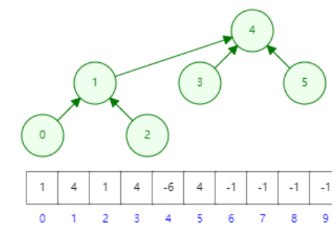
**Solution (3)**Suppose we start at {-1,-1,-1,-1,-1,-1}
Best Case 1
union(0,1)
union(2,1)
union(3,1)
union(4,1)
union(5,1)
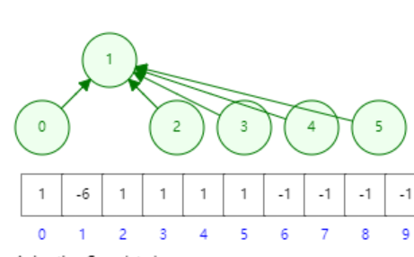
**Solution (4)**Suppose we start at {-1,-1,-1,-1,-1,-1}
Worst Case 2
union(0,1)
union(1,2)
union(3,4)
union(4,5)
union(1,4)
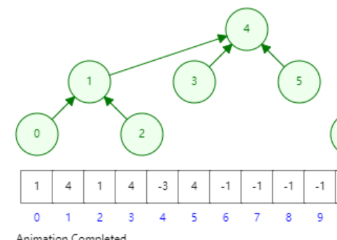
