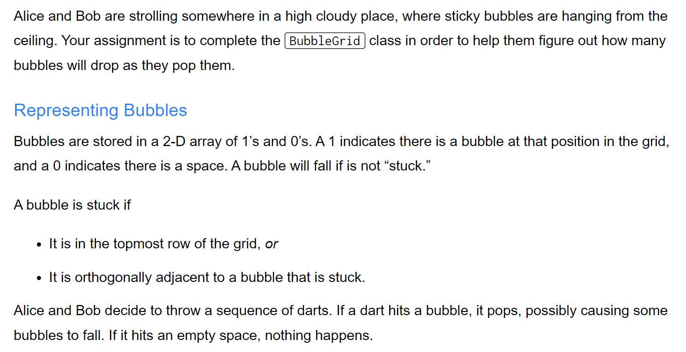
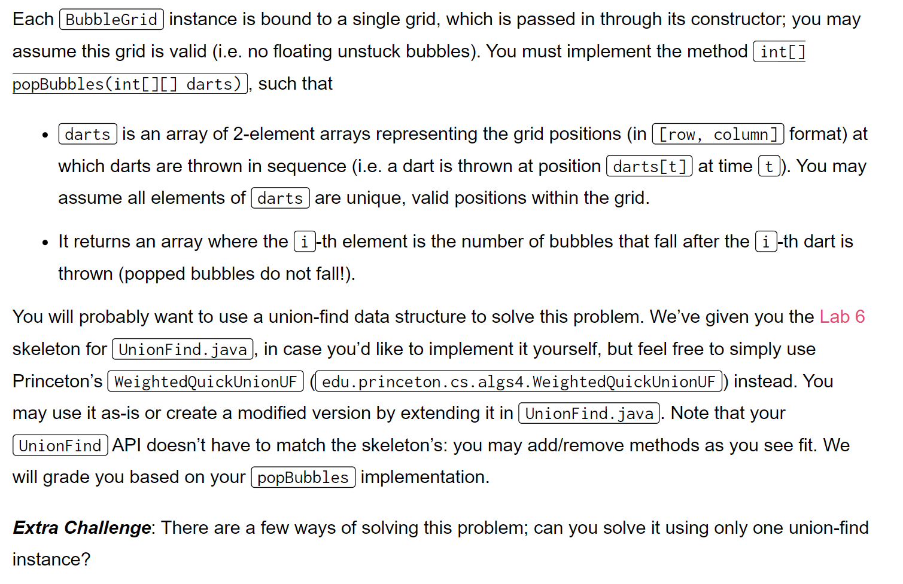
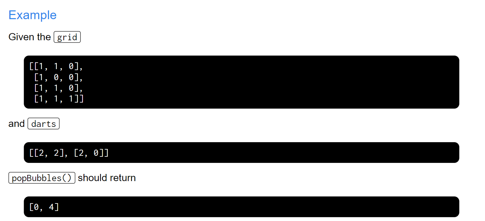

[Challenge Lab 6_ Falling Bubbles _ CS 61B Spring 2019.pdf](https://www.yuque.com/attachments/yuque/0/2023/pdf/12393765/1675947183241-65d8ee9b-d0b4-4439-b347-491bcdaf9b3d.pdf)
[clab6.zip](https://www.yuque.com/attachments/yuque/0/2023/zip/12393765/1676356197941-e360557d-d8c1-46ef-a85d-22fc381fc6af.zip)
# Problem Setting
> 

# Code Task
> 

