[HW 3_ Hashing _ CS 61B Spring 2018.pdf](https://www.yuque.com/attachments/yuque/0/2023/pdf/12393765/1676300608130-9f2b325a-2062-4be9-8efd-3118b7cfe6ea.pdf)


# Simple Oomage - Unique HashCode
> 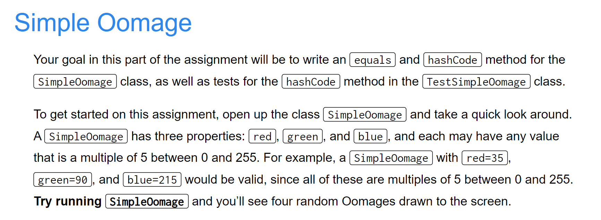


## equals - properties⭐⭐⭐⭐⭐
> 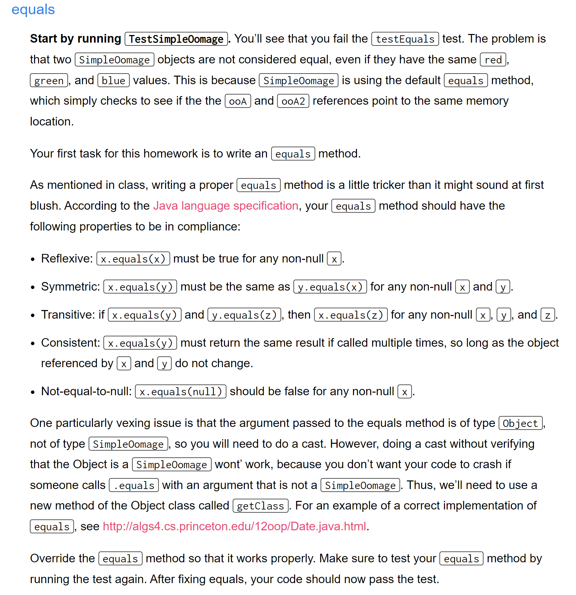

```java
@Override
public boolean equals(Object o) {
    // TODO: Write this method.
    if (o == null) {
        return false;
    }
    if (this.getClass() != o.getClass()) {
        return false;
    }
    SimpleOomage s = (SimpleOomage) o;
    if (s.red == this.red && s.green == this.green && s.blue == this.blue) {
        return true;
    }
    return false;
}
```
```java
@Test
public void testEquals() {
    SimpleOomage ooA = new SimpleOomage(5, 10, 20);
    SimpleOomage ooA2 = new SimpleOomage(5, 10, 20);
    SimpleOomage ooB = new SimpleOomage(50, 50, 50);
    assertEquals(ooA, ooA2);
    assertNotEquals(ooA, ooB);
    assertNotEquals(ooA2, ooB);
    assertNotEquals(ooA, "ketchup");
}
```


## hashCode⭐⭐⭐⭐⭐
> 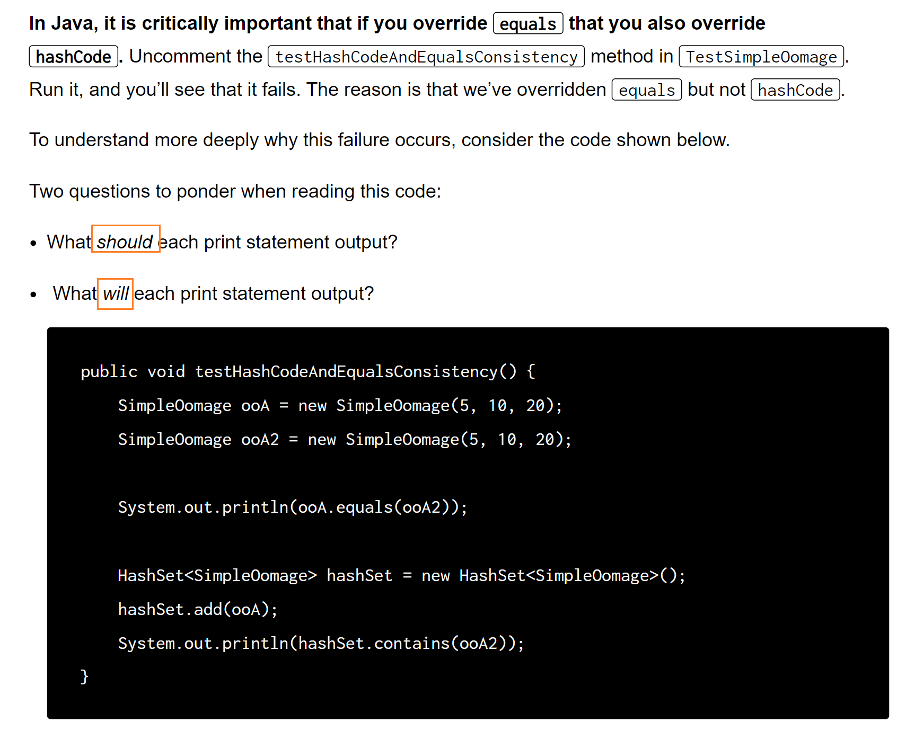

**Answers**⭐⭐⭐⭐⭐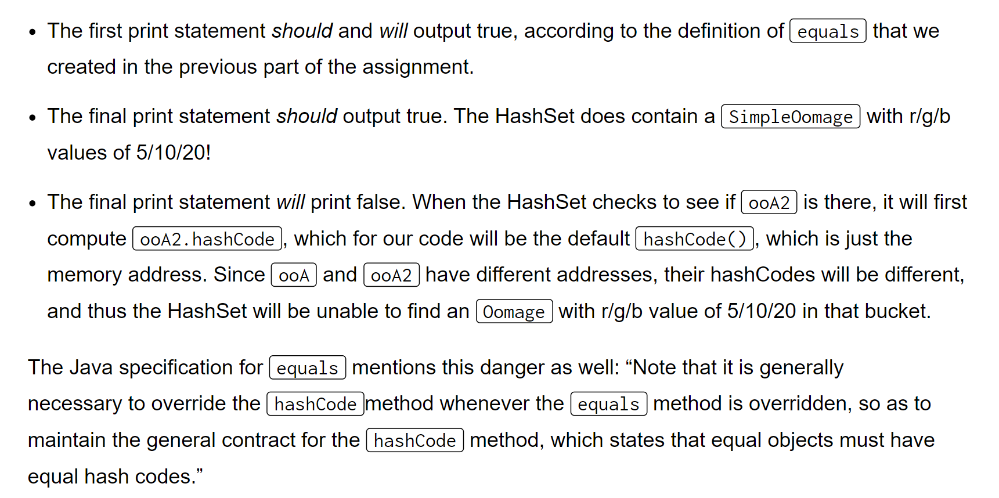
> 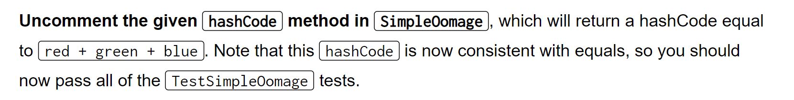

**Test Outputs**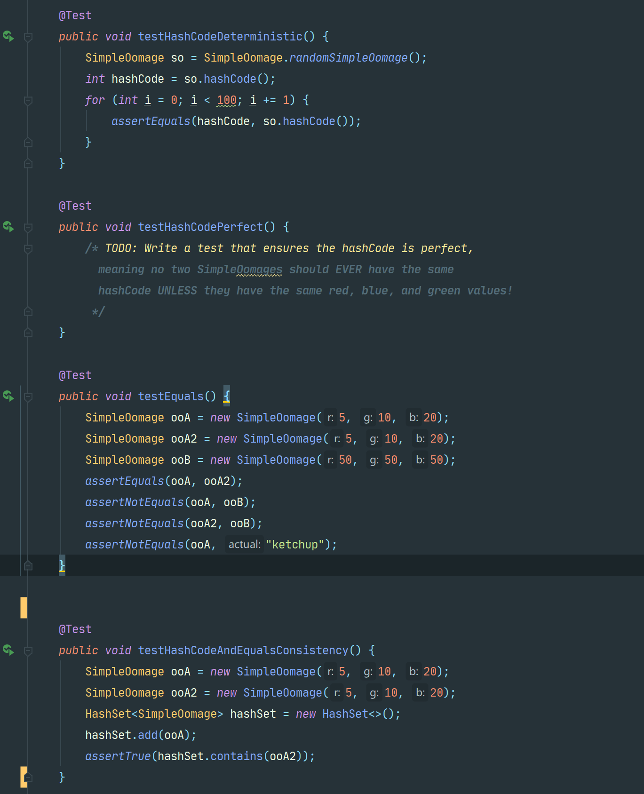

> **Takeaways:**
> 1. `hashCode()`默认返回的是当前对象的内存地址。
> 2. `hashCode()`用于判断一个`Collection`中的对象是否相等。一个典型的例子就是`HashSet`中的`containsKey`。比如`set.add(obj1)`, `set.contains(obj1)=true`, `set.contains(obj2)=false`。
> 3. `equals()`用于直接判断两个对象是否相等，比如`obj1.equals(obj2)`。


## Perfect HashCode - Uniqueness
> 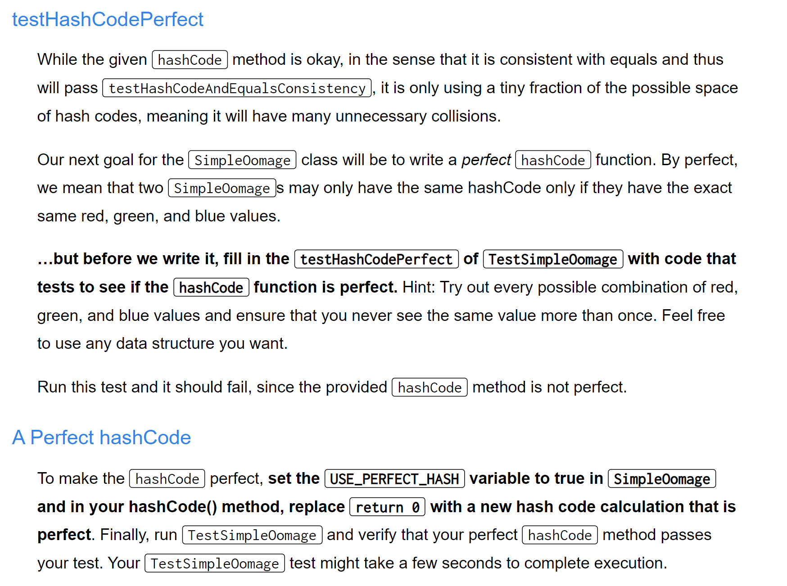
> `Perfect HashCode`就是除非两个完全一模一样的对象(指的是里面的内容一样或者干脆内存地址都一样)，否则`hashCode`就不同。其实就是`Uniqueness`。

```java
/*Uncomment this method after you've written
   equals and failed the testHashCodeAndEqualsConsistency
   test.*/
@Override
public int hashCode() {
    if (!USE_PERFECT_HASH) {
        return red + green + blue;
    } else {
        // 我们可以把2^16, 2^8, 1看成是向量空间的两个基
        // 因为red, green, blue 都不能取到256, 也就是说如果我们要表示
        // 256这个hashCode，我们只能使用r=0, b=1, c=0, 而r=0, g=0, b=256 是不合法的。
        // 这样就消除了二义性。

        // 另一种看法就是说反正red, green, blue 只能取0~255, 我们直接选取256作为base即可
        // 也就是这里的2^8。
        return (red << 16) + (green << 8) + blue;
    }
}
```
```java
@Test
public void testHashCodePerfect() {
    /* TODO: Write a test that ensures the hashCode is perfect,
      meaning no two SimpleOomages should EVER have the same
      hashCode UNLESS they have the same red, blue, and green values!
     */
    // We have to draw any possible pair
    List<List<Integer>> params = new ArrayList<>();
    for (int r = 0; r < 256; r++) {
        for (int g = 0; g < 256; g++) {
            for (int b = 0; b < 256; b++) {
                List<Integer> nested = new ArrayList<>();
                nested.add(r);
                nested.add(g);
                nested.add(b);
                params.add(nested);
            }
        }
    }
    // Choose two pair
    int size = params.size();
    for (int i = 0; i < size; i++) {
        for (int j = i; j < size; j++) {
            List<Integer> param1 = params.get(i);
            List<Integer> param2 = params.get(i);
            SimpleOomage s1 = new SimpleOomage(param1.get(0),param1.get(1),param1.get(2));
            SimpleOomage s2 = new SimpleOomage(param2.get(0),param2.get(1),param2.get(2));
            if (i == j) {
                assertEquals(s1.hashCode(), s1.hashCode());
            } else {
                assertNotEquals(s1.hashCode(), s2.hashCode());
            }
        }
    }
```


# Test HashCode for Simple Oomage
## Evaluate it in Junit
> 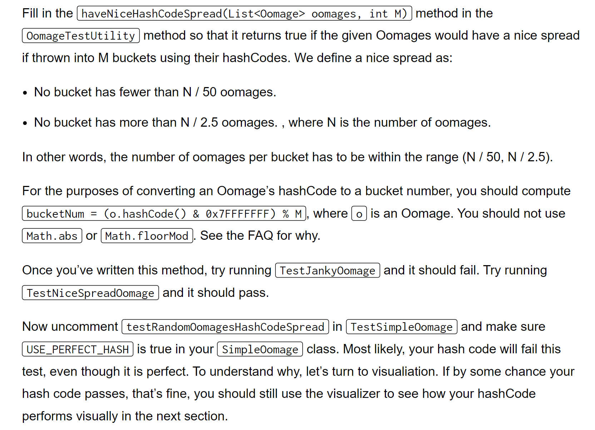

```java
public static boolean haveNiceHashCodeSpread(List<Oomage> oomages, int M) {
    /* TODO:
     * Write a utility function that returns true if the given oomages
     * have hashCodes that would distribute them fairly evenly across
     * M buckets. To do this, convert each oomage's hashcode in the
     * same way as in the visualizer, i.e. (& 0x7FFFFFFF) % M.
     * and ensure that no bucket has fewer than N / 50
     * Oomages and no bucket has more than N / 2.5 Oomages.
     */
    int N = oomages.size();
    int bucketNum = -1;
    Map<Integer, Integer> mmap = new HashMap<>();
    for (int i = 0; i < M; i++) {
        mmap.put(i, 0);
    }
    for (Oomage o: oomages) {
        //  & 0x7FFFFFFF 就是取负号，防止negative hashCode的出现而导致 % 因为
        // 默认不采用floorMod, 而导致数组越界。
        bucketNum = (o.hashCode() & 0x7FFFFFFF) % M;
        mmap.put(bucketNum, mmap.get(bucketNum) + 1);
    }
    for (Integer key: mmap.keySet()) {
        Integer num = mmap.get(key);
        if (num < N / 50 || num > N / 2.5) {
            return false;
        }
    }
    return true;
}
```
```java
/* TODO: Uncomment this test after you finish haveNiceHashCode Spread in OomageTestUtility */
@Test
public void testRandomOomagesHashCodeSpread() {
    List<Oomage> oomages = new ArrayList<>();
    int N = 10000;

    for (int i = 0; i < N; i += 1) {
        oomages.add(SimpleOomage.randomSimpleOomage());
    }

    assertTrue(OomageTestUtility.haveNiceHashCodeSpread(oomages, 10));
}
```
**Failed Test Output**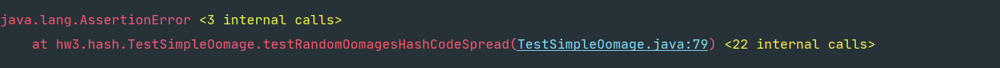

## Mod Operation Remarks
> 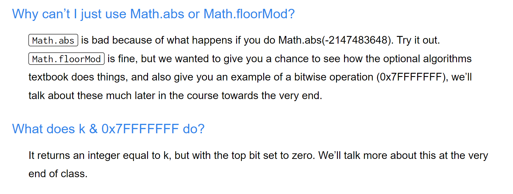


## Cautions - Multiples
> 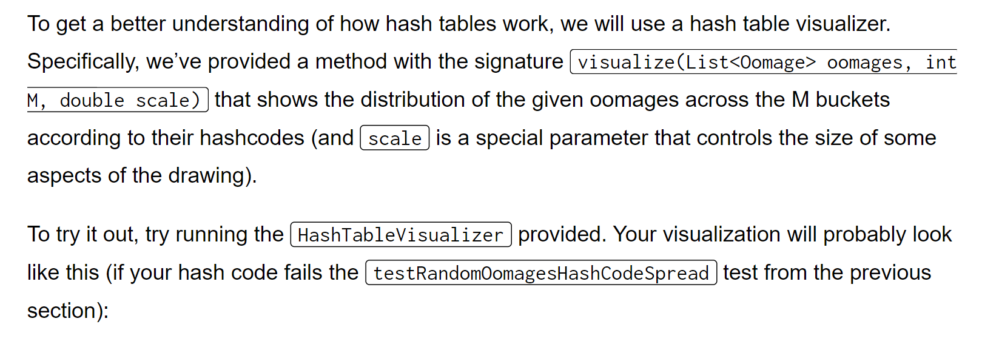

**Visualizer Output When M=10**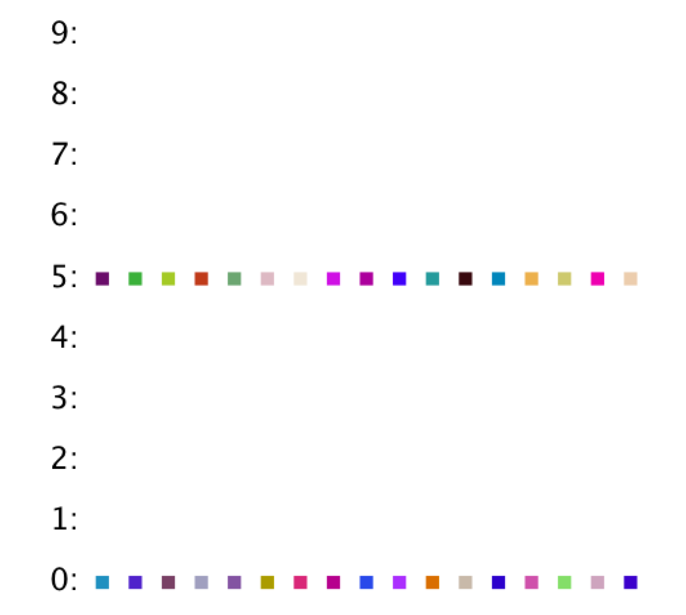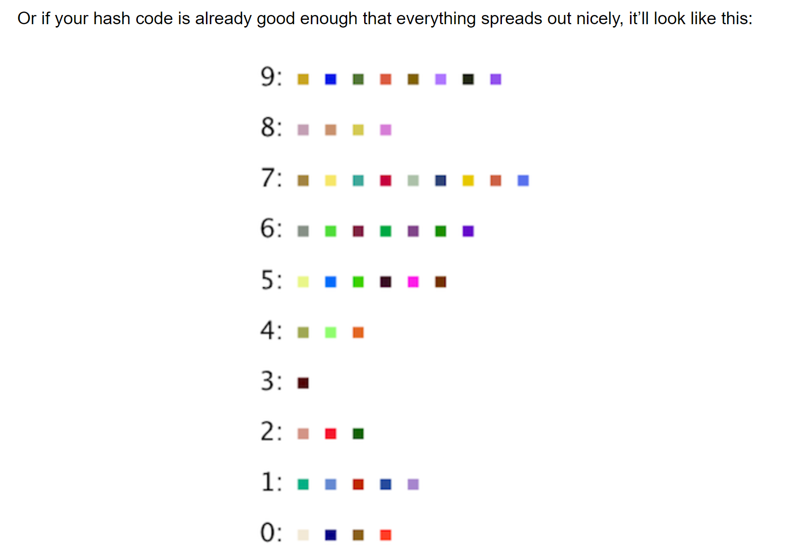

> 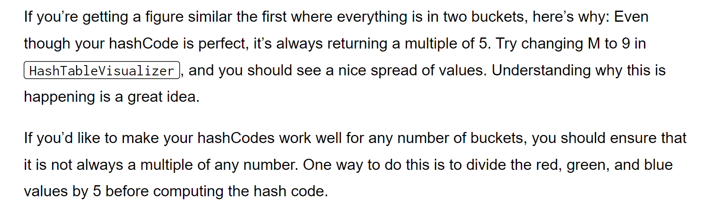

**Visualizer Output When M=9**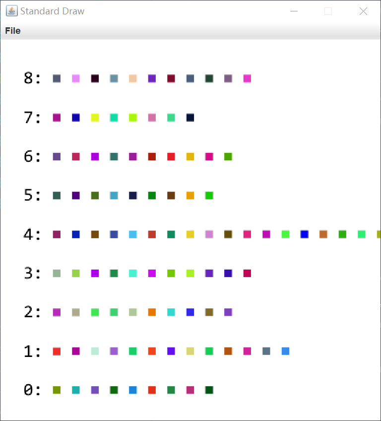


## Perfect HashCode W.O. Multiples
> 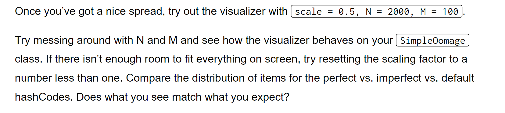
> 下面的实现是`unique`的。

```java
/*Uncomment this method after you've written
   equals and failed the testHashCodeAndEqualsConsistency
   test.*/
@Override
public int hashCode() {
    if (!USE_PERFECT_HASH) {
        return red + green + blue;
    } else {
        return (red / 5 << 16) + (green / 5 << 8) + blue / 5;
    }
}
```
**Successful Test Output**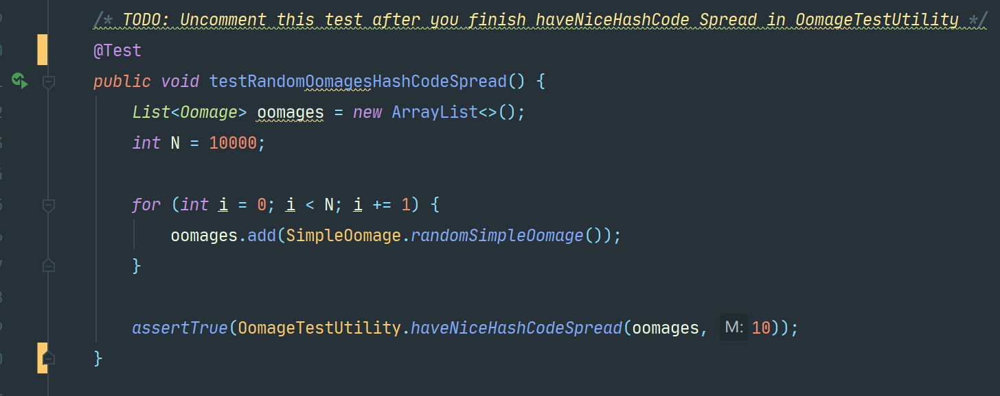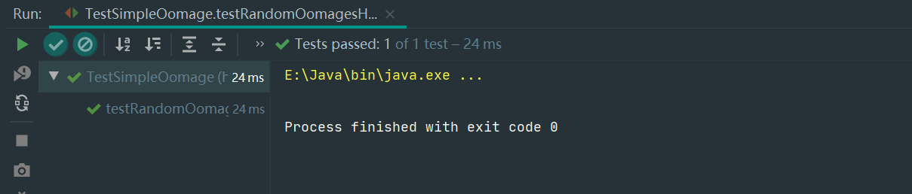
**Spread Visualization When No Multiples (scale=1.0, N=100, M=10)**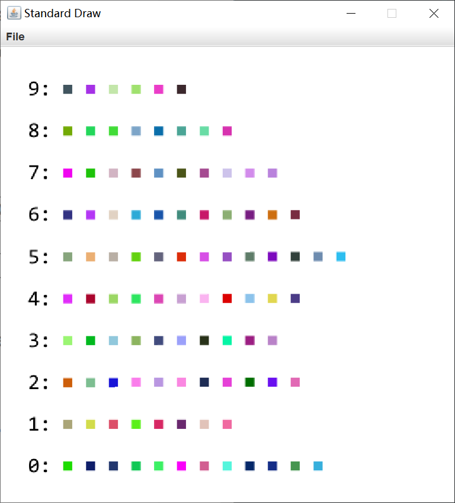
**Spread Visualization (scale=0.5, N=2000, M=100)**


# Complex Oomage - Handling Collision
> 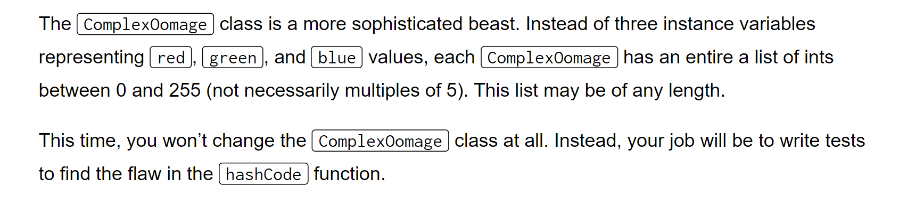


## Evaluaing the ComplexOomage hashCode
> 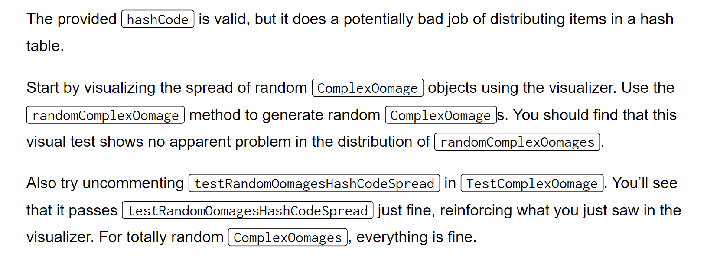

**Successful Tests**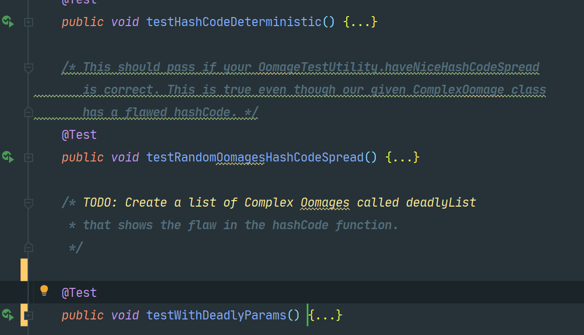
之所以能够通过第三个`testWithDeadParams`测试，是因为我们还没有加入任何的`Oomages`。
```java
public static void main(String[] args) {
    /* scale: StdDraw scale
       N:     number of items
       M:     number of buckets */

    /* After getting your simpleOomages to spread out
       nicely, be sure to try
       scale = 0.5, N = 2000, M = 100. */

    double scale = 1.0;
    int N = 100;
    int M = 10;

    HashTableDrawingUtility.setScale(scale);
    List<Oomage> oomies = new ArrayList<>();
    for (int i = 0; i < N; i += 1) {
    	// Added here.
        oomies.add(ComplexOomage.randomComplexOomage());
    }
    visualize(oomies, M, scale);
}
```
**Complex Oomages Visualizer (二维图像)**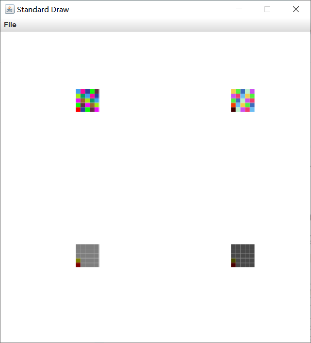

**Spread Visualizer (scale=1.0, N=100, M=10)**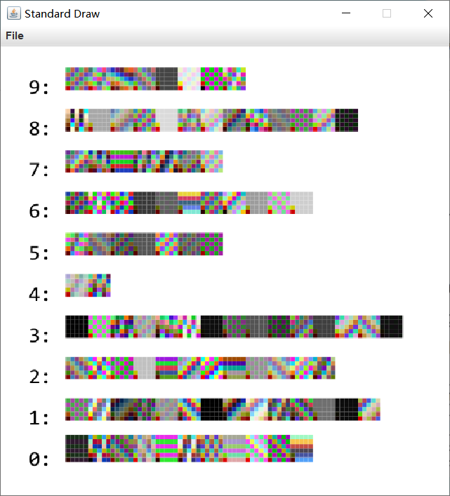


## Int Overflows
> 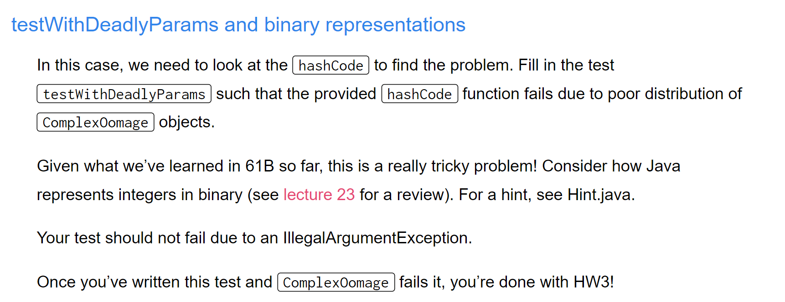

```java
package hw3.hash;

public class Hint {
    public static void main(String[] args) {
        System.out.println("The powers of 256 in Java are:");
        int x = 1;
        for (int i = 0; i < 10; i += 1) {
            System.out.println(i + "th power: " + x);
            x = x * 256;
        }
    }
} 
```
**Output and Why?**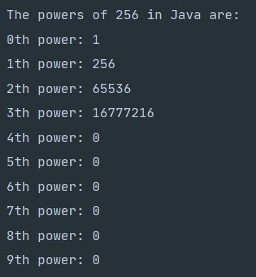
在`4-th power`的时候，由于`Java`中的`int`类型变量只有`32`位，所以在第四次`x * 256`操作后，`x * 256`的实际结果应该是`11100.....000`, 但是后`32`位被储存在了左侧的`int x`变量中，导致`x = 0`。
```java
/* TODO: Create a list of Complex Oomages called deadlyList
 * that shows the flaw in the hashCode function.
 */
@Test
public void testWithDeadlyParams() {
    List<Oomage> deadlyList = new ArrayList<>();

    // Your code here.
    for (int N = 0; N < 100; N++) {
        List<Integer> params = new ArrayList<>();
        // Generate a random sequence of variable length
        Random r = new Random();
        int length = 5;
        for (int i = 0; i < length; i++) {
            params.add(0);
        }
        ComplexOomage co = new ComplexOomage(params);
        System.out.println(co.hashCode());
        deadlyList.add(co);
    }
    assertTrue(OomageTestUtility.haveNiceHashCodeSpread(deadlyList, 10));
}
```


## Fix the hashCode
> 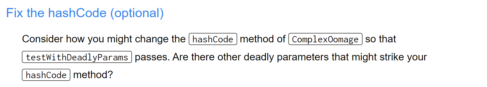
> 如果`params`的最后四位为零(相当于乘以$256^4$), 根据前面的`Int Overflow`示例, 我们知道这一定会导致`int overflow`，使得元素全部被`hash function`分类到`0`号`bucket`。导致`0`号`bucket`里的元素过多，成为`deadly parameters`。
> 下面的`fix`可以解决`deadly link`的问题, 但是不能保证`hashCode`是`unique(perfect)`的。

```java
@Override
public int hashCode() {
    int total = 0;
    for (int x : params) {
        total = total * 31;
        total = total + x;
    }
    return total;
}
```


## Why 31?
### Java Bit Operations
> 左移的规则只记住一点：“丢弃”最高位，0补最低位
> 如果移动的位数超过了该类型的最大位数，那么编译器会对移动的位数取模。如对int型移动33位，实际上只移动了33%32=1位。

```java
for (int i = 1; i <42 ; i++) {
    int number= 1 << i;
    System.out.println("i:"+i+"**number:"+number);
}
```
```java
i:1**number:2
i:2**number:4
i:3**number:8
i:4**number:16
i:5**number:32
i:6**number:64
i:7**number:128
i:8**number:256
i:9**number:512
i:10**number:1024
i:11**number:2048
i:12**number:4096
i:13**number:8192
i:14**number:16384
i:15**number:32768
i:16**number:65536
i:17**number:131072
i:18**number:262144
i:19**number:524288
i:20**number:1048576
i:21**number:2097152
i:22**number:4194304
i:23**number:8388608
i:24**number:16777216
i:25**number:33554432
i:26**number:67108864
i:27**number:134217728
i:28**number:268435456
i:29**number:536870912
i:30**number:1073741824
i:31**number:-2147483648
i:32**number:1
i:33**number:2
i:34**number:4
i:35**number:8
i:36**number:16
i:37**number:32
i:38**number:64
i:39**number:128
i:40**number:256
i:41**number:512
```
```java
int number=1;
for (int i = 1; i <42 ; i++) {
	number= number  << 1;
	System.out.println("i:"+i+"**number:"+number);
}
```
```java
i:1**number:2
i:2**number:4
i:3**number:8
i:4**number:16
i:5**number:32
i:6**number:64
i:7**number:128
i:8**number:256
i:9**number:512
i:10**number:1024
i:11**number:2048
i:12**number:4096
i:13**number:8192
i:14**number:16384
i:15**number:32768
i:16**number:65536
i:17**number:131072
i:18**number:262144
i:19**number:524288
i:20**number:1048576
i:21**number:2097152
i:22**number:4194304
i:23**number:8388608
i:24**number:16777216
i:25**number:33554432
i:26**number:67108864
i:27**number:134217728
i:28**number:268435456
i:29**number:536870912
i:30**number:1073741824
i:31**number:-2147483648
i:32**number:0
i:33**number:0
i:34**number:0
i:35**number:0
i:36**number:0
i:37**number:0
i:38**number:0
i:39**number:0
i:40**number:0
i:41**number:0
```


### Bit Operations
> 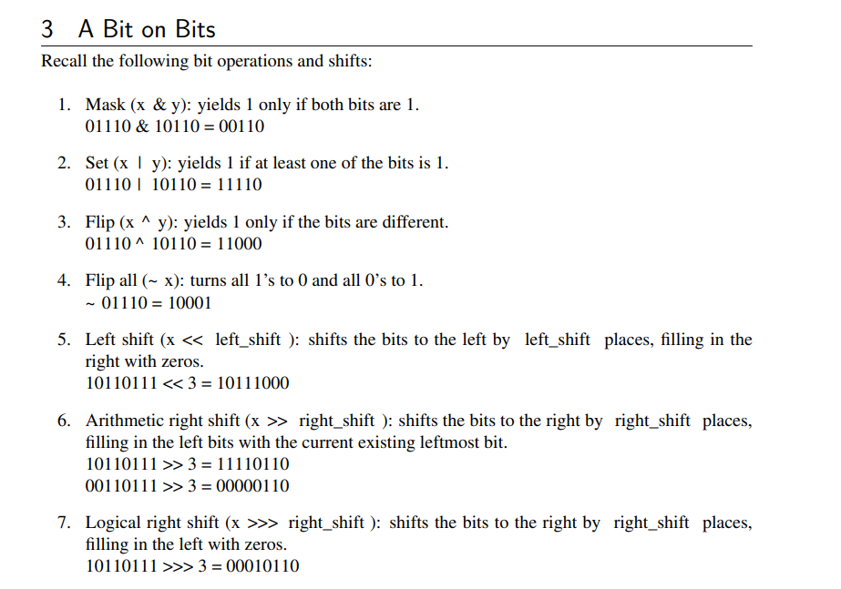


### Reason
> 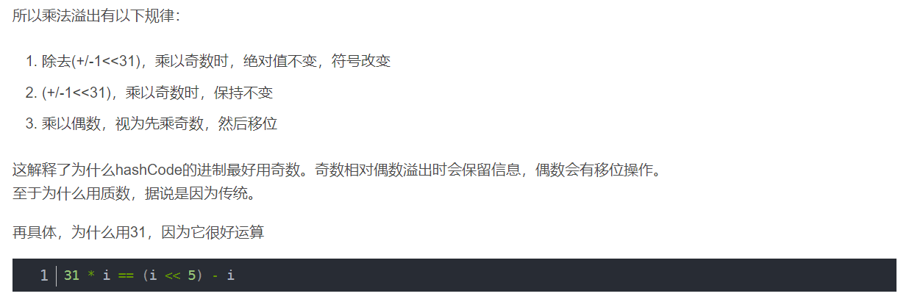


# Summary - Hash Function
> 1. Deterministic(Idempotent): 输入一致则输出一致。
> 2. Perfectness: 不同的`Object`的`HashCode`不同, 也就是每个`Object`有自己的唯一标识，`Uniqueness`, 或者说如果使用`Open-Address`则不会存在`HashCollision`。


# Submission
> 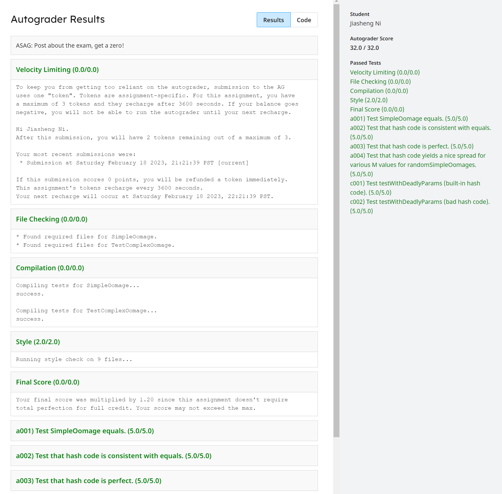

