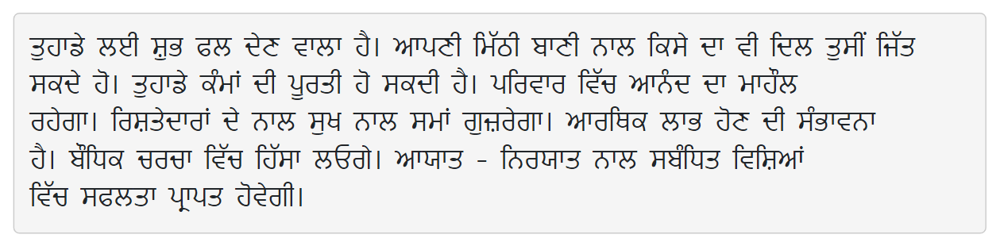

[Assignment 2.zip](https://www.yuque.com/attachments/yuque/0/2023/zip/12393765/1675492661336-c8532a36-e6ca-4cfe-850c-7145369ed04b.zip)
[CS106B Fun with Collections.pdf](https://www.yuque.com/attachments/yuque/0/2023/pdf/12393765/1675492701298-6d39fb76-4dee-4d36-9dcb-02ed8f9f22ca.pdf)
> [https://web.stanford.edu/class/archive/cs/cs106b/cs106b.1224/assignments/a2/#milestone-one-form-k-grams](https://web.stanford.edu/class/archive/cs/cs106b/cs106b.1224/assignments/a2/#milestone-one-form-k-grams)


# Part 1: Language Identification
## Background
### Introduction
> 
> 本题目旨在通过网页文本信息推断出网页的源语言(英语，法语，西班牙语等)。


### Trigram Profiles
> **下面是一些**`**K-gram**`**的定义和定义:**
> 1. `K-gram`: 对于长度为$n$的字符串$s[1,2,\cdots, n]$来说，`K-gram`定义为任何$s[i,i+1,\cdots, i+k-1], \forall i=1,2,\cdots, n-k+1$的连续字串。
> 2. 对于长度为$n$的字符串来说，`K-gram`的个数为$n-k+1$个。
> 3. 如果$n<k$, 则这个字符串不存在`K-gram`。
> 
`**Trigram**`**就是**`**K-gram**`**的**$k=3$**时的特殊情况:**
> 1. 对于字符串`ABCDEFG`$n=7$来说，其`3-gram`是`ABC,BCD,CDE,DEF,EFG`共$5$个。
> 2. 对于`Wikipedia`网站的[Human](https://en.wikipedia.org/wiki/Human)一文来说，他的`3-gram frequency map`如下:
> 

> **同样的文章对应其他语种的**`**3-gram frequency map**`**:**
> 
> 以及包含`UTF-8`字符的语言:
> 


## Implementations - Stanford C++
### Step 1: Find All K-grams
> 算法的第一步是将一段字符串中的所有`K-gram`都求出来, 封装在一个`Map`中。
> 
> **注意点:**
> 1. `kGramLength > 0`, 否则报错
> 2. 如果`kGramLength > str.size()`, 此时`str`没有`kGram`的存在，返回空的`Map`。

**Side Notes**
```cpp
Map<string, double> kGramsIn(const string& str, int kGramLength) {
    /* TODO: Delete this comment and the other lines here, then implement
     * this function.
     */

    // Should be Positive
    if(kGramLength <= 0) {
        error("Bad Inputs!");
    }

    if (str.size() < kGramLength) {
        return {};
    }

    Map<string, double> res;

    for (int i = 0; i < str.size() - kGramLength + 1; i++) {
        res[str.substr(i, kGramLength)]++;
    }

    return res;
}
```


### Step 2: Normalize Frequencies
> 注意到不同长度的文本在相同语言下的`Trigrams Mapping`的`Frequency Mapping`会随着文档长度逐步增加的。即:
> 
> 所以为了比较不同文本在相同语言下的`Trigram Mapping`的相似程度，我们需要消除文本长度带来的影响，于是我们可以对`Trigram Mapping`进行`Normalization`。
> 我们可以借鉴线性代数中的`Normalization Technique`, 即我们可以将一个`Trigram Mapping`看成是一个向量，然后我们只需要除以其`L2-Norm`即可:
> 
> 所以我们的目标是将`Milestone 1`中得到的`Mapping`做`Normalization`:
> 

**Side Notes**
```cpp
Map<string, double> normalize(const Map<string, double>& input) {
    /* TODO: Delete this comment and the other lines here, then implement
     * this function.
     */
    Map<string, double> res;
    double length = 0.0;
    for (string key: input) {
        length = length + pow(input[key], 2);
    }

    length = sqrt(length);
    // Reports error when the input entries are all zeros
    if (length == 0) {
        error("All entries are zero! Not valid for computing!");
    }

    for (string key: input) {
        res[key] = input[key] / length;
    }
    return res;
}
```


### Step 3: Filter out Uncommon KGrams
> 对于任意两篇文档来说，出现次数较多的`KGrams`往往是相同的(我们指的是`Key`相同)。而往往是那些出现次数较少的`KGrams`会导致明明很相似的两片文档看起来很不一样(因为出现次数较少的`KGrams`实际上可以理解为`Outliers`, 不能作为判断文档相似程度的依据)。
> 
> 所以我们需要`Filter Out`那些`Frequency`较低的`KGrams`。
> 一种思路是，我们可以保留前`numToKeep`个`KGrams`(按照出现频率排序)，实现数据结构可以使用`PriorityQueue`，比较方便。
> **注意: **`Stanford Library`的`Priority Queue`是小顶堆，也就是我们的`peek()`返回的是最小的`Priority`的元素。
> 但是从小顶堆转换成大顶堆的过程其实很简单，就只需要把所有`Priority`都去一个负号就可以了。

**Side Notes**
```cpp
Map<string, double> topKGramsIn(const Map<string, double>& source, int numToKeep) {
    /* TODO: Delete this comment and the other lines here, then implement
     * this function.
     */
    if (numToKeep < 0) {
        error("Invalid Number.");
    }

    if (numToKeep > source.size()) {
        return source;
    }

    PriorityQueue<string> pq;
    for (string key: source) {
        pq.enqueue(key, - source[key]);
    }

    Map<string, double> res;
    while (numToKeep > 0) {
        string key = pq.dequeue();
        res.put(key, source[key]);
        numToKeep--;
    }

    return res;
}
```


### Step 4: Cosine Similarity
> 在`Section 2`中我们知道，我们可以使用`Jaccard Similarity`来度量两个文档之间的相似程度。在这里我们采用一种新的方式`Cosine Similarity`。
> 假设我们有两个文档的`Normalized Kgrams-Frequency`, 假设为:
> 1. `{'aaa':0.1, 'bbb': 0.2, 'ccc': 0.3} `
> 2. `{'bbb':0.5, 'ccc': 0.6, ,'ddd': 0.7} `
> 
**则它们的**`**Cosine Similarity**`**的计算方法是:**
> 选取两个文档中同时存在的`Key`对应的`Frequency`相乘，即`bbb`和`ccc`, 结果是`0.2 * 0.5 + 0.3 * 0.6 = 0.28`
> `Cosine Similarity`的一个重要性质是: 永远介于$0$和$1$中。回忆一下，两个单位向量$\vec{u}$和$\vec{v}$的内积$\vec{u}^{\top}\vec{v}=|u||v|cos(\theta)=cos(\theta)\in [0,1]$，而上述文档之间的`Cosine Similarity`实际上还小于内积的值。
> 

```cpp
double cosineSimilarityOf(const Map<string, double>& lhs, const Map<string, double>& rhs) {
    /* TODO: Delete this comment and the other lines here, then implement
     * this function.
     */
    Vector<string> lhsKeyList = lhs.keys();
    Vector<string> rhsKeyList = rhs.keys();
    Set<string> lhsKeySet;
    Set<string> rhsKeySet;

    for (string key: lhsKeyList) {
        lhsKeySet.add(key);
    }

    for (string key: rhsKeyList) {
        rhsKeySet.add(key);
    }

    // Get those keys that appear in the kGrams Mapping for both documents.
    Set<string> commonKeys = lhsKeySet * rhsKeySet;
    double res = 0.0;
    for (string key: commonKeys) {
        res += lhs[key] * rhs[key];
    }

    return res;
}
```


### Step 5: Guess Text's Language
> 下一步我们就要根据`Normalized KGrams Frequency Map`(称为`KGram Profile of a document`)来判断`Document`的语言类型。
> 
> 每一种语言都有其特定的`Corpus`，用一个`struct`数据结构表示，其中`profile`字段表示的是这个语言的`KGrams Frequency Map`(通过收集大量的`Documents`得到的一个`KGram Profile`)。
> 现在我们的函数`guessLanguagOf`要做的就是找出和`textProfile`的`Cosine Similarity`最大的那个`Corpus`, 就是我们的`Document`的目标语言。

```cpp
string guessLanguageOf(const Map<string, double>& textProfile,
                       const Set<Corpus>& corpora) {
    /* TODO: Delete this comment and the other lines here, then implement
     * this function.
     */
    // Call error() if the set of corpora is empty
    if (corpora.isEmpty()) {
        error("No language to detect!");
    }

    string language;
    double maxSimilarity;

    for (Corpus corpus: corpora) {
        double newConsineSimilarity = cosineSimilarityOf(textProfile, corpus.profile);
        if (newConsineSimilarity > maxSimilarity) {
            maxSimilarity = fmax(newConsineSimilarity, maxSimilarity);
            language = corpus.name;
        }
    }

    return language;
}
```


### Application : Language Identification
> 下面是程序基于`consine similarity`给出的`language identification`的结果。

**Mongolian**
**Korean**
**Hawaiian**
**Swahili**
**Chinese**
**Georgian**
**Cherokee**
**Arabic**
**Twi**
**Punjabi**


### Application Caveats
> 在日常生活中，如果我们需要使用这个`Language Identification Program`, 尤其是要将其商用化，则我们有几个值得注意的地方:
> 1. 我们的语料库很多都是基于`Wikipedia`的内容的，但是从`Wikipedia`上获得的某种语言的内容很可能并不是这种语言的母语使用者撰写的，所以即便我们的程序能够从`KGrams`中推断出语言，但也仅仅是基于一些`KGrams`的数学特性来做判断的，并没有考虑到语料本身的合法与否。
> 2. 一些语料受到政治和历史的影响比较大，也就是说随着时间的推移和社会的发展，相同的语料库的`Label`可能会发生变化。在这种情况下，我们的程序可能无法给出正确的，符合当下社会认同的`Labeling`结果。
> 3. 一些语言的语料素材非常少，网上几乎难以找到其踪迹，即便有，也是支离破碎不成体系。而基于这些语料做出的判断当然也不能作为参考。
> 4. 在检验我们程序的`Labeling`是否合法的过程中，由于我们的程序只能识别`200`种语言，而地球上现存的人类语言有将近`8000`种，有太多未知的语言我们无法通过程序去`Label`。


## Implementations - Standard C++ 17


# Part 2: Breadth First Search
## How to model tides
> 
> 上述的方格，数字代表海拔，数字越大海拔越高，，可以出现负数的海拔。
> 这里我们使用蓝色表示水蔓延到的地方：数学上里说，如果水位高度为$i$，则方格中所有小于等于数字$i$的方格都会被水侵蚀，用蓝色表示。


## Target&Implementations
> 
> **用到的类:**
> - [https://web.stanford.edu/dept/cs_edu/resources/cslib_docs/Grid](https://web.stanford.edu/dept/cs_edu/resources/cslib_docs/Grid)
> - [https://web.stanford.edu/dept/cs_edu/resources/cslib_docs/GridLocation.html](https://web.stanford.edu/dept/cs_edu/resources/cslib_docs/GridLocation.html)
> 
**这个函数接受三个参数:**
> 1. `terrain`: 类似于我们的棋盘，用于表示地形。
> 2. `sources`: 表示一系列水源，每一处水源用`GridLocation`(一个二维坐标)表示。
> 3. `height`: 表示所有水源的高度。
> 
**该函数返回一个染色过后的棋盘**，其中白色格点表示没有被水覆盖，蓝色节点表示被水覆盖。
> 算法的思路是使用`BFS`, 从**每一个水源处开始(所以这是一个**`**Multi-Source**`**的搜索问题)**，使用`BFS`直到陆地高度大于水源的高度，`BFS`的伪代码如下:
> 
> **我们的主要任务是:**
> 

**Side Notes**
```cpp
#include "RisingTides.h"
#include "GUI/SimpleTest.h"
#include "queue.h"
using namespace std;

Vector<GridLocation> adj(const Grid<double>& terrain, const GridLocation& grid) {
    Vector<GridLocation> neighbors;

    double currentRow = grid.row;
    double currentColumn = grid.col;

    GridLocation east(currentRow, currentColumn + 1);
    GridLocation west(currentRow, currentColumn - 1);
    GridLocation south(currentRow + 1, currentColumn);
    GridLocation north(currentRow - 1, currentColumn);

    Vector<GridLocation> candidates;

    candidates.add(east);
    candidates.add(west);
    candidates.add(south);
    candidates.add(north);


    for (GridLocation grid: candidates) {
        if (terrain.inBounds(grid)) {
            neighbors.add(grid);
        }
    }

    return neighbors;
}


Grid<bool> floodedRegionsIn(const Grid<double>& terrain,
                            const Vector<GridLocation>& sources,
                            double height) {
    /* TODO: Delete this line and the next four lines, then implement this function. */

    Queue<GridLocation> fringe;
    Grid<bool> res(terrain.numRows(), terrain.numCols());
    res.fill(false); // Initialization, set every grid to false at the beginning.

    // Flood the water source that has less height than the water level(specified by "height")
    for (GridLocation source: sources) {
        if (terrain.get(source) <= height) {
            res.set(source, true);
            fringe.enqueue(source);
        }
    }

    // Starting BFS Procedure
    while (!fringe.isEmpty()) {
        GridLocation visit = fringe.dequeue();

        for (GridLocation neighbor: adj(terrain, visit)) {
            if (terrain.get(neighbor) <= height && res.get(neighbor) == false) {
                res.set(neighbor, true);
                fringe.enqueue(neighbor);
            }
        }
    }

    return res;
}

```

# Part 3: Extension (Optional)
> 

