[Assignment 3.zip](https://www.yuque.com/attachments/yuque/0/2023/zip/12393765/1675582324904-a8aacd43-10e8-4288-80c6-5bd381ad3d94.zip)
[CS106B Recursion!.pdf](https://www.yuque.com/attachments/yuque/0/2023/pdf/12393765/1675582339702-d81b41d2-e0d0-4e52-a306-57e74272beb9.pdf)
> **GWindow Documentations: **[https://web.stanford.edu/class/archive/cs/cs106b/cs106b.1136/materials/cppdoc/GWindow-class.html](https://web.stanford.edu/class/archive/cs/cs106b/cs106b.1136/materials/cppdoc/GWindow-class.html)


# Part 1: Recursive Fractals
## Task Descriptions
> [!task] Sierpinski Triangle
> 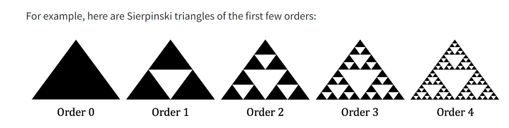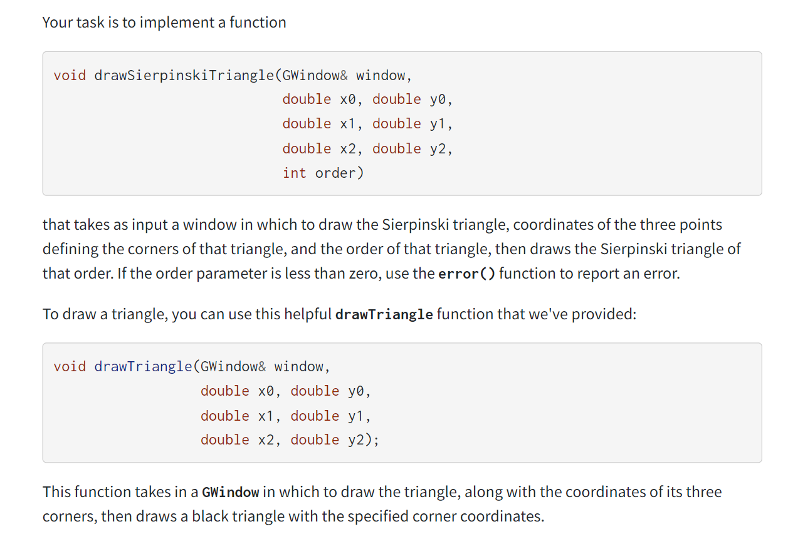
> **思路很简单:**
> 1. 对于`Order`阶的`Sierpinski Triangle`来说，我们只需要在每条边的中点位置绘制`Order - 1`阶的`Sierpinski Triangle`即可。


## Solution Code
```c++
#include "Sierpinski.h"
#include "error.h"
using namespace std;

/**
 * Draws a triangle with the specified corners in the specified window. Feel free
 * to edit this function as you see fit to change things like color, fill style,
 * etc. in whatever way you'd like!
 *
 * @param window The window in which to draw the triangle.
 * @param x0 y0 The first corner of the triangle.
 * @param x1 y1 The second corner of the triangle.
 * @param x2 y2 The third corner of the triangle.
 */
void drawTriangle(GWindow& window,
                  double x0, double y0,
                  double x1, double y1,
                  double x2, double y2) {
    window.setColor("black");
    window.fillPolygon({ x0, y0, x1, y1, x2, y2 });
}

/* TODO: Refer to Sierpinski.h for more information about what this function should do.
 * Then, delete this comment.
 */
void drawSierpinskiTriangle(GWindow& window,
                            double x0, double y0,
                            double x1, double y1,
                            double x2, double y2,
                            int order) {
    /* TODO: Delete this comment, these next lines of code, and implement this function. */
    if (order < 0){
        error("Parameter order invalid! Cannot be smaller than 0!");
        return;
    }

    if (order == 0) {
        drawTriangle(window,x0,y0,x1,y1,x2,y2);
    }

    drawSierpinskiTriangle(window, x0, y0,  (x0 + x1) / 2, (y0 + y1) / 2,  (x0 + x2) / 2, (y0 + y2) / 2, order - 1);
    drawSierpinskiTriangle(window, (x0 + x1) / 2, (y0 + y1) / 2, x1, y1,  (x1 + x2) / 2, (y1 + y2) / 2, order - 1);
    drawSierpinskiTriangle(window, (x0 + x2) / 2, (y0 + y2) / 2,  (x1 + x2) / 2, (y1 + y2) / 2,  x2, y2, order - 1);
}

```

# Part 2: Memoization
> [!task] Human Pyramid
> 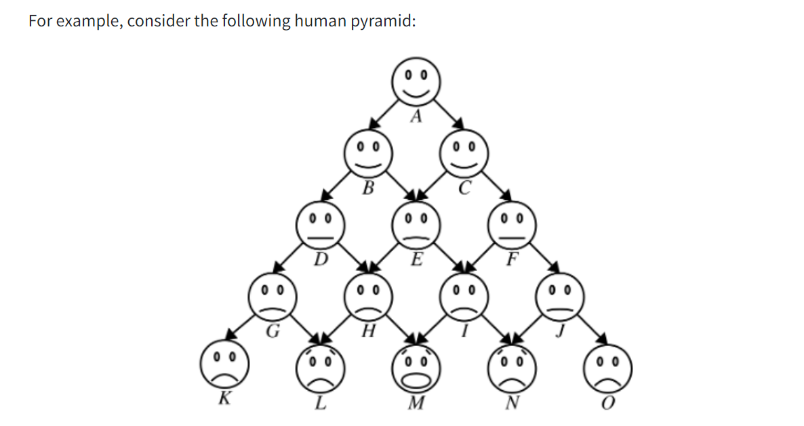
> 本题假设每个人重量为$160pounds$（图中的`Level-i`的人会分担`Level i-1`的人本体重量的一半，以及这个人肩上的重量的一半）, 需要编写一个函数，给定一个人的字母编号，返回他肩上负担的重量。
> 举个例子: 图中的`D`, 首先需要承担`B`的本体的重量的一半$80pounds$, 随后是`B`肩上的重量的一半$80/2 =40pounds$，于是`D`肩上的重量是$120kg$。
> 我们的算法会分下面几步完成:


## Milestone 1: Weight on Back
> [!task] Milestone 1
> 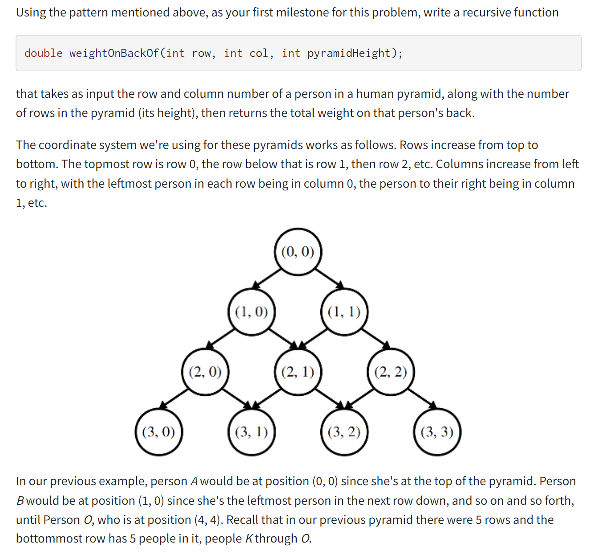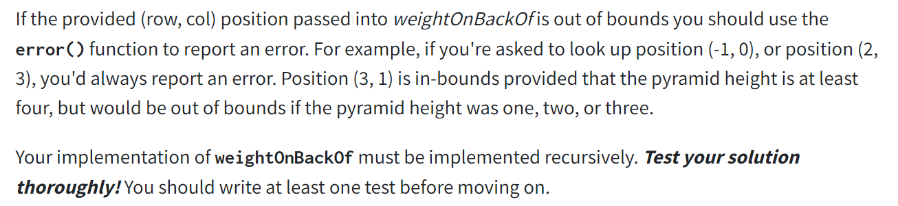
> 注意这个函数返回的是某个人肩膀上的重量，不包括这个人本身的重量。
> 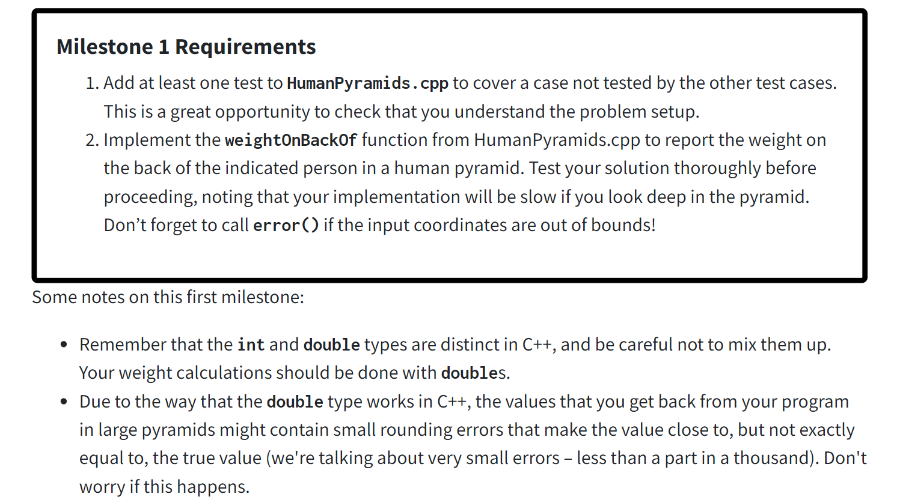
> 思路：
> 1. 递归终止条件: row == 0 && col == 0;


```c++
#include "HumanPyramids.h"
#include "error.h"
using namespace std;


bool checkInBound(int row, int col, int pyramidHeight);


double weightOnBackRec(int row, int col, int pyramidHeight);

/* TODO: Refer to HumanPyramids.h for more information about what this function should do.
 * Then, delete this comment.
 */
double weightOnBackOf(int row, int col, int pyramidHeight) {
    /* TODO: Delete the next few lines and implement this function. */
    if (row < 0 || col < 0 || row >= pyramidHeight || col >= pyramidHeight || row < col) {
        error("Coordinates not in bound!");
    }

    return weightOnBackRec(row, col, pyramidHeight);
}


double weightOnBackRec(int row, int col, int pyramidHeight){
    if (row == 0 && col == 0) {
        return 0; // Weight on the back of A
    }

    // First Recurse to get the shoulder weight, then add the person's weight, be sure to call the inner function weightOnBackRec() instead of wrapper function weightOnBack()
    double leftWeight = checkInBound(row - 1, col - 1, pyramidHeight) ? weightOnBackRec(row - 1, col - 1, pyramidHeight) / 2.0 + 80.0: 0.0 ;
    double rightWeight = checkInBound(row - 1, col, pyramidHeight) ? weightOnBackRec(row - 1, col, pyramidHeight) / 2.0 + 80.0: 0.0 ;

    return leftWeight + rightWeight;
}

bool checkInBound(int row, int col, int pyramidHeight) {
    if (row < 0 || col < 0 || row > pyramidHeight || col > pyramidHeight || row < col) {
        return false;
    }
    return true;
}

```


## Milestone 2: Memoization
### Memoization
> [!concept]
> 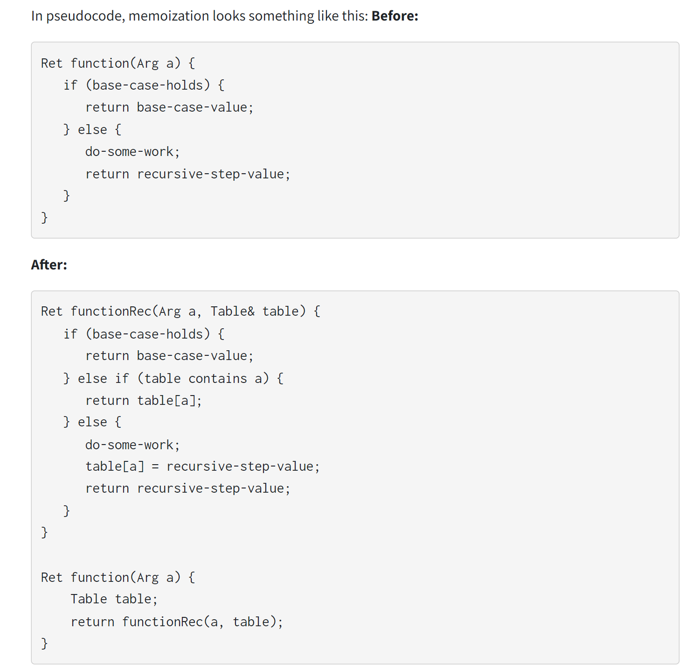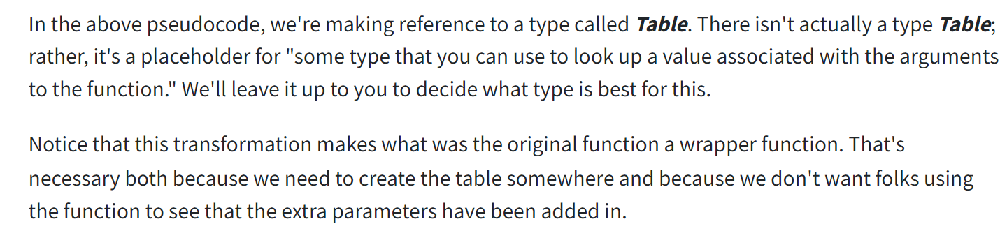


> [!task]
> 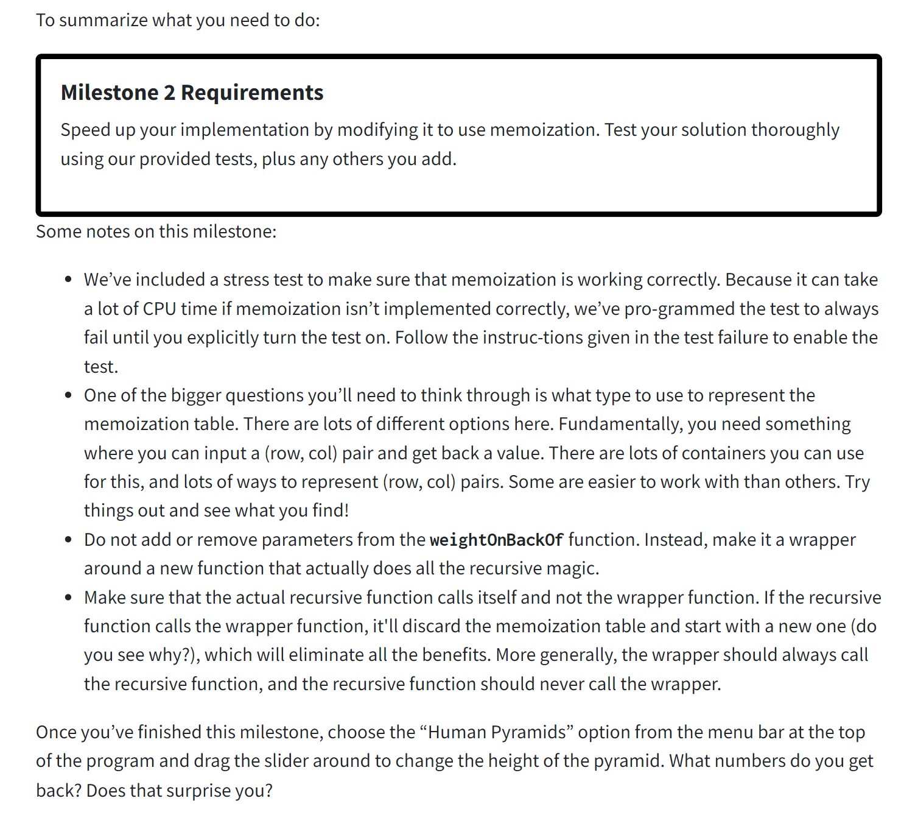

### CS106B Implementations
```c++
#include "HumanPyramids.h"
#include "error.h"
#include "map.h"
using namespace std;

/**
 * Helper function to check if (row, col) is within the pyramid
 * @brief checkInBound
 * @param row: The row number of pyramid, indexed by 0 from the top.
 * @param col: The column number of pyramid, indexed by 0 from the left.
 * @param pyramidHeight: The height of pyramid, starting from 0 at the top, incrementing by 1 as we do down the pyramid vertically.
 * @return
 */
bool checkInBound(int row, int col, int pyramidHeight);

/**
 * @brief weightOnBackRec
 * @param row
 * @param col
 * @param pyramidHeight
 * @param memo, note that we use the reference here to increase memory efficiency so that
 * we don't have to pass on data(default behavior of c++)
 * @param k: A Magic Number that is subject to change.
 * @return
 */
double weightOnBackRec(int row, int col, int pyramidHeight, Map<int,int>& memo, int k);

/**
 * Function to initialize the memoization table and perform the recusive task.
 * @brief weightOnBackOf
 * @param row
 * @param col
 * @param pyramidHeight
 * @return
 */
double weightOnBackOf(int row, int col, int pyramidHeight) {
    if (row < 0 || col < 0 || row >= pyramidHeight || col >= pyramidHeight || row < col) {
        error("Coordinates not in bound!");
    }

    // Here we could use int(which is immutable) as the key, which should be
    // computed as row * k + col, which is a one-to-one map from (row, col) to
    // the key.
    Map<int, int> table;
    int k = 20;

    return weightOnBackRec(row, col, pyramidHeight, table, k);
}


double weightOnBackRec(int row, int col, int pyramidHeight, Map<int,int>& memo, int k){
    if (row == 0 && col == 0) {
        return 0; // Weight on the back of A
    }

    int key = row * k + col;
    // Memoization Check, if exist, directly return
    if (memo.containsKey(key)) {
        return memo[key];
    }

    // If not, recurse to fill the memoization table.
    // First Recurse to get the shoulder weight, then add the person's weight
    double leftWeight = checkInBound(row - 1, col - 1, pyramidHeight) ? weightOnBackRec(row - 1, col - 1, pyramidHeight, memo, k) / 2.0 + 80.0: 0.0 ;
    double rightWeight = checkInBound(row - 1, col, pyramidHeight) ? weightOnBackRec(row - 1, col, pyramidHeight, memo, k) / 2.0 + 80.0: 0.0 ;

    double weightOnShoulder = leftWeight + rightWeight;

    // Set up the memoization table
    memo[key] = weightOnShoulder;
    return weightOnShoulder;
}

bool checkInBound(int row, int col, int pyramidHeight) {
    if (row < 0 || col < 0 || row > pyramidHeight || col > pyramidHeight || row < col) {
        return false;
    }
    return true;
}

```

> [!test]
> 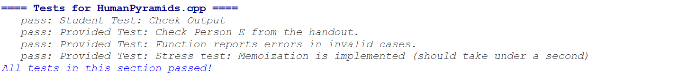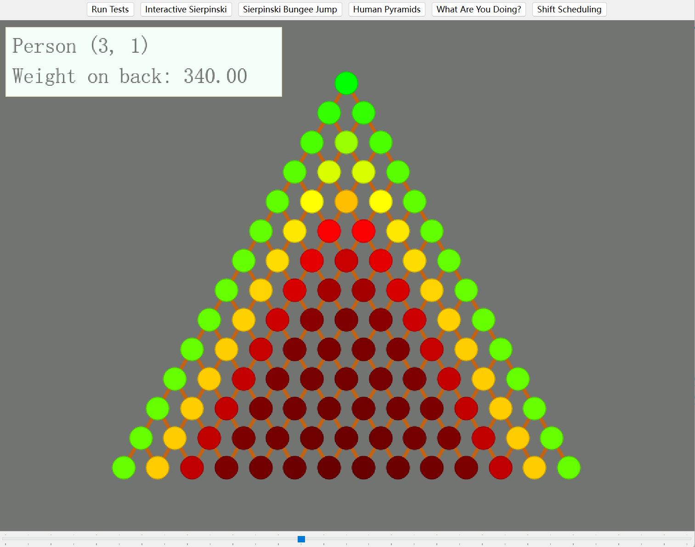


### Std Implementations
```c++

```


# Part 3: Permutation
> [!concept] String Emphasis
> 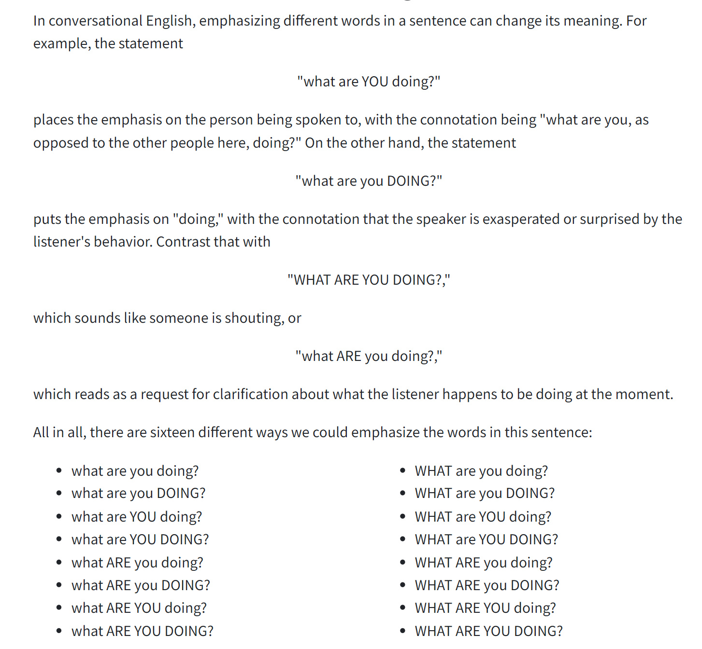
> **Idea:** Reduce the problem to a permutation problem, where we should list all possible form of output of sentence emphasis.


## Task Descriptions
> [!task]
> 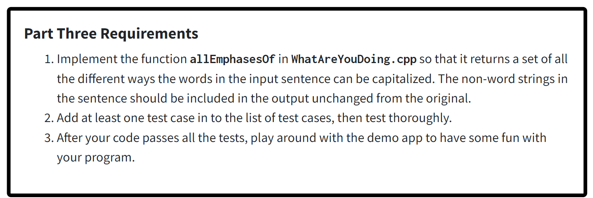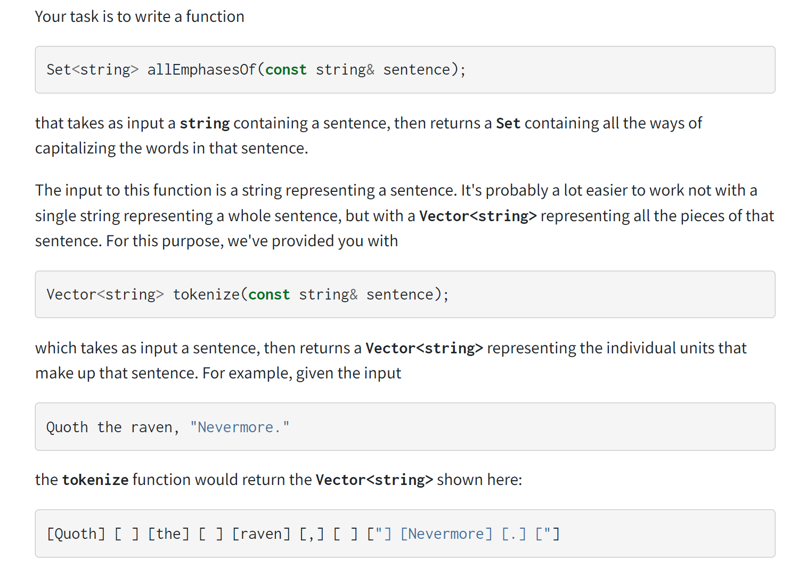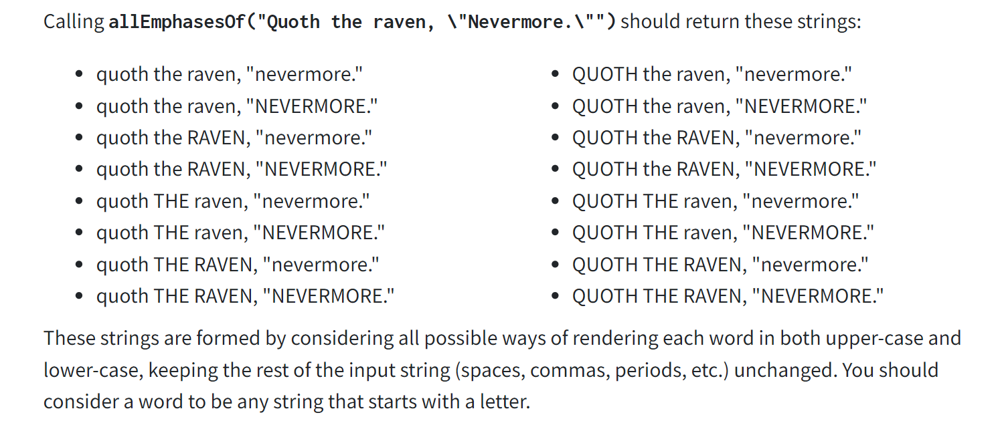
> **Remarks:**
> - We recommend that your implementation call `tokenize` exactly once to convert the input string into a sequence of tokens; there's no need to call `tokenize` repeatedly.
> - **You should completely ignore the initial capitalization of the words in the input sentence**. For example, the result of calling `allEmphasesOf` on the strings `"Happy birthday!"`, `"HAPPY BIRTHDAY!"`, and `"hApPy BiRtHdAy!"` should all be the same.
> - To check if a string represents a word, check if its first character is a letter. Use the `isalpha` function from the header file `<cctype>` to do this. **You don't need to handle the case where a string has letters in it but not in the first position.**
> - Use the `toUpperCase` and `toLowerCase` functions from `"strlib.h"` to convert a string to upper-case or lower-case. Be careful – these functions don't modify their arguments, and instead return new strings with the case of the letters changed.
> - **There may not be any words in the input sentence.** For example, the input sentence might just be a smiley face emoticon (`":-)"`) or a series of numbers (`"867-5309"`).
> - You don't need to – and in fact, shouldn't – use the `stringSplit` function or `TokenScanner` type to break the original string apart into words. Instead, rely on our handy `tokenize` function, which we've written for you specifically for this assignment.
> - **Make sure that your solution doesn’t generate the same string more than once.** In particular, make sure that your solution doesn’t call `toUpperCase` or `toLowerCase` on non-word tokens. If your recursion branches, making one call where the punctuation symbol is converted to upper case and another call where the punctuation symbol is converted to lower case, then it will do a lot of unnecessary work regenerating the same strings twice. (Do you see why?)
> - As you saw in Assignment 2, the default C++ `string` type is is pretty bad when it comes to handling non-English characters. As a result, if you feed perfectly reasonable statements like "नमस्ते" or "ٱلسَّلَامُ عَلَيْكُمْ" or "你好" into the `tokenize` function, the results may be completely wrong.
> 


## CS106B Implementations
```c++
#include "WhatAreYouDoing.h"

// Added by Alex
#include <cctype>
#include "strlib.h"

using namespace std;

/**
 * @brief allEmphasesOf
 * @param sentence
 * @return
 */
Set<string> allEmphasesOf(const string& sentence);

/**
 * Return all possible sequence of sentence emphasis
 * @brief allEmphasesOfRec
 * @param res: The collection that stores all the possible results.
 * @param soFar: The solution path, a Vector<string>
 * @param wordsList: Tokenized string, to be indexed.
 * @param k: Depth of the recursion.
 */
void allEmphasesOfRec(Set<string>& res, Vector<string>& soFar, Vector<string>& wordsList, int k);


void allEmphasesOfRec(Set<string>& res, Vector<string>& soFar, Vector<string>& wordsList, int k) {
    // Reach the end of the recursion, add the resulted string to res.
    if (k == wordsList.size()) {
        // Add the resulting strings to the collections
        res.add(stringJoin(soFar, ""));
        return;
    }

    string first = wordsList.get(k);
    // Non Alphabetic Character, add to the soFar Path, here we assume that
    // if a word begin with non-alpha, then it is non-alpha.
    if (!isalpha(first[0])) {
        soFar.add(first);
        allEmphasesOfRec(res, soFar, wordsList, k + 1);
        // Backtrack
        soFar.remove(soFar.size() - 1);
    } else {
        // Alphabetic Character, recurse
        string upper = toUpperCase(first);


        // Left Recurse
        soFar.add(upper);
        allEmphasesOfRec(res, soFar, wordsList, k + 1);
        // Backtrack
        soFar.remove(soFar.size() - 1);

        string lower = toLowerCase(first);

        // Right Recurse
        soFar.add(lower);
        allEmphasesOfRec(res, soFar, wordsList, k + 1);
        // BackTrack
        soFar.remove(soFar.size() - 1);
    }

    // The reason why we need backtrack under each case (non-alphabetic/upper/lower)
    // is that we are using a shared data structure across all the level of recursion
    // and in order to build a new path of the recursion tree we have to remove
    // the explored node and get back to previous state for all tree level.
    // For example, suppose we have already built a path {"YOU", "", "ARE", "?"} and you want
    // to return to the previous path, you will have to do backtracking to the path {"YOU", ""}
    // so that we could make our choice of another path {"YOU", "", "are"} and recurse to get
    // {"YOU", "", "are", "?"}.
    return;
}

Set<string> allEmphasesOf(const string& sentence) {
    // 1. Get all the tokenized words from the sentence, may contain non-alphabetics
    Vector<string> wordsList = tokenize(sentence);
    // 2. Initialize the resulting set
    Set<string> res;

    // 3. Construct the remaining tokens list
    Vector<string> soFar= {};
    allEmphasesOfRec(res, soFar, wordsList, 0);
    return res;
}
```

> [!test]
> 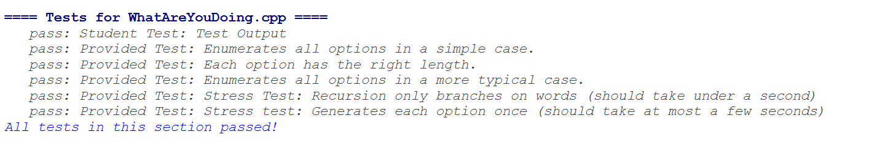


# Part 4: Combination/Greedy Algorithm
## Background: Shift Scheduling
> [!motiv] Motivation
> 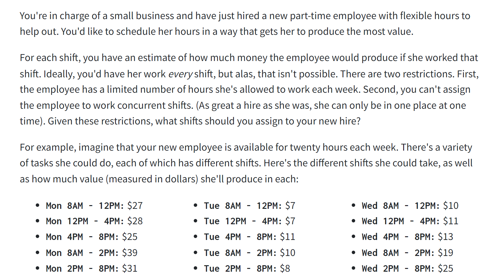
> **Goal:** Pick non-overlapped shifts(in terms of time slot) that sums up to maximum value within certain amount of hours.
> **Idea:** Reduce the problem to a combination problem where we have to consider whether to choose a shift or not.


## Milestone 1: Find Highest-Value Schedules
### Task Descriptions
> [!task]
> 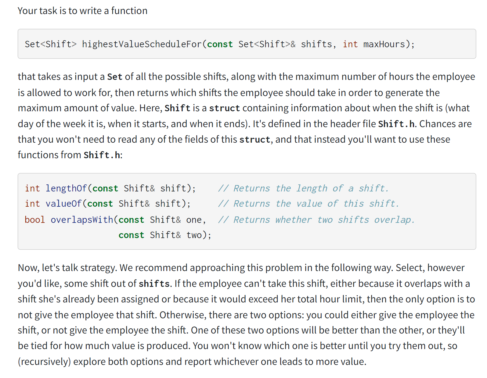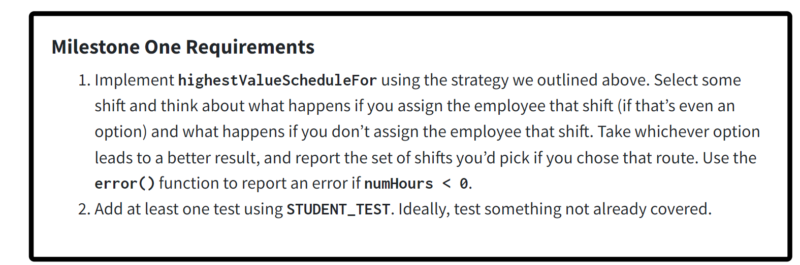
> **Remarks:**
> - You may find it easiest to work on this in stages. First, solve this problem ignoring the restriction that you can’t pick two overlapping shifts. Then, once you have that version working, edit your solution to enforce that you can’t pick overlapping shifts.
> - **If multiple schedules are tied for producing the most value, you’re free to choose any of them.**
> - While you are allowed to look directly at the fields of the `Shift` struct, we don’t recommend this. Use the helper functions mentioned on the previous page instead.
> - The best schedule might not use up all of the employee's available hours.
> - The values assigned to shifts can be arbitrary. It might be the case that a shift from 2PM to 4PM produces ten units of value while another from 10AM to 6PM the same day produces four.
> - It’s fine if the worker has zero available hours – that just means that she’s really busy that week – but if `maxHours` is negative you should call `error()` to report an error.
> - There are two general strategies you can use to explore sets of shifts. 
> 	- One option is to generate all possible combinations of shifts, checking only at the end to see whether the shifts overlap with one another or exceed the hourly limits. **You should avoid this option – the number of choices of shifts is so huge that this will not finish running in any rea-sonable timeframe.** 
> 	- The other is to only build up collections of shifts that, at the time they’re built, are known not to exceed the time limit or to contain overlapping shifts. You should favor this approach, since it significantly reduces the number of shift sets to check.


### CS106B Implementations
```c++
#include "ShiftScheduling.h"
using namespace std;

// Function Behaviors
/**
 * Compute the total number of hours that a given set of shifts would consume
 * @brief computeTotalHours
 * @param shifts
 * @return
 */
int computeTotalHours(const Set<Shift> shifts);

/**
 * Compute the total number of output values that a given set of shifts would consume
 * @brief computeTotalValues
 * @param shifts
 * @return
 */
int computeTotalValues(const Set<Shift> shifts);

/**
 * Determinte whether choosing a new shift would result in exceeding the maxHour Limit
 * @brief exceedMaxHours
 * @param choosed
 * @param shift
 * @param maxHours
 * @return
 */
bool exceedMaxHours(const Set<Shift> choosed, Shift& shift, int maxHours);

/**
 * Determine whether a choice of new shift is overlapped with any existing shifts that have been choosed
 * @brief overlapWithChoosed
 * @param choosed
 * @param other
 * @return
 */
bool overlapWithChoosed(const Set<Shift> choosed, const Shift& other);

/**
 * Determine whether the shift to be choosed is indeed a valid choice
 * @brief validForChoice
 * @param shift
 * @param choosed
 * @param maxHours
 * @return
 */
bool validForChoice(Shift& shift, const Set<Shift> choosed, int maxHours);

/**
 * Helper function, determining the highest value a collection of non-overlapping shifts could reach, within maxHours
 * @brief highestValueScheduleForRec
 * @param res: the data structure that stores the final result.
 * @param choosed: the shifts that have been chosen.
 * @param remaining: the shifts that remain to be choosed later on.
 * @param maxHours: the restriction condition/terminating condition.
 */
void highestValueScheduleForRec(Set<Shift>& res, const Set<Shift>& choosed, const Set<Shift>& remaining, int maxHours);

/**
 * Determine the highest value a collection of non-overlapping shifts could reach, within maxHours
 * @brief highestValueScheduleFor
 * @param shifts
 * @param maxHours
 * @return
 */
Set<Shift> highestValueScheduleFor(const Set<Shift>& shifts, int maxHours);


// Implementations
int computeTotalHours(const Set<Shift> shifts) {
    int res = 0;
    for (Shift shift: shifts) {
        res += lengthOf(shift);
    }
    return res;
}

int computeTotalValues(const Set<Shift> shifts) {
    int res = 0;
    for (Shift shift: shifts) {
        res += valueOf(shift);
    }
    return res;
}

bool exceedMaxHours(const Set<Shift> choosed, Shift& shift, int maxHours) {

    if (computeTotalHours(choosed + shift) > maxHours) {
        return true;
    }
    return false;
}

bool overlapWithChoosed(const Set<Shift> choosed, const Shift& other) {
    for (Shift shift: choosed) {
        if (overlapsWith(shift, other)) {
            return true;
        }
    }
    return false;
}

bool validForChoice(Shift& shift, const Set<Shift> choosed, int maxHours) {
    return !exceedMaxHours(choosed, shift, maxHours) && !overlapWithChoosed(choosed, shift);
}


void highestValueScheduleForRec(Set<Shift>& res, const Set<Shift>& choosed, const Set<Shift>& remaining, int maxHours) {
    if (remaining.isEmpty()) {
        if (res.size() == 0 || computeTotalValues(choosed) >= computeTotalValues(res)) {
            res = choosed;
        }
        return;
    }

    Shift first = remaining.first();
    // If we want to choose it, we have to first validate the choice
    if (validForChoice(first, choosed, maxHours)) {
        // It is a valid choice
        highestValueScheduleForRec(res, choosed + first, remaining - first, maxHours);
    }
    // If we don't want to choose it, we don't have to validate it anyway
    highestValueScheduleForRec(res, choosed, remaining - first, maxHours);

}


Set<Shift> highestValueScheduleFor(const Set<Shift>& shifts, int maxHours) {
    Set<Shift> res = {};
    Set<Shift> choosed = {};

    if (maxHours < 0) {
        error("Illegal Arguments, should be a nonnegative number!");
    }

    highestValueScheduleForRec(res, choosed, shifts, maxHours);
    return res;
}
```
> [!test]
> 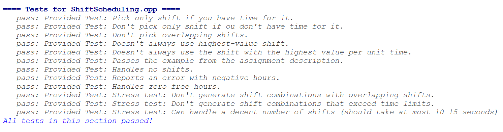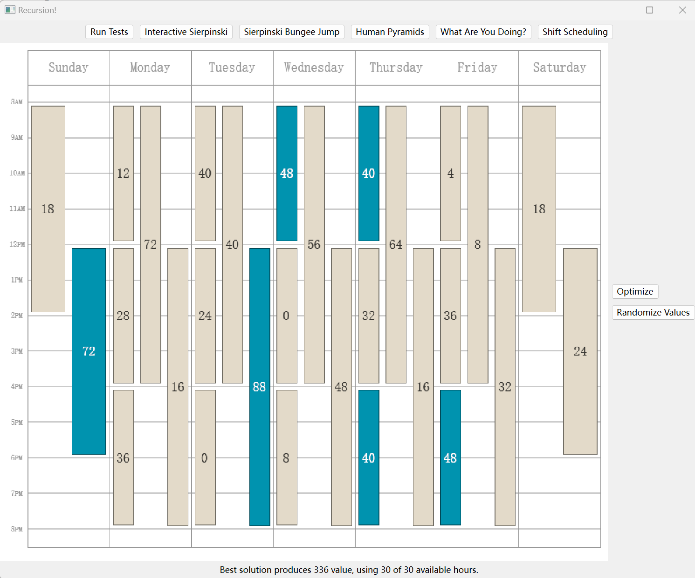


## Milestone 2: Explore and Evaluate
> [!task]
> 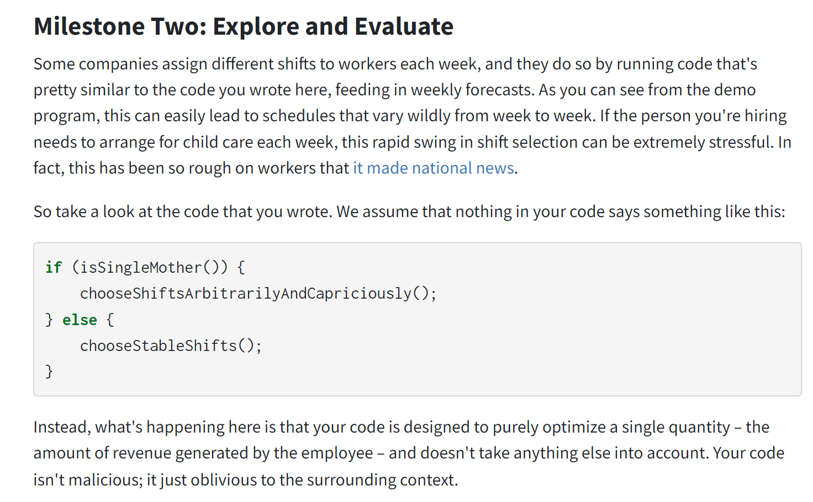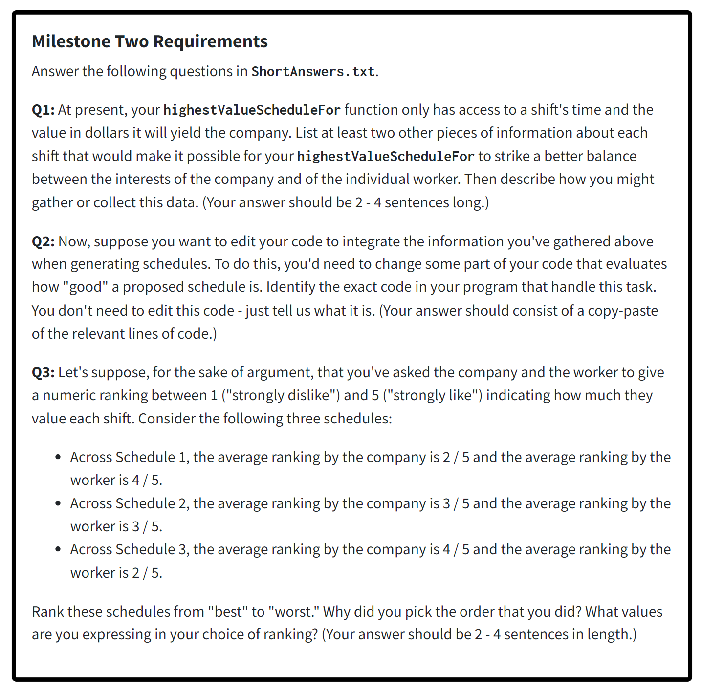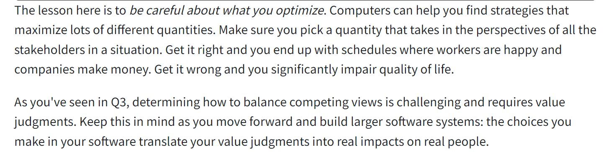


