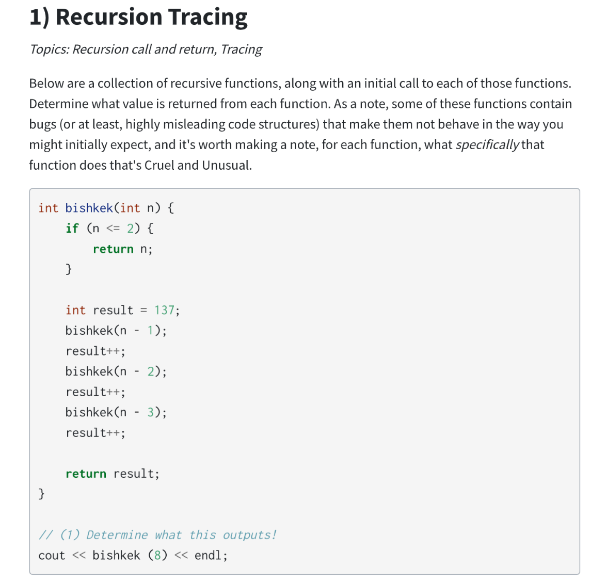
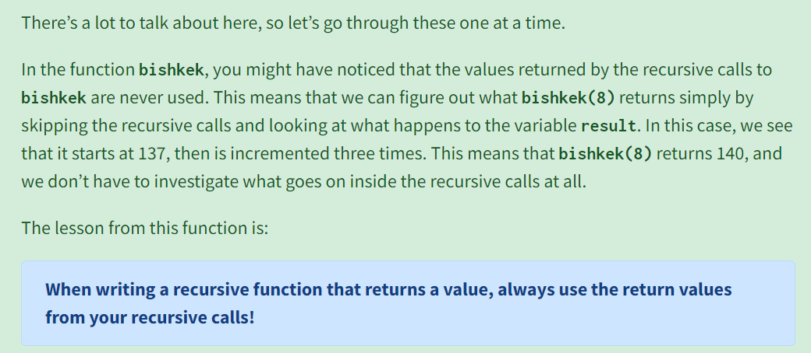
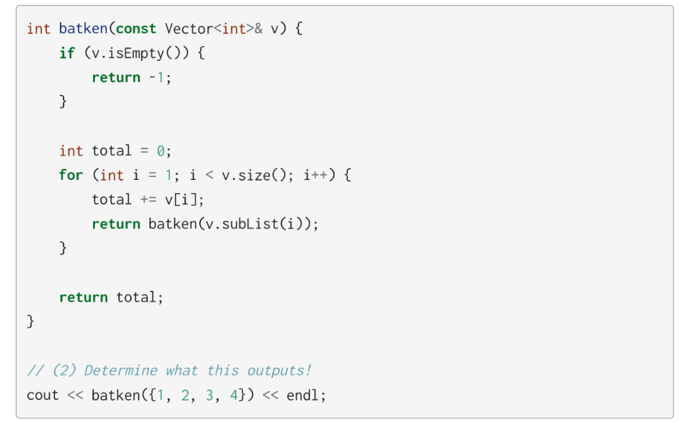
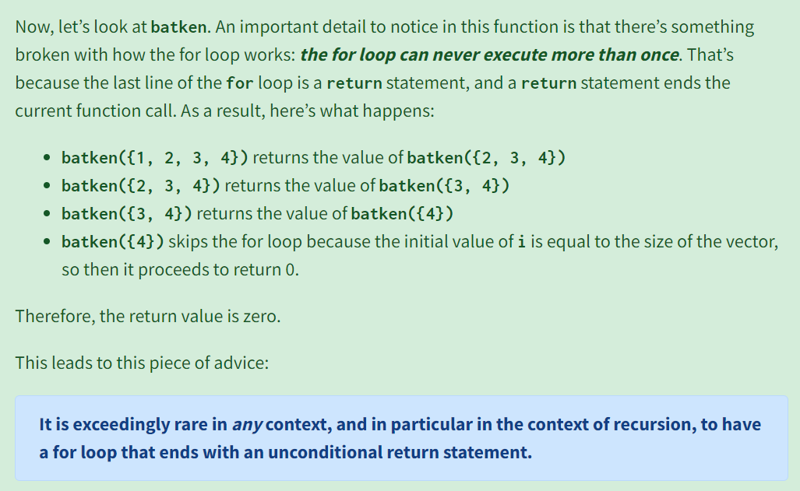
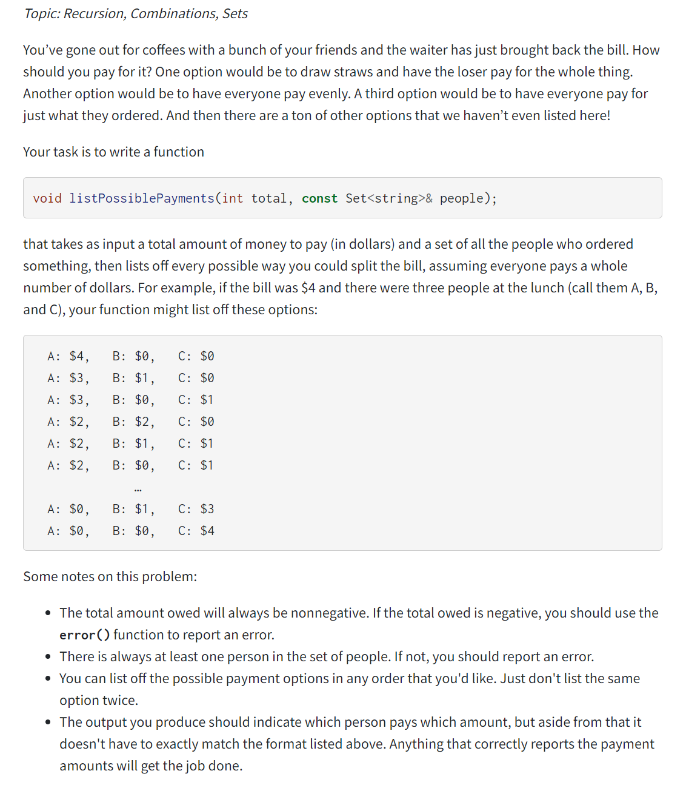
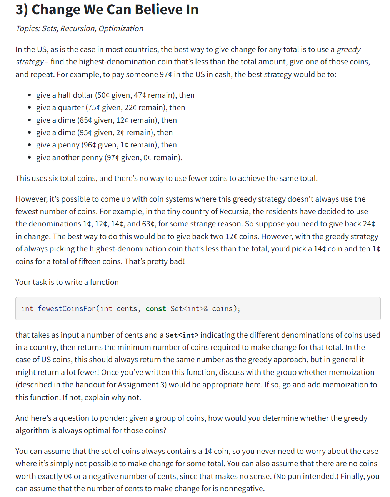
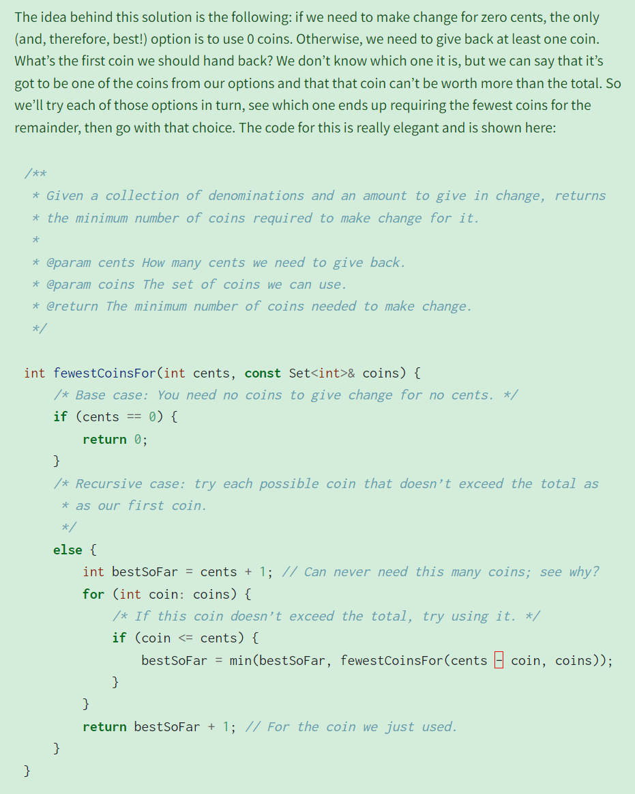
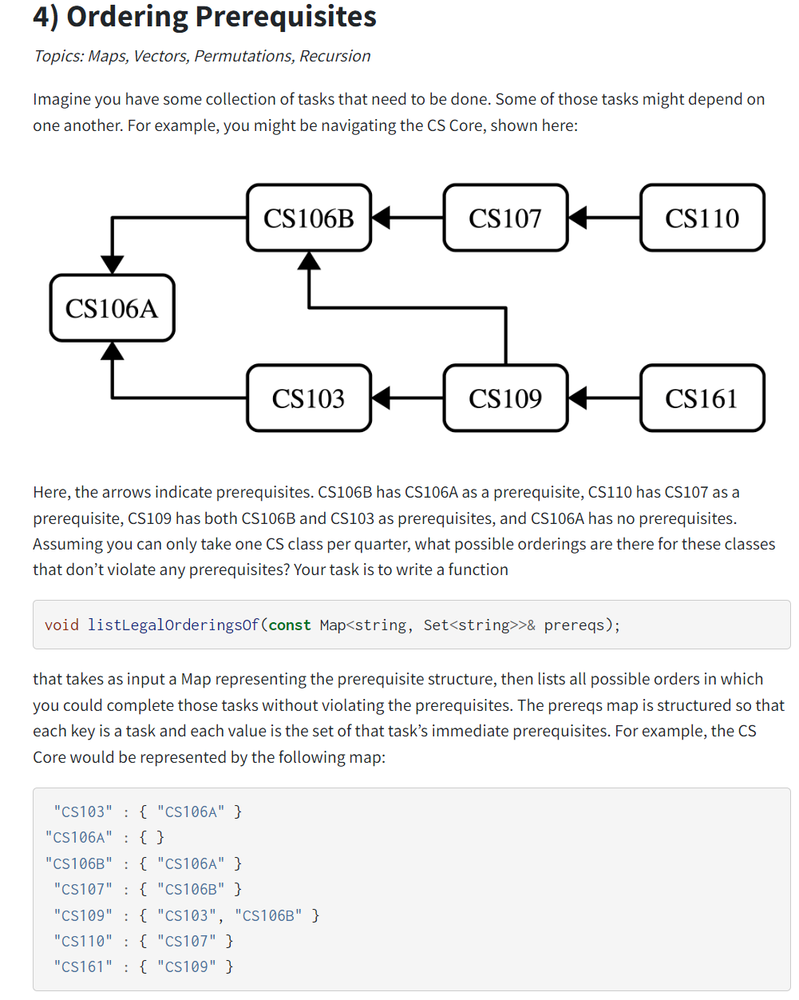
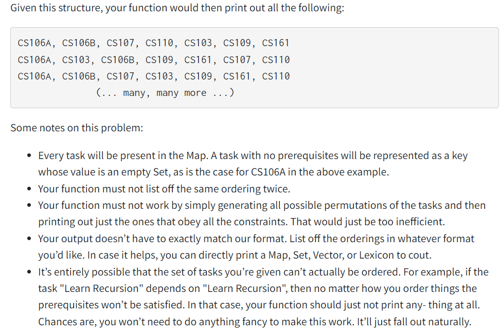
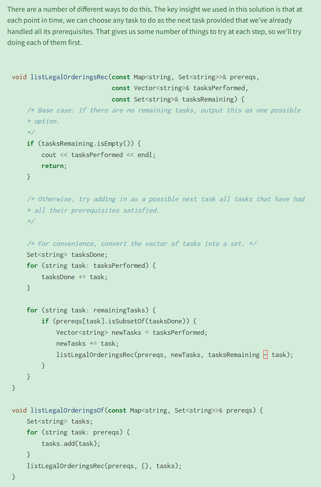

[section3_starter.zip](https://www.yuque.com/attachments/yuque/0/2023/zip/12393765/1675582265411-fdba1753-adce-4852-8d16-8e289461873f.zip)
[CS106B_W22 Recursion Etudes.pdf](https://www.yuque.com/attachments/yuque/0/2023/pdf/12393765/1675582250516-b775ae80-838f-479b-9458-94ea25c23abe.pdf)


# Q1 Program Caveats
## Program 1: Don't Care About Return
> 
> **可以理解为:**
> `bishkek(n-1)`执行完后`result++`, `bishkek(n-2)`执行完, `result++`, 然后`bishkek(n-3)`执行完，`result++`, 因为`bishkek`函数递归调用的结果我们根本不关心，且递归调用并不会修改最外层递归的`result`值，所以最终`result`是`140`。

**Solution**


## Program 2: For-Loop with Return
> 
> 对于函数的递归调用我们还有一种理解方式，就是从`return`语句入手。
> 上面的函数中，`for-loop`内部出现了`return`语句，这说明`for-loop`这个循环体实际上只能循环一次，当前的函数调用就终止了。
> 对于函数调用`batken(v)`来说，他返回的是`batken(v.subList(i))`的结果。
> 即`batken({1,2,3,4})`返回的是`batken({2,3,4})`的结果，依次类推，最后返回的是`batken({4})`的结果，而`batken({4})`在执行的时候，`v.size()==1`, 所以`for-loop`不执行，返回结果`total = 0`, 所以最外层的程序返回结果`0`。

**Solution**

# Q2 Splitting the Bills
> 
> **本题要求是:**
> 给定金额数`total`和所有需要参与`Bill Splitting`的人`people`, 我们需要列出所有的可能的`Splitting`的情况，用一个`Map<string, int>`的格式展现出来。
> **思路就是使用**`**Top-down Approach**`**:**
> 对于每一个人来说，他所需要支付的金额一定是区间`[0, total]`中的某一个整数数额，用`i`表示。则如果一个`person`付了`i`，则剩下的`people`需要平摊`total-i`的数额。
> **所以我们可以写出递归表达式: **
> - 用`for-loop`列出所有`person`可能支付的数额，`for i in range(0, total+1)`:
> - 对于每一个数额，将`total-i`的数额交给剩下的`people - person`去平摊。
> - 如果`people`只剩下一个人的时，他需要支付完所有剩下的数额。（终止条件）
> 
**这里判断一下递归终止条件：**
> 1. 如果我们选择在`total == 0`时终止，则会出现一个问题，就是`people`可能会先于`total`被消耗完以至于程序无法终止而报`set::first size is zero`的错误。
> 2. 所以我们需要在集合`Set<string> people`只剩最后一个人的时候就停止我们的递归程序。

```cpp
/*
 * Function: listPossiblePayments
 * -------------------------------
 * Write a function that takes as input a total amount of money
 * to pay (in dollars) and a set of all the people who ordered
 * something, then lists off every possible way you could split
 * the bill, assuming everyone pays a whole number of dollars.
 */


void listPossiblePaymentsHelper(int total, const Set<string>& people, const Map<string, int>& soFar) {
    if (people.size() == 1) {
        Map<string, int> updatedPayments = soFar;
        updatedPayments[people.first()] = total;
        cout << updatedPayments << endl;
    } else {
        string firstPerson = people.first();
        for (int i = 0; i <= total; i++) {
            Map<string, int> updatedPayments = soFar;
            updatedPayments[firstPerson] = i;
            listPossiblePaymentsHelper(total - i, people - firstPerson, updatedPayments);
        }
    }
}


void listPossiblePayments(int total, const Set<string>& people) {

    if (total < 0) {
        error("The total amount owed.");
    }

    if (people.isEmpty()) {
        error("No people to split the bill.");
    }

    listPossiblePaymentsHelper(total, people, {});
    return;
}

```


# Q3 When Greedy Algorithm Fails
> 
> **我们的思路如下，从函数的参数出发:**
> 1. `cents`: 表示我们需要凑满的金额数。
> 2. `coins`: 表示可以选择的硬币面值，硬币数量无限。
> **从**`Base Case`**开始考虑:**
> 如果`cents == 0`, 则我们不需要选择任何硬币即可满足，所以最少硬币数量就是`0`, `return 0`即可。
> **对于递归函数来说:**
> - 我们遍历所有的硬币面值`for coin in coins`, `cents - coin`表示我们选择`coin`的面值:
> - 如果`cents - coin < 0`，因为硬币没办法掰断，所以这种情况下是无解的，我们无需考虑。
> - 所以我们只需要考虑所有`cents >= coin`的情况，找出凑满`cents - coin`需要最少硬币个数，返回即可。

```cpp
#include <iostream>
#include <string>
#include "testing/SimpleTest.h"
#include "testing/TextUtils.h"
#include "set.h"
#include <cmath>
using namespace std;

/*
 * Function: fewestCoinsFor
 * -------------------------
 * Write a function that takes as input a number of cents and a Set<int>
 * indicating the different denominations of coins used in a country,
 * then returns the minimum number of coins required to make change
 * for that total. In the case of US coins, this should always return
 * the same number as the greedy approach, but in general it might return
 * a lot fewer!
 */
int fewestCoinsFor(int cents, const Set<int>& coins) {

    // Base Case 1: This happens when we try to sum our coins up to zero.
    // Since all coins' face value are strictly positive, the answer should be that
    // we don't choose any of the coins, that is, zero.
    if (cents == 0) {
        return 0;
    }


    // Base Case 2: This means that there is no solution (Because we choose a coin that has
    // face value that's larger than the target amount and we cannot break up the
    // coin into pieces.)
    if (cents < 0) {
        return -1;
    }


    // This number should be sufficiently large. But in this case, we know that
    // the smallest coin is 1, so the maximum number of coins should be cents / 1 = cents.
    // So cents + 1 should be fine here.
    int fewestTry = cents + 1;
    for (int coin: coins) {
        int fewestCoinNum = fewestCoinsFor(cents - coin, coins);
        if (fewestCoinNum >= 0) {
            fewestTry = fmin(fewestCoinNum + 1, fewestTry);
        }
    }

    return fewestTry;
}
```
**Formal Solution&Explanations**
```cpp
int fewestCoinsForMemoized(int cents, const Set<int>& coins, Map<int, int> memoizedResults) {
    /* Base case: You need no coins to give change for no cents. */
    if (cents == 0) {
        return 0;
    }
    /* Base case: if we already know the answer, just return it! */
    else if (memoizedResults.containsKey(cents)) {
        return memoizedResults[cents];
    }
    /* Recursive case: try each possible coin that doesn’t exceed the total as
     * as our first coin.
     */
    else {
        int bestSoFar = cents + 1; // More than we ever need; see why?
        for (int coin: coins) {
            /* If this coin doesn’t exceed the total, try using it. */
            if (coin <= cents) {
                int needed = fewestCoinsForMemoized(cents - coin, coins,
                                                                      memoizedResults);
                bestSoFar = min(bestSoFar, needed);
            }
        }
        /* Store the result for later. */
        int result = bestSoFar + 1;
        memoizedResults[cents] = result;
        return result;
    }
}
```


# Q4 DAG - Topological Sort⭐⭐⭐⭐⭐
> 

**Formal Solution**
