# P1 Combinations(Easy)
## Task Descriptions
> [!task]
> 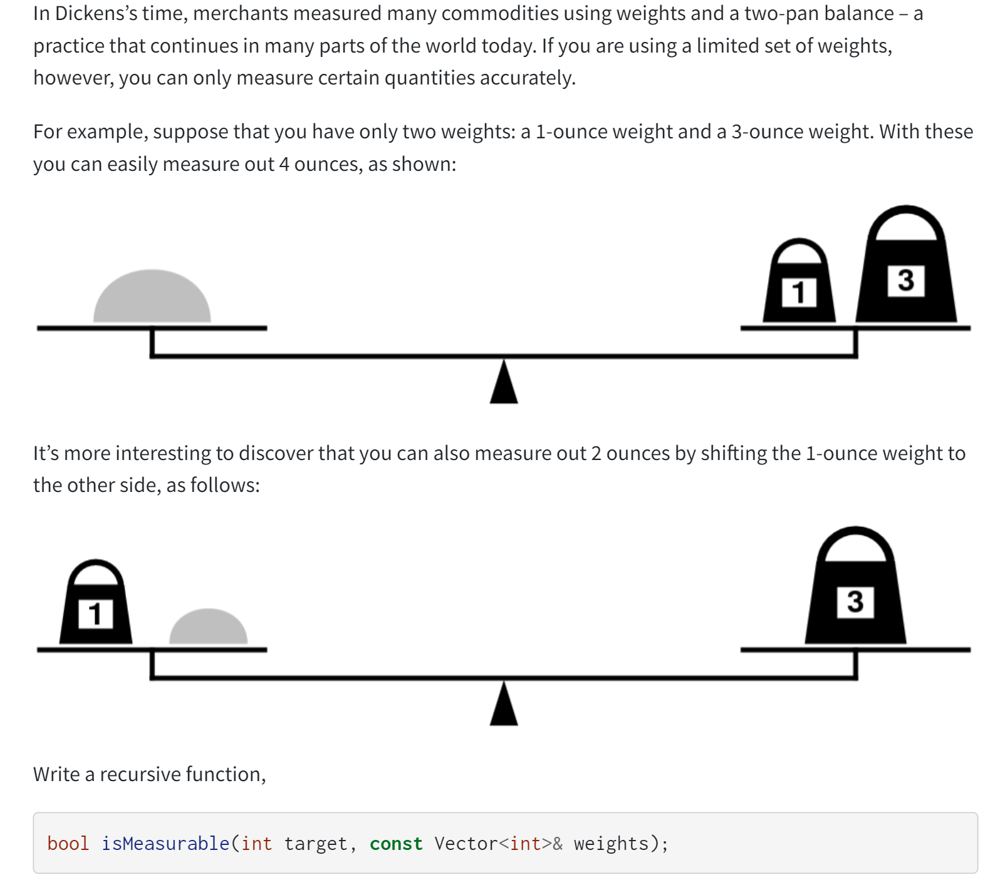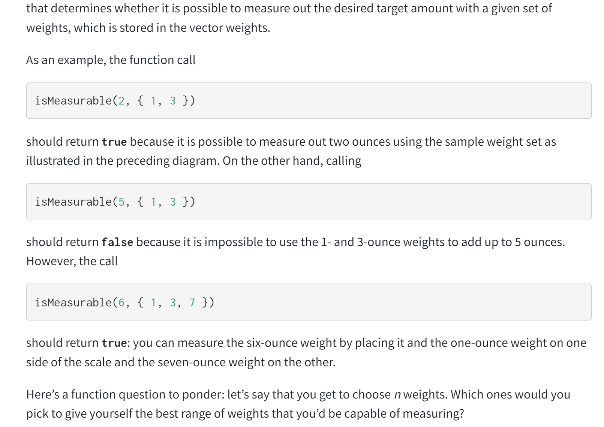


## CS106B Implementation
### Using Set
> [!code]
> Imagine that we start off by putting the amount to be measured (call it _n_) on the left side of the balance. This makes the imbalance on the scale equal to _n_. Imagine that there is some way to measure _n_. If we put the weights on the scale one at a time, we can look at where we put that first weight (let’s suppose it weighs _w_). It must either:
> - go on the left side, making the net imbalance on the scale _n + w_, or
> - go on the right side, making the net imbalance on the scale _n – w_, or
> - not get used at all, leaving the net imbalance _n_.
>  
> If it is indeed truly possible to measure _n_, then one of these three options has to be the way to do it, even if we don’t know which one it is. The question we then have to ask is whether it’s then possible to measure the new net imbalance using the weights that remain – which we can determine recursively! On the other hand, if it’s not possible to measure _n_, then no matter which option we choose, we’ll find that there’s no way to use the remaining weights to make everything balanced!
> 
> If we’re proceeding recursively, which we are here, we need to think about our base case. There are many options we can choose from. One simple one is the following: imagine that we don’t have any weights at all, that we’re asked to see whether some weight is measurable using no weights. In what circumstances can we do that? Well, if what we’re weighing has a nonzero weight, we can’t possibly measure it – placing it on the scale will tip it to some side, but that doesn’t tell us how much it weighs. On the other hand, if what we’re weighing is completely weightless, then putting it on the scale won’t cause it to tip, convincing us that, indeed, it is weightless! So as our base case, we’ll say that when we’re down to no remaining weights, we can measure _n_ precisely if _n = 0_. With that in mind, here’s our code:
```c++
#include <iostream>
#include "testing/SimpleTest.h"
#include "testing/TextUtils.h"
#include "vector.h"
#include <string>
#include <ostream>
#include "set.h"
using namespace std;

/**
 * @brief isMeasureableRec: Helper function.
 * @param target: The weight to be measured
 * @param remaining: The weights that remain to be chosen
 * @return true if target can be measured
 */
bool isMeasureableRec(int target, const Set<int>& remaining) {

    // If the scale weighs the same on left and right, then we have found a solution
    if (target == 0) {
        return true;
    }

    // If no more weights to choose or the target is negative, it means
    // The scenario is invalid, return false.
    if (remaining.size() == 0 || target < 0) {
        return false;
    }


    // 1. If we want to choose the first element
    int first = remaining.first();

    // 1.1 If it goes to the left scale
    bool left = isMeasureableRec(target - first, remaining - first);

    // 1.2 If it goes to the right scale
    bool right = isMeasureableRec(target + first, remaining - first);

    // 2. If we don't want to choose the first element, recurse on the remaining
    bool non = isMeasureableRec(target, remaining - first);

    // If any of the conditions returns true, then returns true to the calling procedure.
    return left || right || non;
}

/*
 * Function: isMeasurable
 * -----------------------
 * Write a recursive function that determines whether it is
 * possible to measure out the desired target amount with a
 * given set of weights, which is stored in the vector weights.
 */
bool isMeasurable(int target, const Vector<int>& weights) {
    /* todo: remove these lines and implement this function! */

    Set<int> remaining;
    Set<int> soFar = {};

    for (int weight: weights) {
        remaining.add(weight);
    }

    return isMeasureableRec(target, remaining);
}
```
> [!test]
> 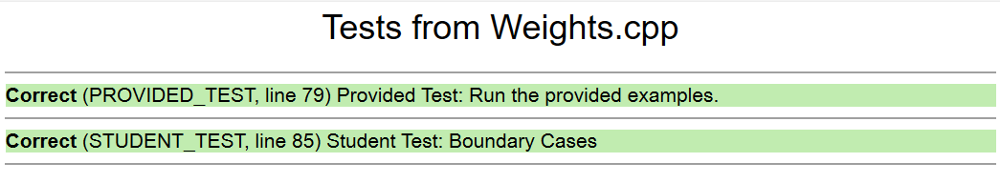
```c++
PROVIDED_TEST("Provided Test: Run the provided examples.") {
    EXPECT_EQUAL(isMeasurable(2, {1, 3}), true);
    EXPECT_EQUAL(isMeasurable(5, {1, 3}), false);
    EXPECT_EQUAL(isMeasurable(6, {1, 3, 7}), true);
}

STUDENT_TEST("Student Test: Boundary Cases") {
    EXPECT_EQUAL(isMeasurable(2, {}), false);
    EXPECT_EQUAL(isMeasurable(5, {1}), false);
}
```


### Using Vector and Index
> [!code]
> 
```c++
/**
 * Given an amount, a list of weights, and an index, determines whether it's
 * possible to measure n using the weights at or after the index given by
 * startPoint.
 *
 * @param amount The amount to measure, which can be positive, negative or 0.
 * @param weights The weights available to us.
 * @param index The starting index into the weights Vector.
 * @return Whether the amount can be measured using the weights from the specified
 *         index and forward.
 */
bool isMeasurableRec(int amount, const Vector<int>& weights, int index) {
    if (index == weights.size()) {
        return amount == 0;
    } else {
        return isMeasurableRec(amount,                  weights, index + 1) ||
               isMeasurableRec(amount + weights[index], weights, index + 1) ||
               isMeasurableRec(amount - weights[index], weights, index + 1);
    }
}

bool isMeasurable(int amount, const Vector<int>& weights) {
    return isMeasurableRec(n, weights, 0);
}
```


## Standard C++ Implementation


# P2 Permutations&Sets(Hard)
## Task 1 : Using Backtracking
> [!task] Task 1
> Some words in the English language can be spelled out using just element symbols from the Periodic Table. For example, “began” can be spelled out as BeGaN (beryllium, gallium, nitrogen), and “feline” can be spelled out as FeLiNe (iron, lithium, neon). Not all words have this property, though; the word “interesting” cannot be made out of element letters, nor can the word “chemistry” (though, interestingly, the word “physics” can be made as PHYSICS (phosphorous, hydrogen, yttrium, sulfur, iodine, carbon, sulfur).
> 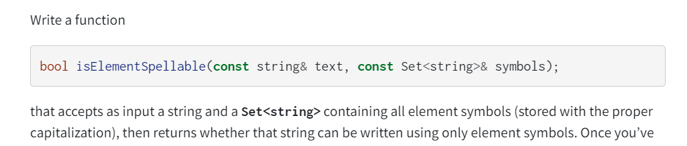
> To see why this is a permutation problem, we can think of the process as finding all the possible permutations of the symbols in our set, but with effective pruning where invalid permutations are skipped. (When if statement doesn't hold).
> 


### Naive Implementation
> [!code]
> The following solution could pass this particular test, since we assume all the element in the periodic table is length-2 character. But even this is not always the case, we already synthesize the `UNO` elements, with length-3-char chemical symbols. In order to adapt our implementations to more general symbols, we will use the method simliar to `Shrinkable Words` in lecture.
```c++
bool isElementSpellable(const string& text, const Set<string>& symbols) {
    /* todo: remove these lines and implement this function! */
    if (text.length() == 0) {
        return true;
    }


    if (text.length() == 1) {
        return symbols.contains(toUpperCase(text));
    }

    string lengthOne = toUpperCase(text.substr(0,1));
    string lengthTwo = toUpperCase(text.substr(0,1)) + toLowerCase(text.substr(1, 1));


    bool validOne = symbols.contains(lengthOne);
    bool validTwo = symbols.contains(lengthTwo);

    validOne = validOne && isElementSpellable(text.substr(1), symbols);
    validTwo = validTwo && isElementSpellable(text.substr(2), symbols);

    return validOne || validTwo;
}
```


### Generic Implementation
```c++
/**
 * Given a word and an element symbol, returns whether the word starts with that
 * particular element symbol.
 *
 * @param word The word in question
 * @param symbol The symbol in question.
 * @return Whether the word starts with that element symbol.
 */
bool startsWithElement(const string& word, const string& symbol) {
    return startsWith(toLowerCase(word), toLowerCase(symbol));
}

/**
 * Given a word and a set containing all the element symbols in the Periodic
 * Table, returns whether it’s possible to spell that word using just element
 * symbols.
 *
 * @param text The word
 * @param symbols The element symbols in the Periodic Table.
 * @return Whether that text can be spelled out.
 */
bool isElementSpellable(const string& word, const Set<string>& symbols) {
    /* Base case: the empty string can be spelled out by simply using no strings
     * from the list of symbols.
     */
    if (word == "") {
        return true;
    }
    /* Recursive case: try each element symbol to see whether any of them match
     * the first characters of the input string. We could alternatively rely on
     * the fact that all element symbols are between 1 and 3 characters long, but
     * just in case that changes we won't assume that here. :-)
     */
    else {
        for (string symbol: symbols) {
            if (startsWithElement(word, symbol) &&
                isElementSpellable(word.substr(symbol.length()), symbols)) {
                return true;
            }
        }
        /* If none of those options work, there is no way to spell this word using
         * element symbols.
         */
        return false;
    }
}
```


## Task 2: Add Outparameters
> [!task] Task 2
> 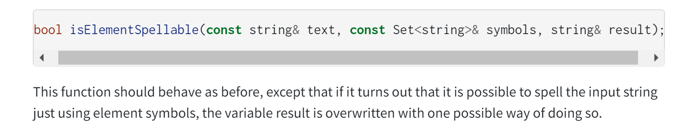

```c++
/**
 * Given a word and an element symbol, returns whether the word starts with that
 * particular element symbol.
 *
 * @param word The word in question
 * @param symbol The symbol in question.
 * @return Whether the word starts with that element symbol.
 */
bool startsWithElement(const string& word, const string& symbol) {
    return startsWith(toLowerCase(word), toLowerCase(symbol));
}


/*
 * Function: isElementSpellable
 * -----------------------------
 * Write a function that accepts as input a string and a Set<string>
 * containing all element symbols (stored with the proper
 * capitalization), then returns whether that string can be
 * written using only element symbols.
 */
bool isElementSpellable(const string& word, const Set<string>& symbols,
                        string& result) {
    /* Base case: the empty string can be spelled out by simply using no strings
     * from the list of symbols.
     */
    if (word == "") {
        result = "";  // This is the proper way to spell this word.
        return true;
    }
    /* Recursive case: try each element symbol to see whether any of them match
     * the first characters of the input string. We could alternatively rely on
     * the fact that all element symbols are between 1 and 3 characters long, but
     * just in case that changes we won't assume that here. :-)
     */
    else {
        for (string symbol: symbols) {
            if (startsWithElement(word, symbol)) {
                /* See if we can spell what's left. */
                if (isElementSpellable(word.substr(symbol.length()),
                                       symbols, result)) {
                    /* Because we could, we know that result is now filled in with
                     * how to spell the rest of the word (that's what the function
                     * says it will do!). We just need to prepend the element
                     * symbol we used.
                     */
                    result = symbol + result;
                    return true;
                }
            }
        }
        /* If none of those options work, there is no way to spell this word using
         * element symbols.
         */
        return false;
    }
}

```


## Task 3: Closest Approximation
> [!task] Task 3
> Here’s a final variation to consider, which is much more challenging than the previous one but would be a great way to practice your recursive problem-solving. (As in, do this problem only if you have a good amount of time; it’s challenging!) As mentioned above, not all strings can be written using element symbols. The title of this problem is supposed to be “Chemowizardry,” but that just isn’t quite spellable using element symbols, so we compromised on “Chemowizrdy,” cutting out two letters. Write a function:
> 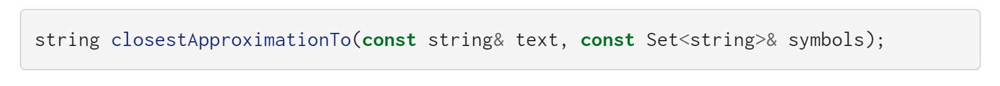
> that takes as input a string, then returns the longest subsequence of the input string that can be spelled out using element symbols, capitalized appropriately. For example, given the input “Chemowizardry,” the function should return “CheMoWIZrDy.”


> [!code]
> Now, to the challenge problem of getting the best optimization. This one is a lot harder because we might not end up using all the letters in the original string – in fact, we might delete large chunks of the string in order to make more things fit.
> 
> We could do this by going one character at a time, seeing what to do with that character, but that turns out to be fairly tricky. Instead, we’ll opt for another approach. We’ll ask the question: which element symbol should go at the start of the approximation? For each possible element symbol, we need to check that the characters within that symbol actually appear somewhere in the input string. But the tricky bit is that they don’t have to be consecutive. For example, in converting “chemowizardry” to “CHeMoWIZrDy,” we deleted the a between the z and the r to make zirconium (Zr) fit, and we deleted the r between the d and y to get dysprosium (Dy) to fit. So when we try using an element symbol, we need to find all the characters that make it up, in sequence, possibly with spaces in them. That’s tricky but doable.
> 
> And what happens if no element symbol fits? Then we just end up approximating things with the empty string.
> 
> Here’s what this might look like:
```c++

string closestApproximationTo(const string& word, const Set<string>& symbols) {
    /* Base case: If the string is empty, the best approximation is to use no
     * element symbols.
     */
    if (word == "") return "";

    /* Recursive case: Try all possible elements to see which one goes first. */
    string best = ""; // In case nothing matches, we return the empty string.

    for (string element: symbols) {
        /* See where this element fits. We need to find each character in sequence
         * but possibly with gaps between them.
         */
        element = toLowerCase(element);
        int index = toLowerCase(word).find(element[0]);
        for (int i = 1; i < element.length() && index != string::npos; i++) {
            // find(something, index+1), find something in the word, but starting from index + 1
            // Avoid repeated index
            index = toLowerCase(word).find(element[i], index + 1);
        }

        /* If we found every character in the word for the symbol, this is a possible match. */
        if (index != string::npos) {
            auto with = element + closestApproximationTo(word.substr(index + 1),
                                                         symbols);
            if (best.length() < with.length()) best = with;
        }
    }
    return best;
}
```


# P3 Permutations(Medium)
> [!important]
> This problem is a permutation since we just have to try all the possible permutation of the points on the path and see if any path can fulfill the travelTime limit.
## Task 1: Find whether there is a solution
> [!task] Task 1
> 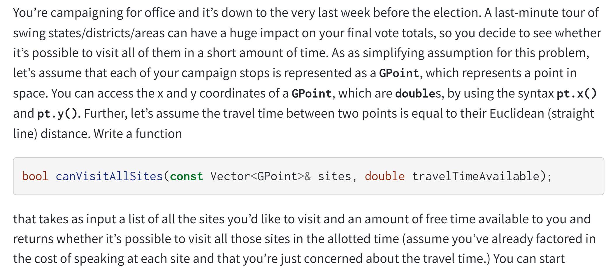
> This problem essentially boils down to generating all permutations of the sites and seeing whether any of them fit in the specified timeframe. The intuition we’ll use in writing up this solution is similar to the one we used to generate permutations in class – we’ll look at all options for the next place to go, consider what would happen if we visited any of them, and see if any of those options lead to success. One catch here is that in order to measure distances we need to remember where we just were, since we have to measure distances based on where we used to be. That in itself is somewhat interesting because the very first place we visit isn’t proceeded by anything, so we’ll separate that from the rest of the recursion logic.


```c++

/**
 * Given a list of sites to visit and a total travel time, plus the location of
 * the last city visited, returns whether it's possible to visit all of those
 * locations in the specified amount of time.
 *
 * @param sites The list of sites left to visit.
 * @param timeAvailable How much time is left.
 * @param last The last place we visited.
 * @return Whether we can visit those sites starting at the given location.
 */
bool canVisitAllSitesRec(const Vector<GPoint>& sites, double timeAvailable,
                         const GPoint& last);

/**
 * Given a Vector, returns a new Vector formed by removing the element at the
 * specified index.
 *
 * @param sites The list of sites.
 * @param index The index in question.
 * @return That vector with that index removed.
 */
Vector<GPoint> removeAt(Vector<GPoint> sites, int index);

bool canVisitAllSites(const Vector<GPoint>& sites, double timeAvailable) {
    /* If there aren't any sites, we can always visit them all! */
    if (sites.isEmpty()) return true;

    /* Try all possible starting points and see if any of them work. */
    for (int i = 0; i < sites.size(); i++) {
        if (canVisitAllSitesRec(removeAt(sites, i), timeAvailable, sites[i])) {
            return true;
        }
    }
    return false;
}

/**
 * Returns the Euclidean distance between two points.
 *
 * @param one The first point.
 * @param two The second point.
 * @return The distance between them.
 */
double distanceBetween(const GPoint& one, const GPoint& two) {
    double dx = one.x() - two.x();
    double dy = one.y() - two.y();
    return sqrt(dx * dx + dy * dy);
}

bool canVisitAllSitesRec(const Vector<GPoint>& sites, double timeAvailable,
                         const GPoint& last) {
    /* Base case: If no sites remain, we're done! */
    if (sites.isEmpty()) {
        return true;
    }
    /* Recursive case: see where we go next. */
    else {
        for (int i = 0; i < sites.size(); i++) {
            /* See how long this is going to take. If it's too far, then we
             * can't go there next.
             *
             * We can actually be way more aggressive here due to the triangle
             * inequality: the fastest way to a point is to go straight there.
             * If we can't make it there from here in time, there's no alternate
             * route we could take that would be any better. The only reason we
             * didn't optimize the code this way was because in general you can't
             * make assumptions like this.
             */
            double distance = distanceBetween(last, sites[i]);
            if (distance <= timeAvailable &&
                canVisitAllSitesRec(removeAt(sites, i), timeAvailable - dist,
                                    sites[i])) {
                return true;
            }
        }

        /* Looks like no options worked. Oh well! */
        return false;
    }
}
```


## Task 2: Collect all the solutions
> [!task] Task 2
> 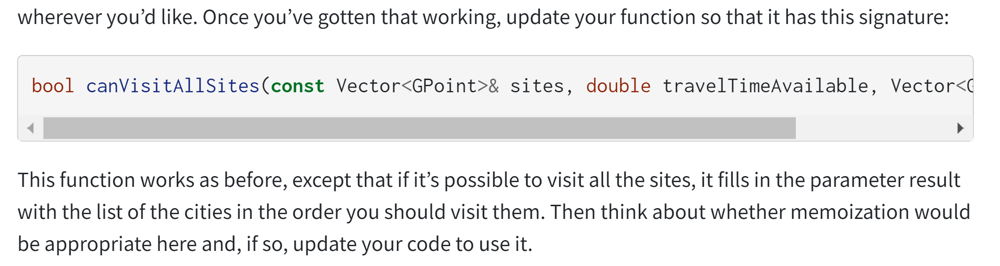

```c++
bool canVisitAllSites(const Vector<GPoint>& sites, double timeAvailable,
                      Vector<GPoint>& result) {
    /* If there aren't any sites, we can always visit them all! */
    if (sites.isEmpty()) {
        result.clear(); // Best option is the empty list.
        return true;
    }

    /* Try all possible starting points and see if any of them work. */
    for (int i = 0; i < sites.size(); i++) {
        if (canVisitAllSitesRec(removeAt(sites, i), timeAvailable, sites[i],
                                result) {
            /* Prepend the starting city. */
            result.insert(0, sites[i]);
            return true;
        }
    }
    return false;
}

bool canVisitAllSitesRec(const Vector<GPoint>& sites, double timeAvailable,
                         const GPoint& last, Vector<GPoint>& result) {
    /* Base case: If no sites remain, we're done! */
    if (sites.isEmpty()) {
        result.clear(); // Empty list is the correct visit order here.
        return true;
    }
    /* Recursive case: see where we go next. */
    else {
        for (int i = 0; i < sites.size(); i++) {
            double distance = distanceBetween(last, sites[i]);
            if (distance <= timeAvailable &&
                canVisitAllSitesRec(removeAt(sites, i), timeAvailable – dist,
                                    sites[i], result)) {
                /* Result will have been filled in with the best sequence to use
                 * given the remaining cities, so we just need to fill in this
                 * particular city.
                 */
                result.insert(0, sites[i]);
                return true;
            }
        }
        /* Looks like no options worked. Oh well! */
        return false;
    }
}
```


# P4 Pattern Matching(Hard)
> [!task]
> 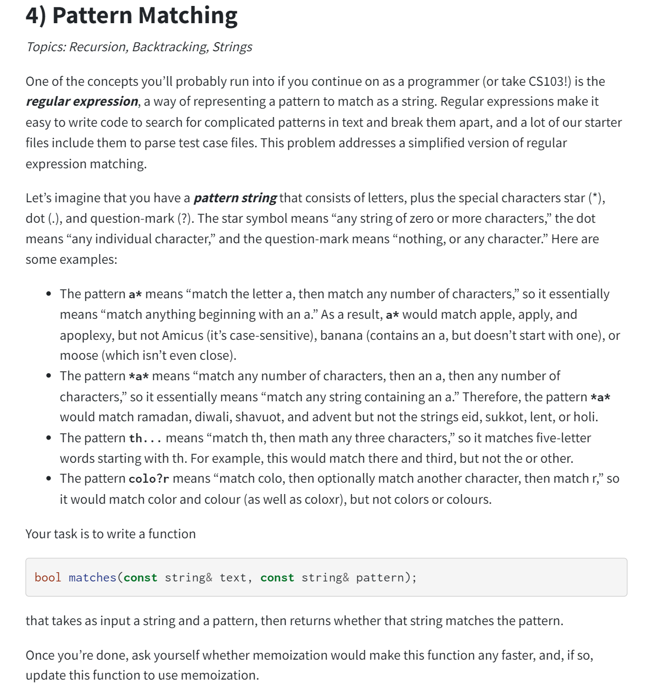
> **Hints:**
> 
> The recursion here works by recursively consuming both the pattern and the text, but its base case is only for the case where the pattern is empty, since an empty pattern only matches the empty string while an empty string can match a nonempty pattern. So when we consider the base case, there are two choices. 
> 
> The first one is to stop when the string is empty. But this doesn't generally work since when string is empty we are not traversing all the pattern symbols and cannot say anything about whether the string matches the pattern symbols. We are not equipped to say that the string matches the pattern symbols.
> 
> The second one is to stop when the  pattern string is fully consumed, this is feasible since when we see all the pattern characters we are equipped to determine whether the string matches the pattern. 

> [!code] Formal Solution - Unmemoized
> The `textIndex` and `patternIndex` indicates the starting index where we want to match the text and pattern symbols.
```C++
bool matchesRec(const string& text, int textIndex,
                const string& pattern, int patternIndex) {
    /* Base case: If we've consumed the pattern, confirm we consumed the text. */
    if (patternIndex == pattern.length()) {
        return textIndex == text.length();
    }
    /* Recursive step: there's more pattern to match. See what to do here. */
    /* Case 1: The next pattern character is a letter. */
    else if (isalpha(pattern[patternIndex])) {
        return textIndex != text.length() &&               // Text isn't empty
               text[textIndex] == pattern[patternIndex] && // That char matches
               matchesRec(text, textIndex + 1, pattern, patternIndex + 1);
    }
    /* Case 2: The next pattern character is a dot. */
    else if (pattern[patternIndex] == '.') {
        return textIndex != text.length() &&
               matchesRec(text, textIndex + 1, pattern, patternIndex + 1);
    }
    /* Case 3: The next pattern character is a ?. */
    else if (pattern[patternIndex] == '?') {
        return matchesRec(text, textIndex, pattern, patternIndex + 1) ||
               (textIndex != text.length() &&
                matchesRec(text, textIndex + 1, pattern, patternIndex + 1));
    }
    /* Case 4: The next pattern character is a star. */
    else if (pattern[patternIndex] == '*') {
        return
               (textIndex != text.length() &&
                // Act like a fresh start
                matchesRec(text, textIndex + 1, pattern, patternIndex)) ||
                // Act like ?
                matchesRec(text, textIndex, pattern, patternIndex + 1);
    } else {
        error("Unknown pattern character.");
    }
}

bool matches(const string& text, const string& pattern) {
    return matchesRec(text, 0, pattern, 0);
}
```

> [!code] Formal Solution - Memoized
```C++
#include <iostream>
#include "testing/SimpleTest.h"
#include "testing/TextUtils.h"
#include "set.h"
#include "map.h"
#include "grid.h"
using namespace std;

bool matchesRec(const string& text, int textIndex,
                const string& pattern, int patternIndex,
                Grid<bool>& memo) {

    /* Base case: If we've consumed the pattern, confirm we consumed the text. */
    if (patternIndex == pattern.length()) {
        return textIndex == text.length();
    }
    /* Base case: If we've memoized the result, return it. */
    else if (memo.isSet(textIndex, patternIndex)) {
        return memo[textIndex][patternIndex];
    }
    /* Recursive step always has to write the answer down. We'll store that value
     * in a variable that we write at the very end of the function.
     */
    bool answer;

    /* Case 1: The next pattern character is a letter. */
    if (isalpha(pattern[patternIndex])) {
        answer = textIndex != text.length() &&
                 text[textIndex] == pattern[patternIndex] &&
                 matchesRec(text, textIndex + 1, pattern, patternIndex + 1, memo);
    }
    /* Case 2: The next pattern character is a dot. */
    else if (pattern[patternIndex] == '.') {
        answer = textIndex != text.length() &&
                 matchesRec(text, textIndex + 1, pattern, patternIndex + 1, memo);
    }
    /* Case 3: The next pattern character is a ?. */
    else if (pattern[patternIndex] == '?') {
        answer = matchesRec(text, textIndex, pattern, patternIndex + 1, memo) ||
                 (textIndex != text.length() &&
                  matchesRec(text, textIndex + 1, pattern, patternIndex + 1, memo));
    }
    /* Case 4: The next pattern character is a star. */
    else if (pattern[patternIndex] == '*') {
        answer = matchesRec(text, textIndex, pattern, patternIndex + 1, memo) ||
                 (textIndex != text.length() &&
                  matchesRec(text, textIndex + 1, pattern, patternIndex, memo));
    } else {
        error("Unknown pattern character.");
    }
    memo[textIndex][patternIndex] = answer;
    return answer;
}


bool matches(const string& text, const string& pattern) {
    Grid<bool> memo(text.length() + 1, pattern.length() + 1);
    return matchesRec(text, 0, pattern, 0, memo);
}
```


# P5: Exponentials&Big-Oh
> [!task]
> 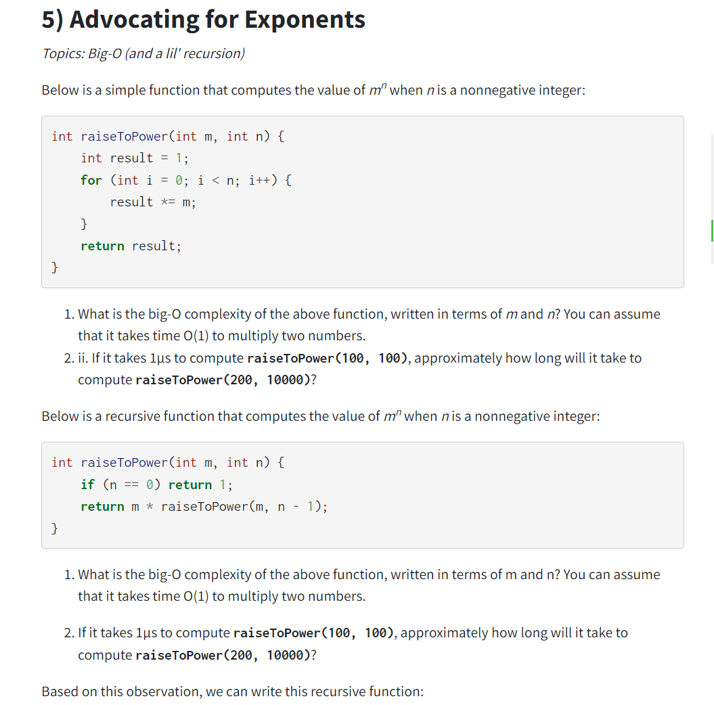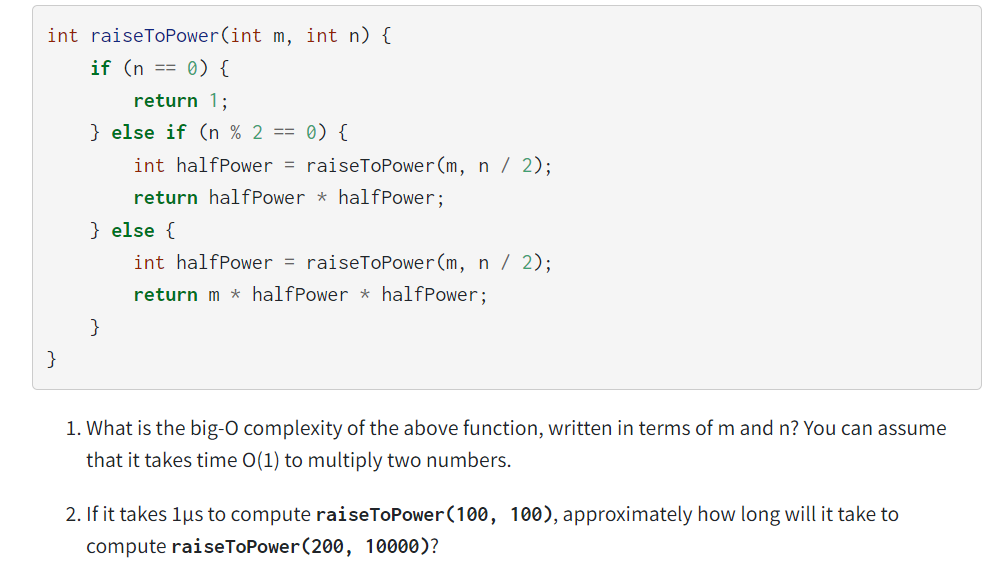

> [!solution]
> 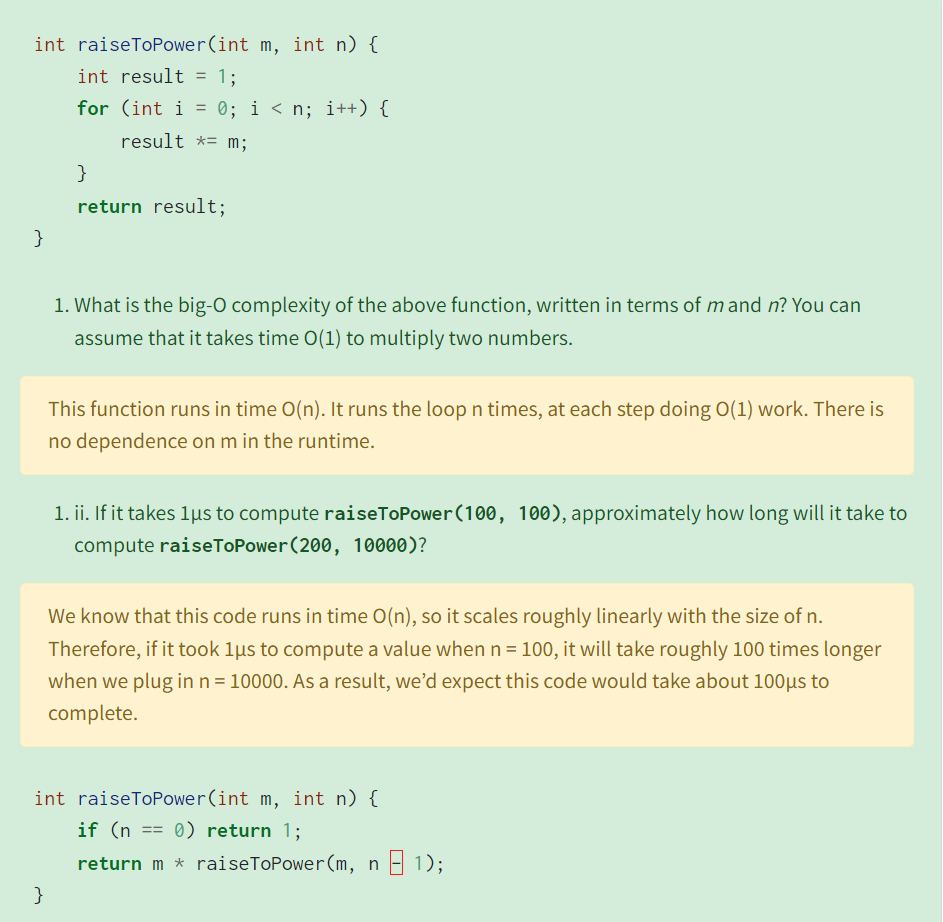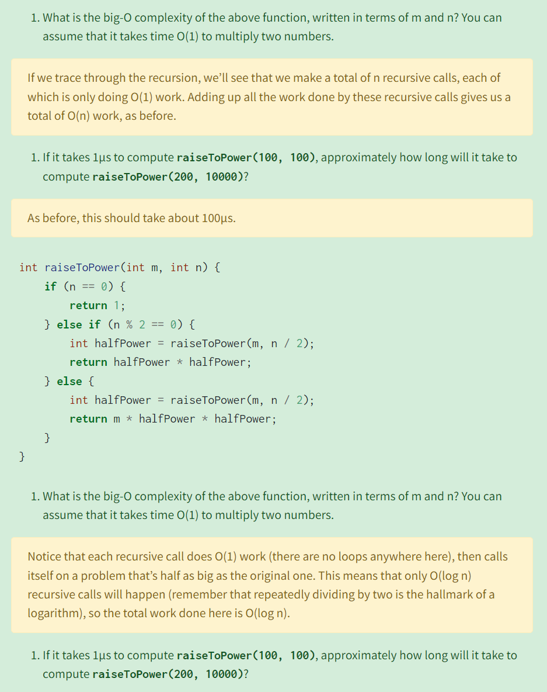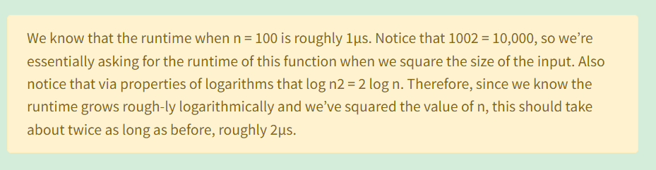


# P6: String Reversal&Big-Oh
> [!task]
> 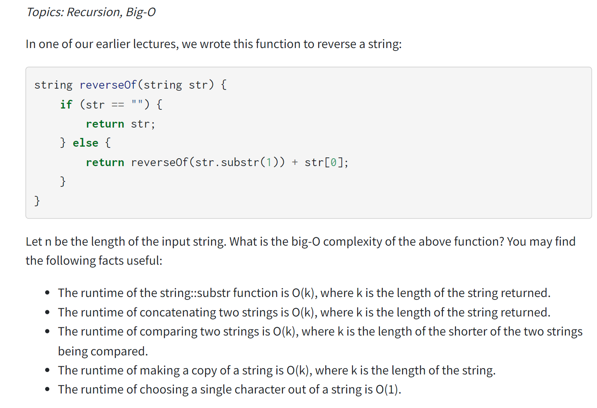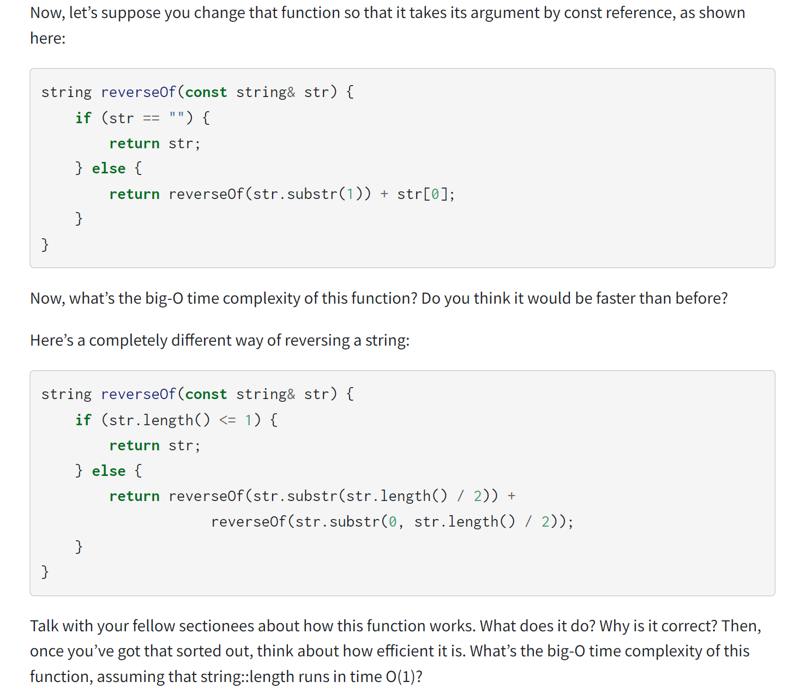

> [!solution]
> 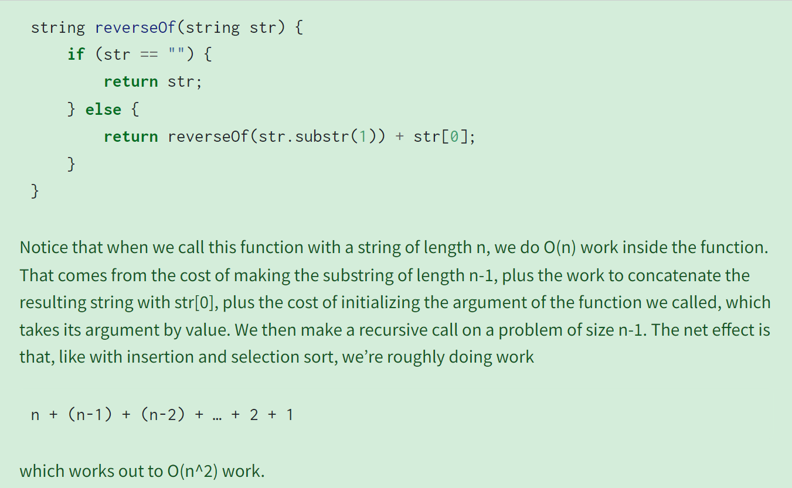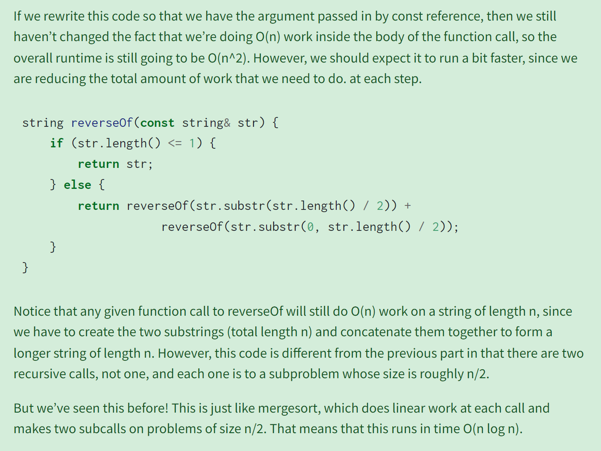


