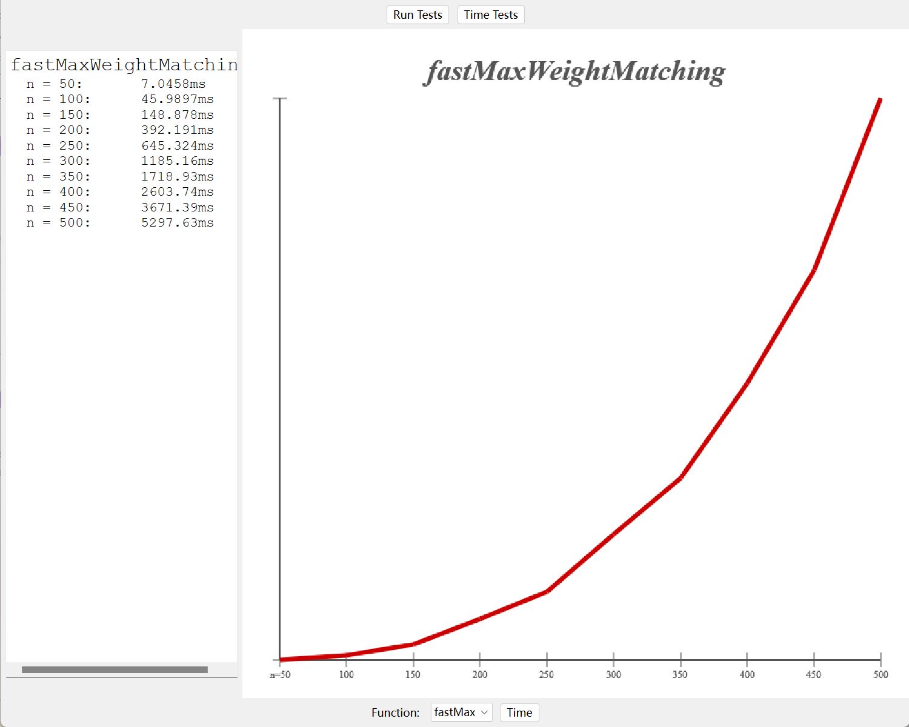

# Part 1: Big O(Skipped)


# Part 2: Matchmaker Revisited - Blossom Algorithm
## Task Description
> [!task] 
> In Assignment 4, you implemented a pair of functions for finding matchings in a group of people. You might have noticed that your algorithms for finding maximum-weight matchings and perfect matchings slowed down pretty significantly as the number of people increased. That’s in large part because there are so many possible ways of trying to pair people off that any solution that works by trying to explore them all will take a long time. For example, if you have a group of 50 people, each of whom could be paired with each other person, there are a staggering 27,886,995,605,342,342,839,104,615,869,259,776 possible matchings to try when looking for a maximum-weight matching. Even with all the computing power in the world there’s simply no way we could check all of them.
> 
> And yet, there are many applications in the real world where we need to assign pairs to groups of fifty or more people. During COVID, several CS classes suggested assignment partners in classes of 200 or more people. The famous Stanford Marriage Pact assigns matches to groups of over 8,000 people. And some algorithms for assigning routes to package delivery drivers need to find matches in groups of sizes in the hundreds, every day. Doing so will require an approach other than just a brute-force recursive search.


## Blossom Algorithm
> [!algo]
> Fortunately, there is a way to do this. A series of papers written in the early 1960s introduced a much faster algorithm for computing perfect and maximum-weight matchings. That algorithm, called the **_blossom algorithm_**, became the basis for a family of fast maximum matching algorithms that have made it possible to feasibly find maximum matchings in a variety of settings.


## Algorithm Implementation
> [!code]
```C++
#include "Matchmaker.h"
#include "Matching/graphtypes.h"
#include <limits>
using namespace std;

Set<Pair> fastMaxWeightMatching(const Map<string, Map<string, int>>& links) {
    /* Linearize links into a predictable order. */
    Map<int, string> order;
    Map<string, int> toIndex;
    for (string name: links) {
        int index = order.size() + 1;
        order[index] = name;
        toIndex[name] = index;
    }

    /* Build the graph. */
    auto graph = EdRothberg::NewGraph(links.size());
    for (const auto& src: links) {
        for (const auto& dst: links[src]) {
            if (toIndex[src] < toIndex[dst]) {
                EdRothberg::AddEdge(graph, toIndex[src], toIndex[dst], links[src][dst]);
            }
        }
    }

    /* Run the matching. */
    auto matching = EdRothberg::WeightedMatch(graph);
    EdRothberg::FreeGraph(graph);

    /* Convert to pairs. */
    Set<Pair> result;
    for (const auto& entry: matching) {
        result.add({ order[entry.first], order[entry.second] });
    }

    return result;
}

namespace {
    Set<Pair> fastMaxCardinalityMatching(const Map<string, Set<string>>& links) {
        /* Transform to a graph where each edge has cost 1. */
        Map<string, Map<string, int>> newLinks;
        for (const auto& src: links) {
            for (const auto& dst: links[src]) {
                newLinks[src][dst] = 1;
            }
        }

        /* Now find a maximum-weight matching in this new graph. */
        return fastMaxWeightMatching(newLinks);
    }
}

bool hasPerfectMatching(const Map<string, Set<string>>& possibleLinks, Set<Pair>& matching) {
    matching = fastMaxCardinalityMatching(possibleLinks);
    return matching.size() * 2 == possibleLinks.size();
}

Set<Pair> fastMWMCMatching(const Map<string, Map<string, int>>& possibleLinks) {
    /* Artificially boost all the edge costs by an amount such that it is always better to
     * have more edges than fewer edges.
     */
    int maxEdge = 0;
    for (const string& src: possibleLinks) {
        for (const string& dst: possibleLinks[src]) {
            maxEdge = max(maxEdge, possibleLinks[src][dst]);
        }
    }

    Map<string, Map<string, int>> newLinks;
    for (const string& src: possibleLinks) {
        for (const string& dst: possibleLinks[src]) {
            /* Each edge is boosted by the score you'd get if everything was paired at the
             * maximum value. Now, any matching has to include the maximum number of edges.
             */
            newLinks[src][dst] = possibleLinks[src][dst] + (maxEdge + 1) * possibleLinks.size();
        }
    }

    return fastMaxWeightMatching(newLinks);
}

```

 

## Runtime Test
> [!test]
> 


# Part 3:  On Efficiency(Skipped)


# Part 4: Combine
