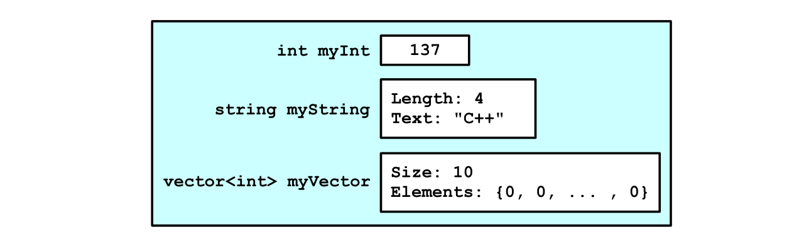

# How C++ Construct Objects - pp266 ~ 269 
## Without Initializer List
> [!important]
> 

### Step 1: Allocate Memory
> [!concept]
> 

### Step 2: Call Members' Default Constructors
> [!concept]
> C++ will call default constructor for each non-primitive types and initilize their values while leaving primitive type field unchanged.
> 

### Step 3: Call Object's Constructor
> [!concept]
> 

## With Member Initializer List
> [!concept]
> 

### Step 1: Allocate Memory
> [!concept]
> 

### Step 2: Call Members' Constructors with parameters
> [!concept]
> 
> This step turns out to be extremely useful when the field doesn't have default constructor.

### Step 3: Call Object's Constructor
> [!concept]
> 

## Passing Parameters in Member Initializer Lists - pp269 ~ 270
> [!important]
> 

# When Initializer Lists are Mandatory
## Case 1: Initialize Const Variable
> [!important]
> 

 
## Case 2: Field without Default Constructor
> [!important]
> 

## Multiple Constructors Caveasts
> [!important]
> 

# std::initializer_list
>[!important] 
>

# Static Keyword in Class
## Static Data Members

## Static Member Functions