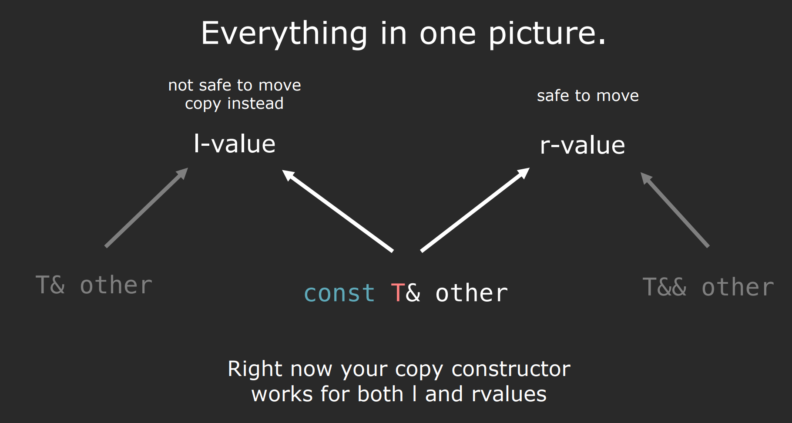

# lvalues and rvalues
> [!important]
> 

> [!example] Example 1
> 
> 1. `2` is a rvalue, `val` is a lvalue
> 2. `0x02248837` is an rvalue, `int* ptr` is a lvalue.
> 3. `v1` is a lvalue
> 4. `v1` is a lvalue, it is a name(identity), can find the address. `v2` is also a lvalue for the same reason. `v1 + v2` returns a temporary vector, which is an rvalue. `v4` is a lvalue.
> 5. both `v1` and `v4` are lvalue.
> 6. `size` is lvalue. `v.size()` is rvalue(integer returned by a function)
> 7. `static_cast<int>(size)` is an rvalue. `val` is lvalue.
> 8. `v1[1]` is lvalue since we can find its address. Alternative explanation would be that `v1[1]` call the `operator[]` that returns a reference, which is a name(variable that points to something).
> 9. `&val` is an rvalue. `ptr` is lvalue.
> 10. `v1[2]` is a lvalue(explained above), `*ptr` is lvalue since we can do such thing as `*ptr = 2`.
> 
> 


# lvalue/rvalue references
## Reference Recap
> [!important]
> 


## lvalue vs rvalue references
> [!concept]
> 

> [!example] Example 1
> 
> Can only bind lvalue to lvalue reference and rvalue to rvalue reference.
> 
> **Can also bind  rvalue to const lvalue reference.**
> 

> [!example] Example 2
> 


> [!example] Example 3: r-value reference is lvalue
> 


## Summary
> [!summary]
> 


# Move Semantics
## Motivation
> [!motiv] Motivation


## Key Idea
> [!important]
> 


> [!important]
> 
> By moving from obj2 to obj1, we are promising not to use the name obj2 ever and obj1 takes control of the variable.


## std::move
> [!def]
> 

> [!important]
> Inside `<utility>` library.
> 
> Consider the following implementation of move assignment member function, we see some inefficiencies here:
> 
> One way of doing this is using casting:
> 
> 
> But C++ provides more powerful built-in algorithm to do this:
> 
> 
> More on `std::move`:
> 
> 


## Move Construct/Assign
> [!def]
> 
> Note that here there is no `const` for the parameter.


### Move Constructor
> [!def]
> 
> An equivalent way of setting up `pi` field is to use `std::exchange`:
> 
> 
> `ptr(std::exchange(new_ptr, null_ptr))`, set `ptr` to `new_ptr` and `new_ptr` to `nul_ptr`.

> [!important]
> It creates new from existing rvalue. Note that r-value reference is an l-value.
> 
> The inefficient implementation would be:
> 
> Using `std::move` we have:
> 
> 
> 
> Note that here we are using initializer list syntax.


### Move Assignment
> [!important]
> It overwrites existing from existing r-value.
> 
> Using `std::move` we have:
> 
> 


## Core Guideline C.64 - Valid State
> [!def]
> 
> If field `pi` is using `unique_ptr`, then phase 2 can be omitted:
> 
> 


## Core Guideline C.66 - noexcept
> [!def]
> 
> 
> `noexcept` basically means no exception. Adding it will not affect the correctness of the code while improve the performance.
> 
> 
> Here `push_back` gives you **strong exception safety guarantee** such that if any exceptions is thrown from `push_back` function, it acts like nothing has happened at all. Much like the rolling back of commit in database.


## Vector Example
> [!code]
> 


## Quick Quiz
> [!problem]
> 
```c++
/* main.cpp */
#include "test.hpp"

StrVector readNames(int size);

int main(int argc, char* argv[]) {
	// Move constructor is elided here for RVO optimization
    StrVector name1 = readNames(414213);
    StrVector name2; // Default constructor
    name2 = readNames(4324312);
    return 0;
}

// Copy Constructor is elided when returning(by creating a temporary r-value object instead of temporary l-value object)
StrVector readNames(int size) {
	// Fill constructor called, cannot be optimized
    StrVector names(size, "Ito");
    return names;
}


/* test.hpp */
#include <iostream>
#include <string>

using namespace std;

class StrVector{
    public:

        // Default constructor
        StrVector();

        // Fill Constructor
        StrVector(int size, string data);

        // Copy Constructor
        StrVector(const StrVector& rhs);

        // Move Constructor 
        StrVector(StrVector&& rhs);

        // Copy Assignment
        StrVector& operator=(const StrVector& rhs);
        
        // Move Assignment
        StrVector& operator=(StrVector&& rhs);

		// Destructor
        ~StrVector();

    private:
        int size;
        string data;
};


/* test.cpp */
#include "test.hpp"


StrVector::StrVector() {
    cout << "Default Constructor" << endl;
}

 // Fill Constructor
StrVector::StrVector(int size, string data) {
    cout << "Fill Constructor" << endl;
}

// Copy Constructor
StrVector::StrVector(const StrVector& rhs) {
    cout << "Copy Constructor" << endl;
}

// Move Constructor 
StrVector::StrVector(StrVector&& rhs) {
    cout << "Move Constructor" << endl;
}

// Copy Assignment
StrVector& StrVector::operator=(const StrVector& rhs) {
    cout << "Copy Assignment" << endl;
    return *this;
}

// Move Assignment
StrVector& StrVector::operator=(StrVector&& rhs) {
    cout << "Move Assignment" << endl;
    return *this;
}


StrVector::~StrVector() {
    cout << "Destructor" << endl;
}

```
> [!exp] Output
> 
> All the move constructors are elided and only fill constructor is called.


## Applications
> [!example] Example 1: Boost Efficiency
> 


> [!example] Example 2: Generic Swap Function
> 
> Using Reference(all the ='s are copy constructor/assignment).
> 
> 
> Using `std::move`(all the ='s are move constructor/assignment):
> 
> 


# Integrated Examples
## Construction or Assignment?
> [!example ]
> 
> 1. The first one invokes default constructor, since it doesn't take in any parameters.
> 2. The second one invokes the normal constructor which takes userd-defined number of parameters.
> 3. **The third one is the most vexing part of C++ programming, which basically is defining a new function.** This function has no parameter and return `MyVector` type.
> 4. The fourth one invokes copy constructor. vec4 is constructed as a copy of vec2.
> 5. **The fifth one invokes default constructor.**  C++ designer makes this in order to differentiate between `...()` and `...{}`.
> 6. The sixth one invokes copy constructor. vec6 is constructed as a copy of the vector returned by vec3 + vec4.
> 7. The seventh invokes copy constructor. vec7 is constructed as a copy of vec4.
> 8. The `vec7 = vec2` invokes copy assignment operator.
>


## How many instances created?
> [!example]
> 
> In total, three `StringVector` instances are created but there is lots of copying:
> 
> 
> But when the compiler is smart enough, it can skip one constructor:
> 
> 


## How many times each special member functions are called?
> [!example]
> 
> 1. Default Constructor: 1
> 2. Normal Constructor(Fill Constructor): 2
> 3. Copy Constructor: 3
> 4. Copy Assignment: 1
> 5. Destructor: 6
> 
> 
> Assume there is no optimization so that copy constructor will be called when the function returned and that the `StrVector` doesn't have a move constructor:
> 1. readNames is executed, in the function `StrVector names(size, "Ito")` triggers a fill constructor.
> 2. The function returns and create a temporary object `StrVector temp = names`, which triggers the copy constructor since `names` is an l-value.
> 3. The `names` goes out of scope, so its destructor is triggered.
> 4. `StrVector name1 = readNames(...)` triggers the copy constructor of `StrVector` since **StrVector doesn't have a move constructor**.
> 5. The temporary object is copied to `name1` and will be freed, which triggered its destructor.
> 6. `StrVector name2` triggers the default constructor of `StrVector`.
> 7. readNames is executed again, in the function `StrVector names(size, "Ito")` triggers a fill constructor.
> 8. The function returns and create a temporary object `StrVector temp = names`, which triggers the copy constructor since `names` is an l-value.
> 9. The `names` goes out of scope, so its destructor is triggered.
> 10. `name2 = readNames(...)` triggers the copy assignment(not move assignment for the same reason as in point 4).
> 11. `name1`is freed.
> 12. `name2` is freed.
> 
> By default, C++ doesn't provide move constructor/assignment to every class.


# Disable Copying - delete keyword
> [!important]
> One way of doing this is to declare the copy constructor and copy assignment operator to be private and not implement them.
> 
> Other tricks include declaring them in the public section and use delete keyword.
> 
> 


