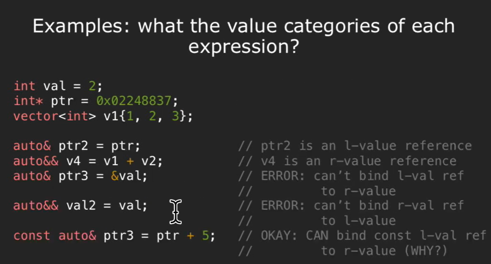

# lvalues and rvalues
> [!important]
> 

> [!example] Example 1
> 
> 1. `2` is a rvalue, `val` is a lvalue
> 2. `0x02248837` is an rvalue, `int* ptr` is a lvalue.
> 3. `v1` is a lvalue
> 4. `v1` is a lvalue, it is a name(identity), can find the address. `v2` is also a lvalue for the same reason. `v1 + v2` returns a temporary vector, which is an rvalue. `v4` is a lvalue.
> 5. both `v1` and `v4` are lvalue.
> 6. `size` is lvalue. `v.size()` is rvalue(integer returned by a function)
> 7. `static_cast<int>(size)` is an rvalue. `val` is lvalue.
> 8. `v1[1]` is lvalue since we can find its address. Alternative explanation would be that `v1[1]` call the `operator[]` that returns a reference, which is a name(variable that points to something).
> 9. `&val` is an rvalue. `ptr` is lvalue.
> 10. `v1[2]` is a lvalue(explained above), `*ptr` is lvalue since we can do such thing as `*ptr = 2`.
> 
> 

# lvalue/rvalue references
## Reference Recap
> [!important]
> 

## lvalue vs rvalue references
> [!concept]
> 

> [!example] Example 1
> 
> Can only bind lvalue to lvalue reference and rvalue to rvalue reference.
> 
> **Can also bind  rvalue to const lvalue reference.**
> 

> [!example] Example 2
> 

> [!example] Example 3: r-value reference is lvalue
> 

## Summary
> [!summary]
> 

# Move Semantics
## Motivation
> [!motiv] Motivation

## Key Idea
> [!important]
> 

> [!important]
> 
> By moving from obj2 to obj1, we are promising not to use the name obj2 ever and obj1 takes control of the variable.

## std::move
> [!def]
> 

> [!important]
> Inside `<utility>` library.
> 
> Consider the following implementation of move assignment member function, we see some inefficiencies here:
> 
> One way of doing this is using casting:
> 
> 
> But C++ provides more powerful built-in algorithm to do this:
> 
> 
> More on `std::move`:
> 
> 

## Move Construct/Assign
> [!def]
> 
> Note that here there is no `const` for the parameter.

### Move Constructor
> [!def]
> 
> An equivalent way of setting up `pi` field is to use `std::exchange`:
> 
> 
> `ptr(std::exchange(new_ptr, null_ptr))`, set `ptr` to `new_ptr` and `new_ptr` to `nul_ptr`.

> [!important]
> It creates new from existing rvalue. Note that r-value reference is an l-value.
> 
> The inefficient implementation would be:
> 
> Using `std::move` we have:
> 
> 
> 
> Note that here we are using initializer list syntax.

### Move Assignment
> [!important]
> It overwrites existing from existing r-value.
> 
> Using `std::move` we have:
> 
> 

## Core Guideline C.64 - Valid State
> [!def]
> 
> If field `pi` is using `unique_ptr`, then phase 2 can be omitted:
> 
> 

### Core Guideline C.66 - noexcept
> [!def]
> 
> 
> `noexcept` basically means no exception. Adding it will not affect the correctness of the code while improve the performance.
> 
> 
> Here `push_back` gives you **strong exception safety guarantee** such that if any exceptions is thrown from `push_back` function, it acts like nothing has happened at all. Much like the rolling back of commit in database.

## Vector Example
> [!code]
> 

## Quick Quiz
> [!problem]
> 

## Applications
> [!example] Example 1: Boost Efficiency
> 

> [!example] Example 2: Generic Swap Function
> 
> Using Reference(all the ='s are copy constructor/assignment).
> 
> 
> Using `std::move`(all the ='s are move constructor/assignment):
> 
> 

