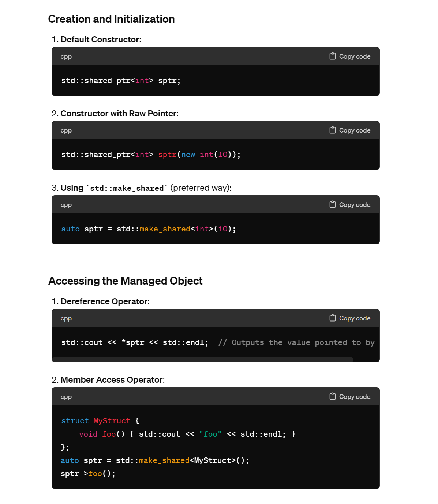

# RAII
## Definition
> [!def]
> 


## Exception Safety
> [!example] Bad Example
> 

> [!example] Fix
> 


## Principles
> [!concept]
> 


## The Rule of Zero
> [!important]
> 


## The Rule of Five
> [!important]
> 


## The Rule of Four
> [!important]
> 


## Vector Example
> [!important]
> 


## RAII Compliant
> [!example] Stream
> 
> The fact that stream is RAII compliant make sure once the stream is opened, even if the program throws exceptions in the middle, the stream will finally be closed. So from the user's perspective, we don't actually have to explicitly call `close()`.


# Smart Pointers
## Rule of Smart Pointers
> [!important]
> 
> Smart pointers are all RAII-compliant.


## std::unique_ptr
### Common APIs
> [!important]
> **Create and Initialization:**
> 1. Default Constructor: `std::unique_ptr<int> ptr;`
> 2. Constructor with Raw Pointer: `std::unique_ptr<int> ptr(new int(5));
> 3. Using `std::make_unique(elem)` (preferred): `auto ptr = std::make_unique<int>(5)`. 
> 
> **Accessing the Managed Object:**
> 1. **Dereference** Operator: `*ptr`
> 2. Member **Access** Operator: `ptr->member_func()`
> 
> **Managing Ownership:**
> 1. **Release** Ownership: `int* rawPtr = ptr.release();`
> 2. **Reset**, it will change the raw pointer that will be managed: `ptr.reset(new int(10))` or change it to null `ptr.reset()` so that nothing will be managed by the smart pointer.
> 3. **Swap**: Swaps the managed objects of two `std::unique_ptr` instances.

### Exclusive Ownership and Movable
> [!def]
> 
```c++
#include <iostream>
#include <memory>

class MyClass {
public:
    MyClass() { std::cout << "MyClass constructor\n"; }
    ~MyClass() { std::cout << "MyClass destructor\n"; }
    void display() const { std::cout << "Displaying MyClass\n"; }
};

int main() {
    // Create a unique_ptr using std::make_unique
    std::unique_ptr<MyClass> ptr1 = std::make_unique<MyClass>();

    // Move construct a new unique_ptr
    std::unique_ptr<MyClass> ptr2 = std::move(ptr1);
    if (!ptr1) {
        std::cout << "ptr1 is now null after move\n";
    }
    if (ptr2) {
        ptr2->display();
    }

    // Move assign to another unique_ptr
    std::unique_ptr<MyClass> ptr3;
    ptr3 = std::move(ptr2);
    if (!ptr2) {
        std::cout << "ptr2 is now null after move\n";
    }
    if (ptr3) {
        ptr3->display();
    }

    return 0;
}

```
> [!exp]
> 


### Array Form 
> [!def]
> 


### Deleter Template
> [!def]
> 


### CS106X Slides
> [!concept]
> 
> If we are able to copy, it will cause double free problem:
> 
> 


## std::shared_ptr
### Common APIs
> [!important]
> 


### Reference Count
> [!important]
> 


### Control Block
> [!def]
> 


### CS106X Slides
> [!concept]
> 
> When we do `p2 = p1`, we call copy constructor of `std::shared_ptr<int>`.
> 
> The implementation details revolves around `reference counting`:
> 
> 


## std::weak_ptr
> [!concept]
> 

