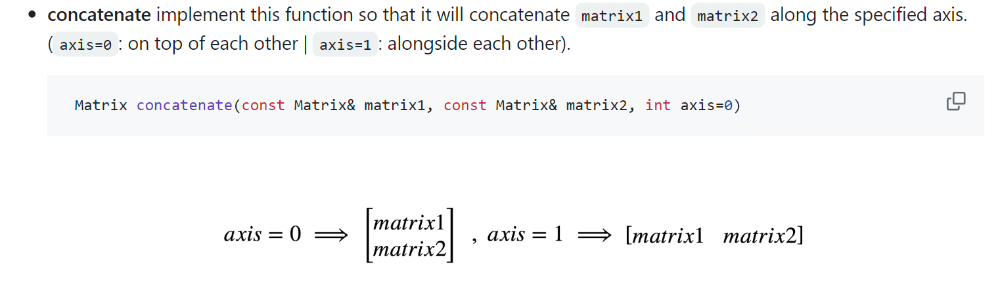
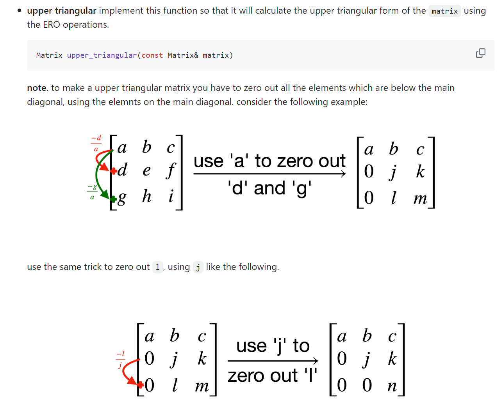

# Environment Setup
> [!important]
> Given a docker file, we can use `docker build. ` to set up the dev environment.
> 
> Given a docker image, we can run the docker container as follows:
> `docker run -it [imageName] bash`
> 
> Then we get the terminal:
> 
> But we starting the docker image is not enough, we will want to mount our file system onto it, we could do it as follows:
> `docker run -it -v <absolutepath on host>:/home/pathOnContainer imageName bash`
> 
> 
> For example, to run HW1 in the container, we can do:
> ` docker run -it -v F:/A_Study_Notes_Backup/A-Computer-Science/Advanced_C++/AP1400-2-HW1:/home/AP-HW/HW1 hw1 bash`
> 
> Then to find the file we have just mounted in the container, we just use our navigation techniques:
> `cd /` to the root, then `ls -a` to see all the sub directories, and then find the `home/AP-HW/HW1`.
> 
> If we want to exit the docker container, just type `exit`.


# How to Edit Codes and Run Test
> [!important]
> Everytime we edit some codes and want to see if the codes work just fine, we can do the following:
> 1. `docker build -t imageName .`
> 2. `docker run -it imageName bash`
> 3. In the container, run `./main` to see the test result.


# Full Implementations
## zeros
> [!code]
> 


## ones
> [!code]
> 


## random
> [!code]
> 


## show
> [!code]
> 


## multiply - scalar
> [!code]
> 


## multiply - matrix
> [!code]
> 


## sum - scalar
> [!code]
> 


## sum - matrix
> [!code]
> 


## transpose
> [!code]
> 


## minor
> [!code]
> 


## determinant
> [!code]
> 


## inverse
> [!code]
> The core idea of computing inverse is using the following property:
> 
> $A~Adj(A) = det(A)$where $Adj(A)$ is the transpose of the cofactor matrix of $A$.
> 
> Thus the inverse can be computed as $A^{-1} = \frac{1}{det(A)}Adj(A)$.

> [!algo] How to find cofactor matrix - 3x3
> 

> [!code]
> 


## concatenate
> [!code]
> 
```c++
/**

     * concatenate implement this function so that it will concatenate matrix1 and matrix2 along the specified axis. (axis=0: on top of each other | axis=1: alongside each other).

     * Note that in the function implementation, default parameter should not be set

     * Default parameter only appears in the header file, otherwise it won't compile.

    */

    Matrix concatenate(const Matrix& matrix1, const Matrix& matrix2, int axis) {

        if (isEmpty(matrix1)) {

            return std::move(matrix2);

        }

  

        if (isEmpty(matrix2)) {

            return std::move(matrix2);

        }

  

        if (isEmpty(matrix1) && isEmpty(matrix2)) {

            return std::move(Matrix{});

        }

        auto shape1 = shape(matrix1);

        int rowSize1 = shape1.first;

        int columnSize1 = shape1.second;

        auto shape2 = shape(matrix2);

        int rowSize2 = shape2.first;

        int columnSize2 = shape2.second;

  

        if (axis == 0) {

            if (columnSize1 != columnSize2) {

                throw std::logic_error("Column size mismatches, columnSize1 should be the same as columnSize2, cannot stack along row direction!");

            }

  

            Matrix result = zeros(rowSize1 + rowSize2, columnSize1);

  

            for (int i = 0; i < rowSize1; i++) {

                for (int j = 0; j < columnSize1; j++) {

                    result[i][j] = matrix1[i][j];

                }

            }

  

            for (int i = rowSize1; i < rowSize1 + rowSize2; i++) {

                for (int j = 0; j < columnSize1; j++) {

                    result[i][j] = matrix2[i - rowSize1][j];

                }

            }

  

            return std::move(result);

  

        } else if (axis == 1) {

            if (rowSize1 != rowSize2) {

                throw std::logic_error("Row size mismatches, rowSize1 should be the same as rowSize2, cannot stack along row direction!");

            }

  

            Matrix result = zeros(rowSize1, columnSize1 + columnSize2);

  

            for (int i = 0; i < rowSize1; i++) {

                for (int j = 0; j < columnSize1; j++) {

                    result[i][j] = matrix1[i][j];

                }

            }

  

            for (int i = 0; i < rowSize1; i++) {

                for (int j = columnSize1; j < columnSize1 + columnSize2; j++) {

                    result[i][j] = matrix2[i][j - columnSize1];

                }

            }

  

            return std::move(result);

  

        } else {

            throw std::logic_error("Invalid axis number, expecting one of 0 or 1.");

        }

    }
```


## ero_swap
> [!code]
> 


## ero_multiply
> [!code]
> 


## ero_sum
> [!code]
> 


## upper_triangular
> [!task]
> 

> [!code]
> 


## Testing
> [!test]
> 

