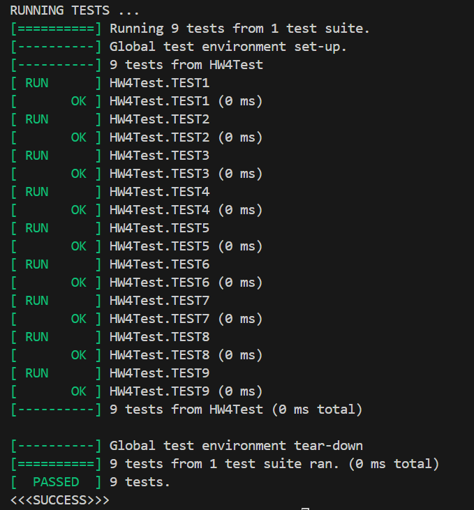
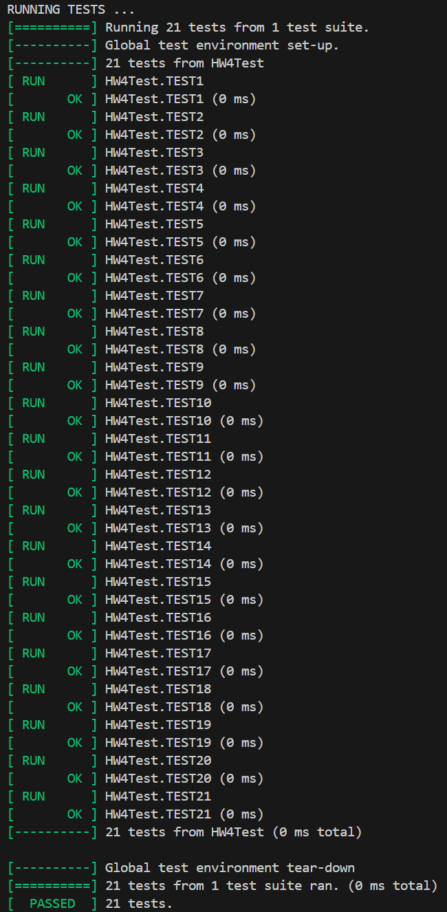

# Compile
> [!important]
> First open Docker Desktop to start the docker engine.
> Run `docker build -t hw4 .`, it will compile the source file.
> Run `docker run -it hw4 bash`


# Unique Pointer
> [!algo] Implementation Idea
> 
> We need the following APIs(see [std unique_ptr](../../8_Advanced_Topics_C++0x/RAII_Smart_Pointers.md#std%20unique_ptr)):
> 1. Default Constructor
> 2. Constructor with raw pointer
> 3. **Cannot copy construct**.(Use delete keyword to cause compile time error).
> 4. Release
> 5. Reset
> 6. Dereference
> 7. Access member

> [!code] unique_ptr.h
> 
```c++
#ifndef UNIQUE_PTR
#define UNIQUE_PTR

template <typename T> 
class UniquePtr {
    public:

        /* 1. Constructor and Desctructor */
        // Default Constructor, initialize to nullptr
        /*
            UniquePtr<int> ptr;
        */
        UniquePtr() {
            this -> _p = nullptr;
        }


        // Fill Constructor, support UniquePtr<int> ptr{new int{10}};
        /*
         explicit here prevents implicit construction when we pass 10 as a function argument 
        */
        explicit UniquePtr(T* addr) {
            this -> _p = addr;
        }


        // Copy Constructor
        /*
            Copy Constructor As you already know you cannot copy a UniquePtr
            , make arrangements so the following code would cause a compile error.
        */
        // using keyword delete, we make sure that once
        // the client write UniquePtr<int> uptr1 = uptr2;
        // there will be a compile time error.
        UniquePtr(const UniquePtr& uptr) = delete;


        // Move Constructor, using C++ default, note that there is no const keyword before parameter
        /*
            Note that with RVO(return value optimization) optimization,
            when we are doing UniquePtr<T> ptr{make_unique<int>(10)}, it is similar to
            UniquePtr<T> ptr = make_unique<int>(10);
            Since make_unique always return an r-value(temporary object, but elided), wihout RVO optimization
            this line will trigger the move constructor. But with RVO optimization
            the move constructor will be elided,giving a even more time-efficient program.
        */ 
        UniquePtr(UniquePtr&& rhs) {
            std::cout << "haha" << std::endl;
        }

        // Copy Assignment
        /*
            Copy Constructor As you already know you cannot copy a UniquePtr
            , make arrangements so the following code would cause a compile error.
        */
        UniquePtr<T>& operator=(const UniquePtr& uptr) = delete;
        

        // Destructor
        ~UniquePtr() {
            if (this -> _p != nullptr) {
                delete this -> _p;
            }
            this -> _p = nullptr;
        }


        /* 2. Operator Overloading */

        // Move assignment
        UniquePtr<T>& operator=(const UniquePtr&& uptr) {
            delete this -> _p;
            this -> _p = uptr._p;
        }


        // Dereference Operator, must be const, since it is read only
        T operator* () const {
            // Return the reference to the resource that is managed
            return *(this -> _p);
        }


        // Pointer operator, must be const, read-only
        T* operator-> () const {
            // Return pointer to the resource that is managed
            return this -> _p;
        }


        // Boolean operator, used for testing
        // Support if(ptr) statement, return true if the managed pointer is not a nullptr.
        operator bool() const {
            return _p != nullptr;
        }


        /* 3. Member Functions */

        // get raw pointer, same as deference, but preferred in modern C++
        T* get() {
            return this -> _p;
        }


        // Free up the resources, same as desructor, but preferred in modern C++
        void reset() {
            delete this -> _p;
            this -> _p = nullptr;
        }


        // Parametrized Version, take a pointer
        void reset(T* new_ptr) {
            // 1. Delete old pointer
            delete this -> _p;
            // 2. Point to a new address
            this -> _p = new_ptr;
        }


        // Release the control of the smart pointer over the pointer object, now user can use the raw pointer
        T* release() {
            T* res = this -> _p;
            // Deassociate with the object
            this -> _p = nullptr;
            return res;
        }


    

    private:
        // Resource that is managed by the smart pointer
        T* _p;
};

// Factory pattern, preferred over new keyword.
/*
    UniquePtr<int> ptr{make_unique<int>(10)};
    Very Important: return an r-value object will not trigger move constructor due to RVO optimization.
*/
template <typename T> 
inline UniquePtr<T> make_unique(T elem) {
    T* t = new T{elem};
    return UniquePtr<T>(t);
}

#endif //UNIQUE_PTR
```
> [!test]
> 


# Shared Pointer
> [!algo] Implementation Idea
> The **biggest difference** between shared pointer and unique pointer is that there is an added field `count` that logs the number of shared pointer objects that are managing the same resource.
> 
> Please refer to [Reference Count](../../8_Advanced_Topics_C++0x/RAII_Smart_Pointers.md#Reference%20Count)
> 
> Basically in order to make the reference count visible to multiple objects, we will define a pointer within the object so that multiple objects can have a member field pointing to the same memory address and modify it.
> 
> Moreover, **copy assignment and copy constructor are both allowed for shared pointers** and is the backbone of shared pointer. 

> [!code]
```c++
#ifndef SHARED_PTR
#define SHARED_PTR


template <typename T>
class SharedPtr {
    public:
        /*
            Default Constructor
        */
        SharedPtr() {
            this -> _p = nullptr;
            this->count = new int(0);
        }

        /*
            Fill Constructor
        */
        explicit SharedPtr(T* addr) {
            this -> _p = addr;
            if (addr == nullptr) {
                this->count = new int(0);
            } else {
                this->count = new int(1);
            }
            
        }

        /*
            Copy Constructor, everytime an object you call, increment the use_count by 1.
        */
        SharedPtr(const SharedPtr& sptr) {
            // Self Copying should be detected as no-op
            this -> _p = sptr._p;
            if (sptr._p == nullptr) {
                this->count = new int(0);
            } else {
                this -> count = sptr.count;
                (*this->count)++; // Or write *(this-> count)+=1
            }         
        }


        /*
            Copy Assigment
            Allow ptr2 = ptr1;
            Disallow ptr1 = ptr1 by doing nothing.
        */
        SharedPtr<T>& operator=(const SharedPtr& sptr) {
            if (this == &sptr) {
                return *this;
            }

            // Release the old resource that are currently managed
            reset(sptr._p);

            // Update the reference counter to the newly copied object
            delete this -> count;
            this -> count = sptr.count;
            (*this -> count)++;

            return *this;
        }
        

        operator bool() const {
            return _p != nullptr;
        }


        ~SharedPtr() {
            
            if ((*this->count)-- == 0) {
                // If the current shared pointer object is the last one to hold the resource
                // then also free the resources
                delete _p;
                _p = nullptr;
            } else {
                // Else, there are other shared pointers that are managing the resources.
                // Thus we cannot free up the resources using delete.
                _p = nullptr;
            }
        }

        T& operator*() {
            return *(this->_p);
        }

        T* operator->() {
            return this->_p;
        }


        int use_count() {
            return *(this->count);
        }


        T* get() {
            return this->_p;
        }

        /*
            reset: Stop managing the current resource.
            Set the resource pointer to nullptr and decrement the reference count.
            If it is the last shared pointer that holds the resource, then also free the resource.
        */
        void reset() {
            if ((*this->count)-- == 0) {
                delete _p;
                _p = nullptr;
            } else {
                _p = nullptr;
            }
        }

        /*
            reset: Stop managing the current resource while start managing a new resource pointer.
            Set the resource pointer to the new resource pointer and set the reference count to 1.
            If it is the last shared pointer that holds the resource, then free the old resource before
            set it to the new one.
        */
        void reset(T* new_ptr) {
            if ((*this->count)-- == 0) {
                delete _p;
            }
            _p = new_ptr;
            delete this->count;
            this->count = new int(1);
        }


    private:
        T* _p;
        int* count; // Distinct from UniquePtr, must be a pointer since we want to modify it when copying
};


template <typename T>
inline SharedPtr<T> make_shared(T elem) {
    T* t = new T{elem};
    return SharedPtr<T>(t);
}


#endif //SHARED_PTR
```
> [!test]
> 
> 

> [!exp] Important Notes
> One way to release the resource(by triggering the destructor of an object) is to use `{}`(scope) in C++ where all the variables initialized withini the scope will be freed upon reaching `}`, as the following test shows:
```c++
TEST(HW4Test, TEST15) {
    SharedPtr<std::string> ptr1{make_shared<std::string>("hello world!")};
    {
        {
            SharedPtr<std::string> ptr2{ptr1};
            EXPECT_EQ(ptr1.use_count(), 2);
            EXPECT_EQ(ptr2.use_count(), 2);    
        }
        EXPECT_EQ(ptr1.use_count(), 1);
        SharedPtr<std::string> ptr3{ptr1};
        EXPECT_EQ(ptr1.use_count(), 2);
        EXPECT_EQ(ptr3.use_count(), 2);
    }
    EXPECT_EQ(ptr1.use_count(), 1);
    ptr1.~SharedPtr();
    EXPECT_EQ(ptr1.use_count(), 0);
    EXPECT_EQ(ptr1.get(), nullptr);
}
```


