# Part 1: Basics of Gap Buffers
## Const-Correctness Interface

## Memory Layout of Gap Buffer
> [!concept]
> 
> **Warning**: there are two indices here. 
> - We have:
> 	- the array index (labeled a), which is an index of the array
> 	- the external string index (labeled s), which is the index in the string that the user sees (since the user doesn't actually see the gap on her text editor). 
> - For example, in the diagram above, the character 'E' is stored at index 10a (since it is in index 10 in the array), but we also say it is at index 3s, since in the text editor it appears in index 3.
> 
> 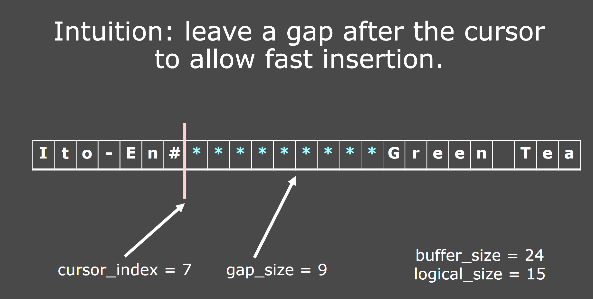

## Insertion
> [!concept]
> Insertion and deletion are easy operations:
> 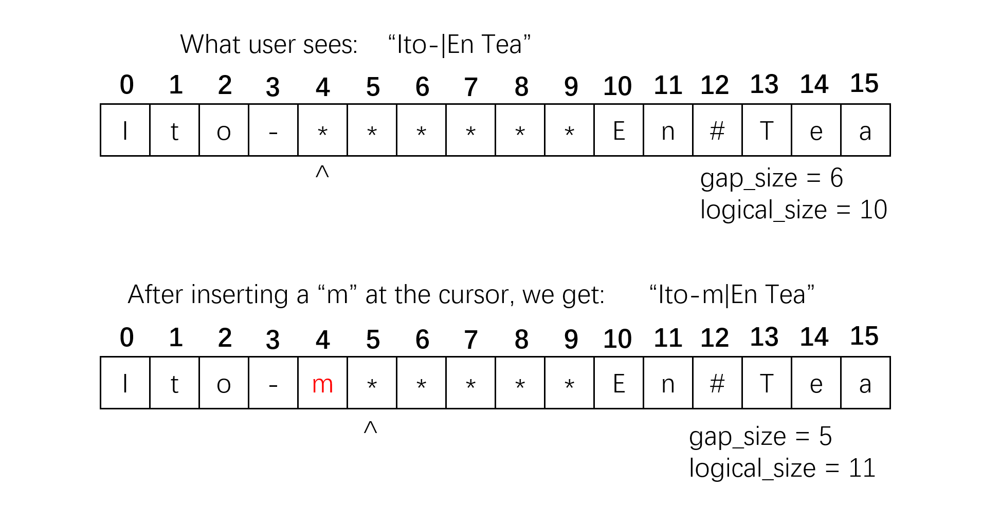
> If we start by inserting from scratch, we would have the following:
> 
> 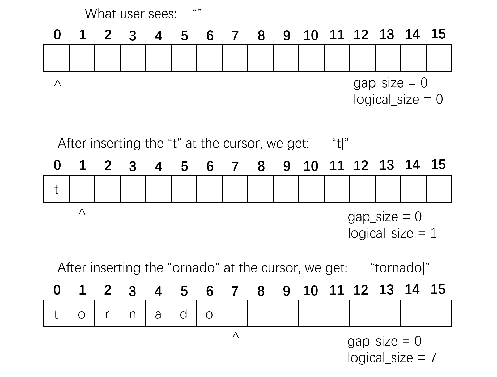
> Notice that unless we explicit move the cursor, the insertion won't cause the gap size to increase.

## Deletion 
> [!concept]
> 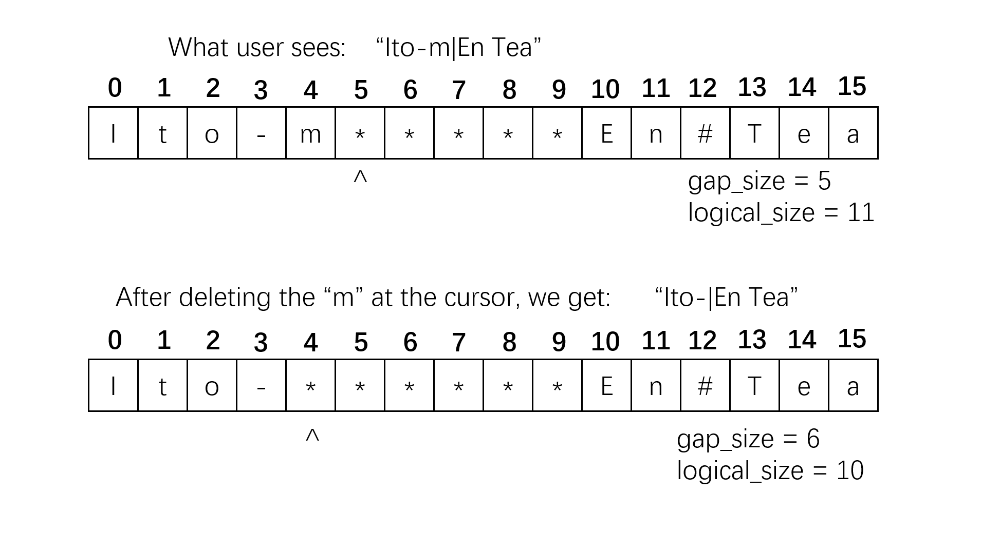

## Move and Jump Cursor
> [!important]
> Move operation is a bit difficult, suppose before movement, our buffer looks like:
> 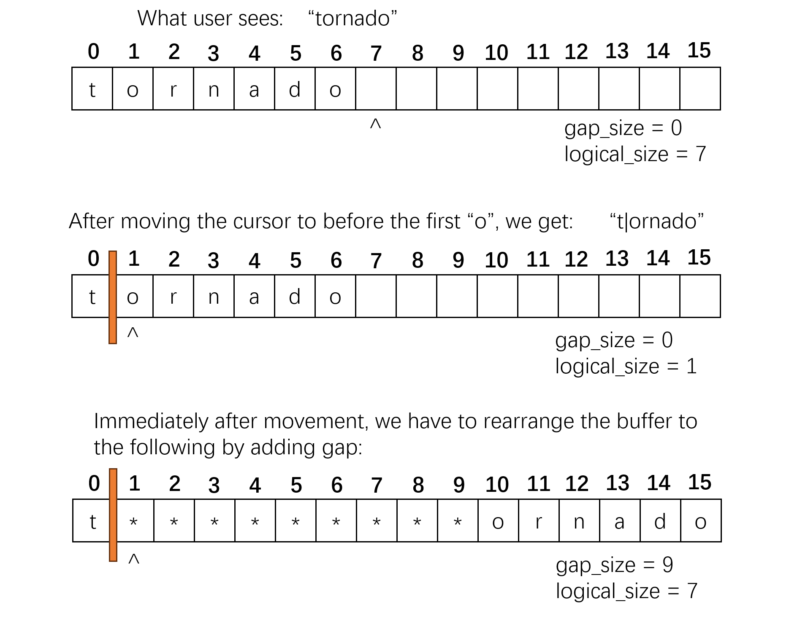
> Basically we are moving whatever after the cursor to the back of our buffer.
> 
> Now when we move the cursor to the right by one, we should rearrange the buffer again by shifting the next character to where the cursor is and keep the gap size fixed:
> 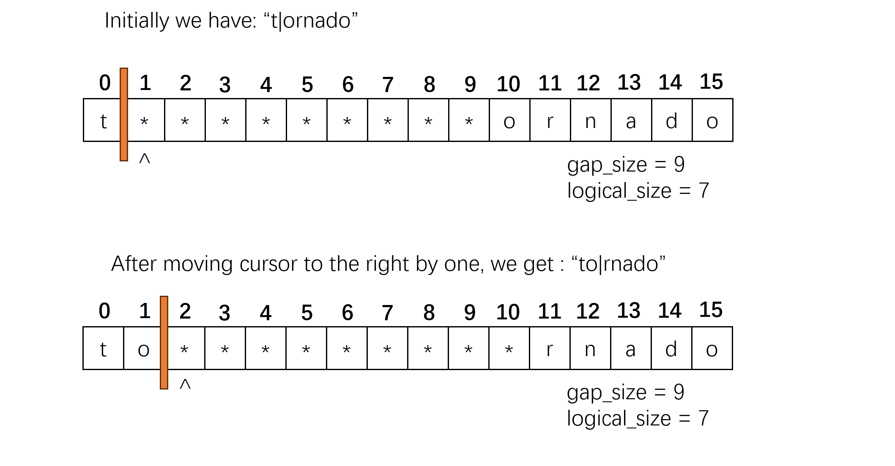
> We could also move the cursor by an arbitrary amount(jump):
> 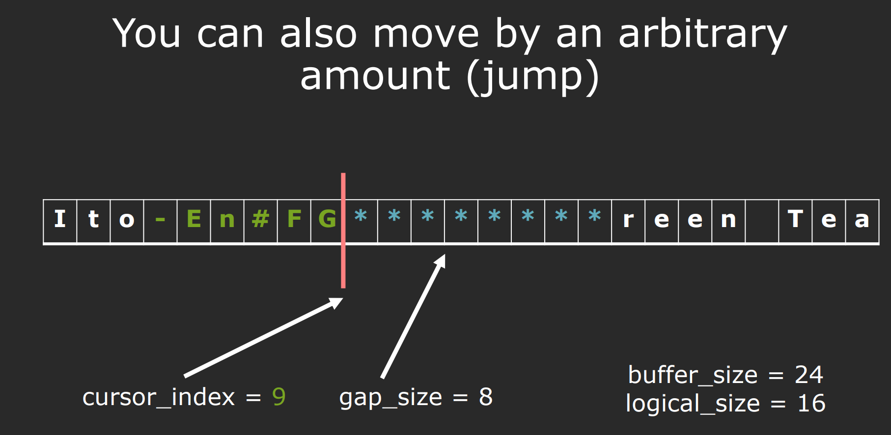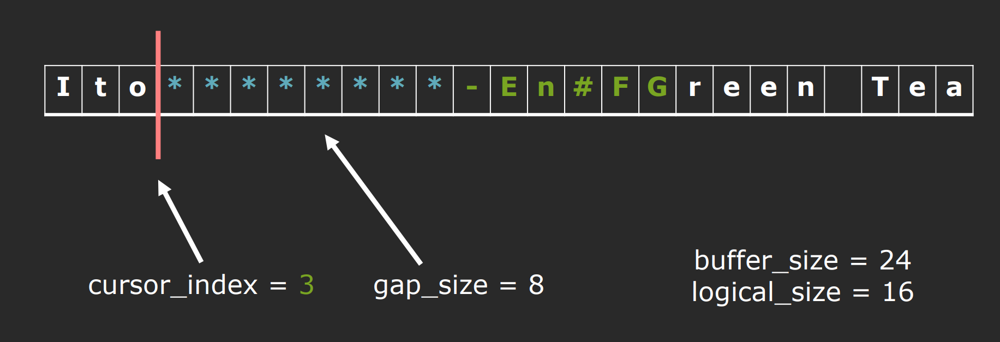

## Element Random Access and Edit
> [!concept]
> Generally, randomly accessing element is easy, just by indexing into the underlying array. But there is one thing worth noting:
> 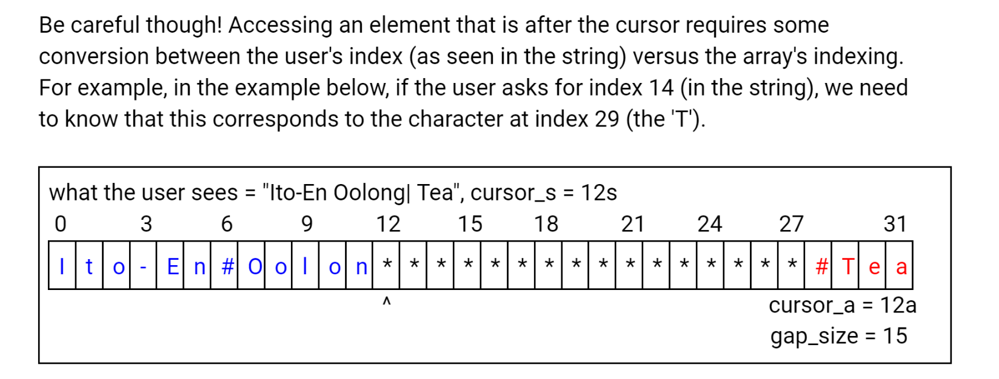

## Reserve - Resize
> [!important]
> 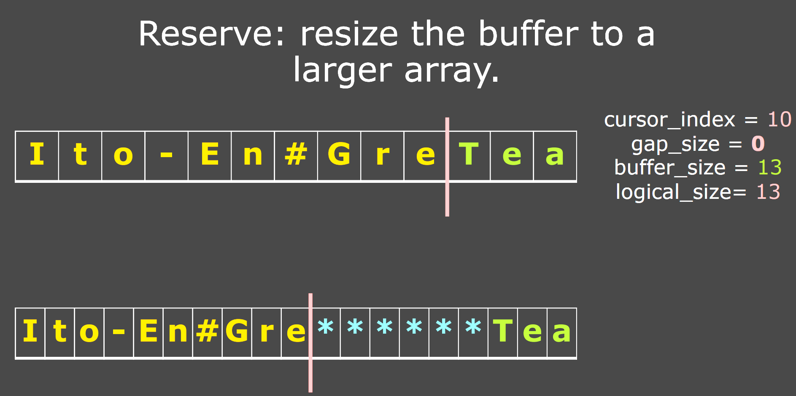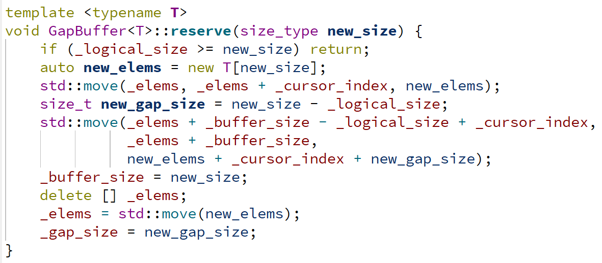

## Full Implementation

# Part 2  Const Correctness
## Const Correctness Interface
> [!concept]
> 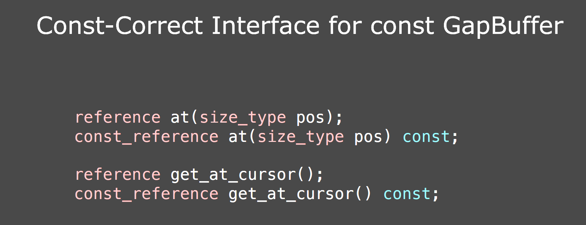

## Dependent Qualified Names - typename
> [!concept]
> 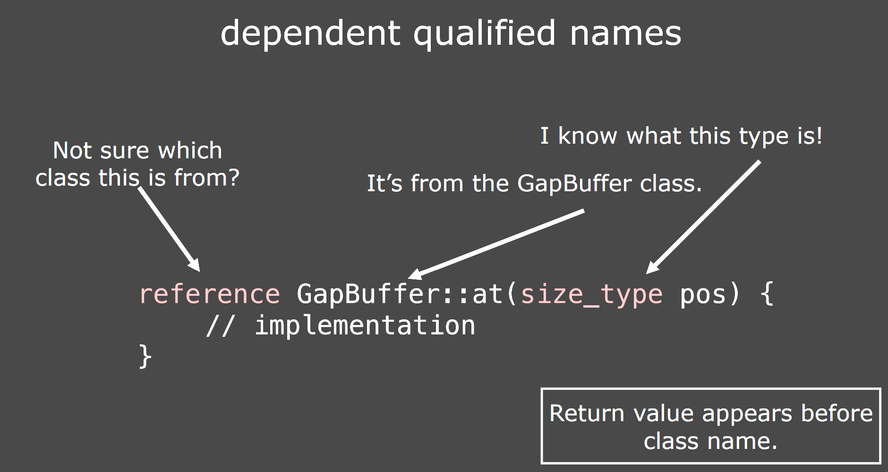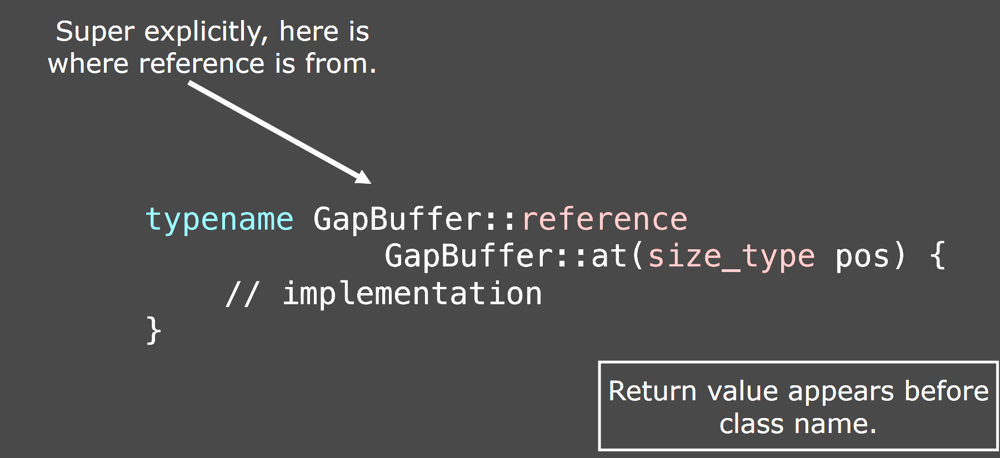

## static_cast/const_cast trick
> [!important]
> 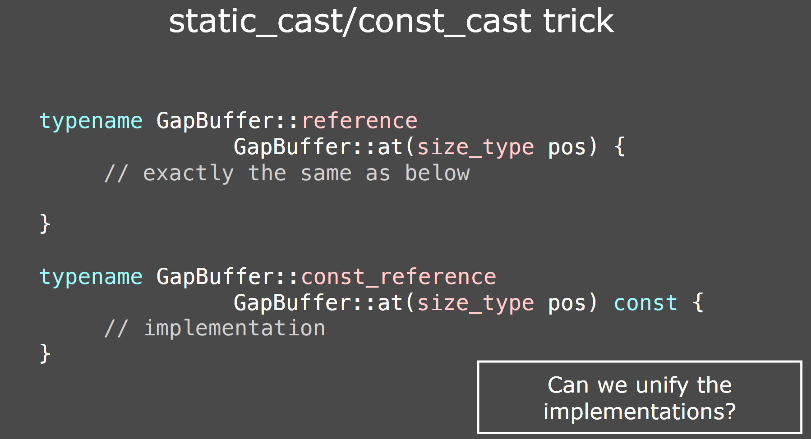
> Since our non-const implementation is exactly the same as the const one, can we just reuse the code in the const implementation for our non-const one? 
> 
> 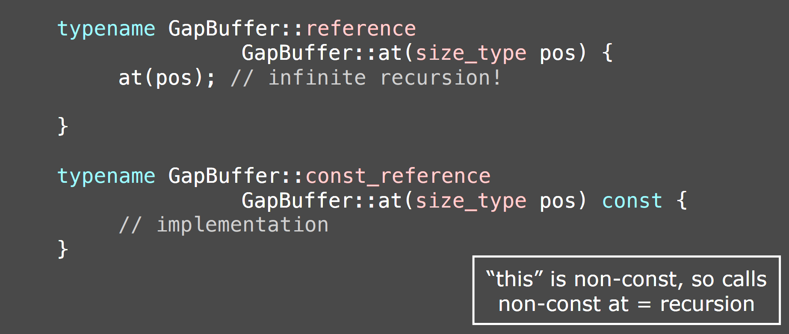
> 
> If we directly call `at(pos)`, since inside the non-const member function, we are only able to call non-const member function, thus the compiler will decide to call non-const version, even if we have implemented the const version, which results in infinite recursion. But we could solve it using what is called "static_cast/const_cast trick" as shown below:
> 
> 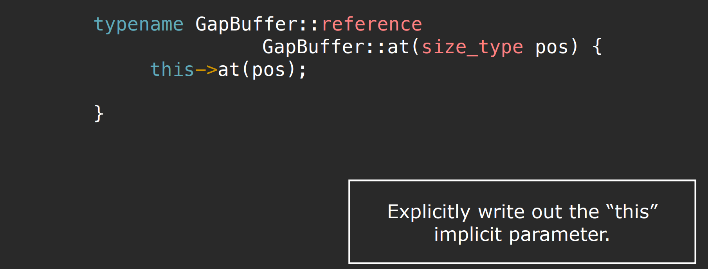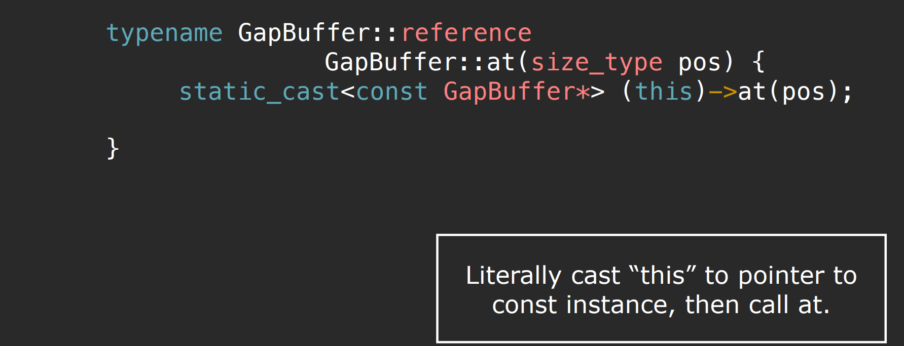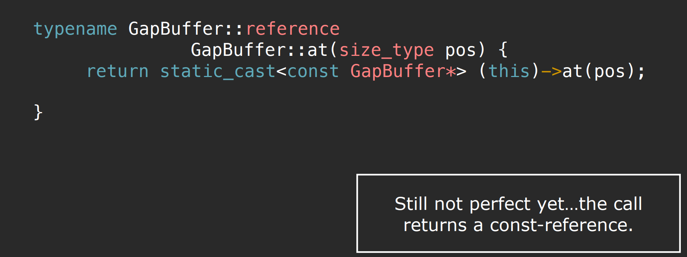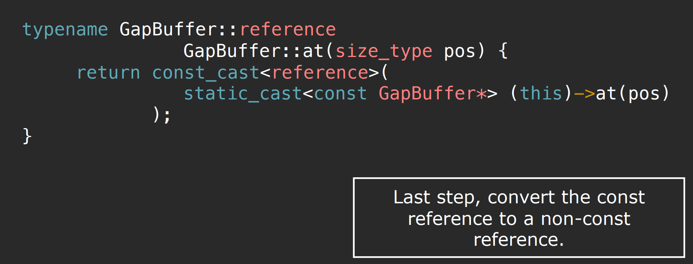

# Part 3: Operator Overloading

# Part 4: Template Gap Buffer(Nothing)
> [!concept]
> Just change non-template implementation to template one.

# Part 5: Iterator Classes

# Part 6: Special Member Functions

# Part 7: Move Semantics

# Part 8: RAII and Smart Pointers

# Part 9: Emplacement